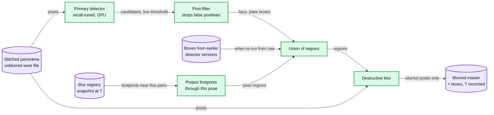
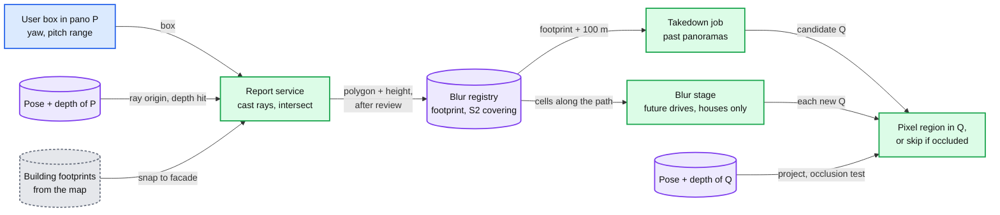
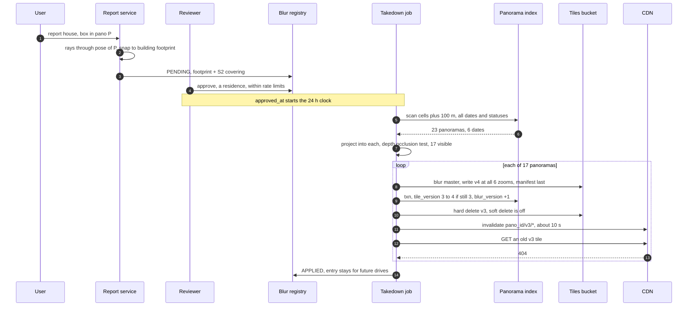
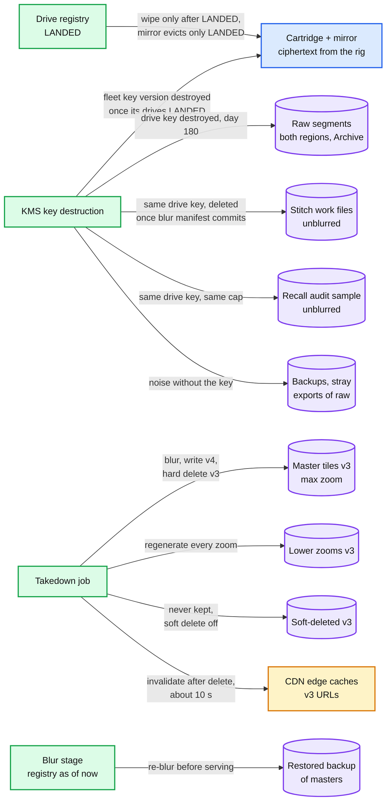

# Deep dive: privacy, blur and takedowns

> One-line answer: blur is destructive and recall-first, and the regions it blurs are a pure function of (panorama, detector version, blur registry at time T) that only ever adds; a blur request is stored as a footprint on the ground with an S2 covering, so one approval reaches every past panorama that can see it and, for a house, every future drive; a takedown writes a new tile version at every zoom, flips it in one transaction, hard-deletes the old version (soft delete off), then invalidates one CDN path and checks for a 404, within 24 h of approval; and unblurred raw, the one copy nobody can blur, is crypto-shredded at 180 days.

Related: [`../solution.md`](../solution.md) §4.5 and §5.5, [`processing-pipeline-and-reprocessing.md`](processing-pipeline-and-reprocessing.md) (where blur sits, masters vs raw), [`tile-serving-and-cdn.md`](tile-serving-and-cdn.md) (versioned URLs, 30-day edge lifetime), [`storage-tiers-and-lifecycle.md`](storage-tiers-and-lifecycle.md) (crypto-shredding), [`spatial-index-and-publish.md`](spatial-index-and-publish.md) (the chunk transaction), [`../../../concepts/geospatial-index.md`](../../../concepts/geospatial-index.md) (S2 coverings).

---

## 1. Recall first, because the detector will miss

- [Frome et al., ICCV 2009](https://static.googleusercontent.com/media/research.google.com/en//archive/papers/cbprivacy_iccv09.pdf): hand-counted recall of 89.0% for faces (90.7% on a second test set) and 94 to 96% for plates. An off-the-shelf state-of-the-art face detector got under 78%. Users report the misses, which are then blurred in the live product.
- Their shape, and ours: a **high-recall primary detector** at a low threshold, then a **post-filter** that removes false positives without giving back recall. Target: at least 95% of faces on the audit set (solution §10.2).
- The asymmetry sets the threshold. **Over-blur is a bug**: a blurred shop sign or statue. **A miss is an incident**: an identifiable person, a regulator, a headline.
- Misses are a daily flow, not an edge case. Assume 1 visible face per 10 panoramas (assumption): 15 M panoramas a day is 1.5 M faces. At 89% recall ~165k go live unblurred each day, at 95% ~75k. Reports, the registry and the backfill lane exist for that flow.
- Recall is measured the paper's way: a weekly hand-counted audit set (solution §10.9). That set is unblurred by necessity, so it lives under raw's rules: the drive's key and the 180-day cap.

## 2. Blur is destructive, and a pure function that only adds

- **Destructive.** Masters hold blurred pixels only. The alternative, an unblurred master plus a mask applied at serve time, keeps an unblurred copy of every panorama forever, one serving bug away from exposure, and breaks the 180-day cap. What we give up: an over-blur cannot be undone once raw is shredded. The street is re-driven.
- **Only adds, from either source.** From masters, blurred pixels cannot come back whatever a new model does. From raw (within 180 days), a new model might miss what an old one caught, so the stored boxes of older versions are an input. The registry only grows. Automation never removes an entry.
- **The publisher enforces it.** It refuses any output whose `blur_version` is older than the panorama's current one and re-blurs it with the current registry first, so a pipeline rollback cannot resurrect pre-takedown pixels.
- **T is recorded per drive run**, the registry snapshot the blur stage read. The publish transaction re-checks the registry for entries approved after T (solution §4.3 step 3), and the launch gate in §8 builds on it. Same inputs give the same regions, so a retried blur is harmless.

## 3. Footprints on the ground, not boxes in one image

- **Report to footprint.** The user's box is a yaw and pitch range in panorama P. P's pose gives the camera position and heading. Cast rays through the box and intersect them with P's depth. For a house, snap to the building footprint from the map, which is steadier than depth through trees. Result: a polygon on the ground plus a height, covered by S2 level-20 cells (~77 m² each, so a ~150 m² house, an assumption, is a handful of cells).
- **Footprint back into panorama Q.** Project the polygon and height through Q's pose into Q's pixels. If Q's depth along that ray is much shorter than the distance to the footprint, a wall or a truck is in the way: skip it.
- **Time scope depends on the kind.** A house stays put. A face walks away.

| Kind | Matches | Future drives | Why |
|---|---|---|---|
| House, other fixed object | Every panorama of every date that can see it | Yes | It will be there next year |
| Face, plate | Only the panoramas of that capture | No | Applied to later drives, it would blur whoever stands there next, forever |

## 4. The blur registry

- **Key.** One row per covering cell, `(s2_cell, request_id)`, carrying kind, footprint, height, status and `approved_at`. A parent S2 cell's id range contains its children's, so "every entry near this road" is one range scan at a coarser level (solution §10.1).
- **Reader 1, the takedown job.** One footprint in, every panorama of every date and status that can see it out: an index scan of the footprint's cells plus ~100 m (4 to 9 level-16 cells of ~140 m), then the visibility test.
- **Reader 2, the blur stage of every drive**, fresh or reprocessed: house and fixed-object entries in the level-16 cells along the path plus ~100 m. 150 km / 140 m = ~1,070 cells long, 2 to 3 wide, so ~3,000 range scans per drive, ~3 M a day, ~35 a second. Trivial.
- **Size.** Germany's 244,237 opt-outs at ~4 cells each is ~1 M rows. Small enough to cache per region in every blur worker.
- **The race, and the publish-time re-check.** Drive D blurs a shard at T1 and publishes it at T2. A house request for that street is approved in between: the takedown scan may run before D's rows exist, and D's blur never saw the entry. solution.md closes it in the chunk transaction (§4.3 step 3, §5.5 fix 3): read registry entries in the chunk's S2 cells approved after T1, and send any hit back to blur instead of publishing it. The re-blur is cheap, since only the new footprints are added to an already-blurred output. Same strongly consistent database, so the check is exact.

## 5. Review policy and abuse

| Kind | Approval | Why | Abuse control |
|---|---|---|---|
| Face, plate | Automatic | Over-blurring them is harmless | Per-account rate limit |
| House, other fixed object | Human | Permanent, and irreversible after day 180. A business could blur a rival's storefront | Per-account and per-area limits, audit trail |

- Limits are assumptions: 5 house requests per account per day, and a review alert when one level-16 cell gets more than 20 in a day (an abuse campaign, or a real neighbourhood opt-out that should be batched).
- Review load at Germany's scale: 244,237 requests x 2 min each (assumption) = ~8,100 reviewer-hours, ~1,000 eight-hour days. 100 reviewers take ~2 weeks, which is only workable before launch (§8).

## 6. Takedown: from report to verified, inside 24 h

The checklist per panorama, and why each step is where it is:
1. **New version at every zoom.** A 200 px face at z5 (assumption) is still 50 px at z3. ~6 to 12 of 683 tiles change. The rest are server-side copies, so `v{n+1}` is a complete set. Tile manifest last.
2. **One transaction.** `tile_version` moves from n to n+1 only if it is still n, and `blur_version` goes up. A restarted job re-runs it safely.
3. **Hard delete `v{n}` at origin** on a bucket with [soft delete](https://cloud.google.com/storage/docs/soft-delete) off (GCS keeps deleted objects 7 days by default). No wait first: a client with up to ~6 min old metadata (5 min cache plus 1 min at the CDN for `GET /panos/{id}`) gets a 404 on `v{n}` and refetches metadata (assumption). A few grey tiles beat a re-exposed face.
4. **Then invalidate `/{pano_id}/v{n}/*`**: one request, ~10 s, no limit on objects ([Cloud CDN](https://cloud.google.com/cdn/docs/cache-invalidation-overview)). Invalidate before the delete and the first stale client refills the edge from origin, where the tile lives up to 30 more days.
5. **Verify.** Fetch an old URL, expect 404, and only then mark the request APPLIED.

- **Budget.** Invalidation is capped at 500 requests a minute. A wave of 10k panoramas is 10k / 500 = 20 min of the entire budget, and ~20k CPU-s of re-tiling. The ceiling is 500 x 1,440 = ~720k panoramas a day, shared with everything else that invalidates. Bulk model backfills do not get per-panorama invalidation for that reason ([pipeline deep dive](processing-pipeline-and-reprocessing.md) §10).
- **SLO: approved to unservable in 24 h at 99.9%.** The mechanical path is minutes. The 24 h absorbs queueing behind waves, and retries. A request past 24 h pages (solution §8): it is legal exposure.

## 7. Every place a face pixel can live

- **Keys reach what lifecycle rules miss.** Everything unblurred that a drive produces (raw, stitch files, the audit sample) sits under a key wrapped by that drive's key, so the day-180 shred reaches copies nobody remembered to delete.
- **A restore is a publish.** Restored masters pass through the blur stage with the registry as of now before anything is served. Cheap, because blur only adds.

## 8. Germany 2010 as a scale test, and the registry-before-publish gate

- Before Street View launched in Germany, 244,237 of 8,458,084 households in the 20 largest cities (2.89%) opted out ([Google Europe Blog](https://europe.googleblog.com/2010/10/how-many-german-households-have-opted.html)). Google warned that some requested houses would still be visible at launch.
- **Before launch it is a batch job. After launch it is a CDN problem.** At 17 visible panoramas per house (solution Flow 4), that is up to ~4.2 M takedowns. Even if neighbours share panoramas 5x (assumption), ~830k invalidations is ~28 h of the whole budget, above the ~720k a day ceiling. Before launch there is nothing to invalidate: the blur stage just reads more footprints.
- **The gate.** A city is a set of S2 ranges with an `opt_out_closed_at` time. The publisher's chunk transaction refuses a chunk in a gated range unless the drive's registry snapshot T is after `opt_out_closed_at` and no house request is still PENDING in its cells. Drives blurred earlier are re-blurred from their blurred outputs for the new footprints only.
- It is the publish-time re-check (§4, solution §4.3 step 3) with a deadline. Every chunk already asks "any approvals in these cells after T?". The launch gate adds "and nothing pending".

## 9. Raw: the one copy nobody can blur

- Blurring raw would mean rewriting 1.35 TB per car-day, and it would kill re-stitching, the only reason raw is kept.
- **The cap.** The EU Article 29 Working Party's letter of 2010-02-11 asked Google to cut retention of unblurred images from one year to six months ([EDRi](https://edri.org/our-work/edrigramnumber8-5article-29-wp-google-street-view/)). Google's commitment was 12 months from publication. We use 180 days from capture, stricter than both: publication is p95 7 and p99 21 days after capture, so raw dies ~160 to 173 days after publication.
- **Crypto-shred.** The rig encrypts every segment with a fresh per-drive DEK and wraps it with the fleet's KMS public key, so the station only ever moves ciphertext. The registry re-wraps the DEK under a per-drive key. Destroying that key at day 180 turns every copy into noise at once: both regions, Archive, backups, stray exports. Deleting the bytes is housekeeping, since Archive bills its 365-day minimum either way. Status RAW_SHREDDED.
- **Operability.** A shred job over a day behind is a ticket, and at 7 days it pages, because that is a compliance breach (solution §8). A weekly check tries to decrypt one segment from a sample of RAW_SHREDDED drives and expects failure (assumption).

## 10. GDPR erasure for a person

- **Published imagery: blur is the erasure.** The request becomes a registry entry and takes the takedown path, under the same 24 h SLO.
- **Raw: the 180-day shred already bounds it.** An expedited request shreds one drive's key early. That is why the key is per drive: a per-day key would take 1,000 drives' re-stitch window with it.
- **Order matters.** Registry entry first. If the drive is still in the pipeline, let it publish (p95 7 days), then shred: shredding mid-pipeline throws away 150 km of everyone else's street. If it is already PUBLISHED, shred now. The cost is the option to re-stitch that car-day, worth at most a ~$1k re-drive.
- Detection boxes and footprints are coordinates, not pixels. The reporter's account id on `BLUR_REQUEST` is the personal field the registry holds.

## 11. What the interviewer asks next

- **"A business got a rival's storefront blurred. Undo it?"** A human revokes the entry. The pixels come back only from raw within 180 days (re-stitch, re-blur without the entry) or from a re-drive. That asymmetry is why houses are reviewed before approval, not after.
- **"Why not apply a face report to future drives too?"** It would blur whoever stands on that spot next year, forever. Millions of reports would leave permanent smudges for no privacy gain. A person who wants their doorway gone for good files a house request.
- **"The CDN invalidation API is down for 6 hours."** Origin is already clean, because delete comes first. Only edges already holding `v{n}` can serve it, and only to a client asking for the old URL. The job retries, the clock keeps running, and it pages at 24 h.
- **"A house request lands while a drive of that street is mid-pipeline."** The chunk transaction's "approved after T" re-check (solution §4.3 step 3) sends those panoramas back to blur before the flip.
- **"How do you know recall is 95% in production?"** A weekly hand-counted audit set, the paper's method. A new detector canaries on 1% of drives against it before going to 100%.
