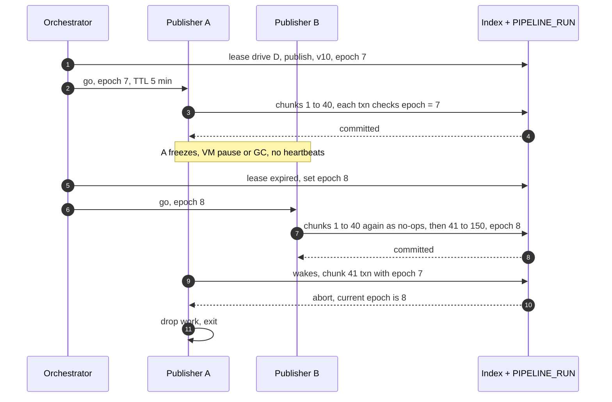
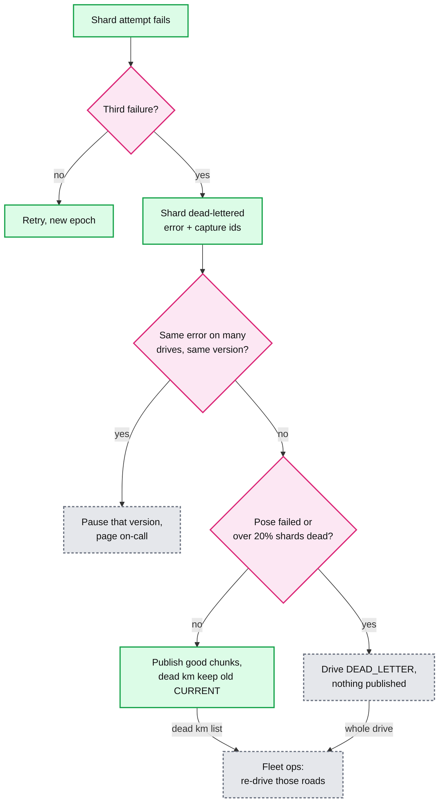
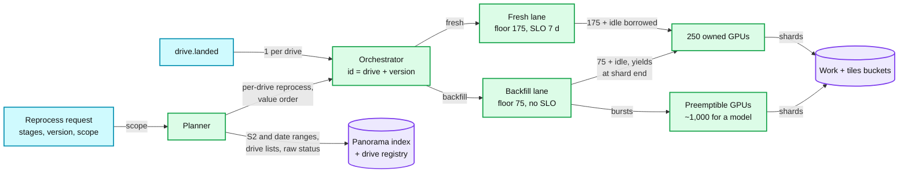

# Deep dive: processing pipeline and reprocessing

> One-line answer: each LANDED drive gets one durable workflow that runs pose and select once, then stitch, blur, QA and tile over ~150 shards of ~100 panoramas (one shard = ~1 km = one publish chunk); every output sits at a deterministic path with a manifest written last, every stage commit and publish transaction checks a lease epoch so a zombie cannot write, a shard that fails 3 times is dead-lettered while the drive's good kilometres still publish, and reprocessing is a request (stages, version, scope) that runs in a backfill lane: blur and tile from blurred masters forever, re-stitch and re-pose from raw only within 180 days.

Related: [`../solution.md`](../solution.md) §4.2 and §5.3, [`../../../concepts/temporal-durable-execution.md`](../../../concepts/temporal-durable-execution.md) (one workflow per drive), [`../../../concepts/leases-fencing-clocks.md`](../../../concepts/leases-fencing-clocks.md) (epochs), [`privacy-blur-and-takedowns.md`](privacy-blur-and-takedowns.md) (what blur must never lose), [`storage-tiers-and-lifecycle.md`](storage-tiers-and-lifecycle.md) (why raw dies at 180 days), [`spatial-index-and-publish.md`](spatial-index-and-publish.md) (the chunk transaction), [`tile-serving-and-cdn.md`](tile-serving-and-cdn.md) (the invalidation budget).

---

## 1. The per-drive DAG, and where the privacy boundary sits

```mermaid
%% One drive's stages with what each reads and writes. Everything inside the box touches unblurred pixels and needs the drive's key. Blur is the only way out.
flowchart LR
    subgraph Z["Unblurred zone: raw privacy class, per-drive key"]
        RAW[("Raw segments<br/>1,400 x 1 GB")]
        POSE["Pose<br/>whole drive"]
        SEL["Select<br/>1 capture per slot"]
        STI["Stitch<br/>per shard"]
        WS[("Stitched panos<br/>unblurred work files")]
        BL["Blur<br/>detector + registry"]
    end
    PO[("Poses, road positions<br/>no pixels")]
    BR[("Blur registry")]
    BM[("Blurred panos<br/>+ detection boxes")]
    QA["QA<br/>scores, 1% human"]
    TI["Tile<br/>683 tiles per pano"]
    TB[("Tiles v1<br/>manifest last")]
    IDX[("PANORAMA rows<br/>STAGED")]
    RAW -->|"sensor records, thumbnails"| POSE
    POSE -->|"pose per capture"| PO
    PO -->|"road positions"| SEL
    RAW -->|"per-camera thumbnails"| SEL
    SEL -->|"kept list in shards,<br/>15 M of 30 M a day"| STI
    RAW -->|"7 images, kept captures"| STI
    PO -->|"pose"| STI
    STI -->|"equirect panos"| WS
    WS -->|"files named in manifest"| BL
    BR -->|"footprints in drive cells"| BL
    BL -->|"destructive blur"| BM
    BM -->|"blurred panos"| QA
    QA -.->|"fail: second-best capture"| STI
    QA -->|"passed"| TI
    TI -->|"tiles"| TB
    TI -->|"rows"| IDX
    class POSE,SEL,STI,BL,QA,TI service
    class RAW,WS,PO,BR,BM,TB,IDX store
    classDef service  fill:#dcfce7,stroke:#16a34a,stroke-width:2px,color:#111
    classDef store    fill:#ede9fe,stroke:#7c3aed,stroke-width:2px,color:#111
```



| Stage | Reads | Writes | Unit | Cost | Fleet at 15 M panoramas a day |
|---|---|---|---|---|---|
| Pose | Sensor records, thumbnails for visual matching, road graph | Pose and road position per capture | Whole drive | ~8.6k CPU-s per drive (100 cores / 1,000 drives) | ~100 cores |
| Select | Poses, road positions, per-camera thumbnails | Best and second-best capture per slot, shard boundaries | Whole drive | Small (thumbnails), not sized in §2 | n/a |
| Stitch | 7 raw images of each kept capture, rig calibration, pose | Unblurred equirectangular panorama | Shard | ~5 CPU-s per panorama | ~870 cores |
| Blur | Stitched panorama, registry footprints, older boxes | Blurred panorama, detection boxes, registry snapshot T | Shard | ~1 GPU-s per panorama | ~175 GPUs |
| QA | Blurred panoramas | Quality scores, pass or fall back, ~150 panoramas per drive for humans | Shard | Small, not sized in §2 | n/a |
| Tile | Passed blurred panoramas | 683 tiles (~27 MB), tile manifest, STAGED rows | Shard | ~2 CPU-s per panorama | ~350 cores |
| Publish | STAGED rows, tile manifests, registry entries after T | Slot flips | 1 km chunk | 1 transaction per ~100 panoramas | ~1.7 chunk transactions/s |

- **The boundary is one stage wide.** Pose and select read raw metadata and thumbnails. Stitch reads full raw images. Blur reads unblurred pixels and writes blurred ones: it is the way out. Everything after it (QA, the 1% human sample, tile, 3D, sign extraction) sees only blurred pixels and poses. Only the pipeline's service identity can unwrap the per-drive key.
- **Select before anything expensive.** Picking one capture per ~10 m slot from pose and thumbnails, and dropping red-light duplicates, turns 30 M captures a day into 15 M panoramas. That is what holds stitch and blur at ~870 cores and ~175 GPUs. A capture that fails QA after blur falls back to the slot's second-best, which is stitched and blurred on its own.
- **Stitch output is as sensitive as raw.** An unblurred stitched panorama is raw with better geometry: same key, same cap, deleted once the blurred output commits (solution §4.2). If that rule broke: a stitched panorama is about its max zoom level, 512 x 40 KB = ~20 MB, so ~300 GB per drive and ~2 PB of unblurred work files fleet-wide if kept until publish (p95 7 days).

## 2. Why a durable workflow per drive, not Kafka between stages

| Question | Durable workflow per drive | Kafka topic between stages |
|---|---|---|
| "Where is drive D?" | One workflow history: stage, version, shards done, failures | Join 5 consumer groups' offsets with a bucket listing |
| A stage waits hours or days for the 1% human QA | A durable timer plus a "QA done" signal | The consumer blocks its partition or parks the message in another store |
| Payload | 1.35 TB in, ~405 GB of tiles out. Steps pass paths | A message is a path too. Offsets say "done" while the bucket says "missing": two truths |
| Reprocess with v11 | Start workflow `drive_id + v11` in the backfill lane | Re-publish into the topics fresh drives use. Backfill starves fresh |

- The load is tiny for an orchestrator: pose and select once each, 4 stages x 150 shards and 150 publish chunks is ~750 activities per drive, ~750k a day, ~9 a second. A queue still has one job: carry `drive.landed`, one event per drive, deduped by workflow id (solution §10.5). Inside a stage, FlumeJava-style batch over a shard's files is fine. The workflow code is the DAG, under determinism rules ([concept note](../../../concepts/temporal-durable-execution.md)).

## 3. Shards inside a drive, and what a retry costs

- **One shard = ~100 panoramas = ~1 km of road = one publish chunk.** A car-day of 15k panoramas is ~150 shards. Select cuts them at slot boundaries, so a slot's second-best capture (the QA fallback) sits in the same shard. Pose is not sharded: it smooths the whole trajectory, and at ~2.4 CPU-hours per drive a full retry is cheap.
- **Retry cost.** Stitch: 500 CPU-s per shard vs 75k CPU-s (~21 CPU-hours) for the drive. Blur: 100 GPU-s vs 15k GPU-s. Tile: 200 CPU-s vs 30k. Sharding saves 99.3% of every retry. On a 16-core worker (assumption) a stitch shard is ~30 s: the "~1 minute of work" in solution §10.2.
- **Why not 10 or 1,000 a shard?** At 10, 150k shard tasks per stage per day become 1.5 M: 10x the orchestrator events and per-object overhead to save another 0.6%. At 1,000, a dead shard withholds 10 km instead of 1 (§6).

## 4. Deterministic paths, manifest last, stable pano_id

- **Paths and commit order.** `work/{drive_id}/{stage}/{pipeline_version}/{shard}`: a retry writes the same path, and v10 and v11 sit side by side, which makes a canary and a rollback cheap. Per shard: data files, then a manifest (file list, size and CRC32C per file), then one transaction on `PIPELINE_RUN` that sets DONE and `output_manifest`, guarded by the epoch (§5). A reader never lists a prefix. It opens the committed manifest and reads exactly those files. Files with no committed manifest are an abandoned attempt, swept by a lifecycle rule on `work/`. The manifest pins CRCs because "a re-run writes identical bytes" is a hope: GPU inference is not always bit-identical. A zombie that overwrites a shard file after the manifest committed fails the CRC check on read, and the shard re-runs.
- **Stable `pano_id = hash(drive_id, capture_seq)`.** A v11 re-run produces the same ids, so slot pointers, historical rows, shared links and blur-request audit trails keep pointing at the right panorama. A new id per run would put two rows on one capture and let a slot flip to a duplicate.
- **Work paths are overwritten. Tile paths never are.** A served `tiles/{pano_id}/v{n}/...` object is never rewritten. Reprocessing writes `v{n+1}`, tile manifest last, and bumps `tile_version` in a transaction, exactly like a takedown.

## 5. Leases, epochs, and the fenced publish

A lease maps `(drive, stage, version, shard)` to `(worker, epoch, expiry)`, with the epoch on `PIPELINE_RUN.lease_epoch`. Assumption: 5 min TTL, heartbeat every 30 s. The worker never trusts its own clock. The orchestrator decides expiry and the database decides who wins, because every write that matters checks the epoch inside its own transaction: the stage commit and every publish chunk ([fencing](../../../concepts/leases-fencing-clocks.md)).



- **Cancel and freeze are epoch bumps.** When QA rejects drive D, or the privacy team freezes detector v9 (solution §10.4), the orchestrator bumps the epoch. A publisher that read "go" before the freeze cannot flip a single slot after it. Chunk transactions are idempotent, so B never needs to know where A stopped.
- **A second, privacy-specific guard.** The publisher refuses outputs whose `blur_version` is older than the panorama's current one, and re-blurs them with the current registry first. So a rollback to v10 outputs cannot resurrect pixels from before a takedown.

## 6. Poison drives and the partial-publish policy



- A dead shard carries the error and the failing capture ids, so fleet ops reads "camera 4 dark after 11:02", not a stack trace. Thresholds are assumptions: over 20% of a drive's shards dead usually means the rig, not the road. The breaker trips when one error dead-letters shards on over 1% of a day's drives within an hour: a bad release looks like 1,000 poison drives, and pausing the version beats dead-lettering all of them.
- **Why partial publish is safe with slots.** A dead shard is exactly one 1 km chunk whose tile manifests never exist, so the publisher's HEAD fails and skips it: no half-published panorama. Those slots keep their older CURRENT panorama (or stay empty on a new road, the state before this drive). Arrows resolve slot to slot at read time, so the fresh km next door links to the older panorama: no dead arrows. The re-drive has a newer `capture_time` and takes the slots through the normal path: no merge logic. The alternative, holding the whole drive, makes 149 good km wait for 1 km of re-drive.

## 7. Two lanes, one GPU pool



- **Floors, not walls.** Fresh has a floor of 175 GPUs, exactly its average need on a driving day (15 M GPU-s / 86,400 s = ~174). It holds a 7-day SLO because it can also borrow idle backfill GPUs, up to 250 (1.4x). Backfill borrows idle fresh GPUs and yields at the next shard boundary, losing at most ~100 GPU-s per GPU.
- **Backfill gets more than 75 on average.** Fresh is 3.75 B GPU-s a year, ~119 GPUs averaged over the calendar year (250 driving days, not 365). The other ~130 owned GPUs go to backfill. Even so, a model launch needs ~1,000 mostly preemptible GPUs for weeks to months (table below): the backfill lane, not fresh drives, sizes the pool.
- **Value order.** Current imagery in busy cells first, then the long tail, history last. Preemptible GPUs serve only backfill, because a preempted shard is just a retry. Takedowns bypass both lanes: no detector, only a region blur and re-tile on CPU, under their own 24 h SLO.

| Workload (1 GPU-s per panorama) | Panoramas | GPU-days | On ~130 spare owned GPUs | On ~1,000 GPUs |
|---|---|---|---|---|
| Fresh, one driving day | 15 M | ~174 | n/a | n/a |
| Fresh, one year | 3.75 B | ~43k | n/a | n/a |
| New model, busy current imagery (20% of ~4 B) | ~0.8 B | ~9.3k | ~71 days | ~9 days |
| New model, all current imagery (108 PB / 27 MB) | ~4 B | ~46k | ~1 year | ~46 days |
| New model, 5 years of history | ~19 B | ~220k | ~4.6 years | ~7 months |

## 8. A reprocessing request is data

```yaml
reprocess_request:          # example shape
  stages: [blur, tile]
  pipeline_version: v11     # new detector, tiler unchanged
  source: masters           # masters | raw
  scope: {s2_ranges: [...]} # or date_range, or drive_ids
  lane: backfill            # value order: busy current cells first
```

- The planner expands scope to drives (S2 and date ranges through the index, whose rows carry `drive_id`) and calls `POST /v1/drives/{id}:reprocess {stages, pipeline_version}` per drive, in value order. It refuses, with a reason, what cannot run: `source: raw` on a drive that is RAW_SHREDDED.
- One workflow per (drive, version), so resubmitting is a no-op. Cancel is an epoch bump. Rollback is a new request pointing at the old version, subject to the `blur_version` guard (§5). The request log plus `blur_version` answers the audit question "which detector produced these pixels, and when".

## 9. What can be reprocessed from what

| Change | Stages re-run | Source | Available | Cost per panorama |
|---|---|---|---|---|
| New blur model | Blur, then tile only where it found something new | Blurred masters | Forever | 1 GPU-s, plus 2 CPU-s on ~2.6% |
| Approved blur request | Region blur, tile | Blurred masters | Forever | ~2 CPU-s, no detector |
| New tile size or zoom levels | Tile | Blurred masters | Forever | ~2 CPU-s |
| Better road snapping, new road graph | Pose placement only, publish | Sensor logs (~2% of raw, Coldline, kept) | Forever | Metadata only |
| Seam or calibration fix, pose change that moves pixels (levelling) | Pose if needed, stitch, blur, QA, tile | Raw | 180 days | ~7 CPU-s + 1 GPU-s |
| Undo an over-blur, or pick the other capture in a slot | Select if needed, stitch, blur, QA, tile | Raw | 180 days | Same |
| Any raw-only change after day 180 | None | Nothing left | Never | Re-drive, ~$1k per car-day |

- Re-reading a drive's raw from Archive costs ~1,260 GiB x $0.05 = ~$63 of retrieval, against ~$1k to re-drive. Under 5% of drives are re-read (solution §5.2). From raw, blur takes the new detector plus the stored boxes of every older version plus the registry now, so a re-stitch never publishes less blur than before ([privacy deep dive](privacy-blur-and-takedowns.md) §2).

## 10. The blur-model backfill: from ~19 B re-tiles to ~500 M

Run the new detector on the blurred master. The old blur destroyed what the old model found, so a confident detection that does not overlap a stored old box is, by construction, something new. Re-tile only those panoramas, typically a few percent: 19 B x ~2.6% = ~500 M.

| | Re-tile all ~19 B | Re-tile ~500 M |
|---|---|---|
| Tile CPU at 2 CPU-s | ~440k CPU-days | ~11.6k CPU-days |
| New tile bytes at 27 MB | ~513 PB | ~13.5 PB |
| CDN invalidations at 500 a minute | ~72 years | ~694 days |

- **Selectivity does not save the GPU pass.** Every panorama in scope still costs 1 GPU-s to find out. Scope and value order (§7) are the GPU lever. Selectivity is the write, storage and CDN lever.
- **Even 694 days of invalidations will not fit, and takedowns own that budget.** So a backfill bumps the version, hard-deletes `v{n}` at origin, invalidates only the hottest re-tiles (first in the value order) within the budget left after takedowns, and lets the rest age out of the edge within the 30-day tile lifetime. Say the trade-off: for up to 30 days, an edge that already holds an old tile can serve it to a client with stale metadata or a saved URL.

## 11. What the interviewer asks next

- **"Why not keep raw forever and re-run everything?"** A better detector only adds blur, which works on masters. Raw buys re-stitch and re-pose, worth ~6 months, at ~340 PB a year and against a privacy cap. After 180 days a stitch bug is fixed by re-driving.
- **"Your stages are not deterministic. Is a retry still safe?"** Yes. Safety comes from the committed manifest (with CRCs) and the epoch check, not from identical bytes. Exactly one attempt's manifest commits.
- **"How do you roll out detector v11?"** Canary on 1% of fresh drives against the human audit set (target: at least 95% face recall), then 10%, then 100% per country. Paths carry the version, so rollback points the publisher at v10 and bumps v11's epoch.
- **"A bad detector published faces for 15 hours. Invalidate everything?"** No. That is ~9.4 M panoramas: ~13 days of the whole invalidation budget, but only ~110 GPU-days of re-blur, ~3 h on 1,000 GPUs (solution §10.4). Re-blur all of them at top priority, delete v9 at origin, invalidate the hot set within budget, and let the rest age out of the edge in 30 days.
