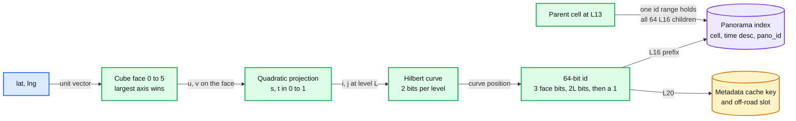
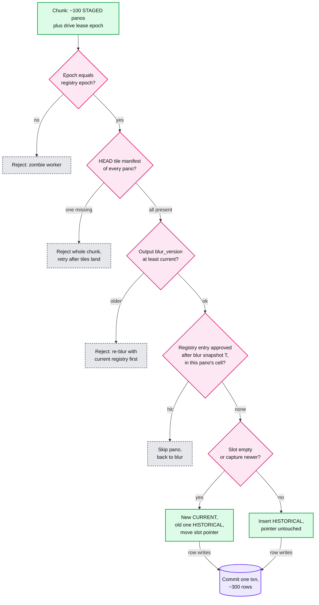

# Deep dive: spatial index and publish

> One-line answer: key every panorama row by `(s2_cell_l16, capture_time DESC, pano_id)` so a 50 m lookup is 1 to 4 short range scans that read newest first and stop once every nearby slot is resolved; keep "current" as a pointer per ~10 m road slot, moved only by a per-chunk transaction that checks the lease epoch, the tile manifest, the blur version, blur requests approved since the drive was blurred, and "newest capture wins"; resolve arrows from slot adjacency at read time; absorb hot places in the L20 cache and the CDN, not by salting keys, because writes are only ~170/s.

Related: [`../solution.md`](../solution.md) §4.3, §4.4, §5.4, [`../../../concepts/geospatial-index.md`](../../../concepts/geospatial-index.md) (geohash vs S2 vs H3, radius queries), [`../../../concepts/leases-fencing-clocks.md`](../../../concepts/leases-fencing-clocks.md) (epochs), [`../../../concepts/caching-patterns.md`](../../../concepts/caching-patterns.md), [`tile-serving-and-cdn.md`](tile-serving-and-cdn.md).

---

## 1. Why S2: one integer that is also a place



- **Cube, quadtree, curve.** 6 cube faces, each split into 4 at every level, 30 levels, cells numbered along a Hilbert curve. Cells next to each other on the curve are next to each other on the ground, so a sorted table keeps a neighbourhood in one key range.
- **The id layout is the hierarchy.** Face bits, 2 bits per level, then a single 1 bit. Every descendant's id falls in `[id - lsb + 1, id + lsb - 1]`, so "everything in this L13 cell" is one range scan over a table keyed at L16.
- **Average area is fixed by counting.** 4π x 6,371² = ~510 M km², divided by 6 x 4^16 cells, is ~19,793 m² for any cube-face split. S2's quadratic projection only makes cells more even around that average.

Verified sizes from [S2 cell statistics](https://s2geometry.io/resources/s2cell_statistics.html) (L19 derived as L18 / 4):

| Level | Average area | Edge (about √area) | Role here |
|---|---|---|---|
| 13 | 1.27 km² | ~1.1 km | A 1 km publish chunk sits in 1 to 3 of these, so its panorama rows span 1 to 3 key ranges |
| 14 | 0.32 km² | ~565 m | not used |
| 15 | 79,173 m² | ~281 m | Too coarse for the key: ~4x the rows per scan of L16 |
| 16 | 19,793 m² | ~140 m | **Index key prefix.** Smallest level wider than a 100 m query circle |
| 17 | ~4,950 m² | ~70 m | Too fine: a 50 m circle could need up to 9 scans |
| 18 | 1,237 m² | ~35 m | not used |
| 19 | ~309 m² | ~18 m | not used |
| 20 | 77 m² | ~9 m | **Metadata cache key and off-road slot.** About one slot wide |

## 2. The key and the two queries it serves

Key `(s2_cell_l16, capture_time DESC, pano_id)`, rows ~1 KB. Sizing a dense cell (assumption): a 140 m square with streets every ~70 m holds ~600 m of road, ~60 slots; 20 drives in 15 years (solution.md §5.4) is ~1,200 rows, ~1.2 MB.

| Query | How it reads | Rows touched, common case | Worst case |
|---|---|---|---|
| Current at a point | 1 to 4 scans merged newest first; first CURRENT row per slot wins; stop when every slot within 50 m has one | The newest pass of those slots: tens of rows | A nearby slot last driven 10 years ago, or with no imagery at T, keeps the scan going to the cell boundary: up to ~3 x 1,200 = ~3.6k rows, ~3.6 MB |
| Newest at or before T | Seek each scan to the first `capture_time <= T` (one seek, thanks to DESC), then the same stop rule | The first pass at or before T | Same bound |

Even the worst case is 1 to 4 sequential reads, and the L20 cache absorbs repeats. If it shows up in p99, key `SLOT` as `(s2_cell_l16, slot_id)` too: "current" then reads the ~20 slot rows within 50 m (~200 m of road, assumption) and follows their pointers, whatever the history depth.

## 3. The 50 m covering: 1 to 4 cells, about 3 on average

A 100 m wide circle inside ~140 m cells crosses at most one edge per axis, with probability 100 / 140 = 71% per axis. On a square approximation: 1 cell 0.29² = **8%**, 2 cells 2 x 0.29 x 0.71 = **41%**, 4 cells (a corner within 50 m) π x 50² / 140² = **40%**, 3 cells (near a corner but not within 50 m) **11%**. Mean ~2.8. The script in §8 measures 4 / 33 / 18 / 45% on real cell shapes in San Francisco (slightly smaller, not aligned with north). Flow 3 in solution.md scans 3: the typical case.

## 4. Slots and "exactly one CURRENT per slot"

- **Slot id.** On-road: `road_segment:offset_bucket`, 10 m buckets from pose snapped to the road graph. Off-road (plaza, trail, contributor photo): the S2 L20 cell, ~9 m.
- **Invariant.** Exactly one CURRENT per slot before and after every commit. Zero is a hole; two is a flicker between dates. Current = newest `capture_time`, not newest publish.
- **Why a pointer, not "newest per cell at read time".** Read time needs a group-by per slot on every lookup and can show two rows while a chunk is half visible. The pointer makes current an O(1) fact written under a transaction.
- **The slot row also lists its capture dates** (about 20 in 15 years), appended in the same transaction. That is the lookup response's `dates` field, served without scanning history.

## 5. The chunked publish transaction



- **Epoch** is checked inside the transaction, so a worker that paused past its lease cannot publish.
- **Tiles before visible.** The tile stage writes a per-panorama manifest last; the publisher HEADs ~100 per chunk, ~170 HEADs/s globally.
- **Blur version guard.** A rollback or late replay may carry outputs blurred before a takedown. Output `blur_version` older than the panorama's current one: reject, re-blur with the current registry first. Without it, "roll back to last week's outputs" undoes a takedown.
- **Registry re-check.** The blur stage recorded the registry snapshot time T it used. The transaction reads entries approved after T in the chunk's S2 cells; panoramas in a hit cell go back to blur, the rest publish. Without it, a house approved between a drive's blur and its publish goes live unblurred, because the takedown scan ran before those rows existed. The check is at L16 granularity, so it over-selects; the blur stage then runs the exact visibility test.
- **Idempotent.** A replayed chunk finds its panoramas published and does nothing.
- **Size.** ~170 panoramas/s x 3 row writes (new row, old row, slot) = ~520 rows/s and ~1.7 chunk transactions/s globally. Trivial.
- **Why not the whole drive atomically.** A car-day is ~15k panoramas, ~45k rows over ~150 km / 140 m = ~1,070 L16 cells: hundreds of splits in one two-phase commit, where one slow split stalls the drive and a retry redoes all of it. A 1 km chunk is ~7 to 11 L16 cells inside 1 to 3 L13 ranges. Nobody can see drive-level atomicity: Street View already mixes dates street by street.

## 6. Links, and why there is no salting

- **Current-mode arrows** are the road graph's adjacent slots (along the segment and across junctions), each resolved through `SLOT.current_pano_id` at read time. Publishing a street changes its neighbours' arrows with zero writes to old rows.
- **History-mode arrows** (a 2015 date picked) are the same drive's previous and next kept panoramas, fixed at select time and written into the row, because one drive's order never changes. Rule: materialize what is immutable, resolve at read time what moves.
- **Hot reads go to caches.** A viral place is one L20 cell. The cache key (L20 cell, date bucket) with a 5 min TTL means about one index read per cache node per 5 minutes, however many users arrive; `GET /panos/{id}` is cached 1 min at the CDN. Of ~60k metadata requests/s, ~6k reach the index.
- **No hot writes.** ~170/s globally; the busiest cell gets tens of rows when a car passes, a few times a year. Salting the key with `hash mod N` would turn 1 to 4 scans into 4N, break "one L13 range holds its children", and fix a write problem that does not exist.

## 7. Compared with Bigtable's Earth serving index

| | Google Earth, [Bigtable §8.2](https://static.googleusercontent.com/media/research.google.com/en//archive/bigtable-osdi06.pdf) | This index |
|---|---|---|
| Row key | One row per geographic segment, named so adjacent segments are stored near each other | S2 L16 cell first, so neighbours share a key range |
| Size | ~500 GB serving index over imagery in GFS (plus a ~70 TB preprocessing table) | ~1 KB x 3.75 B = ~4 TB a year, ~60 TB after 15 years |
| Load | Tens of thousands of QPS per datacenter, hundreds of tablet servers, in-memory column families | ~60k metadata req/s, ~6k/s at the index; tiles in the object store, rows carry `tile_version` |
| Time | Not described | `capture_time DESC` in the key: current and history from one sort order |
| Hot set | In memory | ~60 TB does not fit in memory cheaply, so hot answers live in the L20 cache |

## 8. Runnable Python: S2-lite, covering, sorted index, publish

Keeps from S2: 6 cube faces, the quadratic projection, a Hilbert curve per face, the 64-bit layout, parent ranges. Gives up: one curve orientation on every face (S2 rotates it so the curve continues across face edges; mine jumps there), a single-level covering by sampling the rim (exact only while cells are wider than the circle; S2's RegionCoverer mixes levels), flat-earth distance, and ids not guaranteed to equal real S2 ids.

```python
import bisect, hashlib, heapq, math, random
from datetime import date
from types import SimpleNamespace

R = 6_371_008.8                                         # mean Earth radius, metres

# ---- S2-lite cell ids: cube face, S2's quadratic projection, Hilbert order, 64-bit layout ----
def _face_uv(lat, lng):                                 # face = largest axis of the unit vector
    la, ln = math.radians(lat), math.radians(lng)
    x, y, z = p = (math.cos(la) * math.cos(ln), math.cos(la) * math.sin(ln), math.sin(la))
    axis = max(range(3), key=lambda k: abs(p[k]))
    face = axis + (3 if p[axis] < 0 else 0)
    return (face, *[(y / x, z / x), (-x / y, z / y), (-x / z, -y / z),
                    (z / x, y / x), (z / y, -x / y), (-y / z, -x / z)][face])

def _st(u):                                             # evens out cell areas across a face
    return 0.5 * math.sqrt(1 + 3 * u) if u >= 0 else 1 - 0.5 * math.sqrt(1 - 3 * u)

def _hilbert(i, j, n):                                  # position of (i, j) on a Hilbert curve, n x n
    d, s = 0, n >> 1
    while s:
        ri, rj = int(i & s > 0), int(j & s > 0)
        d += s * s * ((3 * ri) ^ rj)
        if rj == 0:
            if ri == 1:
                i, j = n - 1 - i, n - 1 - j
            i, j = j, i
        s >>= 1
    return d

def cell_id(lat, lng, level):                           # 3 face bits | 2*level curve bits | 1 | zeros
    face, u, v = _face_uv(lat, lng)
    n, lsb = 1 << level, 1 << 2 * (30 - level)
    i, j = min(n - 1, int(_st(u) * n)), min(n - 1, int(_st(v) * n))
    return (face << 61) | (_hilbert(i, j, n) * lsb * 2) | lsb

def cell_range(cid, level):                             # every descendant's id is inside
    lsb = 1 << 2 * (30 - level)
    return cid - lsb + 1, cid + lsb - 1

def offset(lat, lng, east_m, north_m):
    return lat + math.degrees(north_m / R), lng + math.degrees(east_m / (R * math.cos(math.radians(lat))))
def dist_m(a, b, c, d):                                 # flat-earth metres, fine under 1 km
    return math.hypot(math.radians(d - b) * R * math.cos(math.radians(a)), math.radians(c - a) * R)

def covering(lat, lng, radius_m, level=16):             # centre's cell + every cell the rim crosses
    rim = [offset(lat, lng, radius_m * math.cos(math.radians(a)), radius_m * math.sin(math.radians(a)))
           for a in range(0, 360, 2)]
    return sorted({cell_id(lat, lng, level)} | {cell_id(a, b, level) for a, b in rim})

# ---- index: sorted (cell_l16, -capture_time, pano_id), slot pointers, chunked publish ----
KEYS, PANOS, SLOT_CURRENT, EPOCH, MANIFEST = [], {}, {}, {}, {}  # MANIFEST[(pano, tile_v)] = blur_v
REGISTRY, SNAPSHOT = [], {}     # blur registry: (approved_at, L16 cells of footprint + 100 m); blur-time T per drive
ts = lambda day: (date.fromisoformat(day).toordinal() - 719163) * 86400

def slot_of(lat, lng, segment=None, offset_m=0):       # road slot, or an L20 cell off-road
    return f"{segment}:{int(offset_m // 10):03d}" if segment else f"L20:{cell_id(lat, lng, 20):x}"

def stage(p):                                           # the tile stage writes STAGED rows
    PANOS[p.pano_id] = p
    bisect.insort(KEYS, (cell_id(p.lat, p.lng, 16), -p.t, p.pano_id))

def publish_chunk(drive_id, epoch, outputs):            # outputs: [(pano_id, tile_version)]
    if epoch != EPOCH[drive_id]:
        raise ValueError(f"stale epoch {epoch}, registry has {EPOCH[drive_id]}")
    if missing := [p for p, v in outputs if (p, v) not in MANIFEST]:
        raise ValueError(f"no tile manifest for {missing}")
    if stale := [p for p, v in outputs if MANIFEST[(p, v)] < PANOS[p].blur_version]:
        raise ValueError(f"blur_version older than current for {stale}")
    late = [cells for at, cells in REGISTRY if at > SNAPSHOT[drive_id]]   # approved after this drive's blur
    back = [p for p, _ in outputs if any(cell_id(PANOS[p].lat, PANOS[p].lng, 16) in c for c in late)]
    plan = []                                           # replay: noop. Newest capture wins the slot.
    for pid, _ in outputs:                              # An older capture published late: HISTORICAL.
        p = PANOS[pid]
        if pid in back:
            continue                                    # goes back to blur, not published
        cur = PANOS.get(SLOT_CURRENT.get(p.slot))
        act = "noop" if p.status != "STAGED" else "current" if cur is None or p.t > cur.t else "historical"
        plan.append((act, p, cur))
    for act, p, cur in plan:                            # apply only after every check passed: one txn
        if act == "current":
            if cur:
                cur.status = "HISTORICAL"
            p.status, SLOT_CURRENT[p.slot] = "CURRENT", p.pano_id
        elif act == "historical":
            p.status = "HISTORICAL"
    return {**{a: [x[0] for x in plan].count(a) for a in ("current", "historical", "noop")}, "back_to_blur": len(back)}

# ---- demo road graph: one 200 m street, 20 slots of 10 m ----
LAT0, LNG0 = 37.77920, -122.42080
SLOTS = {f"seg-A:{k:03d}": offset(LAT0, LNG0, 10 * k + 5, 0) for k in range(20)}

def lookup(lat, lng, radius_m=50, day=None):
    t_max = ts(day) + 86399 if day else math.inf
    near = {s for s, c in SLOTS.items() if dist_m(lat, lng, *c) <= radius_m + 5}
    cells = covering(lat, lng, radius_m)
    scans = [KEYS[bisect.bisect_left(KEYS, (c, -t_max, "")):bisect.bisect_left(KEYS, (c + 1,))] for c in cells]
    best, read = {}, 0
    for _, _, pid in heapq.merge(*scans, key=lambda k: k[1]):   # 1 to 4 scans merged, newest first
        read, p = read + 1, PANOS[pid]
        if p.status == "CURRENT" or (day and p.status == "HISTORICAL"):
            best.setdefault(p.slot, p)                  # first hit per slot is its newest
        if near <= best.keys():
            break                                       # every nearby slot resolved: stop
    hits = [p for p in best.values() if dist_m(lat, lng, p.lat, p.lng) <= radius_m]
    if not hits:
        return None, len(cells), read, []
    p = min(hits, key=lambda h: dist_m(lat, lng, h.lat, h.lng))
    k = int(p.slot.split(":")[1])
    links = ([q.pano_id for q in PANOS.values() if q.drive_id == p.drive_id and abs(q.seq - p.seq) == 1]
             if day else [SLOT_CURRENT.get(f"seg-A:{k + s:03d}") for s in (-1, 1)])
    return p, len(cells), read, [x for x in links if x]

def drive(drive_id, day, jitter_m):                     # one pass of the street, one pano per slot
    return [SimpleNamespace(pano_id=hashlib.sha1(f"{drive_id}:{k}".encode()).hexdigest()[:8],
                            drive_id=drive_id, seq=k, t=ts(day) + 36000 + 2 * k,
                            lat=LAT0, lng=offset(LAT0, LNG0, 10 * k + 5 + jitter_m, 0)[1],
                            slot=slot_of(0, 0, "seg-A", 10 * k + 5 + jitter_m),
                            status="STAGED", tile_version=1, blur_version=1) for k in range(20)]

def attempt(label, drive_id, epoch, outputs):
    try:
        print(f"{label:28}: {publish_chunk(drive_id, epoch, outputs)}")
    except ValueError as err:
        print(f"{label:28}: REJECTED, {err}")

if __name__ == "__main__":
    random.seed(7)
    pts = [offset(LAT0, LNG0, random.uniform(-2e3, 2e3), random.uniform(-2e3, 2e3)) for _ in range(500)]
    sizes = [len(covering(a, b, 50)) for a, b in pts]
    print("50 m circle, L16 cells touched:", {n: f"{sizes.count(n) / 5:.0f}%" for n in (1, 2, 3, 4)})
    assert all(cell_range(cell_id(a, b, 13), 13)[0] <= cell_id(a, b, 16) <= cell_range(cell_id(a, b, 13), 13)[1]
               for a, b in pts)                         # a parent's range contains its children
    print("off-road slot for a plaza photo:", slot_of(*offset(LAT0, LNG0, 70, 40)))

    D24, D25, D19 = "car7:2024-05-10", "car3:2025-06-02", "car9:2019-03-15"
    d24, d25, d19 = drive(D24, "2024-05-10", 1), drive(D25, "2025-06-02", 3), drive(D19, "2019-03-15", 2)
    for p in d24 + d25 + d19:
        stage(p)
        MANIFEST[(p.pano_id, 1)] = 1                    # the tile stage writes its manifest last
    del MANIFEST[(d25[13].pano_id, 1)]                  # ...one panorama is still tiling
    EPOCH.update({D24: 1, D25: 2, D19: 4})
    SNAPSHOT.update({D24: ts("2024-05-12"), D25: ts("2025-06-04"), D19: ts("2025-09-01")})
    out = lambda d, a: [(p.pano_id, 1) for p in d[a:a + 10]]
    attempt("2024 drive, chunk 1", D24, 1, out(d24, 0))
    attempt("2024 drive, chunk 2", D24, 1, out(d24, 10))
    attempt("2025 drive, chunk 1", D25, 2, out(d25, 0))
    attempt("2025 drive, chunk 2", D25, 2, out(d25, 10))
    attempt("2025 zombie, old lease", D25, 1, out(d25, 10))
    MANIFEST[(d25[13].pano_id, 1)] = 1                  # the last tiles land
    attempt("2025 chunk 2 retry", D25, 2, out(d25, 10))
    attempt("2025 chunk 1 replayed", D25, 2, out(d25, 0))
    attempt("2019 reprocessed, chunk 1", D19, 4, out(d19, 0))
    REGISTRY.append((ts("2025-09-03"), set(covering(*offset(LAT0, LNG0, 230, 60), 100))))  # a house
    attempt("2019 reprocessed, chunk 2", D19, 4, out(d19, 10))
    d24[9].tile_version = d24[9].blur_version = MANIFEST[(d24[9].pano_id, 2)] = 2   # a takedown
    attempt("2024 rollback to v1 outputs", D24, 1, out(d24, 0))
    cur = [p.slot for p in PANOS.values() if p.status == "CURRENT"]
    assert len(cur) == len(set(cur)) == len(SLOT_CURRENT) == 20   # never zero, never two
    print("slots with exactly one CURRENT:", len(cur))

    lat, lng = offset(LAT0, LNG0, 96, 3)
    for day in (None, "2024-12-31", "2020-01-01", "2018-01-01"):
        p, nc, rd, links = lookup(lat, lng, 50, day)
        who = f"{p.pano_id} {p.drive_id} {p.slot} {p.status}" if p else "nothing"
        print(f"lookup {day or 'current':10}: {who}; {nc} cells, {rd} of {len(KEYS)} rows read; links {links}")
    span = {lv: cell_range(cell_id(lat, lng, lv), lv) for lv in (16, 15, 14, 13)}
    print("rows in one range scan per ancestor cell:", {f"L{lv}": bisect.bisect_right(KEYS, (hi, math.inf))
          - bisect.bisect_left(KEYS, (lo,)) for lv, (lo, hi) in span.items()})
```

Output:

```
50 m circle, L16 cells touched: {1: '4%', 2: '33%', 3: '18%', 4: '45%'}
off-road slot for a plaza photo: L20:80858099a2f00000
2024 drive, chunk 1         : {'current': 10, 'historical': 0, 'noop': 0, 'back_to_blur': 0}
2024 drive, chunk 2         : {'current': 10, 'historical': 0, 'noop': 0, 'back_to_blur': 0}
2025 drive, chunk 1         : {'current': 10, 'historical': 0, 'noop': 0, 'back_to_blur': 0}
2025 drive, chunk 2         : REJECTED, no tile manifest for ['8e540119']
2025 zombie, old lease      : REJECTED, stale epoch 1, registry has 2
2025 chunk 2 retry          : {'current': 10, 'historical': 0, 'noop': 0, 'back_to_blur': 0}
2025 chunk 1 replayed       : {'current': 0, 'historical': 0, 'noop': 10, 'back_to_blur': 0}
2019 reprocessed, chunk 1   : {'current': 0, 'historical': 10, 'noop': 0, 'back_to_blur': 0}
2019 reprocessed, chunk 2   : {'current': 0, 'historical': 0, 'noop': 0, 'back_to_blur': 10}
2024 rollback to v1 outputs : REJECTED, blur_version older than current for ['b594a56d']
slots with exactly one CURRENT: 20
lookup current   : 1c054bdf car3:2025-06-02 seg-A:009 CURRENT; 4 cells, 16 of 60 rows read; links ['a2640404', 'eb3cb7fa']
lookup 2024-12-31: b594a56d car7:2024-05-10 seg-A:009 HISTORICAL; 4 cells, 16 of 60 rows read; links ['bf861593', '0c5c1cd8']
lookup 2020-01-01: e3160876 car9:2019-03-15 seg-A:009 HISTORICAL; 4 cells, 20 of 60 rows read; links ['f54a3df9', '89886872']
lookup 2018-01-01: nothing; 4 cells, 0 of 60 rows read; links []
rows in one range scan per ancestor cell: {'L16': 8, 'L15': 32, 'L14': 60, 'L13': 60}
```

- **Each publish rule fires once.** A missing manifest blocks the whole chunk; the stale epoch is refused; the replay is 10 no-ops; the 2019 drive published last lands as HISTORICAL and moves no pointer; a house approved after the 2019 drive's blur snapshot sends the 10 panoramas in its cell back to blur; re-publishing 2024 v1 outputs after a takedown is refused.
- **The stop rule works.** Current reads 16 of 60 rows: the 11 slots near the point plus 5 east of the circle, which the car drove last. The 2024 query seeks past the 2025 rows and also reads 16. The 2020 query reads all 20 older rows: five nearby slots have no published 2019 panorama (back to blur), so the rule never fires and the scan ends at the cell boundary instead.
- **Parent ranges.** One range scan per ancestor returns 8, 32, 60, 60 rows from L16 up to L13.

## 9. What the interviewer asks next

- **"Why not geohash?"** It works. S2 gives near-uniform cells and Hilbert locality. The seam is one function, `cell_id`; switching is a re-key backfill, not a redesign.
- **"Two publishers flip the same slot at once?"** Both read the slot row in a serializable transaction. One commits; the other retries, sees the new current and applies "newest capture wins" again. Arrival order does not matter.
- **"Reads are eventual. Can a user see two current panoramas?"** No. Reads are snapshots at a timestamp and every committed snapshot satisfies the invariant. A user can see the old current for up to 5 minutes, never a mix inside one slot.
- **"The road graph splits a segment."** Slot ids carry the road graph version. Re-slotting is a backfill: new slot ids, flipped chunk by chunk with the same transaction.
