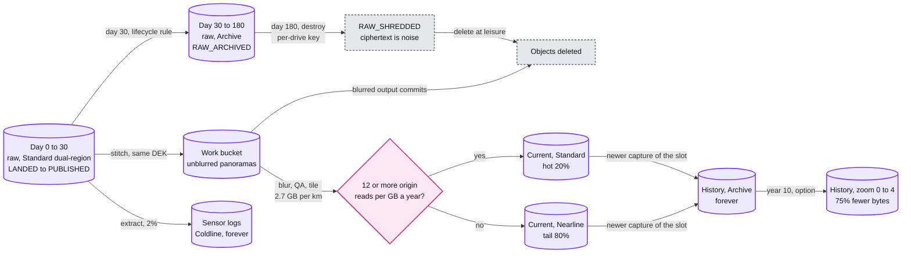

# Deep dive: storage tiers and lifecycle

> One-line answer: give every byte a job, a class and a death date; raw sits 30 days in dual-region Standard, then in Archive (cheaper than Coldline unless more than ~19% of it is read back), and at day 180 its per-drive key is destroyed so every copy becomes noise at once; current imagery is tiered by origin reads per panorama (Standard above ~12 a year per GB, Nearline below), history lives forever in Archive and is still served online through the CDN; at 1,000 cars that is ~$2.5 M a month in year 1 and ~$3.8 M in year 10 on average, and history is the line that keeps growing.

Related: [`../solution.md`](../solution.md) §2, §5.2, §8, [`vehicle-offload-and-landing.md`](vehicle-offload-and-landing.md) (the key hierarchy starts on the rig), [`tile-serving-and-cdn.md`](tile-serving-and-cdn.md) (edge caching), [`privacy-blur-and-takedowns.md`](privacy-blur-and-takedowns.md) (retention caps), [`../../../concepts/erasure-coding.md`](../../../concepts/erasure-coding.md).

---

## 1. Every byte has a job and a death date

Average = 340 PB of raw a year spread over 365 days. Peak season = every day a driving day (1.35 PB a day).

| Data class | What it is for | Size at 1,000 cars | Class | Death date |
|---|---|---|---|---|
| Raw, days 0 to 30 | Pipeline input, read once or twice | ~28 PB average, ~40 PB peak | Standard, dual-region | Moves at day 30 |
| Raw, days 30 to 180 | Re-stitch, < 5% of drives | ~140 PB average, ~200 PB peak | Archive | Per-drive key destroyed at day 180 |
| Stitched, unblurred panoramas | Blur input | ~0.4 PB (4 GB per km for ~1 day, assumption) | Standard, work bucket, raw's DEK | Deleted once the blurred output commits |
| Sensor logs (GPS, IMU, lidar, poses) | 3D, re-registration | +~7 PB a year (2% of raw) | Coldline | Kept |
| Current imagery, hot | CDN fills all day | ~22 PB (20% of bytes) | Standard, replicated by usage | Superseded, becomes history |
| Current imagery, tail | CDN fills, rarely | ~86 PB (80%) | Nearline | Superseded, becomes history |
| History | Time travel | +~100 PB a year | Archive | Kept. Zoom 5 dropped at 10 years (option) |
| Index and registry | Everything | ~4 TB a year | Spanner-like DB | Kept |

- **The stitched row is easy to forget.** A stitched panorama is 16,384 x 8,192 px x 0.3 B per pixel = ~40 MB, 100 kept per km = ~4 GB per km. It is unblurred, so it gets raw's privacy class and raw's key. It is small only because select runs before stitch and the files die when blur commits. Stitch all 200 captures per km and keep them to PUBLISHED (p95 7 days) and it is ~6 PB, ~$115k a month.
- **There is no separate master copy.** Zoom 5 of the tile pyramid is the blurred master (solution §4.2). Dropping it is dropping the master.

## 2. One drive's bytes over time



## 3. Archive vs Coldline, and why deleting at day 180 saves nothing

```
life(class, T) = price x max(T, minimum months)        $ per GB kept T months
cost(f)        = life + f x retrieval                   f = share of raw read back once
Archive  (T = 5):  0.0012 x max(5, 12) = $0.0144   + 0.05 f
Coldline (T = 5):  0.004  x max(5, 3)  = $0.0200   + 0.02 f
break-even f* = (0.0200 - 0.0144) / (0.05 - 0.02) = 18.7%, about 19%
```

- **We re-read < 5%, so Archive.** Per average monthly cohort (~28 PB) that saves (0.0056 - 0.03 x 0.05) x 28 M GB = ~$115k a month.
- **Hold time matters more than re-reads.** At zero re-reads Archive wins only if the cold phase is longer than 0.0144 / 0.004 = 3.6 months (~108 days). A 90-day retention would pick Coldline.
- **Deleting at day 180 saves nothing.** The 365-day minimum is charged at deletion. Keeping raw to day 365 would cost $0 more. The 180-day cap is a privacy decision. Do not let anyone argue it on cost, in either direction.

## 4. Current imagery: tier by access, not age

- **Place predicts reads, age does not.** A 3-year-old panorama of a city centre is read all day. Last week's farm road is read by nobody. An age rule would demote the first and keep the second hot.
- **Break-even.** Nearline saves (0.020 - 0.010) x 12 = $0.12 per GB a year and costs $0.01 per GB read from origin. Nearline wins below 12 origin reads per GB a year, about one a month.
- **The edge TTL sets the scale.** Tiles live 30 days at the edge (`max-age=2592000`). A PoP that keeps a tile warm refetches it at most ~12 times a year from expiry alone. One warm PoP is the break-even. Warm in two or more PoPs means Standard.
- **The job.** Daily, count origin reads per panorama from CDN-miss logs over 90 days. Decide per panorama: its ~683 tiles under `/{pano_id}/v{tile_version}/` move together. Promote at 12 a year, demote below 6, so nothing flaps inside Nearline's 30-day minimum.
- **Place right at write time.** The tile stage writes a new panorama in the class its slot's previous panorama earned. Most tiles never move.
- **Why not a simple "demote when idle, promote on any read" policy** (the Autoclass-like option). One scraper read would pull a cold panorama into Standard. A count over a window does not.
- **Object count.** ~4 B current panoramas x ~683 tiles = ~2.7 T objects. Class changes are billed per object, and those fees are not in our price table. That is why decisions are per panorama, with hysteresis, and mostly at write time.
- **The 2010 paper did the same with replicas:** "we selectively replicate panoramas according to usage patterns". Hot means Standard in more places near users. Tail means fewer copies.

## 5. History in Archive, served online

- **Archive answers in milliseconds**, so a 2014 panorama takes the same CDN path as today's. No restore job. S3 Glacier Flexible and Deep Archive could not sit behind a CDN like this.
- **A CDN miss on Archive** pays $0.05 per GB: a ~40 KB tile is $0.000002, $2 per million tile misses. A cold time-travel open is ~25 tiles, ~1 MB, $0.00005. Archive's per-request fees are also higher, and for 40 KB objects they are likely the bigger line. They are not in our table, so measure them before quoting $2.
- **Break-even vs Nearline.** Archive saves (0.010 - 0.0012) x 12 = ~$0.106 per GB a year and costs $0.04 more per GB read. Archive wins below 2.6 origin reads per GB a year. A history panorama that goes viral crosses that in days, and the same job promotes it.
- **SLO scope.** Tile p99 < 150 ms is on a CDN hit. An Archive miss is slower but online.

## 6. Crypto-shredding

The rig encrypts with a per-drive DEK and wraps it with the fleet's monthly KMS key version. The registry re-wraps it under a per-drive key (`dek_key_id`) and never stores the fleet-wrapped copy. The fleet key version dies once all its drives are LANDED. So at day 180 exactly one path leads from ciphertext to pixels: the per-drive key. Destroy it.

| Copy | After the per-drive key is destroyed |
|---|---|
| Landing bucket, both regions | Noise |
| Registry rows and their backups (wrapped DEK) | Noise. The wrapping key is gone |
| Cartridges, mirrors, field copies (fleet-wrapped DEK) | Already noise. The fleet key version died weeks after capture |
| Unblurred work outputs | Noise, because the pipeline writes them under the drive's DEK. Usually deleted when blur commits anyway |
| Soft-deleted raw objects | Noise. Raw can keep soft delete on as accident protection |
| Plaintext someone decrypted and saved elsewhere | Not covered. Only the pipeline identity can unwrap, and unwraps are audited |

Order of operations, and why:

1. Day 180: the shredder picks drives past `raw_delete_after`. A reprocess still running on the drive is cancelled. Retention beats reprocessing.
2. Destroy the per-drive key. If the KMS has a scheduled-destruction delay, start that much earlier.
3. Prove it: an unwrap attempt fails.
4. One registry transaction: RAW_SHREDDED, with time and key id, for the audit.
5. Delete `raw/{drive_id}/*` and any leftover unblurred `work/{drive_id}/` outputs, at leisure.

Key first, because it is one atomic, auditable action. Deleting ~1,400 objects in 2 regions plus backups can partly fail or lag, and delete-first leaves every straggler readable. Key-first makes every straggler noise. Shred job behind by a day: ticket. By 7 days: page (solution §8).

## 7. What 180 days gives up, and what else to cut

- **Given up:** after day 180 a stitching or pose bug is fixed by a re-drive (~$1k a car-day), not a re-run. Between day 30 and 180 a re-run costs one Archive read: 1,350 GB x $0.05 = ~$68 per drive.
- **Is the Archive phase worth it?** It costs 1,350 GB x $0.0144 = ~$19 per drive against a ~$1k re-drive. It pays if more than ~1.9% of drives would ever need a re-stitch after day 30. At solution.md's < 5%, yes.
- **Option: 30-day raw outside the strict markets** (solution §5.6, at 10x). If half the drives qualify (assumption) it saves ~$238k a month on average. Keep 180 days where re-drives are expensive, such as remote capture.
- **Option: drop zoom 5 of history older than 10 years.** Zoom 5 is 512 of ~683 tiles, 75% of bytes. Year-15 history falls from ~$1.82 M to ~$1.37 M a month. Given up: old time travel tops out at 8,192 x 4,096 px, and a future re-blur of it runs on zoom 4.

## 8. The cost model

Stdlib only. Run it with `python3 cost_model.py`.

```python
"""Street View storage cost model. Stdlib only. GCS us-central1 list prices per GiB-month.
Like solution.md, 1 GB is billed as 1 GiB (exact GiB math is ~7% lower). Steady state, month 12."""
CARS, KM_PER_DAY, DRIVING_DAYS = 1_000, 150, 250
RAW_GB_KM, PUB_GB_KM, STITCH_GB_KM = 9.0, 2.7, 4.0  # stitched: 134 MP x 0.3 B/px x 100 kept per km
HOT_DAYS, RETENTION_DAYS, WORK_DAYS = 30, 180, 1    # stitched files die when blur commits (~1 day)
COVERED_KM, HOT_SHARE, SENSOR_SHARE, REREAD = 40e6, 0.20, 0.02, 0.05
TOP_ZOOM, LAX_SHARE, REDRIVE = 512 / 683, 0.5, 1_000  # LAX_SHARE is an assumption
PRICE = {"Standard": 0.020, "Nearline": 0.010, "Coldline": 0.004, "Archive": 0.0012}
FETCH = {"Standard": 0.0, "Nearline": 0.01, "Coldline": 0.02, "Archive": 0.05}
MIN_MONTHS = {"Standard": 0, "Nearline": 1, "Coldline": 3, "Archive": 12}
COLD = (RETENTION_DAYS - HOT_DAYS) / 30             # months raw spends in the cold class


def life(cls, months):  # $ per GB kept `months`, minimum-duration charge included
    return PRICE[cls] * max(months, MIN_MONTHS[cls])


def monthly(year, days=DRIVING_DAYS, drop_zoom_after=None):
    km = CARS * KM_PER_DAY * days                   # km a year
    raw, pub, cur = km * RAW_GB_KM, km * PUB_GB_KM, COVERED_KM * PUB_GB_KM
    old = max(0, year - drop_zoom_after) if drop_zoom_after else 0
    return [("raw, days 0 to 30", "Standard", raw * HOT_DAYS / 365 * PRICE["Standard"]),
            ("raw, days 30 to 180", "Archive", raw / 12 * life("Archive", COLD)),
            ("raw re-reads, 5%", "Archive", raw / 12 * REREAD * FETCH["Archive"]),
            ("stitched, unblurred", "Standard", km * STITCH_GB_KM * WORK_DAYS / 365 * PRICE["Standard"]),
            ("sensor logs", "Coldline", raw * SENSOR_SHARE * year * PRICE["Coldline"]),
            ("current, hot 20%", "Standard", cur * HOT_SHARE * PRICE["Standard"]),
            ("current, tail 80%", "Nearline", cur * (1 - HOT_SHARE) * PRICE["Nearline"]),
            ("history", "Archive", pub * (year - old * TOP_ZOOM) * PRICE["Archive"])]


k = lambda usd: f"{usd / 1e3:,.0f}"
tables = {y: monthly(y) for y in (1, 5, 10)}
print(f"{'$k a month, average':22}{'class':10}{'year 1':>8}{'year 5':>8}{'year 10':>8}")
for i, (name, cls, _) in enumerate(tables[1]):
    print(f"{name:22}{cls:10}" + "".join(f"{k(tables[y][i][2]):>8}" for y in tables))
totals = [sum(r[2] for r in t) for t in tables.values()]
print(f"{'total':32}" + "".join(f"{k(t):>8}" for t in totals))
peak = monthly(1, days=365)
print(f"peak season raw (every day a driving day): {k(peak[0][2])} + {k(peak[1][2])}"
      f" = {k(peak[0][2] + peak[1][2])} $k, average {k(tables[1][0][2] + tables[1][1][2])} $k")
print(f"year-1 storage / compute (~$150k): {totals[0] / 150e3:.0f}x")
a, c = life("Archive", COLD), life("Coldline", COLD)
f = (c - a) / (FETCH["Archive"] - FETCH["Coldline"])
print(f"Archive vs Coldline, {COLD:.0f} months: ${a:.4f} vs ${c:.4f} per GB, break-even re-read {f:.1%}")
print(f"Archive wins at zero re-reads only if cold > {life('Archive', 0) / PRICE['Coldline']:.1f} months")
for hi, lo in (("Standard", "Nearline"), ("Nearline", "Archive")):
    n = (PRICE[hi] - PRICE[lo]) * 12 / (FETCH[lo] - FETCH[hi])
    print(f"{lo} beats {hi} below {n:.1f} origin reads per GB per year")
drive = KM_PER_DAY * RAW_GB_KM * a
print(f"Archive phase ${drive:.0f} per drive vs ~${REDRIVE:,} re-drive: worth it above {drive / REDRIVE:.1%} re-stitched")
cut = LAX_SHARE * CARS * KM_PER_DAY * DRIVING_DAYS * RAW_GB_KM / 12 * (a + REREAD * FETCH["Archive"])
print(f"option 30-day raw for {LAX_SHARE:.0%} of drives: saves {k(cut)} $k a month")
h, hz = monthly(15)[-1][2], monthly(15, drop_zoom_after=10)[-1][2]
print(f"option drop zoom 5 of history after 10 years: year-15 history {k(h)} -> {k(hz)} $k a month")
```

Output:

```
$k a month, average   class       year 1  year 5 year 10
raw, days 0 to 30     Standard       555     555     555
raw, days 30 to 180   Archive        405     405     405
raw re-reads, 5%      Archive         70      70      70
stitched, unblurred   Standard         8       8       8
sensor logs           Coldline        27     135     270
current, hot 20%      Standard       432     432     432
current, tail 80%     Nearline       864     864     864
history               Archive        121     608   1,215
total                              2,483   3,077   3,819
peak season raw (every day a driving day): 810 + 591 = 1,401 $k, average 960 $k
year-1 storage / compute (~$150k): 17x
Archive vs Coldline, 5 months: $0.0144 vs $0.0200 per GB, break-even re-read 18.7%
Archive wins at zero re-reads only if cold > 3.6 months
Nearline beats Standard below 12.0 origin reads per GB per year
Archive beats Nearline below 2.6 origin reads per GB per year
Archive phase $19 per drive vs ~$1,000 re-drive: worth it above 1.9% re-stitched
option 30-day raw for 50% of drives: saves 238 $k a month
option drop zoom 5 of history after 10 years: year-15 history 1,822 -> 1,367 $k a month
```

- **Year 1 against solution.md.** Current imagery is $1.30 M, as in §2 and §8. Raw is $0.96 M on average and $1.40 M in peak season, the same two numbers §8 gives. Re-reads (+$70k) and the stitched work bucket (+$8k) are extra lines solution.md does not list.
- **What grows.** Raw and current are flat, because current is bounded by covered road km, not by years. History adds ~$121k a month every year (sensor logs ~$27k) and passes current imagery's $1.3 M in year 11.

## 9. Underneath: erasure coding

We never pick the redundancy scheme. The object store erasure-codes each object across failure domains, and the per-GiB price already includes it. Google's availability study modelled RS(9,4), RS(5,3) and 3x replication in production cells ([Ford et al., OSDI 2010](https://www.usenix.org/legacy/events/osdi10/tech/full_papers/Ford.pdf)): RS(9,4) stores 13 chunks for 9 of data (1.44x) and survives 4 losses, where 3 replicas cost 3x and survive 2. That is why we buy 11 nines per logical byte and never keep our own second copy after LANDED. How the codes work: [`../../../concepts/erasure-coding.md`](../../../concepts/erasure-coding.md).

## 10. What the interviewer asks next

- **"At 10x cars, what grows?"** Raw and history, 10x. Current imagery does not: it is bounded by road km (~108 PB). History becomes ~1 EB a year, ~$1.2 M a month per year kept, so thinning history (one panorama per slot per year) becomes the lever.
- **"Why not Coldline for the 150 days?"** It wins only above ~19% re-reads, or with a cold phase under 3.6 months. Neither holds.
- **"Prove to a regulator that raw is gone."** The KMS destroy record, the RAW_SHREDDED audit row, a failed unwrap test, and any object left over is ciphertext with no key.
- **"Why not a deep-archive class for history?"** Hours to restore cannot sit behind a CDN. GCS Archive answers in milliseconds, so time travel stays a normal tile fetch.
- **"Why keep raw at all after publish?"** Blur can be redone from blurred masters: a better detector only adds blur. Raw buys re-stitch and re-pose for ~$19 a drive in Archive, against a ~$1k re-drive, until the privacy cap at day 180.
