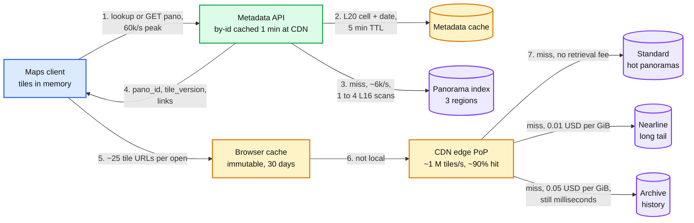
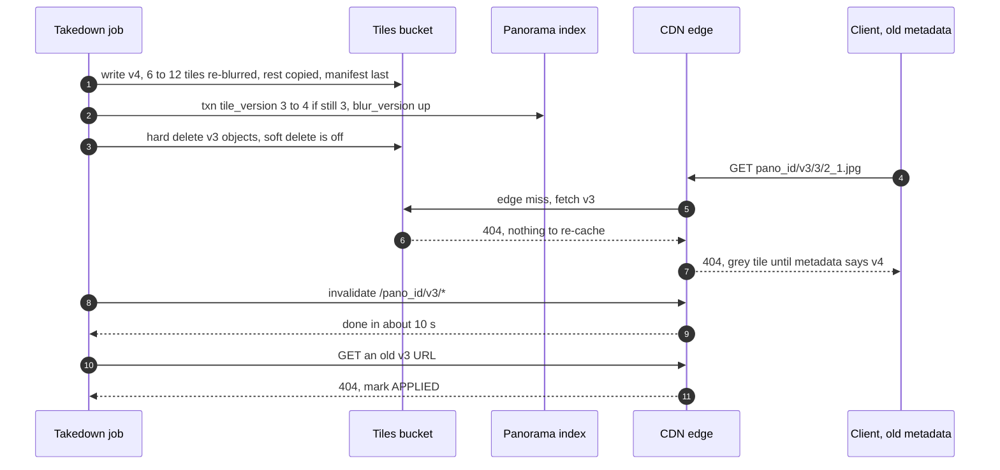

# Deep dive: tile serving and the CDN

> One-line answer: each panorama is a pyramid of 683 JPEG tiles (512 px, zoom 0 to 5, ~27 MB) whose top level is the blurred master; tiles sit at immutable versioned URLs cached 30 days at the edge, so the CDN absorbs ~90% of ~1 M tiles/s and the origin sees ~100k tiles/s (4 GB/s); a takedown bumps the version, hard-deletes the old one at origin and only then spends one of 500 invalidations a minute on it; bulk re-tiles are too big for that budget and age out, which is why `max-age` is 30 days and not a year.

Related: [`../solution.md`](../solution.md) §2, §4.4, §4.5, [`spatial-index-and-publish.md`](spatial-index-and-publish.md) (where `tile_version` comes from), [`privacy-blur-and-takedowns.md`](privacy-blur-and-takedowns.md) (the takedown job end to end), [`storage-tiers-and-lifecycle.md`](storage-tiers-and-lifecycle.md) (which class each panorama lives in), [`../../../concepts/caching-patterns.md`](../../../concepts/caching-patterns.md).

---

## 1. The pyramid: 683 tiles, and the top level is 75% of them

Each zoom level doubles width and height, so it has 4x the tiles of the level below. The 512 px tile and ~40 KB per tile are solution.md's assumptions.

| Zoom | Grid (cols x rows) | Tiles | Panorama size (px) | Bytes at ~40 KB | Share |
|---|---|---|---|---|---|
| 0 | 1 x 1 | 1 | 512 x 256 | 40 KB | 0.1% |
| 1 | 2 x 1 | 2 | 1,024 x 512 | 80 KB | 0.3% |
| 2 | 4 x 2 | 8 | 2,048 x 1,024 | 320 KB | 1.2% |
| 3 | 8 x 4 | 32 | 4,096 x 2,048 | 1.3 MB | 4.7% |
| 4 | 16 x 8 | 128 | 8,192 x 4,096 | 5.1 MB | 18.7% |
| 5 | 32 x 16 | 512 | 16,384 x 8,192 | 20.5 MB | 75.0% |
| All | | 683 | | ~27 MB | 100% |

- **Why 75%.** 1 + 1/4 + 1/16 + ... = 4/3. A pyramid is 4/3 of its top level, so the top is 3/4 and the five lower levels add only 33% to the master. If zoom 0 to 3 tiles were twice as big (they pack more detail per pixel), zoom 5 would still be ~71%.
- **Zoom 5 is the blurred master.** 16,384 x 8,192 = ~134 MP. There is no separate full-size file. A re-blur reads zoom 5, blurs, and rebuilds lower levels by 2x downsampling. ~6 to 12 of 683 tiles change ([privacy deep dive](privacy-blur-and-takedowns.md)); the rest are copied server-side into `v{n+1}`, so the new version is complete and nothing is JPEG-encoded twice.
- **Requests and bytes have different shapes.** Zoom 5 holds 75% of stored bytes but is fetched only when a user zooms in. Every tile in the open and move budgets below is zoom 0 to 3 (43 tiles, ~6% of a panorama's bytes). The edge's working set is far smaller than storage.

## 2. What a viewer fetches: ~25 tiles on open, ~10 per move

Assumption: a ~1,000 px wide viewport showing ~90° of the 360°.

- **Zoom from the screen.** 90° is 1/4 of the panorama, so the viewer wants one ~4,000 px wide: zoom 3 (4,096 px). A 2x screen wants zoom 4. Zoomed in to ~30°, zoom 5.
- **Open, ~25 tiles, ~1 MB.** Zooms 0 to 2 for the whole sphere (1 + 2 + 8 = 11 tiles), so turning around never shows grey. Then zoom 3 for the viewport: each zoom-3 tile spans 45° x 45°, so a 90° x 60° view touches ~6, plus a ring of ~8 for small head turns. 11 + 6 + 8 = 25.
- **Move, ~10 tiles, ~400 KB.** The viewport at zoom 3 (~6), the zoom-2 tiles under it while those load (~1 to 2), and a prefetch of the next panorama's zooms 0 and 1 (3 tiles) in the direction of travel.
- **Prefetch is a budget knob.** Prefetching zooms 0 and 1 for all 2 to 4 neighbours adds 3 to 9 tiles per move: +120k to 360k tiles/s at 40k moves/s, +13% to 40% on ~900k. So only the direction of travel. 20k opens x 25 + 40k moves x 10 = ~900k, the ~1 M tiles/s and ~320 Gbps in solution.md §2.

## 3. Immutable URLs, and why `max-age` is 30 days, not a year

- **The URL is the content.** `https://tiles.example/{pano_id}/v{tile_version}/{z}/{x}_{y}.jpg`, stored at `tiles/{pano_id}/v{tile_version}/...`. Bytes at a URL never change; new pixels get a new version, so a new URL. The only mutable thing is `tile_version` in metadata, cached 5 min (lookup) and 1 min (`GET /v1/panos/{id}` at the CDN). Short TTL on the pointer, long TTL on the bytes.
- **`Cache-Control: public, max-age=2592000, immutable`.** `public`: shared caches may store it. `2592000` is 30 x 86,400 s. `immutable`: a browser reload does not revalidate.
- **Why not revalidate with ETags.** A short `max-age` turns every expired request into a round trip to origin, up to ~1 M/s. The version in the URL already says whether the content changed.
- **Why not a year.** Invalidation is the only way to pull a tile out of the edge early. It is capped at 500 requests a minute, each taking ~10 s ([Cloud CDN](https://cloud.google.com/cdn/docs/cache-invalidation-overview)): 500 x 1,440 = 720k panoramas a day at one path pattern each.

| Event | Panoramas | Invalidation time at 500/min | Fits the budget? |
|---|---|---|---|
| One approved house (solution.md Flow 4) | ~17 | ~2 s | Yes |
| Takedown wave | 10k | 20 min | Yes |
| Daily ceiling | 720k | 24 h | The limit |
| Bad detector rollback (solution.md §10.4) | ~9.4 M | ~13 days | No |
| Blur-model backfill (solution.md §5.3) | ~500 M | ~694 days | No |

- **Two policies.** Approved takedowns: always one invalidation per panorama, inside the 24 h SLO. Bulk re-tiles: delete old versions at origin, invalidate the hot set in value order with what is left of the budget, and let the rest age out within 30 days. With a 1-year `max-age`, "age out" would mean a year.
- **What the long tail risks.** Clients stop asking for old URLs within ~6 min of each version bump (5 min metadata cache plus 1 min at the CDN). An old tile stays reachable at an edge only for someone who kept the old URL, for at most 30 days.
- **Worked split (assumption).** Reserve half the budget, 360k a day, for takedowns; a 10k wave uses 3% of a day. A ~500 M backfill over ~7 months re-tiles ~2.4 M panoramas a day, so the other 360k covers the hottest ~15% and ~85% ages out. The backfill already runs busy cells first, so the budget lands where the views are.
- **Cost of 30 days.** A tile that stays hot at one PoP is refetched once a month from expiry, against ~100k misses/s the origin serves anyway.
- **Browsers are out of reach.** Invalidation does not touch browser caches (same Cloud CDN page). A user who already loaded `v3` may keep it locally up to 30 days. They already saw it, and their client builds `v4` URLs once its metadata refreshes.

## 4. The read path and its cache layers

- Misses total ~100k tiles/s and 4 GB/s across the three origin classes. Which class a panorama sits in is decided per panorama from origin-read counts ([storage tiers](storage-tiers-and-lifecycle.md) §4: promote at ~12 origin reads a year).
- Archive answers in milliseconds, not hours ([storage classes](https://cloud.google.com/storage/docs/storage-classes)), so history sits behind the same CDN. The tile p99 of 150 ms is set on a hit; a miss adds one origin round trip.

## 5. Hit rate by density, and what a miss costs

The ~90% overall hit rate is an average of very different places. The split below is an assumption chosen to reproduce it.

| Area (assumption) | Share of tile requests | Edge hit rate | Origin reads, % of all requests |
|---|---|---|---|
| Dense city, landmarks | 70% | 97% | 2.1% |
| Suburbs | 25% | 80% | 5.0% |
| Rural roads and history | 5% | 40% | 3.0% |
| All | 100% | ~90% | ~10% |

The long tail is 5% of requests but ~30% of origin reads. Cities are 70% of requests and ~21% of origin reads. The class of the tail sets the miss bill.

A 40 KB tile is 40,000 / 2^30 = ~3.7e-5 GiB. The origin stream is 4 GB/s x 2.592 M s = ~9.7 M GiB a month.

| Origin class | Retrieval per GiB | Per 1 M tile misses | If every miss came from it, per month |
|---|---|---|---|
| Standard | $0 | $0 | $0 |
| Nearline | $0.01 | ~$0.37 | ~$97k |
| Archive | $0.05 | ~$1.86 | ~$483k |

- **Assumed mix.** ~21% of origin reads from Standard, ~69% Nearline, ~10% Archive (history as a third of the rural row, assumption): ~$67k + ~$48k = **~$115k a month** in retrieval fees.
- **Against what tiering saves.** The tail in Nearline instead of Standard saves ~$0.9 M a month (solution.md: ~$2.2 M vs ~$1.3 M). Each year of history in Archive instead of Nearline is ~$0.12 M instead of ~$1.0 M a month. Tiering wins by ~8x on the tail alone, and by more with each year of history, even paying for every miss.

## 6. Origin sizing

- **~100k tiles/s, 4 GB/s, 32 Gbps** in total. With 3 serving regions and an even split (assumption): ~33k tiles/s and ~11 Gbps each; ~50k and ~16 Gbps after losing one.
- **Spread, not locality.** Object names start with `pano_id`, a hash, so reads spread evenly over the bucket's key space and no key range runs hot. The index wants the opposite (S2 locality for range scans). Same panorama, opposite key design, because one side does point gets and the other range scans.
- **A viral panorama** costs the origin at most one fill per tile per PoP per 30 days, or per eviction.

## 7. A takedown at the edge: bump, delete, invalidate, verify

- **Delete before invalidate.** Purge first while origin still has `v3`, and the next stale client refills the edge with the old pixels for another 30 days. Deleting first means every refill is a 404. A few grey tiles for a few minutes beat a re-exposed face.
- **Soft delete off** on the tiles bucket, or GCS keeps deleted objects 7 days by default ([soft delete](https://cloud.google.com/storage/docs/soft-delete)).
- **Verify, then APPLIED.** The 404 on an old URL is the only proof the edge and origin agree.
- **Pre-launch opt-outs cost no invalidations.** Germany's 244,237 households at ~17 panoramas each would be ~4.2 M invalidations after launch, ~5.8 days of the whole budget. Before launch the blur stage just reads more footprints ([privacy deep dive](privacy-blur-and-takedowns.md) §8).

## 8. Why not signed tile URLs

- **Cache fragmentation.** A signed URL carries an expiry and a signature. If the cache key includes them, every session's URL is a different key and the ~90% hit rate collapses toward each user's own re-reads: up to ~1 M tiles/s at origin, 10x its sizing. If the key drops them, the edge still checks a signature on every request, and each new expiry is a new URL to the browser cache.
- **Nothing to protect.** Tiles are public, already-blurred pixels. Signing does not help a takedown either: a signed URL stays valid until it expires.
- **Protect the metadata API instead:** an API key or a signed-in Maps client, with quotas (solution.md §10.10). Only that API hands out `pano_id` and `tile_version`, so the quota bounds bulk scraping. Our pick: make `pano_id` a keyed hash of `(drive_id, capture_seq)` so nobody can compute it from guessable drive ids.

## 9. Multi-region serving, and losing a region

| Layer | Normal | One of 3 serving regions lost |
|---|---|---|
| CDN edge | Global PoPs; ~90% of tiles never reach origin | Unaffected. Cached tiles keep serving |
| Tiles origin | Multi-region bucket, ~33k tiles/s per region | Misses go to the other two, ~50k tiles/s each |
| Metadata API and cache | One per region | Clients retry another region: a few seconds of errors. Moved users hit caches cold for their cells, so index reads rise |
| Panorama index | Replicated across 3 regions, stale reads from any replica | 2 of 3 is still a majority: reads and publishes continue. Sized for 3x cache-miss load (solution.md §5.6) |
| Takedowns | Bump, delete, invalidate, verify | Continue: the index keeps a majority, the bucket and the CDN are multi-region |

## 10. What the interviewer asks next

- **"Why not cut tiles on the fly from the master?"** Every miss would read and decode part of a ~134 MP master, ~100k times a second, to save the 25% of bytes the lower levels take. Pre-tiling is ~2 CPU-s once per panorama (solution.md §2).
- **"Why 512 px tiles?"** 256 px needs 4x the tiles for the same pixels: ~100 per open, ~3.6 M requests/s at the edge. 1,024 px fetches more pixels outside the viewport and makes each takedown re-encode bigger tiles. 512 is the middle.
- **"The edge hit rate drops from 90% to 50%."** Origin goes from ~100k to ~500k tiles/s (20 GB/s), 5x its sizing. The client keeps the lower zoom it already has instead of showing grey, and origin sheds the highest zooms first. Page on hit rate, before origin errors.
- **"Can one request invalidate a whole rollback?"** The same Cloud CDN page also invalidates by cache tag, set with a `Cache-Tag` response header. Tag tiles by drive and blur model version and a rollback is a handful of requests. It needs a front end that sets the header per object. That is the seam; not built.
- **"When is a takedown really gone?"** Index: at the version bump. Clients: within ~6 min. Origin: at the delete. Edge: ~10 s after the invalidation. Browsers that already cached it: up to 30 days, out of our reach. The 24 h SLO covers review queues and waves.
