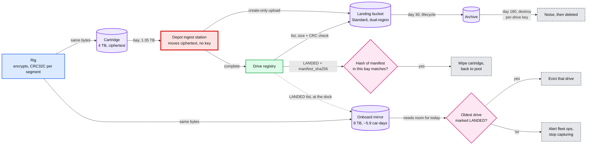
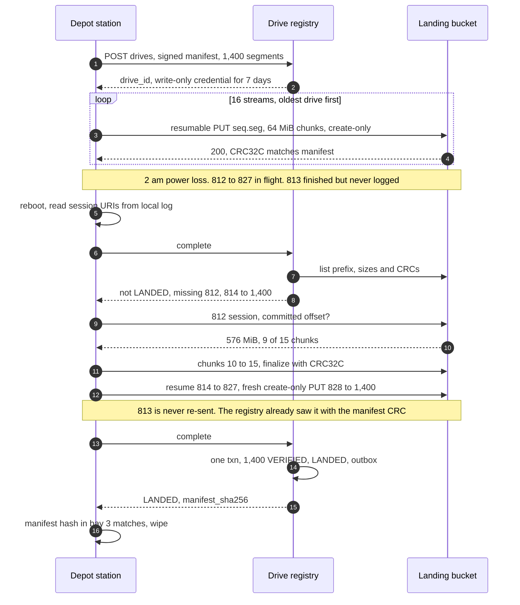
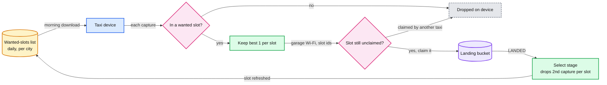

# Deep dive: vehicle offload and landing

> One-line answer: the rig encrypts each capture into 1 GB append-only segments whose CRC32C covers the stored bytes, and writes every segment twice (4 TB cartridge, 8 TB onboard mirror); the depot ingest station moves only ciphertext from its bays to create-only object paths, 16 streams at a time, and resumes from the store's committed offset after a crash; the drive registry lists the prefix, matches every size and CRC32C against the rig-signed manifest, and flips the drive to LANDED in one transaction; the cartridge is wiped only on that registry answer, the mirror evicts only drives it has heard are LANDED (or the rig stops capturing), and when the uplink dies a pool of 80 cartridges carries three nights before the courier leaves on day 3. This is the red node of [`../solution.md`](../solution.md): the only copies of a car-day meet a fixed 10 Gbps pipe and a manual swap.

Related: [`../solution.md`](../solution.md) §4.1, §5.1, §5.6, §10.2, Flow 1, Flow 5, [`../../../concepts/signed-url.md`](../../../concepts/signed-url.md) (scoped upload credentials), [`../../immutable-object-store/`](../../immutable-object-store/) (commit point), [`storage-tiers-and-lifecycle.md`](storage-tiers-and-lifecycle.md) (the bytes after LANDED).

---

## 1. The segment file

| Part | Contents | On disk |
|---|---|---|
| Header | magic, format version, `drive_id`, `seq`, rig id, fleet key version | Clear. Nothing personal |
| Records | Frame: length and CRC32C of the body. Body: type (image, lidar, GPS, IMU, wheel), capture id, timestamp, payload | Frame clear. Body encrypted with the drive's data encryption key (DEK), authenticated (e.g. AES-GCM) |
| Trailer | record count, byte length, `sealed = complete or partial`, CRC32C of every byte before it | Clear |

- **The CRC covers ciphertext as stored** (solution §4.1 step 1). The rig, the object store and the registry compare the same 32 bits. Nobody on the path needs a key to verify. That is what lets the station be keyless.
- **Cartridge and mirror copies are byte-identical** (same DEK, same nonces). A bad `seq` on one is replaced by the same `seq` from the other.

**Why 1 GB.** One segment is ~22 captures of ~45 MB, ~110 m of road. A stream gets 10 Gbps / 16 = 625 Mbps. The CRC is per object, so a mismatch at finalize re-sends the whole segment. 64 MB buys nothing and costs 15x the registry rows, manifest entries and requests. 100 GB turns every CRC failure into a 21 minute re-send.

| Segment size | Per car-day | Objects a day, 1,000 cars | Re-send after a CRC failure, one stream |
|---|---|---|---|
| 64 MB | ~21,000 | ~21 M | 0.8 s |
| **1 GB** | **~1,400** | **~1.4 M** | **13 s** |
| 100 GB | ~14 | ~14k | 21 min, and 14 segments cannot fill 16 streams |

## 2. Power loss mid-segment

1. Both SSDs lose power at the same instant, inside the same unsealed segment. The rig flushes each record to both SSDs before starting the next. Worst case: the capture being written, ~45 MB, ~5 m of road. That is under one 10 m slot, so usually no visible hole.
2. Detection at the next boot: the last segment has no trailer, or its trailer CRC32C does not match. The rig walks the frames by length and checks each frame's CRC on both copies. No key is needed. It keeps the longer valid prefix, copies it to the other SSD, and appends a trailer with `sealed = partial`.
3. The plaintext DEK lived only in RAM, and the rig can wrap but not unwrap. The drive cannot continue. The fleet-wrapped DEK was written to disk at drive start, so the rig signs a manifest for this run that lists `seq N, partial: true` with the sealed size and CRC, then starts a new run (`drive_id = vehicle:date:run+1`) with a fresh DEK. The registry treats a partial segment as normal data. The pose stage sees a one-capture gap.

## 3. Three copies, and the event that drops each

| Copy | May be dropped when | Never on |
|---|---|---|
| Cartridge | The registry says LANDED for every drive on it, and the manifest hash in the bay matches | The station's log, a timer, a full pool |
| Mirror | The rig has heard at a dock that the registry marked it LANDED. Oldest first. 8 TB / 1.35 TB = ~5.9 car-days of un-LANDED drives | Age, or a full SSD. Out of room with nothing LANDED, the rig alerts and stops capturing |
| Landing bucket | Day 180: the per-drive key is destroyed. Day 30 is only a class change | Anything before day 180 |
| Fleet-wrapped DEK (inside manifests on cartridges and mirrors) | The monthly fleet key version is destroyed once all its drives are LANDED | While any drive under it is still on a cartridge |

## 4. The upload loop

- **A byte mover with a to-do list.** The station never decrypts and never decides what is done.
- **Oldest drive first, all 16 streams on it.** 1.35 TB at 1.25 GB/s is ~18 min per drive. The first cartridge is free at ~18 min and the average drive lands at ~3 h. Round-robin over 8 bays frees the first cartridge at ~2.4 h and averages ~4 h.
- **Resumable session per segment.** Chunks of 64 MiB = 256 x 256 KiB (the store wants multiples of 256 KiB). A segment is 15 chunks. A lost chunk costs 64 MiB x 8 / 625 Mbps = 0.86 s. The session URI lives a week and the station logs it next to `seq`.
- **Create-only.** `ifGenerationMatch=0`: a second writer of `raw/{drive_id}/{seq}.seg` gets 412 instead of overwriting. A 412 only says "exists". The registry's check says whether it is right. The credential is write-only, so the station cannot delete either.
- **CRC twice.** The station computes CRC32C while reading the cartridge. A mismatch with the manifest means the cartridge copy rotted: fetch that `seq` from the car's mirror. It then sends the manifest CRC32C at finalize, so the store rejects a corrupted transfer.
- **Skip-if-same-CRC is the registry's call** (solution §5.1). The station calls `complete`. The registry lists the prefix and returns only what is missing or mismatched. The station needs no read access.

## 5. The LANDED transaction

`POST /v1/drives/{id}:complete` runs in the registry:

1. List `raw/{drive_id}/`. Read each object's size and stored CRC32C. The store computed them, not the station.
2. Compare per `seq` with the rig-signed manifest. Match: SEGMENT row VERIFIED, with the object generation. Otherwise it stays PENDING.
3. Objects not in the manifest are flagged and deleted by the registry.
4. All rows VERIFIED: one transaction moves DRIVE from UPLOADING to LANDED and writes `drive.landed` to an outbox in the same commit. LANDED is one-way. A repeated `complete` returns LANDED again.
5. Otherwise it returns the missing list: the station's to-do list.

Why the station reads LANDED and never trusts its own log:

| The station's log says | What can be true | Caught by |
|---|---|---|
| "812 uploaded" | The log line was written before the finalize ack, and the finalize failed | The listing: 812 is missing |
| "all 1,400 sent" | The log came back from a stale disk, and the manifest has 1,401 | The signed manifest is the list, not the log |
| "bay 3 holds drive A" | Cartridges were moved between bays during a reboot | Wipe needs `sha256(manifest in bay) = manifest_sha256` |

## 6. A station crash and resume

## 7. The cartridge pool, and why the courier leaves on day 3

80 cartridges per depot = 20 in the cars + 60 empties, three nights of swaps (solution §5.1). At ~$25k per depot that is ~$1.25 M across 50 depots. The uplink dies at 18:00 on day 0.

| Evening of | Empties after the swap | Full, waiting | What happens |
|---|---|---|---|
| Day 0 | 40 | 20 | Uplink down. Swaps continue |
| Day 1 | 20 | 40 | |
| Day 2 | 0 | 60 | Last spares used |
| Day 3 | 0 | 0 | Morning: courier takes the 60. Evening: no empties, each car keeps its 4 TB cartridge (~2.9 car-days) a second day. Overnight: the regional center ships 60 empties from its own stock |
| Day 4 | 40 | 20 | Normal swaps again. Each full cartridge holds 2 car-days |

- **One clock: the pool.** The mirror is no longer a clock. It evicts only LANDED drives, so every waiting drive keeps two copies the whole time (solution §5.6).
- **Day 3 courier.** The regional center lands 81 TB in 4.5 h at 40 Gbps (assumption). Days 0 to 2 are LANDED by day 4.
- **Slack without a courier: 2 days, then a clean stop.** Day 5 needs 3 car-days on a 4 TB cartridge (4.05 TB) and 6 un-LANDED car-days on the 8 TB mirror (8.1 TB). Both give out on day 5. The rigs alert and stop: 20 cars idle (~$1k a car-day, ~$20k a day), and no data is lost.
- **The mirror must hear LANDED.** It is a few bytes. Any control path to the depot carries it (assumption: a cellular backup for control traffic). Without it, mirrors fill on day 5 even after the courier landed days 0 to 2.

## 8. Network vs courier break-even

Effective courier rate = cartridges x 1.35 TB x 8 / door-to-door seconds. A 20-car depot makes 27 TB a day.

| Path | Moves in 24 h | Car-days | Verdict for 20 cars |
|---|---|---|---|
| 1 Gbps uplink | 1e9 x 86,400 / 8 = 10.8 TB | 8 | Upload 8, courier 12 |
| Courier, 10 cartridges overnight | 13.5 TB | 10 | 13.5e12 x 8 / 86,400 = 1.25 Gbps, ~1 day latency |
| 2.5 Gbps uplink | 27 TB | 20 | Break-even with zero slack. A backlog never clears |
| **10 Gbps uplink (chosen)** | **108 TB** | **80** | **6 h drain. A 3-day backlog (81 TB) clears in ~1 day** |

Below ~1.25 Gbps the courier wins outright. Between 1.25 and 2.5 Gbps a depot uploads what fits and ships the rest. Above ~2.5 Gbps the uplink wins, and the headroom above that is what clears backlogs.

## 9. Remote capture always ships

- A trekker in the Amazon or a boat on a canal has no depot and no link for weeks. Same rig, same segments, same manifest. Cartridges travel in shock-mounted cases (the 2010 paper) and land in 1 to 2 weeks (14-day SLO).
- **Two copies for 14 days.** The mirror holds ~5.9 car-days of un-LANDED drives, and a 2-week trip fills it. So the field team copies each cartridge onto a second one before shipping, and the rig checks the copy's CRCs against its manifest. That verified field copy is the second copy, so in remote mode the rig may evict the mirror copy (assumption, a remote-only exception). The field copy is wiped only when LANDED is heard. LANDED is a few bytes: a satellite message is enough.
- **No keys in the field.** The rig wraps the DEK with the fleet public key. The monthly fleet key version stays alive until these drives land.

## 10. The taxi variant: dedup before upload

- **Why it is mandatory.** Assumption: 100 taxis per garage, 200 km a day each, the car rig's 9 GB per km, a 1 Gbps garage link for 8 h. Raw: 100 x 200 x 9 GB = 180 TB a night. The link moves 1e9 x 28,800 / 8 = 3.6 TB. 50x short.
- **Same streets 50 times a day** means at most 1 capture in 50 is needed per slot: 180 TB / 50 = 3.6 TB. The list turns an impossible night into a full one.
- **Wanted list:** slots whose current panorama is older than the refresh target, minus slots already claimed. Per device per night: 3.6 TB / 100 = 36 GB, ~800 captures.
- **Garage claim check:** the device sends ~800 slot ids (~6 KB), the server claims each slot with a conditional write and returns the winners. Losers are dropped before a byte moves.
- **Server side:** the select stage still drops a second capture of a slot refreshed this week (a race between two garages).

## 11. Credentials, keys and manifest signing

- **Rig:** signs the manifest (`drive_id`, segments with sizes and CRCs, `partial` flags, fleet-wrapped DEK) with a key in a hardware module. Can wrap a DEK with the fleet public key. Cannot unwrap.
- **Registry at `POST /v1/drives`:** verifies the signature against the vehicle's enrolled public key, rejects unknown vehicles, and treats a repeated `drive_id` with the same `manifest_sha256` as a retry. It unwraps the DEK through KMS, re-wraps it under a per-drive key (`dek_key_id`) and never stores the fleet-wrapped copy.
- **Station:** device certificate. Gets a write-only, create-only credential for `raw/{drive_id}/*`, valid 7 days. Holds no key.

| Stolen or leaked | Can do | Cannot do |
|---|---|---|
| Station | Add objects to drives it has open credentials for | Read raw, overwrite a segment, forge a drive. Junk fails the CRC match |
| Credential | Add objects under one prefix for 7 days | Anything else |
| Cartridge | Nothing. Ciphertext | Unwrap: the rig cannot, and the fleet key version dies once its drives land |
| Rig signing key | Forge manifests for one vehicle | Anything past revoking that vehicle's enrolled key |

## 12. What the interviewer asks next

- **"Why is the station red and not the registry?"** The registry is a multi-region Paxos database doing ~1,000 drives a day. The station is where both copies of 20 car-days wait on one 10 Gbps link, 8 bays and a human swapping cartridges.
- **"Two stations pick up the same drive."** Same `drive_id`, same paths. Create-only means one writer per `seq`, and the other gets 412. The registry lands the drive once.
- **"The cartridge's CRC does not match the manifest."** Upload that `seq` from the car's mirror (byte-identical) at the next dock. The mirror still has it, because the drive is not LANDED. Only if the mirror SSD also failed does the missing ~110 m go to fleet ops as a re-drive.
- **"Can the station wipe at 99% and upload the rest from the mirror?"** No. The mirror would be the only copy of that 1%, one SSD failure from a re-drive. The rule has no exceptions, so it needs no judgement at 2 am.
