# Diagrams: Google Maps Street View ingestion and storage

The D1 to D12 set from `hld/CLAUDE.md` §4, each drawn once: the diagrams already embedded in [`solution.md`](solution.md) are linked here, not repeated.

| # | Diagram | Where |
|---|---|---|
| D1 | Context | below |
| D2 | Data flow | below |
| D3 | Component architecture (final design) | [`solution.md` §6](solution.md#6-final-design-and-the-core-flows) |
| D4 | Happy path per FR | FR1 car-day: [Flow 1](solution.md#flow-1-a-car-day-lands-fr1). FR2 and FR3: [Flow 2](solution.md#flow-2-landed-to-published-fr2-fr3). FR4: [Flow 3](solution.md#flow-3-a-user-opens-a-panorama-fr4). FR5: [Flow 4](solution.md#flow-4-an-approved-blur-request-fr5). FR1 contributor photo: below |
| D5 | Failure paths | Depot uplink down: [Flow 5](solution.md#flow-5-the-depot-uplink-dies-failure). Station crash mid-drive, zombie worker fenced, CDN invalidation fails: below |
| D6 | Decision flow | Ingest station per cartridge: [§5.1](solution.md#51-how-do-you-move-14-pb-a-day-off-1000-cars-without-ever-losing-a-drive). Metadata lookup, publisher per chunk: below |
| D7 | Entity relationship | [`solution.md` §3.3](solution.md#33-data-model) |
| D8 | State machines | Drive lifecycle, panorama lifecycle: below |
| D9 | Deployment / topology | below |
| D10 | Scaling / partitioning | below |
| D11 | Failure mode map | below |
| D12 | Rollout / migration | below |

## D1. Context (zoom-out)

The whole system is one box. Cars and contributors push bytes in, Maps users pull blurred pixels out, and fleet ops, privacy reviewers, the road graph and KMS sit around it.
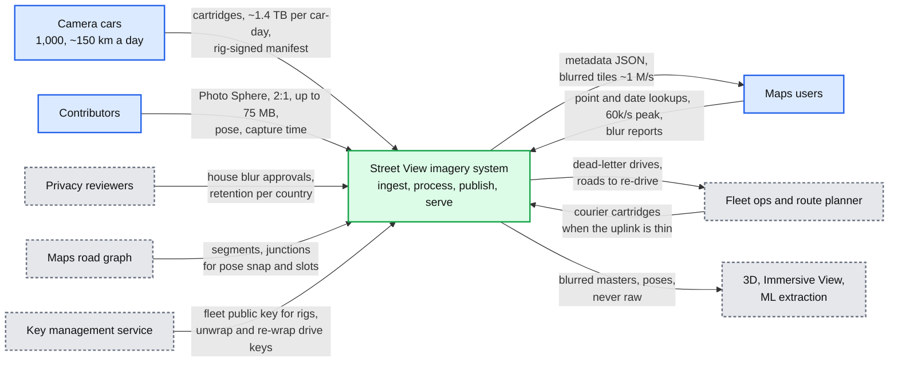

## D2. Data flow (DFD)

Names, formats, sizes and rates on every edge. The station only moves ciphertext. Raw is ~1.35 TB per drive, a published panorama ~27 MB.
```mermaid
%% D2: data flow. Stores are cylinders, processes are rounded boxes. Rates are fleet-wide at 1,000 cars.
flowchart LR
    CART[(Cartridge + mirror<br/>4 TB NVMe, 8 TB until LANDED)]:::store -->|"segments encrypted on the rig,<br/>1 GB + CRC32C, 27 TB per depot a night"| ST(Depot ingest station):::critical
    ST -->|"ciphertext segments, 1 GB,<br/>~1.4 M a day, 15.6 GB/s averaged"| LB[(Landing bucket)]:::store
    ST -->|"signed manifest + wrapped key,<br/>~1,000 drives a day"| REG[(Drive registry)]:::store
    REG -->|"drive.landed event,<br/>~1,000 a day"| WF(Per-drive workflow):::service
    LB -->|"raw segments,<br/>~1.35 TB per drive"| WF
    LB -->|"day 30 lifecycle,<br/>~1.35 PB a day at peak"| AR[(Raw in Archive<br/>key shred at 180 d)]:::store
    BR[(Blur registry)]:::store -->|"footprints by S2 cell"| WF
    WF -->|"JPEG tiles, ~40 KB, ~683 per pano,<br/>~405 TB a day"| TB[(Tiles bucket)]:::store
    WF -->|"PANORAMA rows STAGED, ~1 KB,<br/>15 M a day, ~170/s"| IDX[(Panorama index)]:::store
    TB -->|"tile manifest,<br/>one HEAD per pano"| PUB(Publisher):::service
    PUB -->|"chunk txn, ~100 panos per 1 km,<br/>~1.7 txn/s"| IDX
    IDX -->|"range scans on cache miss,<br/>~6k reads/s"| API(Metadata API + cache):::service
    API -->|"metadata JSON,<br/>60k req/s peak"| U[Maps client]:::client
    TB -->|"CDN fill on miss,<br/>~100k tiles/s, 4 GB/s"| CDN[(CDN edge)]:::cache
    CDN -->|"JPEG tiles, ~1 M/s,<br/>~320 Gbps"| U
    classDef client   fill:#dbeafe,stroke:#2563eb,stroke-width:2px,color:#111
    classDef service  fill:#dcfce7,stroke:#16a34a,stroke-width:2px,color:#111
    classDef store    fill:#ede9fe,stroke:#7c3aed,stroke-width:2px,color:#111
    classDef cache    fill:#fef3c7,stroke:#d97706,stroke-width:2px,color:#111
    classDef critical fill:#fee2e2,stroke:#dc2626,stroke-width:4px,color:#111
```

## D4. Contributor photo upload (FR1, small)

A Photo Sphere is a drive of one segment: start upload, bytes to a URL, create, then the same pipeline and publisher as a car-day.
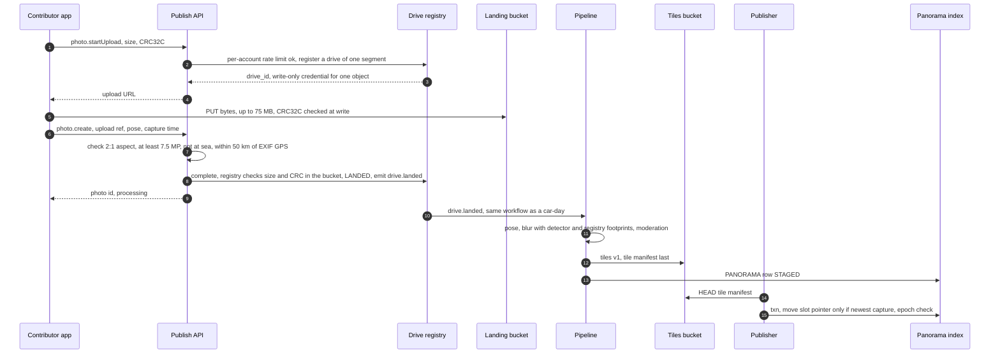

## D5. Ingest station crashes mid-drive

The station trusts the registry, not its own log: it re-registers, gets the missing list, resumes the half-sent segment and skips every verified one.
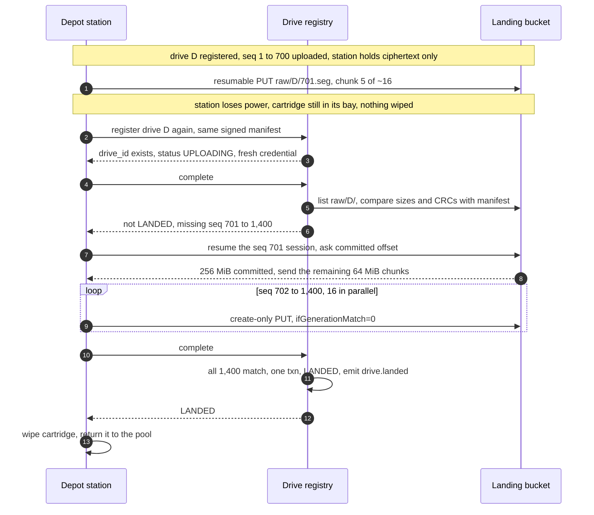

## D5. Zombie worker fenced at publish

A publish worker stalls past its lease. The new owner finishes the drive, and the zombie's late transaction fails the epoch check.
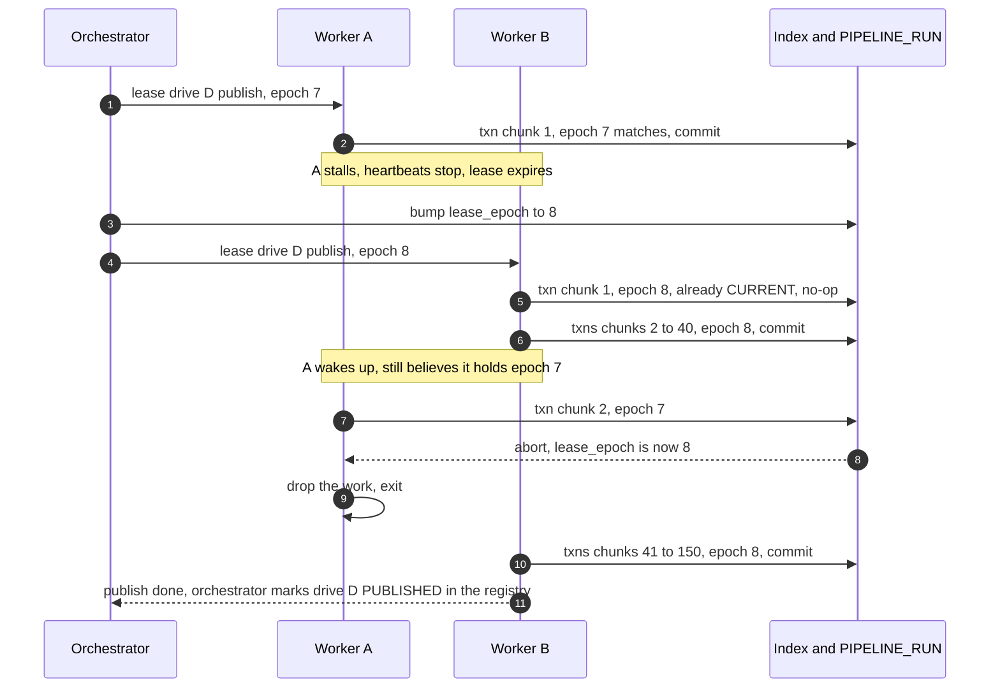

## D5. CDN invalidation fails during a takedown

Order is bump, delete at origin, invalidate, verify. The first invalidation is rejected, the verification GET keeps returning 200, and the panorama is not done until it returns 404.
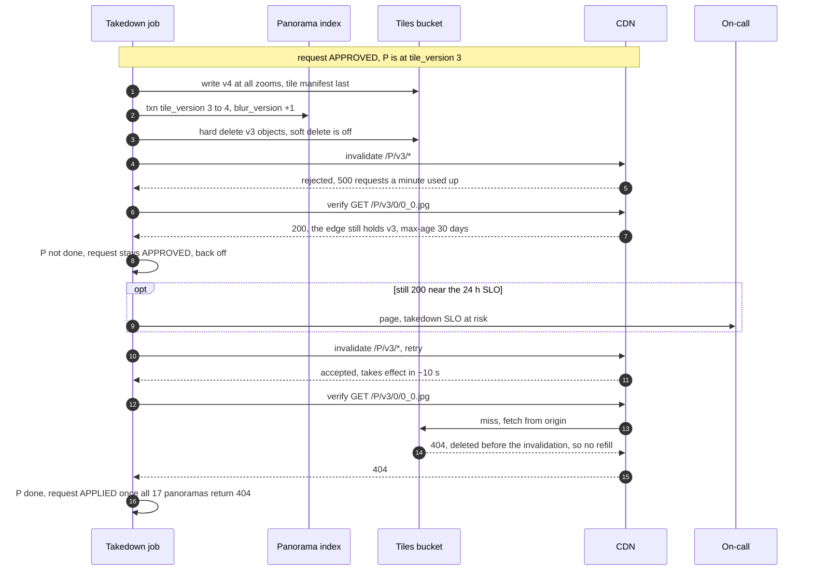

## D6. Metadata lookup decision flow

One lookup: cache first, then 1 to 4 short range scans, widen once, else 404.
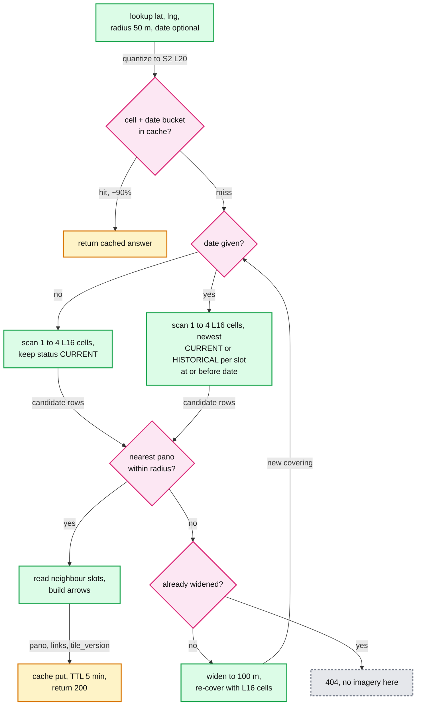

## D6. Publisher decisions per chunk

Tiles first, then the blur_version guard, then the fence, then one rule per panorama: current means newest capture, not newest publish. One transaction per 1 km chunk.
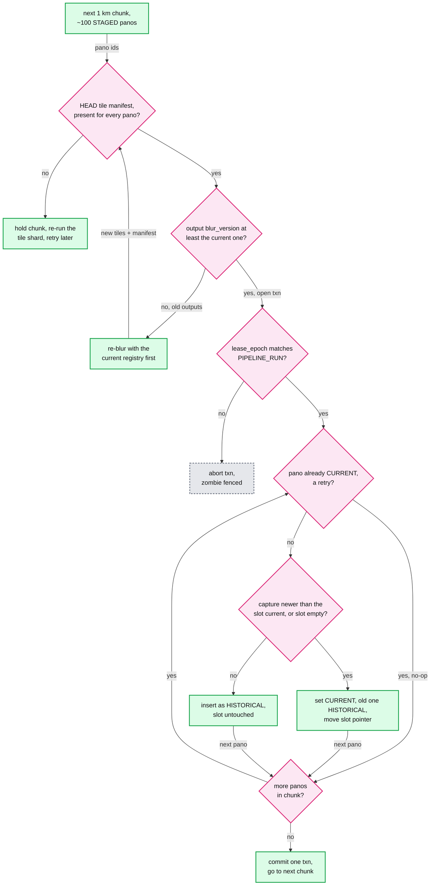

## D8. Drive lifecycle

LANDED is the commit point: the cartridge may be wiped only from there on. Raw moves to Archive at day 30 and its per-drive key is destroyed at day 180.
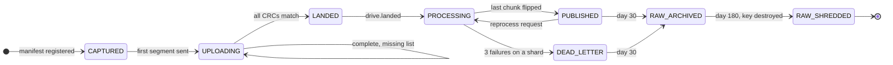

## D8. Panorama lifecycle

Exactly one CURRENT per slot. A takedown re-versions tiles in place and keeps the status. Removing a CURRENT panorama promotes the newest HISTORICAL one in the same transaction, so the slot is never empty.
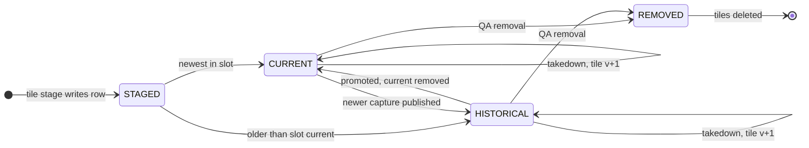

## D9. Deployment / topology

Depots upload into an ingest region pair. The pipeline runs in region A, so raw is read in-region. Three serving regions hold index replicas behind a global CDN.
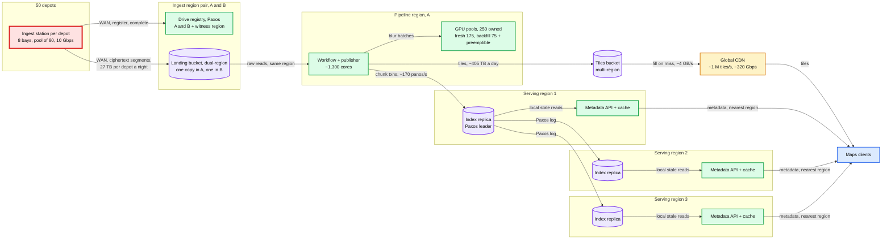

- **Crosses a region boundary:** depots to the ingest pair (~125 Gbps fleet-wide, 50 x 2.5 Gbps averaged, ciphertext only). A to B landing replication (the same bytes). Pipeline to tiles bucket (405e12 B x 8 / 86,400 s = ~37.5 Gbps). Publisher to the index leader (~170 panos/s). Leader to followers (Paxos log). Tiles to CDN on a miss (~4 GB/s).
- **Never crosses:** unblurred raw stays in the ingest pair. Serving regions hold only blurred tiles and metadata.
- **Replication:** landing bucket 2 regions, erasure-coded inside each. Registry Paxos in A and B plus a witness in a third region, because two regions alone lose the majority when one dies. Index 3 regions, one replica each. Tiles multi-region. CDN global.

## D10. Scaling / partitioning

The index is range-split on a Hilbert-ordered key, the registry is keyed by drive, ingest scales by adding depots, and a hot cell is a read problem absorbed by caches.
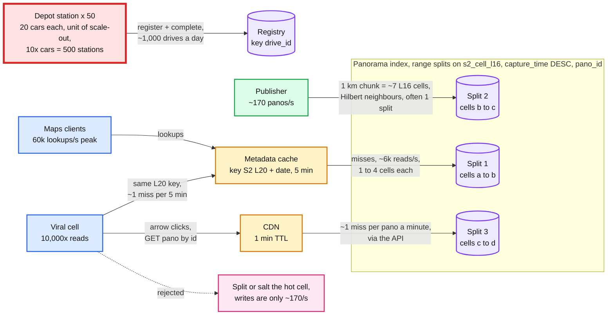

- **Shard count:** splits are cut by size and load, not fixed. The index grows ~4 TB a year (3.75 B rows x ~1 KB). At an assumed ~10 GB per split, that is ~400 new splits a year.
- **Chunk locality:** 1 km / ~140 m per L16 cell = ~7 cells, adjacent on the Hilbert curve, so a chunk usually commits in one Paxos group, else two-phase commit over two.
- **Ingest:** stations share nothing but the registry. 10x cars is 10x stations, and the registry still sees only ~10k drives a day.

## D11. Failure mode map

Component on the first edge, what fails in the box, blast radius on the second edge, mitigation in the last box.
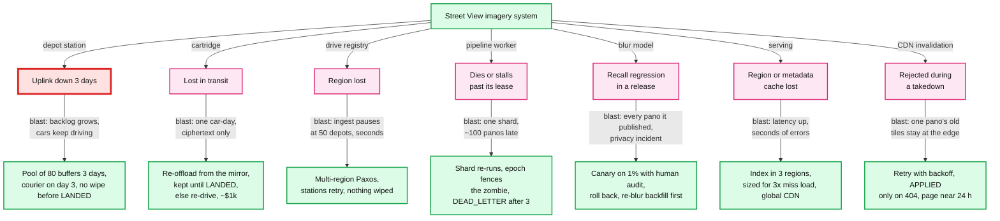

## D12. Rollout / migration

The four phases of `solution.md` §8 Migration. Durations are assumptions. Each phase closes with a rollback point, and slots make "publish from the old pipeline again" one chunk transaction per km.
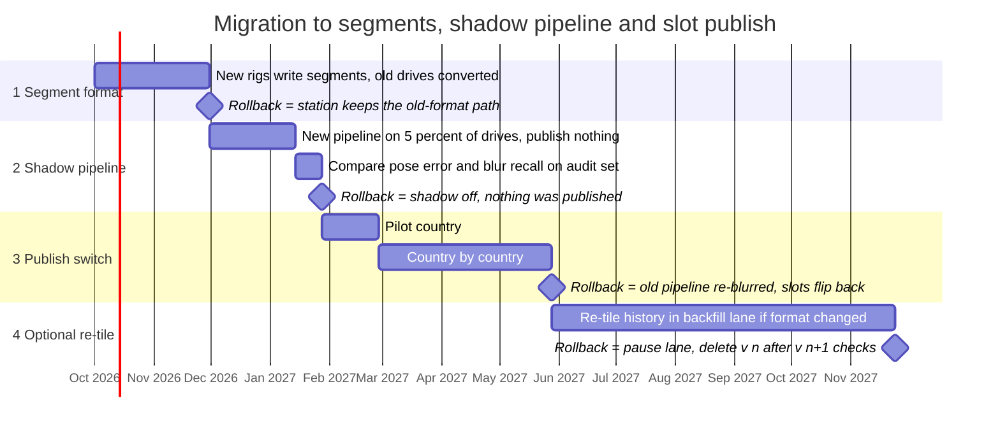
