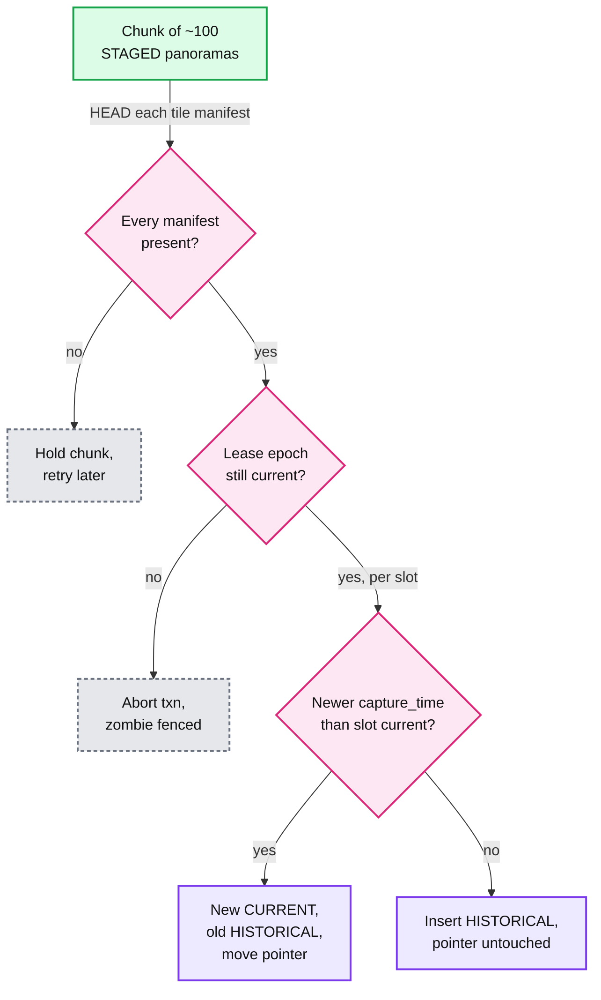

# Edge cases: Street View ingestion and storage

Every entry is answerable in under 60 seconds out loud. Design reference: [`solution.md`](solution.md). "§" numbers point into it. Numbers come from solution §2, or are derived with the math shown, or are marked as an assumption.

---

## Failure

## Edge case: a cartridge is wiped before its drive landed
- **Trigger:** a station release wipes on "upload loop finished" instead of on LANDED, and segment 812 failed its last chunk silently.
- **Symptom:** the drive sits in UPLOADING. `POST /v1/drives/{id}:complete` returns "missing: 812". The cartridge in the bay is already blank. Nothing is processed, because `drive.landed` never fires.
- **Answer:**
  - Prevented by design: the station reads LANDED from the registry, never from its own log. LANDED is one transaction that checks every object's size and CRC32C (a checksum) against the rig-signed manifest (§5.1).
  - Survivable if it happens anyway: the car's onboard mirror never evicts an un-LANDED drive (§4.1 step 1). Pull segment 812 at the next depot visit, upload it create-only to `raw/{drive_id}/812.seg`, call `:complete` again.
  - Only if the mirror SSD also failed is it gone. 1 GB is ~110 m of road (9 GB per km), so re-drive that stretch. A whole car-day costs ~$1k to re-drive.
- **Diagram:** the station decision flow in [`solution.md` §5.1](solution.md#51-how-do-you-move-14-pb-a-day-off-1000-cars-without-ever-losing-a-drive), and [Flow 1](solution.md#flow-1-a-car-day-lands-fr1).
- **Confidence:** [ ] shaky  [ ] ok  [ ] confident

## Edge case: the depot uplink is down for three days
- **Trigger:** fiber cut or ISP outage at one depot of 20 cars.
- **Symptom:** backlog grows 27 TB a night. The depot's 60 empty cartridges drop by 20 a night. Maps users see nothing.
- **Answer:**
  - Nothing is wiped before LANDED, and the mirror keeps every un-LANDED drive, so nothing is lost and there are two copies throughout. Pool of 80 = 20 in the cars + 60 empties: after the evening swaps of days 0, 1 and 2 the depot has 40, 20, then 0 empties (§5.1).
  - Day 3 morning: courier the 60 full cartridges overnight to a regional ingest center, which ships 60 empties back from its own stock. It registers, uploads and completes each drive, then wipes them into its stock.
  - Day 3 evening there is no empty to swap into, so each car keeps its 4 TB cartridge (~2.9 car-days) a second day. The fleet never stops.
  - When the link returns, the station asks the registry for the missing list and uploads only those segments. Page: fewer than 20 empty cartridges with no courier booked (§8).
- **Diagram:** [`solution.md` Flow 5](solution.md#flow-5-the-depot-uplink-dies-failure).
- **Confidence:** [ ] shaky  [ ] ok  [ ] confident

## Edge case: a cartridge is lost in the mail
- **Trigger:** a courier box goes missing (the outage fallback above, or a remote capture that always ships).
- **Symptom:** a shipped drive never registers. The 14-day target for shipped cartridges (§1.2) is the backstop alarm.
- **Answer:**
  - Mirror first: the car's mirror keeps every un-LANDED drive (up to ~5 car-days), so re-offload that car-day from it (§5.6).
  - Remote captures ship for 1 to 2 weeks (§5.1), longer than the mirror holds, so the field team copies each cartridge to a second one before shipping and keeps it until LANDED. Only if both copies are gone: re-drive, ~$1k per car-day.
  - Privacy: the box is ciphertext. The rig encrypts every segment with a per-drive DEK (data encryption key) wrapped by the fleet's KMS public key, and that fleet key version is destroyed once its drives are LANDED (§10.10). A found cartridge is noise.
- **Confidence:** [ ] shaky  [ ] ok  [ ] confident

## Edge case: the ingest station crashes mid-upload
- **Trigger:** power loss or a kernel panic with 8 bays busy and 16 uploads in flight.
- **Symptom:** drives stall in UPLOADING. Users see nothing.
- **Answer:**
  - Restart and ask the registry what is verified, not the local log. Names are deterministic (`raw/{drive_id}/{seq}.seg`) and uploads are create-only (`ifGenerationMatch=0`), so the station uploads only the registry's missing list, and a create-only PUT that returns 412 means the object is already there (§5.1, §10.5).
  - A half-sent segment resumes from the store's committed offset in 64 MiB chunks. Worst case re-sends 16 x 1 GB = 16 GB, ~13 s at 10 Gbps.
  - A station that stays dead is the red node failing. Treat it as the uplink outage: pool, then courier. It is red because 20 cars' only copies meet one box and one 10 Gbps link (§4.1).
- **Confidence:** [ ] shaky  [ ] ok  [ ] confident

## Edge case: the drive registry loses a region
- **Trigger:** one region of the Spanner-like registry (multi-region, Paxos-replicated) goes down.
- **Symptom:** `POST /v1/drives` and `:complete` fail for seconds. Ingest pauses. The ingest API target is 99.9%, not 99.99% (§1.2).
- **Answer:**
  - Paxos moves leadership to a surviving region: seconds of write unavailability, no data lost (§5.6).
  - Stations retry with backoff. They cannot read LANDED, so they cannot wipe. The failure mode is "late", never "lost", and the cartridge pool absorbs even days.
  - Serving does not notice: on a cache miss the metadata API uses stale reads at a timestamp, which any replica serves (§10.1). Page: registry write errors > 1% for 10 min (§8).
- **Confidence:** [ ] shaky  [ ] ok  [ ] confident

---

## Consistency

## Edge case: the same street is driven twice in a week, and out of order
- **Trigger:** drive A captures a street on Monday, drive B on Thursday. A was couriered, so B lands and publishes first.
- **Symptom:** without a rule, A publishes last and Monday's imagery replaces Thursday's.
- **Answer:**
  - Current means newest `capture_time`, not newest publish. The chunk transaction compares with the slot's current panorama and only moves the pointer forward (§4.3, §5.4). A goes in as HISTORICAL.
  - Both chunk transactions touch the same slot rows in a strongly consistent index, so they serialize. Whichever commits second sees the other.
  - If the re-drive was not planned, the select stage drops a second capture of a slot already refreshed this week (§5.1). History does not fill with near-copies.
- **Diagram:** the publisher's checks for one chunk. The next three entries use it too.

- **Confidence:** [ ] shaky  [ ] ok  [ ] confident

## Edge case: a reprocessed old drive is published after a newer one
- **Trigger:** a stitch fix re-runs a March drive from raw (inside the 180-day window) and republishes it in August, after a July drive of the same streets.
- **Symptom:** risk that March takes the slots back from July.
- **Answer:**
  - Same forward-only rule: March loses to July on `capture_time` and stays HISTORICAL.
  - `pano_id = hash(drive_id, capture_seq)` is stable across reprocessing, so the rerun updates its own rows. No duplicate panoramas.
  - Tiles are immutable per version, so the rerun writes `v{n+1}` and bumps `tile_version` in one transaction. Old and new tiles never mix.
  - The blur registry is an input to reprocessing, so a re-stitch from raw cannot bring back a house blurred since March (§5.5).
- **Confidence:** [ ] shaky  [ ] ok  [ ] confident

## Edge case: a zombie worker wakes up after its lease expired
- **Trigger:** a worker pauses (GC, network partition) past its lease. The orchestrator re-leases the shard with epoch + 1.
- **Symptom:** two workers write the same shard, and the old one tries to finish.
- **Answer:**
  - Duplicate writes are harmless: the path `work/{drive_id}/{stage}/{pipeline_version}/{shard}` is deterministic, and readers trust only a manifest written last (§5.3).
  - The dangerous write is publish. The publish transaction checks `lease_epoch` on `PIPELINE_RUN`, so the stale epoch aborts. See [`../../concepts/leases-fencing-clocks.md`](../../concepts/leases-fencing-clocks.md).
- **Diagram:** [publisher checks](#edge-case-the-same-street-is-driven-twice-in-a-week-and-out-of-order), the epoch branch.
- **Confidence:** [ ] shaky  [ ] ok  [ ] confident

## Edge case: a publish chunk would become visible before its tiles exist
- **Trigger:** a tile shard is still uploading, or failed, when the publisher reaches its chunk. Or the publisher crashes after chunk 70 of a drive's ~150.
- **Symptom:** users would see grey squares, and the tile 404 rate would climb.
- **Answer:**
  - Invariant "tiles exist before visible": the tile stage writes a per-panorama tile manifest last. The publisher HEADs every manifest in the chunk before the transaction (§4.3). Missing means hold.
  - The check sits in the transaction path, not a runbook, because a bad publisher release is the other way to break it (§8). If it breaks anyway, tile 404 rate > 0.1% pages.
  - A crash between chunks leaves half a drive live. That is valid: each slot still has exactly one current. A retry is a no-op for chunks already done (§10.5).
- **Diagram:** [publisher checks](#edge-case-the-same-street-is-driven-twice-in-a-week-and-out-of-order), the manifest branch.
- **Confidence:** [ ] shaky  [ ] ok  [ ] confident

## Edge case: a stale client refills the CDN with a taken-down tile
- **Trigger:** a takedown bumps a panorama from v3 to v4. For up to 5 min the metadata cache (1 min for `GET /panos/{id}` at the CDN) still hands out v3.
- **Symptom:** if the CDN (content delivery network) invalidation of `/{pano_id}/v3/*` runs before v3 is gone at origin, one stale request refills the edge with unblurred v3, cached for up to 30 days.
- **Answer:**
  - Order closes it: bump the version, hard-delete v3 at origin, then invalidate the CDN, then fetch the old URL and expect 404. With origin gone, a refill can only fetch a 404. With invalidate-first, the 404 check is what catches the race.
  - A stale client meanwhile gets grey tiles for up to 5 min. That is fail-closed on purpose: a grey square beats a face.
  - The index is strong at the bump. Readers converge within the 5 min TTL (time to live) (§10.6).
- **Confidence:** [ ] shaky  [ ] ok  [ ] confident

---

## Scale

## Edge case: a viral location makes one cell 10,000x hotter
- **Trigger:** a news event or a new landmark. Everyone drops the pegman in the same ~140 m cell.
- **Symptom:** one S2 level-16 key range takes a spike of reads.
- **Answer:**
  - Only reads are hot. Publish writes are ~170/s globally, so there is no write-hot shard and no key salting (§3.3).
  - Metadata: cache keyed by (S2 level-20 cell, date bucket) with a 5 min TTL, plus the CDN in front of `GET /panos/{id}` at 1 min (§5.4). The hot cell becomes a cache hit. Coalesce misses per key, one index scan per expiry, not thousands (our addition, see [`../../concepts/caching-patterns.md`](../../concepts/caching-patterns.md)).
  - Tiles: immutable URLs cached at the edge for 30 days. A few hot panoramas are the best case for a CDN, not the worst.
- **Confidence:** [ ] shaky  [ ] ok  [ ] confident

## Edge case: 10x cars tomorrow
- **Trigger:** 10,000 cars.
- **Symptom:** ~14 PB of raw a day, ~1.25 Tbps sustained, 150 M panoramas a day.
- **Answer:**
  - Ingest scales out: 500 depots, each an independent box with no shared state except the registry, which sees ~14k drives a day (§5.6). Publish writes rise to ~1,700/s (150 M / 86,400). Still small.
  - Compute goes linear: ~13,000 cores and ~1,750 GPUs for fresh drives. Compute was never the cost.
  - Storage is the question. 10,000 x 150 km x 250 days = 375 M km a year against ~80 M km of roads: every road ~4.7 times a year, so most new bytes are re-drives. Levers: wanted-slots dedup, one capture per 10 m on straight roads, raw kept 30 days outside EU-reviewed markets, a refresh target per road (§5.6).
- **Confidence:** [ ] shaky  [ ] ok  [ ] confident

## Edge case: cameras are on taxis instead of dedicated cars
- **Trigger:** the Hello Interview variant. No depot, and a taxi drives the same downtown streets ~50 times a day.
- **Symptom:** a naive design uploads 50 copies of each downtown slot a day, and nothing rural.
- **Answer:**
  - Dedup before upload. Each device downloads a daily "wanted slots" list (slots whose current panorama is older than the refresh target) and keeps only captures in those slots (§5.1). The cheapest byte is the one never uploaded.
  - Upload at night over garage Wi-Fi with the same shape: register, create-only upload, complete. The device keeps its copy until the registry says LANDED.
  - Server-side backstop: the select stage drops a second capture of a slot already refreshed this week.
  - Rejected: perceptual-hash dedup against the archive, billions of comparisons to learn what the slot pointer already knows (§10.7). Trade-off: taxis only cover where taxis go.
- **Confidence:** [ ] shaky  [ ] ok  [ ] confident

## Edge case: a GPU backfill starves fresh drives
- **Trigger:** a new blur model. A full pass over 5 years (~19 B panoramas) is ~220k GPU-days, 1,000 GPUs for ~7 months (§2).
- **Symptom:** with one shared queue, fresh drives stop publishing and LANDED to published p95 blows past 7 days.
- **Answer:**
  - Two lanes with separate quotas: fresh gets 70% of GPUs and a 7-day SLO (service level objective). Backfill gets the rest plus preemptible, no SLO (§5.3).
  - Do the lane math: 30% of 250 GPUs is 75, which would need ~8 years (220k / 75 days). The backfill really runs on preemptible capacity.
  - Value order makes that fine. Current imagery is ~4 B panoramas (~40 M km x 100 per km). Its hot 20% is ~0.8 B, ~9k GPU-days, ~9 days on 1,000 GPUs. History goes last, and only panoramas with new finds are re-tiled: 19 B becomes ~500 M.
- **Confidence:** [ ] shaky  [ ] ok  [ ] confident

---

## Data

## Edge case: the rig's clock or GPS is wrong for a whole drive
- **Trigger:** a failing GPS receiver, urban-canyon multipath all day, or a rig clock that reset.
- **Symptom:** panoramas snap to the wrong road or slot. A wrong clock makes a drive win or lose "current" by mistake.
- **Answer:**
  - Pose fuses GPS, IMU (inertial unit) and wheel encoders at 100 Hz and snaps to the road graph, so short GPS gaps are bridged. Visual matching against earlier drives of the same roads corrects drift (§4.2).
  - A whole-drive fault fails QA, and the drive is flagged for re-drive, not published (§4.2 step 6).
  - Clock: reject a `capture_time` outside the manifest's `capture_date` (our check). A bad clock must never move a slot pointer, since current = newest capture.
  - A pose software bug found later is fixed by re-posing from raw inside 180 days. After that, re-drive (§5.2).
- **Confidence:** [ ] shaky  [ ] ok  [ ] confident

## Edge case: one camera dies at 11:02
- **Trigger:** camera 4 goes dark mid-shift.
- **Symptom:** stitch fails on every capture after 11:02. Those shards retry.
- **Answer:**
  - 3 failures per shard, then DEAD_LETTER with the error and the failing capture ids. Fleet ops sees "camera 4 dark after 11:02" and re-drives those roads. The queue keeps moving (§5.3).
  - Publish the good morning anyway (our choice). Shards are ~100 panoramas and publish is per 1 km chunk, so chunks before 11:02 go live while the drive carries DEAD_LETTER for the failed range. Otherwise good road is re-driven too.
  - Catch it at 11:02, not at night: rig health rides the thin cellular telemetry channel (§10.7), so the driver can turn back the same day.
- **Confidence:** [ ] shaky  [ ] ok  [ ] confident

## Edge case: a new blur model finds faces the old one missed
- **Trigger:** detector v10 has better recall on side profiles.
- **Symptom:** millions of published panoramas contain faces v9 missed.
- **Answer:**
  - Run it on blurred masters, not raw. A better detector can only add blur, masters are kept forever, and most raw is shredded anyway (§5.2).
  - Backfill lane, value order. Re-tile only where v10 finds something new: ~500 M of 19 B (§5.3). Each gets a new tile version in one transaction.
  - Do not invalidate each at the CDN: at 500 requests a minute, 500 M is ~1 M minutes, ~694 days. Clients stop building old URLs within the 5 min TTL, so delete the old version at origin, invalidate the hot set first within the 720k-a-day budget, and let the rest age out of the edge within the 30-day `max-age` (§4.5). Keep per-panorama invalidation for approved takedowns, where a named person is waiting.
- **Confidence:** [ ] shaky  [ ] ok  [ ] confident

## Edge case: a user asks to blur their house
- **Trigger:** a report with `kind: house` on one panorama.
- **Symptom:** the house is in ~20 panoramas over 5 dates, cached at CDN edges, and next year's drive will capture it again.
- **Answer:**
  - Store a footprint on the ground (from pose and depth, or the map's building footprint) with an S2 covering, not a pixel box. A human reviews it, since a blur is permanent (§4.5).
  - On approval: scan the index for the footprint's cells plus ~100 m across all dates, test visibility with each pose (Flow 4: 23 candidates, 17 see it). Each gets `v{n+1}` tiles at all zooms, one transaction for `tile_version` and `blur_version`, hard delete at origin (soft delete is off), then CDN invalidation, then a 404 check.
  - The footprint stays in the blur registry, so every future drive's blur stage applies it before publish. SLO: approved to unservable in 24 h at 99.9%. A miss pages (§8).
  - Scale check: Germany 2010 had 244,237 of 8,458,084 households (2.89%) opt out before launch. All must be in the registry before a city's first panorama goes live (§5.5).
- **Diagram:** [`solution.md` Flow 4](solution.md#flow-4-an-approved-blur-request-fr5).
- **Confidence:** [ ] shaky  [ ] ok  [ ] confident

## Edge case: a GDPR erasure request for a person in 2016 imagery
- **Trigger:** a person invokes GDPR (the EU General Data Protection Regulation): erase me from the 2016 panorama of my street.
- **Symptom:** the 2016 raw is long gone. The person is in a blurred master and in Archive history.
- **Answer:**
  - For published imagery, blurring is the erasure (§10.11). Run it as a face report on that date through the takedown path: new version, delete at origin, invalidate, 404 check.
  - Faces can be auto-approved, because over-blurring a face is harmless (§10.10).
  - Raw: the 2016 drive was crypto-shredded at day 180, its DEK (data encryption key) destroyed. For a recent drive, an expedited request shreds that one drive's key early. That is why keys are per drive (§10.11).
  - A person, unlike a house, is tied to one moment. Scope the registry entry to that capture's panoramas, not to every future drive (§4.5 step 7).
- **Confidence:** [ ] shaky  [ ] ok  [ ] confident

## Edge case: new rigs write a new segment format
- **Trigger:** a new rig generation adds a thermal camera or changes the record layout.
- **Symptom:** stations, landing and stages see two formats for months.
- **Answer:**
  - Segments are self-describing records with a type field, so the station and landing do not change. Only stages that read the new record type change (§10.11).
  - The manifest is fleet ops' contract with ingest (§8). Version it, and quarantine a manifest version the registry does not know rather than guess.
  - The new pipeline runs in shadow on 5% of drives, publishes nothing, is compared (pose error, blur recall), then switches per country. `pipeline_version` is in every output path, so both run side by side (§8).
- **Confidence:** [ ] shaky  [ ] ok  [ ] confident

---

## Operations

## Edge case: the raw shred job falls behind
- **Trigger:** the shredder crashes, hits a KMS (key management service) quota, or a lifecycle rule is edited wrong.
- **Symptom:** drives past `raw_delete_after` (capture + 180 days) are still RAW_ARCHIVED with a live DEK.
- **Answer:**
  - This is a compliance clock, not a backlog: ticket when behind by a day, page at 7 days, since that is a breach (§8).
  - Catch-up is cheap: shredding is one key destroy per drive (~1,000 a day), not a hunt for copies. Every copy (dual-region replica, backups, a stray export) becomes noise at once. Objects are deleted later, at leisure (§5.2).
  - Metric: drives with now > `raw_delete_after` and status not RAW_SHREDDED, per country.
- **Confidence:** [ ] shaky  [ ] ok  [ ] confident

## Edge case: a bad detector release
- **Trigger:** blur model v9 ships to 100% with a regression on side-profile faces.
- **Symptom:** at T+20 h, user reports of unblurred faces are up 5x in one country.
- **Answer:**
  - Prevent: canary on 1% of drives with a human audit set, privacy team sign-off, recall target >= 95% of faces (§10.2, §10.9).
  - Respond: page, freeze publishing from v9 drives with a publisher flag, roll back to v8. The backfill lane re-blurs every v9 panorama with v8 plus the registry at top priority. All replaced and invalidated by T+30 h (§10.4).
  - The widest blast radius in the system: every panorama the model touched. `pipeline_version` in every output path is how you find them.
- **Diagram:** [`solution.md` §10.4](solution.md#104-failure-timeline).
- **Confidence:** [ ] shaky  [ ] ok  [ ] confident

## Edge case: rolling out and rolling back a pipeline version
- **Trigger:** a new stitcher or tiler ships.
- **Symptom:** planned change. The hidden risk is a rollback that undoes a blur.
- **Answer:**
  - Rollout: versions run side by side because `pipeline_version` is in every output path. Canary on 1% of fresh drives, human audit, 10%, then 100% per country (§10.9).
  - Rollback: point the publisher at the previous version's outputs. Slots switch back one chunk transaction at a time. A detector rollback also triggers a re-blur backfill.
  - Guard (§10.9): never publish outputs whose `blur_version` is older than the panorama's current one. Old outputs predate later takedowns, so re-blur them with today's registry first. Blur only adds (§5.5).
- **Confidence:** [ ] shaky  [ ] ok  [ ] confident

## Edge case: what pages at 3 am
- **Trigger:** n/a.
- **Answer:**
  - Pages (§8): a takedown past 24 h (legal exposure). A depot with fewer than 20 empty cartridges and no courier booked. Registry write errors > 1% for 10 min. Tile 404 rate > 0.1% (a publish invariant broke). Raw shred behind by 7 days.
  - Tickets, not pages: pipeline backlog over 10 days, backfill lane starved, shred behind by a day.
  - SLOs behind them: capture to LANDED p99 48 h, LANDED to published p95 7 days, takedown 24 h at 99.9%, tile p99 150 ms at the edge, metadata p99 100 ms.
- **Confidence:** [ ] shaky  [ ] ok  [ ] confident

## Edge case: the storage bill doubles, what do you cut first
- **Trigger:** finance asks, or the fleet grows. Storage is already ~15 to 20x compute.
- **Symptom:** raw ~$1.0 M on average (~$1.4 M in a peak season), current imagery ~$1.3 M, history +~$120k a month per year kept (§8).
- **Answer:**
  - First, hot raw. Move each drive to Archive when it is PUBLISHED, not at day 30. At ~10 days on average (assumption, p95 is 7), hot raw drops from ~28 PB to ~9 PB on average (from ~40 PB to ~13.5 PB in a peak season): ~$370k of the ~$555k a month on average, ~$540k of ~$810k at peak. Archive cost is unchanged, since its 365-day minimum is billed either way.
  - Second, raw outside EU-reviewed markets: keep 30 days, never Archive. Archive raw costs $0.0144 per GB for life, x 1.35 PB a day x 250 days / 12 = ~$400k a month if applied everywhere.
  - Third, history: drop the top zoom after 10 years. It is 512 of ~683 tiles, ~75% of a panorama's bytes (§5.2). Never cut: masters, the ~4 TB a year index, or the 180-day shred.
- **Confidence:** [ ] shaky  [ ] ok  [ ] confident

---

## Security and abuse

## Edge case: a depot station's credential is stolen
- **Trigger:** a station's device certificate is copied, or a live scoped upload credential leaks.
- **Symptom:** registrations from an unexpected place, or junk objects under a drive's prefix.
- **Answer:**
  - The upload credential is write-only, scoped to `raw/{drive_id}/*`, for 7 days (§10.2). It cannot read raw or touch another drive. Create-only uploads cannot overwrite a landed segment.
  - Junk fails LANDED: sizes and CRC32C must match the rig-signed manifest. A fake drive needs a rig's hardware key, which the station does not hold.
  - Revoke the certificate at the registry, so no new credentials are minted. Blast radius is one depot's in-flight drives. See [`../../concepts/signed-url.md`](../../concepts/signed-url.md).
- **Confidence:** [ ] shaky  [ ] ok  [ ] confident

## Edge case: a forged or truncated manifest
- **Trigger:** someone edits a manifest to hide or add segments, or a rig loses power before it signs one.
- **Symptom:** a drive that claims to be complete but is not, or fake data.
- **Answer:**
  - The rig signs the manifest with a key in a hardware module. The registry verifies it at `POST /v1/drives`. A bad signature quarantines the cartridge and pages fleet ops (§5.1, §10.10).
  - Truncated: quarantine, never guess a manifest from what is on disk. Segments are self-checking (header, trailing CRC32C), so the rig can re-scan and re-sign at its next boot (assumption). Nothing is wiped meanwhile.
  - Replay of an old valid manifest is a no-op: `drive_id` is unique and LANDED is one-way (§10.5).
- **Confidence:** [ ] shaky  [ ] ok  [ ] confident

## Edge case: a competitor mass-reports a business to get it blurred
- **Trigger:** hundreds of "house" reports on a rival's storefront from fresh accounts.
- **Symptom:** the storefront would vanish from every date and every future drive. Blur is destructive, and there is no unblur.
- **Answer:**
  - Houses and businesses need a human reviewer. Only faces and plates are auto-approved, because over-blurring them is harmless (§4.5, §10.10).
  - Per-account and per-area rate limits: many reports in one S2 cell from new accounts is a signal for review, not a mandate. Every request has an audit trail.
  - The gate sits before approval, because after approval the footprint is in the registry and the old tiles are deleted.
- **Confidence:** [ ] shaky  [ ] ok  [ ] confident

## Edge case: someone scrapes the tiles and the metadata API
- **Trigger:** a bot walks the world cell by cell.
- **Symptom:** one client far above normal metadata QPS, and edge egress climbs.
- **Answer:**
  - The metadata API is the choke point: an API key or a signed-in Maps client, with quotas (§10.10). `pano_id` is a hash and tile URLs carry `tile_version`, so tiles cannot be enumerated without it.
  - Tiles stay public by design. Signed tile URLs were rejected: signatures in the cache key fragment the CDN (§10.7).
  - Current imagery is ~108 PB, so a full scrape is not the realistic threat. A city's metadata (poses, dates) is, and quotas bound it.
- **Confidence:** [ ] shaky  [ ] ok  [ ] confident

## Edge case: a contributor uploads a photo claiming the wrong location
- **Trigger:** a Photo Sphere posed in the sea, or pinned 50 km away to show up in another town.
- **Symptom:** a panorama in the wrong place, maybe on a road slot.
- **Answer:**
  - Location sanity rejects a photo claiming to be at sea, or 50 km from its EXIF GPS (the photo's own metadata). Plus a 75 MB cap, 2:1, >= 7.5 MP, per-account rate limits and moderation (§10.10).
  - It is a "drive of one" through the same pipeline and the same blur stage (§4.1).
  - EXIF can be faked too. Visual matching against earlier drives nearby (§4.2) is the stronger check. Decide whether a contributor photo may take a road slot from fleet imagery. Default (assumption): no, it fills off-road S2 level-20 slots and history.
- **Confidence:** [ ] shaky  [ ] ok  [ ] confident
