# HLD: Google Maps Street View ingestion and storage

> One-line answer: cars write each day of capture as checksummed, encrypted 1 GB segment files to a swappable SSD cartridge plus an onboard mirror; at night a depot ingest station uploads the segments into an encrypted landing bucket and a drive registry marks the drive LANDED only when every segment in the signed manifest matches, and only then may the cartridge be wiped; a per-drive batch workflow poses, stitches, blurs, selects and tiles panoramas into versioned, immutable tile objects; a publisher flips small chunks of panoramas to CURRENT in a strongly consistent index keyed by S2 cell and road slot, after the tiles exist; clients find a panorama through a cached metadata API and fetch tiles from a CDN; unblurred raw is crypto-shredded at 180 days, current imagery is tiered by access, history goes to archive; a blur request is stored as geometry so it re-blurs every past panorama, and for a house every future drive too. At 1,000 cars that is ~1.4 PB of raw a day and ~15 M panoramas a day, and storage costs ~15 to 20x compute. The red node is the depot ingest station, where the only copies of a car-day meet a fixed uplink.

Sources: [Anguelov et al., "Google Street View: Capturing the World at Street Level", IEEE Computer 2010](https://static.googleusercontent.com/media/research.google.com/en//pubs/archive/36899.pdf) (rigs, pose at 100 Hz, road snapping, stitch then tile then blur, shipped drives), [Frome et al., ICCV 2009](https://static.googleusercontent.com/media/research.google.com/en//archive/papers/cbprivacy_iccv09.pdf) (89% face and 94 to 96% plate recall), [Bigtable, OSDI 2006 §8.2](https://static.googleusercontent.com/media/research.google.com/en//archive/bigtable-osdi06.pdf) (Earth imagery: locality-named rows, small serving index over GFS), [Street View Publish API](https://developers.google.com/streetview/publish/first-app), [GCS storage classes](https://cloud.google.com/storage/docs/storage-classes) and [pricing](https://cloud.google.com/storage/pricing), [S2 cell statistics](https://s2geometry.io/resources/s2cell_statistics.html). Prompts: [TryExponent, "1000 cars"](https://www.tryexponent.com/questions/2109/design-google-street-view-1000-cars), [Hello Interview, taxi-mounted cameras](https://www.hellointerview.com/community/questions/image-uploader-dedup/cm4t1rgrn005988ilm7ct8ma1). Research notes and spot-check corrections in [`research/`](research/). Written flow-first: §4 builds one diagram one functional requirement at a time, §5 breaks and changes that design one non-functional requirement at a time, §6 is the final design plus the flows to rehearse.

---

## 1. Understanding the problem

Restate before designing. A fleet of camera cars drives every road it can. Each car carries a rosette of cameras, GPS, an inertial unit (IMU), wheel encoders and often lidar. At the end of the day the car holds over a terabyte of raw images and sensor logs. That data must reach the datacenter without loss, become blurred 360° panoramas placed on the road map, be stored for years at a sane cost, and be served to Maps users who drop the pegman anywhere on Earth. People can ask for their face, car or house to be blurred, and the blur must stick.

The trap is treating it as "upload photos to S3". Three things carry the interview:
- **Moving the bytes.** A car-day is ~1.4 TB. That does not fit through a phone network. Physics picks the design.
- **Storage over time.** ~340 PB of raw a year and ~100 PB of published imagery a year. What you keep, where, and for how long is the cost of the system.
- **Privacy is a correctness property.** Blur recall is below 100%, unblurred raw is personal data with a retention cap, and a blur request has to reach every copy, past and future.

### 1.1 Functional requirements

Core (the two published prompts plus what the 2010 paper describes):
1. **Ingest drives.** A car-day of capture (TBs, ~1,400 files of 1 GB) lands durably and verifiably, including from places with no connectivity. Contributor uploads (360 photos) enter the same way, smaller.
2. **Process.** Turn a landed drive into publishable panoramas: pose, pick one capture per ~10 m, stitch, blur faces and plates, quality-check, tile.
3. **Index and publish.** Place each panorama on the map by location, road and time. The newest one per spot is "current"; older ones stay as history. Publishing never shows a broken panorama or a dead navigation arrow.
4. **Serve.** Given a point (and optionally a date), return the right panorama and its neighbours, then its tiles at the zoom the viewer needs.
5. **Honour blur requests.** A reported face, plate or house is blurred in every published copy, current and historical, within 24 h of approval, permanently. A house (or any fixed object) also stays blurred in every future drive of the same street.

Below the line (say it out loud):
- Fleet routing and scheduling (which roads to drive when). A planner feeds us, we do not build it.
- 3D models, Immersive View, and ML extraction of signs and addresses. They are consumers of the pipeline's outputs. Name the seam: they read masters and poses, never raw.
- The viewer UI and the Street View Static API. We serve their data.
- Search, ranking, ads.

**Definition of "a panorama is published"** (agree before drawing):

| Question | Answer we pick | Why |
|---|---|---|
| Unit of capture | One capture event = one image per camera plus sensor samples, every ~5 m | Overlap for pose refinement, and a choice of frames |
| Unit of publication | One stitched, blurred panorama per road slot (~10 m of road) | Users step ~10 m per click. Denser adds bytes, not value |
| Same street driven twice | Both kept. Newer becomes current, older becomes history | Time travel is a feature (historical imagery since 2014) |
| What "current" means | Exactly one current panorama per road slot, never zero during a flip | Readers never see a hole or a double |
| What a user can see | Only blurred pixels. Never raw | Raw is personal data |

### 1.2 Non-functional requirements

Ask for scale first. The TryExponent prompt gives it: 1,000 cars. Google does not publish rig bitrate, so state assumptions and show they are sane.

| Dimension | Target | Why this number |
|---|---|---|
| Fleet | 1,000 cars, ~150 km each per 8 h day, ~250 driving days a year | Prompt. 37.5 M km a year re-drives the ~40 M km we cover about once a year. Assumption: coverage is about half the world's ~80 M km of roads (the paper quotes ~50 M miles); the rest is unpaved, private or not permitted. Sane |
| Raw rate | ~1.4 TB per car-day, ~1.4 PB per peak day, ~340 PB a year | §2. Assumed rig: 7 cameras x 20 MP every 5 m |
| Raw durability | No car-day ever lost after capture. Two copies until LANDED, 11 nines after | A lost car-day costs a re-drive (~$1k) and the moment cannot be recaptured |
| Ingest latency | Capture to LANDED p99 48 h from a depot. 14 days for shipped cartridges | Nothing downstream is faster than days, so hours do not matter |
| Publish latency | LANDED to published p95 7 days, p99 21 days | Human QA sampling and backlog. Street View is not news |
| Serving | Peak 60k metadata requests/s and ~1 M tile requests/s. Metadata p99 < 100 ms, tile p99 < 150 ms on a CDN hit | Assumption. The Bigtable paper's Earth serving index took "tens of thousands of queries per second per datacenter" |
| Availability | Serving 99.99%. Ingest API 99.9%. Pipeline may lag, never lose | Maps is user-facing. Ingest and pipeline are batch |
| Consistency | Drive registry and publish: strong. Metadata reads: eventual, bounded by a 5 min cache TTL. Tiles: immutable per version | Publish must never expose a broken state. Reads tolerate minutes |
| Privacy | Automatic blur on every published pixel. Unblurred raw deleted by 180 days. Approved blur requests live everywhere within 24 h and never come back | EU regulators asked for a 6-month cap on unblurred copies in 2010 ([EDRi](https://edri.org/our-work/edrigramnumber8-5article-29-wp-google-street-view/)); Google committed to 12 months from publication. We design for the stricter one |
| Cost | Storage per published km flat or falling year over year | Storage is ~15 to 20x compute here (§2). It is the budget line that grows |

Below the line: real-time imagery (live cameras), sub-day freshness, per-user private imagery.

---

## 2. Back-of-envelope

**Capture.** Assume a modern rig of 7 cameras x 20 MP (Google's 2010 R7 rig was 15 x 5 MP per the [IEEE paper](https://static.googleusercontent.com/media/research.google.com/en//pubs/archive/36899.pdf)). JPEG at ~0.3 B per pixel = 6 MB per image, 42 MB per capture, plus ~3 MB of lidar, GPS and IMU samples = **~45 MB per capture**. One capture per 5 m = 200 per km = **~9 GB per km**.

**Per car.** 150 km x 9 GB = **1.35 TB per car-day**. Round to 1.4 TB. At 25 km/h average that is ~1.4 captures/s, ~63 MB/s while driving.

**Fleet.** 1,000 x 1.35 TB = **1.35 PB per day**. x 250 days = **~340 PB of raw a year**. As a sustained rate: 1.35 PB / 86,400 s = 15.6 GB/s = **~125 Gbps**, all day, every driving day.

**Why not upload from the car.** 1.35 TB over a 20 Mbps LTE uplink = 1.35e12 x 8 / 20e6 = 540,000 s = **150 hours per car-day**. Over 100 Mbps 5G it is still 30 hours. Uploading from the car is not a design option, it is arithmetic.

**Depots.** 50 depots of 20 cars. 27 TB per depot per night. On a 10 Gbps uplink (1.25 GB/s) that drains in **~6 h**. Averaged over the day it is 2.5 Gbps, 25% of the link.

**Shipping break-even.** A courier carrying 10 cartridges (13.5 TB) overnight is 13.5e12 x 8 / 86,400 s = **1.25 Gbps effective**. A site with an uplink under ~1 to 2 Gbps should ship, not upload.

**Published panoramas.** One per 10 m = 100 per km. 150k km per day = **15 M panoramas per day**, ~3.75 B a year. Assume a panorama tops out at 16,384 x 8,192 px in 512 px tiles: 32 x 16 = 512 tiles at max zoom, ~683 across all zoom levels, ~40 KB each = **~27 MB per panorama**. 15 M x 27 MB = **~405 TB per day, ~100 PB a year**. That is 2.7 GB per km against 9 GB of raw, a 3.3x cut.

**Metadata.** ~1 KB per panorama (pose, road slot, tile version, status, links) x 3.75 B = **~4 TB a year**. Small. For scale, Google Earth's serving index in 2006 was ~500 GB.

**Compute (fresh drives).** Stitch ~5 CPU-s, tile and encode ~2 CPU-s, blur detection ~1 GPU-s per panorama. 15 M a day gives ~870 + ~350 cores and ~175 GPUs busy on average, plus ~100 cores of pose. Roughly **1,300 cores and 175 GPUs**. Reprocessing is bigger: re-running a new blur model over 5 years of history (~19 B panoramas) is ~19 B GPU-s = **~220k GPU-days**, 1,000 GPUs for ~7 months. The backfill lane, not fresh drives, sizes the GPU pool.

**Storage cost** (GCS us-central1 list prices as a proxy, per GiB-month, treated as per GB here, which overstates cost by ~7%: Standard $0.020, Nearline $0.010, Coldline $0.004, Archive $0.0012, [pricing](https://cloud.google.com/storage/pricing)). Raw kept 30 days hot is ~28 PB on average (340 PB / 365 x 30), ~$555k a month, and ~40 PB (~$810k) in a peak season when every day is a driving day. Current imagery (~40 M km x 2.7 GB = ~108 PB) all in Standard is ~$2.2 M a month. Compute above is ~$150k a month. **Storage is ~15 to 20x compute.** Every big decision in §5.2 is a storage decision.

**Serving.** Assume 20k panorama opens/s and 40k arrow-clicks/s at peak. ~25 tiles per open, ~10 per move = ~900k tiles/s, round to 1 M. x 40 KB = 40 GB/s, **~320 Gbps at the edge**. At a 90% CDN hit rate the origin sees ~100k tiles/s (4 GB/s) and the metadata store ~6k reads/s.

---

## 3. The set-up

Data-processing style: system interface, naive data flow, then the data model.

### 3.1 System interface

**Input**
- **Fleet drive.** From a depot station: `POST /v1/drives` with the signed manifest `{drive_id, vehicle_id, capture_date, segments: [{seq, bytes, crc32c}], wrapped_dek, rig_signature}` returns a credential scoped to `raw/{drive_id}/*` for 7 days. Segment bytes go straight to the object store (resumable). `POST /v1/drives/{id}:complete` asks the registry to verify. Response: `LANDED` or the list of missing or mismatched segments.
- **Contributor photo.** The public [Publish API](https://developers.google.com/streetview/publish/first-app) shape: `photo.startUpload` returns an upload URL, the bytes go there, `photo.create` sends pose and capture time. Photo Spheres must be 2:1, at least 7.5 MP, at most 75 MB ([requirements](https://support.google.com/maps/answer/7012050?hl=en)).
- **Blur request.** `POST /v1/panos/{pano_id}/reports {kind: face|plate|house|other, region, reason}`.

**Output**
- `GET /v1/panos:lookup?lat=&lng=&radius_m=50&date=` returns `{pano_id, capture_date, lat, lng, heading, tile_version, max_zoom, links: [{pano_id, heading}], dates: [...]}`.
- `GET /v1/panos/{pano_id}` returns the same, by id. This is the path for arrow clicks.
- `GET https://tiles.example/{pano_id}/v{tile_version}/{z}/{x}_{y}.jpg`: immutable, `Cache-Control: public, max-age=2592000, immutable` (30 days, §4.5 says why not a year).
- Internal: `POST /v1/drives/{id}:reprocess {stages, pipeline_version}`.

### 3.2 Data flow (deliberately naive)

1. Each car uploads each image over LTE as it is taken, to an upload API.
2. The API stores the JPEG as a BLOB in a SQL table with `lat, lng, taken_at`.
3. A nightly cron stitches the images of each capture, blurs faces, and writes the panorama back as another BLOB.
4. The viewer runs `WHERE lat BETWEEN ... AND lng BETWEEN ... ORDER BY taken_at DESC LIMIT 1`.

It fails on every axis. LTE needs 150 hours per car-day (§2). A SQL table cannot hold 1.4 PB a day of blobs. A bounding box on two B-tree columns scans a latitude band of the planet. A crash mid-upload leaves half a capture with no way to know. The unblurred originals live forever next to the blurred ones. Nobody can say which image is "current" for a street. §4 fixes each of these.

### 3.3 Data model

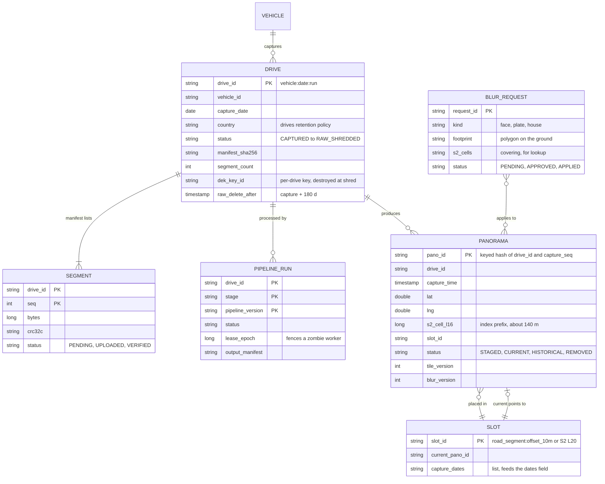

Access patterns that justify it:
- **"Is drive D complete?"** reads `SEGMENT` rows for one `drive_id`: ~1,400 rows, one key range.
- **"Panorama nearest (lat, lng), current or at date T"** covers a 50 m circle with 1 to 4 S2 level-16 cells (~140 m, [S2 stats](https://s2geometry.io/resources/s2cell_statistics.html)) and range-scans the index table `(s2_cell_l16, capture_time DESC, pano_id)`. S2 ids are Hilbert-ordered, so neighbouring cells are neighbouring keys. That is the Bigtable paper's Earth trick: "rows are named to ensure that adjacent geographic segments are stored near each other".
- **"Panorama by id"** (arrow click) is a point read on `PANORAMA`.
- **"Neighbours of this panorama"** reads the adjacent `SLOT` rows on the road graph and follows `current_pano_id`. Links are slot to slot, resolved at read time, so a new drive never rewrites old panoramas' links.
- **"Everything that can see this house"** covers the house footprint plus 100 m with S2 cells and scans the index for all dates.
- **Bytes** never live in the database. Raw: `raw/{drive_id}/{seq}.seg`. Tiles: `tiles/{pano_id}/v{tile_version}/{z}/{x}_{y}.jpg`. Paths are deterministic, so a retry writes the same object.

Partition key: `s2_cell_l16` for the index, `drive_id` for the registry. No hash salting: publish writes are ~170/s on average (15 M a day), so locality beats spreading.

---

## 4. High-level design

One subsection per functional requirement. Each traces input to output, adds boxes to one diagram, and ends with what is still missing. §5 fixes the gaps.

### 4.1 Ingest: a car-day lands durably, then the cartridge may be wiped

**Flow**

1. The rig writes captures into **append-only segment files of 1 GB**. Each segment has a header (drive, seq), records (capture id, timestamps, images, sensor samples) and a trailing CRC32C computed over the encrypted bytes, so the keyless station, the object store and the registry all check the same value. It writes every segment twice: to a **swappable NVMe cartridge** (4 TB, ~2.9 car-days) and to an **onboard mirror SSD** (8 TB, ~5.9 car-days) that evicts a drive only after the registry has marked it LANDED. Segments are encrypted on the rig with a fresh per-drive data encryption key (DEK), which the rig wraps with the fleet's KMS public key: the rig can wrap, not unwrap, so a lost cartridge is ciphertext. At shutdown it writes a manifest (segment list, sizes, checksums, wrapped DEK) signed with the rig's key.
2. At the depot the driver swaps the cartridge for an empty one. The car can leave in minutes. The full cartridge goes into a bay on the **depot ingest station**.
3. The station registers the drive: `POST /v1/drives` with the manifest. The **drive registry** (a Spanner-like strongly consistent DB) creates `DRIVE` and `SEGMENT` rows (status PENDING) and returns a write-only credential scoped to `raw/{drive_id}/*`. The registry unwraps the DEK through KMS and re-wraps it under a per-drive key it controls; it never stores the fleet-wrapped copy. The station never holds a key.
4. The station uploads each segment (already ciphertext) with a resumable upload to `raw/{drive_id}/{seq}.seg` in the **landing bucket**, 8 to 16 in parallel. The object store checks the CRC32C the station sends, so a corrupted transfer fails at write time.
5. `POST /v1/drives/{id}:complete`. The registry lists the prefix, compares every object's size and CRC32C with the signed manifest, and in one transaction sets the drive to **LANDED**. This is the commit point.
6. Only after LANDED does the station wipe the cartridge and return it to the pool. The car's mirror learns LANDED at its next depot visit and may then evict that drive.
7. LANDED publishes a `drive.landed` event to start processing.

Contributor photos use the same shape at small scale: start, bytes to a signed URL, create. A contributor photo becomes a "drive" of one.

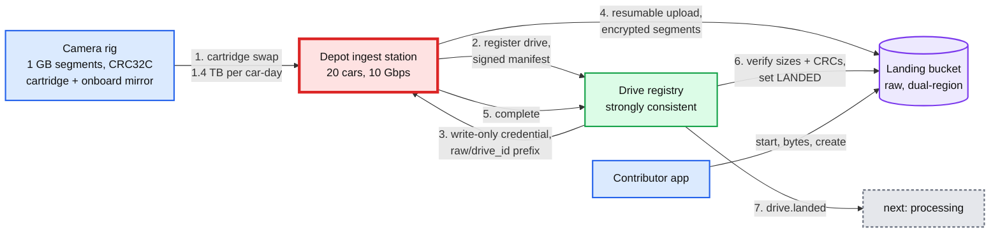

**Still missing:** the bytes are raw and unblurred. Nothing is a panorama yet. The depot uplink is a hard ceiling and a single point of failure for 20 cars (§5.1).

### 4.2 Process: a landed drive becomes blurred, tiled panoramas

The idea: **one durable workflow per drive, each stage idempotent, each output at a deterministic path keyed by `(drive_id, stage, pipeline_version)`.** A crashed stage is re-run, not repaired.

**Flow**

1. A **workflow orchestrator** (durable execution, see [`../../concepts/temporal-durable-execution.md`](../../concepts/temporal-durable-execution.md)) starts one run for the drive and records each stage in `PIPELINE_RUN`.
2. **Pose.** Fuse GPS, IMU and wheel encoders into a smooth 100 Hz trajectory, then snap it to the road graph (the 2010 paper's pipeline). Refine with visual matching against earlier drives of the same roads so dates line up. Output: a pose per capture and a road position (segment id, offset).
3. **Select.** Before any expensive stage, keep one capture per ~10 m slot: the sharpest and least occluded by per-camera metrics on thumbnails, dropping duplicates from stops at red lights. This halves the work: 30 M captures a day become 15 M panoramas.
4. **Stitch.** For each kept capture, warp the 7 images onto an equirectangular panorama using the rig calibration and pose, and blend the seams. Output: unblurred panoramas in the work bucket (same privacy class as raw, deleted once the blurred output commits).
5. **Blur.** A face and plate detector tuned for recall runs on each panorama. The blur registry (approved house and other fixed-object footprints, looked up by S2 cell) adds its regions. Blur is applied destructively. Detections are kept as boxes for audit and for a later model's comparison.
6. **QA.** Score quality on the result (exposure, rain, flare, stitching seams). Sample ~1% for human review. A bad capture falls back to the slot's second-best capture; a failed drive is flagged for re-drive, not published.
7. **Tile.** Cut each blurred panorama into a pyramid of 512 px tiles, zoom 0 to 5, and write `tiles/{pano_id}/v1/...`. The max-zoom level is the blurred master. Write `PANORAMA` rows with status STAGED.

```mermaid
%% Incremental diagram, step 2 of 5: the per-drive workflow. Each stage reads the previous stage's output by path and writes its own.
flowchart LR
    LB[(Landing bucket<br/>raw)] -->|"drive.landed"| WF[Workflow orchestrator<br/>one run per drive]
    WF --> P[Pose<br/>GPS + IMU + wheels,<br/>snap to road graph]
    P -->|"poses, road positions"| SEL[Select<br/>1 capture per 10 m slot]
    SEL -->|"15 M of 30 M captures"| S[Stitch<br/>7 images to 1 pano]
    S -->|"unblurred panos,<br/>work bucket"| B[Blur<br/>detector + blur registry<br/>GPU]
    B -->|"blurred panos"| Q[QA<br/>scores, 1% human]
    Q -->|"passed panos"| T[Tile<br/>512 px, zoom 0 to 5]
    T -->|"tiles v1"| TB[(Tiles bucket)]
    T -->|"PANORAMA rows,<br/>STAGED"| IDX[(Panorama index)]
    RAW[Raw 7 images] -.->|"never served"| LB

    class WF,P,SEL,S,B,Q,T service
    class LB,TB,IDX store
    class RAW external

    classDef service  fill:#dcfce7,stroke:#16a34a,stroke-width:2px,color:#111
    classDef store    fill:#ede9fe,stroke:#7c3aed,stroke-width:2px,color:#111
    classDef external fill:#e5e7eb,stroke:#6b7280,stroke-width:2px,color:#111,stroke-dasharray:4 3
```

**Still missing:** STAGED panoramas are invisible. Nothing decides which panorama is current per spot, and the old panoramas on the same street still say they are current.

### 4.3 Index and publish: one current panorama per road slot, never a broken one

The idea: **a slot is ~10 m of one road segment** (or an S2 level-20 cell, ~9 m, off-road). Each slot points at exactly one current panorama. Publishing is moving that pointer.

**Flow**

1. The publisher takes the drive's STAGED panoramas in road order and splits them into **chunks of ~1 km (~100 panoramas)**.
2. Before a chunk, it checks the invariant **"tiles exist before visible"**: every tile object for each panorama is present (a manifest written last by the tile stage, checked by HEAD on the manifest).
3. **Registry re-check.** The blur stage recorded the registry snapshot time T it used. The chunk transaction reads blur-registry entries for the chunk's S2 cells approved after T. Any hit sends those panoramas back to blur instead of publishing them. Without this, a house approved between a drive's blur stage and its publish goes live unblurred, because the takedown scan ran before the drive's rows existed.
4. One transaction per chunk: for each slot, set the new panorama CURRENT, set the slot's previous current panorama HISTORICAL, set `SLOT.current_pano_id`. A slot has exactly one current panorama before and after. Readers never see zero or two.
5. If the slot's current panorama was captured after the one being published (a re-processed old drive), the publisher inserts the new one as HISTORICAL and does not touch the slot. Current means newest capture, not newest publish.
6. Links are **slot to slot** from the road graph, resolved to panoramas at read time, so publishing never rewrites old rows. Prev and next inside the same drive (for history mode) are fixed at select time and stored in the row, because a drive's order never changes. The same transaction appends the capture date to the slot's `capture_dates`, which is where the response's `dates` list comes from.

Why chunks and not one transaction per drive: a car-day is ~15k panoramas, ~45k rows touched. Atomic publish of a whole drive buys nothing a user can see. Street View already mixes dates across streets. Per-chunk atomicity with the two invariants is enough, and it keeps transactions small.

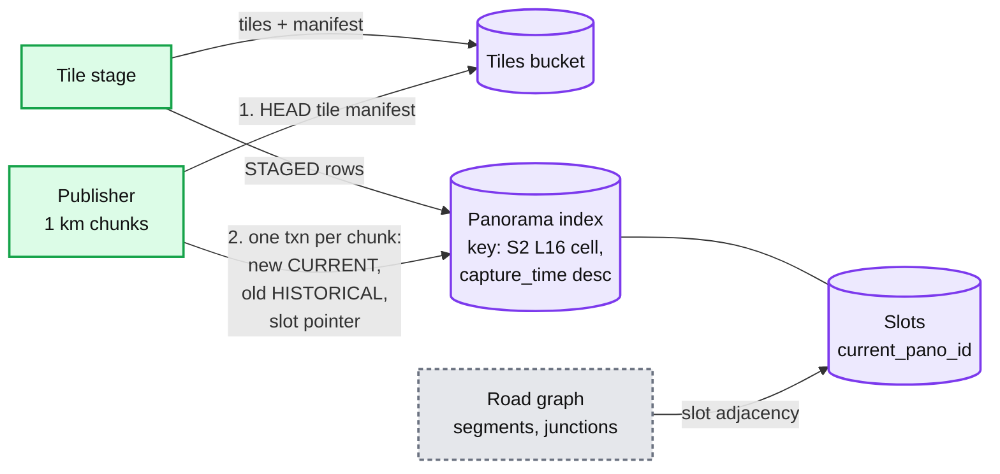

**Still missing:** no read path. No cache in front of the index. No CDN in front of the tiles.

### 4.4 Serve: point to panorama to tiles

**Flow**

1. The user drops the pegman. The client calls `GET /v1/panos:lookup?lat&lng&radius_m=50`.
2. The **metadata API** quantizes the point to an S2 level-20 cell (~9 m) and checks its cache (key: cell + date filter). On a miss it covers the circle with S2 level-16 cells, range-scans the index, keeps CURRENT rows (or the newest at or before `date`), picks the nearest, then reads the neighbour slots to build the arrows. It caches the answer for 5 minutes.
3. The response carries `tile_version`. The client computes tile URLs for its viewport and zoom and fetches them from the **CDN**. Tile URLs include `tile_version`, so they are immutable and cached at the edge for 30 days.
4. On a CDN miss, the CDN reads the tile from the tiles bucket. Current imagery sits in Standard or Nearline, history in Archive. GCS Archive answers in milliseconds, not hours ([storage classes](https://cloud.google.com/storage/docs/storage-classes)), so even a 2009 panorama is served directly.
5. An arrow click calls `GET /v1/panos/{id}`: a point read, cached the same way.

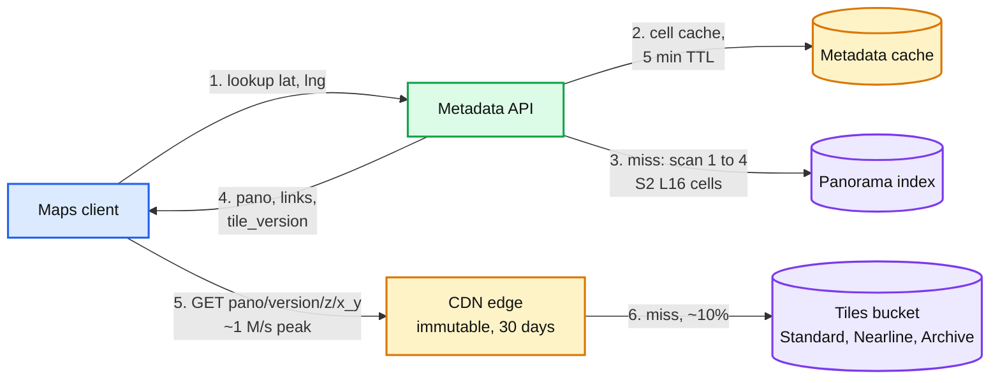

**Still missing:** once a tile sits in every edge cache, how does a blur request ever take effect?

### 4.5 Honour blur requests everywhere, including the future

The idea: **store the request as geometry on the ground, not as a pixel box in one image.** A house is visible from 20 panoramas across 5 dates. A box in one panorama fixes 1 of 20. A footprint fixes all of them, and for a house it fixes next year's drive too.

**Flow**

1. A user reports a region in a panorama. The report service projects the region to a **footprint on the ground** using the panorama's pose and depth (or the building footprint from the map), and stores a `BLUR_REQUEST` with its S2 covering. Status PENDING.
2. Review. Faces and plates the detector missed can be auto-approved (the paper notes users report misses, which are then blurred in the live product). Houses need a human, because a blur is permanent and a competitor could abuse it.
3. On approval, a **blur job** finds every panorama of every date that can see the footprint: scan the index for the footprint's cells plus ~100 m, then test visibility with each panorama's pose.
4. For each affected panorama: read the master tiles, blur the region, regenerate the affected tiles at every zoom level under `v{n+1}`, write the tile manifest.
5. One transaction bumps `tile_version` and `blur_version` for that panorama. Metadata caches expire within 5 minutes. From then on, clients build `v{n+1}` URLs.
6. Hard-delete the `v{n}` objects at origin, **then** invalidate `/{pano_id}/v{n}/*` at the CDN (one path-pattern request per panorama, ~10 s to take effect, [Cloud CDN](https://cloud.google.com/cdn/docs/cache-invalidation-overview)), then fetch an old URL and expect 404 before marking the request APPLIED. Delete first: if the edge is purged while origin still has `v{n}`, a client with 5-minute-old metadata refills the edge with the unblurred tile. The tiles bucket has soft delete **off**, or deleted tiles would linger 7 days by default ([soft delete](https://cloud.google.com/storage/docs/soft-delete)).
7. The request stays in the **blur registry**. For houses and other fixed objects, the blur stage of every future drive looks up registry entries by S2 cell and applies them before a panorama is ever published. Faces and plates move, so their entries are scoped to the panoramas of that capture.

Why the edge cache is 30 days and not a year: invalidation is limited to 500 requests a minute, 720k a day. Approved takedowns (thousands a day) fit. A blur-model backfill that re-tiles ~500 M panoramas (§5.3) would need 500 M / 500 per minute = ~694 days of invalidations. So bulk re-tiles delete at origin, invalidate only the hot set within the budget, and let the long tail age out of the edge within 30 days. A hot tile refetched once a month per PoP costs nothing measurable.

```mermaid
%% Incremental diagram, step 5 of 5: the whole design before deep dives. The blur registry is read by the takedown job and by every future drive.
flowchart LR
    RIG[Rig + cartridge] -->|"cartridge swap"| ST[Depot station]:::critical
    ST -->|"segments"| LB[(Landing bucket)]
    ST -->|"manifest, LANDED"| REG[Drive registry]
    LB --> WF[Per-drive workflow<br/>pose, select, stitch,<br/>blur, QA, tile]
    BR[(Blur registry<br/>footprints by S2 cell)] -->|"known footprints"| WF
    WF -->|"tiles vN"| TB[(Tiles bucket)]
    WF --> PUB[Publisher]
    PUB -->|"flip slots"| IDX[(Panorama index)]
    IDX --> API[Metadata API]
    TB --> CDN[CDN]
    API --> U[Maps client]
    CDN --> U
    U -->|"report"| TK[Blur job]
    TK -->|"approved footprint"| BR
    TK -->|"tiles vN+1, bump,<br/>delete, invalidate"| TB

    class RIG,U client
    class REG,WF,PUB,API,TK service
    class LB,TB,IDX,BR store
    class CDN cache

    classDef client   fill:#dbeafe,stroke:#2563eb,stroke-width:2px,color:#111
    classDef service  fill:#dcfce7,stroke:#16a34a,stroke-width:2px,color:#111
    classDef store    fill:#ede9fe,stroke:#7c3aed,stroke-width:2px,color:#111
    classDef cache    fill:#fef3c7,stroke:#d97706,stroke-width:2px,color:#111
    classDef critical fill:#fee2e2,stroke:#dc2626,stroke-width:4px,color:#111
```

---

## 5. Deep dives

One per non-functional requirement, phrased as the interviewer's question. Each says what breaks in the §4 design, the fix, and what changed.

### 5.1 "How do you move 1.4 PB a day off 1,000 cars without ever losing a drive?"

This is the red node. The ladder:

| Rung | Approach | What breaks |
|---|---|---|
| Bad | Upload from the car over LTE or 5G as you drive | 150 h per car-day at 20 Mbps (§2). Cellular data at PB scale is also the most expensive byte on the planet |
| Good | Car parks at the depot, plugs into 10 GbE, uploads overnight | 1.35 TB at 1.25 GB/s is 18 min per car at line rate, but 20 cars share the 10 Gbps uplink: ~6 h. The car is tied to the wall. The only copy is in the car. A depot outage idles 20 cars the next morning |
| Great | Swappable cartridge + onboard mirror, an ingest station that uploads from bays, a registry commit point, and shipping as the fallback | Needs a cartridge pool and a manual swap, and adds a few hours of latency. Nobody cares about hours here |

**Why Great holds.**
- **Two copies until LANDED.** Cartridge plus the onboard mirror. The mirror evicts only drives the registry has marked LANDED, oldest first. If it would have to evict an un-LANDED drive, the rig alerts and stops capturing. So a cartridge dropped in a puddle loses nothing while the mirror holds up to ~5 un-LANDED car-days, and a lost one leaks nothing: it is ciphertext.
- **Wipe only after LANDED.** LANDED means the registry compared every object's size and CRC32C with the rig-signed manifest in one transaction. The station reads the status from the registry, not from its own upload log. A station that "thinks" it uploaded is not evidence.
- **Deterministic names make retries free.** `raw/{drive_id}/{seq}.seg`. Upload with a create-only precondition (`ifGenerationMatch=0`). The station's credential is write-only, so it cannot read what is already there. It asks the registry instead: `complete` lists the prefix and returns exactly the missing or mismatched segments. A create-only PUT that fails with 412 means the object exists, and the registry's check decides whether it is right. A station crash mid-drive resumes from the registry's missing list.
- **The cartridge pool is the buffer.** 80 per depot: 20 in the cars and 60 empties, three nights of swaps (~$25k per depot). A 4 TB cartridge also holds ~2.9 car-days, so a car with no empty to swap into keeps driving on its own. On day 3 of an uplink outage the 60 full cartridges go to a courier, and the regional ingest center sends empties back from its own stock.
- **Ship when the pipe is thin.** Overnight courier of 10 cartridges is ~1.25 Gbps effective (§2). Remote capture (a trekker in the Amazon, a boat on a canal) always ships, and lands in 1 to 2 weeks. That is longer than the mirror holds (~5.9 car-days), so the field team copies each cartridge onto a second one, and the rig may evict a drive from its mirror only after checking the copy's CRCs against its manifest. Two copies still hold.
- **Taxi variant** (the Hello Interview prompt). Cameras on taxis, no depot, the same streets 50 times a day. The fix is **dedup before upload**: each device downloads a daily "wanted slots" list (slots whose current panorama is older than the refresh target), keeps only captures in wanted slots, and uploads over garage Wi-Fi at night. Server-side, a second capture of a slot already refreshed this week is dropped at the select stage. The cheapest byte is the one never uploaded.

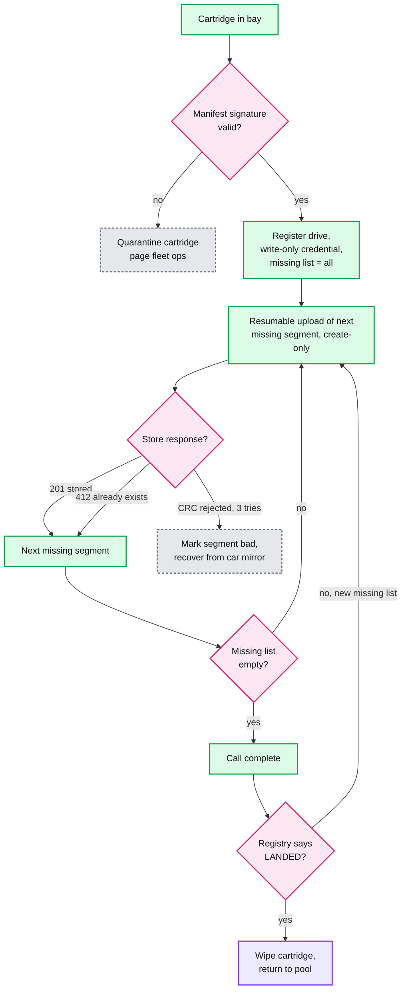

Push back on the textbook: "use multipart upload with parallel parts" is the reflex answer, and it is fine, but it answers the easy half. The hard half is **when is it safe to delete the source**, and that is a registry transaction against a signed manifest, not an upload API feature.

**What changed:** the rig gained a mirror and a signed manifest. The station became a separate box with bays. The rig gained encryption with a fleet-wrapped DEK. The registry gained the LANDED transaction and the per-drive key. Fleet ops gained a cartridge pool and a courier path. Details: [`deep-dives/vehicle-offload-and-landing.md`](deep-dives/vehicle-offload-and-landing.md).

### 5.2 "How do you keep 15 years of imagery without storage eating the budget?"

**What breaks in §4.** Everything in Standard. Peak season: ~40 PB of raw hot plus ~108 PB of current imagery at $0.020 = ~$3 M a month, and history adds ~100 PB a year on top. Keeping unblurred raw forever is also illegal in the EU's reading.

**Decide what each byte is for, then its class and its death date.**

| Data | Size at 1,000 cars | Read by | Class | Deleted |
|---|---|---|---|---|
| Unblurred raw, days 0 to 30 | ~28 PB average, ~40 PB peak season | Pipeline, once or twice | Standard, dual-region until published | Moves at day 30 |
| Unblurred raw, days 30 to 180 | ~140 PB average, ~200 PB peak season | Rare re-stitch (< 5% of drives) | Archive | Crypto-shred at 180 days |
| Unblurred stitched panoramas (work bucket) | ~40 MB each, ~600 TB a day passing through, under ~1 PB in flight | Blur stage, once | Standard, same per-drive key | Deleted when the shard's blurred output commits |
| Sensor logs without images (GPS, IMU, lidar, poses) | ~2% of raw | 3D, re-registration | Coldline | Kept |
| Current imagery, hot 20% of bytes | ~22 PB | CDN fills, constantly | Standard, replicated by usage | When superseded |
| Current imagery, long tail 80% | ~86 PB | CDN fills, rarely | Nearline | When superseded |
| Historical imagery | +~100 PB a year | Time travel, rarely | Archive | Kept, top zoom dropped after 10 years |
| Index and registry | ~4 TB a year | Everything | Spanner-like DB | Kept |

**Three numbers to say out loud.**
- **Archive beats Coldline even for 150 days.** Archive bills a 365-day minimum, so a GB costs $0.0012 x 12 = $0.0144 for its whole life. Coldline for 5 months costs $0.020. Retrieval is $0.05 vs $0.02 per GB. Break-even is when more than ~19% of raw gets read back ((0.020 - 0.0144) / (0.05 - 0.02)). We re-read under 5%, so Archive. Keeping raw to day 365 would cost nothing more, since the minimum is billed anyway, so the 180-day cap is a privacy choice, not a cost one.
- **Tier current imagery by access, not age.** The 2010 paper already says Street View "selectively replicate[s] panoramas according to usage patterns". 80% of road-km are rural and rarely viewed; Nearline halves their cost and a CDN miss on them pays $0.01 per GB.
- **Crypto-shred instead of chasing copies.** Each drive's raw is encrypted with its own DEK. At 180 days, destroy the key. Every copy (dual-region replica, backups, a stray export) becomes noise at once. Then delete the objects at leisure.

Push back on the textbook: "keep raw forever so we can reprocess with better algorithms". The pixels that matter (blur) can be reprocessed from blurred masters: a better detector can only add blur. What raw enables is re-stitching and re-posing, which is worth ~6 months, and which regulators asked us to cap at 6 months anyway. Say what you give up: after 180 days, a stitching bug is fixed by re-driving, not re-processing.

**What changed:** the landing bucket gained lifecycle rules (Standard to Archive at 30 days), per-drive keys in the registry, a shredder job, and an access-based tiering job for tiles. Details: [`deep-dives/storage-tiers-and-lifecycle.md`](deep-dives/storage-tiers-and-lifecycle.md), erasure coding in [`../../concepts/erasure-coding.md`](../../concepts/erasure-coding.md).

### 5.3 "How does the pipeline stay correct when stages crash, drives are bad, and you reprocess 19 billion panoramas?"

**What breaks in §4.**
- A worker dies halfway through stitching 15k panoramas. Re-running the whole drive redoes ~105k CPU-s and ~15k GPU-s (15k x 7 CPU-s and 1 GPU-s), about 10 minutes of 200 cores, every time any shard fails. Re-running half without knowing which half publishes duplicates.
- One corrupt drive (a camera that failed at 11 am) crashes the stitch stage forever and blocks the queue behind it.
- A new blur model launches. A naive backfill of 19 B panoramas saturates the GPUs for 7 months and fresh drives stop publishing.
- Two workers run the same stage after a lease timeout and both write.

**Fixes.**
1. **Idempotent by construction.** Output path = `work/{drive_id}/{stage}/{pipeline_version}/{shard}`. `pano_id` = keyed hash of `(drive_id, capture_seq)`, stable across reprocessing. A stage writes all its shards, then a manifest last, then marks `PIPELINE_RUN` done. A re-run overwrites identical bytes. A reader trusts only a manifest.
2. **Shard inside a drive.** Stitch, blur and tile are per panorama, so a drive splits into ~150 shards of ~100 panoramas. A retry re-does one shard, not the drive.
3. **Fence zombies.** The orchestrator hands out a lease with an epoch. The publish transaction checks the epoch on `PIPELINE_RUN`, so a worker that paused past its lease cannot publish. See [`../../concepts/leases-fencing-clocks.md`](../../concepts/leases-fencing-clocks.md).
4. **Poison drives go to a dead-letter state** after 3 attempts per shard, with the error and the failing capture ids. Fleet ops sees "camera 4 dark after 11:02" and schedules a re-drive of those roads. The queue keeps moving.
5. **Two lanes with separate quotas.** Fresh lane: 70% of GPUs, SLO 7 days. Backfill lane: the rest plus preemptible capacity, no SLO, ordered by value (current imagery in busy cells first, history last). A blur model backfill runs on blurred masters and re-tiles only panoramas where the new model found something new, typically a few percent. That turns 19 B re-tiles into ~500 M. Those re-tiles are not invalidated one by one at the CDN (§4.5): they delete at origin and rely on the 30-day edge lifetime, with the hot set invalidated first.

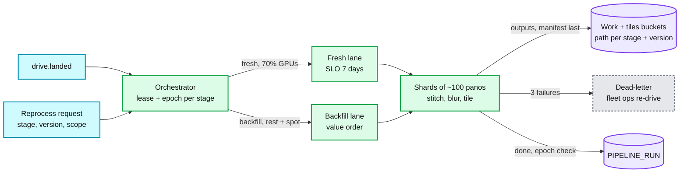

Push back on the textbook: "use Kafka between stages". Stages here are minutes to hours long, per drive, with big outputs in object storage. A queue of messages adds a second source of truth. A durable workflow per drive, plus files with manifests, is simpler and replayable. FlumeJava-style batch within a stage is fine.

**What changed:** `PIPELINE_RUN` gained `lease_epoch`, drives gained a dead-letter status, the orchestrator gained lanes. Details: [`deep-dives/processing-pipeline-and-reprocessing.md`](deep-dives/processing-pipeline-and-reprocessing.md).

### 5.4 "How do you find the right panorama for a point and a date in under 100 ms, and publish without broken arrows?"

**What breaks in §4.**
- A geohash-prefix scan in a dense city returns thousands of rows: 20 drives over 15 years on both sides of Times Square.
- A viral place (a new landmark, a news event) makes one cell's metadata 10,000x hotter than average.
- A publish chunk commits before its tiles finish uploading: users see grey squares.
- Two drives of the same street are published out of order: an older drive becomes "current".

**Fixes.**
1. **Order inside the cell by `capture_time DESC`.** "Current" is `status = CURRENT`, and "at date T" is the first row with `capture_time <= T`. Both stop after a few rows per cell in the common case. A slot with no imagery at the requested date makes the scan run to the end of the cell (up to a few thousand rows in a dense 3-cell lookup), so `SLOT` rows are also keyed by `(s2_cell_l16, slot_id)` and carry their capture dates: a date lookup reads slots first, then only the rows it needs. A 50 m circle covers 1 to 4 level-16 cells; a lookup is 1 to 4 short range scans, ~5 ms.
2. **Read-hot cells go to caches, not shards.** Two layers: the metadata cache keyed by (S2 level-20 cell, date bucket) with a 5 min TTL, and the CDN in front of the metadata API for `GET /panos/{id}` (1 min TTL). A viral cell becomes a cache hit. Writes are ~170/s globally, so there is no write-hot problem. See [`../../concepts/caching-patterns.md`](../../concepts/caching-patterns.md).
3. **Tiles before visibility.** The tile stage writes a per-panorama tile manifest last. The publisher HEADs it before the chunk transaction. Deletion is the reverse: flip first, delete at origin, then invalidate the CDN.
4. **Current = newest capture.** The chunk transaction compares `capture_time` with the slot's current panorama and only moves the pointer forward.
5. **Arrows resolve at read time** from slot adjacency, so a newly published chunk next to an old street shows correct arrows in both directions without rewriting old rows.

**Consistency model, stated.** Publish is strongly consistent per chunk. Readers are eventual with a 5-minute bound from the cache. A user may see a new chunk on one street and old imagery on the next street for a few minutes. That is invisible and acceptable.

**What changed:** the index gained `capture_time DESC` in the key, a tile manifest per panorama, and two cache layers. Details: [`deep-dives/spatial-index-and-publish.md`](deep-dives/spatial-index-and-publish.md) (runnable Python for cell covering and nearest-panorama lookup), [`deep-dives/tile-serving-and-cdn.md`](deep-dives/tile-serving-and-cdn.md), [`../../concepts/geospatial-index.md`](../../concepts/geospatial-index.md).

### 5.5 "How do you guarantee a face or a blurred house never comes back?"

**What breaks in §4.**
- The detector misses ~11% of hard faces and 4 to 6% of plates ([Frome et al.](https://static.googleusercontent.com/media/research.google.com/en//archive/papers/cbprivacy_iccv09.pdf): 89.0% hand-counted face recall, 94 to 96% plates; an off-the-shelf state-of-the-art detector got under 78%).
- A blur fixed in the current panorama is still visible in the 2014 and 2018 panoramas.
- Next year's drive publishes the house unblurred again.
- The old tiles are cached at the CDN edge and sit in soft-delete for 7 days.
- Reprocessing a drive from raw (within 180 days) re-stitches the unblurred image and publishes it.

**Fixes.**
1. **Recall first, precision second.** Tune the detector to over-blur (the paper's high-recall primary detector plus a post-filter). A blurred shop sign is a bug. A visible face is an incident.
2. **Footprints, not boxes** (§4.5), so one approved request covers all dates, and for a house, every future drive.
3. **The blur registry is an input to the blur stage**, including reprocessing from raw. Blur is a pure function of (panorama, detector version, registry at time T). It only ever adds. The publish transaction re-checks the registry for entries approved after T (§4.3 step 3), which closes the gap between blur and publish.
4. **Takedown checklist per panorama:** new tile version, one transaction, hard delete at origin, then CDN path invalidation, no soft delete on the tiles bucket, verify by fetching the old URL and expecting 404.
5. **Raw is the one copy we cannot blur**, so it has a retention cap and crypto-shredding (§5.2). Germany's 2010 pre-launch opt-out (244,237 of 8,458,084 households, 2.89%, [Google Europe Blog](https://europe.googleblog.com/2010/10/how-many-german-households-have-opted.html)) is the scale test: a quarter of a million footprints must be in the registry before the first panorama of a city goes live. Google itself warned that some requested houses would still be visible at launch. The registry-before-publish gate is how you avoid that.

**What changed:** the blur stage reads the registry, the tiles bucket lost soft delete, the takedown job gained a verification step and an SLO (approved to unservable in 24 h, 99.9%). Details: [`deep-dives/privacy-blur-and-takedowns.md`](deep-dives/privacy-blur-and-takedowns.md).

### 5.6 "What happens when a component dies, and what changes at 10x?"

| Component dies | Users see | Data at risk | Recovery |
|---|---|---|---|
| Depot uplink, 3 days | Nothing | None: cartridge plus mirror for every un-LANDED drive | Pool of 80 covers 3 nights. Day 3: courier the full cartridges to a regional ingest center, which sends empties from its stock |
| Cartridge lost in transit | Nothing | None while the car's mirror holds it (every un-LANDED drive, up to ~5 car-days). No leak: it is ciphertext | Re-offload from the mirror. Only if the mirror also failed: re-drive the roads (~$1k) |
| Ingest station crashes mid-upload | Nothing | None | Restart, skip segments already verified, continue |
| Drive registry region | Ingest pauses | None | Multi-region Paxos DB, ~seconds of write unavailability |
| Pipeline worker or shard | Nothing | None | Lease expires, shard re-runs, epoch fences the zombie |
| Bad blur model release | Missed faces in new panoramas | Privacy incident | Canary on 1% of drives with human audit before 100%. Roll back model, re-blur the affected drives from the registry and model v-1 |
| Metadata cache | Latency up, index takes the load | None | Index sized for 3x cache-miss load |
| One serving region | Some users see higher latency | None | Index replicated across regions, tiles in multi-region storage behind a global CDN |
| CDN PoP | Other PoPs serve | None | Standard CDN failover |

**10x cars (10,000).** 14 PB a day of raw, 1.25 Tbps. Depots and stations scale out linearly: they are per-depot boxes with no shared state except the registry, which sees ~10k drives a day (~14 M segment rows), trivial. Storage cost goes 10x and becomes the only question: shorten raw retention from 180 to 30 days (removes the Archive raw line, ~$400k a month today and ~$4 M at 10x, at the price of the re-stitch window), drop capture to one per 10 m where the road is straight, and decide which roads deserve yearly refresh.

**Taxis instead of cars.** See §5.1: dedup before upload against a wanted-slots list.

---

## 6. Final design and the core flows

```mermaid
%% D3: final design. Red: the depot station, where two copies of a car-day meet a fixed uplink and a manual swap. Everything after LANDED is replayable.
flowchart LR
    RIG[Rig<br/>cartridge + mirror<br/>until LANDED] -->|"swap, 1.4 TB"| ST[Depot ingest station<br/>bays, 10 Gbps, pool of 80]:::critical
    ST -->|"encrypted segments,<br/>create-only"| LB[(Landing bucket<br/>Standard 30 d, Archive,<br/>shred at 180 d)]
    ST -->|"manifest, complete"| REG[Drive registry<br/>LANDED commit, per-drive key]
    REG -->|"drive.landed"| WF[Workflow per drive<br/>fresh + backfill lanes]
    LB --> WF
    BR[(Blur registry<br/>footprints by S2)] --> WF
    WF -->|"tiles vN, manifest last"| TB[(Tiles<br/>Standard, Nearline, Archive)]
    WF -->|"STAGED"| PUB[Publisher<br/>1 km chunks, tiles first]
    PUB -->|"flip slots"| IDX[(Panorama index<br/>S2 L16 + time desc)]
    IDX --> API[Metadata API<br/>+ 5 min cache]
    TB --> CDN[CDN<br/>immutable URLs]
    API --> U[Maps client]
    CDN --> U
    U -->|"report"| TK[Takedown job<br/>vN+1, delete, invalidate]
    TK --> BR

    class RIG,U client
    class REG,WF,PUB,API,TK service
    class LB,TB,IDX,BR store
    class CDN cache

    classDef client   fill:#dbeafe,stroke:#2563eb,stroke-width:2px,color:#111
    classDef service  fill:#dcfce7,stroke:#16a34a,stroke-width:2px,color:#111
    classDef store    fill:#ede9fe,stroke:#7c3aed,stroke-width:2px,color:#111
    classDef cache    fill:#fef3c7,stroke:#d97706,stroke-width:2px,color:#111
    classDef critical fill:#fee2e2,stroke:#dc2626,stroke-width:4px,color:#111
```

Flows to say from memory:

### Flow 1: a car-day lands (FR1)

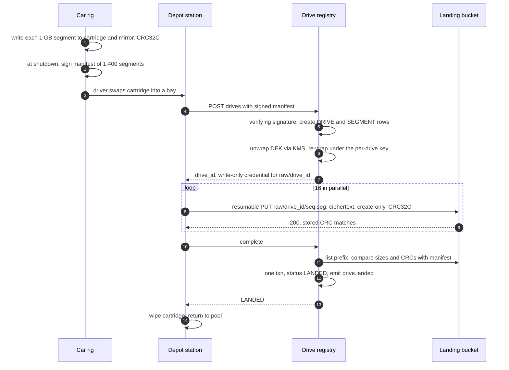

### Flow 2: landed to published (FR2, FR3)

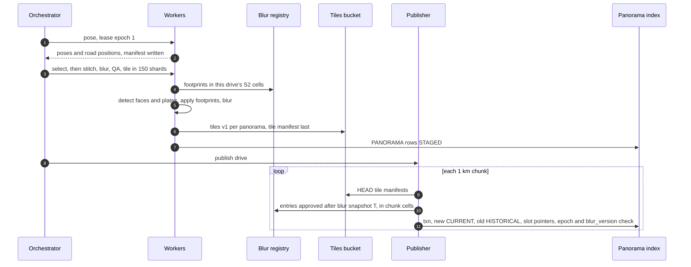

### Flow 3: a user opens a panorama (FR4)

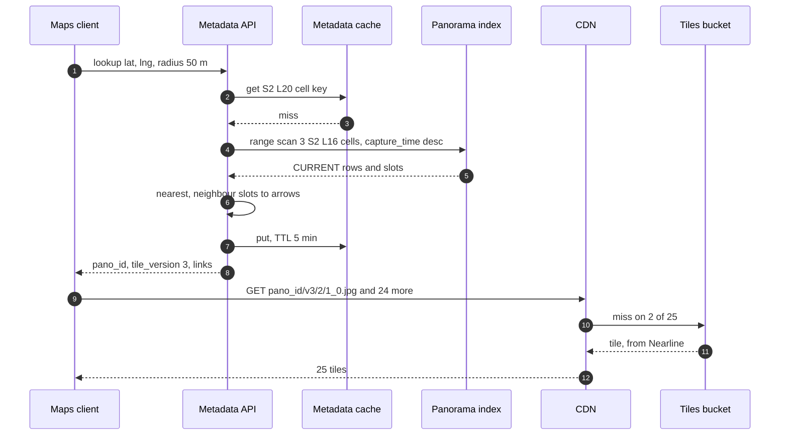

### Flow 4: an approved blur request (FR5)

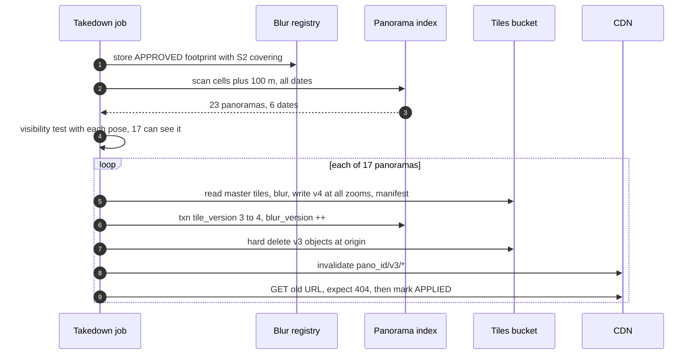

### Flow 5: the depot uplink dies (failure)

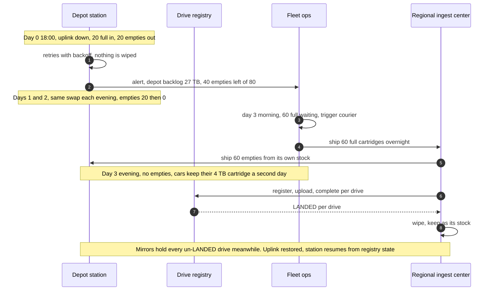

---

## 7. Trade-offs

| Decision | Option A | Option B | Chose | Why |
|---|---|---|---|---|
| Moving bytes off cars | Cartridge swap + depot upload, courier fallback | Upload from car over cellular | A | 150 h per car-day on LTE. Physics |
| When to delete the source | After a registry LANDED txn against a signed manifest | After the station's upload loop finishes | A | The station's belief is not evidence. The registry compared every CRC |
| Raw retention | 180 days, crypto-shred | Forever for reprocessing | A | Privacy cap, and a better detector only adds blur, which works on masters |
| Raw cold class, days 30 to 180 | Archive with 365-day minimum charge | Coldline | A | $0.0144 vs $0.020 per GB lifetime. Wins while re-reads stay under ~19% |
| Pipeline execution | Durable workflow per drive, files with manifests | Kafka between stages | A | Stages are long, outputs are files. A queue adds a second truth |
| Publish atomicity | Per 1 km chunk with two invariants | Whole drive in one transaction | A | 45k rows per drive. Users cannot see the difference |
| Current panorama | Slot pointer, newest capture wins | Newest per cell at read time | A | Exactly one current per slot, read cost O(1), no double or hole |
| Links | Slot to slot, resolved at read time | Materialized per panorama | A | Publishing a street never rewrites its neighbours |
| Spatial key | S2 level-16 cell + capture_time desc | Geohash, or lat and lng columns | A | Hilbert order keeps neighbours together, uniform cell areas, Google-native. Geohash works too; the seam is one function |
| Blur request | Footprint on the ground in a registry | Pixel box on one panorama | A | Covers every date, and future drives for fixed objects |
| Tile URLs | Immutable, versioned, 30-day edge cache | Mutable URL with short TTL, or a 1-year cache | A | Hit rate. Takedown bumps the version, deletes, then invalidates one path pattern. 30 days bounds what the 720k-a-day invalidation budget cannot reach |
| Current imagery class | By access (Standard hot, Nearline tail) | All Standard | A | ~$1.3 M vs ~$2.2 M a month. The paper did the same with replication |
| Refused to build | Real-time streaming from cars, per-frame dedup by perceptual hash across the whole archive, a custom object store | | | Nothing needs minutes of freshness. Slot-level dedup is enough. The object store is a solved platform |

---

## 8. Staff-level notes

- **Failure modes and blast radius.** A depot is the unit of failure for ingest: 20 cars, absorbed by the pool for 3 days, then the courier. Losing a region of the landing bucket before publish is prevented by dual-region for 30 days; after publish, raw is only a reprocessing aid. A bad detector release has the largest blast radius: every panorama it touches, so canary it on 1% of drives with a human audit. A bad publisher release could flip slots to missing tiles, so the tiles-first check is in the transaction path, not in a runbook.
- **Migration.** From an older rig and pipeline: (1) new rigs write the new segment format; the station accepts both and converts old drives into segments server-side. (2) Run the new pipeline in shadow on 5% of drives, publish nothing, compare panoramas with the old pipeline (pose error, blur recall on an audit set). (3) Switch publishing per country. (4) Re-tile the historical archive in the backfill lane only if the tile format changed. Rollback at every step is "publish from the old pipeline again". Slots make it safe: both pipelines write panoramas, the slot pointer decides which is visible.
- **Operability.** SLOs: capture to LANDED p99 48 h (depots); LANDED to published p95 7 days; approved takedown to unservable 24 h at 99.9%; tile p99 150 ms at the edge; metadata p99 100 ms. Page at 3 am: a takedown past 24 h (legal exposure); any depot with fewer than 20 empty cartridges and no courier booked; registry write errors > 1% for 10 min; tile 404 rate > 0.1% (a publish invariant broke). Ticket, not page: pipeline backlog above 10 days, backfill lane starved, raw shred job behind by more than a day (becomes a page at 7 days, since that is a compliance breach).
- **Cost.** At 1,000 cars and list prices: raw ~$1.0 M a month on average and ~$1.4 M in a peak season (Standard 30 days + Archive to day 180), current imagery ~$1.3 M, history +~$120k a month per year kept, retrieval fees on CDN misses from Nearline and Archive ~$115k ([tile serving](deep-dives/tile-serving-and-cdn.md)), compute ~$150k, depots (stations, cartridges, 10 Gbps links) ~$100k. Storage is ~15 to 20x compute, so the Staff lever is retention and tiering, not faster stitching. Eng: ingest and registry, 1 team; pipeline and vision, 2 to 3 teams; serving, the Maps serving team.
- **Team boundaries.** Fleet ops owns rigs, drivers, cartridges and couriers, and the manifest format is their contract with ingest. Ingest owns stations, the registry and the landing bucket. Imagery processing owns pose, stitch, select and tile. The privacy team owns the detector, the blur registry, retention policy per country and the takedown SLO; the pipeline cannot publish without their stage. Maps serving owns the metadata API, the CDN and the viewer. The panorama index schema is the contract between processing and serving, so it is versioned.

---

## 9. What is expected at each level

**Mid (80/20).** Cars upload images to object storage, a batch job stitches and blurs, metadata in a database with lat and lng, geohash or quadtree for lookup, CDN for images. Probably assumes uploads over the network from the car and never does the bandwidth math. Deletes nothing.

**Senior (60/40).** Does the math and moves to depot upload or shipped disks. Resumable, chunked uploads with checksums. Tile pyramid with zoom levels. Hot and cold tiers. Idempotent batch stages. Blur as a pipeline stage. May not define when a cartridge can be wiped, how "current" is chosen between two drives, or how a blur request reaches old imagery.

**Staff+ (40/60).** Starts from the 1,000-car number and shows cellular cannot work. Defines the commit point (registry LANDED against a signed manifest) and the only-then-wipe rule, with two copies until then. Treats storage as the cost driver and sets retention by purpose: raw 180 days with crypto-shredding because of the privacy cap, masters forever, history in Archive, current tiered by access, with the Archive-vs-Coldline break-even. Slots with exactly one current panorama, chunked publish with tiles-first. Blur as a footprint registry that covers history and the future. Reprocessing lanes so a model backfill cannot starve fresh drives. Names what was refused: streaming from cars, whole-drive atomic publish, keeping raw forever, a custom object store. Numbers: 1.4 TB per car-day, 150 h on LTE, 125 Gbps aggregate, 15 M panoramas a day, 27 MB each, ~$2.5 to 3 M a month storage vs ~$150k compute.

---

## 10. Nitty-gritty (past interview scope)

### 10.1 Internals of each chosen technology

- **Object store (GCS or Colossus underneath).** Resumable upload: a session URI, chunks in multiples of 256 KiB, the client asks for the committed offset after a failure and resumes from there. The client sends CRC32C and the server rejects a mismatch. Durable at ack. Underneath, files are erasure-coded across failure domains; Google's own availability study modelled RS(9,4), RS(5,3) and 3x replication in production cells ([Ford et al., OSDI 2010](https://www.usenix.org/legacy/events/osdi10/tech/full_papers/Ford.pdf)). Details in [`../immutable-object-store/`](../immutable-object-store/) and [`../../concepts/erasure-coding.md`](../../concepts/erasure-coding.md).
- **Spanner-like registry and index.** Keys are range-partitioned into splits, each split a Paxos group across zones or regions. A single-split transaction commits with one Paxos round. Multi-split transactions use two-phase commit over Paxos groups. Stale reads at a timestamp are served by any replica, which is what the metadata API uses on a cache miss. See [`../multi-region-metadata-store/`](../multi-region-metadata-store/).
- **S2.** The sphere is projected onto 6 cube faces, each face is subdivided as a quadtree, and cells are numbered along a Hilbert curve into a 64-bit id. A parent cell's id range contains all its children's ids, so "all panoramas in this level-13 cell" is one range scan at any finer level. Level 16 averages 19,793 m², level 20 averages 77 m² ([S2 stats](https://s2geometry.io/resources/s2cell_statistics.html)).
- **CDN.** Cache key is the URL path. Invalidation by path pattern takes ~10 s and is limited to 500 requests a minute, with no limit on objects per request ([Cloud CDN](https://cloud.google.com/cdn/docs/cache-invalidation-overview)). One request per panorama, so a 10k-panorama takedown wave takes 20 minutes of invalidation budget.

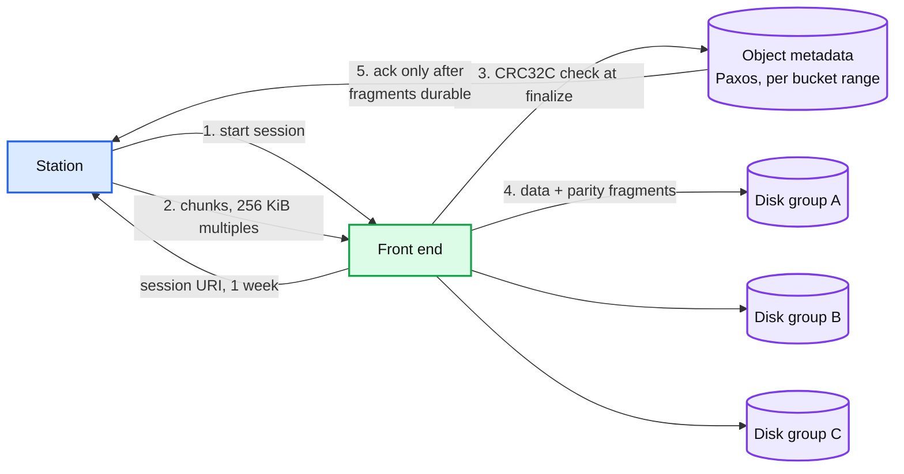

### 10.2 Configuration knobs that matter

| Component | Knob | Value | Why |
|---|---|---|---|
| Rig | Segment size | 1 GB | ~1,400 per car-day: small enough to retry cheaply, big enough that per-object overhead is noise |
| Rig | Onboard mirror | 8 TB SSD (~5.9 car-days), evicts only LANDED drives | Second copy of every un-LANDED drive. The rig stops capturing rather than evict one |
| Station | Parallel uploads | 16 | Saturates 10 Gbps with per-stream TCP limits |
| Station | Resumable chunk | 64 MiB (multiple of 256 KiB) | Fewer round trips; a failed chunk costs < 1 s at 1 Gbps |
| Registry | Scoped credential TTL | 7 days, prefix `raw/{drive_id}/*`, write-only | A leaked credential can only add objects to one drive |
| Landing bucket | Lifecycle | Standard to Archive at 30 days, delete at 180 days after key shred | §5.2 |
| Tiles bucket | Soft delete | Off | Takedown must not leave a 7-day copy |
| Tiles | `Cache-Control` | `public, max-age=2592000, immutable` | Versioned URLs never change. 30 days, not a year, so bulk re-tiles age out without invalidating each one |
| Metadata cache | TTL | 5 min, 1 min for `GET /panos/{id}` at the CDN | Bounds staleness after a publish or takedown |
| Pipeline | Shard size | ~100 panoramas | Retry cost ~1 minute of work |
| Pipeline | Retries before dead-letter | 3 per shard | Poison data should not loop |
| Pipeline | GPU split | Fresh 70%, backfill 30% + preemptible | Backfill cannot starve fresh drives |
| Detector | Operating point | Recall-first, target >= 95% faces on the audit set | Over-blurring is a bug, missing is an incident |

### 10.3 Capacity math per component

| Component | Load | Limit | Headroom |
|---|---|---|---|
| Depot uplink (20 cars) | 27 TB a night, 2.5 Gbps averaged | 10 Gbps | 4x averaged, ~6 h to drain the evening burst. **Closest to its limit** |
| Station bays | 20 cartridges a night, ~11 min each at 2 GB/s read | 8 bays | Fine |
| Landing bucket writes | 15.6 GB/s globally, ~1.4 M objects a day | Object store | Fine |
| Registry | 1,000 drives a day, 1.4 M segment rows | Any Spanner-like DB | Trivial |
| GPU pool | 175 GPUs busy for fresh | 250 owned: 175 fresh lane, 75 backfill lane, plus preemptible | Fine for fresh. A 220k GPU-day backfill needs ~1,000 mostly preemptible GPUs for ~7 months |
| Panorama index | 3.75 B rows a year, ~6k reads/s after cache | Spanner-like, 10s of TB | Fine |
| Tiles origin | ~100k tiles/s, 4 GB/s after CDN | Multi-region object store | Fine |
| CDN edge | ~1 M tiles/s, ~320 Gbps | Global CDN | Fine |

The closest thing to a limit is the depot uplink. The largest number that keeps growing is storage.

### 10.4 Failure timeline

**Cartridge wiped too early (the bug the design prevents).** Suppose a station version wipes on "upload loop finished" instead of on LANDED, and segment 812 failed its last chunk silently. T+0 the station wipes. The drive never reaches LANDED: `complete` returns "missing: 812", the drive stays UPLOADING, and no processing starts. T+1 h the "UPLOADING with a missing list for over 1 h after the cartridge left its bay" alert fires. The car's mirror still has segment 812, because it never evicts an un-LANDED drive: fleet ops pulls it at the next depot visit and the station uploads that one segment. Without the mirror, 1 GB of a car-day (~110 m of road) is lost and re-driven. The design makes this impossible by reading LANDED from the registry, and the mirror makes the mistake survivable.

**Bad detector release.** T+0 blur model v9 deploys to 100% with a regression on side-profile faces. T+6 h first drives publish. T+20 h user reports of unblurred faces rise 5x in one country. T+21 h page, freeze publishing from v9 drives (a flag on the publisher), roll back to v8. T+22 h the backfill lane re-blurs every panorama published by v9 (~15 h of publishing, ~9.4 M panoramas, ~110 GPU-days, ~3 h on 1,000 GPUs) with v8 plus the registry, top priority. T+30 h every v9 panorama has a new tile version and the v9 objects are deleted at origin. Clients stop requesting v9 URLs within 5 minutes of each bump. The CDN hot set is invalidated first within the 720k-a-day budget, and the long tail ages out of the edge within 30 days. Prevention: canary on 1% of drives with a human audit set before 100%.

**Region loss for serving.** Index replicated across 3 regions, tiles in multi-region buckets, CDN global. Users see a few seconds of errors as clients retry against another region. Ingest continues to the dual-region landing bucket. Nothing lost.

### 10.5 Exactly-once and idempotency end to end

| Hop | Duplicates enter by | Removed by | Key | Lives for |
|---|---|---|---|---|
| Rig to cartridge | none | n/a | `(drive_id, seq)` | n/a |
| Station to bucket | Retry, station restart | Create-only precondition, skip if same CRC | `raw/{drive_id}/{seq}.seg` | 180 days |
| Station to registry | Retry of register or complete | Unique `drive_id`, LANDED is a one-way state | `drive_id` | forever |
| Registry to pipeline | Event redelivery | Orchestrator dedups by workflow id = `drive_id + version` | workflow id | forever |
| Stage retry | Worker crash | Deterministic output path, manifest last | `(drive_id, stage, version, shard)` | until next version |
| Zombie worker | Lease expiry | Epoch check in the publish transaction | `lease_epoch` | per run |
| Publisher retry | Crash between chunks | Chunk transaction is idempotent: setting the same pano CURRENT twice is a no-op | `slot_id` | n/a |
| Same street driven twice | Two drives | Slot pointer moves only to a newer capture | `slot_id, capture_time` | n/a |
| Takedown retry | Job restart | Blur is a pure function; version bump compares expected version | `(pano_id, tile_version)` | n/a |

### 10.6 Consistency model per edge

- Rig to station: local, two copies.
- Station to bucket: strong read-after-write per object.
- Registry: strong, serializable. LANDED is the commit point.
- Pipeline outputs: visible only through manifests, so effectively atomic per stage and shard.
- Publisher to index: strong per 1 km chunk.
- Index to metadata API to client: eventual, 5-minute bound from the cache. Stale reads at a timestamp on a miss.
- Tiles: immutable per version, so a reader either has the old version or the new one, never a mix inside one tile.
- Takedown: strong in the index at the version bump, then hard delete at origin, then ~10 s CDN invalidation. End to end within 24 h is the SLO; the mechanical path is minutes.

### 10.7 Alternatives rejected

| Alternative | Why it looked attractive | Why rejected |
|---|---|---|
| Upload from the car over 5G | No depot, fresher data | 30 h per car-day at 100 Mbps and PB-scale cellular cost. Fine only for a thin telemetry channel (health, GPS track) |
| Transfer Appliance for daily ingest | Vendor product, 100 to 300 TB per device ([specs](https://cloud.google.com/transfer-appliance/docs/4.0/specifications)) | Built for one-off migrations with a multi-week cycle. Cartridges are the same idea sized for one car-day |
| Store raw forever in Archive | Cheap per GB, future-proof | Privacy cap. 340 PB a year x forever. A better detector does not need raw |
| One transaction per drive to publish | Clean "all or nothing" | 45k rows, and a partial street is invisible to users |
| Materialized links per panorama | Faster reads | Every publish rewrites neighbours' rows, and history gets arrows to panoramas that are no longer current |
| Geohash strings as keys | Simple, any store | Works. S2's uniform cells and Hilbert order are slightly better and Google-native. Not worth a fight |
| Kafka between pipeline stages | Standard streaming answer | Stage outputs are GBs of files, runs are hours long. A durable workflow plus manifests is the simpler truth |
| Perceptual-hash dedup of every image against the archive | "Deduplication" in the prompt | Billions of comparisons to find what the slot pointer already knows. Dedup at the slot level and, for taxis, before upload |
| Signed tile URLs | Access control | Tiles are public content. Signatures in the cache key fragment the CDN. API keys and quotas protect the metadata API instead |

### 10.8 How the big companies do it

- **Google Street View** ([IEEE Computer 2010](https://static.googleusercontent.com/media/research.google.com/en//pubs/archive/36899.pdf)): R7 rig of 15 x 5 MP cameras, pose from GPS + wheel encoders + IMU smoothed at 100 Hz and snapped to a probabilistic road graph, a launch pipeline that stitches, tiles at several zoom levels and then blurs ("a very compute-intensive step"), drives shipped in shock-proof packaging, panoramas replicated by usage. 220 billion images from 100+ countries by May 2022, and a 15 lb modular camera that fits any car ([Google blog](https://blog.google/products-and-platforms/products/maps/street-view-15-new-features/)). The "fits any car" camera is what makes the taxi variant real.
- **Google Earth imagery on Bigtable** ([OSDI 2006 §8.2](https://static.googleusercontent.com/media/research.google.com/en//archive/bigtable-osdi06.pdf)): a ~70 TB raw preprocessing table with one row per geographic segment, named so neighbours are stored together, compression off because images are already compressed; and a ~500 GB serving index over files in GFS serving tens of thousands of QPS per datacenter. Our design is the same split: a small index in a database, bytes in the file system.
- **Mapillary (Meta)**: crowdsourced street imagery, over 2 billion images ([mapillary.com](https://www.mapillary.com/about)). The contributor path in our design is their whole product: many small uploaders, sequences instead of drives, the same blur-before-publish rule.
- **Autonomous-vehicle fleets** (Waymo and others) face the same "TB per car-day" problem and answer it the same way in public talks: depot offload and physical media, with only telemetry over cellular. No primary source publishes their per-car volumes, so do not quote numbers.

### 10.9 Operational runbook

- **Dashboards (5 metrics):** depot backlog in TB and cartridge pool per depot; drives by status (CAPTURED, LANDED, PROCESSING, PUBLISHED, DEAD_LETTER) with age; blur recall on the weekly human audit set; takedowns open by age; tile 404 and 5xx rates at the CDN.
- **Alerts:** see §8.
- **Rollout:** pipeline versions are part of output paths, so a new version runs side by side. Canary on 1% of fresh drives, human audit, then 10%, then 100% per country. Detector releases need the privacy team's sign-off on the audit set.
- **Rollback:** point the publisher at the previous version's outputs for affected drives and re-publish; the slot pointer switches back in one chunk transaction each. Guard: the publisher refuses outputs whose `blur_version` is older than the panorama's current one, so a rollback cannot resurrect a panorama from before a takedown; such outputs are re-blurred with the current registry first. Detector rollback also triggers a re-blur backfill for drives published by the bad version.

### 10.10 Security and abuse

- **Fleet credentials.** Each station authenticates with a device certificate. The registry issues write-only credentials scoped to one drive prefix for 7 days. A stolen station can add junk to one drive, which fails manifest verification.
- **Manifest signing.** The rig signs the manifest with a key in a hardware module. A forged or truncated drive fails at registration.
- **Encryption.** The rig encrypts with a per-drive DEK and wraps it with the fleet's KMS public key, so cartridges, mirrors and the landing bucket only ever hold ciphertext and the station never holds a key. The registry re-wraps the DEK under a per-drive key and drops the fleet-wrapped copy. The fleet wrapping key version rotates monthly and is destroyed once all its drives are LANDED, so a cartridge found years later is noise. Only the pipeline's service identity can unwrap the per-drive key. Shredding destroys it.
- **Contributor uploads.** Rate limits per account, upload size cap (75 MB for a Photo Sphere), location sanity (a photo claiming to be at sea, or 50 km from its EXIF GPS, is rejected), moderation for inappropriate content, the same blur stage.
- **Takedown abuse.** A business blurring a competitor's storefront, or mass fake reports: house blurs need review, per-account and per-area rate limits, and an audit trail. Faces and plates can be auto-approved because over-blurring them is harmless.
- **Scraping.** The metadata API needs an API key or a signed-in Maps client with quotas. Tiles are public by design.

### 10.11 Evolution

- **10x cars or taxis.** §5.6 and §5.1. Dedup before upload becomes the main lever.
- **GDPR erasure of a person.** Blurring is the erasure for published imagery. Raw is covered by the 180-day shred; an expedited request can shred one drive's key early, which is why the key is per drive and not per day.
- **New sensor (a new lidar, a thermal camera).** Segments are self-describing records with a type field, so the station and landing do not change. Only the stages that read the new record type change.
- **3D and Immersive View.** Read poses, lidar and blurred masters. Never raw. That keeps the privacy boundary in one place.
- **Multi-region data residency** (imagery of country X stays in X). The landing bucket and pipeline become per-jurisdiction; the index key already starts with location, so a residency region is a set of S2 ranges.
- **Near-real-time imagery** (hazards, closures). A separate, low-resolution telemetry channel over cellular, not this pipeline.

---

## 11. Follow-up questions to expect

1. "1,000 cars. How much data, and how does it get to you?" → §2, §5.1.
2. "When can you delete the data on the car?" → §5.1, Flow 1, [edge case](edge-cases.md#edge-case-a-cartridge-is-wiped-before-its-drive-landed).
3. "The depot has no internet for three days." → Flow 5, [edge case](edge-cases.md#edge-case-the-depot-uplink-is-down-for-three-days).
4. "Cameras are on taxis. How do you dedup?" → §5.1 taxi variant, [edge case](edge-cases.md#edge-case-cameras-are-on-taxis-instead-of-dedicated-cars).
5. "How do you find the panorama at this spot, and show 2015?" → §5.4, Flow 3, [deep dive](deep-dives/spatial-index-and-publish.md).
6. "The same street was driven last week and last year. Which one shows?" → §4.3, §5.4.
7. "How much does storage cost, and what do you delete?" → §2, §5.2, [deep dive](deep-dives/storage-tiers-and-lifecycle.md).
8. "The face detector improves. What do you reprocess?" → §5.3 lanes, §5.2 push back.
9. "Someone asks to blur their house." → §4.5, §5.5, Flow 4, [edge case](edge-cases.md#edge-case-a-user-asks-to-blur-their-house).
10. "A worker dies mid-stitch, or two workers run the same stage." → §5.3, §10.5.
11. "How do tiles get cached if they can be blurred later?" → §4.5, [deep dive](deep-dives/tile-serving-and-cdn.md).
12. "What pages someone at 3 am?" → §8, §10.9.
