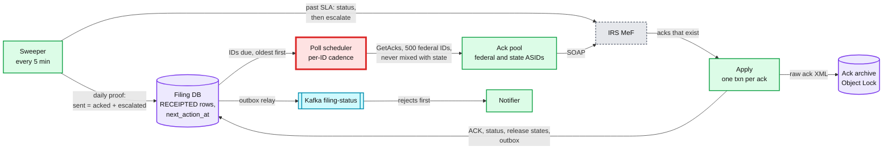
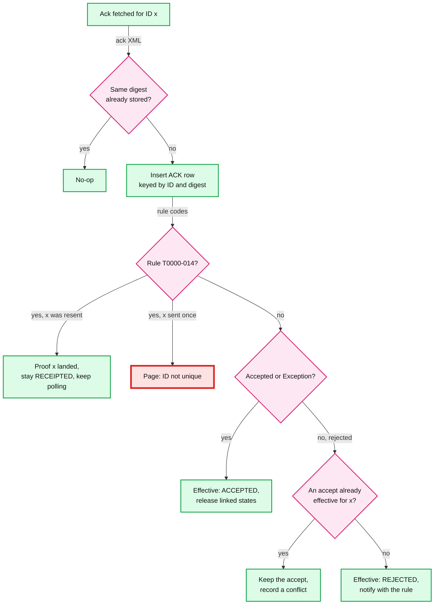

# Deep dive: ack reconciliation

> One-line answer: acks are pulled, so we ask MeF by submission ID (`GetAcks`, 500 IDs per call) for every ID we know is outstanding, apply each ack once in the same transaction that releases linked state returns, and prove completeness daily (`receipted = acked + escalated + still inside SLA`); the hard part is the poll schedule at peak, because acks do not come back in order, so the design polls the frontier (first poll at the median ack age) for its cost, ~6.5 ID-polls per ack, ~3.6 calls/s, ~36 sessions, and states the SLO honestly: p99 5 minutes off-peak, 30 minutes in the deadline week. A true 5-minute peak SLO would take ~11 federal-ack ASIDs and buys almost nothing legal.

Zoom-in on [`../solution.md`](../solution.md) §4.3, §5.6 and §10.5. Reusable blocks: [`../../../concepts/exactly-once.md`](../../../concepts/exactly-once.md) (apply once), [`../../../concepts/stream-processing.md`](../../../concepts/stream-processing.md) (outbox to Kafka). Siblings: [`exactly-once-submission.md`](exactly-once-submission.md) (T0000-014), [`reject-fix-resubmit-and-state-returns.md`](reject-fix-resubmit-and-state-returns.md) (what a reject starts).

Acronyms: MeF (Modernized e-File), ASID (Application System ID, 5 sessions each), ETIN (Electronic Transmitter Identification Number), SLO (service level objective), SLA (service level agreement), SSN (Social Security number), FIFO (first in, first out), XML (Extensible Markup Language), SOAP (Simple Object Access Protocol), UI (user interface).

---

## 1. What MeF gives us, and what it asks of us

| Fact | Exact words or value | Source |
|---|---|---|
| Use `GetAcks`, not `GetNewAcks` | "MeF strongly recommends all transmitters use the Get Acks service and not the Get New Acks service" | Pub 4164 §14.2.1 |
| Batch size | "A maximum of 500 acknowledgements can be retrieved using Get Acks"; it "can be run in multiple sessions using the same ETIN with no reduction in efficiency" | Pub 4164 §14.2.1 |
| Federal cadence | Wait at least 2 minutes (longer at peak); retrieve until a request returns nothing; then wait 2 min, add 30 s per request up to 5 min | Pub 4164 §14.2.2 |
| Waste is watched | "Requesting acknowledgements when you have already retrieved them all is a waste of system resources and is something the IRS will be focusing close attention to" | Pub 4164 §14.2.2 |
| Federal timing | Off-peak most acks within 5 min; peak "within two hours"; under extreme load "up to 24 hours"; some "are stuck in the pipeline and needs to be manually processed" | Pub 4164 §14 |
| What drives the spread | "Acknowledgement turnaround times are dependent on the size of the submission, the number of schedules and the forms attached" | Pub 4164 §5.6 |
| State timing | Wait 12 to 24 h; after 24 or 48 h stop asking and use status | Pub 4164 §14.2.3, §14.2.4 |
| Separate requests | "Do not retrieve federal and state acknowledgements in the same request" | Pub 4164 §14.2.5 |
| Retention at MeF | "MeF stores the acknowledgement file for one year from the date the acknowledgement was first created" | Pub 4164 §6.1 |
| Statuses | `Accepted`, `Rejected`, and for the 1040 family `Exception` (accepted, notice follows, "DO NOT RESUBMIT") | Pub 4164 Table 5-6 |
| Our duties | Retrieve acks within two workdays of transmission; contact the IRS if no acceptance within two workdays; tell the taxpayer within two workdays of retrieval | Pub 1345, transmitter requirements |

## 2. The pipeline



## 3. The frontier rule and its hidden assumption

The frontier rule (solution §4.3): an ID is first asked about once it is older than the median age of acks received in the last 10 minutes (at least 2 min), oldest first, then re-asked at +2 min, +30 s per empty answer, up to every 5 min. The first draft claimed "acks come back roughly in arrival order, so the calls stay full and the cost tracks the ack rate (~1 call/s)", with fetches "~1 to 2 minutes after it appears" and "p99 under 5 min" at peak. The model below is why the design no longer claims that.

**Why the in-order claim fails.** If acks came back strictly in order, the median would be a sharp line: everything older is acked, everything younger is not. MeF's own text says turnaround depends on return size and forms attached, so the lag is a spread, not a line. Model it as lognormal with a 30-minute median and p99 ~4 h at peak [model; Pub 4164 says "most" within 2 h and up to 24 h].

- **Fresh acks wait.** An ack ready at minute 3 is not asked about until minute 30: 27 minutes stale. Under this spread ~42% of acks are more than 5 minutes stale; p99 is 26 minutes.
- **Old IDs are polled forever.** Past the median, the slow tail is re-polled every 5 minutes for hours. That is 6.5 ID-polls per ack: calls are ~15% full, not full.
- **Cost:** at 280 federal receipts/s, 3.6 calls/s, 36 sessions at 10 s per call. The design sizes 8 federal-ack ASIDs (40 sessions, ~1.1x headroom at 10 s per call) plus 2 state; the first draft had sized ~10 sessions on the in-order assumption.

| Schedule at peak | ID-polls per ack | Calls/s | Sessions at 10 s | Stale p50 / p99 | Over 5 min |
|---|---|---|---|---|---|
| Frontier at the median (the design) | 6.5 | 3.6 | 36 | 4.0 / 26.2 min | 42% |
| Frontier at the 10th percentile | 10.2 | 5.7 | 57 | 2.1 / 5.8 min | 1.8% |
| Every ID every 5 min from 2 min | 10.0 | 5.6 | 56 | 2.5 / 4.9 min | 0% |
| Every ID every 2 min from 2 min | 22.9 | 12.8 | 128 | 1.0 / 2.0 min | 0% |

Off-peak (10 federal/s, median lag 3 min) every schedule costs under 0.05 calls/s and meets 5 minutes. The question only exists in the deadline week.

## 4. The choice the design made

- **Option A (rejected): fund the SLO.** Poll every outstanding ID at most every 5 minutes from age 2 minutes. ~56 sessions for federal acks at peak, ~11 ASIDs instead of 8. Calls are ~10% full, so MeF sees ~9 empty IDs per ack; no call is fully empty while acks flow, so the §14.2.2 backoff never triggers.
- **Option B (chosen): state the SLO honestly.** Keep the frontier (cheaper by ~35%), and publish "p99 within 5 min off-peak, within 30 min in the deadline week" (README and solution §1.2).
- **Why B.** The legal clock for a reject is days, not minutes: in the reject deep dive's model, notifying 30 minutes later instead of 2 changes the share of filers accepted by April 20 from 94.81% to 94.77%. The 5-minute target is user experience, not law.
- **Size the pool from the measured lag**, not from "calls stay full". The design's dashboard tracks ID-polls per ack; at the frontier it is ~6.5, and that, not the ack rate, sets the session count. Rejects are notified before accepts.

**Push back on the textbook answer.** "Poll each pending item with exponential backoff." Per-ID backoff with a 5-minute cap is exactly option A, and it is not the expensive part. The expensive part is the tail: IDs that take 4 hours. The design's lever is to stop polling them: past 2 hours, it asks `GetSubmissionsStatus` once per hour and only calls `GetAcks` when status says `ACKNOWLEDGED` (solution §10.2).

## 5. Applying an ack exactly once



- **One transaction per ack:** the `ACK` row, the submission's effective status, the linked state's `WAITING_FEDERAL` to `QUEUED` (conditional, so a second apply matches zero rows), and the outbox rows.
- **The key holds two acks.** `ACK` is keyed `(submission_id, ack_digest)` with `SUBMISSION.effective_ack_digest` as the pointer (solution §3.3). An early draft keyed it on `submission_id` alone, which could not keep a T0000-014 next to the real ack.
- **`Exception` is an accept.** The return is filed; the IRS adjusts it and sends a notice. The filer must not resubmit, and the UI says so.
- **The raw ack XML** goes to the archive under Object Lock: Pub 1345 says keep each ack file to the end of the calendar year; it is the only proof of accept or reject ("You must retrieve the Acknowledgement File and keep with the return records", Pub 4164 §5.4).

## 6. Proving every submission got an answer

- **The daily equation.** For each transmit day D: `receipted(D) = acked(D) + escalated(D) + still_inside_SLA(D)`. A non-zero remainder past 48 h pages. "No alerts" is not proof; this is.
- **What was never sent is counted too.** A linked state behind a federal return that is never fixed has no receipt, so no ack check sees it. The second term: `WAITING_FEDERAL` rows past their timer must be zero or owned by a human ([`reject-fix-resubmit-and-state-returns.md`](reject-fix-resubmit-and-state-returns.md) §5).
- **SLA clocks** come from MeF's numbers: 1 h off-peak, 24 h in the deadline week, 48 h hard (Pub 1345's two workdays). State returns: start at 12 h, stop polling at 24 to 48 h.
- **Escalation reads status, not acks.** Past SLA, `GetSubmissionsStatus`: `ACKNOWLEDGED` or `ACKNOWLEDGEMENT RETRIEVED` means fetch the ack now; federal `RECEIVED` past 24 h goes to the MeF Mailbox with the IDs; state `READY FOR PICKUP` or `SENT TO STATE` means call the state with the IDs (Pub 4164 §14.2.4). The status record "is not proof that the return was Accepted or Rejected", so it never reaches the filer as an outcome.
- **Not found while `RECEIPTED`** means our receipt record is wrong. That pages: it is a bug, not a slow IRS.
- **Lost our own rows?** MeF keeps acks a year. Re-fetch by ID; inserts are idempotent; replays are marked silent so filers are not emailed twice after the notifier's 7-day dedup window.

## 7. Notifications

- **Order:** rejects before accepts. A reject starts a 5-day clock; an accept starts nothing.
- **Content of a reject** is fixed by Pub 1345: that the IRS rejected it, the date, the business rule definitions, the steps to fix it, and that a paper return filed by the later of the due date or 10 days after the reject notice is timely.
- **At-least-once with dedup.** Outbox to Kafka keyed by `return_id`, notifier dedups on `event_id = submission_id + status`. Kafka down means notifications lag; acks and filing do not.

## 8. Runnable model

Polls per ack, MeF calls and staleness for four schedules, at peak and off-peak. Standard library only, seeded.

```python
import math, random
random.seed(3)
PER_CALL, L_ACK, N = 500, 10, 20_000                # IDs per GetAcks call, call latency s, sample

def lags(median_min, sigma):                         # ack lag in seconds, lognormal [model]
    return [median_min * 60 * math.exp(random.gauss(0, sigma)) for _ in range(N)]

def quantile(xs, p):
    xs = sorted(xs); return xs[min(len(xs) - 1, int(p * len(xs)))]

def poll(first, lag, cadence):
    """Polls one ID until the poll finds its ack. Returns (polls, delay after the ack existed)."""
    t, n, step = first, 1, 120
    while t < lag:
        if cadence == "mef": t += step; step = min(300, step + 30)   # +2 min, +30 s, cap 5 min
        else: t += cadence
        n += 1
    return n, t - lag

def run(name, lag_list, first_at, cadence, rate):
    polls, delays = 0, []
    for lag in lag_list:
        n, d = poll(first_at, lag, cadence); polls += n; delays.append(d)
    per_ack = polls / len(lag_list)
    calls = rate * per_ack / PER_CALL
    print(f"  {name:31} polls/ack {per_ack:5.2f}  calls/s {calls:5.2f}  sessions {calls * L_ACK:5.1f}  "
          f"delay p50 {quantile(delays, .5) / 60:5.1f} min  p99 {quantile(delays, .99) / 60:5.1f} min  "
          f"over 5 min {sum(d > 300 for d in delays) / len(delays):6.1%}")

for label, med, sig, rate in (("peak, 280 federal/s: ack lag median 30 min, sigma 0.9", 30, 0.9, 280),
                              ("off-peak, 10 federal/s: ack lag median 3 min, sigma 0.6", 3, 0.6, 10)):
    L = lags(med, sig)
    print(f"{label}: p90 {quantile(L, .9) / 60:.0f} min, p99 {quantile(L, .99) / 60:.0f} min")
    median = max(120, quantile(L, .5)); p10 = max(120, quantile(L, .1))
    run("frontier at median (design)", L, median, "mef", rate)
    run("frontier at p10", L, p10, "mef", rate)
    run("every ID every 5 min from 2 min", L, 120, 300, rate)
    run("every ID every 2 min from 2 min", L, 120, 120, rate)
```

Output:

```
peak, 280 federal/s: ack lag median 30 min, sigma 0.9: p90 95 min, p99 245 min
  frontier at median (design)     polls/ack  6.46  calls/s  3.62  sessions  36.2  delay p50   4.0 min  p99  26.2 min  over 5 min  41.9%
  frontier at p10                 polls/ack 10.21  calls/s  5.72  sessions  57.2  delay p50   2.1 min  p99   5.8 min  over 5 min   1.8%
  every ID every 5 min from 2 min polls/ack 10.04  calls/s  5.62  sessions  56.2  delay p50   2.5 min  p99   4.9 min  over 5 min   0.0%
  every ID every 2 min from 2 min polls/ack 22.85  calls/s 12.80  sessions 128.0  delay p50   1.0 min  p99   2.0 min  over 5 min   0.0%
off-peak, 10 federal/s: ack lag median 3 min, sigma 0.6: p90 6 min, p99 12 min
  frontier at median (design)     polls/ack  1.79  calls/s  0.04  sessions   0.4  delay p50   1.2 min  p99   2.8 min  over 5 min   0.0%
  frontier at p10                 polls/ack  2.20  calls/s  0.04  sessions   0.4  delay p50   1.0 min  p99   3.0 min  over 5 min   0.0%
  every ID every 5 min from 2 min polls/ack  1.84  calls/s  0.04  sessions   0.4  delay p50   2.9 min  p99   5.0 min  over 5 min   0.0%
  every ID every 2 min from 2 min polls/ack  2.29  calls/s  0.05  sessions   0.5  delay p50   0.9 min  p99   2.0 min  over 5 min   0.0%
```

Reading it: the frontier saves ~35% of calls against a per-ID 5-minute cadence and pays for it with a 26-minute p99. Calls are never "full" at peak under any schedule that meets the SLO, because the lag spread, not the ack rate, drives polls. The lognormal shape is a model; measure ID-polls per ack in production and size the ack pool from it.

## 9. What an interviewer pushes on

1. **"Why not `GetNewAcks`? It is one call for everything new."** It is a destructive read: a lost response must be recovered with `GetAcksByMsgID`, and MeF "strongly recommends" `GetAcks`. We know which IDs we sent; asking by ID is idempotent.
2. **"How do you know every one of 3 M got an answer?"** The daily equation per transmit day, with a page on any remainder past 48 h, and the status-based escalation tree.
3. **"Your calls are 85% empty. Won't the IRS mind?"** No call is fully empty while acks flow, so MeF's backoff rule is followed. The waste MeF names is asking for acks "when you have already retrieved them all"; we never ask about an acked ID. Past 2 h, switch the tail to hourly status checks.
4. **"What if the same ack is fetched twice?"** The digest key makes the second insert a no-op; the state release is conditional; the notifier dedups on `event_id`.
5. **"What if the IRS sends an accept and a reject for one ID?"** That is the resend case: the reject is T0000-014 and never effective. A business-rule reject after an accept is recorded as a conflict and the accept stands.
6. **"A state ack never comes."** Stop asking at 24 to 48 h, read status, call the state with the IDs.

## 10. Trade-offs

| Decision | Option A | Option B | Chose | Why |
|---|---|---|---|---|
| Retrieval call | `GetNewAcks` | `GetAcks` by ID | By ID | MeF's recommendation; not destructive; matches our outstanding set |
| Poll schedule at peak | Frontier at the median | Per-ID, every 5 min from 2 min | Frontier, SLO stated as 30 min at peak | ~35% fewer calls; the legal clock is days |
| Tail past 2 h | Keep polling acks every 5 min | Hourly status, acks on `ACKNOWLEDGED` | Status | The tail is where most empty polls go |
| `ACK` key | `submission_id` | `(submission_id, ack_digest)` | Composite | Two outcomes per ID are possible after a resend |
| Completeness | Alert on absence | Daily equation per transmit day | Equation | "No alerts" is not proof |
| What we refused | Push acks (MeF has none); treating a status record as an outcome; a single pool for sends and acks | | | Each hides a missing ack or couples rejects to send load |

## 11. Numbers to say out loud

- `GetAcks`: 500 IDs per call; federal and state never in one request; acks kept by MeF for one year.
- MeF: most acks in 5 min off-peak, 2 h at peak, up to 24 h; state 12 to 24 h; escalate by 48 h.
- Frontier at the median (the design): 6.5 polls per ack, 3.6 calls/s, 36 sessions on 8 federal-ack ASIDs, p99 26 min stale at peak, so the SLO is 30 min in the deadline week.
- Per-ID 5-minute cadence (rejected): 10 polls per ack, 5.6 calls/s, ~56 sessions (~11 ASIDs), p99 4.9 min.
- Notifying 30 min later moves acceptance by April 20 from 94.81% to 94.77%: freshness is experience, not law.
