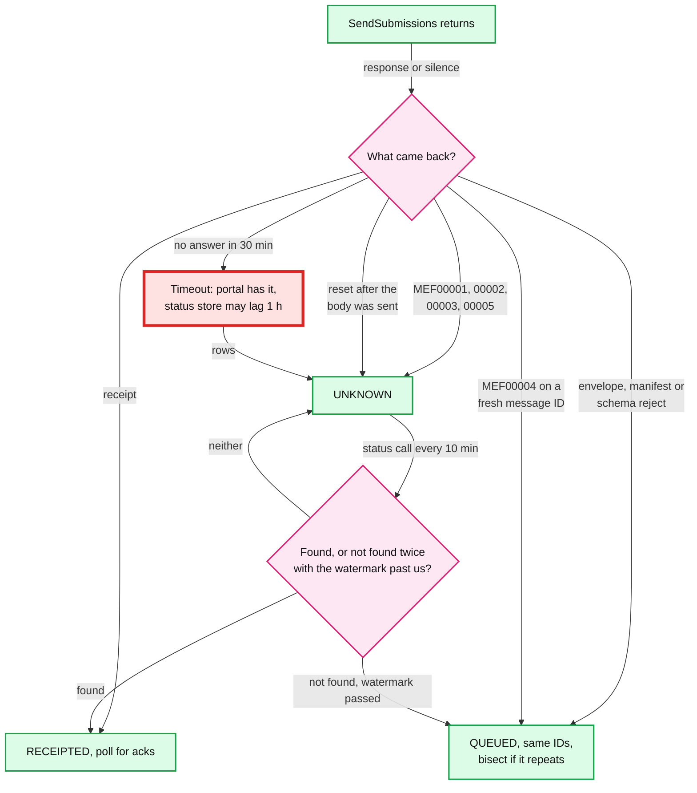
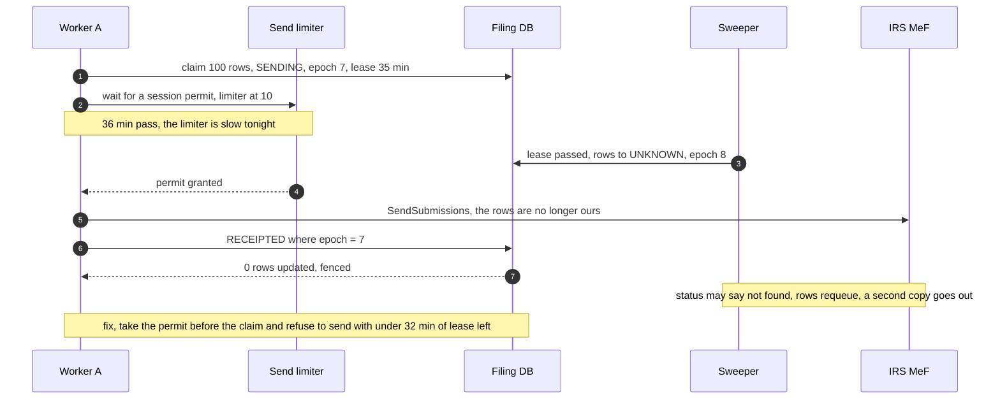

# Deep dive: exactly-once submission to MeF

> One-line answer: MeF has no idempotency key, but it stores each submission ID once and rejects any second copy under business rule T0000-014, so "exactly once" is our protocol around that fact: mint the ID once at the click, make every resend byte-identical under the same ID, never resend from `UNKNOWN` until MeF's status store has provably caught up past our send time, take the session before the claim so a stale worker cannot send, and read a T0000-014 on a resent ID as "it landed", never as a reject the filer sees.

Zoom-in on [`../solution.md`](../solution.md) §4.2, §5.3 and §10.5. Reusable blocks: [`../../../concepts/exactly-once.md`](../../../concepts/exactly-once.md), [`../../../concepts/leases-fencing-clocks.md`](../../../concepts/leases-fencing-clocks.md). Related: [`../../payments-ledger/`](../../payments-ledger/) (query status before retrying a non-idempotent call). Siblings: [`ack-reconciliation.md`](ack-reconciliation.md), [`irs-outage-and-backpressure.md`](irs-outage-and-backpressure.md).

Acronyms: MeF (Modernized e-File), A2A (application-to-application, MeF's SOAP channel), SOAP (Simple Object Access Protocol), ASID (Application System ID, 5 sessions each), EFIN and ETIN (Electronic Filing and Electronic Transmitter Identification Numbers), SSN (Social Security number), GC (garbage collection), RPO (recovery point objective), SLA (service level agreement), FIFO (first in, first out).

---

## 1. Four kinds of duplicate, and what MeF does with each

| Duplicate | What MeF does | Exact source text | Harm to the filer |
|---|---|---|---|
| Same **message ID** twice | Refuses to store the message: `MEF00004 DuplicateMessageID` | "A message could not be stored because it had a duplicate MessageID" (Pub 4164, A2A error list) | None. Nothing in it was stored |
| Same **submission ID** twice | Rejects the second copy: **T0000-014**, Incorrect Data, Reject and Stop | "The Submission ID must be globally unique" (Pub 4164 Table 5-2). The manifest check: a SubmissionId "should not be a duplicate of another SubmissionId" | None to the filing, if we read the ack right (§4) |
| Same **return**, two submission IDs | Processes both. The second hits the duplicate-return rules | "Duplicate Condition: the tax return or the transmission file was previously received and accepted by the IRS" (Pub 4164 error categories) | Real: a reject the filer must understand, two records at the IRS |
| Whole **message** rejected | Stores nothing | "When a transmission is rejected, you will not receive an acknowledgement for individual submissions ... All submissions must be resubmitted" | None, if resent under the same IDs |

- **The dangerous row is the third.** It happens only when we mint a second submission ID for one return: a new ID "to be safe" after a timeout, a journal attempt adopted next to a DB attempt, or two transmitters owning one return during a migration.
- **Name the right rule.** The rule for a repeated ID is T0000-014; "Duplicate Condition" is the third row. An early draft of the design cited Duplicate Condition for a repeated ID; solution §5.3 and §10.5 now name T0000-014.
- **The year matters too.** "YYYY in the SubmissionId must be the current Processing Year" (Pub 4164 §5.1). An ID minted in December can never be sent in January; that is the one legitimate re-mint, and only after status proves the old ID never landed.

## 2. Classifying every send outcome



- **The design's rule** (solution §4.2 step 6, D6a): only a reject that says MeF processed nothing goes to `QUEUED`; any system exception is `UNKNOWN`. Both are `E` error responses, but `MEF00003 UpdateMessageFailure` reads like a stored message that failed a later update. An early draft sent every message-level error to `QUEUED` while its own limiter diagram sent `MEF00001` to `UNKNOWN`.
- **Why lean toward `UNKNOWN`:** a wrong `UNKNOWN` costs one status call. A wrong `QUEUED` costs a T0000-014 and a confusing ack.
- **A poisoned message** (one bad package failing the envelope every time) is bisected, as in [`../diagrams.md`](../diagrams.md) D5b.

## 3. Why a same-ID resend cannot file twice

- **One ID, one stored return.** T0000-014 makes MeF the dedup table for submission IDs. Whichever copy validates first is the return; the other is rejected and stops.
- **Byte-identical resends.** The packager is deterministic: same package bytes, same manifest, same postmark element. The only difference is the message ID, which is outside the submission. So it does not matter which copy wins.
- **So the not-found rule is about cost, not correctness.** A premature resend produces a T0000-014, a wasted call, and IRS attention to wasted traffic ("something the IRS will be focusing close attention to", Pub 4164 §14.2.2). It does not produce a second filing. A **new** ID would, every time.
- **The real correctness risk moves to the reconciler:** reading that T0000-014 as "your return was rejected" (§4).

## 4. Reading T0000-014 correctly

- **Rule:** a T0000-014 on a submission we sent more than once is proof the ID is stored at MeF. Keep the row `RECEIPTED`, keep polling for the real ack, never notify the filer, count it.
- **A T0000-014 on an ID we sent once** is a different bug: our ID was not unique. Likely causes: an `ID_BLOCK` lease lost in a promotion (RPO ~1 s) and re-issued, or a sequence bug. Page; the reconciler may be about to match an ack to the wrong return.
- **What MeF returns from `GetAcks` for an ID with two outcomes** is not documented [unverified]. It could return the accept, the T0000-014, or both. So:
  - the `ACK` table is keyed `(submission_id, ack_digest)` so it can hold two acks per ID, and `SUBMISSION.effective_ack_digest` says which one the filer sees (solution §3.3). A key on `submission_id` alone, as in an early draft, would drop the second ack or overwrite the first;
  - effective status: any `Accepted` or `Exception` wins; a T0000-014 never becomes effective; a business-rule reject becomes effective only if no accept exists after one more poll cycle;
  - if only T0000-014 arrives within the ack SLA, the sweeper escalates the ID to the MeF Mailbox.
- **It may reject the whole message.** Pub 4164 lists T0000-014 among the transmission validation rules (Table 5-2), and "when a transmission is rejected ... All submissions must be resubmitted". Whether MeF rejects only the duplicate or the whole message is not documented [unverified]. If it is the message, one duplicate poisons the 99 fresh submissions riding with it, and a naive requeue loops forever. So resends from `UNKNOWN` travel in their own messages, never mixed with fresh rows, and a message-level T0000-014 marks the named ID as landed and requeues the rest.
- **Alert on the rate.** With the status lag in §5, conflicts are expected at peak, so the design alerts when T0000-014 exceeds 1% of resends and pages on any T0000-014 for a once-sent ID. (An early draft paged on every conflict as "a protocol bug".)

## 5. The status store lags the portal

MeF's own explanation of peak timeouts: "Generally the delay is between the MeF portal and backend and if the timeout setting on the client side is too low then the connection is lost" (Pub 4164 §14.2.6). So at the moment we time out (30 minutes), the message is often sitting in the portal, and the status service, which reads what the backend stored, says not found.

- **The first draft's rule:** two not-found answers 10 minutes apart, then resend. The 10 minutes were calibrated to nothing. If the backend is 60 minutes behind, both answers come back not found and the first copy lands 20 minutes after the resend.
- **Simulated (§8):** with the backend up to 60 minutes behind at the worst hour, the two-check rule resends **568 of 771** timed-out messages whose first copy still lands (74%), each of 100 submissions.
- **The design's watermark rule** (solution §5.3). Resend only after two not-found answers **and** after MeF has stored a message we sent at least 5 minutes later than this one (a later receipt, or a later ID found by status). That is evidence the backend has moved past our send time. If MeF's backend drains roughly in order, duplicate sends fall to **13 of 771**, and genuinely lost messages are resent after 40 to 70 minutes instead of 40.
- **If the backend does not drain in order,** the watermark still halves duplicates (214 of 608 against 408) but no longer removes them. That is why §3 and §4 matter more than any wait rule: correctness comes from the same ID and the right reading of T0000-014.
- **Why not just wait longer?** A fixed 2-hour wait would remove most duplicates at peak and delay every lost message by 2 hours off-peak too. The watermark adapts: off-peak it fires at 40 minutes.
- **Paging changes with it.** `UNKNOWN` rows legitimately live 40 to 70 minutes at peak, so the page fires at **90 minutes** (an early draft paged at 45).
- **Liveness.** The watermark needs a later message that MeF has stored. After an outage the breaker's probe is one. In a quiet hour, or if every later message also hung, it may never come. The design bounds it (solution.md §5.3, D8a): an `UNKNOWN` row with no watermark after 6 h goes to `ESCALATED` and the MeF Mailbox, never to a blind resend.

## 6. Fencing does not fence MeF



- **The epoch protects our database**, the only resource that checks it. MeF does not check it, so a stale worker can still send. See [`../../../concepts/leases-fencing-clocks.md`](../../../concepts/leases-fencing-clocks.md).
- **Permit first, then claim** (solution §4.2). A worker holds a session permit before it claims rows, so a claim never waits on the limiter.
- **Lease budget check.** Right before the call: `lease_until - now` must exceed the 30-minute client timeout plus 2 minutes. If not, do not send. A worker that never sent may put its rows back to `QUEUED` itself, fenced by its epoch; if the epoch already moved, the rows are `UNKNOWN` and the status path requeues them after its checks.
- **A GC pause between the check and the send** is bounded by the 5-minute margin between the 35-minute lease and the 30-minute timeout. A pause longer than that is a host problem; the watermark rule still catches the resulting duplicate.

## 7. The end-to-end rules, in one place

1. Mint every submission ID once, at the click, from a leased block whose prefix carries region, shard and an epoch bumped on every promotion.
2. Claim only with a session permit in hand; send only with enough lease left.
3. Every send outcome maps to `RECEIPTED`, `QUEUED` (MeF stored nothing) or `UNKNOWN` (anything else).
4. From `UNKNOWN` the only exits are "found" and "not found twice with the watermark past us".
5. Resends are byte-identical under the same ID, in a new message with a new message ID.
6. A T0000-014 on a resent ID means landed. A T0000-014 on a once-sent ID pages.
7. A new ID for the same return only via a new attempt: a correction, or the December-to-January re-mint after proof.

## 8. Runnable model

MeF's backend falls up to 60 minutes behind during a 4-hour peak; 1% of messages are lost by the portal. How many duplicate sends does each resolution rule make? Standard library only, seeded.

```python
import random
random.seed(42)
M, T_OUT, CHECK = 60, 1800, 600            # minute; client timeout 30 min; recheck every 10 min
HUMP, LOST = 60 * M, 0.01                  # MeF backend up to 60 min behind at the worst [model]

def backlog(s):                            # backend delay for a message the portal got at s
    return HUMP * max(0.0, 1 - abs(s - 2 * 3600) / 3600)

def make(fifo):                            # (sent_at, stored_at or None if the portal lost it)
    out, prev = [], 0.0
    for i in range(3000):                  # one message every 6 s; the first 4 h are scored
        s = i * 6
        st = s + backlog(s) * random.uniform(0.8, 1.2)
        if fifo: st = max(st, prev)        # the backend drains in order, jitter below
        prev = st
        out.append((s, None if random.random() < LOST else st + random.expovariate(1 / 20)))
    return out

def watermark(c):                          # latest send time among our messages MeF had stored by c
    return max((s for st, s in stored_times if st <= c), default=-1)

def resolve(s, st, rule):
    """Returns (resend_at or None, status calls). Only called for timed-out messages."""
    c, calls, misses = s + T_OUT, 0, 0
    if rule == "blind same ID": return c, 0
    while True:
        calls += 1
        if st is not None and st <= c: return None, calls            # found: RECEIPTED
        misses += 1
        if rule == "two not-founds" and misses == 2: return c, calls
        if rule == "watermark" and misses >= 2 and watermark(c) >= s + 5 * M: return c, calls
        if c > s + 6 * 3600: return c, calls                         # liveness cap, never hit here
        c += CHECK

for fifo in (True, False):
    msgs = make(fifo)
    stored_times = sorted((st, s) for s, st in msgs if st is not None)
    print("backend drains in order (FIFO)" if fifo else "backend out of order")
    for rule in ("blind same ID", "two not-founds", "watermark"):
        timeouts = dup = calls = 0; waits = []
        for s, st in msgs[:2400]:
            if st is not None and st - s <= T_OUT: continue          # receipt arrived in time
            timeouts += 1
            resend, n = resolve(s, st, rule); calls += n
            if resend is None: continue
            if st is not None: dup += 1    # MeF stores the first copy too: T0000-014 on one of them
            else: waits.append((resend - s) / M)
        lost = sum(1 for _, st in msgs[:2400] if st is None)
        print(f"  {rule:15} timeouts {timeouts:4}  status calls {calls:4}  duplicate-ID sends {dup:4}  "
              f"lost {lost} resent after {min(waits):.0f} to {max(waits):.0f} min (mean {sum(waits) / len(waits):.0f})")
    print("  a new submission ID on every timeout would have filed",
          sum(1 for s, st in msgs[:2400] if st is not None and st - s > T_OUT), "returns twice")
```

Output:

```
backend drains in order (FIFO)
  blind same ID   timeouts  771  status calls    0  duplicate-ID sends  746  lost 25 resent after 30 to 30 min (mean 30)
  two not-founds  timeouts  771  status calls 1542  duplicate-ID sends  568  lost 25 resent after 40 to 40 min (mean 40)
  watermark       timeouts  771  status calls 2708  duplicate-ID sends   13  lost 25 resent after 40 to 70 min (mean 43)
  a new submission ID on every timeout would have filed 746 returns twice
backend out of order
  blind same ID   timeouts  608  status calls    0  duplicate-ID sends  590  lost 18 resent after 30 to 30 min (mean 30)
  two not-founds  timeouts  608  status calls 1216  duplicate-ID sends  408  lost 18 resent after 40 to 40 min (mean 40)
  watermark       timeouts  608  status calls 1627  duplicate-ID sends  214  lost 18 resent after 40 to 50 min (mean 41)
  a new submission ID on every timeout would have filed 590 returns twice
```

Reading it: every count is messages of up to 100 submissions. A new ID per timeout is the only rule that files returns twice (746 messages, ~75k returns). The two-check rule is safe but noisy at peak. The watermark costs ~1.8x the status calls and buys a 40x cut in duplicate sends when the backend drains in order. The backlog shape and the 1% loss rate are a model, not IRS data.

## 9. What an interviewer pushes on

1. **"The send timed out. Same ID or new ID?"** Same ID, always. A new ID turns a timeout into a second return whenever the first copy landed (every timed-out message that MeF stored).
2. **"Then why check status at all?"** Cost and citizenship. A blind same-ID resend is safe but sends ~97% duplicates at peak, each a T0000-014 and wasted MeF capacity. Status first is also what MeF asks for.
3. **"What does MeF do with the duplicate?"** T0000-014, "The Submission ID must be globally unique", Reject and Stop. Not the Duplicate Condition category, which is about a return already accepted.
4. **"What if the resend lands after the first copy was accepted?"** The resend is rejected with T0000-014. We read it as "landed", keep the accept as effective, and never show it.
5. **"What if status says not found but MeF has it?"** That is the portal-to-backend lag. Two not-founds plus the watermark; if the duplicate still happens, rules 5 and 6 of §7 make it harmless.
6. **"A worker pauses for a minute mid-send."** The epoch fences the DB write. The send itself is bounded by the lease budget check; the sweeper's resend is caught by T0000-014.
7. **"Can you use the message ID as the idempotency key?"** MeF does reject a repeated message ID (`MEF00004`), but whether that check covers a message still in flight between portal and backend is not documented [unverified]. We resend under a new message ID and lean on the submission ID instead.

## 10. Trade-offs

| Decision | Option A | Option B | Chose | Why |
|---|---|---|---|---|
| ID on a resend | New ID | Same ID, byte-identical | Same | A new ID files twice when the first copy landed |
| When to resend from `UNKNOWN` | Two not-founds 10 min apart (first draft) | Two not-founds plus a watermark past our send time | Watermark | 568 to 13 duplicate sends at peak (in-order backend); same speed off-peak |
| Ambiguous `E` errors | `QUEUED` | `UNKNOWN` | `UNKNOWN` | One extra status call beats one T0000-014 |
| Order of claim and permit | Claim, then wait for a session | Permit, then claim | Permit first | A fencing token cannot stop a send to a system that ignores it |
| `ACK` key | `submission_id` | `(submission_id, ack_digest)` | Composite | MeF's behaviour for two outcomes on one ID is undocumented |
| Conflict alerting | Page on each | Page on rate, or on a once-sent ID | Rate | Expected at peak; a once-sent T0000-014 is the real bug |
| What we refused | An idempotency key MeF does not have; a new ID during an unknown; moving `UNKNOWN` rows between transmitters | | | Each manufactures the third row of §1 |

## 11. Numbers to say out loud

- MeF client timeout 30 min; lease 35 min; refuse to send with under 32 min of lease left.
- T0000-014: "The Submission ID must be globally unique", Reject and Stop. `MEF00004`: duplicate message ID, nothing stored.
- Backend 60 min behind: two-check rule 568 of 771 timed-out messages resent while still landing; watermark 13.
- Lost messages resent after 40 to 70 min; `UNKNOWN` page at 90 min; proposed escalation at 6 h without a watermark.
- New ID per timeout: ~75k returns filed twice in the same model.
