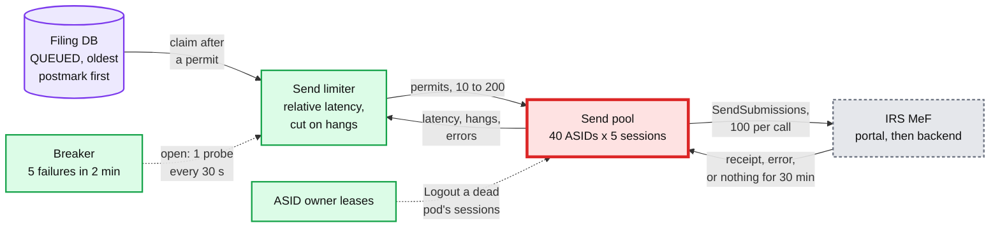
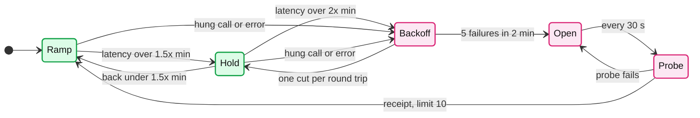

# Deep dive: MeF slow or down, and draining without a storm

> One-line answer: our send rate is `sessions x 100 / MeF call latency`, and only the session count is ours, so we size ASIDs ahead of the season, push only as hard as MeF answers, stop on failures, and drain oldest postmark first; the design's limiter grows on **relative** latency (within 1.5x the recent minimum) and cuts hard on hung calls, because the first draft's absolute rule (grow only while p90 is under 30 s) sat at 10 calls, ~17/s, when MeF came back from an outage at 60 s per call, and because a hung call costs a session for 30 minutes.

Zoom-in on [`../solution.md`](../solution.md) §2 (the channel table), §5.4, §5.5 and §10.4. Reusable blocks: [`../../../concepts/rate-limiting-and-load-shedding.md`](../../../concepts/rate-limiting-and-load-shedding.md) (limiters, breakers), [`../../../concepts/leases-fencing-clocks.md`](../../../concepts/leases-fencing-clocks.md) (ASID owner leases). Related: [`../../network-throttling/`](../../network-throttling/). Siblings: [`exactly-once-submission.md`](exactly-once-submission.md), [`postmark-and-peak-intake.md`](postmark-and-peak-intake.md).

Acronyms: MeF (Modernized e-File), A2A (application-to-application), ASID (Application System ID, 5 sessions each), SAML (Security Assertion Markup Language, the session token), AIMD (additive increase, multiplicative decrease), ETIN (Electronic Transmitter Identification Number), ATS (Assurance Testing System), SLO (service level objective), TCP (Transmission Control Protocol), ET (US Eastern Time).

---

## 1. The channel, and what we do not know about it

| Fact | Value | Source |
|---|---|---|
| Submissions per `SendSubmissions` | 1 to 100 in one container zip | Pub 4164 (transmission file) |
| Sessions | 5 per ASID; one call at a time per session | Pub 4164 §14.1 |
| Client timeout | "MEF recommends a connection timeout setting of 30 minutes" | Pub 4164 §14.2.6 |
| Where peak timeouts happen | "between the MeF portal and backend" | Pub 4164 §14.2.6 |
| Normal receipt time | "Most submissions will be receipted within seconds" (§14); also "responds within seven minutes with a receipt" (§5.6) | Pub 4164 |
| Published cap on ASIDs per transmitter, or on calls per second | none found | Pub 4164 [unverified that none exists] |
| Legal floor | IRS receipt within 2 days of the postmark keeps the return timely | Pub 4164 §1.5.3 |

**Send throughput with 40 send ASIDs (200 sessions), and the deadline day's 3 M submissions:**

| Call latency L | Per session | 200 sessions | 3 M takes | 1 h target | 2-day floor (~17/s) |
|---|---|---|---|---|---|
| 5 s | 20/s | 4,000/s | 13 min | met | met |
| 40 s | 2.5/s | 500/s | 1.7 h | mostly met | met |
| 2 min | 0.83/s | 167/s | 5 h | missed for some | met |
| 5 min | 0.33/s | 67/s | 12.5 h | missed | met |
| 7 min (Pub 4164 §5.6) | 0.24/s | 48/s | 17 h | missed | met |
| 30 min (every call times out) | 0.06/s | 11/s | 75 h | missed | **missed: filers late** |

- **The floor is low.** `3 M / 172,800 s = ~17/s` averaged over two days. Only a near-total MeF failure for a day or more threatens it. That is what makes a backlog survivable.
- **The 30-minute row means late filers.** Under Pub 4164 §1.5.3 a return received more than 2 days after its postmark loses the timely treatment. It is the one row where filers, not just our SLO, lose; solution §5.4 marks it so (an early draft called it "at risk, call the IRS").
- **Seven minutes is also IRS text.** At that latency 40 ASIDs carry 48/s. Size the season plan for the 7-minute row, not the 5-second one.

## 2. The send path



## 3. Why pushing harder makes it slower

- **Little's law.** If MeF will process C submissions/s for us with base latency L0, in-flight work beyond `C x L0` only waits inside MeF. Latency rises, throughput does not.
- **Past some point, calls hang.** MeF's peak timeouts are between its portal and backend. A hung call holds one of our sessions for the full 30 minutes, and its 100 rows go `UNKNOWN`, which then need status calls. Each hang removes capacity exactly when we are short of it: a metastable failure we cause ourselves.
- **In the model (§9)**, sending at a fixed 200 calls into a MeF that hangs past ~150 calls in flight produced 5,894 hung calls and an 11.5-hour oldest return after a 2-hour outage. The limiter is not politeness; it is throughput.

## 4. The first draft's limiter, and why it was replaced

The first draft: start at 40 calls, range 10 to 200, "+1 per round trip while p90 latency is under 30 s, hold above 60 s, x0.7 on any timeout or `MEF00001`", breaker after 5 failures in 2 minutes, half-open "limit 10, then ramp". It reads like a sensible AIMD (additive increase, multiplicative decrease). Four problems:

- **It treats a slow MeF as a congested MeF.** The growth condition is an absolute 30 s, while the capacity plan (solution §2, §5.4) expects 40 s to 5 minutes at peak. Whenever MeF's base latency is above 30 s, the limit never grows, whatever MeF could absorb.
- **After an outage it is stuck at the floor.** Half-open resets to 10. If MeF comes back at 60 s per call, `10 x 100 / 60 = 17/s`, below the evening's arrival rate, so the backlog grows. The draft's own "1.6 h drain at L = 60 s" assumed 200 calls (333/s), which its rule never reached.
- **"+1 per round trip" is slow even when it grows.** At a 60 s round trip, 10 to 200 calls takes 190 round trips, over 3 hours.
- **When latency is low it overshoots.** Growth does not look at the latency trend, so it climbs to 200 when MeF answers in 5 s, past MeF's hang point if there is one (400 hung calls in the model after MeF recovers).

## 5. The design's limiter: follow MeF



- **Signal: latency relative to the recent minimum,** over a 10-minute window. A MeF at 60 s that stays at 60 s as we add calls has room; one that goes from 60 s to 120 s does not. This is the TCP Vegas idea, not the TCP Reno idea.
- **Ramp fast while healthy:** +0.5 per completed call while the limit is actually in use (about x1.5 per round trip). 10 to 200 in ~8 round trips, not 190.
- **Cut hard on hangs and errors:** x0.7, at most once per minute, and remember the limit where hangs started as a ceiling for 30 minutes. Probing into the hang point costs 30 minutes of a session per probe.
- **Only grow when the limit binds.** A limit that grows while we are idle is a lie that bites at the first burst.
- **Breaker as before.** Open after 5 failures in 2 minutes; one probe every 30 s; half-open at 10, then ramp. All of this is solution §5.4, §5.5 and §10.2.
- **Keep the minimum honest.** Under sustained load nobody sees the base latency, and the window's minimum drifts up with it. Every 10 minutes, if the limit is above 20, run one round at half the limit to re-measure it.

## 6. Two hours of outage on the deadline evening

1. **9:00 PM Eastern:** calls fail fast or hang. The limiter cuts; five failures open the breaker by ~9:02 PM and page e-file operations. Rows from failed calls are `UNKNOWN` unless MeF said it stored nothing.
2. **File never notices.** Filers get `RECEIVED` with a postmark and the banner: "Sending to the IRS is delayed tonight. Your TurboTax electronic postmark keeps you on time." Pub 1345 forbids calling it an IRS postmark.
3. **Ack polling pauses.** There is nothing to fetch. The sweeper suppresses "no ack yet" alerts, never the 2-day clock.
4. **11:00 PM:** a probe gets a receipt. Drain order: status-check every `UNKNOWN` row (with the watermark rule from [`exactly-once-submission.md`](exactly-once-submission.md)), then corrections (priority 0), then federal by oldest postmark, then released states.
5. **How big the backlog gets depends on the evening's shape.** With half the day inside a 26-minute ramp before each midnight (the shape that gives the README's ~500/s), 9 to 11 PM Eastern carries only ~0.24 M; the backlog peaks after the Eastern ramp, at 0.76 M with the relative limiter (solution §5.5). The first draft assumed ~1.1 M from a flat ~150/s evening. Both are estimates; the plan must hold for either.

## 7. When the 2-day clock gets close

| Oldest `QUEUED` postmark | Action |
|---|---|
| 1 h | Ticket. SLO burn. Banner on. |
| 6 h | Move ack ASIDs to sending (acks can wait; the transmit clock cannot). Pause state sends. |
| 24 h | Page. E-file operations calls the IRS e-Help Desk with counts and evidence. |
| 36 h | Every session sends the oldest postmarks only. Legal and comms are in the room. |
| 48 h | The returns past it may no longer be treated as timely (Pub 4164 §1.5.3). Relief for an IRS-side outage is the IRS's call [unverified]. |

## 8. ASIDs: the number we must ask for

- **Pools (solution §5.4):** 40 send, 10 ack (8 federal, 40 sessions for the ~36 the frontier needs at peak; 2 state), 2 status, 2 spare: **~54 ASIDs**. The design refuses the ~11 federal-ack ASIDs a 5-minute peak ack SLO would need and states 30 minutes for the deadline week instead ([`ack-reconciliation.md`](ack-reconciliation.md)).
- **No published cap** [unverified]. Confirm the count with the IRS in the autumn, before ATS, and enroll early: each ASID needs its own certificate.
- **If the IRS says 10:** 50 sessions at 40 s carry 125/s. The evening backlog drains overnight and the 2-day floor (17/s) still holds. Design so the answer changes the 1-hour SLO, not the legal outcome.
- **Session hygiene:** an ASID has one owner pod at a time (a ~10 s lease). A new owner logs out its predecessor's sessions within seconds, well inside the 15-minute idle window, because "if client sends a logout to a session who's SAML is expired this logout will fail and the session will remain stale" until MeF's nightly cleanup (Pub 4164 §14.1).

## 9. Runnable model

A deadline evening that rolls across six time zones, three MeF behaviours, three send policies: `absolute` (the first draft), `relative` (the design's growth and cut rules) and `fixed` (no limiter). MeF serves C submissions/s with base latency L0, and calls start hanging (30 min) once more than K = 15,000 submissions are in flight [model, not IRS data]. Standard library only, seeded.

```python
import heapq, math, random
from collections import deque
random.seed(7)
H = 3600
# (UTC hour of local midnight on April 16, population share [estimate]) for ET, CT, MT, PT, AK, HI
ZONES = [(4, .47), (5, .29), (6, .07), (7, .16), (8, .004), (10, .005)]
DAY, F_RAMP, TAU = 3_000_000, 0.5, 26 * 60   # deadline-day submissions, half in a 26-min ramp

def arrivals(t):  # submissions/s, t = seconds after 00:00 UTC April 16
    r = 0.0
    for mid, share in ZONES:
        d = mid * H - t                                  # seconds to that zone's midnight
        if 0 < d <= 18 * H: r += share * DAY * (1 - F_RAMP) / (18 * H)
        if d > 0: r += share * DAY * F_RAMP / TAU * math.exp(-d / TAU)
    return r

def mef(t, scen):  # (up, base latency L0 s, capacity C/s for us); calls hang past K in flight
    if scen == "outage" and H <= t < 3 * H: return False, 5, 800      # down 9 to 11 PM ET
    if scen == "outage" and 3 * H <= t < 7 * H: return True, 60, 800  # back, but slow
    if scen == "saturated" and 0 <= t < 10 * H: return True, 30, 200  # 8 PM to 6 AM ET
    return True, 5, 800
K = 15_000                                            # submissions in flight before hangs [model]

def run(scen, policy, dt=5):
    q, fl, ages = deque(), [], []
    limit, recent, fails, brk, cool, hangs, peak = 40.0, deque(), deque(), None, 0, 0, 0
    for step in range(int(50 * H / dt)):
        t = -10 * H + step * dt
        q.append([t, arrivals(t) * dt])
        up, L0, C = mef(t, scen)
        while fl and fl[0][0] <= t:
            _, kind, lat, batch, bound = heapq.heappop(fl)
            if kind == "fail":
                q.extendleft([list(x) for x in reversed(batch)]); fails.append(t)
                while fails[0] < t - 120: fails.popleft()
                if len(fails) >= 5 and policy != "fixed": brk = t + 30
            else: ages += [(t - p, k) for p, k in batch]
            if kind != "ok":
                hangs += kind == "hang"
                if t > cool: limit, cool = max(10, limit * 0.7), t + 60
                continue
            recent.append((t, lat))
            while recent[0][0] < t - 600: recent.popleft()
            best = min(x for _, x in recent)
            if bound and policy == "absolute" and lat < 30: limit = min(200, limit + 1)
            if bound and policy == "relative" and lat <= 1.5 * best: limit = min(200, limit + 0.5)
            if policy == "relative" and lat > 2 * best and t > cool: limit, cool = max(10, limit * .9), t + lat
        if policy == "fixed": limit = 200
        if brk is not None:                                # breaker open: one probe every 30 s
            if t < brk or fl: continue
            brk, limit, cap = None, 10.0, 1
        else: cap = int(limit)
        inflight = sum(sum(k for _, k in b) for *_, b, _ in fl)
        while len(fl) < cap and q:
            batch, n = [], 0
            while q and n < 100:
                take = min(q[0][1], 100 - n); batch.append((q[0][0], take)); n += take
                if take == q[0][1]: q.popleft()
                else: q[0][1] -= take
            bound = len(fl) + 1 >= cap
            if not up: heapq.heappush(fl, (t + 30, "fail", 30, batch, bound)); continue
            inflight += n; lat = max(L0, inflight / C)
            kind = "hang" if inflight > K and random.random() < (inflight - K) / K else "ok"
            heapq.heappush(fl, (t + (1800 if kind == "hang" else lat), kind, lat, batch, bound))
        peak = max(peak, sum(k for _, k in q))
    tot = sum(k for _, k in ages)
    within = lambda s: sum(k for a, k in ages if a <= s) / tot
    print(f"{scen:9} {policy:8} backlog peak {peak / 1e6:4.2f} M  in 1 h {within(H):6.1%}  "
          f"in 24 h {within(24 * H):6.1%}  oldest {max(a for a, _ in ages) / H:5.1f} h  hung calls {hangs}")

print(f"peak {max(arrivals(t) for t in range(-6 * H, 12 * H, 10)):.0f}/s at 04:00 UTC, "
      f"day {sum(arrivals(t) for t in range(-24 * H, 12 * H, 10)) * 10 / 1e6:.2f} M, "
      f"9 to 11 PM ET {sum(arrivals(t) for t in range(H, 3 * H, 10)) * 10 / 1e6:.2f} M")
for scen in ("normal", "outage", "saturated"):
    for policy in ("absolute", "relative", "fixed"):
        run(scen, policy)
```

Output:

```
peak 501/s at 04:00 UTC, day 2.99 M, 9 to 11 PM ET 0.24 M
normal    absolute backlog peak 0.00 M  in 1 h 100.0%  in 24 h 100.0%  oldest   0.0 h  hung calls 0
normal    relative backlog peak 0.00 M  in 1 h 100.0%  in 24 h 100.0%  oldest   0.0 h  hung calls 0
normal    fixed    backlog peak 0.00 M  in 1 h 100.0%  in 24 h 100.0%  oldest   0.0 h  hung calls 0
outage    absolute backlog peak 1.57 M  in 1 h  33.9%  in 24 h 100.0%  oldest   4.0 h  hung calls 400
outage    relative backlog peak 0.76 M  in 1 h  74.3%  in 24 h 100.0%  oldest   2.0 h  hung calls 27
outage    fixed    backlog peak 1.30 M  in 1 h  33.4%  in 24 h 100.0%  oldest  11.5 h  hung calls 5894
saturated absolute backlog peak 0.32 M  in 1 h 100.0%  in 24 h 100.0%  oldest   0.7 h  hung calls 0
saturated relative backlog peak 0.47 M  in 1 h  97.9%  in 24 h 100.0%  oldest   1.2 h  hung calls 399
saturated fixed    backlog peak 0.84 M  in 1 h  59.3%  in 24 h 100.0%  oldest   7.7 h  hung calls 4044
```

Reading it:
- **Healthy MeF (5 s, 800/s):** no policy matters.
- **Outage, then slow (60 s):** the absolute rule is pinned at 10 calls for 4 hours (34% within 1 h, oldest 4.0 h), then overshoots when MeF recovers (400 hung calls). The relative rule sends 74% within 1 h, oldest 2.0 h: the numbers solution §5.5 quotes. No limiter ends in a hang storm: 5,894 hung calls, oldest 11.5 h.
- **Saturated (30 s, 200/s):** the absolute rule wins here by luck: it never grows past 40, which sits under MeF's hang point. The relative rule pays 399 hung calls, because when every call is slow the window's minimum drifts up and growth never stops. The model implements neither the 30-minute hang ceiling nor the half-limit re-measure; a variant with the ceiling alone did not reduce the hangs, so the re-measure is the rule that matters here, and this model does not show the design's number for this case.
- **Every policy meets the 2-day floor in every scenario.** The difference is the 1-hour SLO and how many filers see the banner.

## 10. What an interviewer pushes on

1. **"Autoscale the transmitter."** Pods are not the limit; enrolled ASIDs and MeF's latency are. More pods into a saturated MeF add hung calls.
2. **"MeF takes 5 minutes per call. How long until 3 M are sent?"** 67/s with 40 ASIDs: 12.5 hours. Late for the 1-hour SLO, fine for the 2-day condition.
3. **"Why not max concurrency?"** In-flight work past MeF's capacity only queues inside MeF; past its hang point, every extra call holds a session for 30 minutes.
4. **"MeF comes back after 2 hours. Then what?"** Unknowns first, corrections, oldest federal, states. Ramp on relative latency so a slow MeF still gets used.
5. **"How many ASIDs, and who decides?"** ~54 by the formula; the IRS decides. The legal outcome does not depend on the answer; the 2-day escalation table in §7 covers the worst case.

## 11. Trade-offs

| Decision | Option A | Option B | Chose | Why |
|---|---|---|---|---|
| Limiter signal | Absolute latency under 30 s (first draft) | Latency relative to the recent minimum | Relative | A slow but healthy MeF must still get concurrency: 74% vs 34% sent within 1 h after the outage |
| Ramp speed | +1 per round trip | +0.5 per completion while bound | Per completion | 10 to 200 calls in minutes, not hours, at a 60 s round trip |
| Reaction to a hung call | Same as an error | Cut and remember a ceiling for 30 min | Remember | A probe into the hang point costs a session for 30 min |
| Pool sizing | Autoscale pods | Size ASIDs from `S x 100 / L` before the season | ASIDs | The only term we control |
| Backlog policy | Shed or reject Files | Queue durably, oldest postmark first | Queue | The postmark is already on every row; the floor is ~17/s over 2 days |
| What we refused | Retrying into a dead endpoint; borrowing ack sessions mid-incident without a rule; a global File limit | | | Each converts an IRS problem into a worse one of ours |

## 12. Numbers to say out loud

- `T = S x 100 / L`. 40 send ASIDs (of ~54): 4,000/s at 5 s, 500/s at 40 s, 67/s at 5 min, 48/s at 7 min, 11/s at 30 min.
- 2-day floor: 3 M over 172,800 s, ~17/s. Missing it makes filers late (Pub 4164 §1.5.3).
- First-draft limiter after an outage at 60 s per call: 10 calls, ~17/s. The design's relative limiter: 74% of the night's returns within 1 h, oldest ~2.0 h.
- A hung call holds a session 30 minutes. No limiter after a 2-hour outage: ~5,900 hung calls in the model.
