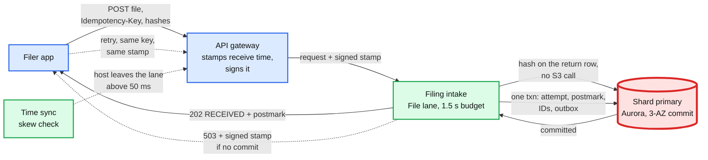
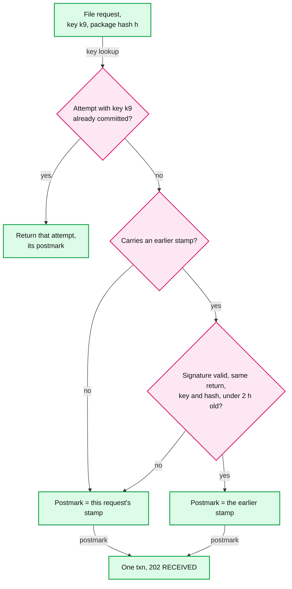

# Deep dive: the electronic postmark and the accept path at 50x

> One-line answer: the return is on time when **our host** receives it before the filer's local midnight, so the API gateway stamps the receive time and one 3-AZ transaction makes it durable together with the pre-minted submission IDs; the thing on this path that breaks first is a shard primary failing over in the last 30 seconds before a time zone's midnight (~1,300 to ~1,900 filers on one shard), and the design's defence is a **signed receipt token** returned with a `503` and replayed by the app on retry, so the postmark survives even when the commit has to wait. The first draft used a second commit target (an S3 intake journal); this note shows why it was cut.

Zoom-in on [`../solution.md`](../solution.md) §1 (fact 1), §4.1, §5.1 and §5.2. Reusable blocks: [`../../../concepts/leases-fencing-clocks.md`](../../../concepts/leases-fencing-clocks.md) (clocks), [`../../../concepts/rate-limiting-and-load-shedding.md`](../../../concepts/rate-limiting-and-load-shedding.md) (shed order), [`../../../concepts/replication-and-quorums.md`](../../../concepts/replication-and-quorums.md) (what "durable" means). Siblings: [`exactly-once-submission.md`](exactly-once-submission.md), [`irs-outage-and-backpressure.md`](irs-outage-and-backpressure.md).

Acronyms: MeF (Modernized e-File, the IRS e-file system), AZ (availability zone), UTC (Coordinated Universal Time), SLO (service level objective), RPO (recovery point objective), NTP (Network Time Protocol), CRR (S3 Cross-Region Replication), IANA (Internet Assigned Numbers Authority, keeper of the time zone database), KMS (key management service), SSN (Social Security number), API (application programming interface), ET (US Eastern Time).

---

## 1. What the IRS says a postmark is

| Rule | Exact words | Source |
|---|---|---|
| Definition | "the date and time the Transmitter first receives the electronic return on its host computer in the Transmitter's time zone. The taxpayer adjusts the time to their time zone to determine timeliness" | Pub 1345, glossary |
| Effect | "If the electronic postmark is on or before the prescribed deadline for filing, but the IRS receives the return after the prescribed deadline for filing, the IRS treats the return as timely filed" | Pub 1345, Electronic Postmark |
| The condition people miss | "will be treated as filed on the electronic postmark date **if received within two (2) days** of the electronic postmark" | Pub 4164 §1.5.3 |
| Transmitter duty | "Transmits all tax returns ... that received an electronic postmark to the IRS within two days of receipt" | Pub 1345 |
| Format | "date and time, GMT time format, (in the Transmitter's time zone)" | Pub 4164 §1.5.3 |
| When we must show it | "no later than when the acknowledgment is made available to the taxpayer in a format that precludes alteration" | Pub 1345 |
| Words we may not use | "certified", "registered", "Internal Revenue Service", "IRS" or "Federal" as a definer of the postmark | Pub 1345 |
| Record keeping | "Retains a record of each electronic postmark until the end of the calendar year and provides the record to the IRS upon request" | Pub 1345 |

Three consequences for the design:
- **The click and the IRS send are separate clocks.** Seconds for "received", two days for the IRS (solution §1).
- **The two days protect the filer, not only us.** Pub 4164 §1.5.3 makes IRS receipt within two days a condition of the timely treatment. That is why solution §5.4's 30-minute row reads "missed: filers late": a 3-day backlog is not a transmitter compliance problem, it is late returns. The drain floor is `3 M / 172,800 s = ~17/s` averaged over two days.
- **"First receives" is a fact we must be able to prove later**, a year later, to the IRS. That is why the stamp is signed and kept with the host ID that made it.

## 2. The commit point



- **The stamp comes first, the commit second.** The gateway stamps the receive time before any of our code runs, so queueing inside intake never makes a filer later.
- **The commit is the claim.** "Received" means the attempt, the postmark and both submission IDs are in one row set on 4 of 6 storage copies across 3 AZs (Aurora's quorum). No 202 before that.
- **Red is the shard primary, locally.** For the whole system the red node is the MeF send pool (solution §6). On the accept path, the only thing that can change a filer's legal outcome is a commit that cannot happen in the last seconds before midnight.

## 3. The deadline wave, as a rate

The README's ~500 submissions/s is an assumption about shape. The model in §8 asks what shape produces it: half the day's 3 M submissions spread over local 6 AM to midnight, half in an exponential ramp into midnight. A ~500/s peak needs a ramp time constant of **~26 minutes**.

| Zone | Local midnight (UTC, April 16) | Its own clicks/s in the last second | One shard's share |
|---|---|---|---|
| Eastern | 04:00 | 259 | ~65 |
| Central | 05:00 | 160 | ~40 |
| Mountain | 06:00 | 39 | ~10 |
| Pacific | 07:00 | 88 | ~22 |
| Alaska | 08:00 | 2 | under 1 |
| Hawaii | 10:00 | 3 | under 1 |

- The peak is Eastern, at 04:00 UTC, and it matches solution §2's ~280 clicks/s.
- The waves do not overlap much: Central's ramp is ~10% of its peak one hour before its own midnight.
- Filers abroad add a thin tail at other hours. `filer_tz` is any IANA zone from the residence address, never one of 6 hard-coded offsets.

## 4. When the commit fails: three designs we weighed

| Design | What the filer gets | Late filers, 30 s failover at 11:59:40 PM ET | What it costs |
|---|---|---|---|
| Nothing special | An error; the app retries after the failover with a **new** receive time | ~1,300 (one shard) | Nothing, until the bad night |
| First draft: S3 intake journal (rejected) | `202` from a second commit target, adopted into the DB later | 0 | A second store, an adopter, cross-region adoption, claim pauses, dedup by earliest postmark, weekly game days |
| **Signed receipt token (the design)** | `503` with the gateway's signed stamp; the app retries; the stamp becomes the postmark | 0 (if the retry lands within 2 h) | One signed header, one check in intake |

The worst start time is 30 s before midnight: **~1,900 filers** on one shard. The first draft said ~8,400 by applying the national 280 clicks/s to one shard of four; solution §2, §5.2 and §10.4 now use ~1,300 and ~1,900.

## 5. Why the first draft's journal was cut

- **It needs a second source of attempts.** Intake times out at 300 ms and writes the journal while the DB commit may still land. The adopter then inserts if absent by `attempt_id`. Fine so far.
- **The client retries anyway.** If the 202 from the journal is lost and the app retries after the DB is back, intake (which cannot see the unadopted journal record) creates a second attempt with new IDs. Now the adopter must merge two attempts for one return, and "keep the earlier postmark" can keep **older content** if the filer edited the return between the clicks.
- **The claim pause cannot work under a partition.** The draft paused claims on a shard "while any journal (either region) holds unadopted records for it". Region A cannot list region B's bucket during a cross-region partition, and S3 replication between regions is asynchronous [CRR timing: unverified]. So region A either halts sending for every shard or sends attempts the journal may later contradict: two submission IDs for one SSN at the IRS, the second rejected as a duplicate return.
- **It guards a tiny expected loss.** The model in §8: at 0.5 to 2 unplanned failovers per cluster-year [estimate], **0.005 to 0.02 late filers per season** with no protection at all, and a probability of any late filer of 1 in 20,000 to 1 in 100,000 per season. The tail (~1,900 on one cursed night) is real, but it does not need a second commit target.
- **It rots.** The draft already needed weekly game days because the path runs only in failures. Every such path is a place where exactly-once can break.

**Push back on the textbook answer.** "Write-ahead to a second durable store so you can always say yes." The legal requirement is not "always say yes in 2 s". It is "the postmark is the moment the return reached us". The app already holds the request; let it also hold a signed proof of when we got it. **The client is the second copy.**

## 6. The signed receipt token



- **What is signed:** `{return_id, idempotency_key, package_sha256, receive_utc, gateway_host}` with a key only the gateway holds (KMS-backed). Intake records which path set the postmark in `FILING_ATTEMPT.postmark_source` (`STAMP` or `TOKEN`).
- **Where the app keeps it:** in local storage with the idempotency key, until it sees `202`. A reopened page within 2 h on the same device recovers it.
- **Why 2 h:** long enough for a regional failover and an app restart; far inside the 2-day transmit condition, which starts at the stamp.
- **What the filer sees:** "We have your filing time, 11:59:57 PM. Finishing up, do not close this page." Then the normal `RECEIVED`.
- **Why the SLO is split:** "99.99% of File clicks are postmarked at their first click" (the legal outcome) and "99.9% get 202 within 2 s" (the experience). One peak failover costs the second, never the first. A single "99.99% answered 202 within 2 s" target has a season budget of ~4,500 failures (0.01% of ~45 M clicks), and one ~30 s failover at 65 clicks/s per shard spends ~1,950 of it in 30 seconds. A target that one routine failover nearly breaks measures the wrong thing.
- **Region loss:** File waits for the replica promotion (minutes [estimate]); tokens keep every postmark taken during it. The interview writes packages to both regions before enabling the File button, so region B's intake can verify hashes.
- **When the token is lost** (a closed page past 2 h, or a different device), the retry commits with its own, later stamp. The app keeps the idempotency key and token in local storage until it sees `202`, which covers a reopened page within 2 h. Past that, the gateway's signed stamp log is a support-only remedy: e-file operations can attach the logged stamp as the postmark through a ticket (`postmark_source = LOG`, the log line copied to evidence). The design refuses an automatic hold and log lookup on the claim path: it would be a second source of postmarks that runs only in a double failure (a failover in the last 30 s plus a lost token).

## 7. Peak intake: pre-scale, lane, shed

- **Pre-scale on the calendar.** The deadline is known a year ahead. File runs at the 1,000/s design point from April 1, proven by a March load test, with a freeze until April 20 (solution §5.1). The p99 budget for one click is ~250 ms.
- **No S3 on the click.** The interview's successful package PUT writes the hash onto the return row; the click checks the row inside its own transaction. The first draft had two S3 HEADs on the click (150 ms at p99); a slow S3 at 11:59 PM would have made filers late.
- **Leased ID blocks.** 10,000 sequence values per pod lease, ~8 minutes at peak. The prefix carries an epoch bumped on every promotion, because a promoted replica that lost the last lease writes could otherwise hand the same block out twice.
- **The File lane.** Own pods, own connection pool, `statement_timeout` 250 ms. Shed in order: recommendations, PDF copies, status refresh rate. Never shed File, resubmit or postmark lookups.
- **Clocks.** Hosts use the cloud's time sync; the lane's health check removes a host above 50 ms skew. A fast clock makes on-time clicks late; a slow one makes late clicks look timely, which is a compliance problem of its own.
- **Abuse limits are per account, never global.** 5 attempts a minute per account, plus Pub 1345's rule that an Online Filing transmitter not accept "more than five electronic returns originating from one software package or from one e-mail address".
- **IP information at the click.** Pub 1345: "The IRS will reject individual income tax returns e-filed without the required IP address." The gateway captures the public address, date, time and zone at the click; the packager writes them in at send time.

## 8. Runnable model

How many filers does one shard failover make late, and how likely is it? Standard library only, deterministic.

```python
import math
H = 3600
# zone: (UTC hour of local midnight on April 16, population share [estimate])
ZONES = {"ET": (4, .47), "CT": (5, .29), "MT": (6, .07), "PT": (7, .16), "AK": (8, .004), "HI": (10, .005)}
DAY, F_RAMP, PER_CLICK, SHARDS = 3_000_000, 0.5, 1.78, 4   # submissions/day, ramp share, subs per click

def zone_rate(z, t, tau):  # submissions/s from one zone, t = s after 00:00 UTC April 16
    mid, share = ZONES[z]; d = mid * H - t
    r = share * DAY * (1 - F_RAMP) / (18 * H) if 0 < d <= 18 * H else 0.0
    return r + (share * DAY * F_RAMP / tau * math.exp(-d / tau) if d > 0 else 0.0)

def peak(tau): return max(sum(zone_rate(z, t, tau) for z in ZONES) for t in range(0, 11 * H, 5))

lo, hi = 300.0, 7200.0                                     # solve tau so the peak minute is ~500/s
for _ in range(40):
    mid_tau = (lo + hi) / 2
    lo, hi = (mid_tau, hi) if peak(mid_tau) > 500 else (lo, mid_tau)
TAU = lo
print(f"ramp time constant for a 500/s peak: {TAU / 60:.1f} min")
for z, (mid, _) in ZONES.items():
    clicks = zone_rate(z, mid * H - 1, TAU) / PER_CLICK
    print(f"  {z}: local midnight {mid:02d}:00 UTC, its own clicks/s in the last second {clicks:6.1f}")

def late_filers(t_fail, down=30, backoff=2, policy="naive"):
    """One shard (1/4 of clicks) cannot commit for `down` s. Naive: the retry gets a new receive time."""
    late = 0.0
    for z, (mid, _) in ZONES.items():
        retry_at = t_fail + down + backoff
        for s in range(int(t_fail), int(t_fail + down)):
            clicks = zone_rate(z, s, TAU) / PER_CLICK / SHARDS
            if policy == "naive" and s < mid * H <= retry_at: late += clicks
    return late

t = 4 * H - 20                                              # 11:59:40 PM Eastern
for policy in ("naive", "token"):
    print(f"failover at 11:59:40 PM ET, policy {policy:5}: late filers {late_filers(t, policy=policy):7.0f}")
worst = max((late_filers(s), s) for s in range(4 * H - 60, 4 * H, 1))
print(f"worst start {(worst[1] - 4 * H)} s before ET midnight: {worst[0]:.0f} late filers")
exposure = sum(late_filers(s) for s in range(-2 * H, 11 * H, 1))   # filer-seconds over the evening
for per_year in (0.5, 2.0):                                   # unplanned failovers per cluster-year
    lam = SHARDS * per_year / (365 * 86400)
    print(f"{per_year} failovers per cluster-year: expected late filers per season {lam * exposure:.4f}, "
          f"P(any late) {1 - math.exp(-lam * sum(1 for s in range(-2 * H, 11 * H) if late_filers(s) > 0.5)):.5f}")
```

Output:

```
ramp time constant for a 500/s peak: 26.1 min
  ET: local midnight 04:00 UTC, its own clicks/s in the last second  258.6
  CT: local midnight 05:00 UTC, its own clicks/s in the last second  159.5
  MT: local midnight 06:00 UTC, its own clicks/s in the last second   38.5
  PT: local midnight 07:00 UTC, its own clicks/s in the last second   88.0
  AK: local midnight 08:00 UTC, its own clicks/s in the last second    2.2
  HI: local midnight 10:00 UTC, its own clicks/s in the last second    2.8
failover at 11:59:40 PM ET, policy naive: late filers    1285
failover at 11:59:40 PM ET, policy token: late filers       0
worst start -30 s before ET midnight: 1922 late filers
0.5 failovers per cluster-year: expected late filers per season 0.0045, P(any late) 0.00001
2.0 failovers per cluster-year: expected late filers per season 0.0182, P(any late) 0.00005
```

Reading it: the danger window is ~30 seconds per zone per season, so the expected loss is tiny and the worst case is ~1,900. That is the shape of risk a cheap token handles and a second store over-handles. The model ignores correlated failures. Four writers cannot be one per AZ in 3 AZs, so the design keeps at most 2 in any AZ ([`../diagrams.md`](../diagrams.md) D9): an AZ loss blocks at most half the clicks for ~30 s, 2x the worst case above, all covered by tokens. (An early draft put all four in one AZ: 4x.)

## 9. What an interviewer pushes on

1. **"Is the gateway's time really 'received at the host computer'?"** The return is on our host when the File request reaches our edge with a signed package hash we already store. The stamp is signed, logged with the host ID, and kept to the end of the year as Pub 1345 requires. Ask legal to sign the definition before the season.
2. **"Why not stamp at the DB commit?"** Queueing inside our services would then move filers past midnight. The receive time is the honest moment, and the commit is bounded.
3. **"What if the commit fails after you stamped?"** The filer gets the stamp back, signed. The retry turns it into the postmark (§6). Without that, a retry after midnight is a late return.
4. **"Your DB fails over at 11:59 PM."** One shard, ~1,300 clicks, ~30 s. With tokens: all keep their postmarks, they wait ~30 s for `RECEIVED`.
5. **"Why not journal the click to S3 when the database is slow?"** That was the first draft. It adds a second source of attempts, a partition hazard and a path that only runs on bad nights, to protect ~0.01 filers per season in expectation. The token gets the same outcome.
6. **"The filer closes the page and comes back at 3 AM."** The token is gone after 2 h. The gateway's signed stamp log is a support-only remedy through a ticket (§6); there is no automatic lookup, because it would be a path that only runs on bad nights.
7. **"Why not rate-limit File?"** A 429 at 11:59 PM is a late return. Shed reads; limit only distinct returns per account (Pub 1345's five) and attempts per minute per account.
8. **"What about a filer in Tokyo?"** Postmark adjusted to their residence zone; their midnight is ~10 hours before Eastern's.

## 10. Trade-offs

| Decision | Option A | Option B | Chose | Why |
|---|---|---|---|---|
| Where the postmark comes from | DB commit time | Gateway receive time, signed | Receive time | It is the moment the return reached us; commit time includes our own queueing |
| Fallback when the commit is late | Second commit target (S3 journal) | Signed token replayed by the client | Token | Same postmark outcome, no second source of attempts, no adoption, no partition hazard |
| Accept-path SLO | 202 in 2 s for 99.99% | Postmark at first click for 99.99%, 202 in 2 s for 99.9% | Split | The legal outcome is what must never fail; latency can degrade for 30 s |
| Package check at the click | S3 HEAD | Hash on the return row | Row | One less dependency on the click |
| Writer placement | All shards in one AZ (early draft) | At most 2 of 4 writers per AZ | Spread | An AZ loss hits at most half the clicks, not all |
| What we refused | A synchronous IRS send on the click; global File limits; a journal with cross-region adoption | | | Each turns a rare event into a permanent complexity |

## 11. Numbers to say out loud

- Postmark = our receive time in the filer's zone; IRS must receive it within 2 days; floor drain ~17/s.
- Peak ~500 submissions/s, ~280 clicks/s, Eastern at 04:00 UTC; implies a ~26-minute ramp.
- One shard failover in the last 30 s: ~1,300 to ~1,900 filers wait ~30 s; none is late with the token.
- Expected late filers per season with no protection: ~0.005 to 0.02. Token cost: one signed header.
- File budget 1.5 s; commit p99 80 ms; token valid 2 h; skew out of the lane above 50 ms.
