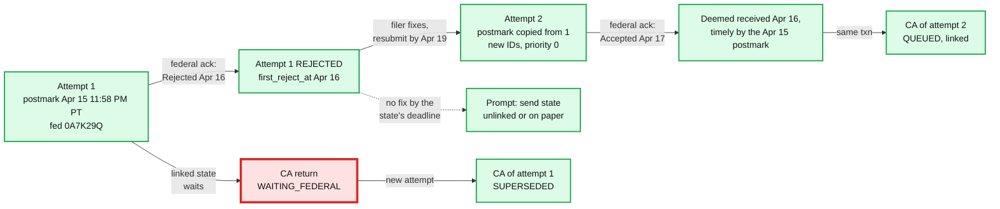
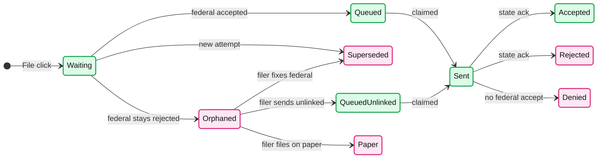

# Deep dive: rejects, the perfection period, and linked state returns

> One-line answer: a rejected return stays on time if the corrected one is **accepted** by the fifth calendar day after the due date, so a correction is a new attempt with new submission IDs that inherits the first attempt's postmark through `parent_attempt_id`, goes out at priority 0, and is checked against dates read from a per-season `SEASON_RULES` table with a `transmit_by` stored on each correction (not a hard-coded April 20, because in years like 2023 the due date moves to April 18 and the "22nd of the month" transmit rule collides with the window); linked state returns wait in `WAITING_FEDERAL`, are released in the federal accept's transaction, and get a timer that moves them to `Orphaned` with a "send unlinked or on paper" prompt if the federal return is never fixed.

Zoom-in on [`../solution.md`](../solution.md) §4.2 (federal before state), §4.4 and §10.11. Reusable blocks: [`../../../concepts/exactly-once.md`](../../../concepts/exactly-once.md) (the state release is a conditional update), [`../../../concepts/temporal-durable-execution.md`](../../../concepts/temporal-durable-execution.md) (timers for the slow path). Siblings: [`ack-reconciliation.md`](ack-reconciliation.md), [`postmark-and-peak-intake.md`](postmark-and-peak-intake.md).

Acronyms: MeF (Modernized e-File), ERO (Electronic Return Originator, a preparer who files for clients), SSN (Social Security number), UTC (Coordinated Universal Time), UI (user interface), XML (Extensible Markup Language).

---

## 1. The rules, word for word, and where they disagree

| Rule | Exact words | Source |
|---|---|---|
| Perfection period, individual | "When a rejected return is submitted on or before the due date of the return and a corrected return is 'Accepted' by the IRS by the fifth calendar day after the due date of the return, it will be deemed to have been received on the date of the first reject" | Pub 4164 §1.5.2 |
| The date list | "April 20, 2026 - Last day for retransmitting rejected timely filed Form 1040 family returns" | Pub 4164 §1.5.2 |
| The ERO wording | timely "if the taxpayer corrects the electronic portion of the return and resubmits the return by the fifth calendar day after the due date" | Pub 1345, resubmission of rejected returns |
| Keeping the postmark | the transmitter "retains the original electronic postmark of the rejected return for a corrected return that the Transmitter received through the last date for retransmitting rejected returns" | Pub 1345, Electronic Postmark |
| Sending it | corrected returns keeping a postmark "must be transmitted to the IRS within two days of the date the return was received by the Transmitter or the twenty second day of the respective month of the prescribed due date, whichever is earlier" | Pub 1345 |
| Paper fallback | timely if filed "by the later of the due date of the return or 10 calendar days after the date the IRS gives notification that it has rejected" it | Pub 1345 |
| Three strikes | contact the IRS "if the electronic portion of the return has been rejected after three transmission attempts" | Pub 1345 |
| Other windows | business returns 10 days; Forms 4868, 7004, 8868 five days | Pub 4164 §1.5.2 |
| Imperfect returns | after a reject for R0000-504-02 or SEIC-F1040-501-02, a resubmission with `ImperfectReturnInd` is processed with status `Exception`: "DO NOT RESUBMIT THE TAX RETURN or FILE ON PAPER" | Pub 4164 Table 5-6 |

- **Three different verbs:** accepted by (Pub 4164), resubmits by (Pub 1345, ERO section), retransmitting by (Pub 4164's date list). Design to the strictest: **accepted by the end of the fifth day**.
- **In whose time zone?** The IRS's acceptance date is on the IRS's clock [unverified which zone]. A Pacific filer resubmitting at 11 PM on April 20 is at 2 AM Eastern on April 21. So the design closes resubmission at the **earlier** of the filer's and Eastern midnight on the last retransmit day, sends corrections within minutes, and asks filers to finish a day early (solution §4.4). An early draft used "April 20 in Maya's zone".

## 2. Lineage and release



- **A correction is a new attempt.** The rejected ID is dead (MeF's T0000-014 makes every submission ID single-use). `parent_attempt_id` links it; `postmark_utc` is copied from the root of the chain; `own_receipt_utc` keeps the truth; `TAX_RETURN.first_reject_at` is the date the IRS will treat as the filing date.
- **Corrections go first.** Priority 0, and the transmit-by time below is stored on the row.
- **Every reject counts toward three.** The third rejected attempt routes the case to a human and the IRS e-Help Desk, as Pub 1345 asks.
- **Notice content is fixed by Pub 1345:** rejected, the date, the business rule definitions, the steps to fix, and the paper option with its 10-day rule.

## 3. The dates are data, not constants

An early draft hard-coded April 20; the design reads every date from `SEASON_RULES` (solution §3.3, §4.4; [`../diagrams.md`](../diagrams.md) D6c). The due date is April 15 moved past weekends and the District of Columbia's Emancipation Day (April 16, observed on the nearest weekday). The IRS confirmed April 18 for 2023 ("because of the weekend and the District of Columbia's Emancipation Day holiday"); the same rule gives April 18 in 2022 and 2028 and April 17 in 2029.

| Year | Due date | Last retransmit day | A correction received at 11 PM on that day must go by |
|---|---|---|---|
| 2023 | Tue Apr 18 | Sun Apr 23 | Sat Apr 22 23:59: already past |
| 2026 | Wed Apr 15 | Mon Apr 20 | Wed Apr 22 23:00 |
| 2028 | Tue Apr 18 | Sun Apr 23 | Sat Apr 22 23:59: already past |
| 2029 | Tue Apr 17 | Sun Apr 22 | Sun Apr 22 23:59: same day |

- **In 2026 the 22nd never binds.** Two days after any receipt through April 20 is at most April 22.
- **When the due date moves, it does.** A correction received on April 23, 2028 is inside the retransmit window but past the 22nd. Read literally, it cannot both keep its postmark and meet the transmit rule [interpretation: confirm with the IRS each season]. Close the UI window at the 22nd in such years.
- **So the rules are a table** (`SEASON_RULES` in the design). One row per form family and season: due date, last retransmit day, transmit-by rule, perfection days (5 individual, 10 business), and the paper rule. Each correction stores `transmit_by = min(receipt + 2 days, end of the 22nd)`; the sweeper pages when one is under 6 hours away. Business returns (10-day window, March 15 due dates) are new rows, not new code (solution §10.11).

## 4. Linked state returns

- **Why the state waits.** "On linked returns, the federal return must be accepted before the linked state return can be filed" (Pub 1345). If MeF finds no accepted federal under the linked ID, "the IRS will reject the State submission", status `DENIED BY IRS`, and "the state has no knowledge" of it (Pub 4164 §3.2).
- **Release in the ack's transaction.** `UPDATE ... SET state = 'QUEUED' WHERE attempt_id = :a AND state = 'WAITING_FEDERAL'`. A second apply of the same ack matches zero rows; a concurrent "send unlinked" click matches zero rows if the release won.
- **The cost of waiting is small.** Federal acks take minutes (2 h at peak); state acks take 12 to 24 h anyway (Pub 4164 §14.2.3). The state's postmark was set at the click.
- **When the state may go alone.** Pub 1345 accepts state-only returns that were previously rejected by the state, originated separately, part-year, non-resident, or married filing separately when the federal was joint. Unlinked returns get only minimal MeF validation and no check against the federal SSN match.
- **A state rejected after a federal accept** gets a state-only attempt linked to the already-accepted federal ID, `QUEUED` at once.

## 5. The orphaned state



- **Why it is needed.** California stays `WAITING_FEDERAL` after the federal reject and is superseded when a correction arrives. If no correction ever arrives, the state return is never sent, and the filer may believe it was. No ack check ever sees a submission that was never sent. An early draft had no answer for this.
- **The design** (solution §4.4, §5.6, D8b). A timer per waiting state, on `next_action_at`: after the federal reject, remind at +2 days; on the day before the last retransmit day, move the state to `Orphaned` and prompt the filer to send it unlinked (if the state accepts that case) or on paper. The sweeper's completeness check gains a term: `WAITING_FEDERAL` rows past their timer must be zero or owned by a human. The state's own deadline can differ from the federal one [unverified per state]; the timer should take the earlier. A durable timer is a good fit for this slow path ([`../../../concepts/temporal-durable-execution.md`](../../../concepts/temporal-durable-execution.md)); the send path stays in the database.
- **Attempt status is derived.** An attempt with an accepted federal and a rejected state is neither open nor closed, so the design derives an attempt's status from its submissions and enforces one open submission per `(return, kind)`. A state-only attempt can then open while the federal stays accepted. (An early draft stored one `state` per attempt with one `OPEN` attempt per return, which blocked exactly this.)

## 6. What we keep to prove the filer was on time

The README's probe: "Rejected at 1 AM on April 16 for a mistyped dependent SSN. What do you store to prove it?"

| Record | Where | Why |
|---|---|---|
| Root attempt: `postmark_utc`, `postmark_source` (stamp or token), `filer_tz`, gateway host, signed stamp, filer IP information | DB row plus an Object Lock copy | The postmark Pub 1345 says we must keep to the end of the year and give the IRS on request |
| The rejected submission's ack XML (rule R0000-504-02, ack date) | Ack archive, Object Lock | Proves the first reject date, which becomes the filing date |
| Correction attempt: `parent_attempt_id`, `own_receipt_utc`, new submission IDs, `transmit_by`, actual send time | DB row plus evidence copy | Proves the correction was received through the last retransmit day and sent within the 2-day or 22nd rule |
| The accepted ack XML for the correction | Ack archive | Proves "accepted by the fifth calendar day" |
| What we told the filer and when | Notification log | Pub 1345's reject notice contents and the two-workday notification duty |

One query by `return_id` rebuilds the chain. Retention is 7 years [estimate of Intuit policy], longer than Pub 1345's end-of-year minimum.

## 7. Runnable model

Part 1 computes the dates from the rules. Part 2 asks whether notification speed matters for "accepted by the fifth day", with filer fix times drawn from a lognormal (median ~20 h [model]). Standard library only, seeded.

```python
import random
from datetime import date, datetime, timedelta
random.seed(5)

def emancipation_observed(year):           # DC holiday April 16, shifted off weekends
    d = date(year, 4, 16)
    return d - timedelta(days=1) if d.weekday() == 5 else d + timedelta(days=1) if d.weekday() == 6 else d

def due_date(year):                        # April 15, moved past weekends and the DC holiday
    d = date(year, 4, 15)
    while d.weekday() >= 5 or d == emancipation_observed(year): d += timedelta(days=1)
    return d

def transmit_by(received, due):            # Pub 1345: 2 days after receipt or the 22nd, earlier wins
    return min(received + timedelta(days=2), datetime(due.year, due.month, 22, 23, 59))

print("year  due date    last retransmit  correction received on the last day must go by")
for year in (2022, 2023, 2026, 2027, 2028, 2029):
    due = due_date(year)
    last = due + timedelta(days=5)          # Pub 4164 1.5.2: fifth calendar day after the due date
    recv = datetime(last.year, last.month, last.day, 23, 0)
    by = transmit_by(recv, due)
    flag = "IMPOSSIBLE, already past" if by < recv else ("same day" if by.date() == recv.date() else "")
    print(f"{year}  {due:%a %b %d}  {last:%a %b %d}       {by:%a %b %d %H:%M}  {flag}")

# Rejected at 1 AM April 16, 2026. Does notification delay matter for "accepted by April 20"?
cutoff = datetime(2026, 4, 20, 23, 59)
reject = datetime(2026, 4, 16, 1, 4)
fix_hours = [random.lognormvariate(3.0, 1.1) for _ in range(100_000)]   # filer fix time [model]
for notify_min in (2, 30, 120, 24 * 60):
    ok = 0
    for f in fix_hours:
        resubmit = reject + timedelta(minutes=notify_min, hours=f)
        accepted = resubmit + timedelta(minutes=random.choice((2, 5, 20)))  # send + ack, post-peak
        ok += accepted <= cutoff
    print(f"notify after {notify_min:5} min: {ok / len(fix_hours):6.2%} accepted by Apr 20 23:59")
print(f"median fix time {sorted(fix_hours)[50_000]:.0f} h, share fixing after Apr 19 noon "
      f"{sum(reject + timedelta(hours=f) > datetime(2026, 4, 19, 12) for f in fix_hours) / 1e5:.1%}")
```

Output:

```
year  due date    last retransmit  correction received on the last day must go by
2022  Mon Apr 18  Sat Apr 23       Fri Apr 22 23:59  IMPOSSIBLE, already past
2023  Tue Apr 18  Sun Apr 23       Sat Apr 22 23:59  IMPOSSIBLE, already past
2026  Wed Apr 15  Mon Apr 20       Wed Apr 22 23:00  
2027  Thu Apr 15  Tue Apr 20       Thu Apr 22 23:00  
2028  Tue Apr 18  Sun Apr 23       Sat Apr 22 23:59  IMPOSSIBLE, already past
2029  Tue Apr 17  Sun Apr 22       Sun Apr 22 23:59  same day
notify after     2 min: 94.81% accepted by Apr 20 23:59
notify after    30 min: 94.77% accepted by Apr 20 23:59
notify after   120 min: 94.64% accepted by Apr 20 23:59
notify after  1440 min: 92.21% accepted by Apr 20 23:59
median fix time 20 h, share fixing after Apr 19 noon 9.7%
```

Reading it: the date rules break in three of six years, so they must be computed. Notification speed barely matters for the legal outcome until it reaches a day: the ~5% who miss April 20 are slow fixers, and ~10% fix after noon on April 19, which is where reminders (and a clear cutoff in the UI) pay off. Only 2023's due date was checked against an IRS page; the others follow the rule.

## 8. What an interviewer pushes on

1. **"Rejected at 1 AM on April 16. Is she late?"** No, if the corrected return is accepted by April 20: it is deemed received on April 16 under her April 15 postmark. Our records: the root attempt's postmark, the reject date, the correction's own receipt time.
2. **"Can you resend under the rejected ID?"** No. Every ID is single-use at MeF (T0000-014). A correction is a new attempt with new IDs.
3. **"What is the postmark of a correction on April 19? On April 21?"** April 19: the original. April 21: its own receipt time, and the UI said so before the click.
4. **"The state needs the federal first. Model it."** `WAITING_FEDERAL`, released in the federal accept's transaction, unlinked as the escape hatch for the five cases Pub 1345 allows.
5. **"The federal is rejected and the filer disappears. What happens to the state?"** Without a timer, nothing: it is never sent. With one, the filer is asked to send it unlinked or on paper before the state's deadline.
6. **"The due date moves to April 18. What changes?"** One row in the rules table. And in that year the 22nd closes the correction window before the perfection period does.
7. **"Three rejects in a row?"** The third routes to a human and the IRS e-Help Desk; the paper option stays open for 10 days after the reject notice.

## 9. Trade-offs

| Decision | Option A | Option B | Chose | Why |
|---|---|---|---|---|
| Correction identity | Reuse the rejected ID | New attempt, new IDs, lineage | Lineage | IDs are single-use at MeF; lineage carries the postmark |
| Window cutoff | April 20 in the filer's zone (early draft) | Earlier of the filer's and Eastern midnight on the last retransmit day | Earlier | The strictest reading of "accepted by" |
| Dates | Constants | Per-season rules table | Table | The due date moves; the 22nd collides with the window in some years |
| State timing | Send with the federal | Hold until the federal accept | Hold | Denied otherwise; waiting costs minutes against a 12 to 24 h state ack |
| Abandoned federal | Do nothing | Timer, then prompt unlinked or paper | Timer | Otherwise the state return is silently never filed |
| Attempt status | One stored value | Derived from its submissions | Derived | Mixed outcomes (federal accepted, state rejected) are normal |
| What we refused | Automatic unlinked sends; a model that edits returns; resubmitting on the filer's behalf without their action | | | Each changes a filing without the filer |

## 10. Numbers to say out loud

- Perfection period: accepted by the 5th calendar day after the due date (April 20, 2026); business 10 days; Form 4868 5 days.
- Corrections keeping a postmark: transmit within 2 days of receipt or by the 22nd, whichever is earlier.
- Due date moves to April 18 in 2023 (IRS), 2022 and 2028 (by the rule): the 22nd then binds.
- Paper fallback: later of the due date or 10 days after the reject notice. Third reject: e-Help Desk.
- Notifying 2 min vs 30 min after a reject: 94.81% vs 94.77% accepted by April 20 in the model.
