# Diagrams: TurboTax e-file at the April 15 peak

> One-line answer: twelve views of one design. The File click is one durable write (postmark plus pre-minted submission IDs) answered in under 2 s, and a gateway-signed receipt token keeps the postmark if that write has to be retried; a transmitter drains the filing DB to IRS MeF in messages of 100 under leases; an ack reconciler pulls acks by submission ID and releases linked state returns; a sweeper proves every submission got an answer. The MeF send pool (sessions x 100 / MeF latency) is the one red box.

The D1 to D12 set from `hld/CLAUDE.md` §4, each with a one-line caption. A diagram already in [`solution.md`](solution.md) gets a heading, a caption and a link, never a second copy. Acronyms: MeF (Modernized e-File, the IRS e-file system), A2A (application-to-application, MeF's SOAP channel), ASID (Application System ID, one enrolled client system with 5 sessions), ETIN (Electronic Transmitter Identification Number), EFIN (Electronic Filing Identification Number), SAML (Security Assertion Markup Language), AZ (availability zone), KMS (key management service), ATS (Assurance Testing System, the IRS's pre-season test environment), SSN (Social Security number).

| # | Diagram | Where it lives |
|---|---|---|
| D1 | Context | below |
| D2 | Data flow | below |
| D3 | Component architecture (final design) | [solution §6](solution.md#6-final-design-and-the-six-core-flows) |
| D4 | Happy path per FR | FR1 File, FR2 Transmit, FR3 Acknowledge, FR4 Fix and resubmit: the sequence diagrams in [solution §4.1 to §4.4](solution.md#4-high-level-design). The linked state return end to end: below |
| D5 | Failure paths | Send timeout: [solution §5.3](solution.md#53-never-two-irs-submissions-for-one-attempt-even-when-a-send-times-out). DB failover at 11:59 PM: [solution §5.2](solution.md#52-zero-lost-returns-and-still-a-postmark-when-the-database-fails-over-at-1159-pm). MeF down 2 h: [solution §10.4](solution.md#104-failure-timeline). Dead transmit worker, poisoned message, double tap: below |
| D6 | Decision flows | Send limiter and breaker: [solution §5.5](solution.md#55-mef-is-down-for-two-hours-on-april-15-what-do-filers-see-and-what-happens-when-it-comes-back). Sweeper: [solution §5.6](solution.md#56-how-do-you-know-every-one-of-3-m-deadline-day-submissions-got-an-answer). What the File click blocks: below |
| D7 | Entity relationship | [solution §3.3](solution.md#33-data-model) |
| D8 | State machines | Submission: [solution §5.3](solution.md#53-never-two-irs-submissions-for-one-attempt-even-when-a-send-times-out). Filer-visible status and MeF session: below |
| D9 | Deployment / topology | below |
| D10 | Scaling / partitioning | below |
| D11 | Failure mode map | below, two trees |
| D12 | Rollout / migration | below |

## D1. Context (zoom-out)

Our system as one box: filers and the tax interview hand it signed returns, the IRS (and through it the states) answers, filers and the refund-status service hear the outcome, and humans take what the machine cannot resolve.

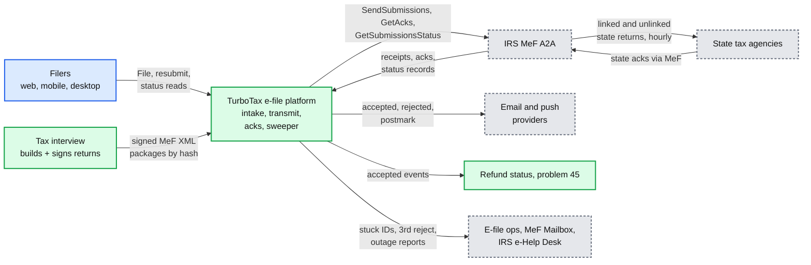

## D2. Data flow (DFD)

Inputs to outputs with the data name, format, size and peak rate on every edge. Stores are cylinders, processes are rounded. Rates are at the ~500 submissions/s peak minute unless marked "design" (1,000/s).

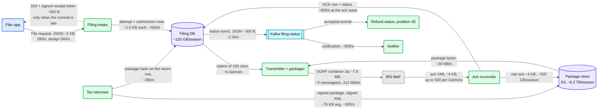

## D3. Component architecture

The final design with the red send pool lives in [solution §6](solution.md#6-final-design-and-the-six-core-flows). It is not repeated here.

## D4. Happy paths, one per FR

FR1 to FR4 are the sequence diagrams in [solution §4.1 to §4.4](solution.md#4-high-level-design). The one path those leave as a note is the linked state return after its release, which takes 12 to 24 h and involves a party we never talk to directly.

### D4 FR2 and FR3 for a state return: release, MeF check, state pickup, state ack

The California return goes out only after the federal accept; MeF checks it against that accept, the state picks it up in an hourly batch, and its ack comes back through MeF.

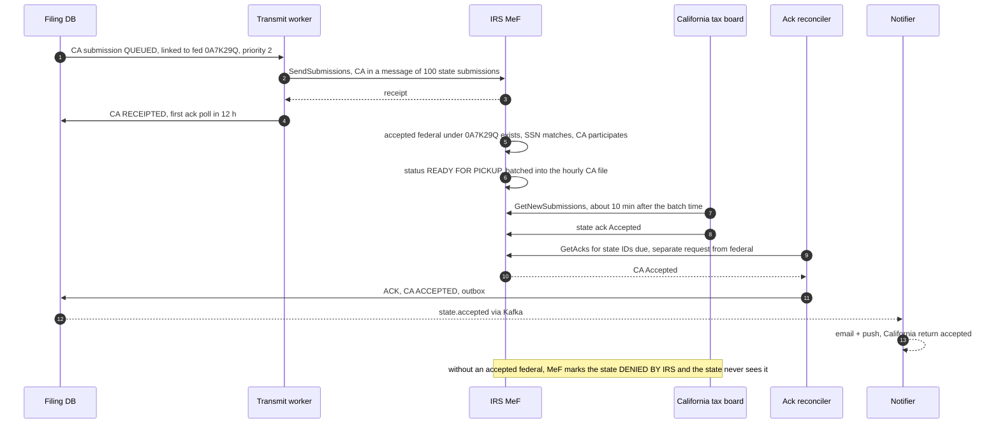

## D5. Failure paths

The send timeout, the 11:59 PM database failover and the two-hour MeF outage are in solution [§5.3](solution.md#53-never-two-irs-submissions-for-one-attempt-even-when-a-send-times-out), [§5.2](solution.md#52-zero-lost-returns-and-still-a-postmark-when-the-database-fails-over-at-1159-pm) and [§10.4](solution.md#104-failure-timeline). Three more below.

### D5a. A transmit worker dies mid-call

The rows it claimed must not go back to `QUEUED`: the call may have landed. Its ASID's sessions must not leak until MeF's nightly reaper.

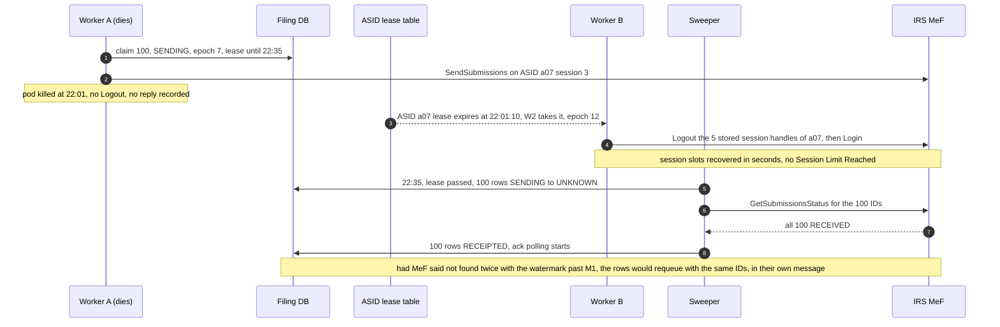

### D5b. One bad package poisons a message

MeF rejects a message as a whole when its envelope or manifest is invalid, and "all submissions must be resubmitted". A deterministic packaging bug would fail again on every resend, so the transmitter bisects.

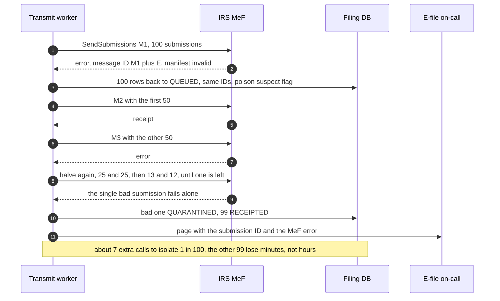

### D5c. The filer double-taps File, then the app retries after a lost reply

Two requests with one key, then a retry after a timeout: one attempt, one postmark, one set of IDs.

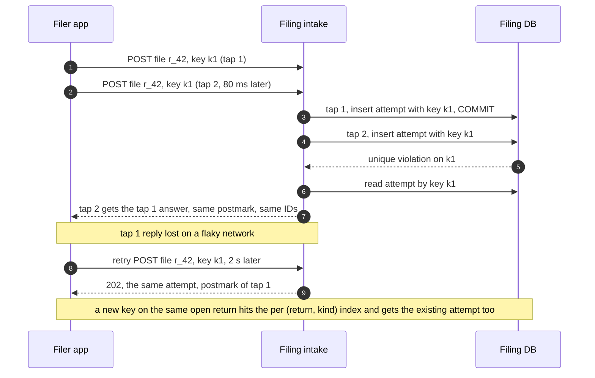

## D6. Activity / decision flows

The send limiter and breaker are D6a in [solution §5.5](solution.md#55-mef-is-down-for-two-hours-on-april-15-what-do-filers-see-and-what-happens-when-it-comes-back); the sweeper is D6b in [solution §5.6](solution.md#56-how-do-you-know-every-one-of-3-m-deadline-day-submissions-got-an-answer).

### D6c. What the File click blocks, and what it leaves to the IRS

At 11:59 PM a local block costs the filer the postmark; an IRS reject does not. So the click only blocks what cannot be sent, and the resubmit path checks the perfection window, whose dates come from the per-season rules table.

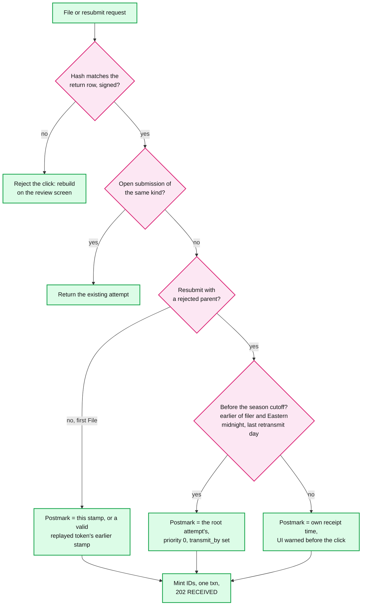

Predicted IRS business-rule failures are shown during the interview, not enforced at the click.

## D7. Entity relationship

The `erDiagram` with keys, the shard key and the access patterns is in [solution §3.3](solution.md#33-data-model).

## D8. State machines

The submission state machine (D8a) is in [solution §5.3](solution.md#53-never-two-irs-submissions-for-one-attempt-even-when-a-send-times-out). Two more lifecycles below.

### D8b. What the filer sees, per return

Internal states collapse into a few filer-facing ones. `SENDING`, `UNKNOWN` and `ESCALATED` all show as Sent. A banner, not a state, covers a slow IRS. A state return behind a federal return that is never fixed gets a timer and a prompt to send it unlinked or on paper (Orphaned).

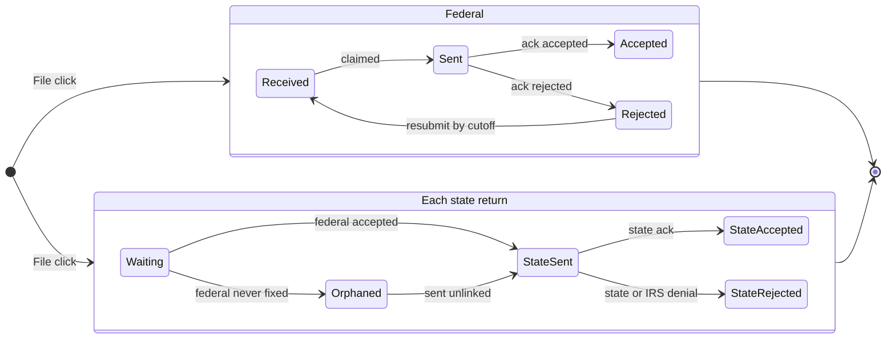

### D8c. One MeF session (5 per ASID)

A session is the scarce unit. It runs one call at a time, dies after 10 h of activity or 15 min idle, and a Logout on an expired session fails, so a leaked one holds a slot until MeF's nightly cleanup unless its new owner logs it out within 15 minutes.

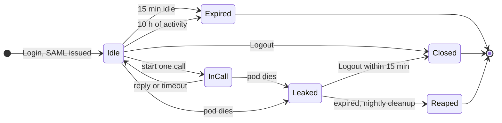

## D9. Deployment / topology

Two AWS regions, three AZs each, the same shape Intuit runs TurboTax on. Region A is home for the filing DB, with the 4 shard writers spread so no AZ holds more than 2. Region B takes File traffic only after its replicas are promoted; receipt tokens keep every postmark taken meanwhile.

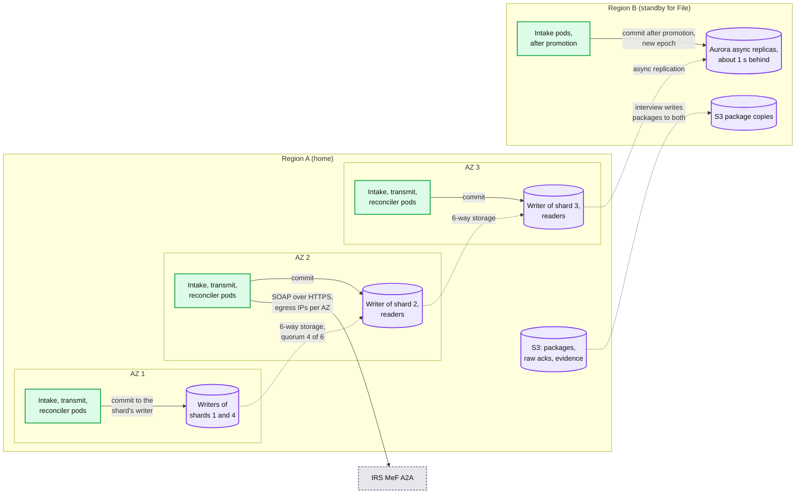

Transmission runs in one region at a time: the ASID owner leases live in the home region's DB, so a region switch moves the leases (and logs out the old sessions) before region B sends anything.

## D10. Scaling / partitioning

Returns are sharded by `hash(return_id)`; every shard has its own claimers, but all of them funnel into one shared send pool. That pool, not any shard, is the hot spot.

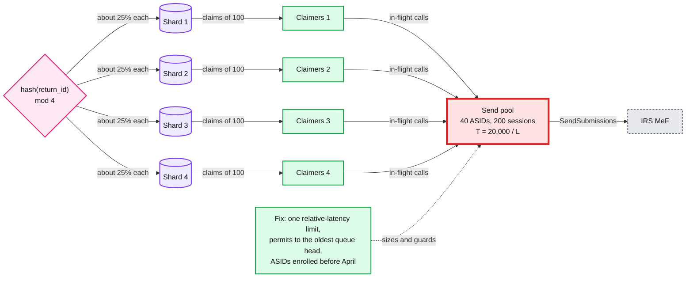

Fairness across shards: a free send permit goes to the claimer group whose shard's queue head has the **oldest postmark** (not round robin), and each claim takes the oldest postmarks on its shard, so the oldest return anywhere goes first and one busy shard cannot starve another's old returns. The submission ID's sequence prefix encodes region, shard and the promotion epoch, so an ack finds its shard without a lookup and a promotion never reissues an ID.

## D11. Failure mode map

Each component, what fails, how far it spreads, and what contains it. Two trees: the accept path, then the send and ack path.

### D11a. Accept path

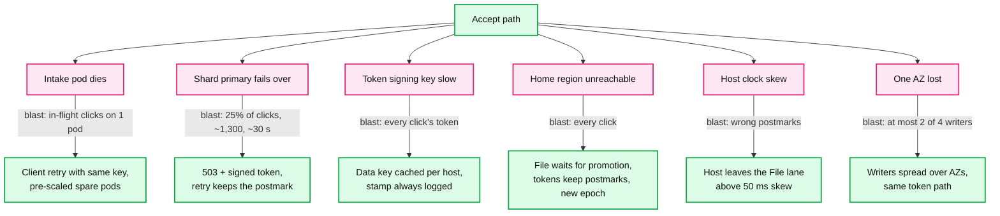

### D11b. Send and ack path

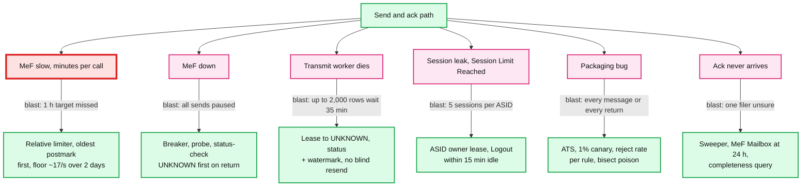

## D12. Rollout / migration

From the existing transmitter to this one without a single shadow send. Ownership of each attempt moves by cohort; rollback flips ownership of new attempts back, and in-flight submissions finish where they started.

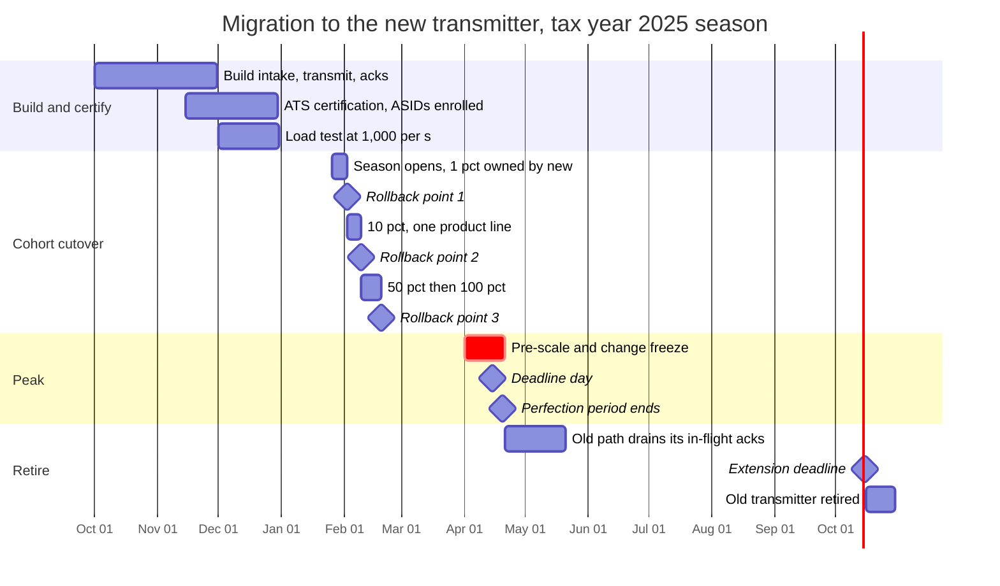

Rollback at any point before April 1: flip the owner of new attempts back to the old transmitter. Submissions already owned by the new path finish on it, because moving an `UNKNOWN` submission between transmitters is the one way this migration could create a duplicate.
