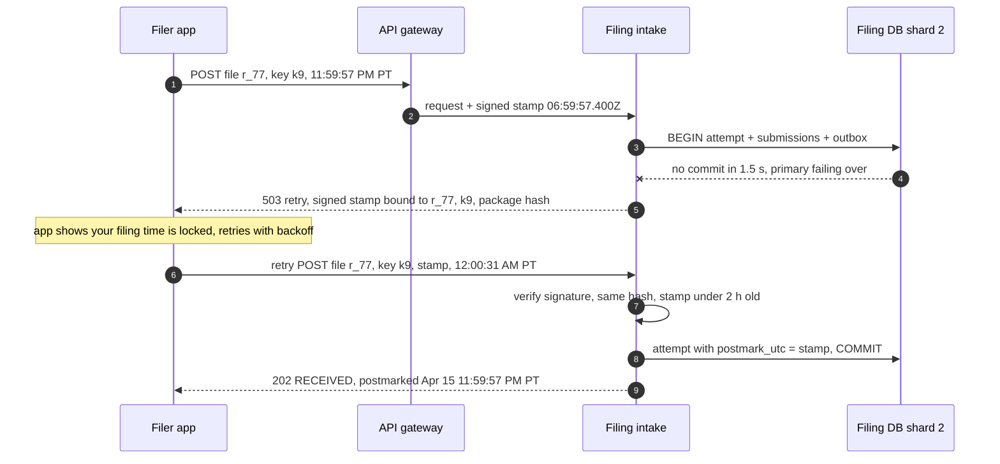
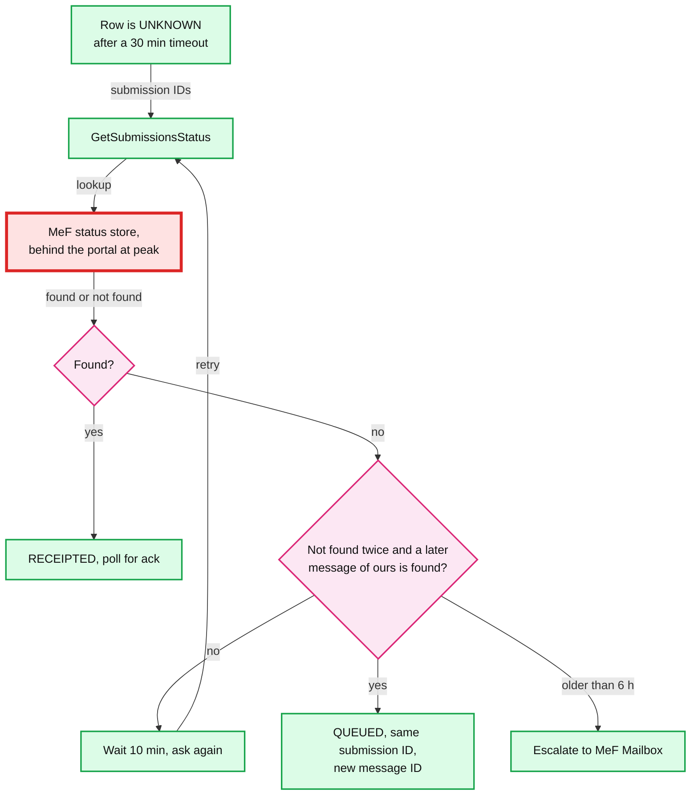

# Edge cases: TurboTax e-file at the April 15 peak

Every entry is answerable in under 60 seconds out loud. Categories: failure, consistency, scale, data, operations, security / abuse. Design reference: [`solution.md`](solution.md). Every entry describes the design as solution.md now states it. Where an earlier draft of the design failed (in a simulation or against the IRS text), the entry says so, because "what did you try first and why did it break" is a common follow-up. A bullet that starts with **Proposed:** goes past solution.md and is reported to the editor. IRS facts are quoted from IRS Publication 1345 (Pub 1345, rules for e-file providers) and Publication 4164 (Pub 4164, the MeF guide for software developers and transmitters). Simulation numbers come from the runnable scripts in [`deep-dives/`](deep-dives/).

Acronyms: MeF (Modernized e-File, the IRS e-file system), A2A (application-to-application, MeF's SOAP, Simple Object Access Protocol, web-service channel), ASID (Application System ID, one enrolled client system with 5 sessions), EFIN and ETIN (Electronic Filing and Electronic Transmitter Identification Numbers), AZ (availability zone), UTC (Coordinated Universal Time), SLO (service level objective), RPO (recovery point objective), AIMD (additive increase, multiplicative decrease), SSN (Social Security number), KMS (key management service), HSM (hardware security module), MFA (multi-factor authentication), IP (Internet Protocol), NTP (Network Time Protocol), CRR (S3 Cross-Region Replication), PII (personally identifiable information), API (application programming interface).

---

## Failure

## Edge case: one filing DB shard fails over at 11:59:40 PM Eastern
- **Trigger:** the Aurora writer of 1 of the 4 shards dies. Promotion takes ~30 s [estimate].
- **Symptom:** a quarter of File clicks cannot commit. Eastern filers click at ~259/s in the last second before midnight, so ~65/s land on that shard.
- **Answer:**
  - ~1,300 clicks are blocked for a failover starting at 11:59:40 PM, ~1,900 at worst (30 s ending at midnight). An early draft said ~8,400 by applying the national 280 clicks/s to one shard of four.
  - Intake answers `503` with the gateway's signed receipt token after its 1.5 s budget. The app retries with the same idempotency key and token; intake keeps the token's stamp as the postmark if it is under 2 h old. ~1,300 filers wait ~30 s for `RECEIVED`; none is late.
  - The first draft used an S3 "intake journal" as a second commit target. It was cut: a second source of attempts, a partition hazard, and it protects only ~0.005 to 0.02 late filers per season in expectation [estimate]. See [`deep-dives/postmark-and-peak-intake.md`](deep-dives/postmark-and-peak-intake.md).
- **Confidence:** [ ] shaky  [ ] ok  [ ] confident

## Edge case: the commit fails after the gateway already minted the receive time
- **Trigger:** the DB does not commit inside intake's 1.5 s budget.
- **Symptom:** the stamp exists, but nothing durable remembers it.
- **Answer:**
  - Never say "received" without a durable record. The filer gets `503` plus the token: "We have your filing time, finishing up", and the app retries automatically.
  - The stamp is the postmark because Pub 1345 defines it as when the return "is received at the Transmitter's host computer", and the gateway's signed stamp plus its access log prove that moment [interpretation: needs legal sign-off].
  - Bound it: the stamp is valid only with the same return, idempotency key and package hash, and only for 2 h. If the filer never retries, nothing was filed and we never claimed otherwise.
- **Diagram:**

- **Confidence:** [ ] shaky  [ ] ok  [ ] confident

## Edge case: the filer closes the page after the 503 and comes back 3 hours later
- **Trigger:** a `503` with a token at 11:59:57 PM, then the browser is closed (or the filer switches to a phone) and returns at 3 AM.
- **Symptom:** the retry carries no valid token: it is past 2 h, or on a device that never had it. Intake commits with the new stamp, so the return is late. Only the gateway's log of the first stamp remembers 11:59:57 PM.
- **Answer:**
  - The app keeps the idempotency key and the token in local storage until it sees `202`, so a reopened page within 2 h on the same device recovers it.
  - Past that, the design keeps it simple: the gateway's signed stamp log is a support-only remedy. E-file operations can attach the logged stamp as the postmark through a ticket (`postmark_source = LOG`, the log line copied to the evidence bucket). There is no automatic hold or log lookup on the claim path, because this only matters in a double failure (a failover in the last 30 s plus a lost token). An automatic lookup that holds late retries for 10 minutes was considered and rejected as a second path that runs only on bad nights.
- **Confidence:** [ ] shaky  [ ] ok  [ ] confident

## Edge case: one AZ dies at 11:58 PM Eastern
- **Trigger:** an availability zone outage in the home region.
- **Symptom:** every shard writer in that AZ fails over at once.
- **Answer:**
  - 4 writers cannot sit one per AZ in 3 AZs, so the design keeps **at most 2 writers in any AZ** ([`diagrams.md` D9](diagrams.md#d9-deployment--topology)). An AZ loss blocks at most half the clicks for ~30 s. An early draft put all 4 writers in AZ 1, which made an AZ loss 100% of clicks.
  - Aurora storage already spans 3 AZs (4-of-6 quorum), so no commit is lost; only the writer moves.
  - The signed token covers every blocked click. Spare intake pods sit in every AZ at the April 1 floor.
- **Confidence:** [ ] shaky  [ ] ok  [ ] confident

## Edge case: the home region is unreachable at 10:30 PM Eastern
- **Trigger:** a regional network event.
- **Symptom:** File cannot commit until region B's replicas are promoted (minutes [estimate]).
- **Answer:**
  - File waits for the promotion; every click meanwhile gets `503` plus its token and keeps its postmark on retry.
  - The interview writes each signed package to both regions before it enables the File button, and records the hash on the return row, so region B can check hashes without waiting for asynchronous S3 replication [CRR timing: unverified].
  - Region B mints from its own ID prefix, and the promotion bumps the epoch in ID and message prefixes (RPO ~1 s), so no ID is reissued.
  - Transmission moves only after the ASID leases move and old sessions are logged out (D9 note).
- **Confidence:** [ ] shaky  [ ] ok  [ ] confident

## Edge case: MeF takes 5 minutes per SendSubmissions call at 11 PM Eastern
- **Trigger:** MeF load. Pub 4164 §5.6 itself says MeF "responds within seven minutes with a receipt", and §14 says most submissions are "receipted within seconds".
- **Symptom:** the send pool drains `200 sessions x 100 / 300 s = 67/s`; at 7 minutes, 48/s.
- **Answer:**
  - Nothing on the File path notices. The deadline day's 3 M submissions take ~12.5 h at 67/s: the 1 h target is missed, the 2-day condition is met.
  - Claims go oldest postmark first, corrections first. The status page shows "the IRS is slow tonight, your postmark keeps you on time".
  - More pods do nothing; only ASIDs (enrolled weeks ahead) and MeF's latency move the number. See [`deep-dives/irs-outage-and-backpressure.md`](deep-dives/irs-outage-and-backpressure.md).
- **Confidence:** [ ] shaky  [ ] ok  [ ] confident

## Edge case: MeF is down 9 to 11 PM Eastern and comes back at 60 s per call
- **Trigger:** an outage, then a slow recovery.
- **Symptom:** the breaker restarts the limiter at 10 calls, and MeF is slow but healthy.
- **Answer:**
  - The design grows on **relative** latency: +0.5 per completed call while latency stays within 1.5x the recent minimum, x0.7 on a hung call or system exception, and that limit kept as a ceiling for 30 min. 10 to 200 calls in ~8 round trips.
  - Why: the first draft grew only while p90 was under 30 s, so at 60 s it sat at 10 calls (`10 x 100 / 60 = 17/s`). Simulated: backlog peak 1.57 M, 34% sent within 1 h, oldest 4.0 h. The relative rule: 0.76 M, 74%, oldest 2.0 h. No limiter: 1.30 M, 33%, oldest 11.5 h, 5,894 hung calls.
- **Confidence:** [ ] shaky  [ ] ok  [ ] confident

## Edge case: a transmit pod dies with 20 calls in flight
- **Trigger:** an out-of-memory kill or node loss at 10:30 PM Eastern.
- **Symptom:** 2,000 rows stay `SENDING`; the pod's ASIDs keep 5 open sessions each at MeF.
- **Answer:**
  - Row leases expire at 35 min; the sweeper moves them to `UNKNOWN`, never `QUEUED`, and status checks resolve them (solution §10.4).
  - The ASID lease (~10 s) expires and the new owner calls `Logout` on the stored session handles within seconds. Pub 4164 §14.1: a Logout on a session whose SAML (Security Assertion Markup Language) token expired "will fail and the session will remain stale" until the nightly cleanup, so the hand-off must beat the 15-minute idle window. Whether MeF frees a session whose call is still running is not documented [unverified]; 2 spare ASIDs absorb it.
- **Confidence:** [ ] shaky  [ ] ok  [ ] confident

## Edge case: the ack reconciler is down for 3 hours on the morning of April 16
- **Trigger:** a bad deploy of the reconciler.
- **Symptom:** no accepts or rejects reach filers; `RECEIPTED` rows pile up.
- **Answer:**
  - Nothing is lost. MeF "stores the acknowledgement file for one year" (Pub 4164 §6.1) and `GetAcks` works by ID, so catch-up is the normal loop with a bigger backlog.
  - Catch-up order: oldest receipt first. The sweeper's no-ack alerts measure age from receipt, so they fire, which is right.
  - Pub 1345's clock is two workdays to retrieve acks and two workdays to tell the filer, so 3 h is an SLO burn, not a compliance event.
- **Confidence:** [ ] shaky  [ ] ok  [ ] confident

## Edge case: Kafka or the email provider fails during the morning ack wave
- **Trigger:** Kafka is down, or the provider throttles ~500 messages/s.
- **Symptom:** acks are applied, but notifications lag.
- **Answer:**
  - The outbox rows stay unrelayed; filing and acks never read Kafka. The status page reads the DB, so the truth is visible.
  - The notifier drains rejects before accepts: rejects need action before April 20, accepts do not.
- **Confidence:** [ ] shaky  [ ] ok  [ ] confident

## Edge case: S3 is slow at 11:59 PM
- **Trigger:** S3 throttling or a regional S3 event.
- **Symptom:** nothing on the click. An early draft checked both packages with S3 HEADs on the click (p99 150 ms), which a slow S3 would have turned into late filers.
- **Answer:**
  - The interview's successful package PUT writes the hash onto the return row; the click compares hashes inside its own transaction. S3 is off the File path.
  - The transmitter reads the bytes later and fails loudly if one is missing; the postmark is already safe.
- **Confidence:** [ ] shaky  [ ] ok  [ ] confident

---

## Consistency

## Edge case: SendSubmissions times out while MeF's backend is 60 minutes behind
- **Trigger:** Pub 4164 §14.2.6: peak timeouts are "between the MeF portal and backend". The message is in the portal; the status store will not show it until the backend catches up.
- **Symptom:** status says "not found" for a message MeF will store later.
- **Answer:**
  - The design resends only after two not-found answers **and** a watermark: MeF has stored a message we sent at least 5 minutes later. Duplicate sends: 13 of 771 timed-out messages if MeF's backend drains in order; lost messages go out after 40 to 70 min.
  - Why: the first draft's rule (two not-founds 10 minutes apart, nothing else) resent 568 of 771 messages whose first copy still landed. Same ID, so no return is filed twice, but each is a reject to handle.
  - Out of order, the watermark helps less (214 vs 408 of 608), which is why the next entry matters more.
- **Diagram:**

- **Confidence:** [ ] shaky  [ ] ok  [ ] confident

## Edge case: the resend lands after the first copy was already accepted
- **Trigger:** any premature resend from the entry above.
- **Symptom:** MeF rejects the second copy under business rule **T0000-014**, "The Submission ID must be globally unique" (Incorrect Data, Reject and Stop; Pub 4164 Table 5-2). That is not the "Duplicate Condition" category, which means a return "previously received and accepted".
- **Answer:**
  - The resend is byte-identical under the same ID, so MeF keeps one return. The real risk is ours: telling the filer "rejected".
  - A T0000-014 on an ID we sent more than once is proof the ID landed. It is stored as a second ack (`ACK` is keyed by `(submission_id, ack_digest)`), never becomes effective, is never shown, and alerts only above 1% of resends. On a once-sent ID it pages: our IDs are not unique.
  - How MeF reports T0000-014 next to an existing ack is not documented [unverified], hence the effective-ack pointer: any `Accepted` or `Exception` wins.
  - T0000-014 is listed as a transmission rule, so it may reject the whole message [unverified]. Resends from `UNKNOWN` travel in their own messages.
- **Confidence:** [ ] shaky  [ ] ok  [ ] confident

## Edge case: no later message ever lands, so the watermark never passes
- **Trigger:** a quiet hour (one message every few minutes), or every message after ours also hung.
- **Symptom:** an `UNKNOWN` row has two not-found answers, but nothing we sent 5 minutes later has been stored, so the watermark rule waits forever.
- **Answer:**
  - After an outage, the breaker's probe is a real message: its receipt passes the watermark for every older `UNKNOWN` row.
  - The design bounds it: an `UNKNOWN` row still without a watermark after 6 h goes to `ESCALATED` (IDs to the MeF Mailbox), never to a blind resend, and the oldest-`UNKNOWN` page at 90 min has already fired (solution.md §5.3, D8a).
- **Confidence:** [ ] shaky  [ ] ok  [ ] confident

## Edge case: a claimed batch waits for a session longer than its lease
- **Trigger:** the limiter sits at 10 calls; a worker that claimed 100 rows (lease 35 min) would then wait for a session.
- **Symptom:** the lease expires, the sweeper moves the rows to `UNKNOWN`, and the worker sends anyway. The epoch rejects its DB write, but nothing fences the send: MeF does not check our epoch.
- **Answer:**
  - The design takes the session permit **first**, then claims, so a claim never waits on the limiter.
  - Right before the call, it refuses to send with under 32 minutes of lease left (the 30-minute timeout plus 2).
  - Same lesson as [`../../concepts/leases-fencing-clocks.md`](../../concepts/leases-fencing-clocks.md): a fencing token only protects a resource that checks it.
- **Confidence:** [ ] shaky  [ ] ok  [ ] confident

## Edge case: "why not journal the click to S3 when the database is slow?"
- **Trigger:** the interviewer proposes the first draft's design: write the attempt to an S3 intake journal after 300 ms and adopt it into the DB later.
- **Symptom:** under a partition, the click goes to the journal and the app's retry commits a new attempt in the DB before adoption: two attempts, two sets of submission IDs, two postmarks.
- **Answer:**
  - The draft paused claims while any journal "(either region)" held unadopted records. Under a cross-region partition region A cannot list region B's bucket, so it either halts every shard or sends the DB attempt and later adopts the journal one: two returns for one SSN at the IRS.
  - "Earlier postmark wins" can also pick stale content if the filer edited the return between the clicks.
  - So the design has one source of attempts (the DB) and keeps the postmark with the signed token instead.
- **Confidence:** [ ] shaky  [ ] ok  [ ] confident

## Edge case: the federal accept arrives while the filer clicks "send state unlinked"
- **Trigger:** the filer gave up waiting; the reconciler applies the accept in the same second.
- **Symptom:** two writers want the California row.
- **Answer:**
  - Both are conditional updates `WHERE state = 'WAITING_FEDERAL'`. One matches; the other matches zero rows. Uniqueness is one open submission per `(return, kind)`, so there is never a second California row to race with.
  - The losing API call returns `409` with the current state: "already released, linked to your accepted federal return". No second state submission is created.
- **Confidence:** [ ] shaky  [ ] ok  [ ] confident

## Edge case: the federal return is rejected and the filer never comes back
- **Trigger:** a federal reject on April 16; the filer ignores every notice.
- **Symptom:** the linked California return sits in `WAITING_FEDERAL` forever. It is never sent, so no ack check ever sees it, and the filer may think it was filed.
- **Answer:**
  - Each waiting state has a timer on `next_action_at`: a reminder 2 days after the federal reject, then on the day before the last retransmit day the state moves to `Orphaned` and the filer is prompted to send it unlinked (where the state allows it, Pub 1345's five cases) or on paper.
  - The sweeper's completeness check counts `WAITING_FEDERAL` rows past their timer; each must be zero or owned by a human. An early draft had no answer here. See [`deep-dives/reject-fix-resubmit-and-state-returns.md`](deep-dives/reject-fix-resubmit-and-state-returns.md) §5.
- **Confidence:** [ ] shaky  [ ] ok  [ ] confident

## Edge case: a gateway host's clock is 300 ms fast at midnight
- **Trigger:** NTP failure on one gateway host.
- **Symptom:** a click at 11:59:59.800 PM is stamped 12:00:00.100 AM: late. A slow clock does the opposite and stamps a late click as timely, a compliance problem.
- **Answer:**
  - A host above 50 ms skew leaves the File lane automatically and pages.
  - The postmark record and the signed token carry the gateway host, so a skew incident can be audited and the affected filers found.
- **Confidence:** [ ] shaky  [ ] ok  [ ] confident

## Edge case: a promoted replica re-leases an ID block that was already used
- **Trigger:** cross-region promotion with ~1 s RPO loses the last `ID_BLOCK` lease writes.
- **Symptom:** without a guard, the same submission ID is minted for two different returns. MeF rejects the second (T0000-014), and the reconciler may match an ack to the wrong return.
- **Answer:**
  - The sequence prefix carries region, shard and an **epoch bumped on every promotion**, so a new primary can never reissue an old range. Message IDs carry the same epoch (a repeat would get `MEF00004 DuplicateMessageID`).
  - A T0000-014 on a once-sent ID pages, as the canary for exactly this bug.
- **Confidence:** [ ] shaky  [ ] ok  [ ] confident

## Edge case: SendSubmissions returns an error that is not a clean reject
- **Trigger:** `MEF00002 CreateMessageFailure`, `MEF00003 UpdateMessageFailure` or `MEF00005 DataError` (Pub 4164 A2A error list).
- **Symptom:** an error response, but an update failure suggests MeF stored the message.
- **Answer:**
  - Only a definite "nothing processed" answer (envelope, manifest or schema reject; `MEF00004` on a fresh message ID) goes to `QUEUED`. `MEF00001`, `00002`, `00003`, `00005` and a reset after the body was sent go to `UNKNOWN`.
  - A wrong guess toward `UNKNOWN` costs one status call; toward `QUEUED`, a T0000-014. An early draft sent every message-level error to `QUEUED`.
- **Confidence:** [ ] shaky  [ ] ok  [ ] confident

---

## Scale

## Edge case: the deadline wave hits 04:00, 05:00, 06:00 and 07:00 UTC
- **Trigger:** each time zone's midnight. Clicks per second in the last second before midnight, from the deep dive's model: Eastern 259, Central 160, Mountain 39, Pacific 88, Alaska 2, Hawaii 3.
- **Symptom:** the README's ~500 submissions/s peak only appears if about half the day's filers file inside a ~26-minute ramp before their midnight. That shape is an assumption [estimate].
- **Answer:**
  - Pre-scale File to 1,000/s from April 1. Never shed File, resubmit or postmark lookups.
  - The send side does not follow the wave: its floor is the 2-day condition, `3 M / 172,800 s = ~17/s` averaged over two days.
- **Confidence:** [ ] shaky  [ ] ok  [ ] confident

## Edge case: acks come back out of order at peak
- **Trigger:** "Acknowledgement turnaround times are dependent on the size of the submission, the number of schedules and the forms attached" (Pub 4164 §5.6). Big returns are slower.
- **Symptom:** the frontier rule (first poll at the median ack age) is cheap only if acks arrive roughly in order.
- **Answer:**
  - They do not. Simulated with ack lag median 30 min, p99 ~4 h: ~6.5 ID-polls per ack (calls ~15% full), ~3.6 calls/s, ~36 sessions, stale p99 26 min. The design sizes 8 federal-ack ASIDs (40 sessions) and states the SLO honestly: p99 5 min off-peak, **30 min in the deadline week**.
  - The rejected option: every ID every 5 minutes, ~56 sessions (~11 ASIDs), p99 4.9 min. It buys almost nothing legal: notifying a reject 30 min late instead of 2 moves acceptance by April 20 from 94.81% to 94.77% in the model. See [`deep-dives/ack-reconciliation.md`](deep-dives/ack-reconciliation.md).
- **Confidence:** [ ] shaky  [ ] ok  [ ] confident

## Edge case: the morning-after wave: 3 M acks plus 1.3 M state releases
- **Trigger:** the federal acks for the evening arrive, and every federal accept releases its linked states.
- **Symptom:** a second send wave (states) right when the ack pool is busiest.
- **Answer:**
  - Move ~20 send ASIDs to the ack pool once the federal send backlog is zero (pre-approved config change).
  - States are priority 2. Their acks take 12 to 24 h anyway (Pub 4164 §14.2.3), so sending them an hour later costs nothing visible.
- **Confidence:** [ ] shaky  [ ] ok  [ ] confident

## Edge case: one shard's claimers take every send slot
- **Trigger:** shard 3 has a deeper backlog after its failover.
- **Symptom:** the other shards' oldest postmarks wait.
- **Answer:**
  - A free send permit goes to the shard whose queue head has the **oldest postmark**, not round robin. Oldest-postmark-first is the property the 2-day condition needs; round robin would let a quiet shard's young rows go ahead of a busy shard's old ones.
- **Confidence:** [ ] shaky  [ ] ok  [ ] confident

## Edge case: the IRS will not enroll ~54 ASIDs
- **Trigger:** the design asks for ~54 (40 send, 10 ack, 2 status, 2 spare). Pub 4164 lets an organization enroll several ASIDs but publishes no cap and no rate limit [unverified]. The answer could be 10.
- **Symptom:** with 10 send ASIDs (50 sessions) at 40 s per call: 125/s instead of 500/s.
- **Answer:**
  - The evening backlog then drains overnight. Still far above the ~17/s floor for the 2-day condition.
  - Confirm the count with the IRS every autumn, before the ATS (Assurance Testing System) cycle. The design makes a backlog harmless; it does not need a number the IRS has not promised.
- **Confidence:** [ ] shaky  [ ] ok  [ ] confident

## Edge case: 10x traffic tomorrow
- **Trigger:** a disaster-relief deadline that moves a whole state, or the platform also transmits Intuit's professional products.
- **Symptom:** intake and DB scale with pods and shards; the send pool does not.
- **Answer:**
  - 30 M submissions on one day need `30 M / 172,800 s = ~174/s` to meet the 2-day condition. 40 ASIDs do that up to ~115 s per call.
  - Separate ASID pools per product line, so a professional-tax spike cannot starve consumer returns.
- **Confidence:** [ ] shaky  [ ] ok  [ ] confident

---

## Data

## Edge case: the filer lives in Tokyo or Guam, not in one of the 6 US zones
- **Trigger:** "The taxpayer must adjust the electronic postmark to the time zone where the taxpayer lives" (Pub 1345). U.S. citizens abroad file with the IRS.
- **Symptom:** a design that hard-codes the 6 US zones computes the wrong local date.
- **Answer:**
  - `filer_tz` is any IANA (Internet Assigned Numbers Authority) zone from the residence address, with daylight saving from the zone database, never a fixed offset. The earliest midnight on Earth is UTC+14: 10:00 UTC on April 15.
  - Some filers abroad also have a later deadline (Pub 4164 lists June 20, 2026 as the last retransmit day for returns under the overseas exception), so the due date is per filer, not global.
- **Confidence:** [ ] shaky  [ ] ok  [ ] confident

## Edge case: the due date moves to April 18
- **Trigger:** a weekend plus the District of Columbia's Emancipation Day. The IRS confirmed April 18 for 2023; the same rule gives April 18 in 2022 and 2028.
- **Symptom:** Pub 1345 says a corrected return keeping its postmark must be transmitted within two days of receipt "or the twenty second day of the respective month of the prescribed due date, whichever is earlier". The last retransmit day becomes April 23, after the 22nd.
- **Answer:**
  - In those years a correction received on April 23 cannot both keep its postmark and meet the 22nd [interpretation of the rule text].
  - The design reads every date from `SEASON_RULES` (due date, last retransmit day = due + 5, the 22nd rule). Each correction stores its own `transmit_by` (the earlier of receipt + 2 days and the end of the 22nd) and pages under 6 h away. In such years the UI closes the window on the 22nd. An early draft hard-coded April 20. See [`deep-dives/reject-fix-resubmit-and-state-returns.md`](deep-dives/reject-fix-resubmit-and-state-returns.md).
- **Confidence:** [ ] shaky  [ ] ok  [ ] confident

## Edge case: a submission ID minted in December has to go out in January
- **Trigger:** a late filer's row is `UNKNOWN` or `QUEUED` when MeF closes for the year (late December, per the IRS season release [unverified date]).
- **Symptom:** "YYYY in the SubmissionId must be the current Processing Year" (Pub 4164). The old ID can never be sent.
- **Answer:**
  - This is the only legitimate re-mint. It happens only after MeF reopens and status says not found twice for the old ID; the old ID is retired, the new attempt carries the original postmark.
  - Rows in this state at December 15 page e-file operations, so they are resolved before the shutdown.
- **Confidence:** [ ] shaky  [ ] ok  [ ] confident

## Edge case: the IRS releases a new schema version mid-season
- **Trigger:** a late-legislation form change; MeF accepts listed schema versions only.
- **Symptom:** packages built and checked against the old version sit in the queue.
- **Answer:**
  - The package records its schema version. Rows never claimed can be rebuilt under the same submission ID: MeF has never seen it.
  - Anything that left the building keeps its bytes. A rebuild of a sent ID would make a resend differ from the first copy.
- **Confidence:** [ ] shaky  [ ] ok  [ ] confident

## Edge case: a bad migration deletes a day of ACK rows
- **Trigger:** an operator error on April 17.
- **Symptom:** filers' statuses fall back to "Sent".
- **Answer:**
  - Re-fetch with `GetAcks` by ID: MeF keeps acks one year. Inserts are idempotent on `(submission_id, ack_digest)`.
  - Replays carry a `silent` flag. The notifier's dedup table lives 7 days, so a later replay would otherwise re-email filers.
- **Confidence:** [ ] shaky  [ ] ok  [ ] confident

## Edge case: a filer asks us to delete their filed return
- **Trigger:** a privacy request in June.
- **Symptom:** Pub 1345 requires keeping each postmark record and each ack file until the end of the calendar year, and giving them to the IRS on request.
- **Answer:**
  - Delete what is not required (drafts, analytics copies) at once. Keep the filed package, postmark and ack under Object Lock for the legal period, then crypto-shred by deleting the per-object KMS key.
  - Section 7216 limits use, not retention: nothing kept is used for anything but filing.
- **Confidence:** [ ] shaky  [ ] ok  [ ] confident

## Edge case: three seasons of growth
- **Trigger:** ~6.3 TB of packages and ~120 GB of metadata per season (solution §2).
- **Symptom:** the queue's partial indexes must stay small while history grows.
- **Answer:**
  - Partition `SUBMISSION` and `FILING_ATTEMPT` by tax year; detach seasons older than the amendment window to cold storage. Queue indexes cover only `QUEUED`, `RECEIPTED` and `UNKNOWN` rows, a few million at most.
  - Packages move to infrequent access after the October 15 extension deadline.
- **Confidence:** [ ] shaky  [ ] ok  [ ] confident

---

## Operations

## Edge case: what pages at 2 AM on April 16
- **Trigger:** the deadline night.
- **Symptom:** the on-call needs a short list, not every metric.
- **Answer:**
  - File errors above 0.1% for 1 min or p99 above 2 s for 2 min. Oldest `QUEUED` postmark over 1 h (ticket) and over 24 h (page plus the IRS call). Send breaker open. Any "Session Limit Reached". T0000-014 above 1% of resends, or any on a once-sent ID. A correction within 6 h of its `transmit_by`. Skew above 50 ms.
  - `UNKNOWN` rows older than **90 min**: the watermark legitimately holds them 40 to 70 min at peak (an early draft paged at 45).
- **Confidence:** [ ] shaky  [ ] ok  [ ] confident

## Edge case: the oldest postmark in the queue reaches 24 hours
- **Trigger:** MeF effectively down most of a day.
- **Symptom:** Pub 4164 §1.5.3: a postmarked return is "treated as filed on the electronic postmark date if received within two (2) days of the electronic postmark". Past 48 h the filer, not only the transmitter, is at risk.
- **Answer:**
  - The ladder runs earlier: at 6 h oldest, ack ASIDs move to sending and state sends pause; at 24 h, page and call the IRS e-Help Desk with counts and evidence; at 36 h, every session sends the oldest postmarks only.
  - Relief for an IRS-side outage is the IRS's decision [unverified].
- **Confidence:** [ ] shaky  [ ] ok  [ ] confident

## Edge case: a packaging bug ships on April 2
- **Trigger:** a release that makes every return fail one business rule.
- **Symptom:** the reject rate for one rule jumps from ~0 to most returns.
- **Answer:**
  - The 1% send canary per release catches it within an hour; the freeze from April 1 makes this rare.
  - Fix forward: affected returns are re-packaged as new attempts with new IDs. Their original reject keeps the postmark through the perfection period, so filers are not late.
- **Confidence:** [ ] shaky  [ ] ok  [ ] confident

## Edge case: cutover from the old transmitter while it holds UNKNOWN rows
- **Trigger:** cohort migration (solution §8, D12).
- **Symptom:** temptation to move in-flight work to the new path.
- **Answer:**
  - Never move an `UNKNOWN` or `RECEIPTED` submission between transmitters; each resolves and reconciles its own. Only new attempts change owner.
  - A correction of an old-path reject is a new attempt, so the new path owns it, with the postmark carried by lineage.
- **Confidence:** [ ] shaky  [ ] ok  [ ] confident

## Edge case: an ASID certificate expires on April 15
- **Trigger:** per-ASID certificates (Pub 4164 §4.1.3, strong authentication).
- **Symptom:** `Login` fails for that ASID; 5 sessions vanish from the pool.
- **Answer:**
  - Alarms at 30, 14 and 7 days before expiry; every certificate is rotated before the April 1 freeze. The 2 spare ASIDs absorb one surprise.
- **Confidence:** [ ] shaky  [ ] ok  [ ] confident

## Edge case: an urgent fix during the April 1 to 20 freeze
- **Trigger:** a bug that causes rejects for one state.
- **Symptom:** pressure to ship at 5 PM on April 15.
- **Answer:**
  - The incident commander approves. The fix goes to 1% of sends, watched by reject rate per rule, then 100%. Rollback is a redeploy; the state machine only gains states with a migration old code tolerates.
- **Confidence:** [ ] shaky  [ ] ok  [ ] confident

---

## Security / abuse

## Edge case: one account files returns for 40 different people
- **Trigger:** a fraud ring, or an unregistered paid preparer, using one consumer account.
- **Symptom:** a per-minute attempt limit does not stop this; the returns trickle in over days.
- **Answer:**
  - Pub 1345 requires an Online Filing transmitter to "ensure that it doesn't accept transmission for more than five electronic returns originating from one software package or from one e-mail address".
  - Intake enforces at most 5 distinct returns per account and per e-mail address per season, next to the 5-per-minute attempt limit. Corrections of the same return do not count.
- **Confidence:** [ ] shaky  [ ] ok  [ ] confident

## Edge case: a client replays an old receipt token to get an earlier postmark
- **Trigger:** a filer who missed midnight replays a stamp from a failed 11:58 PM request.
- **Symptom:** an attempt to backdate.
- **Answer:**
  - The stamp is signed by the gateway and bound to return, idempotency key and package hash, valid 2 h, used once. A different package (an edited return) does not match.
  - Replaying a genuine stamp for the same bytes is not backdating: that return did reach our host at that time.
- **Confidence:** [ ] shaky  [ ] ok  [ ] confident

## Edge case: the return must carry the IP address of the computer that filed it
- **Trigger:** Pub 1345 requires Online Filing returns to include the "public/routable IP Address, IP Date, IP Time and IP Time Zone of the computer the taxpayer uses to submit the return".
- **Symptom:** the package is built on the review screen, before the click.
- **Answer:**
  - "The IRS will reject individual income tax returns e-filed without the required IP address" (Pub 1345). So the gateway captures the public address as seen at our edge, plus date, time and zone, at the click; `FILING_ATTEMPT.client_ip_info` stores them (encrypted, it is PII); the packager writes them into the return header at send time, like the postmark.
- **Confidence:** [ ] shaky  [ ] ok  [ ] confident

## Edge case: the reject helper suggests a wrong SSN
- **Trigger:** a model hallucination on rule R0000-504-02 (dependent SSN and name mismatch).
- **Symptom:** a filer could "fix" the return into a worse one.
- **Answer:**
  - The model never edits or sends the return. A suggested value must come from the filer's own documents and a field the reject cites, or it is dropped. On timeout or failed check, the static rule text is shown (solution §12).
- **Confidence:** [ ] shaky  [ ] ok  [ ] confident

## Edge case: a stolen session changes the refund account and files at 11:58 PM
- **Trigger:** account takeover on deadline night.
- **Symptom:** a valid File click for a fraudulent refund.
- **Answer:**
  - Identity and fraud checks run before File (below the line), with step-up MFA on any bank-account change. File itself stays fast.
  - Intake still checks ownership in the service, not only at the edge, and a client can choose neither its postmark nor its submission ID.
- **Confidence:** [ ] shaky  [ ] ok  [ ] confident
