# HLD: TurboTax e-file submission at the April 15 peak

> One-line answer: the deadline is met when **we** durably accept and postmark the return, not when the IRS receives it. So the File click writes the return, its electronic postmark (stamped by the gateway in a signed receipt token that a retry replays) and a pre-minted **submission ID** to a durable store in one transaction and answers in under 2 s, at up to 50x the season's average rate. A separate transmitter drains that store to IRS MeF (Modernized e-File) at whatever rate MeF accepts. Every retry of a send reuses the same submission ID, and an unknown outcome is resolved by asking MeF for that ID's status, never by minting a new one. An ack reconciler polls for acknowledgments, matches each one to its submission ID, notifies the filer, and a sweeper pages a human if any submission has no ack after its SLA. The thing that breaks first is the MeF channel itself (external, slow at peak), so nothing on the accept path waits on it.

Sources: the problem contract in [`README.md`](README.md) (Intuit practice list, not a reported prompt; the closest reported Intuit prompt is the refund-status service, [#45](../README.md)), the research notes in [`research/facts-survey.md`](research/facts-survey.md) (its "Spot-check corrections" table overrides its body), and the primary sources I opened myself: IRS Publication 1345 (electronic postmark, transmitter duties, Fed/State rules), IRS Publication 4164 (MeF A2A services, session limits, ack timing, timeout guidance, perfection periods), the IRS filing-season statistics pages for April 2025, the IRS 2026 season-opening release, Intuit's FY2025 results release (TurboTax units), Intuit's Tax Day blog and the Diginomica write-up of TurboTax on Kubernetes. Numbers I could not check against a primary page are marked `[estimate]` or `[unverified]`. Reusable blocks: [`../../concepts/exactly-once.md`](../../concepts/exactly-once.md), [`../../concepts/leases-fencing-clocks.md`](../../concepts/leases-fencing-clocks.md), [`../../concepts/rate-limiting-and-load-shedding.md`](../../concepts/rate-limiting-and-load-shedding.md), [`../../concepts/sharding.md`](../../concepts/sharding.md), [`../../concepts/replication-and-quorums.md`](../../concepts/replication-and-quorums.md), [`../../concepts/temporal-durable-execution.md`](../../concepts/temporal-durable-execution.md). Related problems: [`../payments-ledger/`](../payments-ledger/) (idempotent money movement), [`../distributed-job-scheduler/`](../distributed-job-scheduler/) (leased work queues), [`../financial-ai-assistant/`](../financial-ai-assistant/) (the AI guardrails). The deep dives hold the simulations behind §5 (send limiter, ack polling, `UNKNOWN` resolution, failover blast radius); this file links to them rather than repeating them. Written flow-first: §4 builds one diagram one functional requirement at a time, §5 breaks and mutates it one non-functional requirement at a time, §6 shows the final design and the six flows to rehearse.

Acronyms used throughout: MeF (Modernized e-File, the IRS e-file system), A2A (application-to-application, MeF's SOAP web-service channel), SOAP (Simple Object Access Protocol), ASID (Application System ID, one enrolled client system with its own certificate), ETIN (Electronic Transmitter Identification Number), EFIN (Electronic Filing Identification Number), SAML (Security Assertion Markup Language, the session token MeF issues at Login), PIN (personal identification number, the filer's e-signature), SSN (Social Security number), XML (Extensible Markup Language), UTC (Coordinated Universal Time), KMS (key management service), LLM (large language model), AZ (availability zone), RPO (recovery point objective), SLO (service level objective), SLA (service level agreement), p99 (99th percentile).

---

## 1. Understanding the problem

Restate before designing. Three facts shape every decision. Say all three in the first minute:

1. **"On time" is decided at our door, not at the IRS.** The electronic postmark is "the date and time the Transmitter first receives the electronic return on its host computer", in the transmitter's time zone, and "the taxpayer adjusts the time to their time zone to determine timeliness" (Pub 1345). If the postmark is on or before the due date, the return is timely even if the IRS receives it later. But the postmark only counts "if received within two (2) days of the electronic postmark" (Pub 4164 §1.5.3), and the transmitter must send it "within two days of receipt" (Pub 1345). So the File click and the IRS send are two systems with two SLOs: seconds for the first, hours for the second, and **two days is a condition of the filer being on time**, not only a transmitter rule. And the deadline is midnight in the filer's own zone, so it rolls: midnight Eastern is 04:00 UTC, midnight Hawaii is 10:00 UTC.
2. **The IRS channel is the bottleneck, and we do not own it.** MeF A2A takes at most 100 submissions per `SendSubmissions` call, allows 5 sessions per ASID, and runs one call at a time per session (Pub 4164 §2.8.4.2, §14.1). At peak, MeF itself reports timeouts "between the MeF portal and backend" and tells transmitters to set a **30-minute** client timeout (§14.2.6). So our send rate is `sessions × 100 ÷ call latency`, and the latency belongs to the IRS.
3. **Exactly-once is a protocol we run against the IRS, not a feature the IRS gives us.** There is no idempotency-key header. We mint the 20-character submission ID ourselves, and on a `SendSubmissions` timeout MeF's own guidance is: run Get Submissions Status, and resend only if the status is not found, "This will prevent duplicate error conditions". Acks are pulled, not pushed, so we must prove that every submission got one. And a **linked** state return is rejected by the IRS unless an accepted federal return exists under the federal submission ID it names (Pub 1345, Pub 4164 §3.2), so state waits on federal.

### 1.1 Functional requirements

Core:
1. **File.** The filer clicks File on a federal return (and usually one or more state returns). We validate it, postmark it, and confirm "received" in under 2 s.
2. **Transmit.** Package submissions into MeF messages and send each one to the IRS exactly once, per submission ID. State returns go through the same MeF Fed/State channel, linked to the federal one.
3. **Acknowledge.** Retrieve every IRS and state acknowledgment, update the return's status, and notify the filer: accepted, or rejected with the reason and what to do. The filer sees a small set of statuses: Received (with the postmark), Sent to IRS, Accepted, Rejected (action needed), and per state: Waiting for federal, Sent, Accepted, Rejected.
4. **Fix and resubmit.** A rejected return can be corrected and resubmitted inside the perfection period (accepted by the fifth day after the due date: April 20, 2026 for individual returns, read from a per-season rules table) and still count as filed on time.

Below the line (say it out loud):
- **Computing the tax and building the return.** The tax interview owns it. We receive a finished, signed package.
- **Refund status after acceptance.** That is the read side, [#45](../README.md) (no folder yet). We publish the accepted events it consumes.
- **Paying a balance due, identity checks (IP PIN, the identity protection PIN), fraud scoring, paper filing, amended returns.**
- **Extensions (Form 4868).** Same pipeline, same mechanics, different perfection period (5 days). Not drawn.

### 1.2 Non-functional requirements

Ask for scale first: how many returns, how many states per return, how peaky the deadline is, how many time zones, and whether the IRS publishes rate limits (it does not). Then:

| Dimension | Target | Why it matters |
|---|---|---|
| Scale | ~45 M federal and ~35 M state submissions per season [estimate]. Season average ~10 submissions/s. Deadline evening peak ~500/s (50x), designed for 1,000/s at the accept path. The deadline is midnight in the filer's own time zone, so the peak comes in waves (almost all load in the 6 US zones) | The accept path must absorb the wave. The send path does not have to match it second by second; it has two days |
| Accept latency | File click to "received": p99 under 2 s at peak | A spinner at 11:59 PM makes people click again or give up |
| Availability | 99.99% of File clicks postmarked at their first click (a gateway-signed receipt token keeps the postmark across a retry); 99.9% answered within 2 s. Freeze and pre-scale from April 1. Must not depend on MeF being up | The legal outcome must never fail; the 2 s answer may degrade for 30 s during a failover |
| Durability | Zero lost returns. Durable across availability zones before we say "received" | "Received" is a legal claim. The postmark is evidence |
| Exactly-once | One submission ID per filing attempt, minted before the first send. Never two IRS submissions for one attempt. Never a new ID while the old one's outcome is unknown | A duplicate is a reject or worse; a new ID during an unknown outcome is how duplicates happen |
| Transmit deadline | Every postmarked return received by the IRS within 2 days of the postmark, a condition of timely filing (Pub 4164 §1.5.3). Target: 99% within 1 h, all within 24 h, even on April 15. Floor: 3 M deadline-day returns in 48 h is ~17/s | Past 2 days the filer is late, not only us; 1 h is what keeps rejects fixable inside the perfection window |
| Ack freshness | Filer notified within 5 min of the ack being available at MeF, p99, off-peak; within 30 min in the deadline week. Every submission acked or escalated within 48 h | A reject at 1 AM on April 16 has a 5-day fix window, so minutes are experience, not law; an ack we never fetched is a filer who thinks they filed |
| Security | Return data is taxpayer data under IRC (Internal Revenue Code) section 7216. Encrypted at rest and in transit. Access logged | One leaked return is a news story; the Intuit loop grades security as its own section |

Consistency, stated once: the postmark, the attempt and every submission's state are **strongly consistent** (single-shard transactions in one database). The filer's own status page is **read-your-writes**. Notifications and the refund-status feed are **eventual** (seconds). IRS acks are eventual on the IRS's clock (minutes, up to 24 h at peak), state acks more so (12 to 24 h). The cross-region copy is asynchronous (~1 s).

---

## 2. Back-of-envelope

Only the numbers that change the design.

**Inputs I checked.**
- The IRS expects about 164 M individual returns for the 2026 season, which opened January 26, 2026 (IRS IR-2026-12).
- 2025 season: 113.9 M returns e-filed by April 11 and 136.2 M by April 18, so **22.3 M e-filed in the deadline week**; self-prepared went from 51.1 M to 63.7 M, **12.6 M in that week** (IRS filing-season statistics pages).
- TurboTax: **39.2 M** federal units for the season through July 31, 2025 (34.9 M online, 4.3 M desktop) (Intuit FY2025 results).
- Intuit's TurboTax platform "must scale from 5K to 300K transactions per second (TPS) within two hours", a 60x swing (Diginomica, 2020). Tax Day 2026: 185 B transactions and 11 M TPS at peak, so `185 B ÷ 86,400 = 2.1 M/s` average, a ~5x peak inside one day (Intuit blog).

**Season volume.** The README's ~45 M federal plus ~35 M state = **~80 M submissions** [estimate]. That is more than 39.2 M units because a rejected return is resubmitted under a new submission ID, and extensions ride the same pipe. About 85% fall between January 26 and April 15 [estimate]: 80 days = `80 × 86,400 = 6.91 M s`, so `68 M ÷ 6.91 M s = 9.8/s`, **~10/s**.

**Deadline day.** TurboTax units are about 0.6 of 2025's 64.1 M self-prepared e-filed returns; use ~0.5 for the deadline week because units include desktop paper filers and assisted filings [estimate]: `12.6 M × 0.5 ≈ 6.3 M` federal returns that week. About a quarter of the week lands on April 15 itself [estimate]: **~1.7 M federal**. States run at `35 ÷ 45 = 0.78` per federal: ~1.3 M. So **~3 M submissions on deadline day**, `3 M ÷ 86,400 = 35/s` on average.

**Peak.** File clicks bunch in the minutes before each time zone's midnight. The peak minute is **~500/s**, 14x the deadline day's average and 50x the season's. Cross-check: the season average times Intuit's measured 60x swing is `10 × 60 = 600/s`. **Design the accept path for 1,000/s** (2x). One click carries 1 federal and ~0.78 state submissions (1.78), so 500 submissions/s is **~280 clicks/s** and 1,000/s is ~560 clicks/s. At the send side the federal share is `500 × 45 ÷ 80 ≈ 280/s`; state submissions follow later, after their federal is accepted.

**The deadline wave (local midnight of April 15, 2026, in UTC).**

| Zone | Offset in April | Deadline in UTC (April 16) |
|---|---|---|
| Eastern | UTC-4 | 04:00 |
| Central | UTC-5 | 05:00 |
| Mountain (Arizona stays UTC-7) | UTC-6 | 06:00 (Arizona 07:00) |
| Pacific | UTC-7 | 07:00 |
| Alaska | UTC-8 | 08:00 |
| Hawaii | UTC-10 | 10:00 |

A ~500/s peak minute implies that about half the day's filings ramp into each zone's midnight with a ~26-minute time constant; the Eastern wave at 04:00 UTC is the peak, and the waves barely overlap ([`deep-dives/postmark-and-peak-intake.md`](deep-dives/postmark-and-peak-intake.md) §3). Filers abroad add a thin tail: `filer_tz` is any IANA (Internet Assigned Numbers Authority) zone, never one of 6 hard-coded offsets.

**Storage.** A zipped federal package is ~100 KB and a state package ~50 KB [estimate]: `45 M × 100 KB + 35 M × 50 KB ≈ 6.3 TB per season` of encrypted objects, ~44 TB over 7 seasons. Metadata (attempt, submission, indexes, status history) is ~1.5 KB per submission: `80 M × 1.5 KB = 120 GB per season`. Raw acks go to object storage next to the package (~4 KB each, ~320 GB per season). None of this is large.

**Database writes at design peak.** Intake: 560 clicks/s × ~5 rows = 2.8k/s. Transmit: 1,000 submissions/s × ~3 state changes = 3k/s. Acks and state releases ~2k/s, outbox ~1k/s. **~9k writes/s**, ~2.3k/s per shard on 4 shards. Comfortable for Aurora Postgres; we shard for blast radius and failover time, not throughput.

**Bandwidth to MeF.** The average submission is `0.56 × 100 KB + 0.44 × 50 KB ≈ 78 KB`. At 500/s that is **39 MB/s, ~312 Mbit/s** of zipped SOAP attachments. A full message of 100 is ~7.8 MB, well under the 50 MB above which Pub 4164 recommends chunking "otherwise responses will take longer, and you may be timed out".

**The MeF channel (the number that matters).** Send throughput `T = S × B ÷ L`: S concurrent sessions (5 per ASID, one call each), B submissions per call (at most 100), L the call latency. Pub 4164 says most submissions are "receipted within seconds", so take L ≈ 5 s on a normal day [estimate]:

| Call latency L | Per session (B = 100) | Sessions for 500/s | ASIDs (5 sessions each) |
|---|---|---|---|
| 5 s (normal) | 20/s | 25 | 5 |
| 20 s | 5/s | 100 | 20 |
| 40 s | 2.5/s | 200 | 40 |
| 60 s | 1.7/s | 300 | 60 |
| 5 min | 0.33/s | 1,500 | 300 |
| 7 min (MeF "responds within seven minutes with a receipt", Pub 4164 §5.6) | 0.24/s | 2,100 | 420 |
| 30 min (the recommended timeout) | 0.06/s | 9,000 | 1,800 |

**Acks.** `GetAcks` returns up to 500 acks per call (Pub 4164 §14.2.1). If acks came back in order, ~1 full call per second would fetch ~500/s. They do not: at peak the ack lag is a spread (median ~30 min, p99 ~4 h in the model), so we ask about ~6.5 submission IDs per ack and calls are ~15% full: **~3.6 calls/s, ~36 sessions at 10 s per call** for federal acks ([`deep-dives/ack-reconciliation.md`](deep-dives/ack-reconciliation.md) §3).

**What the numbers tell us.**
- Compute, storage and database writes are small. A few thousand writes per second and ~6 TB a season do not drive this design.
- The accept path's constraint is **availability in the last minutes before each zone's midnight**, not throughput. A 30 s failover of one shard 20 s before Eastern midnight hits ~1,300 clicks (~1,900 at the worst start), and every one whose retry lands after midnight is late unless the retry keeps its first stamp (§5.2).
- The send path's constraint is **our session count divided by MeF's latency**. 40 ASIDs drain 500/s only while MeF answers within 40 s. At 5 min the same 40 ASIDs drain 67/s, and the deadline day's 3 M submissions take `3 M ÷ 67/s ≈ 12.5 h`. That misses our 1 h target but stays inside the 2 days. The legal floor is `3 M ÷ 172,800 s ≈ 17/s`; only the 30-minute row (11/s) breaks it, and then filers are late. This is the red node (§5.4).

---

## 3. The set-up

Product-style.

### 3.1 Core entities

- **Tax return**: one filer's return for one tax year. `return_id`, filer, tax year, the filer's residence time zone (from the address on the return, not the device), and the current package hash per kind, written by the interview when its package upload succeeds (so the click never calls S3).
- **Package**: the finished, signed MeF XML for one federal or state return, built and schema-checked by the tax interview before the click, stored immutably under its SHA-256. We never edit it; at send time the packager adds the manifest (with the submission ID) and the postmark element.
- **Filing attempt**: one File click or one corrected resubmission. Holds the **electronic postmark** (the API gateway's signed receive time, UTC, plus the transmitter zone and the filer's zone), `timely`, the idempotency key, the filer computer's public IP address, date, time and time zone (Pub 1345 requires them in every individual return), and `parent_attempt_id` plus `transmit_by` for a correction. A correction inside the perfection window carries the first attempt's postmark. Its status is derived from its submissions.
- **Receipt token**: the gateway's signature over `(return_id, idempotency_key, package_sha256, receive_utc, gateway_host)`, valid 2 h. Returned with any non-`202` answer; the app replays it on retry, and intake keeps its stamp as the postmark (§5.2).
- **Submission**: one federal or one state return inside an attempt, as MeF sees it. `submission_id` is 20 characters: EFIN (6) + `ccyyddd` (year and day of year) + a 7-character sequence (Pub 4164). It carries the send state machine (§5.3), a lease, the last message ID, and for a state return the federal submission ID it links to.
- **MeF message**: one `SendSubmissions` call. `message_id` is 20 characters: ETIN (5) + `ccyyddd` + 8 characters. Up to 100 submissions.
- **Ack**: the IRS's (or a state's) answer for one submission: Accepted, Rejected (with business rule codes) or, for the Form 1040 family, Exception (accepted with IRS follow-up: "DO NOT RESUBMIT"). One ID can collect more than one ack (a T0000-014 for a resent copy, §5.3), so the submission points at its **effective** ack.
- **ID block**: a range of submission ID sequence values leased to one intake pod, so minting needs no shared counter. Its prefix carries region, shard and an epoch bumped on every database promotion.
- **Season rules**: one row per form family and season: due date, last retransmit day (due date + 5 for individual returns), the 22nd-of-the-month transmit rule, perfection days. April 20 is a value in this table, never a constant.
- **Status event**: an outbox row (received, transmitted, accepted, rejected, state released) relayed to Kafka for notifications and for refund status (#45).

### 3.2 API

Filer-facing (TurboTax apps, through the API gateway; the filer is authenticated by Intuit identity):

| Call | Request | Response | Notes |
|---|---|---|---|
| `POST /v1/returns/{return_id}/file` | `Idempotency-Key` header; `{federal_package_sha256, states: [{state: "CA", package_sha256}]}` | `202 {attempt_id, status: RECEIVED, postmark: {utc, filer_local, timely}, submissions: [{submission_id, kind, status}]}` | p99 under 2 s. The same key returns the same answer. One open submission per (return, kind). If the commit is late: `503` plus a `Receipt-Token`, which the retry replays |
| `GET /v1/returns/{return_id}/filing-status` | | `{attempts: [...], submissions: [{kind, status, ack_at, reject: {rules, field, fix, deadline}}], postmark}` | Read from the primary for the filer's own first read after File, replica after |
| `POST /v1/returns/{return_id}/resubmit` | `Idempotency-Key`; `{parent_attempt_id, packages}` | same as `file`, plus `keeps_original_postmark: true/false` | Parent must be Rejected. Inside the window the original postmark is kept |
| `POST /v1/returns/{return_id}/states/{state}/send-unlinked` | `{reason}` | the state submission, re-queued unlinked | Escape hatch when the federal cannot be accepted and the state allows standalone (§4.4) |

Internal and external:

| Call | Direction | Payload | Notes |
|---|---|---|---|
| `Login`, `Logout` | MeF gateway to MeF | certificate-signed request per ASID | Opens or closes one of the ASID's 5 sessions. A session dies after 10 h of activity or 15 min idle |
| `SendSubmissions` | transmitter to MeF | message ID + one container zip of 1 to 100 submission zips | Response is a receipt (or an error whose message ID ends in `E`). No per-submission answer yet |
| `GetSubmissionsStatus` | sweeper and transmitter to MeF | submission IDs | `RECEIVED`, `ACKNOWLEDGED`, `ACKNOWLEDGEMENT RETRIEVED`, or not found. "Not proof" of accept or reject |
| `GetAcks` | ack reconciler to MeF | up to 500 submission IDs | The acks that exist for those IDs. MeF "strongly recommends" it over `GetNewAcks` |
| `filing-status` events | outbox to Kafka | `{event_id, return_id, submission_id, kind, status, at}`, no tax data | Notifier and refund status (#45) consume it |

### 3.3 Data model

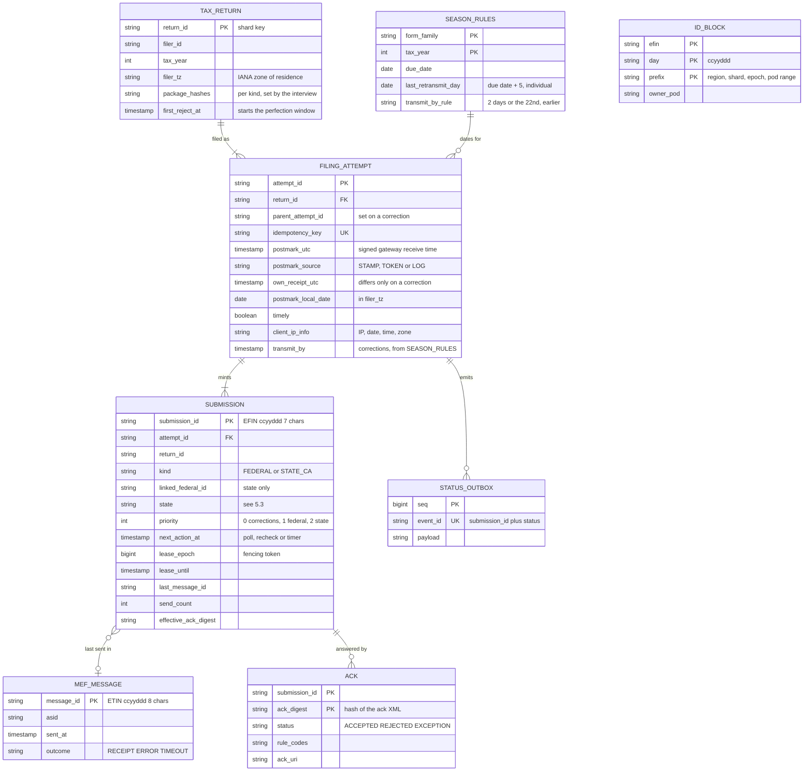

Access patterns that justify it:
- **Everything for one return lives on one shard**, keyed by `hash(return_id)` over 4 shards. The File transaction, the federal-accept-releases-state transaction and the correction are all single-shard. No distributed transaction anywhere.
- **File** (every click): compare the request's package hashes with `TAX_RETURN.package_hashes`, then insert `FILING_ATTEMPT` (unique `idempotency_key`), its `SUBMISSION` rows and an outbox row in one transaction. A partial unique index on `(return_id, kind)` over non-final submissions enforces **one open submission per return and kind**, so a state-only resubmission can open while the federal stays accepted. An attempt's status is derived from its submissions.
- **Claim work** (transmitter, per shard): `SELECT ... WHERE state = 'QUEUED' ORDER BY priority, postmark_utc LIMIT 100 FOR UPDATE SKIP LOCKED`, on a partial index over queued rows only. The database is the queue (§4.2 says why not Kafka).
- **Due for an ack poll, a status recheck or a timer**: partial index on `(next_action_at)` over `RECEIPTED`, `UNKNOWN` and `WAITING_FEDERAL` rows; the sweeper adds `SENDING` rows whose `lease_until` has passed.
- **State release** (every federal accept): `UPDATE SUBMISSION SET state = 'QUEUED', linked_federal_id = :fed WHERE attempt_id = :a AND state = 'WAITING_FEDERAL'`, in the ack's transaction.
- **Ack match**: by `submission_id`; the shard comes from the ID's sequence prefix. `ACK` is keyed `(submission_id, ack_digest)` so a second, different ack for one ID is kept, and `SUBMISSION.effective_ack_digest` says which one the filer sees.
- **Postmark evidence**: the attempt row plus an immutable copy in the evidence bucket (S3 Object Lock), kept at least to the end of the calendar year as Pub 1345 requires; we keep 7 years [estimate of Intuit policy].
- **ID minting**: a pod leases a block of 10,000 sequence values for `(efin, day, prefix)`; at ~20 mints/s per pod a block lasts ~8 min. The prefix encodes region, shard and the promotion epoch, so two regions never mint the same ID, a promoted replica that lost the last lease writes cannot hand a block out twice, and the ID tells the reconciler which shard owns it. Message IDs carry the same epoch.
- **Dates**: every window check reads `SEASON_RULES` for the return's form family and tax year.

---
## 4. High-level design

One subsection per functional requirement. Each traces input to output through the boxes, adds the boxes it needs to one diagram, and ends with what is still missing. The design at the end of §4 is deliberately the simple version; §5 breaks it.

### 4.1 File: postmark it, mint its IDs, say "received" in under 2 s

**What breaks (compressed ladder).**
- **Send to the IRS inside the click.** The filer's "on time" would depend on MeF, whose calls can take long enough that the IRS recommends a 30-minute client timeout. At 280 clicks/s and a 60 s MeF call, 16.8k requests would hang open at 11:59 PM, and MeF has no idempotent send to retry against. Dead on arrival.
- **Answer "received" after an in-memory enqueue.** Fast, but a pod crash loses returns we already told filers we had. "Received" is a legal claim: the postmark must be durable before we say it.
- **Chosen: one durable transaction is the commit point.** The postmark, the attempt and the pre-minted submission IDs commit together in the filing DB, replicated across 3 AZs before the commit returns. Everything after that is asynchronous.

**Flow: Maya in Oakland clicks File at 11:58:41 PM Pacific on April 15.**

1. Before the click (not on our hot path), the tax interview has built her federal return and her California return as MeF XML, checked them against the IRS schemas and the business rules it can evaluate, taken her Self-Select PIN signature, written each package to the package store under its SHA-256, and recorded each hash on the `TAX_RETURN` row.
2. The app sends `POST /v1/returns/r_42/file` with `Idempotency-Key: k1` and the two package hashes.
3. The API gateway authenticates her session, stamps the **receive time**, `06:58:41.120Z` on April 16 in UTC, and signs it as a receipt token bound to `(r_42, k1, package hash)`. It also captures her computer's public IP address, date, time and time zone, which Pub 1345 requires in the return. The stamp is the postmark if the commit succeeds, or if a retry replays the token (§5.2).
4. Filing intake checks that Maya owns `r_42`, that both hashes match the ones on the `TAX_RETURN` row (no S3 call), and that `r_42` has no open federal or California submission.
5. Intake mints two submission IDs from its leased block: federal `12345620261050A7K29Q` (EFIN `123456`, 2026, day 105, sequence `0A7K29Q`) and California `12345620261050A7K29R`.
6. One transaction on shard 2: a `FILING_ATTEMPT` with `postmark_utc = 06:58:41.120Z`, `filer_tz = America/Los_Angeles`, `postmark_local_date = 2026-04-15`, `timely = true`; the federal `SUBMISSION` as `QUEUED`; the California one as `WAITING_FEDERAL`; one outbox row `filing.received`. Commit.
7. Intake answers `202 RECEIVED`, "Postmarked April 15, 2026, 11:58:41 PM Pacific". ~90 ms p50.

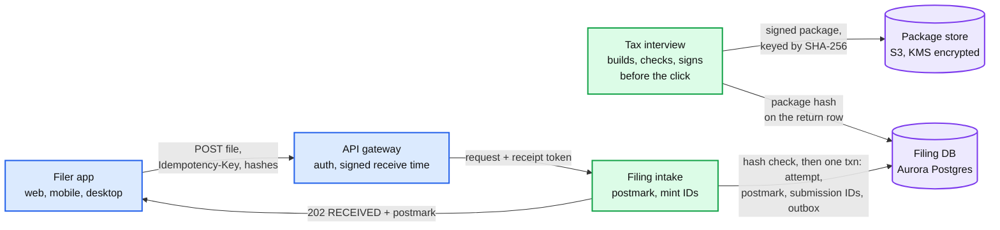

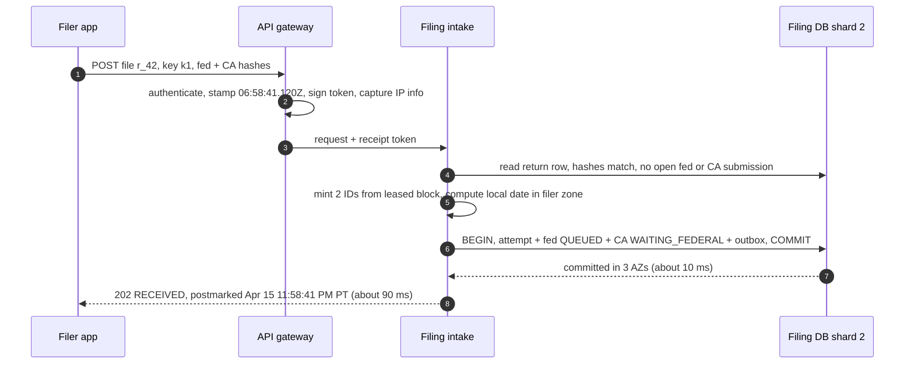

Data model so far: `TAX_RETURN`, `FILING_ATTEMPT`, `SUBMISSION`, `STATUS_OUTBOX`, `ID_BLOCK`, `SEASON_RULES`.

**Validation at the click must never be stricter than the IRS.** At 11:59 PM, blocking a return on a rule our pre-check thinks will fail costs the filer the postmark. Sending it and letting the IRS reject it costs nothing if they fix it inside the perfection window, because the corrected return keeps the first reject's date (§4.4). So the click blocks only on what makes a package unsendable (missing signature, schema-invalid XML, a missing state package). Everything else was already surfaced during the interview.

**What is still missing:** nothing is sent to the IRS. §4.2.

### 4.2 Transmit: package, batch, send each submission exactly once

**What breaks (compressed ladder).**
- **One submission per call.** At L = 5 s that is 0.2/s per session: 500/s needs 2,500 sessions, 500 ASIDs. Batching 100 per call cuts it to 25 sessions.
- **Mint a new submission ID on each retry.** A timeout where MeF actually stored the message leaves two copies of Maya's return at the IRS: a duplicate reject at best, a confusing double record at worst. The ID is minted once, at the click (§5.3).
- **Kafka between intake and transmitter.** Push back on the textbook. Kafka is great at buffering, but the buffer is not the problem: 3 M rows a day is 35/s. The problem is a per-submission state machine with a state Kafka cannot express (`UNKNOWN`: neither done nor safe to retry), priority reordering (corrections first, oldest postmark first) and per-item leases. The filing DB already holds that state, so it is also the queue. Kafka appears later only for fan-out of status events, where at-least-once plus dedup is fine.
- **Chosen: permit, claim, then send, under a lease.** A worker first takes a session permit from the send limiter, then claims up to 100 rows with `FOR UPDATE SKIP LOCKED`, marks them `SENDING` with a lease and a fencing epoch, commits, and only then sends. The claim is durable before any byte leaves, and it never waits on the limiter (the epoch fences our database, not MeF, §5.3).

**Flow: Maya's federal return goes out.**

1. A transmit worker for shard 2 takes a session permit from the **send pool** (ASID `a07`, session 3 of 5; Login happened earlier), then claims up to 100 `QUEUED` rows ordered by `(priority, postmark_utc)`: Maya's federal submission and 99 others. It sets `state = SENDING`, `lease_epoch = 7`, `lease_until = now + 35 min` (longer than the 30-minute MeF timeout), assigns message ID `54321202610500012345` (its 8-character tail carries region, epoch and sequence), inserts the `MEF_MESSAGE` row, and commits.
2. The packager reads each package from S3 and writes the submission manifest (submission ID, Intuit's EFIN), the postmark element and the filer's IP information into the return header, zips each submission, and puts the 100 zips in one container zip. Same inputs, same bytes: a resend is byte-identical.
3. Right before the call the worker checks `lease_until - now` is over 32 minutes (the timeout plus 2); if not, it does not send. Then `SendSubmissions`.
4. MeF answers in ~5 s with a receipt for the message.
5. The worker writes, still guarded by `lease_epoch = 7`: each submission becomes `RECEIPTED` with `receipted_at` and `next_action_at` (first ack poll), the message outcome is `RECEIPT`, and an outbox row `filing.transmitted` goes out. Maya's status page now says "Sent to IRS".
6. If the call errors instead, only a definite "nothing processed" answer (an envelope, manifest or schema reject: "When a transmission is rejected... All submissions must be resubmitted") sends the rows back to `QUEUED` with the **same** IDs. System exceptions (`MEF00001`, `00002`, `00003`, `00005`), a reset after the body was sent, and a timeout mean we do not know: the rows go to `UNKNOWN` (§5.3). A wrong `UNKNOWN` costs one status call; a wrong `QUEUED` costs a duplicate send.

**Federal before state.** Maya's California submission is `WAITING_FEDERAL`. It is not claimable. It becomes `QUEUED`, linked to the federal ID, in the same transaction that records the federal accept (§4.3). Why wait instead of sending both in one message:
- For a linked state return, "the IRS will check to see if there is an accepted IRS submission under that Submission Id. If there is not... the IRS will reject the State submission" (Pub 4164 §3.2), with status `DENIED BY IRS`. The note says the federal must be accepted "at the same time, or before" the state is forwarded, but how MeF orders two submissions inside one message is not documented [unverified], and at peak the federal ack can take 2 h.
- A denial burns a state submission ID, sends the filer a scary "state rejected", and needs a resubmission anyway.
- The cost of waiting is small: the state is delayed by the federal ack time (~2 min normally, up to 2 h at peak), and MeF says state acks take 12 to 24 h regardless. The state's postmark is set at the click, so waiting does not make it late.
- Why linked and not unlinked by default: a linked return gets MeF's check that the state's SSN matches the accepted federal return, and most states expect the Fed/State pairing. Unlinked is the escape hatch (§4.4).

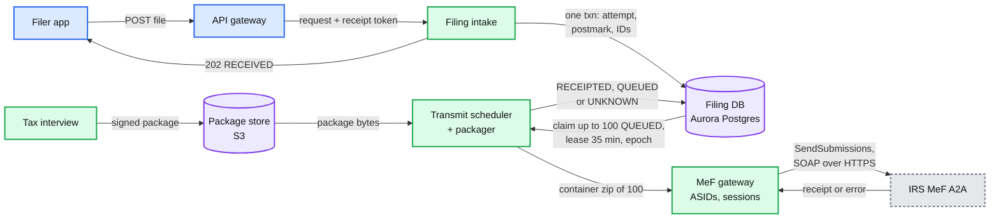

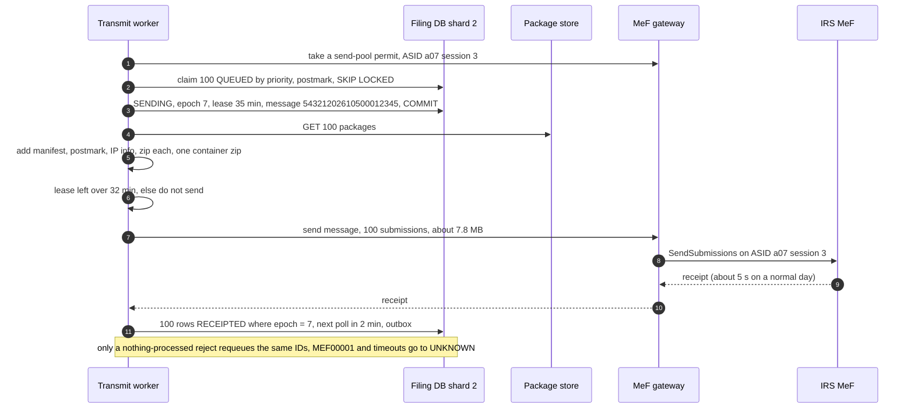

Data model so far: plus `MEF_MESSAGE`.

**What is still missing:** a receipt only says MeF has the message. Whether Maya's return is accepted comes later, as an ack we must go and fetch, and the California return is still waiting on it. §4.3.

### 4.3 Acknowledge: fetch every ack, release the states, tell the filer

**What breaks (compressed ladder).**
- **`GetNewAcks` in a loop.** It returns acks "not previously retrieved by another GetNewAcknowledgements": a destructive read. A lost response must be recovered with `GetAcksByMsgID` and the message ID of the lost request, and MeF "strongly recommends all transmitters use the Get Acks service and not the Get New Acks service". We know which IDs we sent, so we ask for them by ID.
- **Poll every outstanding ID often.** At peak the ack lag is a spread, not a line (median ~30 min, p99 ~4 h in the model; Pub 4164 says "most" within 2 h). Asking about every ID every 2 minutes is ~23 ID-polls per ack, 12.8 calls/s, ~128 sessions, mostly empty answers, the waste MeF says it watches for. Every 5 minutes still needs ~56 sessions (~11 ASIDs) for a p99 of 4.9 min.
- **Poll the frontier.** An ID is first asked about once it is older than the median age of recent acks (at least 2 min), oldest first, then on MeF's backoff. Acks do **not** come back in order, so this is ~6.5 ID-polls per ack, calls ~15% full, **~3.6 calls/s and ~36 sessions** at peak, and a stale p99 of ~26 min. Off-peak every schedule costs under 0.05 calls/s and meets 5 min ([`deep-dives/ack-reconciliation.md`](deep-dives/ack-reconciliation.md) §3).
- **Chosen: `GetAcks` by ID, 500 per call, frontier-first, on its own session pool, with the SLO stated honestly:** p99 5 min off-peak, 30 min in the deadline week. Buying 5 minutes at peak costs ~11 federal-ack ASIDs and, in the reject model, moves acceptance by April 20 from 94.77% to 94.81%: freshness is experience, not law. Past 2 h, an ID is checked with `GetSubmissionsStatus` once an hour and fetched only when it says `ACKNOWLEDGED`. The ack, the state release and the notification event commit in one transaction.

**Flow: Maya's federal ack, then California's.**

1. The ack reconciler for shard 2 selects up to 500 `RECEIPTED` federal submissions with `next_action_at <= now`, oldest first. Federal and state IDs never share a request; MeF asks for that explicitly (§14.2.5).
2. It calls `GetAcks` through the **ack pool** (its own ASIDs, so a slow send pool never starves ack retrieval).
3. MeF returns the acks that exist: Maya's is `Accepted` at 00:01:12 Pacific on April 16. IDs with no ack yet get `next_action_at` pushed out: +2 min, then +30 s per empty answer, up to every 5 min, which is MeF's own retry cadence (§14.2.2).
4. One transaction per ack: insert `ACK` keyed `(submission_id, ack_digest)` (a repeated fetch is a no-op; a different second ack is kept), set the effective ack, move the federal submission to `ACCEPTED`, and because it is a federal accept (or the 1040 `Exception` status, which also means accepted), move California from `WAITING_FEDERAL` to `QUEUED` with `linked_federal_id = 12345620261050A7K29Q`. Outbox rows: `filing.accepted`, `state.released`.
5. The outbox relay publishes to Kafka `filing-status` (keyed by `return_id`). The notifier dedups on `event_id` and sends email and push: "Your federal return was accepted." The status page reads the DB.
6. California goes out in the next transmit claim (§4.2). Its ack is first polled 12 h later, because "states must retrieve state returns from MeF, process the returns, and return the state acknowledgement" and MeF says to "wait 12 to 24 hours" (§14.2.3). Then the same steps: `ACK`, `ACCEPTED`, notify.

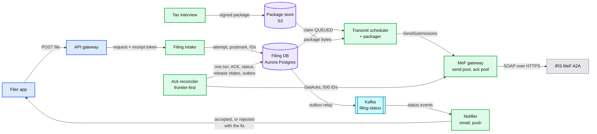

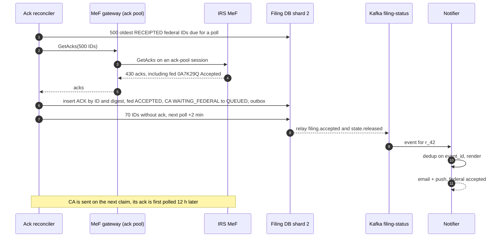

Data model so far: plus `ACK`.

**Filer-visible statuses.** One status per submission, derived from its state: `RECEIVED` (postmark shown), `SENT` (`RECEIPTED`), `ACCEPTED` (including Exception, with a line that the IRS will send a notice), `REJECTED` (action needed, the rule, the field, the deadline), and for each state `WAITING_FOR_FEDERAL`, `SENT`, `ACCEPTED`, `REJECTED`. Internal states (`SENDING`, `UNKNOWN`, `ESCALATED`) all show as `SENT`, plus a "the IRS is slow tonight, your postmark is safe" banner when the backlog is old (§5.5). The lifecycle is in [`diagrams.md` D8](diagrams.md#d8-state-machines). Refund status after acceptance is [#45](../README.md).

**What is still missing:** a reject. Maya's return could come back at 1 AM on April 16 with a dependent's SSN that does not match IRS records. §4.4.

### 4.4 Fix and resubmit inside the perfection period

The rule, exactly: a rejected individual return "submitted on or before the due date" whose corrected version is **accepted by the fifth calendar day after the due date** is "deemed to have been received on the date of the first reject" (Pub 4164 §1.5.2). For tax year 2025 that is **April 20, 2026**, listed as the "last day for retransmitting rejected timely filed Form 1040 family returns". These dates are **data**: the due date moves past weekends and Emancipation Day (April 18 in 2023), so every check reads `SEASON_RULES` (due date, last retransmit day = due + 5, the transmit-by rule, perfection days). The transmitter keeps the original postmark for a corrected return received through that date, and must transmit it "within two days... or the twenty second day of the respective month..., whichever is earlier" (Pub 1345). If the filer gives up on e-file, a paper return is timely if filed by the later of the due date or 10 calendar days after the reject notice.

**What breaks (compressed ladder).**
- **Resend the corrected return under the rejected submission ID.** MeF's manifest check says a submission ID "should not be a duplicate of another SubmissionId". Rejected IDs are dead; a correction is a new attempt with new IDs.
- **Treat the correction as a fresh filing.** Its own receipt time is April 17, so it gets an April 17 postmark and Maya is late. The correction must inherit the first attempt's postmark.
- **Chosen: attempt lineage.** `FILING_ATTEMPT.parent_attempt_id` links the correction to the rejected attempt; `postmark_utc` is copied from the root of the chain while the window is open; `own_receipt_utc` records when we actually got the correction; `TAX_RETURN.first_reject_at` records the date the IRS will treat as the filing date.

**Flow: rejected at 1:04 AM Pacific on April 16, fixed on April 17.**

1. The reconciler records the `Rejected` ack with rule `R0000-504-02` (a dependent's SSN and name do not match IRS records), sets `first_reject_at`; the federal submission is `REJECTED`, so the attempt reads as rejected. California stays `WAITING_FEDERAL`. Outbox: `filing.rejected`.
2. The notifier sends, within minutes, what Pub 1345 requires a transmitter to tell the taxpayer: that the IRS rejected the return, the date, the business rule and its meaning, the steps to fix it, and the paper-filing option. The **reject helper** adds a plain-language explanation and points at the field (§12 has its guardrails).
3. On April 17 Maya fixes the dependent's name in the interview, which rebuilds and re-signs both packages (the state return may change too).
4. The app calls `POST /resubmit` with `parent_attempt_id`. Intake checks the parent is rejected and the window is open: before the **earlier** of Maya's and Eastern midnight on the season's last retransmit day (the IRS's acceptance date is on its own clock). It creates attempt 2 with `postmark_utc` = the original `06:58:41.120Z`, `own_receipt_utc` = now, `transmit_by` = the earlier of receipt + 2 days and the end of the 22nd, mints a new federal and a new state ID, and marks attempt 1's unsent California submission `SUPERSEDED`. The new federal submission gets `priority = 0`; the sweeper pages if any `transmit_by` is under 6 h away.
5. Transmit and ack exactly as in §4.2 and §4.3. Accepted on April 17: Maya's return is deemed received on April 16, the date of the first reject, and her April 15 postmark stands. California is released on that accept.
6. After the cutoff the window is closed: the UI says so before the click, and a resubmission gets its own receipt time as its postmark.

The IRS texts differ at the edge: Pub 4164 says the correction must be **accepted** by the fifth day, and also lists that day as the last for **retransmitting**. Design to the strictest (accepted by then): corrections go out within minutes and the UI asks filers to finish a day early [interpretation, not an IRS rule]. In years when the due date moves (April 18 in 2023), the 22nd-of-the-month rule closes the window before the fifth day: a correction received on the 23rd cannot keep its postmark, so the rules table closes the UI on the 22nd ([`deep-dives/reject-fix-resubmit-and-state-returns.md`](deep-dives/reject-fix-resubmit-and-state-returns.md) §3).

**Escape hatches.**
- **Three rejects.** Pub 1345 tells transmitters to contact the IRS e-Help Desk if a return "has been rejected after three transmission attempts". The third reject routes the case to a human (support plus e-file operations).
- **The federal is never fixed.** Without help, the linked state waits forever and is silently never filed. Each `WAITING_FEDERAL` row gets a timer: remind the filer 2 days after the federal reject, and on the day before the last retransmit day prompt "send the state unlinked or file it on paper". `send-unlinked` makes MeF do minimal validation and pass it to the state; Pub 1345 lists when a state-only return is accepted (separately originated, part-year, non-resident, filed separately while the federal was joint, or previously rejected by the state); per-state rules vary [unverified per state]. The sweeper's completeness check counts `WAITING_FEDERAL` rows past their timer.
- **State rejected after a federal accept.** Uniqueness is per (return, kind), so a state-only attempt can open while the federal stays accepted; it links to the accepted federal ID and is `QUEUED` at once.
- **The return is right and the IRS record is wrong.** For the two rules Pub 4164 names (R0000-504-02 and SEIC-F1040-501-02), the filer can resubmit with the imperfect-return indicator; the IRS then accepts with status `Exception` and sends a notice.

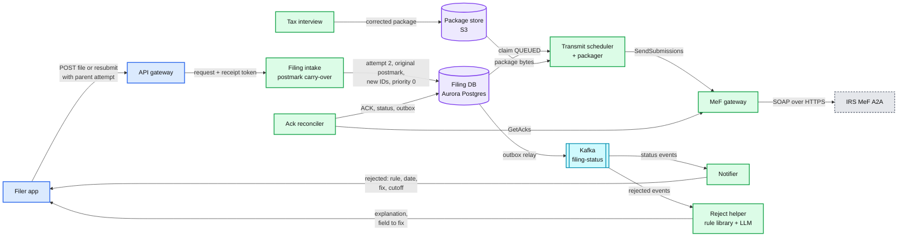

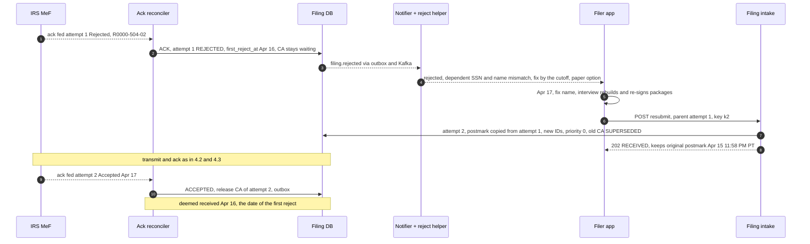

Data model so far: complete (`parent_attempt_id`, `own_receipt_utc`, `transmit_by`, `first_reject_at`, `SUPERSEDED`, `SEASON_RULES`).

**What is still missing:** all of it is §5. The click depends on one database primary at 11:59 PM (§5.1, §5.2). A timeout or a crashed worker leaves submissions in a state nobody owns (§5.3). Nothing limits how hard we push MeF when it slows down, and 200 sessions may not be enough (§5.4, §5.5). And nothing notices a submission whose ack never comes (§5.6).

---
## 5. Deep dives

One per non-functional requirement, phrased as the interviewer's question. Each names what breaks in the §4 design with a number, fixes it, and lists what changed in the API, the data model and the diagram.

### 5.1 "Say 'received' in under 2 s at 1,000/s, on the one night that matters"

**What breaks in the current design.**
1. **Reactive autoscaling is too slow for a deadline.** Pod autoscaling reacts in minutes, and new nodes take minutes more. The File rate climbs from ~35/s to ~500/s in the last minutes before each zone's midnight, while the rest of TurboTax goes from 5K to 300K TPS in two hours. If File waits for the autoscaler, the 503s land at 11:58 PM.
2. **Heavy work in the click.** Building the MeF XML and validating it against the schemas costs tens to hundreds of milliseconds of CPU per return [estimate]. Doing it at the click multiplies the CPU we need at the one moment we least have it.
3. **A shared counter for submission IDs.** One sequence row updated per mint serializes every click: at ~1 to 2 ms per locked update, one row tops out around 500 to 1,000 mints/s, right at our design peak.
4. **Shared pools.** Right after a wave of Files, filers refresh their status and the notifier fires. If File shares pods and connection pools with those reads, the reads slow the writes.

**The fix.**
- **Calendar pre-scale, not autoscale.** From April 1 the intake runs at the 1,000/s design point (2x the expected peak), proven by a load test in March, with a change freeze until April 20. Autoscaling stays on above that floor, as a second line.
- **Pre-build the package.** The interview builds, validates and signs the package on the review screen, minutes before the click, stores it content-addressed, and writes its hash on the return row. The click compares hashes inside its own transaction: no S3 call on the hot path.
- **Leased ID blocks.** Each intake pod leases 10,000 sequence values per `(EFIN, day, region, shard and epoch prefix)`. No shared row on the hot path; a lease is one small write every ~8 minutes per pod. The 7-character sequence space is large: even numeric only, 10 M values per EFIN per day, against ~3 M submissions on the peak day.
- **A File lane.** File and resubmit run on their own pods and their own database connection pool. Status reads go to replicas (except the filer's first read after File). Shed order under pressure: marketing and recommendations first, then PDF copies, then status-page refresh rate. **Never shed File, resubmit, or postmark lookups.**
- **Our own deadline.** Intake gives each File request 1.5 s end to end; past it, the filer gets `503` with the signed receipt token (§5.2), never a lost stamp.

Latency budget for one File click (p50 / p99):

| Step | p50 | p99 |
|---|---|---|
| Edge: TLS, WAF (web application firewall), session check, signed receive-time stamp | 10 ms | 60 ms |
| Ownership, hash and open-submission check (primary, indexed) | 3 ms | 30 ms |
| Mint IDs from the leased block | under 1 ms | 1 ms |
| One transaction, committed across 3 AZs | 10 ms | 80 ms |
| Response | 10 ms | 60 ms |
| **Total** | **~35 to 60 ms** | **~250 ms** |

**Push back on the textbook answer.** "Rate-limit the File endpoint to protect the backend." A 429 at 11:59 PM is a late return. The thing to rate-limit is everything else: shed reads and non-essential features, keep File's capacity reserved, and rate-limit File only per account (5 attempts a minute, and Pub 1345's cap of five returns per e-mail address) to stop scripted abuse, never globally.

**What changed:** the package contract with the interview team (built and signed before the click, hash on the return row); `ID_BLOCK`; a separate File lane with its own pool; the April 1 pre-scale and freeze. Deep dive: [`deep-dives/postmark-and-peak-intake.md`](deep-dives/postmark-and-peak-intake.md).

### 5.2 "Zero lost returns, and still a postmark when the database fails over at 11:59 PM"

**What breaks in the current design.**
1. **The click depends on one shard primary.** An Aurora writer failover takes ~30 s [estimate]. One shard sees a quarter of the clicks: a failover starting at 11:59:40 PM Eastern blocks **~1,300 clicks**, ~1,900 if it starts 30 s before midnight (the model in [`deep-dives/postmark-and-peak-intake.md`](deep-dives/postmark-and-peak-intake.md) §8). Their apps retry after the failover, and a retry that gets a **new** receive time after local midnight is a late return for someone who clicked in time.
2. **The stamp exists before the commit.** The gateway mints the receive time first. If the commit then fails, nothing durable remembers it.
3. **Region loss.** If the home region's database is unreachable, File is down for everyone homed there until a replica is promoted.
4. **"Durable" needs a definition.** Aurora's commit is durable across 3 AZs, which meets the README. The cross-region copy is asynchronous (~1 s [estimate]).

**Rejected fix: a second commit target.** Writing the attempt to an S3 "intake journal" when the database is slow, and adopting it later, gets the postmark right but costs more than it saves: the journal becomes a second source of attempts; a client retry that commits in the database before adoption creates two attempts for one return (possibly with different content); under a cross-region partition, region A cannot see region B's journal, so it either stops sending or risks two submission IDs for one SSN at the IRS. It guards an expected **0.005 to 0.02 late filers per season** [model], and it only runs on bad nights, so it rots.

**The fix: a signed receipt token. The client is the second copy.**
- The gateway signs `{return_id, idempotency_key, package_sha256, receive_utc, gateway_host}` with a KMS-backed key only it holds, logs the stamp, and passes it to intake.
- If intake cannot commit within its budget, it answers `503` with the token: "We have your filing time, 11:59:57 PM. Finishing up." The app retries with the same key and the token.
- On the retry, intake uses the token's stamp as the postmark if the signature is valid, the return, key and package hash all match, and the token is under **2 h** old (long enough for a failover and an app restart, far inside the 2-day IRS condition, which starts at the stamp). Otherwise the new request's own stamp is the postmark.
- Nothing is written anywhere until the one transaction commits, so there is still exactly one source of attempts and one set of submission IDs. A retry whose first commit did land finds the attempt by its key.
- **A lost token.** The app keeps the idempotency key and the token in local storage until it sees `202`, so a reopened page within 2 h recovers it. Past that (the filer closed the page and came back later, or switched device), the gateway's signed stamp log is a **support-only** remedy: e-file operations can attach the logged stamp as the postmark through a ticket (`postmark_source = LOG`, the log line copied to the evidence bucket). There is no automatic hold or log lookup on the claim path; it would back a rare double failure with permanent complexity.
- **The SLO splits** (README): 99.99% of clicks **postmarked at their first click** (the legal outcome), 99.9% answered `202` within 2 s (the experience). One peak failover spends ~1,950 of a single 99.99%-in-2 s budget of ~4,500 for the whole season; that target measured the wrong thing.
- **Writers spread across AZs.** At most 2 of the 4 shard writers share an AZ, so an AZ loss blocks at most half the clicks for ~30 s, never all of them ([`diagrams.md` D9](diagrams.md#d9-deployment--topology)).
- **Region loss.** File waits for the replica promotion (minutes [estimate]); tokens keep every postmark taken meanwhile. The interview writes packages to both regions before enabling File, so region B can check hashes. ID blocks and message IDs carry an epoch bumped on every promotion, so a promoted replica that lost the last lease writes never reissues IDs.
- **What we refuse:** a synchronous cross-region commit on every click (~70 ms [estimate] and a two-region dependency). We accept an RPO of ~1 s **only** for physical destruction of a region.

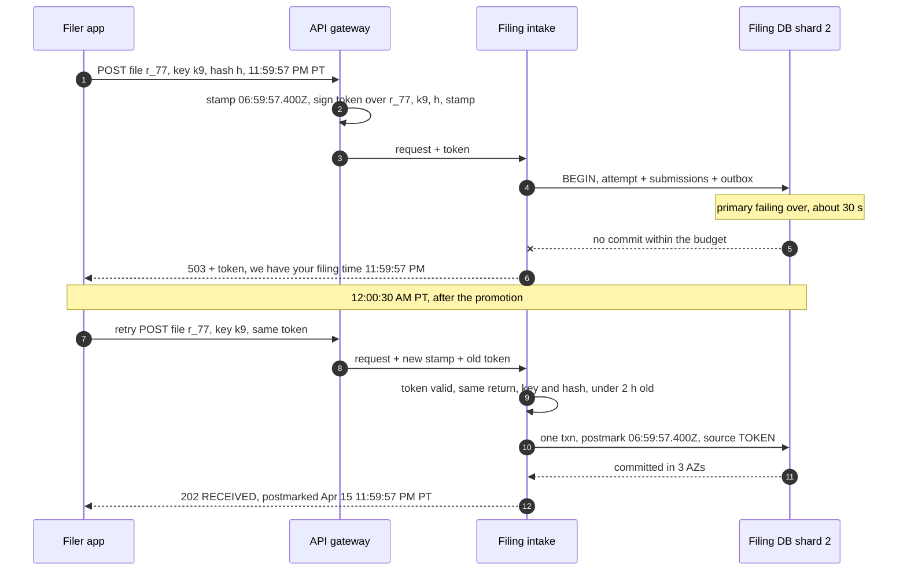

**What changed:** the receipt token, `FILING_ATTEMPT.postmark_source`, the split SLO, writers spread over AZs, epoch-bearing ID and message prefixes, packages written to both regions. No new box in §6. Deep dive: [`deep-dives/postmark-and-peak-intake.md`](deep-dives/postmark-and-peak-intake.md) §4 to §6.

### 5.3 "Never two IRS submissions for one attempt, even when a send times out"

**What breaks in the current design.**
1. **The timeout.** `SendSubmissions` for 100 submissions gets no answer in 30 minutes. MeF may have stored all 100, none, or (we assume) some. Resending all 100 risks 100 duplicates; dropping them risks 100 unfiled returns.
2. **A worker dies mid-call.** Its 100 rows sit in `SENDING`. If the lease expiry puts them back to `QUEUED`, another worker resends them without knowing whether the first call landed.
3. **A zombie worker.** A worker paused by a long garbage collection, or one whose claim waited on the limiter past its lease, wakes up after the sweeper moved its rows. The epoch stops its database write, but **nothing stops it from sending**: MeF does not check our epoch.
4. **The status store lags the portal.** At peak, MeF's delay is "between the MeF portal and backend". A message can sit in the portal while status says not found for an hour. In the model, two not-found answers 10 minutes apart resend **568 of 771** timed-out messages whose first copy still lands ([`deep-dives/exactly-once-submission.md`](deep-dives/exactly-once-submission.md) §5).
5. **A new ID "to be safe".** Minting a fresh ID for a resend turns an unknown into a guaranteed duplicate return if the first copy landed.

**The fix: a state machine with one rule. From `UNKNOWN` the only exit is a status answer that MeF has provably caught up to.**
- `SENDING` rows carry `lease_epoch`. Every write after the call is `UPDATE ... WHERE submission_id = ? AND lease_epoch = ?`, so a zombie's write matches zero rows ([`../../concepts/leases-fencing-clocks.md`](../../concepts/leases-fencing-clocks.md)). Because the epoch fences only our database, a worker takes its session permit **before** it claims, and refuses to send with under 32 minutes of lease left (§4.2).
- A timeout moves the rows to `UNKNOWN`. So does an expired lease: the sweeper moves `SENDING` rows whose `lease_until` passed to `UNKNOWN`, **never to `QUEUED`**, because the dead worker's call may have reached MeF.
- `UNKNOWN` rows get `GetSubmissionsStatus` on the status pool every 10 minutes, in batches (the per-call cap for transmitters is not stated in Pub 4164 [unverified]; we use 100). Found (`RECEIVED` or later): `RECEIPTED`. Not found: the rows go back to `QUEUED` with the **same** submission IDs only after two not-found answers **and** a **watermark**: MeF has stored a message we sent at least 5 minutes after this one (a later receipt, or a later ID found by status). That is evidence its backend has moved past our send time. In the model this cuts duplicate sends from 568 to 13 of 771 when MeF's backend drains in order, and halves them when it does not; genuinely lost messages are resent after 40 to 70 minutes at peak, 40 off-peak. If the status call fails, the rows stay `UNKNOWN`. Nothing ever resends from `UNKNOWN` directly.
- **Liveness of the watermark.** If two not-founds arrive but no watermark appears within **6 h**, the rows go to `ESCALATED` (IDs to the MeF Mailbox, e-file operations owns them), never to a blind resend. After an outage, the breaker's probe receipt counts as the watermark, so the drain is not stuck waiting for a later message.
- **Resends travel alone.** Rows coming back from `UNKNOWN` go out in their own messages, never mixed with fresh rows, because a duplicate ID may reject the whole message [unverified].
- IDs are minted once, at the click. A rejected ID is never reused. A correction is a new attempt with new IDs (§4.4).
- **If a same-ID copy still slips through, MeF stops it:** business rule **T0000-014**, "The Submission ID must be globally unique" (Incorrect Data, Reject and Stop, Pub 4164 Table 5-2). Resends are byte-identical, so whichever copy MeF validates first is the return; a T0000-014 on a resent ID is **proof the first copy landed**. It is stored as a second ack (`ACK` is keyed by ID and digest), never becomes effective, is never shown to the filer, and is alerted on by rate (above 1% of resends). A T0000-014 on an ID we sent **once** means our IDs are not unique, and pages. ("Duplicate Condition" is a different category: a whole return already accepted under another ID, which only a second ID can cause.) Any `Accepted` or `Exception` ack wins over a business-rule reject for the same ID.

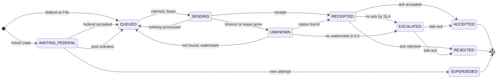

`ACCEPTED` includes the 1040 `Exception` status. A state's `DENIED BY IRS` lands in `REJECTED`.

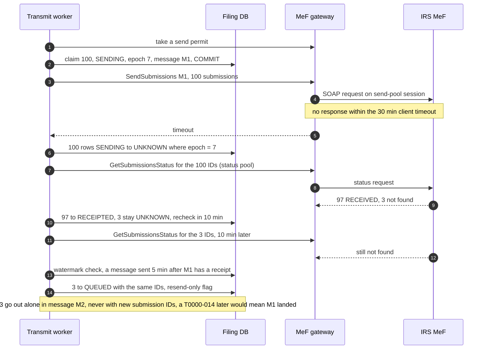

**Push back on the textbook answer.** "Use an idempotency key." MeF has none, but it has something close: it stores each submission ID once and rejects a second copy under T0000-014. So correctness comes from **one ID, minted once, and byte-identical resends**; the status and watermark rules only keep duplicate sends (and the IRS's attention to wasted traffic) rare. MeF's `MEF00004 DuplicateMessageID` protects a repeated message ID, which we never reuse anyway. Exactly-once here is a **protocol**: one ID; permit, claim, fence; status plus watermark before resend; read T0000-014 as "landed".

**What changed:** `lease_epoch`, permit-before-claim, `UNKNOWN` and `ESCALATED` states, the status pool, the watermark rule, resend-only messages, `ACK` keyed by digest with an effective ack. Deep dive: [`deep-dives/exactly-once-submission.md`](deep-dives/exactly-once-submission.md). The idempotency story hop by hop is §10.5.

### 5.4 "Drain ~500/s into an IRS channel whose latency goes from seconds to minutes"

This is where the design breaks first.

**What breaks in the current design.**
1. **The session count is a hard ceiling.** `T = S × B ÷ L`. With B fixed at 100 by MeF, our only lever is S, and S comes in steps of 5 per enrolled ASID. The table in §2: 500/s needs 25 sessions at 5 s, 200 at 40 s, 1,500 at 5 minutes.
2. **One hung call holds a session for up to 30 minutes.** MeF recommends a 30-minute client timeout because its own portal-to-backend hop times out at peak. Every call in that state removes one session from the pool for its whole duration. With 200 sessions and 30-minute hangs, throughput falls to `200 × 100 ÷ 1,800 s = 11/s`.
3. **Unlimited concurrency makes it worse.** If MeF can absorb C submissions/s for us, Little's law says in-flight work beyond `C × L` just queues inside MeF: latency rises, timeouts rise, and each timeout creates 100 `UNKNOWN` rows that need status calls, which need sessions. That is a retry storm we caused.
4. **Crashed pods leak sessions.** A session is tied to a SAML assertion. `Logout` clears it, but a session dies after 15 minutes idle, and "if client sends a logout to a session who's SAML is expired this logout will fail and the session will remain stale" until MeF's nightly cleanup (Pub 4164 §14.1). A pod that crash-loops can hold all 5 sessions of its ASID for the rest of the night: "Session Limit Reached".
5. **Sends and acks share sessions.** If ack polling runs on the same sessions as sends, a slow send night also delays every reject notice, and rejects are what the perfection window needs early.
6. **The obvious limiter is wrong.** "Grow while p90 latency is under 30 s" treats a slow MeF as a congested one. After an outage MeF may come back healthy at 60 s per call; that rule then sits at 10 calls (`10 × 100 ÷ 60 ≈ 17/s`, below the evening's arrivals) for hours, and "+1 per round trip" takes 190 round trips to reach 200.

**The fix.**
- **Size the pools from the formula.** 40 ASIDs for sending (200 sessions): 500/s while MeF answers within 40 s, 4,000/s at 5 s, only 48/s at MeF's own "within seven minutes". Acks: 8 federal ASIDs (40 sessions for the ~36 the frontier needs at peak, §4.3) and 2 state, never in the same request. 2 ASIDs for status calls, 2 spare. **~54 ASIDs** [estimate]. We refuse the ~11 federal-ack ASIDs a 5-minute peak ack SLO would need.  Pub 4164 lets an organization enroll several ASIDs; whether MeF caps ASIDs per transmitter is not stated [unverified], so e-file operations confirms the count with the IRS every autumn. ETINs are not the throughput lever (sessions are per ASID); one per product line is plenty, and the message-ID sequence (8 characters per ETIN per day) is far from full at ~30k messages a day.
- **Adaptive concurrency on relative latency** (AIMD: additive increase, multiplicative decrease, with the TCP Vegas signal). The limit moves between 10 and 200 in-flight calls. It grows +0.5 per completed call, only while the limit is actually in use and latency stays within **1.5x the recent minimum** (10-minute window), so a slow but healthy MeF still gets concurrency (10 to 200 in ~8 round trips). Above 2x the minimum it cuts gently. A hung call or a system exception cuts x0.7 (at most once a minute) and **remembers that limit as a ceiling for 30 minutes**, because each probe into MeF's hang point costs a session for 30 minutes. Every 10 minutes one round runs at half the limit to re-measure the minimum. Breaker after 5 failures in 2 minutes (§5.5). Permits are taken before claims (§5.3). We push as hard as MeF answers, not as hard as we can.
- **Bulkheads.** Send, ack and status pools never borrow each other's sessions at runtime. Operations can move ASIDs between pools by config: after the send backlog drains on April 16, 20 send ASIDs move to ack retrieval for the reject wave.
- **ASID ownership with leases.** Each ASID is owned by one gateway pod at a time (a lease with a fencing epoch, ~10 s). The owner stores its session handles encrypted. A new owner calls `Logout` on its predecessor's sessions within seconds, well inside the 15-minute idle window after which a Logout fails, so a crash does not leak sessions until the nightly cleanup. (Whether MeF accepts a Logout from a different process holding the same session token is [unverified]; ATS testing confirms it.)
- **Priority, then age, across shards.** Claims order by `priority` (0: corrections in the perfection window and anything older than 24 h; 1: federal; 2: released states) and then by postmark. A free send permit goes to the **shard whose queue head has the oldest postmark**, not round robin, so the oldest return anywhere goes first. That protects the 2-day condition.
- **Messages full at peak, quick off-peak.** 100 submissions or 25 MB, whichever first; a 1 s linger when the queue is short, so a February filer is not held for a batch.

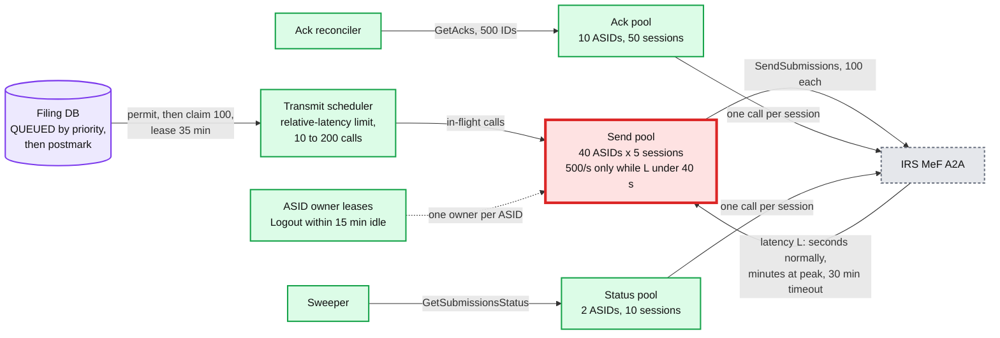

**What the deadline night looks like with 40 send ASIDs.**

| MeF call latency | Our drain rate | Deadline day's 3 M submissions | 1 h target | 2-day condition (floor ~17/s) |
|---|---|---|---|---|
| 5 s | 4,000/s (we never need it) | as fast as they arrive | met | met |
| 40 s | 500/s | keeps up with the peak minute | met | met |
| 2 min | 167/s | backlog peaks near midnight, clears in a few hours | missed for some | met |
| 5 min | 67/s | `3 M ÷ 67/s ≈ 12.5 h` | missed | met |
| 7 min (Pub 4164 §5.6) | 48/s | ~17 h | missed | met |
| 30 min (every call times out) | 11/s, and status work grows | ~3 days | missed | **missed: filers late** (Pub 4164 §1.5.3) |

**Push back on the textbook answer.** "Autoscale the transmitter." The terms we control are S (in steps of 5 per ASID, enrolled weeks ahead) and B (capped at 100). L is the IRS's. More transmitter pods without more ASIDs add nothing; more ASIDs into a saturated MeF add latency, not throughput. The Staff answer is to size the pools from the formula ahead of time, adapt concurrency to the latency MeF shows us, and make the backlog **harmless**: it sits in a durable, ordered queue, the postmark is already on every row, and the legal floor is ~17/s over two days. Only a near-total MeF failure for a day or more breaks it, and then e-file operations is on the phone with the IRS by hour 24 ([`deep-dives/irs-outage-and-backpressure.md`](deep-dives/irs-outage-and-backpressure.md) §7).

**What changed:** ~54 ASIDs in four pools; the relative-latency limiter with a hang ceiling; ASID leases with session hand-off; `priority` and oldest-head-first shard selection; byte caps on messages. The send pool is the red node in §6. Deep dive: [`deep-dives/irs-outage-and-backpressure.md`](deep-dives/irs-outage-and-backpressure.md).

### 5.5 "MeF is down for two hours on April 15. What do filers see, and what happens when it comes back?"

**What breaks in the current design.**
1. Without a limiter, 200 sessions retry into a dead endpoint. When MeF comes back, the first thing it sees is a wall of 200 full messages plus thousands of status calls: a storm at the worst moment.
2. Rows that were in flight when MeF went down are `UNKNOWN`. If the drain sends new work before resolving them, the unknowns age toward the 2-day rule.
3. The sweeper would treat thousands of un-acked submissions as failures and page everyone.

**The fix.**
- **The accept path does not notice.** File never calls MeF. Filers keep getting `RECEIVED` with a postmark. The status page shows "Sending to the IRS is delayed tonight. Your postmark keeps you on time." (Pub 1345 forbids calling it an "IRS" or "certified" postmark; the wording says "TurboTax electronic postmark".)
- **Circuit breaker per pool.** After 5 failures in 2 minutes the send pool stops; one session probes every 30 s. Ack polling pauses too (there is nothing to fetch). The sweeper suppresses "no ack yet" alerts while the circuit is open, but **not** the 2-day transmit clock, which is the filer's legal clock.
- **Drain order when the probe succeeds:** (1) status-check every `UNKNOWN` row from the moment of failure (with the watermark rule, §5.3; the probe receipt counts as the watermark), (2) priority 0, (3) federal by oldest postmark, (4) released states. The limiter restarts at 10 calls and ramps on **relative** latency, so a MeF that comes back slow but healthy still gets 200 calls within minutes.
- **How big, how long.** With the README's arrival shape (half the day ramping into each zone's midnight), 9 to 11 PM Eastern carries only **~0.24 M** submissions; the backlog keeps growing through the Eastern ramp after MeF returns and peaks at **~0.76 M**. In the reviewer's simulation (MeF back at 60 s per call, hanging past ~15k submissions in flight): **74% of the night's returns sent within 1 h, the oldest after ~2.0 h**, 27 hung calls. The absolute-latency rule sits at 10 calls (34% within 1 h, oldest 4.0 h); no limiter at all ends in ~5,900 hung calls and an 11.5 h oldest return ([`deep-dives/irs-outage-and-backpressure.md`](deep-dives/irs-outage-and-backpressure.md) §9). Every policy stays inside the 2-day condition; the 1 h target is missed for the outage cohort, an explicit, documented exception.
- **If the clock gets close:** at 6 h oldest, ack ASIDs move to sending and state sends pause; at 24 h, page and call the IRS e-Help Desk; at 36 h, every session sends the oldest postmarks only.

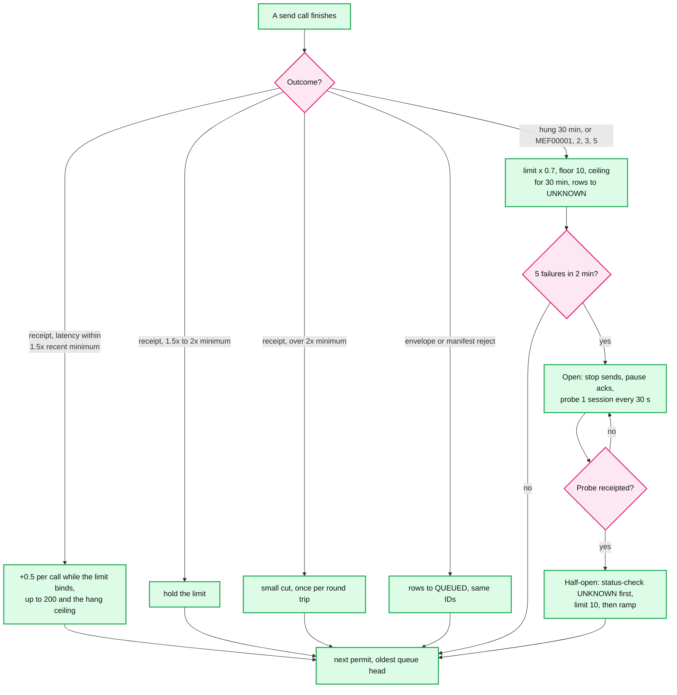

**What changed:** breaker states per pool; the relative-latency ramp; the drain order; the status banner; the escalation ladder by oldest postmark. The minute-by-minute timeline is in §10.4. Deep dive: [`deep-dives/irs-outage-and-backpressure.md`](deep-dives/irs-outage-and-backpressure.md).

### 5.6 "How do you know every one of 3 M deadline-day submissions got an answer?"

**What breaks in the current design.**
1. Polling only finds acks that exist. A submission stuck inside MeF ("in some cases the submissions are stuck in the pipeline and needs to be manually processed", Pub 4164 §14) is polled forever and nobody is told.
2. A submission whose receipt we recorded but MeF never stored (a bug in our receipt handling) looks identical to one that is merely slow.
3. A state return can sit at the state for days. Its status in MeF tells you why: "Ready for Pickup" means the state has not retrieved it.
4. A linked state return behind a federal return the filer never fixes is never sent at all, so no ack check ever sees it.
5. Nothing proves completeness. "No alerts" is not "every return answered".

**The fix: a sweeper with SLAs, a decision tree, and a daily proof.**
- **SLAs from the IRS's own numbers.** Pub 4164 §14: most acks within 5 minutes off-peak, within 2 hours at peak, "up to 24 hours" under extreme load. Pub 1345 tells transmitters to retrieve acks within two workdays and to contact the IRS if an acceptance ack has not arrived within two workdays. So: ack SLA 1 h off-peak, 24 h in the deadline week; escalate by 48 h at the latest. State: stop polling after 24 to 48 h and use status (Pub 4164 §14.2.4).
- **The sweeper runs every 5 minutes per shard** and walks the tree below. Escalation means the IDs go to the MeF Mailbox (federal) or to the state agency (state), the submission is `ESCALATED`, and a human owns it. A late ack still lands normally.
- **Daily completeness proof.** For each transmit day D: `receipted(D) = acked(D) + escalated(D) + still_inside_SLA(D)`. A non-zero remainder past 48 h pages. A second term covers what was never sent: `WAITING_FEDERAL` rows past their timer (§4.4) must be zero or owned by a human. The same queries feed a dashboard of "unanswered by age".
- **Notification freshness, stated honestly.** Off-peak (~10 federal acks/s, median lag ~3 min) every poll schedule costs under 0.05 calls/s and the frontier meets p99 5 min. In the deadline week acks come back out of order, the frontier's stale p99 is ~26 min, and the SLO is **30 min** (README). Rejects are notified before accepts, because a reject starts a clock. Funding 5 minutes at peak needs ~11 federal-ack ASIDs for a 0.04-point gain in acceptance by the perfection deadline ([`deep-dives/ack-reconciliation.md`](deep-dives/ack-reconciliation.md) §4).

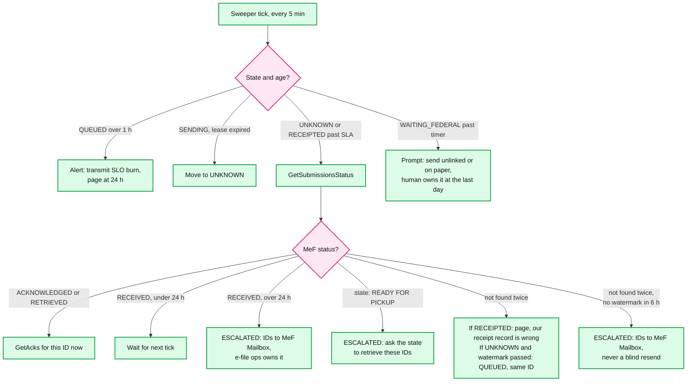

**What changed:** the sweeper (a new box in §6), `ESCALATED`, the completeness queries (including orphaned states), the honest ack SLO, the e-file operations queue. Deep dive: [`deep-dives/ack-reconciliation.md`](deep-dives/ack-reconciliation.md).

### 5.7 "Return data is taxpayer data under section 7216. How is it protected?"

**What breaks in the current design.** The packages hold SSNs, income and bank account numbers for refunds. Kafka events, logs, the reject helper and support tooling all touch returns, and each is a place for a copy to leak. The IRS channel itself needs strong client authentication.

**The fix (detail in §10.10 and §12).**
- Packages and raw acks are encrypted with per-object data keys under KMS (key management service); the database encrypts SSN and bank fields at the column level; nothing in Kafka or logs carries tax data, only IDs and statuses.
- MeF A2A uses certificate-based strong authentication per ASID; private keys live in an HSM (hardware security module) and never on a pod's disk.
- Every read of a package is logged with who and why; support access is just-in-time with a reason. Postmark evidence is write-once (S3 Object Lock).
- Using return data for anything but preparing and filing (the reject helper's model included) is checked against the filer's section 7216 consents [scope of consent needed for the helper: unverified, legal review].

**What changed:** column encryption, the HSM, an access log, Object Lock. No new box in §6.

---
## 6. Final design and the six core flows

Everything from §5 composed. 14 nodes; zoom-ins in [`diagrams.md`](diagrams.md).

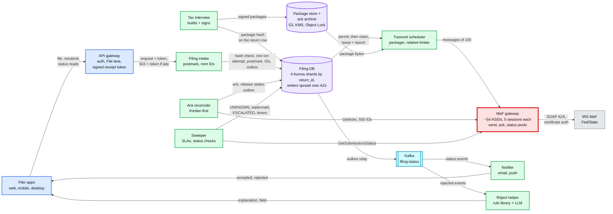

The six flows below are the ones to say from memory. Each is the final design, not the §4 version.

### Flow 1: Maya files at 11:58 PM Pacific (~50 ms)

1. The package was built, checked and signed on the review screen, sits in S3 under its hash, and the hash is on the return row.
2. The gateway stamps `06:58:41.120Z`, signs the receipt token, captures IP information and routes to the File lane.
3. Intake checks ownership, no open federal or state submission, both hashes against the row (~3 ms, no S3 call).
4. Intake mints the federal and state IDs from its leased block (under 1 ms).
5. One transaction on shard 2: attempt, postmark, federal `QUEUED`, California `WAITING_FEDERAL`, outbox (~10 ms, 3 AZs).
6. `202 RECEIVED`, "postmarked April 15, 11:58:41 PM Pacific". Had the commit not come back inside the budget, she would have got `503` plus the token, and her retry would keep 11:58:41 PM as the postmark (§5.2).

### Flow 2: a batch of 100 goes out (~5 s normally, minutes at peak)

1. A worker takes a send permit for the shard whose queue head has the oldest postmark, then claims 100 `QUEUED` rows by priority then postmark: `SENDING`, epoch 7, lease 35 min, message ID assigned. Commit.
2. The packager adds manifests, postmarks and IP information, zips, one ~7.8 MB container.
3. Over 32 minutes of lease left: `SendSubmissions`.
4. Receipt in ~5 s: 100 rows `RECEIPTED` (fenced by epoch 7), first ack poll at the current ack lag, outbox `filing.transmitted`.
5. Filers' status pages flip to "Sent to IRS".

### Flow 3: the send times out at 11:40 PM Eastern (30 min, then status checks every 10 min)

1. No answer within 30 minutes: 100 rows `UNKNOWN`; the limiter cuts by 30% and remembers the ceiling for 30 minutes.
2. Status pool: `GetSubmissionsStatus` for the 100. 97 found: `RECEIPTED`. 3 not found.
3. Ten minutes later, still not found, and a message sent 5 minutes after this one has been stored (the watermark): the 3 go back to `QUEUED` with the same IDs and go out alone in their own message. At peak this can take 40 to 70 minutes.
4. If one of them later comes back as T0000-014, the first copy had landed: not shown to the filer, counted. No ID was minted, and all 100 keep their click-time postmarks.

### Flow 4: federal accepted, state released, state accepted (minutes, then 12 to 24 h)

1. The reconciler's frontier call returns Maya's federal `Accepted` 2 minutes (off-peak) to 2 hours (peak) after the receipt.
2. One transaction: `ACK` (by ID and digest), effective ack set, federal `ACCEPTED`, California `QUEUED` linked to the federal ID, outbox.
3. Email and push: "Federal return accepted." The refund-status service (#45) consumes the same event.
4. California goes out on the next claim. Its ack is first polled 12 h later on a state-ack session.
5. State `Accepted`: notify. If it is still un-acked at 48 h, the sweeper asks MeF for its status and escalates to the state.

### Flow 5: rejected at 1:04 AM on April 16, fixed and accepted April 17

1. Ack `Rejected`, rule R0000-504-02. Attempt 1 `REJECTED`, `first_reject_at` set. California stays waiting.
2. Within minutes off-peak, under 30 minutes in the deadline week (rejects before accepts): the rule, the date, the fix, the cutoff from the rules table and the paper option; the reject helper explains it in plain words.
3. April 17: Maya fixes it; `POST /resubmit` creates attempt 2 with the original postmark, new IDs, priority 0; attempt 1's unsent California ID is `SUPERSEDED`.
4. Accepted April 17, so the return is deemed received April 16 (the first reject) under an April 15 postmark. California is released. Had Maya never fixed it, California's timer would prompt "send unlinked or on paper" before the last day.

### Flow 6: MeF is down from 9 PM to 11 PM Eastern on April 15

1. Sends fail; the limiter falls to 10, then the breaker opens at ~9:02 PM and pages e-file operations. Ack polling pauses.
2. File keeps answering `RECEIVED` with postmarks; status pages show the "delayed, postmark safe" banner. ~0.24 M submissions queue by 11 PM (README arrival shape).
3. 11:00 PM: a probe gets a receipt. First, status checks for every `UNKNOWN` row from 9 PM (watermark rule); then corrections, then federal by oldest postmark, then states.
4. MeF is back but slow (60 s per call). The limiter ramps on relative latency to ~200 calls within minutes. The backlog still peaks at ~0.76 M through the Eastern ramp; 74% of the night's returns go within 1 h, the oldest after ~2.0 h. Inside the 2-day condition. Details in §10.4.

---

## 7. Trade-offs

| Decision | Option A | Option B | Chose | Why |
|---|---|---|---|---|
| When "received" is true | When MeF receipts it | When our durable commit succeeds | Our commit | The postmark is legally our receipt time. Coupling the click to MeF makes filers late for the IRS's slowness |
| Where the postmark comes from | Database commit time | Gateway receive time, signed, kept if the commit succeeds or a retry replays the token | Gateway receive time | It is the moment the return reaches our host; our own queueing never makes a filer later |
| When the commit is late | A second commit target (S3 journal, adopted later) | `503` plus a signed receipt token the app replays | Token | Same postmark outcome; no second source of attempts, no adoption, no cross-region partition hazard. The client is the second copy |
| Work queue | Kafka between intake and transmitter | The filing DB with `SKIP LOCKED` claims | DB | One source of truth for a state machine with `UNKNOWN`, priorities and leases. 35/s average is nothing for Postgres |
| ID minting | New ID per send attempt | One ID per filing attempt, minted at the click from leased blocks | Once, at the click | A new ID during an unknown outcome is a duplicate return |
| After a timeout | Resend, or a fixed wait | Status check; resend only after two not-founds and a watermark (MeF stored a later message) | Status + watermark | MeF's own guidance; its status store can lag its portal by an hour at peak. Adapts: 40 min off-peak, longer only when MeF is behind |
| Lease expiry on `SENDING` | Back to `QUEUED` | To `UNKNOWN` | `UNKNOWN` | A dead worker's call may have landed |
| Ack retrieval | `GetNewAcks` | `GetAcks` by ID, 500 per call, frontier-first | `GetAcks` | MeF recommends it; it is not a destructive read |
| Peak ack freshness | Fund p99 5 min (~11 federal-ack ASIDs) | State 30 min for the deadline week (~36 sessions) | 30 min | 94.77% vs 94.81% accepted by the perfection deadline in the model: minutes are experience, not law |
| State returns | Send linked state with the federal | Hold the linked state until the federal is accepted; unlinked as an escape hatch | Hold, linked | A linked state without an accepted federal is denied; waiting costs minutes against a 12 to 24 h state ack |
| Pressure on MeF | Max concurrency, or growth below an absolute latency | Growth within 1.5x the recent minimum latency, hang ceiling, breaker, bulkheaded pools | Relative | A slow but healthy MeF still gets used (74% vs 34% within 1 h after the outage in the model); a saturated one is not pushed into hangs |
| Session pool size | Scale pods | Size ASIDs from `S x 100 / L` ahead of the season | Size ASIDs | Pods are not the bottleneck; enrolled ASIDs are |
| Accept-path durability | Sync cross-region commit | Multi-AZ commit, writers spread over AZs, async cross-region | Multi-AZ | ~1 s RPO only for physical region destruction, in exchange for no cross-region dependency on the click |
| Window dates | Constants (April 20) | Per-season rules table, cutoff at the earlier of the filer's and Eastern midnight | Table | The due date moves (April 18 in 2023), and then the 22nd closes the window first |
| Validation at the click | Block on predicted IRS rejects | Block only on unsendable packages | Unsendable only | An IRS reject keeps the postmark and 5 days to fix; a local block at 11:59 PM does not |
| Reject explanation | Static text per rule | Rule library plus an LLM, falling back to the static text | LLM with fallback | Better fixes on the first resubmit; the model never edits or sends the return |
| What we refused to build | A synchronous IRS send on the click; a second commit target for the click (the S3 journal); Kafka as the work queue; Temporal workflows per return; sync cross-region writes; global File rate limits; `GetNewAcks`; automatic unlinked state sends; any path that mints an ID during an unknown outcome | | | Each adds a failure mode or a second source of truth the requirements do not pay for |

Consistency model, stated once: **postmarks, attempts and submission states are strongly consistent within a return's shard (one transaction per step, 3-AZ commit); a receipt token is signed state held by the client, valid 2 h, and becomes a postmark only through that transaction; the filer reads their own status with read-your-writes; IRS acks are eventual on the IRS's clock and applied once per `(submission_id, ack_digest)`; status events and notifications are at-least-once with dedup, seconds behind; the cross-region copy is asynchronous, ~1 s.**

---

## 8. Staff-level notes

- **Simplest thing that meets the requirement.** One database that is both the system of record and the work queue, one transaction per step, one rule for unknown outcomes (status plus watermark before resend), a signed token instead of a second store, and a pool size computed from a formula. We refused a stream platform as the queue, a journal with cross-region adoption, a workflow engine per return, synchronous cross-region commits, and an LLM anywhere near IDs, postmarks or sends.
- **Failure modes and blast radius.** An intake pod: nothing (stateless; its abandoned ID block leaves harmless gaps). A shard failover: ~1,300 clicks (~1,900 at worst) wait ~30 s for `RECEIVED`, every postmark kept by the token. An AZ loss: at most 2 of 4 writers. A region loss: File waits for promotion, tokens keep postmarks, epoch-bearing prefixes prevent reissued IDs. A transmit pod: its rows go `UNKNOWN` at lease expiry and are status-checked; the next ASID owner logs out its sessions within the 15-minute idle window. MeF slow: the backlog grows and the 1 h target slips; the 2-day condition (a filer's legal outcome) holds while we drain above ~17/s, which fails only at ~30-minute calls (§5.4). MeF down: §5.5. Kafka down: notifications and refund status lag in the outbox; filing is unaffected. The largest blast radius is **a packaging bug** (every message rejected, or every return rejected for one rule). Defences: the IRS's ATS (Assurance Testing System) every autumn, a 1% send canary per release watched by reject rate per rule, and the April 1 freeze.
- **Migration from the existing transmitter.** TurboTax already files tens of millions of returns, so this replaces a running system. You cannot shadow a send (that is a duplicate), so migrate by **ownership**: every attempt records which transmitter owns it at the click. Phase 0 (October to December): certify the new transmitter in ATS, enroll its ASIDs. Phase 1 (from season open, January 26): 1% of new attempts owned by the new path, one product edition or one state at a time, widening to 100% by mid-February. Phase 2: freeze April 1 to April 20. Phase 3: retire the old path after the October 15 extension deadline. **Rollback** is flipping the owner of new attempts back; in-flight submissions finish on whichever transmitter sent them, because moving an `UNKNOWN` submission between systems is exactly how duplicates happen. Each transmitter reconciles its own acks.
- **Operability.** SLOs for the season: 99.99% of File clicks postmarked at their first click and 99.9% answered `202` within 2 s; 99% of submissions receipted within 1 h of the postmark and 100% within 24 h (the IRS must have them within 48 h); 100% acked or escalated within 48 h; notification p99 under 5 min off-peak, 30 min in the deadline week. **What pages at 2 AM on April 16:** intake errors above 0.1% for 1 minute or p99 above 2 s for 2 minutes; the oldest `QUEUED` postmark older than 1 h (ticket) and 24 h (page plus the IRS call); `UNKNOWN` rows older than 90 minutes (the watermark legitimately holds them 40 to 70 at peak); the send-pool breaker open; any "Session Limit Reached"; a T0000-014 rate above 1% of resends, or any on a once-sent ID; a correction within 6 h of its `transmit_by`; any submission un-acked at 36 h; intake host clock skew above 50 ms.
- **Cost.** Compute is small next to TurboTax's ~1,000 nodes: ~30 intake pods at the April floor, ~10 transmit pods, a few reconciler and sweeper pods. 4 Aurora clusters are the main line item in season [estimate: low tens of thousands of dollars a month], scaled down from May. S3 holds ~6 TB a season, ~44 TB after 7 years, a few hundred dollars a month at infrequent-access prices [estimate]. The real cost is people: a filing-platform team of ~6 to 8 engineers, an e-file operations group that owns the IRS relationship (ATS, ASIDs, certificates, the MeF Mailbox), and a deadline-week war room.
- **Team boundaries.** The interview team owns building, validating and signing packages (its contract with us is "a signed package under a hash"). The filing platform owns intake, transmit, acks and the status API. Notifications are a shared platform. Identity and fraud run before File. Refund status (#45) consumes our accepted events. E-file operations owns everything that involves calling the IRS on the phone.
- **The explicit trade-off.** We accept that on the worst night the IRS sees returns hours after filers clicked File, in exchange for a File click that never depends on the IRS. The postmark makes that legal, and the 2-day condition bounds it: past it, filers are late.

---

## 9. What is expected at each level

**Mid (80/20 breadth/depth).** Separates "submit" from "send to IRS" with a queue, retries failed sends, polls for acks, stores a status per return, and notifies the user. May not know what the postmark is, may retry with a new ID, and may treat state returns as independent.

**Senior (60/40).** Knows the electronic postmark and designs the click as a durable write with a fast answer. Makes the submission ID the idempotency key, minted once, and checks status before resending after a timeout. Uses `GetAcks` by ID, batches 100 per message, and holds the linked state until the federal accept. Handles the perfection period with attempt lineage. Goes deep on one of: the send state machine, ack reconciliation, or the peak.

**Staff+ (40/60).** Everything above, plus: says in the first minute that "on time" is our receipt, not the IRS's; derives the send ceiling `sessions x 100 / latency`, sizes ASIDs from it, and shows what happens at 1, 5 and 30 minutes of latency; refuses to autoscale into a saturated dependency and uses a limiter that follows MeF's relative latency, plus bulkheads; treats `UNKNOWN` as a real state with fencing, permit-before-claim and status-before-resend (knowing MeF's status store lags its portal), including the lease-expiry case; knows T0000-014; keeps a filer's postmark through a database failover at 11:59 PM without a second store; proves completeness with a sweeper and a daily reconciliation; gives the ownership-based migration (no shadow sends) and a pre-scale and freeze plan; and names the 2-day condition (~17/s) as the floor that makes the backlog harmless, and the one thing that makes filers late if broken.

---
## 10. Nitty-gritty (past interview scope)

### 10.1 Internals of each chosen technology

**MeF A2A (the protocol we depend on).**
- **Channel.** SOAP over HTTPS with attachments. Every request carries a MeF header with a globally unique 20-character message ID (ETIN + `ccyyddd` + 8 characters) and a WS-Security header. Clients authenticate with a digital certificate enrolled per ASID ("certificate based Strong Authentication").
- **Sessions.** `Login` returns a SAML-backed session. Up to 5 per ASID; a sixth gets "Session Limit Reached". One service call at a time per session, or "Service count is over limit for SAML session". A session is not valid after 10 hours of activity or 15 minutes idle; a `Logout` on a live session clears it, but a `Logout` on an expired one fails and the session stays stale until a nightly job (or a 24-hour cycle) reaps it. A leaked session therefore costs a slot for hours unless it is logged out within 15 minutes, which is why ASIDs have owners with fast hand-off (§5.4).
- **Send.** `SendSubmissions` carries one uncompressed container zip with 1 to 100 compressed submission zips. A2A has no separate transmission acknowledgment: the response holds a receipt, or an error whose message ID ends in `E` (`MEF00001 SystemNotAvailable` ... `MEF00006 ObjectNotFound`). If the message is rejected, nothing inside it is processed and "all submissions must be resubmitted". MeF says it "responds within seven minutes with a receipt" (§5.6) and that most submissions are "receipted within seconds" (§14). A repeated submission ID is rejected under T0000-014 ("The Submission ID must be globally unique", Table 5-2).
- **Status record.** `RECEIVED`, `ACKNOWLEDGED`, `ACKNOWLEDGEMENT RETRIEVED` for federal; for state also `READY FOR PICKUP`, `SENT TO STATE`, `RECEIVED BY STATE`, `DENIED BY IRS` and others. MeF stamps every status record "not proof that the return was Accepted or Rejected". We use it to resolve unknowns and to route escalations, never to tell a filer "accepted".
- **Acks.** `Accepted`, `Rejected` with business rule codes and the XML paths involved, or for the 1040 family `Exception` (accepted, IRS will adjust and send a math-error notice: "DO NOT RESUBMIT"). `GetAcks` takes up to 500 submission IDs and "can be run in multiple sessions using the same ETIN with no reduction in efficiency".

**Aurora PostgreSQL (the filing DB).** Storage is a separate distributed layer: each 10 GB segment is written 6 ways across 3 AZs and a write commits at 4 of 6 (Aurora, SIGMOD 2017). So a commit survives an AZ loss without a synchronous standby. A writer failure promotes a reader in ~30 s [estimate]. The 4 shard writers are spread so that no AZ holds more than 2. The work queue is plain Postgres: `SELECT ... FOR UPDATE SKIP LOCKED LIMIT 100` lets many transmit workers claim disjoint rows without blocking each other, and a partial index on `state = 'QUEUED'` keeps the claim cheap while the table grows to tens of millions of rows. Cross-region: an asynchronous replica in the second region (lag ~1 s [estimate]).

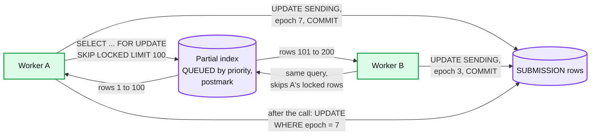

**S3 (packages, raw acks, evidence).** A PUT returns after the object is stored redundantly across AZs. Content-addressed keys (`sha256/ab/cd/...`) make package writes idempotent and spread load across prefixes. Raw acks and postmark evidence use Object Lock in compliance mode, so nobody, including us, can alter or delete a record before its retention date.

**Kafka (status fan-out only).** `filing-status`, 12 partitions keyed by `return_id`, so one return's events stay in order. Producers are the outbox relays; consumers (notifier, reject helper, refund status) dedup on `event_id`. Nothing on the filing path reads Kafka.

### 10.2 Configuration knobs that matter

| Component | Knob | Value | Why |
|---|---|---|---|
| MeF client | read timeout | 30 min (the Java toolkit default is 600 s; MeF says set 1800) | MeF's own recommendation; a shorter timeout manufactures `UNKNOWN` rows |
| Transmit | `SENDING` lease | 35 min | Longer than the client timeout, so a live call never loses its lease |
| Transmit | batch | 100 submissions or 25 MB, 1 s linger off-peak | MeF's cap; half the 50 MB chunking threshold; no waiting in February |
| Transmit | limiter | floor 10, cap 200; +0.5 per completed call while bound and within 1.5x the 10-min minimum latency; x0.7 on a hang or system exception, at most once a minute; hang ceiling kept 30 min | Follows MeF's latency, not an absolute number; never probes the hang point twice in 30 min |
| Transmit | lease budget | permit before claim; send only with over 32 min of lease left | The epoch fences our DB, not MeF |
| Transmit | breaker | open after 5 failures in 2 min; probe every 30 s | Stops a storm against a down MeF |
| Status | resend rule | two not-found answers 10 min apart **and** a watermark (a message sent 5 min later is stored; after an outage, the probe receipt); no watermark in 6 h: `ESCALATED`, never a blind resend; resends in their own messages | MeF's status store lags its portal by up to an hour at peak |
| Acks | first poll | max(2 min, median ack lag over the last 10 min); state: 12 h; past 2 h, status hourly and fetch only on `ACKNOWLEDGED` | MeF says wait at least 2 minutes, longer at peak, 12 to 24 h for state; the slow tail is where empty polls come from |
| Acks | backoff after an empty answer | +30 s up to a 5 min interval | MeF's §14.2.2 cadence |
| Sweeper | SLAs | ack 1 h off-peak, 24 h deadline week; escalate by 48 h; state status at 24 h | IRS's published ack times and the two-workday rule |
| Intake | deadline | 1.5 s end to end, then `503` plus the receipt token | Leaves 500 ms of the 2 s target for the network; the postmark is never lost |
| Gateway | receipt token | valid 2 h, bound to return, key and package hash | A failover plus an app restart, far inside the 2-day condition |
| Intake | ID block | 10,000 values per lease, epoch in the prefix | ~8 min per pod at peak; no reissue after a promotion |
| Aurora | `statement_timeout` on the File lane | 250 ms | A stuck query must not hold a File request |

### 10.3 Capacity math per component

| Component | Load at design peak | Capacity per unit | Units | Headroom |
|---|---|---|---|---|
| Intake | 560 clicks/s | ~40 clicks/s per pod at ~20 ms CPU each [estimate] | 30 pods over 3 AZs | ~2x |
| Filing DB | ~2.3k writes/s per shard | several thousand simple writes/s per writer [estimate] | 4 shards | 2 to 4x |
| Package store | ~1,000 GETs/s at transmit (none on the click) | per-prefix limits are far above this with hashed prefixes | 1 bucket | large |
| Transmit workers | 200 in-flight calls, ~7.8 MB each | ~20 calls per pod, ~160 MB buffers | 10 pods | 2x |
| **Send pool** | 500 submissions/s | `200 x 100 / L` | 40 ASIDs | **4,000/s at 5 s; 500/s at 40 s; 67/s at 5 min; 48/s at 7 min** |
| Ack pool (federal) | 280 receipts/s, ~6.5 ID-polls per ack: ~3.6 calls/s | one call per session at ~10 s | 8 ASIDs, 40 sessions | ~1.1x at 10 s; a slower `GetAcks` stretches the 30 min SLO |
| Kafka filing-status | ~5 events per submission, ~2.5k/s | thousands/s per partition | 12 partitions | large |
| Notifier | ~500 messages/s in the accept wave | provider rate limits [unverified] | ~10 pods | depends on the provider |
| Bandwidth to MeF | ~39 MB/s (312 Mbit/s) at 500/s | egress is not the limit | egress gateway per AZ | large |

The component closest to its limit is the **send pool**, and its limit moves with a number we do not control. Next is the ack pool on the morning of April 16, which is why ASIDs move from send to ack once the send backlog is gone.

### 10.4 Failure timeline

**MeF down from 9:00 PM to 11:00 PM Eastern on April 15.**

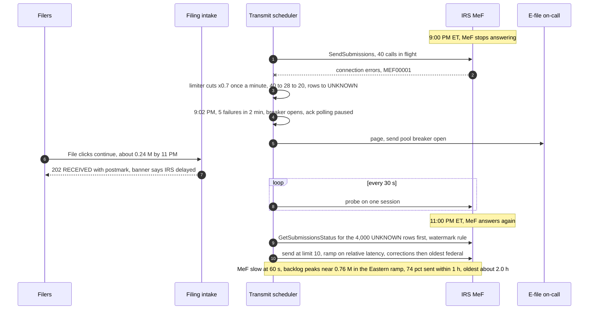

What the on-call sees: the breaker page, the oldest-`QUEUED` age climbing linearly, File error rate flat at baseline. What filers see: `RECEIVED` with a postmark and a banner. Data at risk: none; every row is postmarked and durable.

**A shard's primary fails at 11:59:40 PM Eastern** (sequence in §5.2). t = 0: commits stop on one shard of four. t + 1.5 s: the first blocked File requests get `503` plus their signed receipt tokens. t + ~30 s: a reader is promoted, with a new epoch for ID and message prefixes. t + ~32 s: the ~1,300 retries land, each committing with its token's stamp as the postmark. Data at risk: none. Late filers: none (without tokens: ~1,300). What the on-call sees: a failover event and a 2 s latency SLO burn on one shard; the postmark SLO untouched.

**A transmit pod crash-loops at 10:30 PM Eastern.** t = 0: the pod dies with 20 calls in flight; its 2,000 rows stay `SENDING`. Its ASIDs' sessions are still open at MeF. t + ~10 s: the ASID leases expire; new owners call `Logout` on the stored sessions (well inside the 15-minute idle window) and log in again, so no "Session Limit Reached". t + 35 min: the row leases expire and the sweeper moves the 2,000 rows to `UNKNOWN`; status checks return them as `RECEIVED` (or back to `QUEUED` after two not-founds and the watermark). Cost: up to 35 minutes of delay for 2,000 returns, no duplicates. Without the hand-off, a crash loop could hold 5 sessions per ASID until MeF's nightly cleanup.

### 10.5 Exactly-once and idempotency end to end

| Hop | Where duplicates come from | Dedup key | Where removed | Lifetime |
|---|---|---|---|---|
| Filer to intake | Double tap, app retry after a lost response or a `503` | `Idempotency-Key`; one open submission per (return, kind) | Unique index on the key; partial unique index on `(return_id, kind)` over non-final rows. A retry after a `503` carries the receipt token, so it keeps the first stamp | Season; token 2 h |
| ID minting after a promotion | A promoted replica lost the last block lease | `(efin, day, prefix)` with an epoch | The epoch in the prefix is bumped on promotion, so no block is reissued | Day |
| Scheduler claim | Two workers, a zombie worker, a claim that waited past its lease | Row lock + `lease_epoch`; permit before claim | `SKIP LOCKED`; post-call writes `WHERE lease_epoch = ?`; no send with under 32 min of lease | Per claim |
| Send after a timeout, a system exception or lease expiry | Blind resend while MeF's backend lags | `submission_id` | `UNKNOWN`, then status; resend only after two not-founds and the watermark, same ID, own message | Until resolved |
| Message rejected by MeF | Resend of the whole message | `submission_id` | Only a definite nothing-processed reject requeues; same IDs | |
| A same-ID copy that reaches MeF anyway | Watermark passed but the backend was out of order | `submission_id` | MeF's T0000-014 rejects the second copy; we read it as "landed", never show it, alert on rate | Season |
| Ack fetched twice, or two different acks | Two reconciler runs; a T0000-014 next to the real ack | `(submission_id, ack_digest)` | Insert-if-absent; effective-ack pointer, any accept wins | Forever |
| Federal accept to state release | Ack applied twice | `WHERE state = 'WAITING_FEDERAL'` | The conditional update matches zero rows the second time | |
| Outbox to Kafka to notifier | Relay retries, consumer replays | `event_id` = `submission_id + status` | Notifier's dedup table | 7 days |
| Correction | Resubmitting under the old ID | new `submission_id` per attempt | MeF rejects a reused ID; we never reuse one | |

The one hop where a duplicate would reach the IRS is the send after an unknown outcome. Every other hop is ours and closes with a unique key. That hop closes with two IRS facts: its status service (with our watermark, because it lags) keeps duplicate sends rare, and T0000-014 makes a same-ID duplicate harmless. Never minting a new ID is what keeps it that way.

### 10.6 Consistency model per edge

| Edge | Model | Why |
|---|---|---|
| Gateway to intake to filing DB | Strong, single-shard transaction, 3-AZ commit | The postmark and the IDs must exist together or not at all |
| Gateway to filer app (receipt token) | Signed, client-held, valid 2 h, becomes state only through the File transaction | Keeps the postmark across a failed commit without a second store |
| Filing DB to transmit scheduler | Strong: row locks, fenced writes | One sender per submission at a time |
| Scheduler to MeF | Unknown on timeout, resolved by status (eventual, on MeF's clock) | MeF has no idempotent send |
| MeF to ack reconciler | Eventual: 2 min off-peak to 24 h, applied once per `(submission_id, ack_digest)` | Acks are pulled |
| Federal ack to state release | Strong: same transaction | The linked state must never go before its federal is accepted |
| Outbox to Kafka to notifier and refund status | At-least-once, deduped, seconds | A repeat is cheap to drop; filing never waits on them |
| Filer's status page | Read-your-writes on the first read after File, then replicas | The filer sees their own `RECEIVED` at once |
| Region A to region B | Asynchronous, ~1 s | RPO ~1 s only for physical region loss (§5.2) |

### 10.7 Alternatives rejected

| Alternative | Why it looked attractive | Why rejected |
|---|---|---|
| Synchronous IRS send in the click | Simple, the filer sees "accepted by IRS" | MeF latency (30 min timeouts at peak) and outages become our accept path's availability |
| S3 intake journal as a second commit target | Always say yes in 2 s | A second source of attempts; a retry before adoption makes two attempts for one return; a cross-region partition risks two submission IDs for one SSN; guards ~0.01 late filers a season. The receipt token gets the same outcome |
| Kafka as the transmit queue | Buffers spikes, replays | Cannot represent `UNKNOWN`, priorities or leases; becomes a second source of truth next to the DB |
| One durable workflow (Temporal) per return | Timers, retries and history for free ([`../../concepts/temporal-durable-execution.md`](../../concepts/temporal-durable-execution.md)) | ~50 M workflows a season, and the hard part (batching 100 across returns, a shared session pool, a global limiter) sits outside any one workflow. A good fit for the slow escalation path, not for the send |
| DynamoDB instead of Aurora | Serverless scale, conditional writes | Claiming "the 100 oldest queued rows by priority" and multi-row transactions per return are natural in SQL; at ~9k writes/s either works |
| `GetNewAcks` | No need to track outstanding IDs | MeF recommends against it; destructive reads; lost responses need `GetAcksByMsgID` |
| Send linked state with the federal | One message, faster state | Denied if the federal is not yet accepted when MeF checks; ordering inside a message undocumented |
| Unlinked state by default | No waiting | Loses the federal SSN match, varies by state, and turns a federal reject into a confusing state outcome |
| Rate-limit File globally | Protects the backend | Turns overload into late returns; shed reads instead |
| Synchronous cross-region commit | True zero RPO | ~70 ms and a two-region dependency on every click, to cover region destruction only |
| Treat a status record as an accept | Faster "accepted" for filers | MeF: a status record "is not proof" of acceptance |

### 10.8 How the big companies do it

- **Intuit (TurboTax platform).** 26 Kubernetes clusters in 2 AWS regions x 3 AZs, ~1,000 nodes, scaling "from 5K to 300K transactions per second (TPS) within two hours", with pods pre-scaled from ~1,100 to 2,500 in early April (Diginomica, 2020). Tax Day 2026: 185 B transactions and 11 M TPS at peak (Intuit blog). The lesson we use: **pre-scale on the calendar**; the deadline is known a year ahead. Intuit does not publish its MeF transmitter design.
- **The IRS's own guidance is the closest published "design".** Pub 4164 §14 reads like a client-library contract: `GetAcks` over `GetNewAcks`, separate federal and state retrievals, a polling cadence, a 30-minute timeout, and status-before-resend. Following it is also how a transmitter keeps a good relationship with the operator of its only dependency.
- **Other transmitters** (H&R Block, Jackson Hewitt and others) publish nothing about their MeF pipelines (research survey). The patterns are general: the transactional outbox, leased work queues ([`../distributed-job-scheduler/`](../distributed-job-scheduler/)), and "query status before retry" for a non-idempotent external call, the same move a payment system makes when a card network times out ([`../payments-ledger/`](../payments-ledger/)).

### 10.9 Operational runbook

- **Dashboards (the five):** File rate, error rate, p99 and token-postmark count per zone wave; oldest `QUEUED` postmark age and backlog size by priority; send-pool latency against its recent minimum, in-flight limit, hang ceiling and breaker state; `UNKNOWN` and `ESCALATED` counts by age plus the T0000-014 rate; ack lag, ID-polls per ack (it, not the ack rate, sets the ack session count) and the daily completeness remainder.
- **Alerts:** as listed in §8, routed to the filing-platform on-call; IRS-facing issues (breaker open more than 15 min, escalations) also to e-file operations.
- **Rollout:** new code goes to the transmitter as a 1% canary of sends for a day, watched by the IRS reject rate per business rule (a packaging bug shows up as one rule spiking). Nothing ships between April 1 and April 20 except fixes approved by the incident commander.
- **Rollback:** code by redeploying the previous build (the state machine is backward compatible by rule: new states may only be added with a migration that old code tolerates). A packaging bug that produced bad submissions is fixed forward: the rejected attempts are re-packaged as new attempts with new IDs, inside the perfection window, with the filer's postmark carried over.
- **Deadline week:** a war room with the IRS e-Help Desk and MeF status page on screen, ASID moves pre-approved, and the "IRS delayed" banner ready to flip.

### 10.10 Security and abuse

- **Authentication.** Filers through Intuit identity with MFA (multi-factor authentication). Services by mTLS (mutual TLS) and workload identity. MeF by per-ASID certificates whose private keys live in an HSM; certificate rotation is an e-file operations runbook with the IRS's enrollment tool.
- **Authorization.** A filer can file and read only their own returns (checked in intake, not only at the edge). Support access to a package is just-in-time, with a ticket and a reason, and logged.
- **PII (personally identifiable information).** SSNs, income, bank accounts. Envelope encryption per object (KMS data keys); column encryption for SSN and bank fields in the DB; tokenized identifiers in logs and events; Kafka carries no tax data.
- **Evidence.** Postmark records (with the signed stamp and the gateway host that made it) and raw ack files are Object Lock, compliance mode. Pub 1345 requires keeping each postmark record to the end of the calendar year and giving it to the IRS on request; our retention is longer.
- **Section 7216.** Return information is used to prepare and file. Any other use (analytics, the reject helper's model calls, marketing) needs the filer's consent, checked by purpose at the call site [exact consent scope: unverified, legal review].
- **Abuse.** Scripted filing of fraudulent returns (identity-theft refund fraud) is stopped before File by identity and fraud checks (below the line). Intake still rate-limits File per account (5 per minute) and per device, never globally, and enforces Pub 1345's rule that an Online Filing transmitter not accept "more than five electronic returns originating from one software package or from one e-mail address". A malicious client can file only its own return, cannot choose its postmark (the gateway stamps and signs it; a replayed token must match the return, key and package hash and be under 2 h old), and cannot choose its submission ID.
- **IP information.** Pub 1345 requires every individual return to carry the filer computer's public IP address, IP date, time and time zone, and the IRS rejects returns without it. The gateway captures them at the click (the public address as seen at our edge); the packager writes them into the return header at send time.
- **The postmark's wording.** Pub 1345 forbids "certified", "registered", "IRS" or "Federal" as a description of the electronic postmark, in the product and in marketing.

### 10.11 Evolution

- **10x volume** (for example, the same platform transmitting for Intuit's professional tax products too). Intake and the DB scale by pods and shards. The send pool needs ~400 ASIDs at 40 s latency, so the first conversation is with the IRS, not with AWS. Per-product ASID pools become the bulkhead between consumer and professional traffic.
- **Business returns.** Different due dates (March 15 for partnerships and S corporations), a 10-day perfection period, and no individual electronic postmark. New rows in `SEASON_RULES`, not new code.
- **Push acks from the IRS.** If MeF ever offers callbacks, the reconciler becomes a consumer, and the sweeper stays: a push channel can lose messages too.
- **A second filing season peak** (October 15 extensions). Same design; the pre-scale calendar gains a second date.
- **New AI uses.** A model that predicts the IRS reject before the click and warns the filer on the review screen, never at the click (§4.1). The seam is the interview's validation step, not the File path.

---

## 11. Follow-up questions to expect

Ranked by how likely an interviewer asks them. Answers in [`edge-cases.md`](edge-cases.md) and the deep dives.

1. **The IRS is slow at 11:58 PM. Is the filer late?** No: the postmark is our receipt time in the filer's zone, §1, §4.1, [`deep-dives/postmark-and-peak-intake.md`](deep-dives/postmark-and-peak-intake.md).
2. **`SendSubmissions` times out. Same ID or new ID?** Same ID, status first, two not-founds plus the watermark, T0000-014 means it landed, §5.3, [`deep-dives/exactly-once-submission.md`](deep-dives/exactly-once-submission.md).
3. **How fast can you actually send, and what if MeF takes 5 minutes per call?** `S x 100 / L`, 40 ASIDs, 67/s at 5 min and 48/s at 7, above the ~17/s two-day floor, §5.4, [`deep-dives/irs-outage-and-backpressure.md`](deep-dives/irs-outage-and-backpressure.md).
4. **How do you know every one of 3 M submissions got an ack? What pages at 2 AM?** Sweeper, completeness query, §5.6, §8, [`deep-dives/ack-reconciliation.md`](deep-dives/ack-reconciliation.md).
5. **Rejected at 1 AM April 16. Late?** No, if accepted by the fifth day (April 20 in 2026, from the rules table): lineage and carried postmark, §4.4, [`deep-dives/reject-fix-resubmit-and-state-returns.md`](deep-dives/reject-fix-resubmit-and-state-returns.md).
6. **The state needs the federal first. How do you model it?** `WAITING_FEDERAL`, released in the federal ack's transaction, unlinked as the escape hatch, §4.2, §4.3.
7. **MeF down for two hours on April 15.** §5.5, §10.4.
8. **Your database fails over at 11:59 PM.** One shard, ~1,300 clicks wait ~30 s, none late: the signed receipt token, §5.2, [`deep-dives/postmark-and-peak-intake.md`](deep-dives/postmark-and-peak-intake.md).
9. **A worker dies mid-send.** Lease expiry to `UNKNOWN`, never `QUEUED`; session hand-off, §5.3, §10.4.
10. **50x in 3 hours: what do you pre-scale, what do you shed, what never sheds?** §5.1.
11. **Why not Kafka, Temporal or DynamoDB?** §4.2, §10.7.
12. **How would you migrate from the current transmitter?** Ownership by cohort, no shadow sends, §8.

---

## 12. Presenting this as an Intuit case study

The Intuit loop hands out the case study ahead of time and re-opens the same deck in about four rounds; AI and security are graded in every one, and "what you prioritize might be part of the assessment" ([`../company-questions.md`](../company-questions.md) §1).

**The 10-slide deck.**
1. **The problem in one line**, and three numbers: ~500/s at the peak minute, under 2 s to "received", 2 days for the IRS to receive it (or the filer is late).
2. **Scope, and what I cut.** In: File, transmit, acknowledge, fix and resubmit, federal plus state. Out, and why: tax calculation (the interview's job), refund status (#45, the read side), payments, identity and fraud (before File), amended and business returns (different rules). Cutting them is what lets the deck go deep on the hard part.
3. **Three facts that shape the design:** the postmark is our receipt; the IRS channel is `sessions x 100 / latency`; exactly-once is a protocol with the IRS.
4. **Numbers:** season, deadline day, peak minute, bytes, writes, and the send-capacity table.
5. **Architecture:** the §6 diagram, with the red send pool.
6. **Exactly-once:** the state machine and the timeout sequence (§5.3).
7. **The red node:** the capacity table at 5 s, 40 s, 5 min, 7 min, 30 min against the ~17/s two-day floor; ASID sizing; the relative-latency limiter; why not autoscale.
8. **Acks, states and rejects:** frontier polling, the sweeper, `WAITING_FEDERAL`, the perfection window.
9. **AI and security** (below).
10. **Running it:** SLOs, the 2 AM pages, the ownership-based migration, cost and teams, what I would build next.

**The AI story: one place a model does real work.** The **reject helper**. When an ack says `Rejected`, the helper receives the business rule codes, the rule text from a curated library, and only the return fields the reject cites. A model writes a plain-language explanation and proposes which field to check ("the IRS has this dependent as John, your return says Jon; check the Social Security card"). Guardrails:
- The model never edits the return, never resubmits, and never touches IDs or postmarks. The filer makes the change in the interview, which re-runs the deterministic checks.
- Output is schema-checked: the proposed field must be one the reject cites; any value it suggests must come from the filer's own documents, never invented.
- 3 s timeout, then the static library text for that rule. Rejects never wait on the model.
- Minimal PII, an in-boundary model behind the AI gateway ([`../ai-gateway/`](../ai-gateway/), [`../financial-ai-assistant/`](../financial-ai-assistant/)), and a section 7216 consent check.
- Measured by "accepted on the first resubmit" against the static text, on last season's rejects offline before launch.

**The security story** in one slide: who can call what (filer identity with MFA; mTLS between services; per-ASID certificates in an HSM for MeF), what is encrypted (per-object keys for packages, column encryption for SSN and bank fields, TLS everywhere), what is logged (every package read with a reason; postmark evidence write-once), and what never leaves the boundary (no tax data in events or logs, 7216 consent before any secondary use).

**What each round will re-open (3 questions each).**

| Round | Questions to expect |
|---|---|
| Architecture | What if MeF takes 10 minutes per call? Why is the database the queue? Where exactly is the commit point, and what if it fails at 11:59 PM? |
| Correctness | Prove a return is never sent twice: walk the timeout and the dead worker. What is the postmark of a correction on April 19, and on April 21? What does the filer see while the state waits on a rejected federal? |
| AI | What if the model suggests the wrong SSN? How do you evaluate it before April, and what does it cost on the morning of April 16? What happens to the reject flow if the model is down? |
| Security and operations | Who can read a return, and how would you know? What pages at 2 AM, and who calls the IRS? How do you migrate from the current transmitter without a duplicate? |
