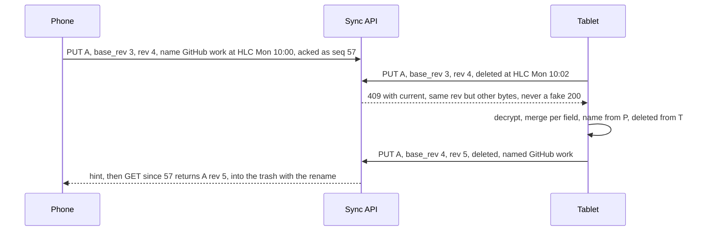
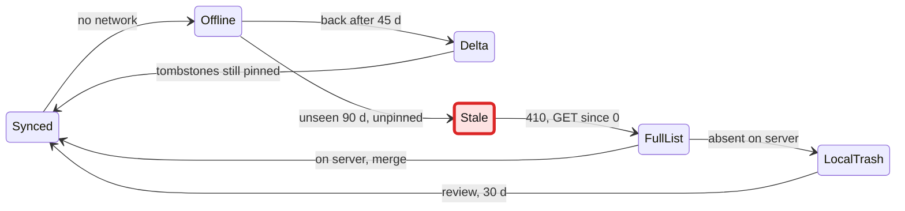
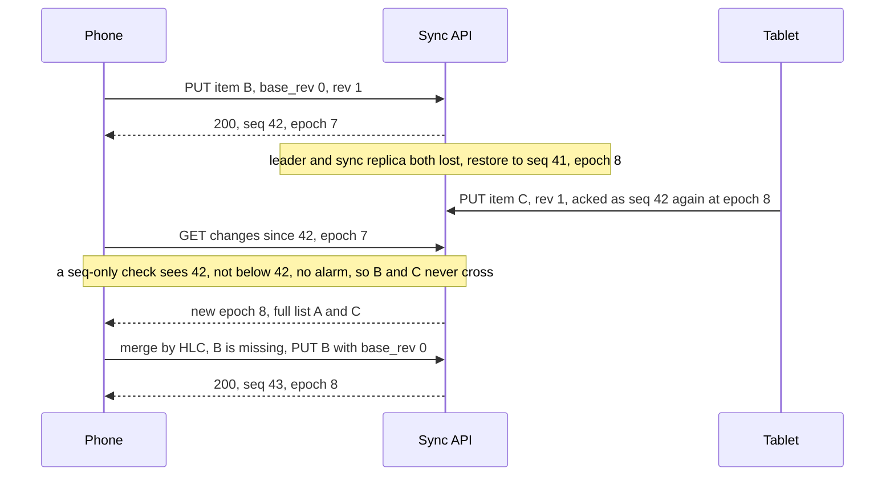

# Deep dive: multi-device sync and conflicts

> One-line answer: sync is two calls, `GET /v1/vault/changes?since=` on a per-user, server-assigned `seq` plus a partition epoch, and `PUT /v1/vault/items/{id}` with `base_rev`, one transaction that bumps `VAULT.seq` and writes an outbox row; the server only orders and refuses, and the client merges every pulled item field by field by a hybrid logical clock (HLC), because only the client can read an item. Three rules carry the design: `item_id` is derived from the secret, so two scans of one QR are one item; tombstones stay until every active device has pulled them; and `rev` only gates writes, never picks content. A 3-device simulator (offline spells up to 60 days, lost responses, one failover) finds 0 violations in 2,000 schedules; the rules as first written broke 899 (950 secrets lost, 227 items resurrected), and one blob with last-writer-wins (LWW) loses 35,033 of 59,638 secrets.

Related: [`../solution.md` §5.5](../solution.md#55-two-devices-change-the-vault-offline-what-wins-and-can-a-deleted-secret-come-back), [§4.4](../solution.md#44-back-up-and-sync-first-version-the-server-holds-the-keys), [Flow 3](../solution.md#flow-3-add-an-account-on-the-phone-see-it-on-the-tablet-fr4), [§10.5](../solution.md#105-exactly-once--idempotency-end-to-end), [`vault-encryption-and-key-hierarchy.md`](vault-encryption-and-key-hierarchy.md) (`key_version`, rotation), [`push-approval-and-phishing.md`](push-approval-and-phishing.md) (what Apple Push Notification service, APNs, and Firebase Cloud Messaging, FCM, promise), [`../../../concepts/crdt.md`](../../../concepts/crdt.md), [`../../../concepts/leases-fencing-clocks.md`](../../../concepts/leases-fencing-clocks.md), [`../../../concepts/exactly-once.md`](../../../concepts/exactly-once.md).

---

## 1. The protocol: one cursor, one optimistic write

- **Read** `GET /v1/vault/changes?since=<seq>`: `{epoch, vault_seq, items: [{item_id, rev, seq, ct, deleted}], slots_version, key_version}` in `seq` order, usually empty (~200 B). A new epoch gets the full list. `410 Gone` only reaches a device unseen for 90 days (§3). **Write** `PUT /v1/vault/items/{id} {base_rev, rev, key_version, ct, deleted}`: `200 {seq}` or `409 {current}`.
- **Idempotent on `(item_id, rev, hash(ct))`**: a byte-identical retry gets its old `seq`; the same `rev` with other bytes gets `409`, never a fake `200`. A stale `key_version`, or a vault in `rotation_due` after a revoke, also gets `409` until a rotation commits (§5.1). Slot writes carry `key_version` and `slots_version` and are checked the same way.
- **`seq` is per user and server-assigned**: one total order a device resumes from with a single integer, which devices cannot agree on offline (~58 writes/s over 100 M users never contend). **`rev` is per item and client-assigned**: it is in the associated data, AAD (`user_id ‖ item_id ‖ rev ‖ key_version`), so it is fixed before encryption. It is only the optimistic-concurrency token. A re-create after a purge sends `rev` = highest seen + 1.
- **Freshness.** p95 10 s **while the app is open**: a silent push hint (~30/s) plus a 30 s foreground poll, otherwise on next open. Silent pushes are not guaranteed: Apple says "the system doesn't guarantee their delivery" and "don't try to send more than two or three per hour" ([Apple](https://developer.apple.com/documentation/usernotifications/pushing-background-updates-to-your-app)).
- **The server can check** the device signature, `base_rev`, `key_version`, ≤ 4 KB, ≤ 1,000 items, the ciphertext header (24 B nonce, 16 B tag) and rates. **It cannot check** that `ct` decrypts, that a secret is valid, which edit is newer, or that the plaintext `deleted` purge hint matches the sealed flag. Devices check that last one on every pull and flag mismatches; the server purges only pinned tombstones no device flagged.

```sql
BEGIN;  -- PUT: lock the vault row, then (rev, ct_hash) = ($rev, sha256($ct)) here or in history is a retry: return its seq
SELECT seq, slots_version, rotation_due FROM vault WHERE user_id = $u FOR UPDATE;
SELECT rev, ct_hash FROM vault_item WHERE user_id = $u AND item_id = $i;   -- rev <> $base_rev, stale $kv, rotation_due: 409
INSERT INTO vault_item_history SELECT * FROM vault_item WHERE user_id = $u AND item_id = $i;   -- kept 30 days
UPDATE vault SET seq = seq + 1 WHERE user_id = $u RETURNING seq;                              -- s
INSERT INTO vault_item VALUES ($u, $i, $rev, $kv, s, $ct, sha256($ct), $deleted_hint, now())
  ON CONFLICT (user_id, item_id) DO UPDATE SET rev = $rev, seq = s, ct = $ct, ct_hash = sha256($ct);
INSERT INTO outbox (user_id, seq, kind) VALUES ($u, s, 'vault_changed');  -- the relay sends the hint
COMMIT;                                                                     -- 200 {seq: s, epoch: partition generation}
```



## 2. The merge rules, each with a worked example

Each "as first written" entry is a minimal schedule the simulator in §5 found, replayed as a scripted run: it breaks under the first rule and passes under the design. P = phone, T = tablet, W = a third device.

| Conflict | The design | Worked example | As first written, the minimal counterexample |
|---|---|---|---|
| Rename vs rename | LWW per field by `(hlc, device_id)` | P "GitHub work" at 10:00, T "GH" at 10:03: every device shows "GH" | Same rule, held |
| Rename vs delete, restore vs delete | `deleted` is LWW by HLC like any field; a rename never writes it | The 409 above: A ends deleted, named "GitHub work". A restore at 10:05 beats a delete at 10:04 | Same, but restore vs delete was unstated |
| Two writers, same `rev` | Idempotent on `(item_id, rev, hash(ct))` | The 409 above | **S1**, key `(item_id, rev)`: P renames A (rev 2); T, not yet pulled, deletes A (rev 2), gets a fake `200`, shows A deleted forever |
| Same QR on two devices | `item_id` = HMAC(id_key, secret ‖ algorithm ‖ digits ‖ period), `id_key` in the vault, never rotated. A rescan is a write, a restore if deleted | P and T scan GitHub offline: both `PUT` the same id at `base_rev` 0, the second gets `409` and merges. One item | **S2**, random ids, tombstone the newer copy: T (offline) deletes A. W, never shown A, scans the same QR: B. P sees A and B live, tombstones B. T's delete lands. Both gone, though the user's last act was a scan |
| Re-enrolled, new secret | Keep both, mark the older "possibly replaced" | GitHub reset: both show until the user deletes one | Same rule, held |
| Offline > 30 days | Tombstones pinned until 30 days old **and** every active device's `since` is past them | T back after 45 days: its tombstones are still there, a delta sync | **S4**, purge at 30 days: T restores A offline on day 20, A purged day 31, T back day 47 with a `410`, A has a `seq`, restore undone. **S6**: P adds A, the `200` is lost, P offline 40 days; T deletes A, purged; A has no `seq`, re-uploaded live |
| Re-create after purge | Merge every pulled item by HLC; send `rev` = highest seen + 1 | T restores a purged item from its stale trash: the restore wins by HLC on every device | **S5**, newer `rev` wins: A deleted at rev 5, purged; T re-creates it at rev 1; P ignores rev 1 < 5 and empties its trash. P lacks A for good |
| Acked writes lost | New epoch: full resync, merge by HLC, re-upload wherever the merge differs from the server | §4 | **S7**, re-upload only older revs: P's restore at rev 3 is lost; T writes rev 3 again. Not older, never re-sent. **S3**, seq-only check: misses even a plain lost add |
| Forged tombstone | `deleted` sealed in `ct`; devices compare the hint on every pull | The server or a buggy client flips the hint on a live item: devices flag it, nothing is purged | The hint alone drove the purge on day 31 |

**The HLC.** A stamp is `max((wall, 0, dev), (last.wall, last.counter + 1, dev))`, every pull raises `last` to the newest stamp received, and stamps live per field inside the ciphertext. Wall time is clamped at the server `Date` + 1 min, which the app already reads for the skew banner, so a phone set to 2030 cannot drag every device there. Why not the wall clock alone: T's clock is 2 days slow, it pulls P's rename stamped Mon 10:00, and the user renames again on T at Mon 10:06 real time, which T's clock calls Sat 10:06. Wall-clock LWW makes the later rename lose everywhere; the HLC stamps it (Mon 10:00, 1, T) and it wins. Only truly concurrent edits fall back to wall-clock order.

## 3. Tombstones, the 30-day trash and the 45-day-offline device



- **Why pin.** After a purge, "absent on the server" has three causes a device cannot tell apart: deleted and purged, lost in a failover, or never acknowledged (a lost `200` leaves no `seq`). Any rule guesses, and S4 and S6 are the wrong guesses. Pinning keeps the tombstone until every active device has seen it (the server already sees each `since`), so the question never comes up. Cost: ~300 B per tombstone, held longer. The 30-day trash stays a UI rule.
- **Why red.** A device unseen for 90 days [estimate] stops pinning, so it alone can still get a `410`. Everything it holds that the server lacks goes to the local trash with a "found on this old device" review, never straight to deletion and never silently back to live.

## 4. A failover that loses acknowledged writes



- **The epoch is a partition generation**, bumped on every restore or forced promotion and returned on every response. One number per partition, not ~12 M rows (100 M users over 8 shards). A regression re-issues `seq` numbers, so a remembered `seq` cannot see it: in the simulator the seq-only check breaks 913 schedules. Each bump costs one ~2.4 KB full fetch per user on next open.
- **Re-key first.** A restore can also bring back an old `key_version`. Devices keep the highest `key_version` seen, refuse a lower one, and re-run `POST /v1/vault/rotate` with the known revokes before re-uploading anything.

## 5. Simulated: 2,000 random schedules per rule set

A server and 3 devices for 120 days. Each day a device goes offline with probability 0.05, for 1 to 10 days, or 35 to 60 days one time in 5. A device acts with probability 0.4: scan a QR (10% rescan a secret already scanned somewhere), rename, delete, or restore. 5% of `200`s are lost, clocks are off by up to 2 days, and one failover drops 1 to 3 writes acknowledged that day. Then all devices sync 5 rounds with no failures, and an oracle replays every user action by HLC. `fx = ()` is the design. The flags switch on the first-written rules: `uuid` (random ids plus duplicate tombstones), `purge30` (purge at 30 days), `revcmp` (newer `rev` wins), `oldidem` and `seqcheck`. The rates are a stress test far above the real ~1.5 writes a month: what matters is 0 against not 0.

```python
"""Vault sync sim, stdlib only. p = (secret, created, (name, ts), (deleted, ts)), ts = HLC. fx = (): the design."""
import random
def merge(a, b, w=lambda x, y: x if x[1] >= y[1] else y): return (a[0], min(a[1], b[1]), w(a[2], b[2]), w(a[3], b[3]))  # LWW per field

class Server:
    def __init__(s, fx): s.fx, s.items, s.seq, s.min_live, s.epoch, s.idem, s.snaps, s.acked = fx, {}, 0, 0, 0, {}, [], {}
    def changes(s, dev, since, epoch):                    # GET /v1/vault/changes?since=
        if "seqcheck" not in s.fx and epoch != s.epoch: return "epoch", s.seq, dict(s.items)
        if since < s.min_live: return 410, s.seq, dict(s.items)
        s.acked[dev] = since; return 200, s.seq, {i: v for i, v in s.items.items() if v[1] > since}
    def put(s, iid, base, ct, day):                       # PUT /v1/vault/items/{id}, rev = base + 1, one transaction
        key = (iid, base + 1) if "oldidem" in s.fx else (iid, base + 1, ct)   # (item_id, rev, hash(ct))
        if key in s.idem: return 200, s.idem[key]         # a retry of an applied write: same seq
        if (s.items[iid][0] if iid in s.items else 0) != base: return 409, s.items.get(iid)
        s.snaps = (s.snaps + [(day, dict(s.items), s.seq, s.min_live, dict(s.idem))])[-8:]
        s.seq += 1; s.items[iid] = (base + 1, s.seq, ct, day); s.idem[key] = s.seq; return 200, s.seq
    def purge(s, day):                                    # tombstones: 30 days old and pulled by every device
        floor = 1e9 if "purge30" in s.fx else min(s.acked.get(d, 0) for d in range(3))
        for iid, (rev, seq, ct, d) in [kv for kv in s.items.items() if kv[1][2][3][0] and day - kv[1][3] > 30 and kv[1][1] <= floor]:
            del s.items[iid]; s.min_live = max(s.min_live, seq); s.idem = {k: v for k, v in s.idem.items() if k[0] != iid}
    def failover(s, day, n):                              # new primary misses the last n writes acked today
        if lost := [x for x in s.snaps[-n:] if x[0] == day]:
            _, s.items, s.seq, s.min_live, s.idem = lost[0]; s.snaps, s.acked, s.epoch = [], {}, s.epoch + 1

class Device:                                             # items: iid -> [p, rev, seq, dirty]; clock off by up to 2 days
    def __init__(d, i, fx, rng): d.id, d.fx, d.items, d.cursor, d.top, d.epoch, d.ver, d.skew, d.clock = \
        i, fx, {}, 0, 0, 0, 0, rng.randint(-2000, 2000), (0, 0, i)
    def stamp(d, day):                                    # HLC: max(wall, newest seen) with a counter, device id last
        d.clock = max((day * 1000 + d.skew, 0, d.id), (d.clock[0], d.clock[1] + 1, d.id)); return d.clock
    def see(d, p): d.clock = max(d.clock, *((t[0], t[1], d.id) for t in (p[1], p[2][1], p[3][1])))
    def live(d): return [i for i, it in d.items.items() if not it[0][3][0]]
    def write(d, iid, p, log, *ops): it = d.items.setdefault(iid, [p, 0, None, True]); it[0], it[3] = p, True; log += ops
    def flag(d, iid, dead, ts, log, user):                # delete or restore: only the deleted field moves
        p = d.items[iid][0]; d.write(iid, (*p[:3], (dead, ts)), log, ("dead" if dead else "live", iid, p[0], ts, user))
    def op(d, day, log, secrets, rng):                    # one user action, online or not
        live, r, ts = d.live(), rng.random(), d.stamp(day)
        if r < 0.35 or not live:                          # scan a QR: a new site, or one scanned on another device
            sec = rng.choice(secrets) if r < 0.1 and secrets else len(secrets)
            secrets += [sec] if sec == len(secrets) else []
            if any(d.items[i][0][0] == sec for i in live): return          # "already in your vault"
            iid, p = f"{d.id}:{ts}" if "uuid" in d.fx else f"s{sec}", (sec, ts, (f"n{ts}", ts), (False, ts))
            d.write(iid, merge(d.items[iid][0], p) if iid in d.items else p, log, ("live", iid, sec, ts, 1), ("name", iid, p[2][0], ts))
        elif r < 0.65:
            iid = rng.choice(live); p = d.items[iid][0]; d.write(iid, (*p[:2], (f"n{ts}", ts), p[3]), log, ("name", iid, f"n{ts}", ts))
        elif r < 0.85: d.flag(rng.choice(live), True, ts, log, 1)
        elif len(d.items) > len(live): d.flag(rng.choice([i for i in d.items if i not in live]), False, ts, log, 1)
    def push(d, srv, day, rng):
        for iid, it in list(d.items.items()):
            while it[3]:
                code, r = srv.put(iid, it[1], it[0], day)
                if code == 409 and r is None: it[1] = 0                                   # gone: re-create
                elif code == 409: d.see(r[2]); it[0], it[1] = merge(it[0], r[2]), r[0]    # merge, retry on top
                elif rng and rng.random() < 0.05: return                                  # the 200 is lost
                else: it[1:] = it[1] + 1, r, False; d.top = max(d.top, r)
    def pull(d, srv, day, log):
        code, top, items = srv.changes(d.id, d.cursor, d.epoch)
        if code == 200 and "seqcheck" in d.fx and top < d.top: code = "seq went back"
        for iid, it in list(d.items.items()) if code != 200 else []:                   # full resync
            s = items.get(iid)
            if s is None and code == 410 and it[2] is not None: del d.items[iid]       # rule 5: to the local trash
            elif s is None: it[1], it[3] = 0, True                                     # server lacks it: upload
            elif "revcmp" not in d.fx and merge(it[0], s[2]) != s[2]: it[:] = merge(it[0], s[2]), s[0], s[1], True
            elif s[0] < it[1]: it[1], it[3] = s[0], True                               # newer here: base_rev = server's
        d.epoch, d.top = srv.epoch, (top if code != 200 else d.top)
        for iid, (rev, seq, ct, _) in sorted(items.items(), key=lambda kv: kv[1][1]):
            d.see(ct); it = d.items.get(iid)
            if it is None or (not it[3] and rev > it[1] and "revcmp" in d.fx): d.items[iid] = [ct, rev, seq, False]
            elif it[3] or "revcmp" not in d.fx: m = merge(it[0], ct); it[:] = m, rev, seq, it[3] or m != ct
        d.cursor, d.top, keep = top, max(d.top, top), {}
        for iid in sorted(d.live(), key=lambda i: (d.items[i][0][1], i)) if "uuid" in d.fx else []:  # rule 3
            if keep.setdefault(d.items[iid][0][0], iid) != iid: d.flag(iid, True, d.stamp(day), log, 0)  # keep earliest
        for iid in [i for i, it in d.items.items() if not it[3] and it[0][3][0] and day - it[0][3][1][0] // 1000 > 31]:
            del d.items[iid]                                                            # local trash empties after 30 days

def sync(d, srv, day, rng, log, pull=True):
    if "blob" not in srv.fx:
        if pull: d.pull(srv, day, log)
        d.push(srv, day, rng)
    elif any(it[3] for it in d.items.values()):          # Bad rung: local changes, so upload my whole vault
        srv.snaps = (srv.snaps + [(day, srv.items, srv.seq, 0, {})])[-8:]; srv.seq += 1; d.ver = srv.seq
        srv.items, d.items = {i: (0, 0, it[0], day) for i, it in d.items.items()}, {i: [it[0], 0, 0, False] for i, it in d.items.items()}
    elif pull and srv.seq > d.ver: d.ver, d.items = srv.seq, {i: [v[2], 0, 0, False] for i, v in srv.items.items()}
def run(fx, seed, days=120):
    rng, srv, log, secrets, off = random.Random(seed), Server(fx), [], [], [0, 0, 0]
    devs, fail_day = [Device(i, fx, rng) for i in range(3)], rng.randint(10, days - 10)
    for day in range(days):
        srv.purge(day)
        for d in rng.sample(devs, 3):
            if off[d.id] <= day and rng.random() < 0.05:  # offline 1 to 10 days, 1 time in 5 for 35 to 60
                off[d.id] = day + (rng.randint(35, 60) if rng.random() < 0.2 else rng.randint(1, 10))
            if off[d.id] <= day: sync(d, srv, day, rng, log)
        for d in [d for d in rng.sample(devs, 3) if rng.random() < 0.4]:
            d.op(day, log, secrets, rng)
            if off[d.id] <= day: sync(d, srv, day, rng, log, pull=False)       # online: push at once
        if day == fail_day: srv.failover(day, rng.randint(1, 3))
    for d in devs * 5: sync(d, srv, days, None, log)      # converge: all online, no lost responses
    view, last = lambda its: {i: (p[0], p[2][0]) for i, p in its.items() if not p[3][0]}, {}
    want = view({i: v[2] for i, v in srv.items.items()})
    for op in log:                                        # oracle: newest name and liveness per item, intent per secret
        for k in [("n", op[1])] if op[0] == "name" else [("l", op[1])] + [("s", op[2])] * op[4]:
            last[k] = max(last.get(k, ((0,), "")), (op[3], op[2] if op[0] == "name" else op[0]))
    held, kept = {sec for sec, _ in want.values()}, [k[1] for k, v in last.items() if k[0] == "s" and v[1] == "live"]
    return (len(kept), any(view({i: it[0] for i, it in d.items.items()}) != want for d in devs), sum(sec not in held for sec in kept),
            sum(last["l", i][1] == "dead" for i in want), sum(last["n", i][1] != nm for i, (sec, nm) in want.items()))

if __name__ == "__main__":
    FIRST = ("uuid", "purge30", "revcmp")                # the rules as first written: random ids, 30-day purge, rev order
    rows = [("the design", ()), ("as first written", FIRST), ("  + key (item_id, rev)", FIRST + ("oldidem",)),
            ("  + seq went back", FIRST + ("seqcheck",))] + [(f"design but {f}", (f,)) for f in FIRST]
    print(f"{'2000 schedules each':25}{'kept':>7}{'diverged':>9}{'lost':>6}{'resurrected':>12}{'renames lost':>13}{'any':>6}")
    for label, fx in rows + [("Bad: one blob, LWW", ("blob", "uuid"))]:
        res = [run(fx, s) for s in range(2000)]
        print(f"{label:25}" + "".join(f"{sum(r[k] for r in res):{w}}" for k, w in enumerate((7, 9, 6, 12, 13)))
              + f"{sum(any(r[1:]) for r in res):6}")
```

Output (`python3 vault_sync_sim.py`, ~30 s):

```
2000 schedules each         kept diverged  lost resurrected renames lost   any
the design                 59285        0     0           0            0     0
as first written           56631      234   950         227           78   899
  + key (item_id, rev)     56203      385   932         347          190  1042
  + seq went back          56870      259  1193          29           67   913
design but uuid            56703        0    57           0            0    56
design but purge30         58943        0   823         130           55   595
design but revcmp          59319      213     0           2            0   214
Bad: one blob, LWW         59638        0 35033        6919         9074  2000
```

- `kept`: secrets whose last user action was add or restore. `lost`: of those, no live copy after convergence (in a trash or gone). `resurrected`: live items whose last liveness action was a delete. `renames lost`: live items not showing the newest name, which is the "regressions repaired" check. **The design: 0 in every column**, and still 0 with a failover every 9 days (1,000 schedules, run separately). **As first written: 899 of 2,000 schedules break**, 950 of 56,631 kept secrets lost. Each rule is needed: put back one first-written rule and 56, 595 or 214 schedules break. **Bad rung: 59% of secrets lost**, because every stale whole-vault upload wipes what it has not seen.

## 6. Our own client release, and why not a CRDT (conflict-free replicated data type) library or one blob

- **Decrypt before upload** unwraps the vault key (VK) fresh from the device slot in the chip, never reusing the in-memory key that just encrypted, so a wrong-key bug cannot pass its own check. **History**: `GET /v1/vault/items/{id}/history` keeps 30 days; the fixed release re-uploads the newest revision that decrypts. **Staged rollout** at 1%, 10%, 50%, 100%, gated on decrypt failures on the user's other devices, which run the previous version. At 1%, ~0.6 bad writes/s is ~2,100 items an hour [estimate], and only 2-device users raise the signal. Crypto-shred of the legacy copy is per account, once every listed device has its own slot (solution.md §8).
- **A CRDT library** (Automerge, Yjs) would still run on the client, since the server cannot read items, and brings per-operation history for ~8 items whose secret never changes. The merge here already is a CRDT: per-field LWW on `(value, HLC)` is commutative, associative and idempotent ([`crdt.md`](../../../concepts/crdt.md)). A library does not collect tombstones either; that is the pin rule, "every replica has seen it". **One blob is not the problem; LWW is.** A 4 KB blob with a `base_version` and a whole-vault client merge would work for 8 items. Per-item rows win on write size (300 B), per-item history and narrower conflicts.

## 7. Trade-offs

| Decision | Chose | Gave up |
|---|---|---|
| Cursor | Per-user `seq` plus a partition epoch | A ~2.4 KB full fetch per user after a forced promotion |
| Item identity | HMAC(id_key, secret), `id_key` kept in the vault | The server learns that a rescan hit an existing item |
| Conflicts | Client merge per field by HLC | The server cannot validate content; merge code ships in every app version for years |
| Tombstone purge | 30 days and every active device past it | A few hundred bytes held up to 90 days for a phone in a drawer |

## 8. What the interviewer probes next

- **"Why can't the server merge?"** It cannot read an item. It orders, refuses stale bases and keeps history.
- **"What is your recovery point objective (RPO) for the vault?"** 0 with the sync replica. If both copies go, the epoch plus re-upload recovers every write some device still holds.
- **"How do you know the rules are right?"** An oracle, 2,000 random schedules per rule set, and the minimal counterexamples in §2 kept as regression tests.
