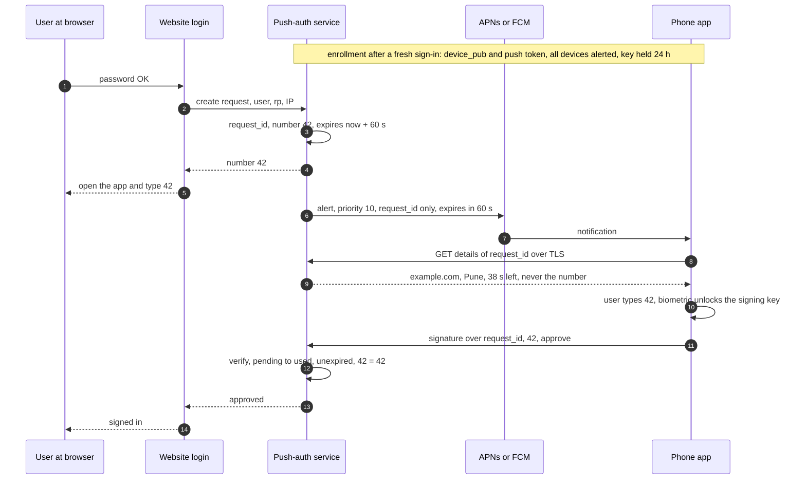
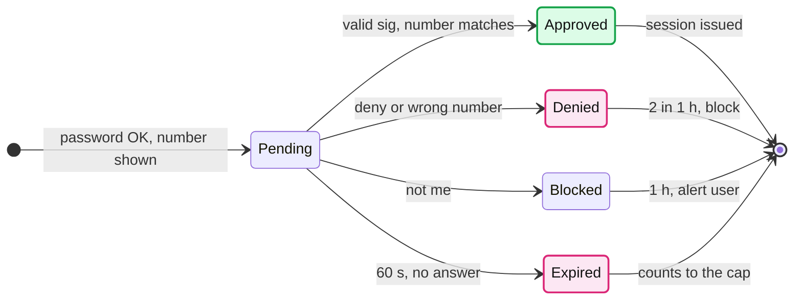
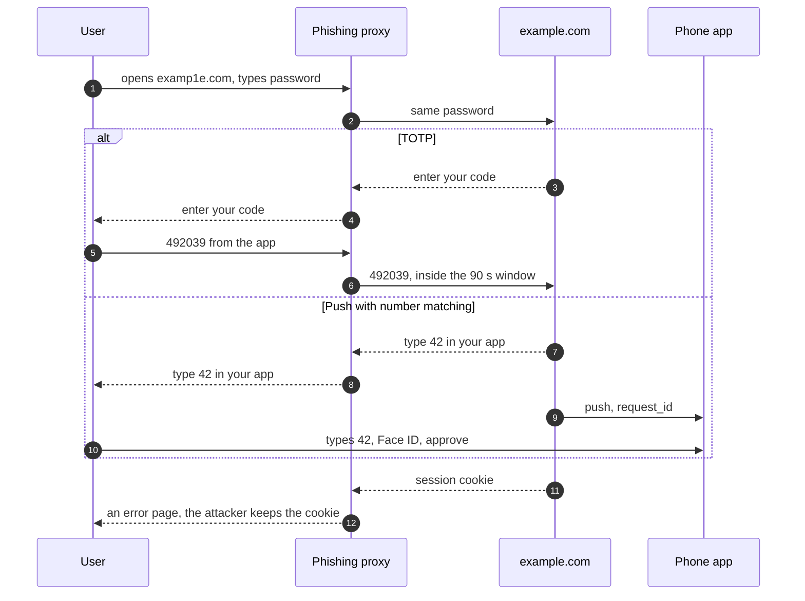
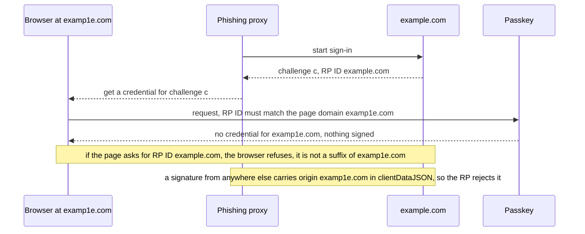

# Deep dive: push approval and phishing

> One-line answer: push approval replaces "copy 6 digits" with "the phone signs a challenge": the push-auth service creates a request with a 60 s time to live (TTL) and a 2-digit number shown on the login page, sends a high-priority Apple Push Notification service (APNs) or Firebase Cloud Messaging (FCM) alert that carries only `request_id`, the app fetches the details, the user types the number and passes a biometric, and the device signs `{request_id, number, decision}`, which the service accepts once, unexpired, with the right number. Push covers our own accounts. Number matching, a cap of 3 prompts per 10 minutes, and a 1 h block after 2 unanswered, denied or mismatched prompts kill blind approvals, the multi-factor authentication (MFA) fatigue attack that hit Uber in 2022. It does not stop phishing: an adversary-in-the-middle (AiTM) page shows the user the real number exactly as it relays a time-based one-time password (TOTP), and NIST SP 800-63B-4 §3.2.5 rules out any factor with "manual entry". Only a WebAuthn passkey is bound to the site's origin, and NIST §2.2.2 requires a phishing-resistant option at authenticator assurance level AAL2, so the reference RP verifier offers passkeys now, next to TOTP and push. The app can later become a passkey provider on the same vault key hierarchy (synced passkeys reach AAL2, never AAL3).

Related: [`../solution.md` §5.6](../solution.md#56-add-one-tap-push-approval-like-microsoft-authenticator-or-duo-what-changes-and-does-it-stop-phishing), [§10.10](../solution.md#1010-security-and-abuse), [§10.11](../solution.md#1011-evolution), [`multi-device-sync-and-conflicts.md`](multi-device-sync-and-conflicts.md) (the silent tickle, same APNs limits), [`vault-encryption-and-key-hierarchy.md`](vault-encryption-and-key-hierarchy.md) (device keys, revocation), [`recovery-and-hsm-escrow.md`](recovery-and-hsm-escrow.md) (the PIN that settles contested revokes), [`../../../concepts/realtime-client-server-communication.md`](../../../concepts/realtime-client-server-communication.md), [`../../../concepts/rate-limiting-and-load-shedding.md`](../../../concepts/rate-limiting-and-load-shedding.md).

---

## 1. The flow, end to end



- **Keys.** A second P-256 key pair per device, separate from the vault device key, usable only with a biometric and invalidated when the enrolled biometrics change, so a thief who knows the phone passcode cannot sign. The service stores `device_pub`; a stolen table signs nothing. Enrollment needs a fresh sign-in, alerts every device, and holds the new key 24 h with a cancel link, because it is the obvious persistence path after one relayed phishing session. Revoking a vault device also revokes its push registration.
- **The push is a doorbell.** It carries only `request_id`, so a lock-screen preview or a logged payload leaks nothing. The app fetches the details over TLS. The number is never in them, or number matching would be theatre.
- **Verification.** One compare-and-set from `pending` to `used`, plus signature, expiry and number checks. A replayed signed decision finds `used`. **Fallbacks:** the app pulls pending requests on open, and the login page always offers "enter a code instead".
- **Scope.** APNs and FCM accept pushes for our app only with our own credentials, so push covers our own accounts. Offering it to other websites (relying parties, RPs) means running push-auth as an API they call, the Duo and Microsoft model: a product decision, not a detail.

## 2. What APNs and FCM actually promise

| Knob | Apple APNs | Google FCM | What we set |
|---|---|---|---|
| Priority | `apns-priority` 10: "send the notification immediately"; 5: "based on power considerations" ([Apple](https://developer.apple.com/documentation/usernotifications/sending-notification-requests-to-apns)) | High: "FCM attempts to deliver high priority messages immediately, allowing FCM to wake a sleeping device" ([FCM](https://firebase.google.com/docs/cloud-messaging/android/message-priority)) | A visible alert: APNs 10, FCM high with a notification |
| Expiry | Nonzero `apns-expiration`: "stores the notification and tries to deliver it at least once ... until the specified date"; 0: "only once and doesn't store it"; "best efforts ... without any guarantee" | Default "four weeks", range 0 to 2,419,200 s; `ttl` 0: "messages that can't be delivered immediately are discarded" ([FCM](https://firebase.google.com/docs/cloud-messaging/customize-messages/setting-message-lifespan)) | `apns-expiration` at the request's expiry, FCM `ttl` 60 s, so no prompt outlives its request |
| Collapse | `apns-collapse-id` merges notifications into one, ≤ 64 bytes | Collapsible: "a burst of 20 messages per app per device, with a refill of 1 message every 3 minutes" ([FCM](https://firebase.google.com/docs/cloud-messaging/throttling-and-quotas)) | One collapse id per user: a burst shows one prompt |
| Silent / data-only | Background pushes: "the system doesn't guarantee their delivery", "don't try to send more than two or three per hour" ([Apple](https://developer.apple.com/documentation/usernotifications/pushing-background-updates-to-your-app)) | High priority that does not end in a user-facing notification "may be deprioritized to normal priority" | Never for approvals. Fine for the vault tickle, which is a hint |

Neither promises delivery. That is why the app pulls on open and the page offers a code.

## 3. The request lifecycle



## 4. MFA fatigue and number matching

- **The attack.** Uber, September 2022: "The attacker then repeatedly tried to log in to the contractor's Uber account. Each time, the contractor received a two-factor login approval request ... Eventually, however, the contractor accepted one" ([Uber](https://www.uber.com/newsroom/security-update/)).
- **Number matching.** Microsoft: "they see a number. They need to enter that number into the app to complete the approval" ([Microsoft Learn](https://learn.microsoft.com/en-us/entra/identity/authentication/how-to-mfa-number-match)), enforced for all Authenticator push from May 8, 2023 ([BleepingComputer](https://www.bleepingcomputer.com/news/microsoft/microsoft-enforces-number-matching-to-fight-mfa-fatigue-attacks/)). A user who cannot see the login page cannot know the number. A blind guess wins about 1 time in 90 (numbers 10 to 99).
- **Our caps.** 3 prompts per 10 min per user. A denial, a wrong number and an unanswered expiry each count as a strike; 2 strikes in an hour, or 1 "this was not me", block prompts for 1 h and alert the user. Counting expiries matters: otherwise a user who never answers still gets 3 every 10 min, 432 a day. A wrong number means someone is prompting a user who cannot see the screen. Any push at all means the password is known, so 2 unapproved requests in an hour also force a password change.

## 5. Phishing: why relay beats TOTP and push, and loses to a passkey



- **Why both pass.** The proxy is a faithful pipe, so the code and the number are correct. Microsoft's AiTM campaign "attempted to target more than 10,000 organizations since September 2021", and "This is not a vulnerability in MFA; since AiTM phishing steals the session cookie, the attacker gets authenticated to a session on the user's behalf, regardless of the sign-in method" ([Microsoft](https://www.microsoft.com/en-us/security/blog/2022/07/12/from-cookie-theft-to-bec-attackers-use-aitm-phishing-sites-as-entry-point-to-further-financial-fraud/)). The 0ktapus kits (130+ organizations) sent codes to a Telegram channel and the attackers "need to use the compromised data as soon as they get it" ([Group-IB](https://www.group-ib.com/blog/0ktapus)).
- **What NIST says.** §3.1.4: "OTP authentication is not phishing-resistant". §3.2.5: "Authenticators that involve the manual entry of an authenticator output (e.g., out-of-band and OTP authenticators) SHALL NOT be considered phishing-resistant because the manual entry does not bind the authenticator output to the specific session" ([SP 800-63B-4](https://pages.nist.gov/800-63-4/sp800-63b.html)). Typing 42 is that manual entry.



- **Two bindings.** The RP ID "must be equal to the origin's effective domain, or a registrable domain suffix of the origin's effective domain" ([WebAuthn L2](https://www.w3.org/TR/webauthn-2/)), so the passkey is scoped to example.com. The browser writes the real origin into the signed client data, and the RP's §7.2 check is "Verify that the value of C.origin is an origin expected by the Relying Party". Nothing the user types or taps can override either.

## 6. Factor comparison

| Factor | Phishing-resistant | SIM-swap exposure | Phone offline | User effort | RP server state | NIST 63B-4 AAL |
|---|---|---|---|---|---|---|
| SMS code | No | Yes, the code goes to the number | No | Wait, type 6 digits | Code hash + TTL | AAL2, but the phone network (PSTN) is "restricted" (§3.1.3.3) |
| TOTP | No (§3.1.4) | No | Yes | Open app, type 6 digits | Secret it cannot hash, `last_step`, counters | AAL2 with a password |
| Push | No (§3.2.5), and blind taps | No | No | One tap + biometric | `device_pub`, push token, 60 s requests | AAL2, out-of-band |
| Push + number matching | No, but no blind taps | No | No | Type 2 digits + biometric | Same + the number | AAL2 |
| Synced passkey | Yes, origin-bound | Only if the sync account recovers by SMS | Yes on the same device | Biometric | Public key + credential id, nothing secret | AAL2. "syncable authenticators SHALL NOT be used at AAL3" (§2.3.2) |
| Device-bound passkey, security key | Yes | No | Yes | Touch or biometric | Public key | AAL3 possible: non-exportable key + phishing resistance |

NIST §2.2.2: "Verifiers SHALL offer at least one phishing-resistant authentication option at AAL2". An RP that offers only TOTP and push is not AAL2 under revision 4, so the reference RP verifier we ship offers passkeys now.

## 7. Passkeys now at the RP, and the app as a passkey provider next

- **Same vault, new item type.** A passkey item holds `{rp_id, credential_id, user_handle, P-256 private key}`, sealed under the vault key (VK) like a TOTP item. Sync, merge rules, device slots and hardware security module (HSM) recovery are unchanged. The app registers as the OS's passkey provider; the browser keeps doing the origin check. NIST Appendix B applies: synced keys stored only encrypted, AAL2 at most.
- **Not its own second way in** (§5.2). A passkey stored in this vault does not count as the independent second factor for the account that holds this vault.
- **Revoking a phone** (§5.1, §5.2). It needs another active device's signature and takes effect after 24 h with alerts, or at once with a passkey at least 7 days old. A contested revoke, and cancelling a recovery, need the recovery PIN proven at the HSMs or that old passkey. The revoke also removes the phone's push registration, and the app lists the other RPs to clean up.

## 8. A runnable model of the push service

HMAC-SHA256 stands in for the device's elliptic-curve (ECDSA P-256) signature, clearly labelled: a real verifier holds only `device_pub`.

```python
"""Push approval with number matching. Stdlib only.
STAND-IN: HMAC-SHA256 plays the device's P-256 ECDSA signature. A real verifier holds only the public key
from enrollment; here the "public" key and the signing key are the same bytes. Do not ship this."""
import hashlib, hmac, json, secrets

TTL, CAP, WINDOW, BLOCK = 60, 3, 600, 3600               # seconds; 3 prompts per 10 min, 1 h block

def sign(key, msg): return hmac.new(key, json.dumps(msg, sort_keys=True).encode(), hashlib.sha256).hexdigest()

class PushService:
    def __init__(s): s.keys, s.reqs, s.prompts, s.strikes, s.blocked, s.reset = {}, {}, {}, {}, {}, set()
    def enroll(s, user, device_key): s.keys[user] = device_key          # really: device_pub, attested
    def strike(s, user, t):                              # a deny, a wrong number or no answer. 2 in 1 h block
        s.strikes[user] = [x for x in s.strikes.get(user, []) if t - x < BLOCK] + [t]   # prompts, force a new password
        if len(s.strikes[user]) >= 2: s.blocked[user] = t + BLOCK; s.reset.add(user)
    def start(s, user, now):                             # after the password step, on the login page
        for r in s.reqs.values():                        # an unanswered request past its expiry is a strike
            if r["user"] == user and r["state"] == "pending" and now > r["expires"]:
                r["state"] = "expired"; s.strike(user, r["expires"])
        if s.blocked.get(user, 0) > now: return None, "blocked, offer a code instead"
        recent = [t for t in s.prompts.get(user, []) if now - t < WINDOW]
        if len(recent) >= CAP: return None, "fatigue cap, offer a code instead"
        rid, number = secrets.token_urlsafe(16), secrets.randbelow(90) + 10   # 2 digits, shown on the login page
        s.prompts[user] = recent + [now]
        s.reqs[rid] = {"user": user, "rp": "example.com", "city": "Pune", "number": number,
                       "expires": now + TTL, "state": "pending"}
        return rid, number                               # the push carries only rid
    def details(s, rid):                                 # what the app fetches over TLS: never the number
        r = s.reqs[rid]; return {k: r[k] for k in ("rp", "city", "expires")}
    def pending(s, user, now):                           # pull on open: the fallback when the push never arrives
        return [i for i, r in s.reqs.items() if r["user"] == user and r["state"] == "pending" and now <= r["expires"]]
    def decide(s, rid, number, decision, sig, now):
        r = s.reqs.get(rid)
        if r is None or r["state"] != "pending": return "rejected: unknown or already used"
        msg = {"rid": rid, "number": number, "decision": decision}
        if not hmac.compare_digest(sig, sign(s.keys[r["user"]], msg)): return "rejected: bad signature"
        if now > r["expires"]: r["state"] = "expired"; s.strike(r["user"], r["expires"]); return "rejected: expired"
        r["state"] = "used"                              # single use, a compare-and-set in a real store
        if decision == "not_me": s.blocked[r["user"]] = now + BLOCK; return "denied: blocked 1 h, alert user"
        if decision == "deny" or number != r["number"]:  # a wrong number is a strike too
            s.strike(r["user"], now); return "denied: wrong number" if decision != "deny" else "denied"
        return "approved"

def app_answer(key, rid, typed, decision="approve"):    # biometric passed; the device signs what the user saw
    return typed, decision, sign(key, {"rid": rid, "number": typed, "decision": decision})

if __name__ == "__main__":
    key, svc = secrets.token_bytes(32), PushService()
    for user in ("alice", "bob", "carol", "dave", "erin"): svc.enroll(user, key)
    rid, n = svc.start("alice", now=0)
    print("1  push lost, app opens  :", "pending request found" if svc.pending("alice", now=10) == [rid] else "none")
    a = app_answer(key, rid, n)
    print("2  normal approve        :", svc.decide(rid, *a, now=12), "| app saw", svc.details(rid))
    print("3  replayed decision     :", svc.decide(rid, *a, now=13))
    rid, n = svc.start("alice", now=100)
    print("4  approve at 61 s       :", svc.decide(rid, *app_answer(key, rid, n), now=161))
    rid, n = svc.start("alice", now=200)
    forged = sign(b"attacker", {"rid": rid, "number": n, "decision": "approve"})
    print("5  forged signature      :", svc.decide(rid, n, "approve", forged, now=205))
    print("6  4th prompt in 10 min  :", svc.start("alice", now=210)[1])
    rid, n = svc.start("dave", now=0)
    print("7  wrong number          :", svc.decide(rid, *app_answer(key, rid, (n + 1) % 90 + 10), now=5))
    for t in (0, 30):
        rid, n = svc.start("bob", now=t)
        print(f"8  bob denies at t={t:<2} s  :", svc.decide(rid, *app_answer(key, rid, n, "deny"), now=t + 5))
    print("9  prompt after 2 denials:", svc.start("bob", now=60)[1], "| password change forced:", "bob" in svc.reset)
    print("10 bob at 1 h 2 min      :", "sent" if svc.start("bob", now=3720)[0] else "refused")
    for t in (0, 100): svc.start("erin", now=t)           # two prompts nobody answers
    print("11 erin ignored 2 prompts:", svc.start("erin", now=200)[1], "| password change forced:", "erin" in svc.reset)
    rid, n = svc.start("carol", now=0)                   # adversary in the middle: the phishing page shows the real n
    print("12 AiTM relay, user types the relayed number:", svc.decide(rid, *app_answer(key, rid, n), now=9))
```

Output (`python3 push_model.py`):

```
1  push lost, app opens  : pending request found
2  normal approve        : approved | app saw {'rp': 'example.com', 'city': 'Pune', 'expires': 60}
3  replayed decision     : rejected: unknown or already used
4  approve at 61 s       : rejected: expired
5  forged signature      : rejected: bad signature
6  4th prompt in 10 min  : fatigue cap, offer a code instead
7  wrong number          : denied: wrong number
8  bob denies at t=0  s  : denied
8  bob denies at t=30 s  : denied
9  prompt after 2 denials: blocked, offer a code instead | password change forced: True
10 bob at 1 h 2 min      : sent
11 erin ignored 2 prompts: blocked, offer a code instead | password change forced: True
12 AiTM relay, user types the relayed number: approved
```

Rows 1 to 11 are the service doing its job: lost push recovered by the pull, single use, 60 s expiry, forged signature, the 3-per-10-minute cap, a wrong number as a strike, the 1 h block with a forced password change, the block lifting, and ignored prompts counting. **Row 12 is the point.** The service cannot tell a relayed approval from a real one, because nothing in it knows which page the user was on. Only the browser does, and only WebAuthn asks it.

## 9. Trade-offs

| Decision | Chose | Gave up |
|---|---|---|
| Push payload | `request_id` only, details over TLS | One extra round trip, ~100 ms [estimate] |
| Number matching | 2 digits typed in the app | A tap becomes typing; blind guesses still win ~1 in 90 |
| Fatigue control | 3 per 10 min; 2 strikes (deny, wrong number, expiry) or 1 "not me" block 1 h | An attacker can deliberately block a real user's push for an hour; codes still work |
| Phishing | Say no; the RP verifier offers passkeys now | TOTP and push stay for breadth, with their relay risk named |

## 10. What the interviewer probes next

- **"Does number matching stop phishing?"** No. It stops blind approvals. The AiTM page shows the real number.
- **"The push never arrives."** APNs and FCM promise nothing; the app pulls on open and the page offers a code.
- **"A thief has the unlocked phone."** The signing key needs the owner's biometric. Revoke from another device, after 24 h, or at once with an old passkey.
- **"Why not make every login a passkey?"** Our verifier offers one now, but many RPs still accept only TOTP or SMS. We keep TOTP for them.
