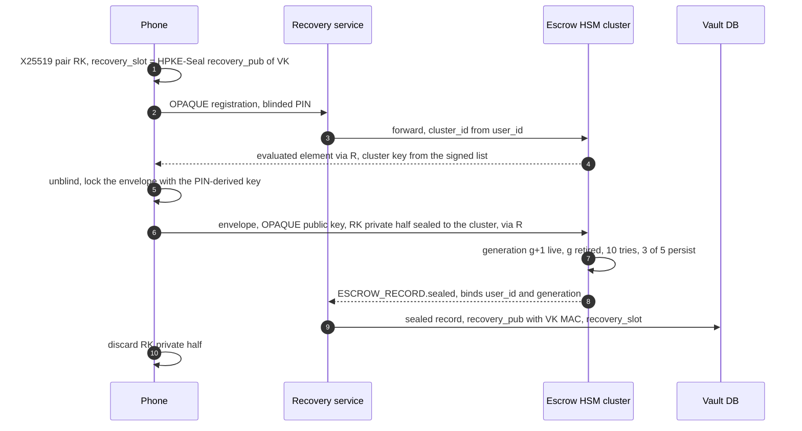
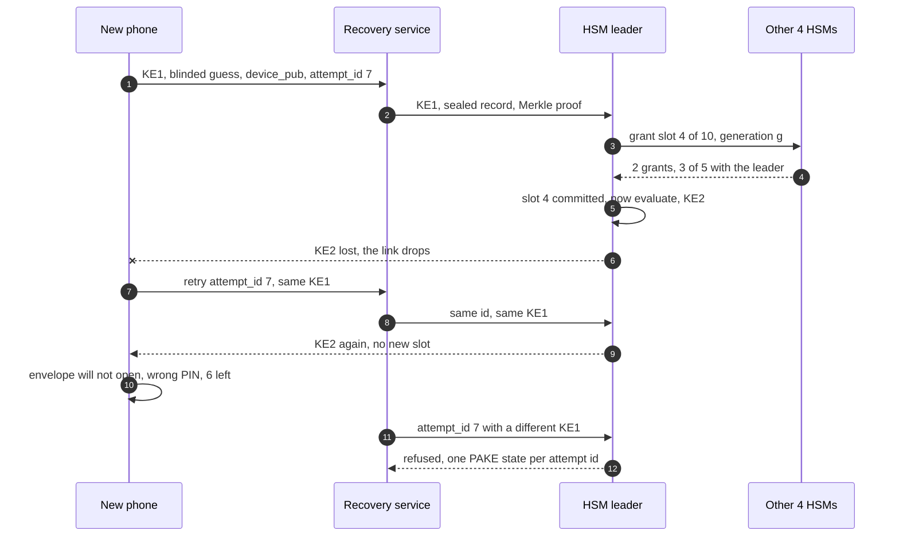
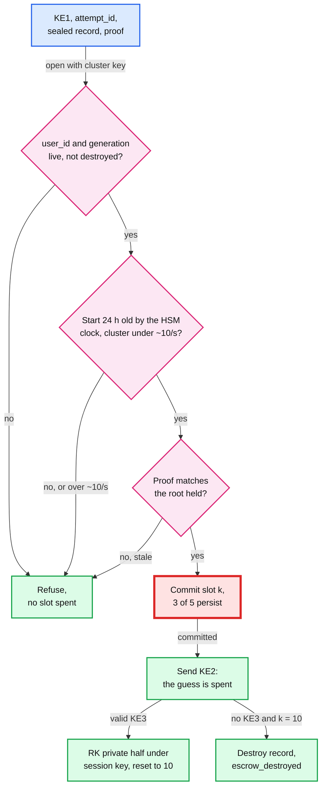

# Deep dive: recovery and HSM escrow

> One-line answer: a 6-digit PIN has 10^6 values, which one GPU tests in ~45 µs against any blob it can copy, so the PIN is safe only behind a guess counter nobody can reset: the recovery private half lives in a 5-HSM cluster that checks the PIN with OPAQUE (RFC 9807), so the PIN never leaves the phone, commits "attempt k of 10" by a majority **before** sending the message that lets the phone test the PIN, and destroys the record after the 10th failure, with a 24 h wait registered in the HSMs and alerts on every attempt. The details decide it: in the simulation below, per-HSM counters with "any 3 acks" let a hostile relay test 16 PINs, an agreed attempt slot holds it at 10 through crashes and replays, and checking before decrementing is unlimited. What stays open is denial of service: whoever owns the account and the user's inbox can burn the record of a user who has no device left.

Related: [`../solution.md` §5.2](../solution.md#52-the-user-lost-every-device-how-do-they-get-their-codes-back-without-letting-an-attacker-do-the-same), [Flow 6](../solution.md#flow-6-an-attacker-owns-the-account-and-tries-to-restore-failure), [§10.4](../solution.md#104-failure-timeline), [`vault-encryption-and-key-hierarchy.md`](vault-encryption-and-key-hierarchy.md) (what the recovery private half unlocks), [`../../../concepts/replication-and-quorums.md`](../../../concepts/replication-and-quorums.md) (why two majorities always share a member), [`../../../concepts/merkle-tree.md`](../../../concepts/merkle-tree.md) (proofs for counters outside the HSM), [`../../../concepts/rate-limiting-and-load-shedding.md`](../../../concepts/rate-limiting-and-load-shedding.md).

---

## 1. Why a low-entropy PIN needs a hardware guess limit

Anything an attacker can copy (a database row, a backup, a blob the HSM re-seals) can be tested offline at the speed of their hardware. Key stretching multiplies the cost of a guess by a constant. Only a counter changes the number of guesses.

| What protects the copied blob | Speed | All 10^6 PINs |
|---|---|---|
| Salted SHA-256 | 21,975.5 MH/s on one RTX 4090 ([hashcat benchmark](https://gist.github.com/Chick3nman/32e662a5bb63bc4f51b847bb422222fd)) | ~45 µs. Python on one laptop core: ~0.2 s (§7) |
| PBKDF2-HMAC-SHA256, 600,000 iterations (OWASP) | 8,865.7 kH/s at 999 iterations on the 4090, so ~14,800 guesses/s | ~68 s |
| scrypt at Aegis's N = 2^15 | 7,126 H/s at N = 16,384, so ~3,600/s if cost is linear in N [estimate] | ~5 min |
| Argon2id, 64 MiB, t = 3 | Say 1 s per guess per core [estimate] | 11.6 core-days, ~$11 at ~$0.04 per core-hour [estimate] |
| HSM counter | 10 guesses, ever | Never. A uniform PIN falls with odds 10 / 10^6 = 10^-5 |

## 2. The protocol

**OPAQUE in plain words.** At setup the phone "blinds" the PIN (scrambles it with a random number only it knows) and the HSM applies its own secret key to that blinded value. The phone unblinds the result and gets a strong key that depends on both the PIN and the HSM's secret. It uses that key to seal an "envelope" from which only the right PIN recovers the phone's OPAQUE key pair, and hands the HSM the envelope plus the recovery private half, sealed to the cluster key.
- **The HSM never learns** the PIN or a hash of it. There is no SRP-style verifier `v = g^x`, of which RFC 5054 warns an attacker "can also attempt a dictionary attack". OPAQUE adds "security against pre-computation attacks upon server compromise" ([RFC 9807](https://www.rfc-editor.org/rfc/rfc9807), July 2025). Apple uses SRP and keeps the verifier inside the HSMs, which also works.
- **The relay** (Recovery service, Vault DB, any insider) sees blinded values and MACs. Nothing it can test offline. Each run it relays is one online guess, charged by the HSMs. **The app pins an attestation root** and accepts cluster keys only from a signed list with a sequence number, as Google Cloud Key Vault does: otherwise a malicious Recovery service answers setup with its own key and receives the RK private half sealed to it, with no guessing at all.
- **The honest limit.** The HSM holds its OPRF key and the envelope, so a compromised HSM could test PINs offline. The PAKE protects against everyone outside the HSM; locked firmware protects against its operator.



**Where the guess is spent.** Login is three messages. KE1 carries the blinded guess and the new device's public key. KE2 carries the HSM's evaluation, and with it **the phone opens the envelope or fails right there**: the phone learns the answer before the HSM does. So the slot is committed before KE2 leaves the cluster. KE3 proves the phone opened the envelope; only then does the cluster reset the counter to 10 and return the RK private half under the PAKE session key, with `device_pub` bound into the transcript. With SRP the commit point moves: before the server answers the client's proof.





The commit is red because it is what stops first: it needs 3 of 5 up across regions, and it is the firmware's ~10/s ceiling.

## 3. Counter state and rollback

- **Not in our database.** Restoring last week's backup would refill every attacker's guesses, and an insider could write 10.
- **Not inside the sealed blob either.** Sealing gives integrity, not freshness. If the HSMs re-sealed the counter into `ESCROW_RECORD.sealed` after each attempt, the relay would hand back last week's blob. Signal described this for disks in 2019: a malicious operator "could just remove the disk, image it, replace the disk, run the guess counter down, then repeatedly roll back the storage volume" ([Signal](https://signal.org/blog/secure-value-recovery/)).
- **In HSM memory** when it fits: ~10 M records x ~16 B (record id hash, generation, slot) = ~160 MB per member. Whether that fits depends on the model [estimate].
- **Otherwise a Merkle root** [design choice]. A sparse Merkle tree keyed by record id holds leaves `H(record_id ‖ generation ‖ slot)`; the tree lives in our database, and each HSM keeps only the roots of 1,024 subtrees (32 KB). An attempt brings the leaf and its 14 sibling hashes (2^24 leaves / 1,024 subtrees = 2^14 per subtree, 448 B). The HSM hashes up and must land on the root it holds, bumps the slot, recomputes the root along the same path, and that new root is what 3 of 5 persist. **A stale proof** (from before the last attempt) hashes to an old root and is refused. Two attempts in one subtree: the second proof goes stale and the relay refreshes it; at ~0.3/s per cluster that is rare. If we lose the tree, nothing verifies and recoveries stop: an availability risk, not a security one, so the tree is replicated like the vault.
- **What one live generation buys.** A new record retires the old one in the same majority update, so the relay cannot resubmit an old blob, or an old PIN, for 10 fresh tries. A correct PIN resets to 10 the same way: slots compare as `(generation, reset count, slot)`.

| System | What it publishes | Our reading |
|---|---|---|
| Apple iCloud Keychain | SRP; "Each member of the cluster independently verifies that the user hasn't exceeded the maximum number of attempts"; "If a majority agree"; 10 attempts, then destroyed; "After several failed attempts, the record is locked and the user needs to call Apple Support to be granted more attempts" ([Apple](https://support.apple.com/guide/security/escrow-security-for-icloud-keychain-sec3e341e75d/web)) | Where the counter lives and how a member that missed an attempt catches up are not published. §7 shows why that detail is worth 6 guesses |
| Google Cloud Key Vault | Titan chips "maintain a strictly incrementing per-Vault counter of failed attempts (where the counter is backed by state stored inside the Titan chip)"; cohorts "distributed across physically disparate data centers"; a firmware patch is "functionally equivalent to destroying the existing hardware" ([whitepaper](https://developer.android.com/about/versions/pie/security/ckv-whitepaper)) | No guess number, and no statement on how cohort members agree on a counter |
| Signal SVR (2019), WhatsApp (2021) | Signal: SGX enclaves, the guess count replicated by Raft, "if we set the maximum failed guess count to 5". WhatsApp: an HSM Backup Key Vault "rendering the key permanently inaccessible after a limited number of unsuccessful attempts" ([Meta](https://engineering.fb.com/2021/09/10/security/whatsapp-e2ee-backups/)) | Same shape. Anything not quoted here is [design choice] |

## 4. The 24-hour cooling-off

- `POST /v1/recovery` registers the start in the HSMs' own state, timed by each HSM's internal monotonic counter (a majority agrees, never outside wall-clock time), and alerts every device active or revoked in the last 30 days, plus the email and phone on file 30 days ago. Every attempt alerts again. A ready recovery expires after 7 days. **Only a passkey or security key registered at least 7 days earlier skips the wait**; otherwise an account thief would add one and skip.
- **It defends against** the account thief when the real user still has any one of: an old or revoked device, the inbox, the phone number from 30 days ago. They cancel. A PIN-proven cancel is registered in the HSMs, which then refuse that start (a wrong PIN there spends a try); a cancel by a passkey at least 7 days old is enforced only by the Recovery service. Alerts to revoked devices are read-only.
- **It does not defend against** a user who lost every device **and** whose inbox and phone number (the ones on file 30 days ago) the attacker also controls. Nobody sees the alerts. The PIN alone stands: 10 guesses open ~1% to ~10% of records, depending on how users pick PINs (§7).
- **Why cancel needs the PIN.** A thief's stolen phone stays active for 24 h after a device-signed revoke. If a tap could cancel, it would cancel the owner's recovery; contesting its own revoke only freezes both devices until the PIN or an old passkey settles it.

## 5. The denial of service: burning the 10 guesses

- **The attack.** Own the account, start a recovery, wait 24 h while nobody cancels, type 10 wrong PINs. At the ~10/s ceiling that takes about a second. The record is destroyed.
- **Who is hurt.** A user with a live device loses nothing: `escrow_destroyed` reaches every device, signs out every session, forces a password change, and the devices prompt for a new PIN (re-escrow once per 30 days); new recovery starts then need a passkey at least 7 days old. A user with no device left loses the codes and falls back to each website's backup codes. Exposure is the ~18k users a day who start a recovery [estimate, solution §2], and only those whose alerts nobody reads.
- **Mitigations.** The 24 h wait before any guess (in the HSMs); every attempt alerts; cancel with the PIN or an old passkey; at most ~3 recovery starts per account per 30 days [estimate]; an HSM-enforced token bucket of ~3,000 starts an hour per cluster (baseline ~1,800 a day), above which only old-passkey starts pass and a mass event needs a ceremony-approved raise; and staging: **5 guesses per recovery request**, then a new HSM-registered 24 h start and fresh alerts, so burning all 10 takes at least 48 h. Apple stages too ("After several failed attempts, the record is locked").
- **An insider is slower, not stopped.** Spending every guess at the ~10/s ceiling takes ~116 days (10 M x 10 / 10 per s), for all 100 M users since clusters run in parallel, every attempt alerting, and opens the records whose PIN falls in 10 guesses (~1% to ~10%, §7). The start cap binds harder: 2 starts per user (5 tries each) x 10 M at ~3,000 an hour is ~9 months [estimate]. Devices fetch the HSM-signed record status (tries left, "start pending since") on open and at least every 12 h, so even an insider's direct start is seen before its 24 h wait ends. Freshness comes from a per-cluster heartbeat: about once a minute the HSMs sign the root of the record-state tree plus an increasing sequence number; a device checks a Merkle proof for its record and that the sequence advances against its own clock. 24 h without a fresh heartbeat is itself an alert.
- **Residual risk, stated.** The account, the inbox and phone number on file 30 days ago, 24 h of silence (48 h with staging), and no device left: the codes are lost. We accept it. The alternative, support resetting the counter, hands the same attacker the vault through a help desk.

## 6. Capacity and operations

| Item | Number |
|---|---|
| Clusters | 10 x 5 HSMs, placed 2 + 2 + 1 across 3 regions in one jurisdiction, ~10 M users each |
| Load | ~0.2/s average, ~3/s peak fleet-wide; ~0.3/s peak per cluster |
| Ceiling | ~10 attempts/s per cluster, one majority round each and a firmware limit [estimate]: ~30x headroom |
| Launch week | ~15 device changes/s in the peak hour, ~3/s of them need the HSMs |
| Mass event | An OS update invalidates device keys for 10 M users: ~14 days of starts at ~3,000/h per cluster unless a ceremony raises the cap, then ~28 h of attempts at the 10-cluster ceiling [estimate] |
| Hardware | 50 HSMs, ~$1 M to $2 M [estimate], 1 to 2 cents per user |

- **N of 5 up.** 5 of 5: normal. 4 of 5 up: page crypto on-call. 3 of 5 up: still a majority, no margin. 2 of 5 up: no majority, its ~10 M users get "try later". Nothing is lost, and device hand-off still works.
- **Destroyed cluster** (all 5 gone): its records are gone. There is no backup of the cluster key, because a restored key without the current counters refills every guess. `escrow_destroyed` goes to every device; live devices re-escrow to another cluster with a new PIN. Users with no device in that window lose the HSM path. Replacing a member is a key ceremony (cloned HSM to HSM, M-of-N officers, recorded): hours to days, after weeks of procurement [estimate].
- **Firmware is locked.** Apple: "The administrative access cards that permit the firmware to be changed have been destroyed". Changing a policy (10 tries to 5, say) means new clusters and migrating users by re-escrow, which needs each user's PIN: dormant users stay on the old clusters for years. Treat the firmware like a schema you can never migrate. It must be our code (OPAQUE, slots, the 24 h clock, the ceiling): a key-storage-only HSM cannot enforce this policy [design choice].

## 7. Runnable simulations

**The counter.** Design A gives each HSM its own counter and checks a guess once any 3 decrement. Design B agrees on one attempt slot: an HSM grants slot k once, only if its own slot is below k. Any two majorities of 5 share a member, so a slot is never granted to two guesses. Design C, check first and decrement after, needs no simulation: the relay drops the decrement after every "wrong", so the limit never moves.

```python
"""5 HSMs, 10 guesses per record, start registered in the HSMs at hour 0. The relay (our Recovery service) is
hostile: it picks which members see each message, tries before the 24 h are up, cuts the link after a
commit and replays old attempt ids. Members crash 20% of the time. One loop step is 15 minutes."""
import itertools, random
N, MAJ, LIMIT = 5, 3, 10

def design_a(rng):                                    # each HSM keeps its own counter; any 3 acks check a guess
    used, n = [0] * N, 0
    while len(live := [i for i in range(N) if used[i] < LIMIT]) >= MAJ:
        for i in sorted(live, key=lambda i: (used[i], rng.random()))[:MAJ]: used[i] += 1   # least-used quorum
        n += 1
    return n

class HSM:                                            # design B: grant attempt slot k once; slots only rise
    def __init__(s): s.slot, s.up, s.seen = 0, True, {}
    def grant(s, k, aid, guess, hour):
        if not s.up or hour < 24: return False        # the 24 h wait, by the HSM's own clock
        if aid in s.seen: return s.seen[aid] == (k, guess)       # a retry of the same guess costs nothing
        if k > LIMIT or s.slot >= k: return False
        s.slot, s.seen[aid] = k, (k, guess); return True

def design_b(rng, pin=None):                          # pin=None: attacker; else an honest user, right on try 3
    hs, checked, ids, k, first = [HSM() for _ in range(N)], set(), itertools.count(), 1, None
    aid, guess = next(ids), rng.randrange(10**6)
    for hour in (s / 4 for s in range(400)):
        for h in hs: h.up = rng.random() > 0.2
        if pin is None and hs[0].seen and rng.random() < 0.2:            # old attempt id, new guess
            old, g = rng.choice(list(hs[0].seen)), rng.randrange(10**6)
            if sum(h.grant(hs[0].seen[old][0], old, g, hour) for h in hs) >= MAJ: checked.add(g); first = first or hour
            continue
        if sum(h.grant(k, aid, guess, hour) for h in rng.sample(hs, MAJ)) < MAJ: continue   # no majority
        if rng.random() < 0.3: continue                                  # link cut after commit: retry same id
        checked.add(guess); first = first or hour                        # KE2 sent: this guess is tested
        if guess == pin or k == LIMIT: break
        k, aid = k + 1, next(ids)
        guess = pin if pin is not None and k == 3 else rng.randrange(10**6)
    return len(checked), max(h.slot for h in hs), first

print(f"A  own counter per HSM, any 3 acks:  max {max(design_a(random.Random(s)) for s in range(2000))} guesses checked")
att = [design_b(random.Random(s)) for s in range(2000)]
print(f"B  agreed slot, hostile relay:       max {max(a[0] for a in att)} guesses checked, earliest at hour {min(a[2] for a in att if a[2])}")
hon = {design_b(random.Random(s), pin=482913)[:2] for s in range(2000)}
print(f"B  honest user, right PIN on try 3:  (guesses checked, slots used) = {sorted(hon)}")
```

```
A  own counter per HSM, any 3 acks:  max 16 guesses checked
B  agreed slot, hostile relay:       max 10 guesses checked, earliest at hour 24.0
B  honest user, right PIN on try 3:  (guesses checked, slots used) = [(3, 3)]
```

- **A leaks 6 guesses.** 5 HSMs x 10 = 50 decrements, 3 per guess: 16 guesses when the relay always picks the 3 least-used members.
- **B holds at 10** with 20% crashes, cuts after commit and replayed attempt ids, and nothing is checked before hour 24. The honest user who retries the same attempt id loses no slot to a dropped link.

**The PIN.** How much do 10 guesses buy against real choices, does refusing the top 20 help, and what would the same PINs cost offline?

```python
"""An attacker with 10 online guesses against 6-digit recovery PINs, with and without refusing the top 20.
[assumption] How users pick: 5% choose 123456, 15% choose from ranks 2 to 1,000 with weight 1/rank, 80% choose
uniformly. That puts 10 guesses at ~9.5%, between the 6.23% and 13.28% Markert et al. (2020) measured."""
import collections, hashlib, itertools, os, random, time
rng = random.Random(1)
order = [f"{i:06d}" for i in range(10**6) if i != 123456]
rng.shuffle(order); ranked = ["123456"] + order               # popularity order; ranks past 1,000 are flat
head = list(itertools.accumulate(1 / r for r in range(2, 1001)))
def first_choice():
    u = rng.random()
    return 0 if u < 0.05 else rng.choices(range(1, 1000), cum_weights=head)[0] if u < 0.20 else rng.randrange(10**6)
def chosen(rule):                                              # rule: what a user does when refused
    r = first_choice()
    if rule == "none" or r >= 20: return ranked[r]
    if rule == "scatter": return ranked[next(x for x in iter(first_choice, None) if x >= 20)]
    return ranked[r + 20]                                      # "shift": a near variant, rank + 20
for rule, label in (("none", "no blocklist"), ("scatter", "top 20 refused, user re-picks at random"),
                    ("shift", "top 20 refused, user picks a near variant")):
    counts = collections.Counter(chosen(rule) for _ in range(300_000))
    allowed = ranked if rule == "none" else ranked[20:]
    best = sorted(allowed[:2000], key=lambda p: -counts[p])[:10]          # attacker knows the habits
    print(f"{label:42} 10 guesses open {sum(counts[p] for p in best) / 300_000:6.2%}")
print(f"{'uniform random PIN':42} 10 guesses open {10 / 10**6:6.4%}")
salt = os.urandom(16); want = hashlib.sha256(salt + b"482913").digest(); t = time.perf_counter()
hit = next(i for i in range(10**6) if hashlib.sha256(salt + b"%06d" % i).digest() == want)
print(f"offline instead: salted SHA-256 finds {hit:06d} in {time.perf_counter() - t:.2f} s on one laptop core")
```

```
no blocklist                               10 guesses open  9.49%
top 20 refused, user re-picks at random    10 guesses open  1.04%
top 20 refused, user picks a near variant  10 guesses open 10.35%
uniform random PIN                         10 guesses open 0.0010%
offline instead: salted SHA-256 finds 482913 in 0.27 s on one laptop core
```

- Uniform PINs would make 10 guesses worth 10^-5. Real ones are worth ~10%, in line with the 6.23% (first-choice PINs) to 13.28% (RockYou 6-digit) that Markert et al. measured ([IEEE S&P 2020](https://arxiv.org/abs/2003.04868)).
- A blocklist helps only if displaced users scatter; if they move to a near variant, it does nothing. Markert et al. found the iOS list, a warning users can click through, gave "little or no benefit" against a throttled attacker. Ours hard-refuses ~1,000 to 3,000 common PINs plus near variants (iOS's list has 2,910): expect ~1% to 10% per record [estimate].

## 8. Trade-offs

| Decision | Chose | Gave up |
|---|---|---|
| PIN check | OPAQUE inside the HSMs | SRP's older, simpler libraries |
| Counter | One agreed slot, 3 of 5 persist before KE2 | A majority round per attempt, the ~10/s ceiling |
| Guesses | 10 per record, 5 per request | Some honest users run out |
| Cooling-off | 24 h in the HSMs, skipped by a 7-day-old passkey | Honest users wait a day |
| Cluster loss | Repair, never restore from backup | ~10 M users wait for hardware |
| Not built | A support desk that resets counters, SMS recovery | A user who forgets the PIN and loses every device loses the codes |

## 9. What the interviewer probes next

- **"The Recovery service is compromised. What can it do?"** Delay, drop, and spend guesses at ~10/s per cluster after registered 24 h starts that alert everyone, opening the weak-PIN records. It cannot read RK (PAKE session key), swap the device key (bound in the transcript), swap the cluster key at setup (signed list under a pinned root), or replay an old record (one live generation).
- **"Why 5 HSMs and not 3?"** 3 tolerates one failure and then stops. 5 tolerates two, so one can be in repair while another fails.
- **"Can support give a locked-out user more tries?"** Apple's support can. We refuse any support path that grants extra attempts: a help desk that can reset is the attack (MGM, 2023).
