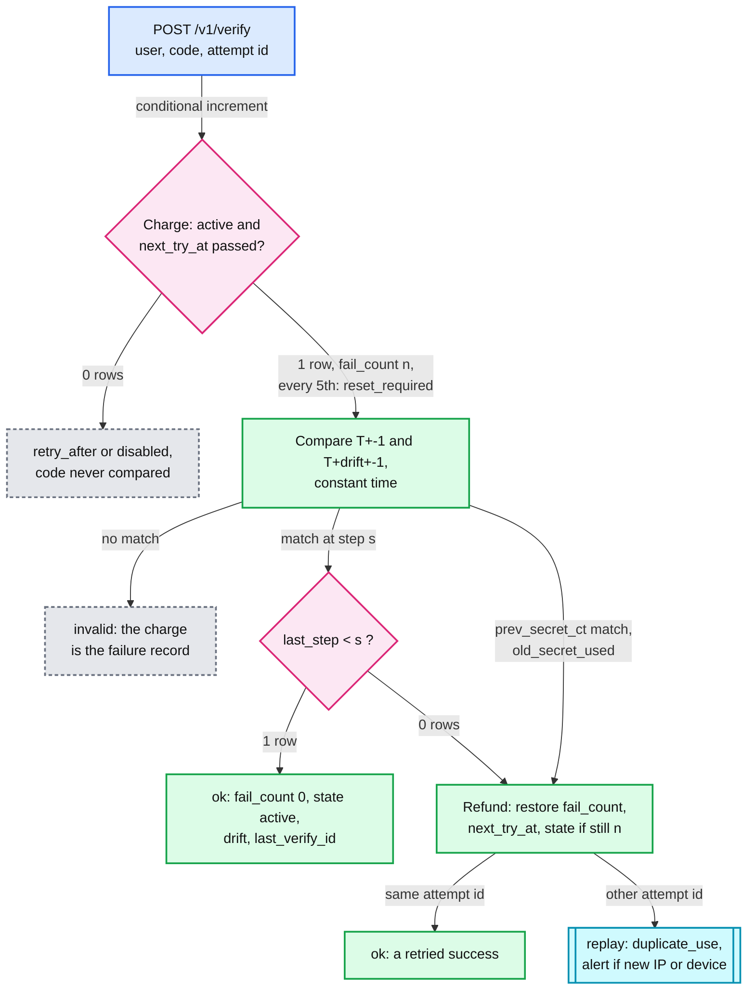
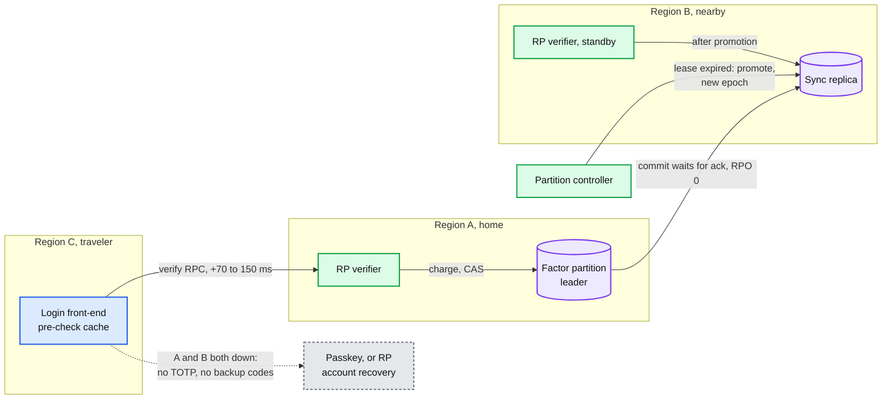

# Deep dive: server-side verification (the RP verifier)

> One-line answer: at the relying party (RP), one `FACTOR` row per user decides everything: each attempt is **charged first** with one conditional increment (so 5,000 parallel guesses evaluate 5, not 5,000), a match is accepted only by `UPDATE ... WHERE last_step < s` (so a code works once, even across racing tabs and a region failover), replays and stale codes are refunded, and the 5th consecutive failure stops code checks until the password is reset: 1.5 x 10^-5 per leaked password, ~15 takeovers per million stuffed passwords. The row lives in one home region with a synchronous replica; the secret is envelope-encrypted under one data key per shard, wrapped by the key management service (KMS). A patient attacker who stays at 4 guesses a day between the real user's sign-ins never makes 5 in a row (simulated: 1,461 guesses a year, 0.44%), so failures from never-2FA browsers also count in `unknown_fail_30d`, which a success does not clear: 5 guesses, then a reset.

Related: [`../solution.md` §4.1](../solution.md#41-enroll-scan-a-qr-code-confirm-with-the-first-code), [§4.3](../solution.md#43-verify-the-website-accepts-a-code-once-and-stops-guessing), [§5.4](../solution.md#54-how-does-the-website-stop-replay-and-guessing-and-stay-correct-when-sign-ins-land-in-two-regions), [§10.4](../solution.md#104-failure-timeline), [§10.5](../solution.md#105-exactly-once--idempotency-end-to-end), [`totp-algorithm-and-clock-drift.md`](totp-algorithm-and-clock-drift.md) (the window and drift rules this path runs), [`../../../concepts/exactly-once.md`](../../../concepts/exactly-once.md) (a one-time code as a conditional write), [`../../../concepts/mvcc-and-isolation.md`](../../../concepts/mvcc-and-isolation.md) (why read-then-write loses), [`../../../concepts/rate-limiting-and-load-shedding.md`](../../../concepts/rate-limiting-and-load-shedding.md), [`../../../concepts/replication-and-quorums.md`](../../../concepts/replication-and-quorums.md), [`../../../concepts/leases-fencing-clocks.md`](../../../concepts/leases-fencing-clocks.md).

---

## 1. The verify path: charge, compare, then one more conditional write



```sql
UPDATE factor SET fail_count = fail_count + 1, next_try_at = :now + backoff(fail_count + 1),  -- 1. charge first
       unknown_fail_30d = unknown_fail_30d + :unknown,          -- :unknown = 1 if this browser never passed 2FA
       state = CASE WHEN fail_count + 1 >= 100 THEN 'disabled' WHEN (fail_count + 1) % 5 = 0
                      OR unknown_fail_30d + :unknown >= 5 THEN 'reset_required' ELSE state END
 WHERE user_id = :u AND factor_id = :f AND state = 'active' AND (next_try_at IS NULL OR next_try_at <= :now)
RETURNING secret_ct, prev_secret_ct, last_step, drift_steps, fail_count;           -- n; row lock serializes
UPDATE factor SET last_step = :s, drift_steps = :d, last_verify_id = :attempt, fail_count = 0,  -- 2. match at s
       next_try_at = NULL, state = 'active', unknown_fail_30d = unknown_fail_30d - :unknown
 WHERE user_id = :u AND factor_id = :f AND last_step < :s AND :s <= :t_db + 4;      -- t_db: the DB's own step
UPDATE factor SET fail_count = :n - 1, next_try_at = NULL, state = 'active',  -- 3. replay, own retry, old secret
       unknown_fail_30d = unknown_fail_30d - :unknown   -- the charge needed state active and next_try_at <= now
 WHERE user_id = :u AND factor_id = :f AND fail_count = :n;                       -- only if nobody wrote since
```

- **Why charge first.** Reading `next_try_at` and writing the failure later lets every request in flight through. RFC 4226 §7.3: "The delay or lockout schemes MUST be across login sessions to prevent attacks based on multiple parallel guessing techniques." Simulated below: 5,000 guesses at once evaluate **5** charged first, **5,000** read-then-write. Same rule as the escrow hardware security modules (HSMs): decrement, then check.
- **Why `< s`, not `!= s`.** With `!=`, once `T+1` is used the code for `T` is accepted again, then `T+1` again: alternating replay. `<` makes the guard one monotonic integer per factor. Its cost: for up to 2 min after a fast-clock sign-in, the corrected clock's codes are "replays". **Replay is not a guess:** a replay is a correct code for a spent step: no new information, so the refund restores exactly what the charge replaced, even a `disabled` set by a 100th charge (test 2 below). `duplicate_use` alerts only from a different IP, network or device. NIST (the US National Institute of Standards and Technology) SP 800-63B-4 §3.1.4 allows it: verifiers "MAY warn the claimant if an attacker has been able to authenticate in advance".
- **Lost response.** Region A commits, dies before replying, the front-end retries in B. Without `last_verify_id` the retry is a "replay" of the user's own success. With it, `ok`. **A stale app entry:** after re-enrollment the old secret sits in `prev_secret_ct` for 30 days. A match is refunded, answered "this code is from your old authenticator entry", never accepted, and emits `old_secret_used`, which alerts if the device or IP never passed 2FA (after a theft, it is the thief).

## 2. Enrollment: a 15-minute pending row, then confirm

- `POST /v1/factors/totp` needs a fresh sign-in at the highest authenticator assurance level (AAL) the account has, plus a notification (NIST SP 800-63B-4 §4.1.2.1); otherwise a stolen session cookie adds the attacker's own authenticator, which outlives a password change. It draws 160 bits, encrypts, inserts `state = pending, expires_at = now + 15 min`. One pending row per user; a new one replaces it. The secret is on screen while the page is open, so the row dies with it. `confirm` runs the verify path above, and its success write also requires `state = 'pending' AND expires_at > now`. It sets `last_step`, so the confirm code cannot be replayed at the next sign-in, and issues 10 backup codes. On a re-enrollment the old secret moves to `prev_secret_ct`. Without this step a mis-scan or a phone 5 minutes off would lock the user out at the next sign-in.

## 3. Guessing: 5 tries, then a password reset, with backoff as the backstop

| Policy | What happens | Odds per leaked password | Simulated |
|---|---|---|---|
| **Reset at 5 (chosen)** | 5th consecutive failure, or 5th in `unknown_fail_30d`, sets `reset_required`, alert, no code checked until the password is reset | 5 x 3 / 10^6 = 1.5 x 10^-5 (3 x 10^-5 with drift) | 10 M attackers below |
| Attacker also owns the email | A reset keeps `fail_count` and `next_try_at`, so each loop runs on the backoff | ≤ 3 x 10^-4 | 34, 24, 24, 18 a day, 95 resets, disabled at hour 89 |
| Backstop RP (cannot force a reset) | 5 free, then 30 s doubling to 1 h, disable at 100 (NIST §3.2.2: "no more than 100", example "30 seconds up to an hour") | 100 x 3 / 10^6 = 3 x 10^-4 | 1 M attackers below |

- **Backstop arithmetic.** Waits after failures 5 to 11: 30 + 60 + ... + 1,920 = 3,810 s, then 3,600 s: try 13 lands at 7,410 s (2.06 h). Then 1 an hour: 13 + 21 = **34 in the first 24 h, 24 a day after**, the 100th at 7,410 + 87 x 3,600 = 320,610 s = **~89 h, day 4**. **Stuffing.** 1 M valid passwords x 5 tries = ~15 takeovers, against ~300 with 100 tries; ~1,400 guesses/s for an hour, then nothing. Count per factor, never per IP: 1,000 IPs x 5 tries = 5,000 guesses = 1.5%.
- **The patient attacker.** NIST §3.2.2: "When the subscriber successfully authenticates, the verifier SHOULD disregard any previous failed attempts". The real user's daily sign-in resets `fail_count`, so 4 guesses a day never reach 5: **1,461 guesses a year, 0 alerts, 0.44%** (test 7). `unknown_fail_30d` counts failures from browsers that never passed 2FA in 30 days and a success does not clear it: **5 guesses, then `reset_required`**. A user's own typos come from a remembered browser and do not count.

## 4. Lockout as denial of service, and the honest user

- Anyone holding the password can force a password reset with 5 wrong codes. We accept it: the password is what leaked, and the user fixes it self-service, unlike a locked factor. On a backstop RP a scripted attacker takes every backoff slot the moment it opens, so from ~2 h in the real user waits up to an hour per sign-in. A browser that already passed 2FA (remembered-device cookie) gets its own small budget. A targeted row: thousands of requests a second queue on one row lock. The front-end keeps a short-lived, non-authoritative cache of `state` and `next_try_at` and sheds what it knows will be refused. The gate stays in the write. Blast radius: one user. **Our own clock rules could trigger the reset.** The rejected rule "a base-window match resets drift to 0" (an earlier solution §5.3 draft) passes a phone gaining 3 s a day on 14 of 40 days, then pushes its owner into `reset_required`. `drift = s - T` on every match: 40 of 40 (test 4).

## 5. Two regions: one home row, a synchronous replica, fail closed



- **Why one home.** Async copies checked per region accept a code once per region and multiply the guess budget by the region count. Rejected: a global quorum write per verify, where every user pays the cross-region trip, not just travelers. **Failover.** The leader stops writing if it loses its replica, so a recovery point objective (RPO) of 0 stays true. After promotion the replica refuses the old leader's epoch, so a partitioned old leader cannot commit a second acceptance [our addition: the sync ack is the fence]. A retry that lands in B is answered by `last_verify_id`. **Clock:** a node with offset > 1 s takes itself out of service; verifiers use 3 or more independent time sources, and the success write refuses `s > T_db + 4` (the database's clock), so a fleet-wide bad source cannot push `last_step` ahead.
- **Both down: fail closed.** Backup codes share the `user_id` partition and the same single-use write, so they are down too, and push likely shares a request store. A passkey clearly keeps working: its public key can be in every region and the challenge comes from the serving region, so no shared replay row is needed [reasoning].
- **No red node.** Load is ~800/s peak plus ~1,400/s for an hour of stuffing on a ~10 GB table. The targeted row is bounded by the charge (5 evaluations, then nothing) and shed at the front-end. Region loss is a failover, not a bottleneck. Nothing here breaks first; the red node of this problem is the escrow path.

## 6. Secrets at rest and backup codes

- **Cannot hash: HMAC needs the key.** NIST §3.1.4: the keys "SHALL be strongly protected against unauthorized disclosure by access controls that limit access to the keys to only those software components that require access". **Envelope:** one data key per shard of ~1 M factors, unwrapped by KMS once and cached for hours. A per-row key would almost never be cached: users sign in about weekly. During a KMS outage, freeze deploys and scale-in so warm pods keep their keys. **HSM-computed HMAC** for high-value RPs: the verifier sends the wrapped secret, the candidate steps and the code, and gets back a step or nothing. ~800/s x 6 HMACs = ~5k HMACs/s [estimate]. **A leaked table** (plaintext) is every user's second factor until they re-enroll. Force re-enrollment at next sign-in with another factor. RSA offered to replace SecurID tokens after its 2011 seed theft ([Wikipedia](https://en.wikipedia.org/wiki/RSA_SecurID), secondary). **Bind the ciphertext to its row.** `secret_ct` and `prev_secret_ct` are AEAD (authenticated encryption) with associated data `user_id ‖ factor_id`. Otherwise anyone who can write the table (SQL injection, a database admin) copies their own `secret_ct` into a victim's row, and their codes now open the victim's account.
- **Backup codes.** 10 codes of ~40 bits (8 base32 characters) from a cryptographically secure random generator, shown once. NIST §3.1.2: below 112 bits they "SHALL be stored in a salted and hashed form using a suitable password hashing scheme". One salt per user (`RP_USER.backup_salt`), so a guess costs one slow hash compared against ≤ 10 stored values. Single use: `UPDATE backup_code SET used_at = now WHERE user_id = ? AND code_hash = ? AND used_at IS NULL`. Their own budget, backoff after 10 failures, not the TOTP's: typos while reading paper must not force a reset, and 10 x 5 / 2^40 is ~5 x 10^-11.

## 7. Runnable verifier with a fake clock

Implements solution §4.3 and §5.4 as written: charge first with the `CASE`, `unknown_fail_30d`, the union window, the `last_step < s` compare-and-set (CAS), the exact refund, `last_verify_id`, `prev_secret_ct` and `old_secret_used`, a password reset that keeps `fail_count`. A lock stands in for the row lock. ~2 min on 14 cores (11 M attacker trials).

```python
"""In-memory RP verifier with a fake clock, following solution.md 4.3, 5.3 and 5.4. Stdlib only."""
import hashlib, hmac, os, random, struct, threading, time
from collections import Counter; from concurrent.futures import ProcessPoolExecutor
STEP, FREE, CAP, DRIFT_CAP, DAY = 30, 5, 100, 4, 86_400; threading.stack_size(256 * 1024)
def hotp(key, counter):
    mac = hmac.new(key, struct.pack(">Q", counter), hashlib.sha1).digest(); o = mac[-1] & 0x0F
    return str((struct.unpack(">I", mac[o:o + 4])[0] & 0x7FFFFFFF) % 10 ** 6).zfill(6)
def backoff(n): return 0 if n < FREE else min(30 * 2 ** (n - FREE), 3600)   # n = consecutive failures
class Verifier:                                   # one FACTOR row, guarded by a lock like a row lock
    def __init__(self, can_reset=True, base_resets_drift=False, unknown_cap=FREE):
        self.t, self.key, self.prev_key, self.lock, self.events = 1.7e9, os.urandom(20), None, threading.Lock(), Counter()
        self.last_step, self.drift, self.fails, self.next_try, self.state, self.last_id = -1, 0, 0, 0.0, "active", None
        self.unknown, self.can_reset, self.base_resets_drift, self.unknown_cap = [], can_reset, base_resets_drift, unknown_cap
        # unknown: unknown_fail_30d entries; can_reset False = backstop RP; base_resets_drift True = the rejected rule
    def code(self, skew=0, key=None): return hotp(key or self.key, int((self.t + skew) // STEP))
    def verify(self, code, attempt=None, gate=None, charge_first=True, known=False):   # known: browser passed 2FA
        now, attempt, mine = self.t, attempt or os.urandom(8), None
        with self.lock:                           # 1. charge: UPDATE ... WHERE state = 'active' AND next_try_at <= now
            if self.state != "active": return self.state
            if now < self.next_try: return f"retry_after {self.next_try - now:.0f}"
            if charge_first:
                before = (self.fails, self.next_try, self.state); mine = None if known else (now, attempt)
                self.fails += 1; self.next_try = now + backoff(self.fails); charged = self.fails
                if mine: self.unknown = [x for x in self.unknown if x[0] > now - 30 * DAY] + [mine]
                set_reset = self.can_reset and (self.fails % FREE == 0 or
                                                (self.unknown_cap and len(self.unknown) >= self.unknown_cap))
                self.state = "disabled" if self.fails >= CAP else "reset_required" if set_reset else self.state  # CASE
            drift = self.drift; self.events["evaluated"] += 1
        if gate: gate()                           # test hook: time between the charge (or read) and the compare
        T = int(now // STEP)
        window = sorted({T + d + k for d in (0, drift) for k in (-1, 0, 1)})  # T+-1 union T+drift+-1
        match = lambda key: next((s for s in window if hmac.compare_digest(hotp(key, s), code)), None)
        s, old = match(self.key), self.prev_key and match(self.prev_key) is not None
        with self.lock:
            if s is not None and self.last_step < s:          # 2. UPDATE ... SET last_step = s WHERE last_step < s
                d = 0 if self.base_resets_drift and abs(s - T) <= 1 else max(-DRIFT_CAP, min(DRIFT_CAP, s - T))
                self.last_step, self.drift, self.last_id = s, d, attempt
                self.fails, self.next_try, self.state = 0, 0.0, "active"
                if mine in self.unknown: self.unknown.remove(mine)          # a success is not a failure
                return "ok"
            if s is not None or old:                          # 3. replay, own retry, or old secret: refund
                if charge_first and self.fails == charged:   # restore exactly what the charge replaced
                    self.fails, self.next_try, self.state = before
                    if mine in self.unknown: self.unknown.remove(mine)
                if s is None: self.events["old_secret_used"] += 1; return "old authenticator entry"
                if self.last_id == attempt: return "ok"       # retry after a lost response
                self.events["duplicate_use"] += 1; return "replay"
            if not charge_first: self.fails += 1; self.next_try = now + backoff(self.fails)
            self.events["alert_user"] += self.state == "reset_required" or self.fails % FREE == 0
            return "invalid"
def burst(n, charge_first):                       # n guesses at once, 2 s between the charge (or read) and the write
    v, start = Verifier(), threading.Barrier(n)
    go = lambda i: (start.wait(), v.verify(f"{i:06d}", gate=lambda: time.sleep(2), charge_first=charge_first))
    ts = [threading.Thread(target=go, args=(i,)) for i in range(n)]; [t.start() for t in ts]; [t.join() for t in ts]
    return v.events["evaluated"]
def attack(v, rng, days=365, user_daily=False, per_day=10 ** 9, owns_email=False):
    """Password holder guesses when allowed (owns_email: resets the password when asked); user signs in at 09:00."""
    t0, times, today, user_at = v.t, [], Counter(), v.t + 9 * 3600 if user_daily else float("inf")
    while v.t < t0 + days * DAY:
        if v.state == "reset_required" and owns_email: v.state = "active"; v.events["resets"] += 1  # keeps fail_count
        if v.state != "active": break
        nxt, day = max(v.t, v.next_try), int((v.t - t0) // DAY)
        if today[day] >= per_day: nxt = max(nxt, t0 + (day + 1) * DAY)
        if nxt >= user_at:
            v.t, user_at = max(user_at, v.next_try), user_at + DAY; v.verify(v.code(), known=True); v.t += 1; continue
        v.t = nxt; times.append(v.t - t0); today[int(times[-1] // DAY)] += 1
        if v.verify(f"{rng.randrange(10 ** 6):06d}") == "ok": return times, 1
        v.t += 1
    return times, 0
def trial(args):                                  # one attacker, one fresh factor, both seeded
    v = Verifier(args[1]); v.key = random.Random(-1 - args[0]).randbytes(20)
    return attack(v, random.Random(args[0]))[1]
if __name__ == "__main__":
    v = Verifier(); T = int(v.t // STEP)
    print("1 sign-in:", v.verify(v.code(), attempt="a1"), "| lost response, retry a1:", v.verify(v.code(), attempt="a1"),
          "| same code, new attempt:", v.verify(v.code()), "| fail_count", v.fails, dict(v.events)); v.t += 5
    print("2 code T+1:", v.verify(hotp(v.key, T + 1)), "| code T:", v.verify(hotp(v.key, T)), "(!= would accept)",
          "| 6 more replays:", {v.verify(hotp(v.key, T + 1)) for _ in range(6)}, "| fail_count", v.fails, v.state)
    v.prev_key, v.key = v.key, os.urandom(20)     # user re-enrolls; the app still has the old entry too
    print("  after re-enroll, old entry x 6:", {v.verify(v.code(key=v.prev_key)) for _ in range(6)}, "| fail_count", v.fails,
          "| old_secret_used", v.events["old_secret_used"])
    w = Verifier(can_reset=False); spent = w.code(); w.verify(spent, known=True); w.fails = 99   # backstop RP at 99
    print("  replay as the 100th charge:", w.verify(spent), "| fail_count", w.fails, w.state)
    outcomes = Counter(); v.t += 2 * STEP
    for i in range(1000):                         # two tabs submit the same fresh code at once
        v.t += STEP; c, gate, res = v.code(), threading.Barrier(2), []
        ts = [threading.Thread(target=lambda: res.append(v.verify(c, gate=gate.wait, known=True))) for _ in range(2)]
        [t.start() for t in ts]; [t.join() for t in ts]; outcomes[tuple(sorted(res))] += 1
    print("3 1,000 races:", dict(outcomes), "| fail_count", v.fails)
    for rule in (False, True):                    # phone gains 3 s a day; automatic time turned on after day 40
        v, ok = Verifier(base_resets_drift=rule), Counter()
        for day in range(45):
            v.t += DAY; ok[day >= 40] += v.verify(v.code(3 * day if day < 40 else 0), known=True) == "ok"
            if day == 39:
                drift = v.drift; v.t += 60; r60 = v.verify(v.code(), known=True)
                v.t += 90; r150 = v.verify(v.code(), known=True)
        print(f"4 {'base match -> 0 (bug)' if rule else 'drift = s - T        '}: days 1-40 ok {ok[False]}/40, drift {drift}, "
              f"clock fixed +60 s {r60}, +150 s {r150}, days 41-45 ok {ok[True]}/5, {v.state}")
    for can_reset, email, label in ((True, False, "reset at 5 "), (True, True, "owns email "), (False, False, "backstop RP")):
        v = Verifier(can_reset); times, _ = attack(v, random.Random(1), owns_email=email)
        per_day = Counter(int(t // DAY) for t in times)
        print(f"5 {label}: {[per_day[d] for d in sorted(per_day)]} guesses/day, last at hour {times[-1] / 3600:.0f}, "
              f"{v.events['resets']} password resets, then {v.state}")
    print(f"6 5,000 guesses at once: charge first -> {burst(5000, True)} evaluated, read then write -> {burst(5000, False)}")
    for cap in (None, FREE):                      # patient attacker between the real user's daily sign-ins
        v = Verifier(unknown_cap=cap); times, _ = attack(v, random.Random(2), user_daily=True, per_day=4)
        print(f"7 {'no 30-day counter  ' if cap is None else 'unknown_fail_30d = 5'}: {len(times)} guesses/yr, "
              f"{v.events['alert_user']} alerts, {v.state}, odds {1 - (1 - 3e-6) ** len(times):.2%}")
    with ProcessPoolExecutor() as ex:
        for can_reset, n, tries in ((True, 10_000_000, 5), (False, 1_000_000, 100)):
            wins = sum(ex.map(trial, ((s, can_reset) for s in range(n)), chunksize=5000))
            print(f"8 {'reset at 5' if can_reset else 'backstop  '}: {n:,} attackers, {wins} wins = {wins / n:.2e}, "
                  f"bound 1-(1-3e-6)^{tries} = {1 - (1 - 3e-6) ** tries:.2e}")
```

```
1 sign-in: ok | lost response, retry a1: ok | same code, new attempt: replay | fail_count 0 {'evaluated': 3, 'duplicate_use': 1}
2 code T+1: ok | code T: replay (!= would accept) | 6 more replays: {'replay'} | fail_count 0 active
  after re-enroll, old entry x 6: {'old authenticator entry'} | fail_count 0 | old_secret_used 6
  replay as the 100th charge: replay | fail_count 99 active
3 1,000 races: {('ok', 'replay'): 1000} | fail_count 0
4 drift = s - T        : days 1-40 ok 40/40, drift 4, clock fixed +60 s replay, +150 s ok, days 41-45 ok 5/5, active
4 base match -> 0 (bug): days 1-40 ok 14/40, drift 0, clock fixed +60 s reset_required, +150 s reset_required, days 41-45 ok 0/5, reset_required
5 reset at 5 : [5] guesses/day, last at hour 0, 0 password resets, then reset_required
5 owns email : [34, 24, 24, 18] guesses/day, last at hour 89, 95 password resets, then disabled
5 backstop RP: [34, 24, 24, 18] guesses/day, last at hour 89, 0 password resets, then disabled
6 5,000 guesses at once: charge first -> 5 evaluated, read then write -> 5000
7 no 30-day counter  : 1461 guesses/yr, 0 alerts, active, odds 0.44%
7 unknown_fail_30d = 5: 5 guesses/yr, 1 alerts, reset_required, odds 0.00%
8 reset at 5: 10,000,000 attackers, 136 wins = 1.36e-05, bound 1-(1-3e-6)^5 = 1.50e-05
8 backstop  : 1,000,000 attackers, 319 wins = 3.19e-04, bound 1-(1-3e-6)^100 = 3.00e-04
```

- **1 to 3.** A retried success is `ok`, a replay is refunded (`fail_count` stays 0 after 8 replays and 6 stale-entry codes; a replay that was the 100th charge leaves the factor active at 99), and 1,000 two-tab races give exactly one `ok` each. **4:** `drift = s - T` learns a phone to +4 steps and survives the clock fix (the +60 s attempt is a refunded replay). The rejected rule never learns and ends in `reset_required`.
- **5 to 7.** The chosen policy stops at 5 guesses. An attacker who controls email, or a backstop RP, gets 34 / 24 / 24 / 18 a day and is disabled at hour 89. Charge-first holds 5,000 parallel guesses to 5. `unknown_fail_30d` stops the patient attacker at 5. **8.** Empirical odds match `1 - (1 - 3/10^6)^k` for k = 5 and 100 (each trial's secret and guesses are seeded, so the output is reproducible; 136 and 319 against an expected 150 and 300 are each within about one standard deviation, ~12 and ~17, so the gap is sampling noise).

## 8. Trade-offs

| Decision | Chose | Gave up |
|---|---|---|
| Guess control | Reset at 5, backoff and 100 as backstop | Anyone with the password forces a reset; 5 typos do too |
| Order of work | Charge, then compare, then refund | One more write on a replay; a crash between charge and refund costs one try |
| Multi-region | Home row, sync replica | +70 to 150 ms for travelers; TOTP down if both regions are |

## 9. What the interviewer probes next

- **"Two tabs submit the same code in the same millisecond."** Both are charged, both match, the CAS lets one through, the other is a replay and `fail_count` ends at 0. Section 7, test 3. **"Region A committed and died before replying."** The retry in B finds `last_verify_id` and returns `ok`.
