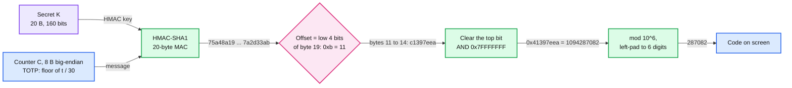
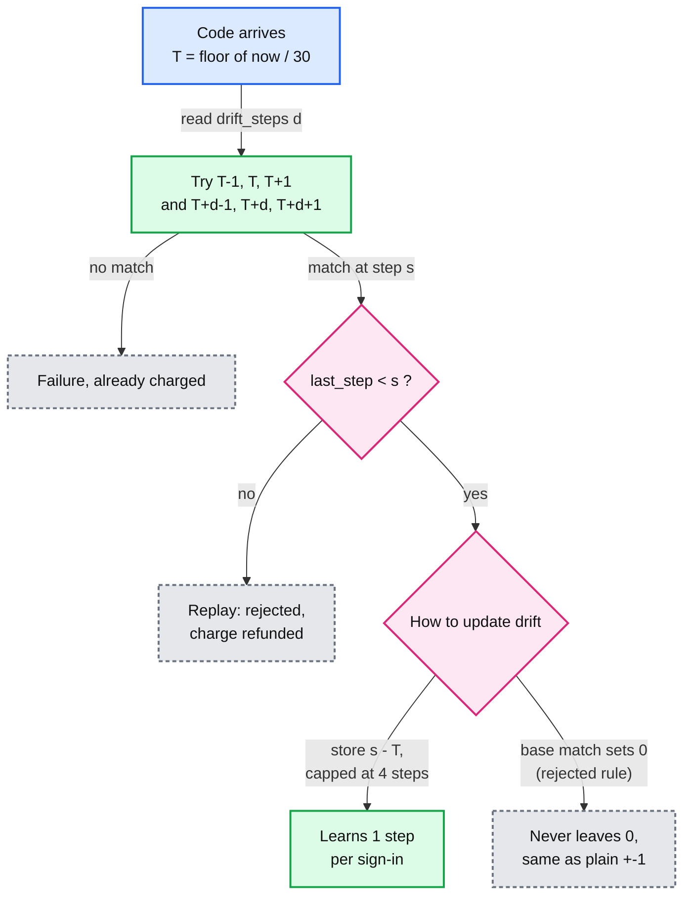

# Deep dive: TOTP algorithm and clock drift

> One-line answer: a TOTP (time-based one-time password) code is `HMAC-SHA1(secret, floor(unix_time / 30))` (HMAC: hash-based message authentication code), cut to 31 bits at an offset the MAC itself picks, then `mod 10^6` (RFC 4226 §5.3, RFC 6238 §4), so the only input that can be wrong is the clock; the verifier checks `T ± 1` plus `T + drift ± 1` with a drift learned per factor, and the app warns about skew instead of correcting it. Simulated: 8 s of typing fails 26.7% of correct codes with `T` only and 0% with ±1; learned drift cuts rejects for skewed phones from 16% to 9% (σ = 30 s) and keeps a phone that gains 3 s a day working for 40 days, but only if every match stores `drift = s - T`. The tempting variant, resetting drift to 0 on a base-window match, never learns past ±1: this simulation caught it in an earlier draft of solution §5.3.

Related: [`../solution.md` §4.2](../solution.md#42-show-codes-offline), [§5.3](../solution.md#53-the-phones-clock-is-wrong-or-the-code-arrives-late-why-does-it-fail-and-what-do-we-fix), [§10.1](../solution.md#101-internals-of-each-chosen-technology), [§10.2](../solution.md#102-configuration-knobs-that-matter), [`server-side-verification.md`](server-side-verification.md) (the verifier that runs this window, charges attempts and guards replay), [`vault-encryption-and-key-hierarchy.md`](vault-encryption-and-key-hierarchy.md) (where a parsed item is stored), [`../../../concepts/leases-fencing-clocks.md`](../../../concepts/leases-fencing-clocks.md) (why clocks disagree), [`../../../concepts/signed-url.md`](../../../concepts/signed-url.md) (HMAC as a capability).

---

## 1. HOTP in five steps (RFC 4226)



- **Counter.** HOTP (HMAC-based one-time password): a counter both sides increment. TOTP (RFC 6238 §4): `T = floor((unix_time - T0) / X)`, `T0 = 0`, `X = 30 s`. Packed as 8 bytes, so the RFC's last test time, t = 20,000,000,000 (year 2603), still works if the code reads time as 64-bit.
- **Why the 31-bit mask.** RFC 4226 §5.3: "The reason for masking the most significant bit of P is to avoid confusion about signed vs. unsigned modulo computations." The example above needs it: byte `0xc1` has the top bit set.
- **Bias.** 2^31 = 2,147 x 10^6 + 483,648, so codes below 483648 are 1/2,147 (0.05%) more likely. At 8 digits, codes below 47,483,648 come up 22 times in 2^31 against 21 for the rest, ~5% more likely (Appendix A.4.1 bounds it). Digits: "a 6-digit code at a minimum and possibly 7 and 8-digit code" (§5.3).

## 2. SHA-1, SHA-256, SHA-512, and the test-vector trap

- **The trap.** RFC 6238 §1.2: "TOTP implementations MAY use HMAC-SHA-256 or HMAC-SHA-512", with seeds of 20, 32 and 64 bytes. Appendix B says "The test token shared secret uses the ASCII string value "12345678901234567890"" for every mode. The SHA-256 and SHA-512 vectors were actually computed with 32- and 64-byte seeds (`seed32`, `seed64` in the Appendix A code). [Errata 2866](https://www.rfc-editor.org/errata/rfc6238) (verified) records it. If your SHA-256 test fails with the 20-byte seed, your code is right. solution §10.1 uses the correct seeds.
- **Why HMAC-SHA1 is still fine.** RFC 4226 Appendix B.2: "The new attacks on SHA-1 have no impact on the security of HMAC-SHA-1", because "HMAC was designed so that collisions in the hash function (here SHA-1) do not yield forgeries for HMAC". B.3: "The security proof of HOTP requires that HMAC-SHA-1 behave like a pseudorandom function" (PRF). That was written in 2005. The 2017 practical SHA-1 collision is still a collision on an unkeyed hash; the attacker here does not know K [reasoning].
- **So the strength is the output, not the hash.** Appendix A.4.3: "Brute force attacks are the best possible attacks." A guess wins with 1 / 10^6 per accepted step. We issue SHA1 / 6 / 30 for compatibility (solution §10.2) and spend the effort on throttling ([`server-side-verification.md`](server-side-verification.md)).

## 3. Parsing `otpauth://` (the QR from solution §4.1)

Format `otpauth://TYPE/LABEL?PARAMETERS`, per the [Key URI format](https://github.com/google/google-authenticator/wiki/Key-Uri-Format) wiki:

| Part | Wiki rule | Our parser |
|---|---|---|
| Type | `totp` or `hotp` (`hotp` needs `counter`) | Anything else, including `https://`, refused |
| Label | `issuer:account`, URL-encoded, colon may be `%3A`, optional spaces before the account | Split on the first colon, strip spaces |
| `secret` | Base32, "The padding specified in RFC 3548 section 2.2 is not required and should be omitted" | Uppercase, drop spaces, re-pad, decode. Refuse below 80 bits |
| `issuer` | "If both issuer parameter and issuer label prefix are present, they should be equal" | Refuse a mismatch. A QR that says "Bank" in the label and "Evil" in the parameter is not shown to the user as either |
| `algorithm`, `digits`, `period` | Defaults SHA1, 6, 30. "Currently, the algorithm parameter is ignored by the Google Authenticator implementations", digits ignored "on Android and Blackberry", period ignored too | **Honour them.** SHA1/256/512, 6 to 8 digits, period 1 to 120 s |

- **Why honour.** An app that ignores `digits=8` shows 6 digits the site never accepts. The confirm step (solution §4.1) catches it, but the user cannot fix it. As a relying party (RP) we issue only the defaults for the same reason. Period ≤ 120 s because NIST SP 800-63B-4 §3.1.4 says a clock-based nonce "SHALL be changed at least once every two minutes".
- **Why 80 bits.** Many sites issue 16 base32 characters, 80 bits. Each observed code is a ~20-bit check, so two codes pin down a 40-bit secret after 2^40 ≈ 10^12 HMACs, minutes on one GPU [estimate]. 2^80 is out of reach. NIST (the US National Institute of Standards and Technology) wants ≥ 112 bits (SP 800-63B-4 §3.1.4), but that binds the verifier, and refusing 80-bit sites breaks them. Our own RP issues 160.
- **`otpauth-migration://offline?data=...`** is Google's "Transfer accounts" QR: base64 of a protobuf `MigrationPayload` (`otp_parameters[]`, `version`, `batch_size`, `batch_index`, `batch_id`), each `OtpParameters` holding the raw `secret`, `name`, `issuer`, `algorithm`, `digits`, `type`, `counter` ([format](https://alexbakker.me/post/parsing-google-auth-export-qr-code.html)). No key, no password: a photo of that QR is every secret in it. We import it (that is how users leave Google) through the same checks, and never export it (solution §7).

Runnable, stdlib only. `hotp` and `totp` are solution §10.1 unchanged.

```python
import base64, hashlib, hmac, struct
from urllib.parse import urlsplit, parse_qsl, quote, unquote, urlencode

def hotp(key: bytes, counter: int, digits: int = 6, algo=hashlib.sha1) -> str:   # solution.md 10.1, unchanged
    mac = hmac.new(key, struct.pack(">Q", counter), algo).digest()
    offset = mac[-1] & 0x0F
    code = struct.unpack(">I", mac[offset:offset + 4])[0] & 0x7FFFFFFF
    return str(code % 10 ** digits).zfill(digits)
def totp(key: bytes, unix_time: float, period: int = 30, digits: int = 6, algo=hashlib.sha1) -> str:
    return hotp(key, int(unix_time // period), digits, algo)
ALGOS = {"SHA1": hashlib.sha1, "SHA256": hashlib.sha256, "SHA512": hashlib.sha512}
def parse_otpauth(uri: str) -> dict:
    u = urlsplit(uri)
    if u.scheme != "otpauth" or u.netloc not in ("totp", "hotp"): raise ValueError("not otpauth://totp or otpauth://hotp")
    prefix, sep, account = unquote(u.path[1:]).partition(":")    # label "Issuer:account", %3A allowed
    prefix, account = (prefix, account.lstrip()) if sep else ("", prefix)
    q = dict(parse_qsl(u.query, strict_parsing=True))
    issuer = q.get("issuer", prefix)
    if prefix and issuer != prefix: raise ValueError(f"issuer mismatch: label {prefix!r} vs parameter {issuer!r}")
    s = q["secret"].upper().replace(" ", "").rstrip("=")
    key = base64.b32decode(s + "=" * (-len(s) % 8))              # URIs drop the padding
    if len(key) * 8 < 80: raise ValueError(f"secret is {len(key) * 8} bits, need >= 80")
    algo, digits, period = q.get("algorithm", "SHA1").upper(), int(q.get("digits", 6)), int(q.get("period", 30))
    if algo not in ALGOS or digits not in (6, 7, 8) or not 1 <= period <= 120:     # NIST: changes at least every 2 min
        raise ValueError(f"unsupported algorithm/digits/period {algo}/{digits}/{period}")
    item = dict(type=u.netloc, issuer=issuer, account=account, key=key, algorithm=algo, digits=digits, period=period)
    if u.netloc == "hotp": item["counter"] = int(q["counter"])     # required for hotp
    return item
def build_otpauth(it: dict) -> str:
    label = quote(f"{it['issuer']}:{it['account']}" if it["issuer"] else it["account"], safe="@")
    q = dict(secret=base64.b32encode(it["key"]).decode().rstrip("="), issuer=it["issuer"],
             algorithm=it["algorithm"], digits=it["digits"], period=it["period"], **{
             k: it[k] for k in ("counter",) if k in it})
    return f"otpauth://{it['type']}/{label}?{urlencode(q, quote_via=quote)}"

if __name__ == "__main__":
    k32 = base64.b32encode(b"12345678901234567890123456789012").decode().rstrip("=").lower()
    it = parse_otpauth(f"otpauth://totp/ACME%20Co:%20john.doe@email.com?secret={k32}"
                       "&issuer=ACME%20Co&algorithm=SHA256&digits=8")
    print("parsed ", {k: v for k, v in it.items() if k != "key"}, len(it["key"]) * 8, "bits")
    print("t = 59 ", totp(it["key"], 59, it["period"], it["digits"], ALGOS[it["algorithm"]]), "(RFC 6238 SHA256 vector: 46119246)")
    print("rebuilt", build_otpauth(it))
    print("round trip equal:", parse_otpauth(build_otpauth(it)) == it)
    for bad in ("otpauth://totp/Bank:bob?secret=JBSWY3DPEHPK3PXP&issuer=Evil",   # 80 bits, two issuers
                "otpauth://totp/x?secret=JBSWY3DP",                               # 40 bits
                "otpauth://totp/x?secret=JBSWY3DPEHPK3PXP&period=300",
                "https://totp/x?secret=JBSWY3DPEHPK3PXP"):
        try:
            parse_otpauth(bad); print("ACCEPTED", bad)
        except (ValueError, KeyError) as e:
            print("rejected", bad.split("?")[0], "->", e)
```

```
parsed  {'type': 'totp', 'issuer': 'ACME Co', 'account': 'john.doe@email.com', 'algorithm': 'SHA256', 'digits': 8, 'period': 30} 256 bits
t = 59  46119246 (RFC 6238 SHA256 vector: 46119246)
rebuilt otpauth://totp/ACME%20Co%3Ajohn.doe@email.com?secret=GEZDGNBVGY3TQOJQGEZDGNBVGY3TQOJQGEZDGNBVGY3TQOJQGEZA&issuer=ACME%20Co&algorithm=SHA256&digits=8&period=30
round trip equal: True
rejected otpauth://totp/Bank:bob -> issuer mismatch: label 'Bank' vs parameter 'Evil'
rejected otpauth://totp/x -> secret is 40 bits, need >= 80
rejected otpauth://totp/x -> unsupported algorithm/digits/period SHA1/6/300
rejected https://totp/x -> not otpauth://totp or otpauth://hotp
```

## 4. The window math

Let `e = skew - delay`: how far ahead the phone's clock was when the code was shown, minus how long it took to arrive. With a uniform phase inside the step:

| Net offset abs(e) | `T` only | `T ± 1` |
|---|---|---|
| 0 to 30 s | Fails abs(e) / 30 of the time (8 s typing: 8/30 = 26.7%) | Always accepted |
| 30 to 60 s | Always fails | Fails (abs(e) - 30) / 30 of the time |
| Over 60 s | Always fails | Always fails |

- **"±1 tolerates ~30 s combined"** means guaranteed up to 30 s, partial to 60 s. RFC 6238 §5.2: "We RECOMMEND that at most one time step is allowed as the network delay."
- **Lifetime of one code.** The server accepts step `c` while its own step is `c - 1` to `c + 1`: a 90 s span. On an exact phone the code appears at the start of step `c`, so it is accepted for **60 s after it appears**. Only a phone ~29 s fast gets near 90 s, the whole ±1 span (solution §5.3 says the same).
- **NIST's two minutes is about the period, not the window.** "Changed at least once every two minutes" means `period ≤ 120 s`. 30 s passes, 60 s passes, 180 s fails, whatever the window.
- **The price.** Every accepted step is one more code a guess can hit: ±1 is 3 / 10^6 per guess, ±2 is 5 / 10^6, the drift union up to 6 / 10^6. With 5 tries before a forced password reset: 1.5 x 10^-5, or 3 x 10^-5 on a drifted factor.

## 5. Drift: learn it on success, cap it, keep the base window

RFC 6238 §6: "Upon successful validation, the validation server can record the detected clock drift for the token in terms of the number of time steps." And when it drifted too far: "Additional authentication measures should be used to safely authenticate the prover and explicitly resynchronize the clock drift".



- **Learned only on success**, so nobody without the secret can move it. A match is at most 1 step from the old drift, so drift walks at most 1 step per sign-in, capped at ±4 (2 min).
- **Store `s - T` on every match, base window included.** With drift 0 the two windows are the same `T ± 1`. The rejected rule, "a base match resets drift to 0", means a step `T+2` can never match, so drift never becomes 1 and nothing is ever learned (row 5 below: identical to plain ±1). An earlier solution §5.3 draft had it; the simulation caught it.
- **Keep the base window.** A first draft centred the window on drift alone. A phone that walked to +4 and then had its clock fixed (which our skew banner asks for) fails every code: 100% in the simulation. The union costs up to 6 codes per guess on drifted factors.
- **What drift cannot do.** It learns a clock that walked away slowly with sign-ins on the way. A phone already 90 s off at its first sign-in never matches, so it never learns. So after a backup-code sign-in the RP resynchronizes explicitly (solution §5.3): two consecutive codes, searched over ±10 steps (5 min), store the drift. A random pair matching somewhere in that range: ~21 / 10^12.
- **Leftover.** After a sign-in at `T+4`, the corrected clock's codes are below `last_step` for up to 2 minutes: rejected as replays, but refunded, so they never push toward a forced password reset ([`server-side-verification.md`](server-side-verification.md) runs it).

## 6. Simulated: false rejects vs window

```python
"""False rejects of a correct code vs verify window. Stdlib only.
Each user has a fixed clock skew ~ N(0, sigma) and signs in 10 times at random moments, typing delay U(2, 10) s."""
import math, random

STEP, USERS, SIGNINS = 30, 20_000, 10
clamp = lambda o: max(-4, min(4, o))             # drift cap: 4 steps either way
def offset(rng, skew, delay):                    # step the phone shows minus the server's step at submit
    t = rng.uniform(0, 1e6)
    return math.floor((t + skew) / STEP) - math.floor((t + delay) / STEP)
POLICIES = {   # name: (accepts(offset, drift), new drift after a match at offset o, codes per guess)
    "T only":                 (lambda o, d: o == 0, lambda o: 0, "1"),
    "+-1":                    (lambda o, d: abs(o) <= 1, lambda o: 0, "3"),
    "+-2":                    (lambda o, d: abs(o) <= 2, lambda o: 0, "5"),
    "drift+-1 only":          (lambda o, d: abs(o - d) <= 1, clamp, "3"),
    "union, base match -> 0": (lambda o, d: abs(o) <= 1 or abs(o - d) <= 1, lambda o: 0 if abs(o) <= 1 else clamp(o), "3"),
    "union, drift = s - T":   (lambda o, d: abs(o) <= 1 or abs(o - d) <= 1, clamp, "3 to 6"),
}
def run(accept, learn, skew_of, users, days, seed):
    """False-reject % per day. skew_of(z, day) is the phone's offset in s; z ~ N(0, 1) is fixed per user."""
    rng, fails = random.Random(seed), [0] * days
    for _ in range(users):
        drift, z = 0, rng.gauss(0, 1)
        for day in range(days):
            o = offset(rng, skew_of(z, day), rng.uniform(2, 10))
            if accept(o, drift): drift = learn(o)  # learned only on success
            else: fails[day] += 1
    return [100 * f / users for f in fails]
rng = random.Random(1)
print("exact clock, 8 s delay, T only: %.1f%% rejected" % (100 * sum(offset(rng, 0, 8) != 0 for _ in range(200_000)) / 200_000))
sigmas = (5, 15, 30, 60)
print(f"\n{'static skew N(0, sigma)':24}{'codes/guess':>12}" + "".join(f"{'sigma ' + str(s):>10}" for s in sigmas))
for name, (accept, learn, codes) in POLICIES.items():
    cells = [sum(run(accept, learn, lambda z, d, s=s: z * s, USERS, SIGNINS, 7)) / SIGNINS for s in sigmas]
    print(f"{name:24}{codes:>12}" + "".join(f"{c:9.2f}%" for c in cells))

print(f"\n{'gains 3 s/day, fixed day 41':28}{'days 1-40':>10}{'days 41-50':>11}")
for name, (accept, learn, _) in POLICIES.items():
    per_day = run(accept, learn, lambda z, d: 3 * d if d < 40 else 0, 2_000, 50, 3)
    print(f"{name:28}{sum(per_day[:40]) / 40:9.1f}%{sum(per_day[40:]) / 10:10.1f}%")
```

```
exact clock, 8 s delay, T only: 26.7% rejected

static skew N(0, sigma)  codes/guess   sigma 5  sigma 15  sigma 30  sigma 60
T only                             1    22.66%    42.43%    64.00%    80.66%
+-1                                3     0.00%     1.38%    16.25%    46.42%
+-2                                5     0.00%     0.00%     1.88%    22.60%
drift+-1 only                      3     0.04%     0.27%     8.57%    37.74%
union, base match -> 0             3     0.00%     1.38%    16.25%    46.42%
union, drift = s - T          3 to 6     0.00%     0.25%     8.55%    37.73%

gains 3 s/day, fixed day 41  days 1-40 days 41-50
T only                           82.1%      19.6%
+-1                              56.2%       0.0%
+-2                              31.3%       0.0%
drift+-1 only                     0.1%     100.0%
union, base match -> 0           56.2%       0.0%
union, drift = s - T              0.1%       0.0%
```

- **The union with `drift = s - T` is the pick.** Same as ±1 for good clocks (the 27% typing failure is gone at σ = 5 s), half the rejects at σ = 30 s, and a slowly drifting phone works all 40 days, then keeps working after the fix. Row 5, the rejected "base match resets drift" rule, is plain ±1 in every column.
- **±2 wins on raw rejects** (1.9% at σ = 30 s) but gives every user 5/3 of the guessing odds, forever. The union charges the extra codes only to the factors that drifted.
- **σ = 60 s is out of reach for everything except width.** Users already 60+ s off never match, so drift never learns. That is the skew banner's job. **Surprise:** drift-only is worse than ±1 for good clocks (0.04% vs 0%). A typing delay that crosses a boundary teaches drift -1; a later fast submit at +1 then misses `[-2, 0]`. The union removes it.

## 7. Time itself: epoch, zones, leap seconds, and why the app warns

- **Zones and daylight saving do not matter.** `T` counts seconds since the Unix epoch, which is UTC. The classic support case: a user sets the wrong time zone, then drags the clock until the local time "looks right". UTC is now off by whole hours and every code fails. The banner compares UTC with the server's `Date` header, so it catches this.
- **Leap seconds do not matter.** POSIX: "each and every day shall be accounted for by exactly 86400 seconds" ([Open Group §4.16](https://pubs.opengroup.org/onlinepubs/9699919799/basedefs/V1_chap04.html)). A stepped clock repeats one second; a smeared clock (Google: "24-hour linear smear from noon to noon UTC", [smear](https://developers.google.com/time/smear)) differs from it by at most ~0.5 s. Against a 30 s step, noise.
- **Why warn, not correct.** Google Authenticator 7.0 removed time correction: "The app now uses the time setting on your operating system" ([help](https://support.google.com/accounts/answer/1066447)). Our reasons [reasoning]: a stored correction goes stale the moment the OS clock is fixed (the same bug as drift-only above, now on the phone); the code the user reads should match what every other app thinks the time is; and correction needs our server's time, a dependency for something that must work in airplane mode. Banner at > 15 s, half a step.
- **The server clock is the reference, so guard it.** A verifier whose clock jumps 1 h ahead writes `last_step` 120 steps ahead for everyone it serves; after the fix those users' codes are "replays" for up to an hour and their drift is pinned at -4. solution §5.3 takes a node with offset > 1 s out of service. A fleet-wide bad time source passes that check, so verifiers use 3 or more independent sources and the success write refuses `s > T_db + 4`, checked against the database's own clock.

## 8. Trade-offs

| Decision | Chose | Gave up |
|---|---|---|
| Hash issued | SHA1 / 6 / 30, other parameters honoured on scan | Nothing real: HMAC-SHA1 is still a PRF. SHA-256 only grows the QR |
| Window | `T ± 1` union `T + drift ± 1`, drift = `s - T` on every match | Up to 6 / 10^6 per guess on drifted factors |
| Wider window for all (±2) | Refused | 5/3 of the guessing odds for every user, to help a few |
| Clock correction in the app | Warn only, banner at 15 s | A user who ignores the banner keeps failing until they fix the clock |
| Short secrets on scan | Accept ≥ 80 bits | Below NIST's 112 for the sites that issue them |

## 9. What the interviewer probes next

- **"Why not a window of ±10 and be done?"** 21 codes per guess: 5 tries give 10^-4, and a shoulder-surfed code stays good for 5 minutes.
- **"Someone has the phone for one minute. Can they get future codes?"** Yes: set the phone's clock ahead and write codes down. TOTP cannot stop pre-play; `last_step` only stops reuse. A passkey can, because the server picks the challenge.
- **"Can the error message say 'your clock looks 3 minutes off'?"** Only if it is shown on every failure. Telling a guesser "your code matched step T+6" hands them the code that will be valid in 3 minutes.
- **"SHA-1 is deprecated. Must we migrate?"** Deprecated for collision resistance (signatures, certificates). HOTP needs a PRF. If a compliance regime bans SHA-1 outright, the `algorithm` parameter already carries SHA256.
