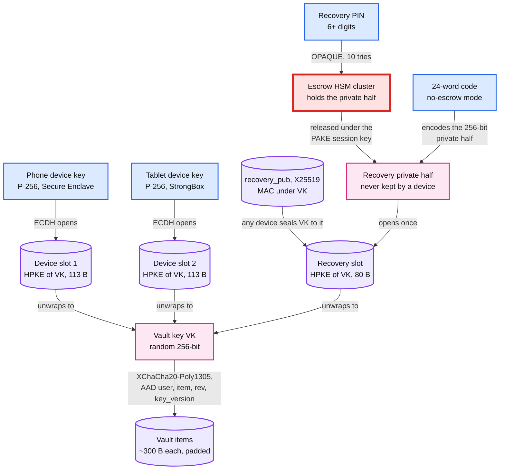
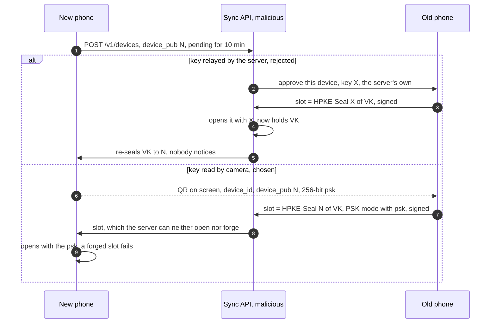

# Deep dive: vault encryption and the key hierarchy

> One-line answer: every item is sealed on the phone with XChaCha20-Poly1305 under a random 256-bit vault key (VK), with associated data `user_id ‖ item_id ‖ rev ‖ key_version` and padding to the next 128 B boundary, so the server holds ciphertext it can neither read, move, relabel nor forge a delete into; VK exists server-side only wrapped, once per device (HPKE to a non-exportable P-256 key in the Secure Enclave or StrongBox) and once to an X25519 recovery public key whose private half lives only in the escrow HSMs or on the user's 24-word paper. A new device joins by QR, because a key relayed by our server is a key our server can swap, and the QR's 256-bit `psk` must also authenticate the slot coming back. Revoking a device rotates VK in one transaction that needs no PIN, and still cannot undo what the revoked device already saw.

Related: [`../solution.md` §5.1](../solution.md#51-who-can-read-the-secrets-us-an-insider-or-someone-who-steals-the-users-account), [§5.2](../solution.md#52-the-user-lost-every-device-how-do-they-get-their-codes-back-without-letting-an-attacker-do-the-same), [Flow 4](../solution.md#flow-4-new-phone-old-phone-in-hand-fr5), [§10.10](../solution.md#1010-security-and-abuse), [`recovery-and-hsm-escrow.md`](recovery-and-hsm-escrow.md) (how the recovery private half is released), [`multi-device-sync-and-conflicts.md`](multi-device-sync-and-conflicts.md) (what `rev`, `seq` and `epoch` do for merges), [`../../../concepts/signed-url.md`](../../../concepts/signed-url.md) (HMAC as the integrity primitive the toy model uses).

---

## 1. Threat model: who gets what

| Attacker | What they hold | Server-side encryption (solution §4.4) | Our end-to-end design |
|---|---|---|---|
| Stolen disk or backup tape | Vault DB files | Nothing, the KMS key lives elsewhere | Nothing: ciphertext and wrapped keys |
| Insider with DB and KMS rights | Production data, decrypt rights | Every secret of every user | Ciphertext plus metadata (item count, sizes, write times, device list, IPs). At most 10 PIN guesses per user, each after an HSM-registered 24 h start that alerts the user, ~116 days per cluster at the firmware ceiling |
| Compromised Sync API (attacker runs code) | Every live request | Every secret, live and silently | Ciphertext. Can drop, delay or roll back writes and lie about the device list (§4) |
| Account takeover (phished password, SIM-swapped SMS) | A valid session | Every secret on the attacker's phone (Retool, 27 customers) | Ciphertext. Can start a recovery: 24 h wait in the HSMs, alerts on every channel, 10 PIN guesses |
| Malicious or compelled operator | Everything server-side | Everything | As the insider. The active attacks in §3 and §4 fail, except serving an old but self-consistent vault to a brand-new device |
| Stolen locked phone | The hardware | Whatever the app keeps locally | Nothing: the slot opens only through the chip key, released after device unlock, and the chip rate-limits passcode guesses |
| Stolen unlocked phone | The screen | Every code | Nothing past the app lock, mandatory once sync is on; the device key needs the current biometric set. With the owner's finger or face, every code. The user revokes, we rotate, the user re-keys sites |
| Malware with root on the phone | Process memory, screen | Everything | Everything this phone decrypts. The chip key cannot leave, but malware can use it while resident. No server design fixes this |

## 2. The key hierarchy



- **Device slot** = `HPKE-Seal(device_pub, VK)`, base mode, DHKEM(P-256, HKDF-SHA256): 65 B encapsulated key + 32 B + 16 B tag = 113 B, the "~120 B" of solution §2. The HPKE `info` is `"slot" ‖ user_id ‖ device_id ‖ slots_version`, so a slot cannot be moved to another device's row or an older version. P-256 because the Secure Enclave takes only P-256 keys ([Apple](https://developer.apple.com/documentation/security/protecting-keys-with-the-secure-enclave)). Each device keeps its own slot locally, so it unlocks offline. Android Keystore ECDH (`PURPOSE_AGREE_KEY`) arrived in API level 31; on older phones a Keystore AES key wraps a software P-256 key [design choice].
- **Recovery slot** = `HPKE-Seal(recovery_pub, VK)` with X25519 (32 B encapsulated key), 80 B. `recovery_pub` carries a MAC under VK, and a device checks it before sealing, so the server cannot slip in a public key of its own. Only the public half is on devices: rotation never needs the PIN, and a stolen device never holds a recovery private key.
- **The 24-word code** (no-escrow mode) is 24 words, 256 bits plus a checksum: the X25519 private half itself. A random 256-bit value needs no key stretching. **Argon2id (RFC 9106 second setting, 64 MiB, t = 3, p = 4) is only for a user-chosen passphrase**, which we allow but discourage. In paper mode a recovery must not rotate the pair, or the words on paper stop working.

## 3. Sealing an item

Layout: `header (format, key_version) ‖ nonce 24 B ‖ ciphertext of the padded item ‖ tag 16 B`. The plaintext holds secret, issuer, label, parameters, field HLCs and the `deleted` flag. The AAD is fixed-width (8 B user, 16 B UUID, 4 B rev, 4 B key version), because a string join like `"42|7"` is ambiguous.

| AAD field | What the server could do without it |
|---|---|
| `item_id` | Put the bank item's ciphertext in the GitHub row. Merges, tombstones and "possibly replaced" marks would then act on the wrong secret |
| `rev` | Relabel an old ciphertext with a fresh `rev` to slip past the device's high-water mark, for example to bring back a secret the user re-keyed after a leak. A plain replay at the old `rev` is caught by the high-water mark, not by the AAD |
| `key_version` | Swap the header so a device tries a second key (see key commitment below). Devices also refuse items below the current version, so a revoked device that still knows the old VK cannot inject items, even with our help |
| `user_id` | Copy a ciphertext between users. Their VKs differ, so this fails anyway: defence in depth for a future shared vault |

- **Tombstones are ciphertext.** `deleted` is sealed inside the item and the plaintext column is only a purge hint, so a forged delete does not decrypt and devices report it.
- **Why XChaCha20 and not AES-GCM with random 96-bit nonces.** Aegis uses GCM and its format doc cites NIST's limit of 2^32 random-nonce invocations per key ([vault.md](https://github.com/beemdevelopment/Aegis/blob/master/docs/vault.md)). Push back on the folklore: at our volume GCM is also safe. One VK sees maybe 10^4 encryptions in its life, so collision odds are q² / 2^97 ≈ 6 x 10^-22 per vault, ~6 x 10^-14 across 100 M vaults. We still pick XChaCha20: no per-key budget for a key that lives for years on many devices, a GCM nonce reuse leaks the authentication key for every message, and phones without AES instructions run ChaCha faster. libsodium documents that its 192-bit nonce makes random nonces safe ([libsodium](https://libsodium.gitbook.io/doc/secret-key_cryptography/aead/chacha20-poly1305/xchacha20-poly1305_construction)).
- **Neither AEAD commits to its key** (Len, Grubbs, Ristenpart, USENIX Security 2021): one ciphertext can be built to open under two chosen keys. So the header names the key version and the client, during a rotation too, tries exactly the key `key_version` names, never "old VK, then new VK".
- **Padding to the next 128 B boundary** hides small differences in label and issuer length: a ~200 B item becomes 256 B, 296 B with nonce and tag. Cost ~64 B per item, ~50 GB across 800 M items; the vault stays ~4 KB per user. 512 B buckets would hide more for ~200 GB and ~6 KB per user.

## 4. Device join, revoke and rotation



- **Why the camera.** A key that crosses our server is a key our server can replace (steps 2 to 5). The server's check of the slot's signature, `Sign(old_device_key, user_id ‖ new_device_id ‖ H(slot) ‖ slots_version)`, stops a stolen OAuth token, not a malicious server. The slot `PUT` carries `key_version` and `slots_version` and gets `409` if either is stale. The old phone seals to the key its own camera read.
- **The other direction.** The new phone must also know the slot came from the old phone. Otherwise a malicious server hands it `HPKE-Seal(N, VK*)` for a VK* of its own, with an empty vault and a `recovery_pub` MAC'd under VK*. The new phone adopts VK* and every item it adds is readable by us. Fix: the QR carries `{device_id, device_pub, psk}` and the slot uses HPKE `mode_psk`. RFC 9180 §5.1.2: "The PSK MUST have at least 32 bytes of entropy", so `psk` is 256 bits. It went only through the camera, so no server can build a slot that opens.
- **The device list is authenticated.** A rotation seals VK' to every listed device, so a fake entry would receive the vault key. Each `DEVICE` entry carries a MAC under the current VK over `(device_id, device_pub, key_version)`, written by the approving device, and devices seal only to entries that verify. A restored database that resurrects a revoked device fails, its MAC is under an old `key_version`. Future hardening (solution §10.10): a vault head MACed under VK over `(seq, count, hash of the (item_id, rev) set)`, the latest pinned in the escrow record, catches withheld items.
- **Social engineering.** "Scan this code to verify your account." The prompt names the model and place ("Add Pixel 9 near Pune?"), takes a biometric, and `device_added` alerts every channel. Migration from server-held keys uses the same QR join, one device at a time; after the flip the server refuses legacy plaintext `PUT`s, and the legacy copy is crypto-shredded per account only once every listed device has its own slot.

**Revoke and rotate:**
1. "Remove tablet" with another device's signature takes effect after 24 h with alerts; with a passkey registered at least 7 days ago it is immediate. The target may contest, which freezes writes and slot changes on both devices until the user proves the recovery PIN at the HSMs or signs in with that old passkey: a thief's phone cannot win by contesting. Then the server marks the tablet revoked, deletes its `wrapped_vk`, revokes its tokens and marks the vault `rotation_due`: item writes get `409` until a rotation commits. The price of both freezes: an owner without the PIN or an old passkey stays frozen for writes, though codes still show.
2. A remaining device draws VK' and re-seals every item under `key_version + 1` with unchanged contents, `rev` and field HLCs, so merges see no edit. 8 items take about a millisecond.
3. It checks the MACs, shows the device list for the user to confirm, seals VK' to each remaining entry and to `recovery_pub`, and re-MACs both under VK'. No PIN: only the public half is needed.
4. One call, `POST /v1/vault/rotate`, one transaction conditional on `slots_version`, about 5 KB on one partition: a crash never leaves items under two keys. A later item or slot `PUT` under an old `key_version` or `slots_version` gets `409`; that device fetches its new slot and retries. Devices remember the highest `key_version` seen and reject a lower one; after a server restore that regressed it, they re-run the rotation, re-applying known revokes, before re-uploading.

**What rotation cannot undo.** The tablet saw every TOTP secret, and a secret changes only when the website issues a new one. Rotation protects items added after the revoke. So the app lists the issuers to re-key after a theft: the honest answer to "a thief has my phone".

## 5. Local storage on the phone

- **iOS.** The device key is created with `kSecAttrTokenIDSecureEnclave` and access control `.privateKeyUsage` plus `.biometryCurrentSet`: the app lock is mandatory once sync is on. The local slot and any cached key use `kSecAttrAccessibleWhenPasscodeSetThisDeviceOnly`: "Items with this attribute never migrate to a new device. After a backup is restored to a new device, these items are missing", and "Disabling the device passcode causes all items in this class to be deleted" ([Apple](https://developer.apple.com/documentation/security/ksecattraccessiblewhenpasscodesetthisdeviceonly)). Never `kSecAttrSynchronizable`: iCloud Keychain sync would add Apple's recovery path to ours.
- **Android.** A Keystore key with `setIsStrongBoxBacked(true)`, falling back to the TEE on `StrongBoxUnavailableException`, plus `setUnlockedDeviceRequired(true)`, `setUserAuthenticationRequired(true)` and `setInvalidatedByBiometricEnrollment(true)`, like `.biometryCurrentSet` on iOS: a thief who learns the passcode and enrolls a finger loses the key. An honest user who adds a finger rejoins by QR.
- **Backups.** `android:allowBackup="false"` is not enough: for apps targeting Android 12 or higher, some manufacturers' devices can still migrate app files device to device ([manifest docs](https://developer.android.com/guide/topics/manifest/application-element)). So `android:dataExtractionRules` also excludes the database from `<cloud-backup>` and `<device-transfer>`. If the file travels anyway, it is ciphertext whose Keystore key stayed behind: the new phone sees an unopenable database and starts as a new device.
- **App lock** (Google: Privacy Screen) is the biometric gate on the device key, for opening the vault and approving a QR join. **Memory:** Decrypt an item only while its code is on screen. Hold secrets in byte arrays and zero them after use (strings cannot be zeroed). Drop VK and plaintext in the background. `FLAG_SECURE` on Android and a blurred snapshot on iOS keep codes out of the app switcher.

## 6. How others do it

| Product | Who can decrypt the cloud copy | Item cipher | Key from a password | New device | No device left |
|---|---|---|---|---|---|
| Google Authenticator (2023 sync) | Google: "encrypts ... in transit and at rest" ([help](https://support.google.com/accounts/answer/1066447)) | Not published | None, account sign-in | Sign in | Sign in |
| Authy | Devices with the backup password | AES-256-CBC per account, no tag ([Twilio](https://www.twilio.com/blog/how-the-authy-two-factor-backups-work)) | PBKDF2, 100,000 rounds, password ≥ 6 characters | Approval from a device, or SMS | Backup password |
| Aegis | Local only, encrypted export | AES-256-GCM, random master key | scrypt N = 2^15, r = 8, p = 1 (password slot) or a Keystore key (biometric slot) | Import a file | The password slot of an export |
| Ente Auth | Only the user | XChaCha20-Poly1305 (libsodium) | Argon2id key-encryption key wraps the master key ([Ente](https://ente.io/architecture)) | Sign in with the password | 24-word key, which Ente "cannot provide or regenerate" |
| Apple iCloud Keychain | Only the user's devices | Not compared here | iCloud security code, checked by SRP in HSMs | An existing device vouches for the newcomer ([Apple](https://support.apple.com/guide/security/secure-keychain-syncing-sec0a319b35f/web)) | HSM escrow, 10 attempts |
| Ours | Only the user's devices | XChaCha20-Poly1305, AAD, 128 B padding | None by default. Argon2id only for an optional passphrase | QR from an existing device | HSM escrow, OPAQUE, 10 tries, 24 h; or 24 words |

## 7. NIST SP 800-63B-4 Appendix B, row by row

Appendix B (normative) covers syncable authenticators ([NIST](https://pages.nist.gov/800-63-4/sp800-63b.html)). It was written for passkeys; a synced TOTP vault is the same shape.

| Requirement | Our design | Status |
|---|---|---|
| "All keys SHALL be generated using approved cryptography." | VK and RK from the OS CSPRNG; device keys P-256. But XChaCha20-Poly1305 is not a NIST-approved cipher | Keys meet. A FIPS build swaps in AES-256-GCM, safe at our volume (§3) |
| Keys in the sync fabric "SHALL only be stored in an encrypted form using a key with the minimum security strength specified in ... [SP800-131A]" | 256-bit VK; slots under P-256 and X25519, ~128-bit strength | Meets |
| "These keys SHOULD be encrypted using a method that employs a user-controlled secret." | Device slots need the user's device; recovery needs the user's PIN in the HSMs or the 24 words. No path uses a secret we hold | Meets the intent |
| Access "such that only the authenticated user can access their authentication keys" | OAuth token plus a device signature on every call, partitioned by `user_id` | Meets |
| "User access ... SHALL be protected by AAL2-equivalent MFA" | Account sign-in with 2SV, plus a second way in that does not live in this vault (a passkey stored in this vault does not count) | Meets, if SMS is not the only second factor |
| "All authentication transactions SHALL perform private-key operations on the local device" | Codes are computed on the phone. No server computes a code | Meets |
| "Authenticator UI SHALL NOT expose the authentication key itself." | Codes only. Devices move secrets through slots, never a secret on screen | Meets, if we skip a "show secret" or plaintext export screen |
| "SHOULD provide a user interface (UI) that allows subscribers to view" what is synced | Settings lists every device with a slot, last seen, and the items | Meets |
| "Notify the user of any recovery activities." (B.4) | `recovery_started`, every PIN attempt, `device_added`, to devices active or revoked in the last 30 days and contacts on file 30 days ago | Meets |
| Synced keys are exportable, so they cannot reach AAL3 | TOTP is at most AAL2 and "not phishing-resistant" (§3.1.4) anyway | Accepted |

## 8. Runnable teaching model

Python's standard library has no XChaCha20 or HPKE, so this is an honest stand-in. The AEAD is HMAC-SHA256 in counter mode with an HMAC tag (encrypt-then-MAC). The key wrap is real X25519, checked against the RFC 7748 test vector, feeding that toy AEAD. It shows AAD binding, revision binding, the `recovery_pub` MAC, and a revoked device locked out after rotation.

```python
"""Vault key hierarchy, standard library only. NOT FOR PRODUCTION. toy_seal (HMAC-SHA256 keystream + HMAC tag)
stands in for XChaCha20-Poly1305; hpke_seal (X25519 from RFC 7748 + toy_seal) stands in for HPKE (RFC 9180)."""
import hashlib, hmac, secrets, struct, uuid

P, BASE = 2**255 - 19, (9).to_bytes(32, "little")
def x25519(k, u):                                            # RFC 7748 Montgomery ladder
    k = int.from_bytes(k, "little") & ~7 & ((1 << 254) - 1) | (1 << 254)
    x1 = int.from_bytes(u, "little") & ((1 << 255) - 1)
    x2, z2, x3, z3, swap = 1, 0, x1, 1, 0
    for t in reversed(range(255)):
        b = (k >> t) & 1; swap ^= b
        x2, x3, z2, z3, swap = (x3, x2, z3, z2, b) if swap else (x2, x3, z2, z3, b)
        a, aa, c, cc = x2 + z2, (x2 + z2) ** 2, x2 - z2, (x2 - z2) ** 2
        e, da, cb = aa - cc, (x3 - z3) * a, (x3 + z3) * c
        x3, z3 = (da + cb) ** 2 % P, x1 * (da - cb) ** 2 % P
        x2, z2 = aa * cc % P, e * (aa + 121665 * e) % P
    if swap: x2, z2 = x3, z3
    return (x2 * pow(z2, P - 2, P) % P).to_bytes(32, "little")
keypair = lambda: ((sk := secrets.token_bytes(32)), x25519(sk, BASE))

prf = lambda key, *parts: hmac.new(key, b"".join(parts), hashlib.sha256).digest()
stream = lambda ek, n, size: b"".join(prf(ek, n, struct.pack(">I", i)) for i in range(size // 32 + 1))
def toy_seal(key, pt, aad):
    n, ek, mk = secrets.token_bytes(24), prf(key, b"enc"), prf(key, b"mac")    # 192-bit random nonce
    ct = bytes(x ^ y for x, y in zip(pt, stream(ek, n, len(pt))))
    return n + ct + prf(mk, struct.pack(">I", len(aad)), aad, n, ct)[:16]
def toy_open(key, blob, aad):
    n, ct, tag, ek, mk = blob[:24], blob[24:-16], blob[-16:], prf(key, b"enc"), prf(key, b"mac")
    if not hmac.compare_digest(tag, prf(mk, struct.pack(">I", len(aad)), aad, n, ct)[:16]):
        raise ValueError("tag mismatch")
    return bytes(x ^ y for x, y in zip(ct, stream(ek, n, len(ct))))
def hpke_seal(pub, msg, info):                               # ephemeral X25519, key bound to enc, pub, info
    esk, enc = keypair(); return enc + toy_seal(prf(x25519(esk, pub), enc, pub, info), msg, info)
def hpke_open(sk, blob, info):
    enc = blob[:32]; return toy_open(prf(x25519(sk, enc), enc, x25519(sk, BASE), info), blob[32:], info)

pad = lambda b: b + b"\x80" + b"\0" * (-(len(b) + 1) % 128)                 # next 128 B boundary
aad = lambda user, item, rev, kv=1: struct.pack(">Q16sII", user, item.bytes, rev, kv)  # fixed width
def show(label, fn):
    try: print(f"{label:55} {fn()}")
    except ValueError as e: print(f"{label:55} REJECTED ({e})")

a = bytes.fromhex("77076d0a7318a57d3c16c17251b26645df4c2f87ebc0992ab177fba51db92c2a")
b = bytes.fromhex("5dab087e624a8a4b79e17f8b83800ee66f3bb1292618b6fd1c2f8b27ff88e0eb")
show("X25519 matches RFC 7748 section 6.1", lambda: x25519(a, x25519(b, BASE)).hex() == "4a5d9d5ba4ce2de1728e3bf480350f25e07e21c947d19e3376f09b3c1e161742")
user, gh, bank, vk = 42, uuid.uuid4(), uuid.uuid4(), secrets.token_bytes(32)
(phone_sk, phone_pk), (tab_sk, tab_pk), (escrow_sk, recovery_pub) = keypair(), keypair(), keypair()
slots = {"phone": hpke_seal(phone_pk, vk, b"slot|phone|v1"),          # info binds device and slots_version
         "tablet": hpke_seal(tab_pk, vk, b"slot|tablet|v1")}
recovery_slot = hpke_seal(recovery_pub, vk, b"recovery|v1")        # the private half goes to escrow only
pub_mac = prf(vk, b"recovery_pub", recovery_pub)                   # stored next to recovery_pub
show("padding: 150 B and 250 B plaintexts become", lambda: [len(toy_seal(vk, pad(b"x" * n), b"")) for n in (150, 250)])
ct5 = toy_seal(vk, pad(b'{"issuer":"GitHub","secret":"JBSWY3DP"}'), aad(user, gh, 5))
show("AAD: open as user 42, GitHub item, rev 5", lambda: toy_open(vk, ct5, aad(user, gh, 5))[:18].decode())
show("AAD: server moves it to the bank item", lambda: toy_open(vk, ct5, aad(user, bank, 5)))
show("AAD: server moves it to user 43", lambda: toy_open(vk, ct5, aad(43, gh, 5)))
ct3, seen = toy_seal(vk, pad(b'{"issuer":"GitHub","secret":"OLDSECRT"}'), aad(user, gh, 3)), {gh: 5}
def tablet_accepts(item, rev, blob):                       # the tablet keeps a high-water mark per item
    if rev <= seen[item]: raise ValueError(f"rev {rev} <= seen {seen[item]}")
    toy_open(vk, blob, aad(user, item, rev)); return "accepted"
show("rev: server replays rev 3 to a tablet that saw rev 5", lambda: tablet_accepts(gh, 3, ct3))
show("rev: server relabels the rev 3 ciphertext as rev 6", lambda: tablet_accepts(gh, 6, ct3))
def check_pub(pub):                                        # before sealing VK' to it
    if not hmac.compare_digest(prf(vk, b"recovery_pub", pub), pub_mac): raise ValueError("MAC under VK fails")
    return "MAC ok"
show("rotate: server offers its own recovery_pub", lambda: check_pub(keypair()[1]))
show("rotate: the user's recovery_pub", lambda: check_pub(recovery_pub))
vk2 = secrets.token_bytes(32)                              # tablet revoked: the phone rotates, no PIN asked
slots = {"phone": hpke_seal(phone_pk, vk2, b"slot|phone|v2")}
recovery_slot = hpke_seal(recovery_pub, vk2, b"recovery|v2")      # needs only the public half
new = toy_seal(vk2, pad(b'{"issuer":"Bank","secret":"NEWSECRT"}'), aad(user, bank, 1, kv=2))
show("rotate: devices with a v2 slot", lambda: list(slots))
vk_phone = lambda: hpke_open(phone_sk, slots["phone"], b"slot|phone|v2")
show("rotate: phone opens its v2 slot, reads the new item", lambda: toy_open(vk_phone(), new, aad(user, bank, 1, kv=2))[:16].decode())
show("rotate: tablet tries the phone's v2 slot", lambda: hpke_open(tab_sk, slots["phone"], b"slot|phone|v2"))
show("rotate: tablet tries old VK on the new item", lambda: toy_open(vk, new, aad(user, bank, 1, kv=2)))
show("rotate: escrowed private half opens recovery v2", lambda: hpke_open(escrow_sk, recovery_slot, b"recovery|v2") == vk2)
show("rotate: tablet re-reads its own old copy", lambda: toy_open(vk, ct5, aad(user, gh, 5))[19:38].decode())
```

Output:

```
X25519 matches RFC 7748 section 6.1                     True
padding: 150 B and 250 B plaintexts become              [296, 296]
AAD: open as user 42, GitHub item, rev 5                {"issuer":"GitHub"
AAD: server moves it to the bank item                   REJECTED (tag mismatch)
AAD: server moves it to user 43                         REJECTED (tag mismatch)
rev: server replays rev 3 to a tablet that saw rev 5    REJECTED (rev 3 <= seen 5)
rev: server relabels the rev 3 ciphertext as rev 6      REJECTED (tag mismatch)
rotate: server offers its own recovery_pub              REJECTED (MAC under VK fails)
rotate: the user's recovery_pub                         MAC ok
rotate: devices with a v2 slot                          ['phone']
rotate: phone opens its v2 slot, reads the new item     {"issuer":"Bank"
rotate: tablet tries the phone's v2 slot                REJECTED (tag mismatch)
rotate: tablet tries old VK on the new item             REJECTED (tag mismatch)
rotate: escrowed private half opens recovery v2         True
rotate: tablet re-reads its own old copy                "secret":"JBSWY3DP"
```

- The tag check, not the decryption, rejects a moved or relabelled ciphertext. That is what the AAD buys.
- The plain replay of rev 3 is caught by the high-water mark, which the AAD makes unforgeable. A brand-new device has no high-water mark, so for it the gap stays open. The last line is what rotation cannot undo.

## 9. Trade-offs

| Decision | Chose | Gave up |
|---|---|---|
| Item cipher | XChaCha20-Poly1305 | AES hardware speed (irrelevant for 8 items) and FIPS approval |
| Granularity | One ciphertext per item, padded to 128 B | Item count and size class are visible. ~50 GB |
| Join channel | QR plus a PSK | One camera step. No "approve on your other phone" button that relays keys |
| Recovery key | X25519 pair, private half only in escrow or on paper | One more key type. In return, rotation needs no PIN |
| Revoke | Rotate VK at once, one transaction | O(items) re-seal per revoke, ~5 KB |

## 10. What the interviewer probes next

- **"Why not derive the key from the account password?"** Then a password reset destroys the vault, and every server-side password check becomes an offline oracle for it.
- **"The server shows a brand-new phone last month's vault. Detected?"** Not today. AAD and high-water marks protect devices with history. The planned vault head, pinned in the escrow record, closes it for a recovering phone; a QR-joined phone can take the head from the old one.
- **"Can a court order make you read the codes?"** It gets ciphertext and metadata. The real lever is a malicious app release, which is why releases are staged and signed.
