# Diagrams: two-factor authenticator app (Google Authenticator)

> One-line answer: the D1 to D12 set from `hld/CLAUDE.md` §4, each drawn once. Diagrams already embedded in [`solution.md`](solution.md) are linked, not repeated. Every name and number comes from [`solution.md`](solution.md#2-back-of-envelope); anything else is marked [estimate].

Acronyms used below: TOTP (time-based one-time password), RP (relying party, the website), HSM (hardware security module), PAKE (password-authenticated key exchange), CAS (compare-and-set, a conditional write), VK (vault key), RK (recovery key pair, X25519), HPKE (hybrid public key encryption), MAC (message authentication code), APNs / FCM (Apple and Google push services), KMS (key management service), RPO (recovery point objective), E2EE (end-to-end encryption), 2SV (2-step verification), DFD (data flow diagram), AAD (associated data bound into each ciphertext).

| # | Diagram | Where |
|---|---|---|
| D1 | Context | below |
| D2 | Data flow with sizes and rates, RP half and backend half | below |
| D3 | Component architecture (final design) | [`solution.md` §6](solution.md#6-final-design-and-the-core-flows) |
| D4 | Happy path per FR | FR1 enroll: [Flow 1](solution.md#flow-1-enroll-at-a-website-fr1). FR4 sync: [Flow 3](solution.md#flow-3-add-an-account-on-the-phone-see-it-on-the-tablet-fr4). FR5 no device: [§5.2](solution.md#52-the-user-lost-every-device-how-do-they-get-their-codes-back-without-letting-an-attacker-do-the-same). FR2 + FR3 sign in, FR5 old phone in hand: below |
| D5 | Failure paths | Account takeover: [Flow 6](solution.md#flow-6-an-attacker-owns-the-account-and-tries-to-restore-failure). Verifier region loss: [§10.4](solution.md#104-failure-timeline). Racing codes, lost writes and the epoch, dropped tickle, 10 wrong PINs: below |
| D6 | Decision flow for one verify call | below |
| D7 | Entity relationship | [`solution.md` §3.3](solution.md#33-data-model) |
| D8 | State machines: FACTOR, DEVICE, escrow generation, recovery request | below |
| D9 | Deployment / topology | below |
| D10 | Scaling / partitioning | below |
| D11 | Failure mode map | below |
| D12 | Rollout / migration | below |
| extra | Key hierarchy (VK, device slots, recovery slot) | [`solution.md` §5.1](solution.md#51-who-can-read-the-secrets-us-an-insider-or-someone-who-steals-the-users-account) |

## D1. Context (zoom-out)

The backend is one box. The phone talks to websites only through the user's eyes and fingers, never over the network.
```mermaid
%% D1: context. Our backend is one box. Every external actor and what flows on each edge. Red: the escrow HSM clusters, the only way into a vault without a device.
flowchart LR
    WEB["Websites, relying parties<br/>issue secret, verify code"]:::external -->|"otpauth QR, 20 B secret,<br/>once per account"| APP["Authenticator app<br/>on the phone"]:::client
    U["User"]:::client -->|"scans QR, reads<br/>the 6-digit code"| APP
    U -->|"password, then code"| WEB
    APP -->|"sign in, OAuth"| ACC["Account service<br/>sign-in, tokens, 2SV"]:::service
    APP -->|"ciphertext items ~300 B,<br/>slots, recovery PAKE"| BE["Our backend<br/>Sync API, Vault DB,<br/>Recovery, Notify"]:::service
    BE -->|"changes since seq,<br/>ciphertext only"| OTH["Other devices<br/>tablet, new phone"]:::client
    BE -->|"silent tickle, alerts"| PUSH["APNs / FCM"]:::external
    PUSH -->|"vault changed,<br/>restore started"| OTH
    BE -->|"PAKE messages, RK private<br/>half under the PAKE key"| HSM["Escrow HSM clusters<br/>10 tries, 24 h start"]:::critical
    X["Attacker<br/>phished password, SIM swap"]:::external -->|"takes over account,<br/>gets ciphertext only"| ACC
    X -->|"relays password + code<br/>in real time"| WEB
    classDef client   fill:#dbeafe,stroke:#2563eb,stroke-width:2px,color:#111
    classDef service  fill:#dcfce7,stroke:#16a34a,stroke-width:2px,color:#111
    classDef external fill:#e5e7eb,stroke:#6b7280,stroke-width:2px,color:#111,stroke-dasharray:4 3
    classDef critical fill:#fee2e2,stroke:#dc2626,stroke-width:4px,color:#111
```

- **What to say:** there is no edge from the app to the backend for showing a code. The two attacker edges are the two threats: account takeover meets E2EE and gets ciphertext (Retool, 2023), and a real-time relay beats TOTP at the website, which no vault design fixes (NIST §3.1.4: "OTP authentication is not phishing-resistant").

## D2. Data flow (DFD)

Processes are rounded, stores are cylinders. Split in two halves to keep each under 15 nodes: the RP side with the phone, then our backend.

### D2a. The RP side and the phone

The only plaintext secret on any wire is the 20 B in the QR, once, from the website to the phone's camera.
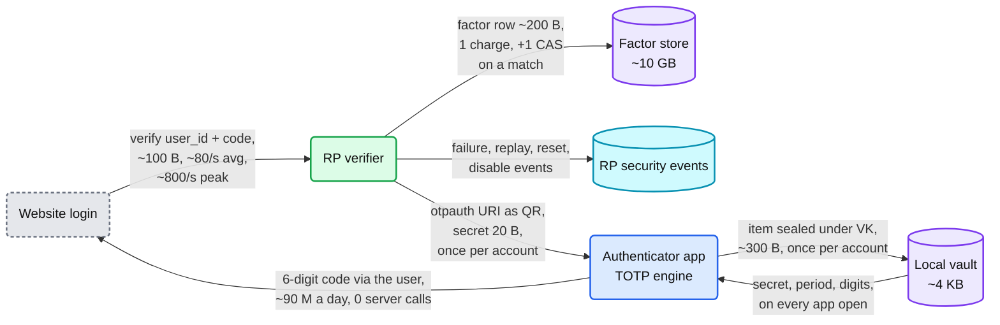

### D2b. Our backend

The biggest stream is ~10k empty sync reads a second in a reconnect wave. Nothing here needs more than a handful of machines.
```mermaid
%% D2b: our backend. Processes rounded, stores and the stream as cylinders. Avg unless marked peak. Red: the HSM cluster.
flowchart LR
    APP("Authenticator app"):::client -->|"item ciphertext ~300 B,<br/>~58/s avg, ~600/s peak.<br/>Device slot ~120 B, ~1/s"| SYNC("Sync API"):::service
    SYNC -->|"item + seq + outbox,<br/>one txn per write"| VDB[("Vault DB<br/>~4 KB per user,<br/>~400 GB")]:::store
    VDB -->|"outbox rows,<br/>~58/s"| NOT("Notify"):::service
    NOT -->|"silent tickle, a hint,<br/>no data, ~30/s"| PUSH("APNs / FCM"):::external
    PUSH -->|"vault changed"| OTH("Other devices"):::client
    SYNC -->|"changes since seq, ~200 B,<br/>on open + 30 s poll while open.<br/>~1k/s avg, ~10k/s wave.<br/>Heartbeat + Merkle proof ~3.5k/s"| OTH
    APP -->|"PAKE messages,<br/>~1 KB [estimate],<br/>~0.2/s avg, ~3/s peak"| REC("Recovery service"):::service
    REC <-->|"in: PAKE + sealed<br/>record ~300 B. Out: RK<br/>private half under the<br/>PAKE key, ~100 B"| HSM("Escrow HSM cluster"):::critical
    REC -->|"recovery_started,<br/>every PIN attempt"| SEC[("security-events")]:::queue
    SEC -->|"alerts: email, SMS,<br/>visible push"| NOT
    HSM -->|"signed heartbeat: tree root<br/>+ sequence, ~1 a minute"| SYNC
    classDef client   fill:#dbeafe,stroke:#2563eb,stroke-width:2px,color:#111
    classDef service  fill:#dcfce7,stroke:#16a34a,stroke-width:2px,color:#111
    classDef store    fill:#ede9fe,stroke:#7c3aed,stroke-width:2px,color:#111
    classDef queue    fill:#cffafe,stroke:#0891b2,stroke-width:2px,color:#111
    classDef external fill:#e5e7eb,stroke:#6b7280,stroke-width:2px,color:#111,stroke-dasharray:4 3
    classDef critical fill:#fee2e2,stroke:#dc2626,stroke-width:4px,color:#111
```

- **What to say:** everything that reaches our servers is ciphertext or PAKE messages. The RK private half leaves the HSMs only under the PAKE session key, which the relaying Recovery service does not have. The app pins an attestation root and accepts cluster keys only from a signed list with a sequence number, so the Recovery service cannot swap in its own key at setup. Each cluster signs a heartbeat about once a minute: the root of its record-state tree plus an increasing sequence number. Every device fetches the latest heartbeat and a Merkle proof for its own record on open and at least every 12 h (~3.5k proof reads/s), so even a start an insider registers directly is seen before the 24 h wait ends. 24 h without a fresh heartbeat is an alert. Bandwidth: 10k/s x 200 B = ~2 MB/s at the worst moment, 58/s x 300 B = ~17 KB/s of writes. The design is sized by keys, not bytes.

## D3. Component architecture

The final design is in [`solution.md` §6](solution.md#6-final-design-and-the-core-flows). It shows the app and local vault, API gateway, Account service, Sync API, Vault DB, Notify, APNs / FCM, Recovery service, the red Escrow HSM clusters and the `security-events` stream, with the RP verifier and Factor store below. The key hierarchy under it is in [§5.1](solution.md#51-who-can-read-the-secrets-us-an-insider-or-someone-who-steals-the-users-account).

## D4. Happy paths

FR1 enroll is [Flow 1](solution.md#flow-1-enroll-at-a-website-fr1): it starts only after a fresh sign-in at the highest assurance the account has, sends a notification, and the factor stays `pending` until the first code verifies. FR4 sync is [Flow 3](solution.md#flow-3-add-an-account-on-the-phone-see-it-on-the-tablet-fr4): one transaction writes the item, bumps `VAULT.seq` and adds an outbox row. FR5 with no device is the recovery sequence in [§5.2](solution.md#52-the-user-lost-every-device-how-do-they-get-their-codes-back-without-letting-an-attacker-do-the-same): a start the HSMs record, a 24 h wait, the PIN, the RK private half under the PAKE session key, then a fresh RK pair. The two flows below are not drawn in solution.md.

### D4. FR2 + FR3: sign in with a code, phone in airplane mode

The phone never talks to anyone. The verifier charges the attempt first, then wins one conditional write on one row.
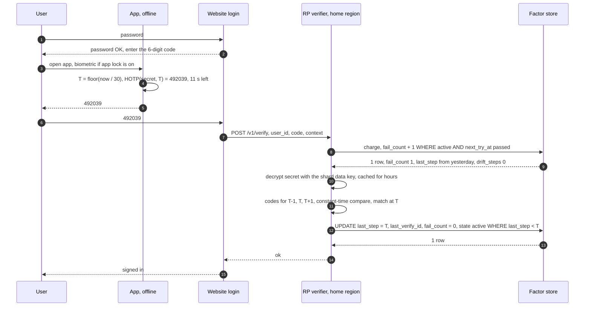

- **What to say:** the code is valid for up to ~90 s (three steps), but the CAS makes it single use. Charging before comparing is what makes the guess limit hold under parallel requests. `last_verify_id` is the login attempt id, so a front-end that retries after a lost response gets `ok`, not "replay". Steps 7 to 14 are p99 < 50 ms in the home region, +70 to 150 ms for a traveler whose login lands in another region.

### D4. FR5: new phone, old phone in hand

The QR carries the new phone's public key and a 256-bit `psk` by camera. The slot is HPKE in PSK mode with that `psk`, so the server can neither swap the public key nor hand the new phone a slot for a VK it made up. No HSM is involved.
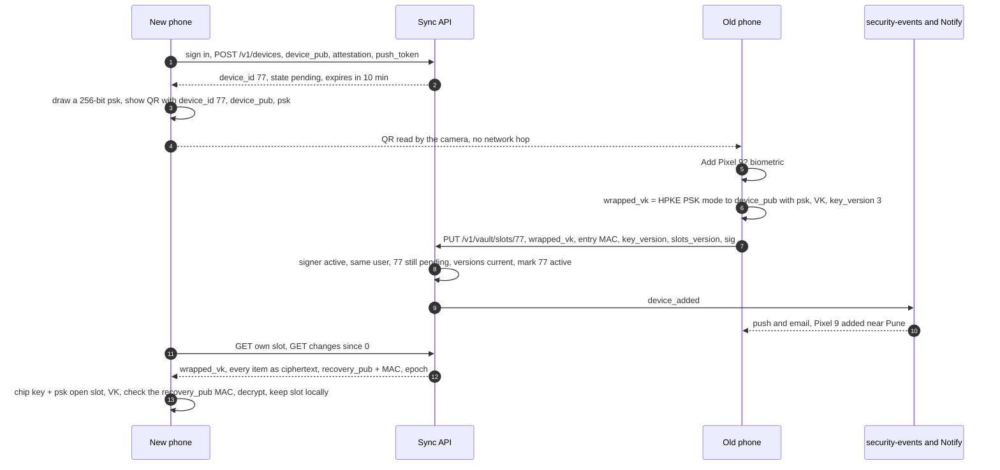

- **What to say:** device changes run at ~1/s (~15/s in a launch-week peak hour), and 4 in 5 take this path, so the HSMs see only ~0.2/s. The old phone MACs the new device entry under VK, so a database restore cannot resurrect a revoked device into the list that later rotations seal to. The new phone checks the `recovery_pub` MAC before it ever seals to it. The alert fires after the slot is written: it tells the user, it does not stop a hand-off approved by mistake.

## D5. Failure paths

Account takeover meeting the E2EE vault is [Flow 6](solution.md#flow-6-an-attacker-owns-the-account-and-tries-to-restore-failure). The verifier's home region dying mid sign-in is [§10.4](solution.md#104-failure-timeline). Four more follow.

### D5. Two submissions of the same code race

Two tabs, or a phishing relay and the real user, submit 492039 within the same second. The row lock serialises both the charges and the two `UPDATE`s. The second re-checks `last_step < T` after the first commits.
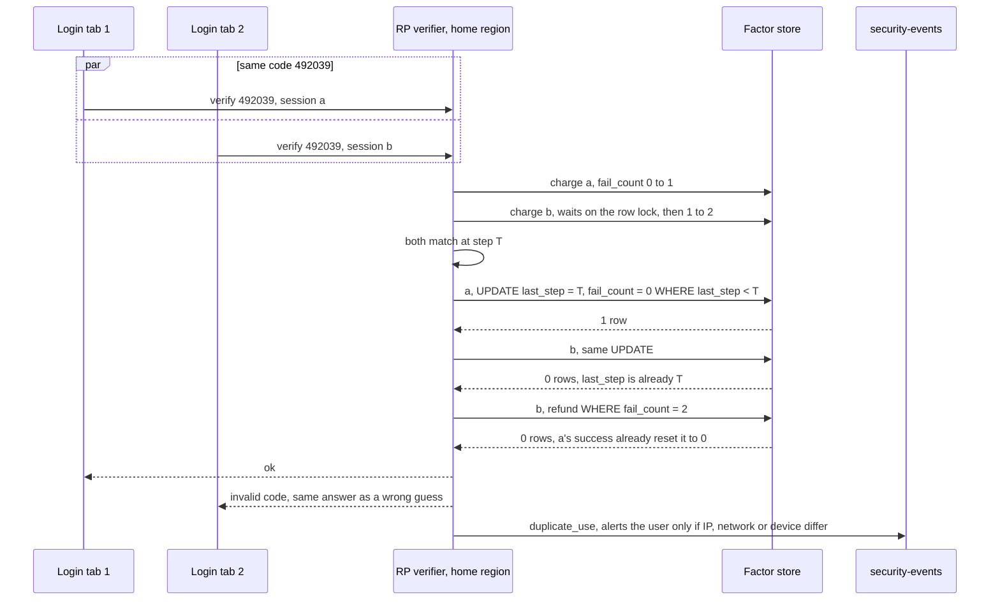

- **What to say:** this is RFC 6238 §5.2 "MUST NOT accept the second attempt" as one SQL predicate. The loser gets the same answer as a wrong code, so the response is not an oracle. A replay is refunded only if `fail_count` still equals what its charge returned. Here tab 1's success already reset it, so the refund matches 0 rows and nothing is counted twice. Honest replays (two tabs, a double-click, the 2 minutes after fixing a fast clock) never push a user toward a forced reset. It works across regions only because both requests go to the one home-region row. Concept: [`exactly-once`](../../concepts/exactly-once.md).

### D5. A failover loses acknowledged vault writes

The partition leader and its sync replica are both lost and an async copy is promoted, or an operator restores a backup. The server hands out seq 41 and 42 again, so comparing numbers sees nothing wrong. The partition's epoch, a generation number bumped on every restore or forced promotion, does.
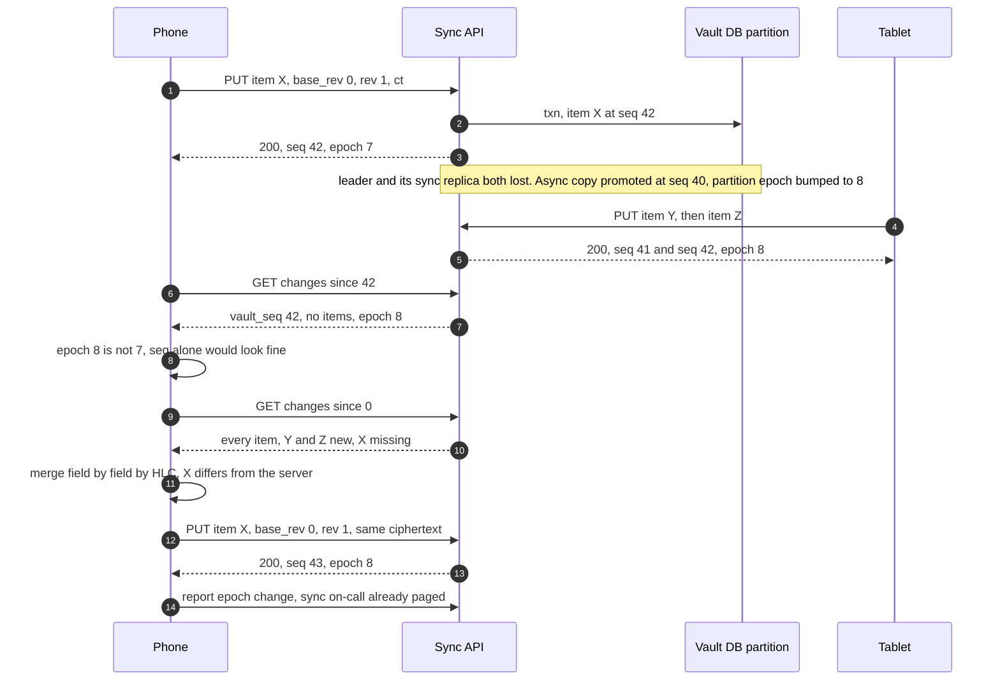

- **What to say:** re-uploading the same ciphertext works because the AAD binds `user_id`, `item_id`, `rev` and `key_version`, not `seq`, and the server's idempotency key `(item_id, rev, hash(ct))` is gone with the lost write. `item_id` is `HMAC(id_key, secret ‖ algorithm ‖ digits ‖ period)`, so the re-uploaded X lands on the same id every device already knows, and a rescan of the same QR is the same item. Every device that sees epoch 8 does the same full resync and merge, so whichever device holds the lost item puts it back. If the restore also rolled back `key_version` (a lost rotation), devices remember the highest they saw and re-run `POST /v1/vault/rotate` with the known revokes before re-uploading. The device is the second copy.

### D5. APNs or FCM drops the tickle

Silent pushes are best effort. The OS drops them under battery saver or when the app was killed. Nobody retries, because the tickle carries no data.
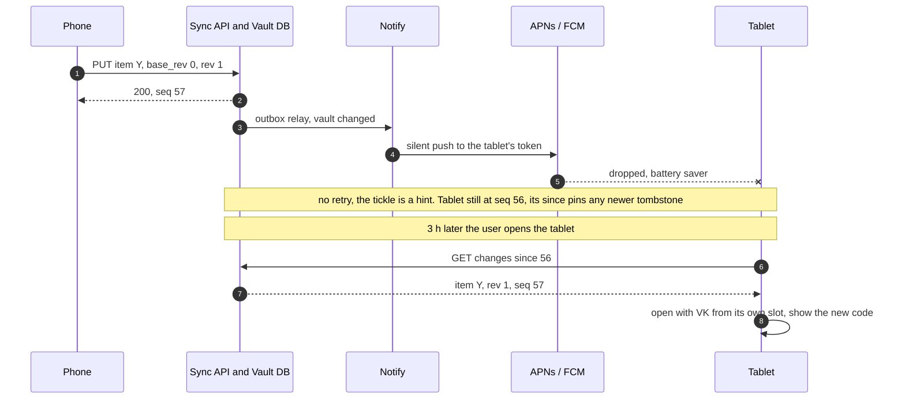

- **What to say:** the p95 10 s freshness target counts only while the app is open: the silent push is a hint and the open app also polls every 30 s. A closed device catches up on open, and that costs nothing real, because a code is needed only when the app is open. A device that stays offline is safe too: tombstones stay pinned until every active device has acknowledged a `since` past them, so the tablet still sees every delete. Only a device unseen for 90 days stops pinning and gets `410` and a full resync, with local items the server lacks moved to the local trash. Concept: [`realtime-client-server-communication`](../../concepts/realtime-client-server-communication.md).

### D5. Ten wrong recovery PINs

An attacker who owns the account, or a user who forgot the PIN, spends all 10 tries. Each attempt needs one shared attempt slot granted by a majority (an HSM grants slot k only if its own is below k), committed before the key exchange continues, so a dropped connection is never a free guess and a hostile relay cannot play the 5 HSMs against each other. A request allows 5 attempts, then a new HSM-registered 24 h start, so burning all 10 takes at least 48 h. Every attempt alerts.
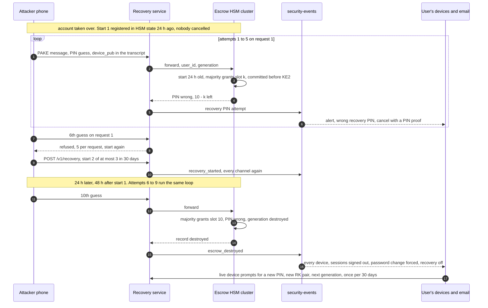

- **What to say:** the attacker leaves with nothing after at least 48 h, and the user got 2 start alerts and 10 attempt alerts on the way. The cost is a denial of service: whoever owns the account can burn the user's recovery on purpose. Re-escrow needs a new PIN and is allowed once per 30 days, so a reused PIN never gets a second budget. A user with no live device and no PIN falls back to each website's backup codes.

## D6. Decision flow: one verify call

Every branch ends in `ok`, `invalid`, `retry_after_s`, "reset your password", or `disabled`. The attempt is charged before the code is evaluated, so 10,000 parallel guesses cannot share a free slot. The charge also sets `reset_required`, so a crash after the compare cannot skip it.
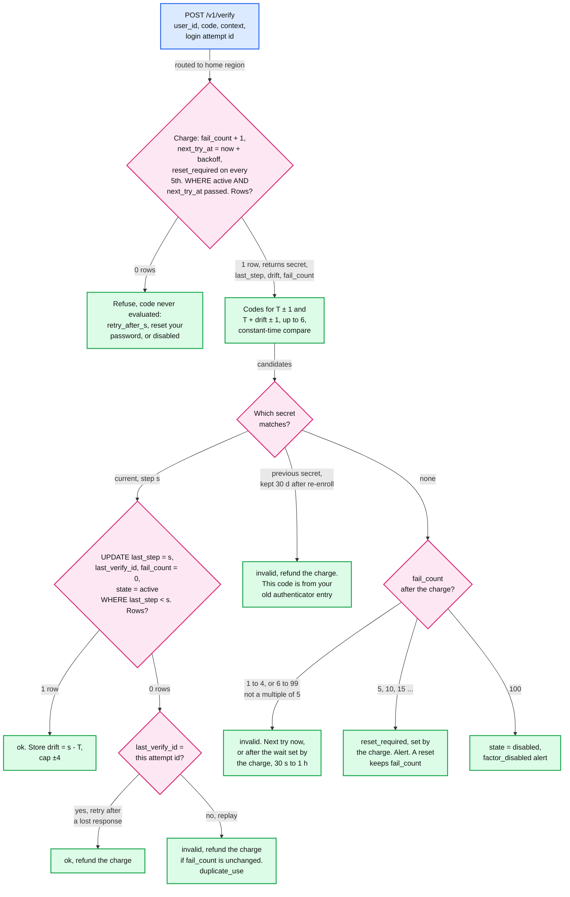

- **What to say:** the default policy treats the 5th consecutive failure as proof the password leaked: 5 x 3 / 10^6 = 1.5 x 10^-5 per leaked password, ~15 takeovers from 1 M stuffed passwords instead of ~300 with 100 tries. A password reset sets `state = active` but keeps `fail_count` and `next_try_at`, so an attacker who also controls the email cannot loop "reset, 5 guesses" forever: each loop runs on the backoff and the factor is disabled at 100. On the backoff alone (RPs that cannot force a reset): waits of 30 s doubling to 1 h, ~34 evaluated guesses on day 1, 24 a day after, disabled at 100 around hour 89. A drifted factor checks up to 6 codes: 3 x 10^-5 per leaked password. Drift moves only on the `ok` branch, so an attacker cannot walk the window. After a re-enroll the RP keeps the previous secret for 30 days (`FACTOR.prev_secret_ct`): a code from the old authenticator entry is refunded and explained, not counted toward a forced reset.
- **The probe to expect:** "Why not read `next_try_at`, then write the failure?" Every concurrent request would pass the read before any failure is written: 10,000 at once is 3% odds. RFC 4226 §7.3 names this "multiple parallel guessing" attack. Charging first is the same "decrement first" rule the escrow HSMs use. Concept: [`rate-limiting-and-load-shedding`](../../concepts/rate-limiting-and-load-shedding.md).

## D7. Entity relationship

The `erDiagram` is in [`solution.md` §3.3](solution.md#33-data-model): `FACTOR` and `BACKUP_CODE` at the RP, `VAULT`, `VAULT_ITEM`, `DEVICE`, `ESCROW_RECORD` and `SECURITY_EVENT` in our backend, all keyed by `user_id`. The fields the diagrams above lean on: `FACTOR.state` (with `reset_required`), the partition `epoch` returned on every sync response, `VAULT.recovery_pub` with its VK MAC, `VAULT_ITEM.key_version`, and `ESCROW_RECORD.generation`. It holds no plaintext about which websites a user has, and no recovery attempt counter (that lives inside the HSM cluster).

## D8. State machines

### D8. FACTOR (at the RP)

The charge sets `reset_required` on every 5th straight failure (5, 10, 15 ...): no code is evaluated until the password is reset. A reset returns to `active` with `fail_count` kept, which is the `backoff` box here. `backoff` is not a stored value, just `active` with `next_try_at` in the future. RPs that cannot force a reset skip `reset_required` and run the backoff alone.
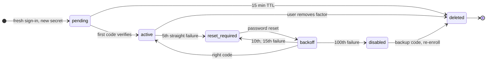

- **What to say:** `disabled` has no way back to `active`. NIST §3.2.2 caps it at 100. The user proves themselves another way (a backup code) and enrolls a new secret. `reset_required` is different: it is self-service, the real user is back after a password reset, and the attacker's password dies. Only a correct code or a backup code clears `fail_count`.

### D8. DEVICE

A device can read nothing until a slot exists for it, and an unapproved one is gone after 10 minutes. A revoke signed by another device waits 24 h with alerts, so a thief's unlocked phone cannot cut the owner's other devices off. If the target contests, both devices' writes and slot changes freeze until the user proves the recovery PIN at the HSMs or signs in with a passkey at least 7 days old, and that proof decides. A passkey that old also revokes at once.
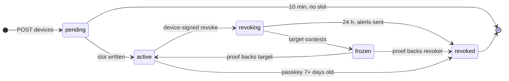

- **What to say:** when a revoke takes effect the vault is `rotation_due`: item writes get `409` until one `POST /v1/vault/rotate` call, conditional on `slots_version`, commits. A stale `key_version` on any later item or slot write also gets `409`. Rotation protects items added later. The revoked device already saw every secret, so the app lists the sites to re-key after a theft.

### D8. Escrow generation (inside the HSM cluster)

One live generation per user. Its state is the ordered tuple (generation, reset, slot), held by the cluster, never in our database. Each guess takes the next shared attempt slot, granted only by a majority. A right PIN resets it in the same majority update, and the recovering phone then registers generation g + 1, which retires g.
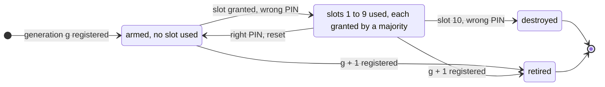

- **What to say:** nothing outside the cluster can hand back a slot. Five private counters would not be enough: a hostile relay could steer them apart and get 16 guesses, which is why a slot needs a majority grant. A database restore cannot, because the counter is not in the database. A resubmitted old blob cannot, because `sealed` binds `user_id` and the generation and a retired or destroyed generation never comes back. After `destroyed`, every device gets `escrow_destroyed`, every session is signed out, a password change is forced, and the next generation needs a new PIN, at most once per 30 days.

### D8. Recovery request

The start is recorded in HSM state, and the HSMs refuse attempts for 24 h, timed by each HSM's internal monotonic counter (a majority agrees), never by outside wall-clock time. Each request allows 5 PIN attempts, then needs a new start. Starts are capped at ~3 per account per 30 days [estimate], and the HSMs enforce a per-cluster token bucket at ~3,000 starts an hour (~1/s, about 3x the launch-week peak hour, against a baseline of ~1,800 a day). Above it, only starts backed by a passkey at least 7 days old are accepted, and a mass event needs a ceremony-approved raise. That same passkey is the only way to skip the wait.
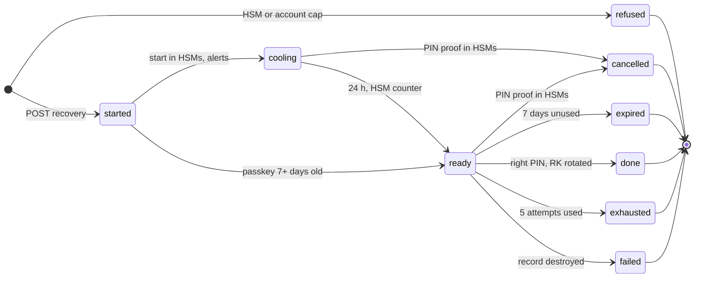

- **What to say:** the cooling-off is the cheapest defence in the design. It turns "the attacker owns the account" into "the attacker owns the account and the user ignored every device, the 30-day-old email and phone, and every PIN-attempt alert for 24 hours". A cancel is registered in the HSM cluster with a PIN proof (a wrong PIN there spends a try), and the cluster then refuses that start. An old-passkey cancel is enforced only by the Recovery service. Devices see a pending start within 12 h through the cluster heartbeat and their own Merkle proof. A `ready` request expires after 7 days [estimate], so a forgotten start is not a standing door. An `exhausted` request means a new start, a new 24 h wait and fresh alerts, so 10 wrong PINs take at least 48 h.

## D9. Deployment / topology

Three regions in one jurisdiction. Each Vault DB shard has a leader, a synchronous replica in a second region, and an async third copy. One escrow cluster is drawn: its 5 HSMs sit 2, 2 and 1 across the three regions, so losing any one region leaves 3 of 5 up.
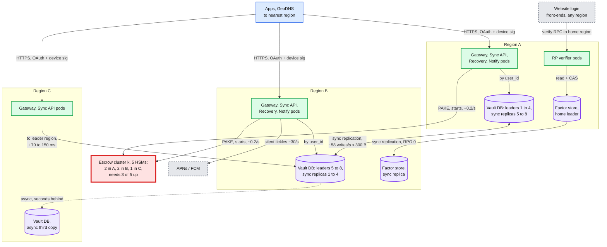

- **Crosses a region boundary:** vault replication (~17 KB/s average of ciphertext), factor-row replication (~80 CAS/s), HSM majority votes (~0.2 attempts/s, each a cross-region round), and sync calls from users far from their leader. **Never crosses anywhere:** a plaintext secret, the HSM cluster key, a PIN.
- **What to say:** a vault write pays one cross-region round trip (+70 to 150 ms on ~58 writes/s) to buy RPO 0. Nobody waits on a vault write, so this is cheap. The verifier's sync replica is the same trade on the login path, where p99 < 50 ms means a nearby region. A leader that loses its sync replica stops taking writes rather than run alone, or RPO 0 would quietly become false. Concept: [`replication-and-quorums`](../../concepts/replication-and-quorums.md).

## D10. Scaling / partitioning

Everything is keyed by `user_id`, and no query crosses users. The vault has no hot shard. The one hot thing is a single factor row under attack, and the 5-failure reset bounds it. The rigid partition is the escrow clusters.
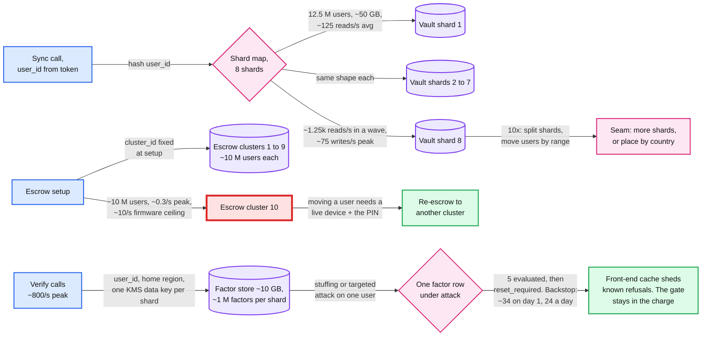

- **Why no hot vault shard:** a user's vault is capped at 1,000 items x 4 KB = 4 MB, and one user writes ~1.5 times a month. There is no celebrity, no shared item, no fan-out. 8 shards exist for placement and blast radius, not throughput: each serves ~125 reads/s against thousands it could. Concept: [`sharding`](../../concepts/sharding.md).
- **Factor store shards hold ~1 M factors each, one KMS data key per shard.** A per-row key would almost never be in cache, because users sign in about weekly. A stuffing wave of 1 M passwords in an hour is ~1,400 guesses/s for an hour, then nothing: every factor is in `reset_required`.
- **Why the escrow cluster is red here:** it is the only partition the operator cannot rebalance. The cluster key never leaves its HSMs, so moving a user means that user's live device runs a fresh escrow with the PIN. At 10x it is ~100 clusters, planned a year ahead. A cluster down to 2 of 5 up stops no-device recovery for ~10 M users until repaired.

## D11. Failure mode map

Component on the first edge, what fails in the box, blast radius on the second edge, mitigation last. Matches [`solution.md` §5.7](solution.md#57-what-fails-and-what-changes-at-10x), with the two escrow rows merged, the two RP rows merged, and a branch for lost or forged vault contents.
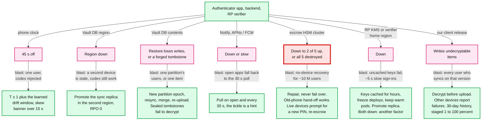

- **What to say:** no branch ends in "the user cannot see a code", because the code path has no server. The two widest blasts are our own client release (every syncing user) and an escrow cluster (~10 M users' last-resort path). The page fires at 4 of 5 up, while 3 of 5 still has a majority. "Never fail over" is the rule that surprises interviewers: a fresh cluster without the counters would refill every attacker's guesses.

## D12. Rollout / migration

From server-held keys ([§4.4](solution.md#44-back-up-and-sync-first-version-the-server-holds-the-keys)) to E2EE, per [§8](solution.md#8-staff-level-notes). Durations are [estimate]. Every phase before the shred ends in a flag-flip rollback, because the dual write keeps the server-readable copy current.
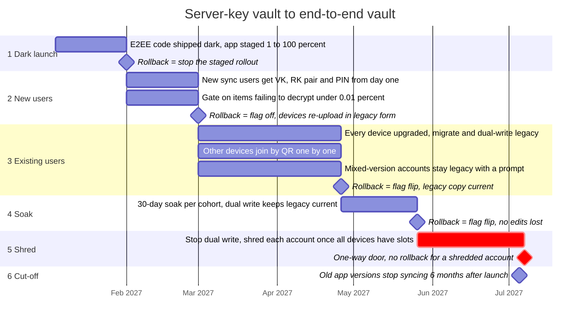

- **What to say:** the soak loses no edits on rollback because the client keeps writing the legacy copy. Other devices join by QR, one at a time, because fetching their keys from the server is the relay the design refused. Shredding is per account, and only once every device listed on the account has its own slot, so a device that never did its QR join is not silently stranded. Cohorts gate it: "items failing to decrypt", measured on the user's other devices, must have been zero for 30 days. After the flip the server refuses legacy plaintext writes, and old app versions stop syncing 6 months after launch [estimate].

## Trade-offs these diagrams make visible

- **No server on the code path (D1, D2).** Codes have 100% availability and zero QPS. We gave up any server-side view of code use: anomaly detection happens only at each website.
- **Sized by keys, not load (D2, D10).** ~400 GB and ~1k reads/s fit a handful of shards. The money and the risk sit in 50 HSMs that cannot be bought in a hurry.
- **Charge first, reset at 5 (D4, D6, D8).** Parallel guessing gets nothing, and a leaked password buys 5 guesses, not 100. The price: one more conditional write to refund a replay, and anyone with the password can force a password reset.
- **RPO 0 by synchronous cross-region replication (D9).** Every vault write pays +70 to 150 ms, which nobody notices at ~58/s. The epoch and the device as a second copy (D5) cover the double failure that still loses writes.
- **Repair, never fail over, for escrow (D9, D11).** Counters cannot fork, so a cluster down to 2 of 5 up means hours to days without no-device recovery for ~10 M users. Spreading HSMs 2, 2, 1 across regions buys region-loss survival for a cross-region round on each rare attempt.
- **One home row per factor (D5, D6, D9).** Exactly one of two racing codes wins, and the guess counter cannot double across regions. Travelers pay +70 to 150 ms. Both regions down means TOTP fails closed.
- **A hardware guess limit is also a kill switch (D5, D8).** 10 tries keeps a 6-digit PIN safe, and lets anyone who owns the account destroy the user's recovery on purpose. HSM-recorded starts, the 24 h wait and an alert per attempt make it loud, not impossible.
- **Crypto-shred as the one-way door (D12).** It is per account and late, and the dual write keeps us server-readable until then. E2EE coverage waits for the slowest device on each account.
