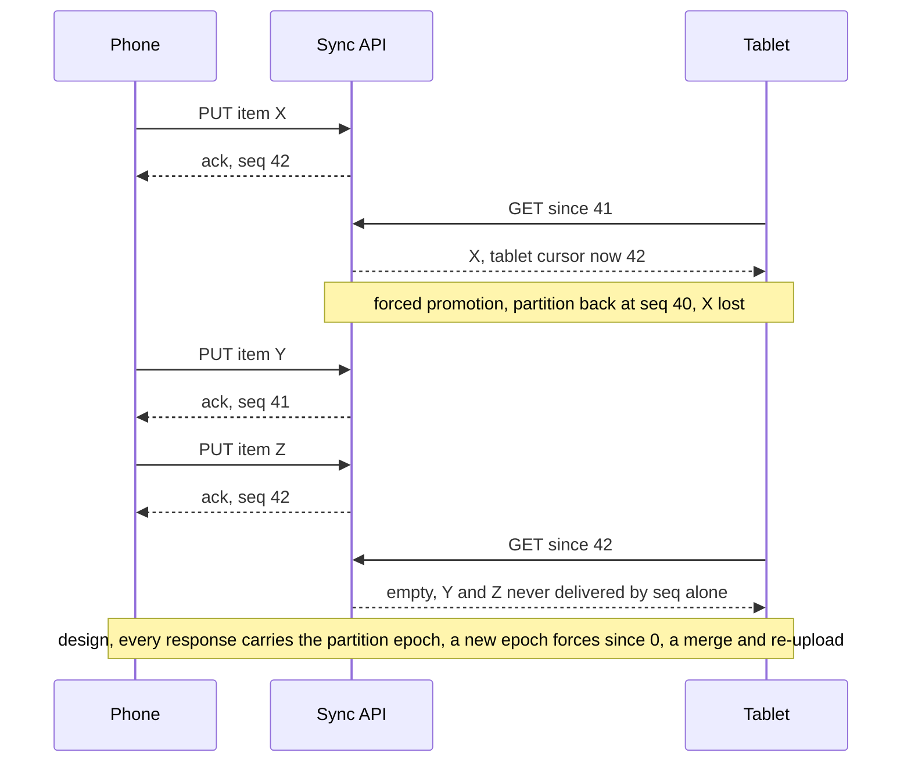
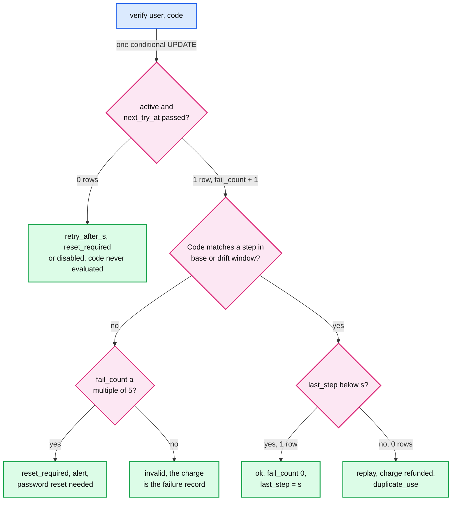
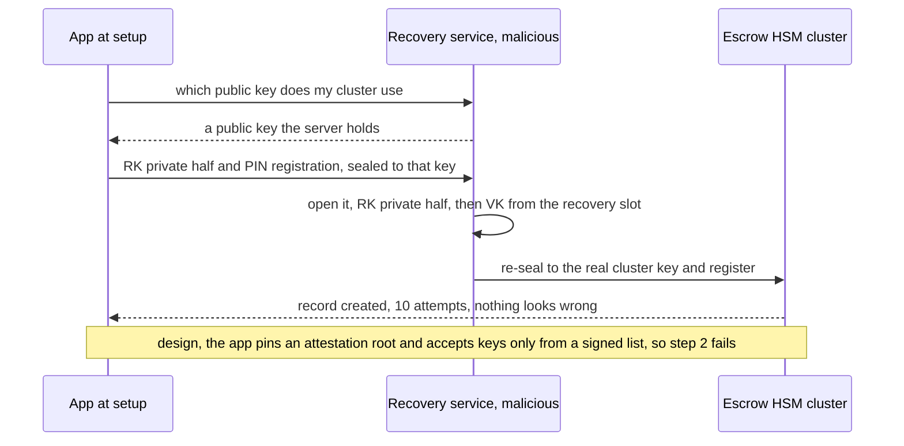

# Edge cases: Two-factor authenticator app (Google Authenticator)

Every entry is answerable in under 60 seconds out loud. Design reference: [`solution.md`](solution.md). "§" numbers point into it. Numbers come from [solution §2](solution.md#2-back-of-envelope) and the specs it cites, or are derived with the math shown, or are marked [estimate]. "(our addition)" marks a detail past what solution.md specifies. Every hole found while writing this file has since been fixed in solution.md, so the answers describe the fixed design and no entry is left as a gap. Longer answers: [TOTP and clock drift](deep-dives/totp-algorithm-and-clock-drift.md), [vault keys](deep-dives/vault-encryption-and-key-hierarchy.md), [recovery and HSM escrow](deep-dives/recovery-and-hsm-escrow.md), [multi-device sync](deep-dives/multi-device-sync-and-conflicts.md), [server-side verification](deep-dives/server-side-verification.md), [push and phishing](deep-dives/push-approval-and-phishing.md).

Acronyms used throughout: TOTP (time-based one-time password), HMAC (hash-based message authentication code), RP (relying party, the website), NIST (US National Institute of Standards and Technology), VK (vault key), RK (recovery key pair, X25519, public half in `VAULT.recovery_pub`), HSM (hardware security module), KMS (key management service), PAKE (password-authenticated key exchange), CAS (compare-and-set), AEAD (authenticated encryption with associated data), AAD (the associated data), MAC (message authentication code), HLC (hybrid logical clock), E2EE (end-to-end encryption), RPO (recovery point objective).

---

## Failure

## Edge case: the phone clock is 3 minutes off
- **Trigger:** the user turned off automatic time, or a carrier pushed a bad time. The phone runs 180 s fast.
- **Symptom:** every code is rejected at every website at once. Nothing is wrong on any server.
- **Answer:**
  - 180 s is 6 steps. The verifier checks `T ± 1` and `T + drift ± 1`, with drift learned only on success and capped at ±4 steps (120 s). A sudden 6-step jump matches neither window, so it is never learned (§5.3).
  - The fix is on the phone. Sync responses carry the server `Date`. Above 15 s of skew the app shows "Your phone's time is 3 min off. Turn on automatic date and time." We warn, we do not correct (Google 7.0 uses the OS time). Until then, a backup-code sign-in, after which the RP's explicit resync searches ±10 steps for two consecutive codes (§5.3).
  - Once fixed, codes work at once: the base window `T ± 1` is always checked, and every match stores `s - T`, so drift returns to 0 by itself. Leftover: for up to 2 min after a sign-in from a fast clock, corrected codes sit below `last_step` and are rejected as replays.
  - Those replays are refunded (§4.3), so retrying in those 2 minutes never pushes the user toward a forced password reset. The error says "wait for the next code".
- **Confidence:** [ ] shaky  [ ] ok  [ ] confident

## Edge case: the user loses the phone but still has the tablet
- **Trigger:** the phone is left in a taxi. The tablet is an active device with its own slot.
- **Symptom:** no lockout. The user wants the phone cut off and a new phone added.
- **Answer:**
  - Codes keep working on the tablet, offline. The tablet signs `DELETE /v1/devices/{id}`. A device-signed revoke takes effect after 24 h with alerts. If the target contests it, both devices freeze until the PIN or a passkey ≥ 7 days old decides. With such a passkey the revoke is immediate (§5.1).
  - When it takes effect the vault is `rotation_due` (item writes get `409`), and the tablet rotates in one call, `POST /v1/vault/rotate`: new VK', every item re-encrypted under the new `key_version`, VK' sealed to each device whose MAC under VK verifies and to `recovery_pub` after checking its MAC. One transaction, conditional on `slots_version`. No PIN and no HSM call.
  - The new phone joins by QR from the tablet (Flow 4). This is the 4 in 5 device changes that never touch escrow.
  - Rotation cannot undo what the phone already held. A locked phone with the app lock on is low risk: the chip will not open its slot. If it was unlocked, re-key the sites the app lists.
- **Confidence:** [ ] shaky  [ ] ok  [ ] confident

## Edge case: every device is lost and the user remembers the PIN
- **Trigger:** phone stolen, no tablet. A new phone, signed in to the account.
- **Symptom:** an empty app. `GET /v1/vault/changes?since=0` returns ciphertext and no slot for this device.
- **Answer:**
  - `POST /v1/recovery` alerts every channel. The start is also registered in the HSM cluster, which refuses attempts for 24 h by each HSM's internal monotonic counter, never an outside clock. Only a passkey or security key registered ≥ 7 days earlier skips the wait. One request allows 5 PIN attempts; more needs a new start and another 24 h (§5.2).
  - The PAKE binds the new device's public key. On a correct PIN the cluster resets the counter to 10 in the same majority update and returns the RK private half under the PAKE session key. The phone opens the recovery slot, writes its device slot, then rotates to a fresh RK pair: a new record generation retires the old one.
  - A dropped connection mid-attempt costs one attempt. The HSMs grant one shared attempt slot by majority (an HSM grants slot k only if its own is below k), committed before the PAKE's server message. A retry under the same attempt id with a different first message is rejected (§10.1, §10.5).
  - A crash after a correct PIN costs nothing: the counter is already back to 10 and the `ready` recovery lasts 7 days [estimate], so the app retries without a new wait. A crash before re-escrow leaves the old record live with 10 tries.
- **Confidence:** [ ] shaky  [ ] ok  [ ] confident

## Edge case: every device is lost and the PIN is forgotten
- **Trigger:** a recovery PIN set 3 years ago and rarely typed.
- **Symptom:** wrong PIN. Attempts left: 9, 8, 7.
- **Answer:**
  - We promised nothing here, on purpose (§1). The 10th wrong PIN destroys the record. The user falls back to each website's backup codes or account recovery, ~8 sites.
  - Keep the vault ciphertext (our addition). An old phone in a drawer still holds VK and restores everything. So does the optional 24-word code, which never touches an HSM.
  - Attempts come 5 per request, so the 10th wrong PIN lands ≥ 48 h after the first: time to find the PIN written down. Show attempts left and suggest stopping at 3 (our addition). A correct PIN later resets the counter to 10.
  - Prevention is in the design: the app asks for the PIN a few times in the first month, then rarely, and lets the user change it from any device (§5.2).
- **Confidence:** [ ] shaky  [ ] ok  [ ] confident

## Edge case: an escrow HSM cluster drops to 3 of 5 up, then 2 of 5 up, then is destroyed
- **Trigger:** two HSMs fail in one cluster. Then a third. Later, a fire takes all five and the key copies.
- **Symptom:** 3 of 5 up: still working, no margin. 2 of 5 up: recoveries for its ~10 M users return "try later".
- **Answer:**
  - Majority is 3 ([`../../concepts/replication-and-quorums.md`](../../concepts/replication-and-quorums.md)). The page fired at 4 of 5 up. At 2 of 5 up nothing is lost, users wait, and QR hand-off still works. Repair, never "fail over to a fresh cluster": it would refill every counter to 10 (§10.4).
  - Placement: 2 + 2 + 1 across 3 regions in one jurisdiction, so losing any one region still leaves a majority (§10.1).
  - Destroyed: live devices ask the user to set the PIN again on next open, because registration needs the PIN and holding VK is not enough (§5.7). ~30% of 10 M users open daily: ~35 registrations/s spread over the other 9 clusters, ~4/s each against a ~10/s ceiling.
  - Users with no device during the outage lose no-device recovery until they get a device back.
- **Confidence:** [ ] shaky  [ ] ok  [ ] confident

## Edge case: KMS is down at the RP
- **Trigger:** the RP's KMS returns errors for 30 minutes.
- **Symptom:** KMS error rate pages. Sign-ins carry on.
- **Answer:**
  - One data key per shard of ~1 M factors, unwrapped once and cached for hours (§5.4). A running verifier never calls KMS on the request path. A per-row key would almost never be cached, since users sign in about weekly.
  - The exposure is a verifier that starts during the outage: a deploy, a crash restart, or autoscaling during a stuffing wave. So while KMS is down, deploys and scale-in freeze, and warm pods cover the peak (§5.7).
  - Cold anyway: fail closed for TOTP and offer another factor. Never accept a code we cannot check.
- **Confidence:** [ ] shaky  [ ] ok  [ ] confident

## Edge case: APNs or FCM is down for hours
- **Trigger:** Apple Push Notification service (APNs) or Firebase Cloud Messaging (FCM) drops or delays pushes.
- **Symptom:** the tablet, open on the desk, takes up to 30 s instead of p95 10 s to show the phone's new account. Nothing else.
- **Answer:**
  - Codes have no server path. Push is only a hint, never guaranteed even on a good day. Freshness is promised only while the app is open, and the 30 s foreground poll covers that; a closed app catches up on next open ([`../../concepts/realtime-client-server-communication.md`](../../concepts/realtime-client-server-communication.md)).
  - `recovery_started` also goes by email and SMS, to the contacts on file 30 days ago, and devices read the HSM-signed record status at least every 12 h by background refresh. Hours of push outage fit inside the 24 h wait. Our addition: if no channel confirmed delivery, extend `not_before`.
  - Push approval, if built (§5.6): the app pulls pending requests on open, and the login page always offers "enter a code instead".
- **Confidence:** [ ] shaky  [ ] ok  [ ] confident

---

## Consistency

## Edge case: the same code arrives twice: two tabs, or a shoulder-surfer 20 s later from another country
- **Trigger:** the user submits in two tabs. Or someone reads the code over a shoulder and, holding the password, submits it 20 s later from abroad.
- **Symptom:** two verifies of one code inside its ~90 s life.
- **Answer:**
  - Both are charged first. Then `UPDATE ... SET last_step = s WHERE last_step < s`: one updates 1 row, the other 0. The 0 is a replay: rejected, refunded (`fail_count - 1`, `state` restored), `duplicate_use` emitted. Both calls go to the factor's home region, so two regions cannot both win (§4.3, [`../../concepts/exactly-once.md`](../../concepts/exactly-once.md)).
  - Two tabs: same IP and device, so no alert (§4.3). The tab says "code already used, wait for the next one".
  - From another country it is a real signal: someone abroad has the password. Alert, and force a password reset (our addition).
  - If the thief is first (a live relay), the user's submission is the duplicate. TOTP cannot stop that. NIST: "OTP authentication is not phishing-resistant", which is why the RP verifier offers passkeys now (§5.6).
- **Confidence:** [ ] shaky  [ ] ok  [ ] confident

## Edge case: the user travels mid sign-in, or the home region fails
- **Trigger:** the user lands in another region between password and code. Or the factor's home region dies, or loses its link to its synchronous replica.
- **Symptom:** +70 to 150 ms. Or a few seconds of retries.
- **Answer:**
  - Any login front-end sends the verify remote procedure call (RPC) to the home region: p99 < 200 ms cross-region. One copy decides `last_step` and `fail_count` (§5.4).
  - Region dies: the controller promotes the synchronous replica in ~5 s, with every committed `last_step`. RPO 0, so no replay window opens (§10.4). If the region committed a success and died before answering, the front-end's retry finds its own `last_verify_id` and gets `ok`, not "replay".
  - Replica link drops: the leader stops accepting writes until a new replica is in sync or it is fenced and replaced. Carrying on alone would make RPO 0 false and a later failover would reopen ~90 s of replay ([`../../concepts/leases-fencing-clocks.md`](../../concepts/leases-fencing-clocks.md)).
  - Both regions down: fail closed for TOTP. Backup codes share the partition, so they are down too. Push may share the RP's request store and be down as well; a passkey clearly survives.
- **Confidence:** [ ] shaky  [ ] ok  [ ] confident

## Edge case: a failover loses acknowledged vault writes
- **Trigger:** the leader and its sync replica are both lost, or an operator restores from backup. The partition comes back at `seq` 40 after devices were told 42.
- **Symptom:** an item added on the phone is missing on the tablet.
- **Answer:**
  - `seq` alone cannot detect it, because `seq` numbers are reused. Writes after the failover take 41 and 42 again. A tablet that saw 42 asks `since=42` and misses them forever (diagram).
  - An epoch, a generation of the whole partition, changes on every restore or forced promotion and comes back on every response. A new epoch means a full resync, a merge of every local item with the server copy by HLC, and a re-upload wherever the merge differs, not only at an older `rev`: a lost write can be overtaken by a different write with the same `rev`. The device is the second copy (§5.5). Same idea as Kafka's leader epoch.
  - It pages: any epoch change outside a planned restore means acknowledged writes were lost.
- **Diagram:**

- **Confidence:** [ ] shaky  [ ] ok  [ ] confident

## Edge case: two devices add the same QR while offline, or one deletes while the other rescans
- **Trigger:** the user scans one QR with the phone and the tablet, both in airplane mode. Or the phone deletes the item while the offline tablet rescans the QR.
- **Symptom:** two writes to one item, not two items.
- **Answer:**
  - `item_id = HMAC(id_key, secret ‖ algorithm ‖ digits ‖ period)`, with `id_key` in the vault and never rotated. The same QR always gives the same `item_id`, so a second scan is a write to the same item, and a rescan after a delete is a restore (§5.5, [`../../concepts/crdt.md`](../../concepts/crdt.md)).
  - The second device's `PUT` gets `409`. It merges field by field by HLC, finds the same secret, and writes only a label it changed. `deleted` is just another field: the later of delete and rescan wins by HLC.
  - Why not a random UUID plus "tombstone the newer duplicate": one device deletes while another, offline, rescans, and both copies are lost. Over 2,000 simulated schedules the first design lost 950 secrets; with this rule, the HLC merge and pinned tombstones, none.
- **Confidence:** [ ] shaky  [ ] ok  [ ] confident

## Edge case: two devices edit one item and both send rev 4
- **Trigger:** the phone and the tablet rename item A from `rev` 3. Both send `base_rev 3, rev 4`. The phone's lands first.
- **Symptom:** none visible, which is the danger.
- **Answer:**
  - The `PUT` is idempotent on `(item_id, rev, hash(ct))` (§3.2). The phone's retry after a timeout matches exactly and gets the same `seq`.
  - The tablet's write has the same `rev` and different ciphertext, so it gets `409 {current}`, never a fake `200`. The tablet merges per field by HLC and sends `rev` 5. `rev` only gates concurrency; it never chooses content (§5.5).
  - Order of checks: the idempotency lookup may short-circuit only an exact repeat, never the `base_rev` check.
- **Confidence:** [ ] shaky  [ ] ok  [ ] confident

## Edge case: key rotation after a revoke crashes, races, or never runs
- **Trigger:** the tablet is killed mid-rotation. Or two devices rotate at once. Or the revoke takes effect while every other device sits closed.
- **Symptom:** items under two keys, two competing VK' values, or a vault still under the key the revoked phone knows.
- **Answer:**
  - Rotation is one call, `POST /v1/vault/rotate`, one transaction conditional on `slots_version` (§5.1). A crash before commit changes nothing. The loser of a race gets `409`, discards its VK' and opens the winner's slot.
  - `key_version` is in each item's AAD, each `PUT` and each slot `PUT`, and the client tries exactly the key it names. A device that missed the rotation gets `409`, opens its new slot and re-encrypts. It can never add items under the key the revoked phone holds.
  - Revoke and rotate are separate steps, and a device-signed revoke lands 24 h later. When it takes effect the vault is `rotation_due`: item writes get `409` until a rotation commits, so nothing new lands under the old VK while devices sit closed.
- **Confidence:** [ ] shaky  [ ] ok  [ ] confident

## Edge case: a device comes back after 45 days offline, or after 100
- **Trigger:** a tablet in a drawer for 45 days, past the 30-day tombstone age. Or for 100 days.
- **Symptom:** has the server purged deletes the tablet never saw?
- **Answer:**
  - Not at 45 days. Tombstones are pinned: purged only when ≥ 30 days old **and** every active device's acknowledged `since` is past them. The tablet gets a normal delta with every delete, merged by HLC (§5.5).
  - Why pinned: without it a device cannot tell a purged delete from a lost write or a write whose `200` was lost, so it resurrects deletes or drops restores. In the sync simulator this fix plus the HMAC `item_id` and the HLC merge took 899 broken schedules of 2,000 down to 0.
  - At 100 days: a device unseen for 90 days stops pinning and only such a device gets `410 Gone`. Full resync, merge by HLC, local items the server lacks to the local trash for 30 days, offline edits uploaded with `base_rev` = the server's `rev`.
- **Confidence:** [ ] shaky  [ ] ok  [ ] confident

---

## Scale

## Edge case: a 10x day: iPhone launch week, a restore spike
- **Trigger:** a flagship launch takes device changes from ~91k a day to ~910k.
- **Symptom:** ~10.5 device changes/s on average, more in the peak hour.
- **Answer:**
  - 4 in 5 use QR hand-off: no HSM, one slot write, one ~4 KB download. 1 in 5 [estimate] need escrow: ~2/s, ~0.2/s per cluster against a ~10/s firmware ceiling per cluster (§2).
  - The local vault is excluded from OS backups, so every phone restored from an iCloud or Google backup opens the app empty. The app must lead with "scan from your old phone", not "restore with PIN" (our addition). Each user pushed to the PIN path loads the one tier we cannot grow and spends attempts on a PIN they may not remember.
  - The real costs: ~910k `device_added` alerts and support for forgotten PINs.
- **Confidence:** [ ] shaky  [ ] ok  [ ] confident

## Edge case: a credential-stuffing wave with 1 M valid passwords
- **Trigger:** an attacker holds 1 M working passwords for one RP with 50 M TOTP users, and tries them all within an hour.
- **Symptom:** "verify success rate down > 20% in 5 min" pages identity. 1 M accounts go to `reset_required`.
- **Answer:**
  - Each password buys 5 charged guesses, then `reset_required`: no more codes until the password is reset through the account's recovery. 1 M x 5 x 3 / 10^6 = ~15 takeovers, against ~300 if all 100 backstop tries were allowed (§5.4). Factors with learned drift check 6 codes: 3 x 10^-5 per password.
  - Load: 1 M x 5 in an hour is ~1,400 guesses/s for an hour on top of ~800/s peak, then nothing. One row and one conditional write each.
  - The real load is people (our addition): 1 M reset emails and alerts in an hour. Warn the email and SMS providers and queue sends with priority by account value.
  - An attacker who also owns the mailbox cannot loop "reset, 5 guesses": a password reset sets `state = active` but keeps `fail_count` and `next_try_at`. Only a correct code or a backup code clears them, so the backoff and the 100 cap still bind: ≤ 3 x 10^-4.
- **Confidence:** [ ] shaky  [ ] ok  [ ] confident

## Edge case: sync comes back after a 1 hour outage
- **Trigger:** the Vault DB region was down 1 h. Every app that opened in that hour retries.
- **Symptom:** a reconnect wave of ~10k/s, 10x the average.
- **Answer:**
  - Codes never noticed. Writes waited in client queues: 1 h x ~58/s = ~210k writes to replay, each idempotent on `(item_id, rev, hash(ct))`.
  - ~10 Sync API pods at ~1k/s each [estimate] are at their limit. `Retry-After` with jitter spreads the wave over minutes. A per-user `VAULT.seq` and epoch cache answers "nothing new" without the Vault DB (our addition). Most polls are empty, ~200 B ([`../../concepts/rate-limiting-and-load-shedding.md`](../../concepts/rate-limiting-and-load-shedding.md)).
  - The outbox drains the hour's tickles. A duplicate costs one extra `GET`.
- **Confidence:** [ ] shaky  [ ] ok  [ ] confident

## Edge case: a user with 600 accounts
- **Trigger:** an administrator with 600 TOTP items.
- **Symptom:** is anything slow or over a limit?
- **Answer:**
  - 600 x ~300 B = ~180 KB, ~230 KB padded to the next 128 B boundary. Under the 1,000-item cap. A full resync pages at 100 items (our addition).
  - Codes: 600 HMACs every 30 s is microseconds. The UI computes visible rows only and needs search.
  - Rotation is one `POST /v1/vault/rotate` carrying ~180 KB in one transaction. At the caps (1,000 x 4 KB) it is ~4 MB, still one call.
  - Abuse ceiling: 4 MB per vault is ~1,000x the ~4 KB average.
- **Confidence:** [ ] shaky  [ ] ok  [ ] confident

## Edge case: 10x users, and 3 years of growth
- **Trigger:** 1 B users with sync.
- **Symptom:** which line grows first?
- **Answer:**
  - Vault: ~4 TB, ~10k sync reads/s average, ~100k/s in a reconnect wave. More shards, same design. Per user it does not grow: item history expires after 30 days, tombstones after 30 days once every active device has seen them ([`../../concepts/sharding.md`](../../concepts/sharding.md)).
  - Escrow: ~100 clusters of ~10 M users, ~$10 M to $20 M of hardware [estimate, 10x §2]. Procurement plus a ceremony per cluster: plan a year ahead. This is the line that actually grows (§5.7).
  - Factor store at each RP: ~10 GB per 50 M users. Security events grow with time: keep 1 year (our addition).
- **Confidence:** [ ] shaky  [ ] ok  [ ] confident

## Edge case: someone who controls our Recovery service sweeps every escrow record
- **Trigger:** an insider, or a compromised Recovery service, drives PAKE attempts for every user. Or an attacker with 10k compromised accounts in one cluster.
- **Symptom:** recovery attempts and destroyed records spike.
- **Answer:**
  - What holds, in hardware: 10 tries per record; starts registered in cluster state and attempts refused for 24 h by the HSMs' own monotonic counters; 5 attempts per start, so all 10 take two starts and ≥ 48 h; a ceiling of ~10 attempts/s per cluster. Clusters in parallel, all 10 guesses on all 100 M users takes ~116 days, and it destroys every record it misses (§5.2).
  - Detection does not trust our software: about once a minute each cluster signs a heartbeat, the root of its record-state tree plus an increasing sequence number. Devices fetch it with a Merkle proof for their own record on open and at least every 12 h, and check the sequence advances. An insider's direct start is seen before its 24 h wait ends. 24 h with no fresh heartbeat is itself an alert ([`../../concepts/merkle-tree.md`](../../concepts/merkle-tree.md)).
  - Odds are not the defense. Uniform PINs: 10 / 10^6. Real ones: 10 guesses open 6.23% of first-choice 6-digit PINs (Markert et al., IEEE S&P 2020, [paper](https://arxiv.org/abs/2003.04868)). With a ~1,000 to 3,000-PIN blocklist, ~1% to 10% per record [estimate]. A sweep that ran would open ~1% to 10% of 100 M vaults, so what binds is the HSM start cap plus staged attempts, and that it cannot run quietly.
  - The ceiling is a shared budget: 10k compromised accounts x 10 attempts would be ~2.8 h of one cluster. So the HSMs enforce a start cap, a token bucket at ~3,000 starts an hour per cluster (~3x the launch-week peak hour, baseline ~1,800 a day). Above it only starts backed by a passkey ≥ 7 days old pass. A mass event needs a ceremony-approved raise (§5.2).
- **Confidence:** [ ] shaky  [ ] ok  [ ] confident

---

## Data

## Edge case: daylight saving time ends, or the user flies to another time zone
- **Trigger:** clocks go back an hour at 2 am. Or the phone switches from India time to London time.
- **Symptom:** none, and the interviewer wants to know why.
- **Answer:**
  - TOTP uses `T = floor(unix_time / 30)`. Unix time counts seconds since 1970-01-01 in Coordinated Universal Time (UTC): no zone, no daylight saving. A zone change moves the wall clock on screen, not the epoch, on the phone and at the verifier.
  - The real trap: automatic time off, local time typed with the wrong zone set. The epoch is then off by whole hours, e.g. 5 h 30 min = 660 steps. Every code fails, and the banner's "5 h 30 min off" points at the zone.
  - Leap seconds: Unix time repeats one second. Under 1 s, inside one 30 s step.
- **Confidence:** [ ] shaky  [ ] ok  [ ] confident

## Edge case: the QR asks for SHA-256, 8 digits or an 80-bit secret, or is hostile
- **Trigger:** `otpauth://...&algorithm=SHA256&digits=8`, a 16-character base32 secret (80 bits), or `period=0`, `digits=12`, a 1 MB secret, control characters in the label.
- **Symptom:** an app that ignores parameters shows wrong codes. A naive parser crashes.
- **Answer:**
  - We honor `algorithm`, `digits` and `period`. An app that ignores them (the Key URI wiki warns some do) fails the first-code confirm. The factor stays `pending` and expires in 15 min. Nothing is switched on: that is why confirm exists. Our RP issues SHA1, 6, 30 s anyway.
  - 80 bits is under RFC 4226's 128 and NIST's 112. We accept ≥ 80 when scanning, since many sites issue it, and refuse less. Brute-forcing 2^80 from observed codes: ~38,000 years at 10^12 HMACs/s. We issue 160.
  - Hostile values (our addition): whitelist the algorithm, digits 6 to 8, period 15 to 120 s, secret 80 to 512 bits, and strip control and bidirectional characters. Parse and compute per item, so one bad item never blanks the list.
- **Confidence:** [ ] shaky  [ ] ok  [ ] confident

## Edge case: the user re-enrolls at a site: two items, different secrets, same label
- **Trigger:** the user reset 2FA at GitHub. The app now holds two "GitHub: alice" items.
- **Symptom:** two codes. One works.
- **Answer:**
  - Never merge different secrets (§5.5). Only the site knows which is live. Keep both, mark the older "possibly replaced".
  - The old item's codes would be wrong codes, and 5 of them would force a password reset. So the RP keeps the previous secret for 30 days (`FACTOR.prev_secret_ct`, never accepted). A code matching it is refunded like a replay and answered "this code is from your old authenticator entry" (§3.3).
  - Re-enrolling needs a fresh sign-in at the highest assurance the account has, plus a notification (NIST SP 800-63B-4 §4.1.2.1), so a stolen session cookie cannot swap in the attacker's secret (§3.2).
  - Our addition: once the newer item has worked for a week, the app asks "Delete the older GitHub item?". Deletes go to the 30-day trash. A QR scanned but never confirmed (expired after 15 min) gets the same treatment.
- **Confidence:** [ ] shaky  [ ] ok  [ ] confident

## Edge case: the item format changes and the server cannot read items
- **Trigger:** a new field (icon, notes) or a new item type (a passkey, §10.11).
- **Symptom:** the server cannot migrate ciphertext. Old clients rewrite items they do not fully understand.
- **Answer:**
  - All migration is client-side. Each plaintext item carries a format version. Readers ignore unknown fields and writers carry them through on rewrite. Otherwise an old client's rename deletes the new field (our addition).
  - New types on old clients: shown as "update the app", never edited, deduplicated or deleted by merge rules. A plaintext `min_client_version` per item lets the server refuse writes from older apps. It leaks only that a newer type exists (our addition).
  - Envelope changes (a new AAD field, as `key_version` was) roll out lazily: re-seal on the next write, tracked by a plaintext `format` column.
- **Confidence:** [ ] shaky  [ ] ok  [ ] confident

## Edge case: the Vault DB is restored from a week-old backup
- **Trigger:** an operator restores a vault partition from last week's snapshot.
- **Symptom:** `seq`, `slots_version` and the device list all go back a week. A phone revoked this week is `active` again.
- **Answer:**
  - Items: a new partition epoch, so devices resync, merge by HLC and re-upload wherever the merge differs (§5.5). Counters live in the clusters, so no attacker gets PIN guesses back.
  - Escrow: last week's `ESCROW_RECORD.sealed` is refused. The cluster keeps one live generation per user and `sealed` binds it (§5.2).
  - Devices: the revoked phone's entry carries a MAC under an old `key_version`, so no device seals a new key to it (§5.1).
  - Keys: the restored server is back at an old `key_version`. Devices remember the highest `key_version` they saw and reject anything below it. On a new epoch with a regressed `key_version` they re-run `POST /v1/vault/rotate`, re-applying the revokes they know, before re-uploading.
- **Confidence:** [ ] shaky  [ ] ok  [ ] confident

## Edge case: the RP's factor table leaks
- **Trigger:** a dump of the RP's `FACTOR` table from a backup bucket.
- **Symptom:** 50 M TOTP secrets, encrypted.
- **Answer:**
  - A TOTP secret cannot be hashed: the verifier must run HMAC with it. The dump alone is ciphertext under ~50 shard keys, which KMS wraps in another trust domain, sealed with `user_id ‖ factor_id` as associated data, so even write access to the table cannot move an attacker's secret into a victim's row. With KMS access too, it is every user's second factor until each re-enrolls (§5.4).
  - If KMS was reached: mark factors "re-enroll required". Next sign-in: password plus current code, then a new secret. The attacker also needs each password. High-value RPs compute the HMAC inside an HSM, so no process ever holds a secret.
  - Our side is untouched: our vault holds only ciphertext under keys we never had. Detection (our addition): a few canary factors nobody uses. Any correct code for one means the table is out.
- **Confidence:** [ ] shaky  [ ] ok  [ ] confident

## Edge case: a GDPR delete of the vault
- **Trigger:** the user asks for erasure under the General Data Protection Regulation (GDPR).
- **Symptom:** data sits in `VAULT`, `VAULT_ITEM` with 30 days of history, `DEVICE`, `ESCROW_RECORD`, `SECURITY_EVENT`, the cluster's state, and backups.
- **Answer:**
  - Delete one `user_id` partition and ask the cluster to mark the live record generation destroyed. Local vaults on the user's devices stay with the user, who decides (our addition).
  - Backups are nearly free: every item is ciphertext under a VK we never held. Once the record is destroyed inside the HSM and the slots are gone, a backup copy is unreadable by anyone. E2EE gives crypto-shredding for free.
  - Abuse (our addition): a thief with an unlocked phone or the account can ask too. Erasure waits 7 days with alerts and a cancel link, or runs at once with a passkey ≥ 7 days old.
- **Confidence:** [ ] shaky  [ ] ok  [ ] confident

---

## Operations

## Edge case: what pages at 3 am, and what only tickets
- **Trigger:** n/a.
- **Symptom:** on-call needs a short list.
- **Answer:**
  - Page (§8, §10.9): an escrow cluster down to 4 of 5 up; items failing to decrypt above 0.01% of syncs on users' other devices (also halts the rollout); any epoch change outside a planned restore; verify success down > 20% in 5 min for one RP; KMS errors at the verifier.
  - Add (our addition): recovery attempts per cluster near the ~10/s ceiling; `recovery_started` delivery p95 > 5 min, because the 24 h wait is only as good as the alert; verifier nodes self-fenced for clock offset.
  - Ticket: recovery cancellations above baseline; skew-banner rate (a carrier with bad time).
  - Service level objectives behind them: verify 99.99%, p99 < 50 ms; sync 99.9%; right-PIN recovery within 5 s of `not_before` 99.9%.
- **Confidence:** [ ] shaky  [ ] ok  [ ] confident

## Edge case: a bad app release writes undecryptable items
- **Trigger:** a release seals items under the wrong key.
- **Symptom:** other devices show "1 item could not be opened".
- **Answer:**
  - The self-check (decrypt before upload) runs in the same buggy build, so it can pass. The real gate is "items failing to decrypt" measured on the user's other devices, which run the previous version: an independent check (§5.5).
  - Staged rollout 1%, 10%, 50%, 100%. At ~58 writes/s a 1% stage writes ~50k items a day, so hours at 1% show the signal.
  - Repair: `GET /v1/vault/items/{id}/history` returns 30 days of revisions. The server cannot tell good ciphertext from bad, so the fixed client walks back until a revision opens and writes it as a new `rev`.
- **Confidence:** [ ] shaky  [ ] ok  [ ] confident

## Edge case: the E2EE migration meets a user with one old-version device
- **Trigger:** the phone updated, but a 2019 tablet cannot install the new version.
- **Symptom:** the account stays in legacy, server-readable mode, because §8 migrates only when every device runs the new version.
- **Answer:**
  - After 6 months [estimate] the old version stops syncing. The tablet keeps its local codes and gets an update prompt. Once the vault flips to `e2ee = true`, the server refuses legacy plaintext `PUT`s, so no old client writes a readable item into an E2EE vault.
  - During the 30-day soak the client dual-writes the legacy copy, so rollback is a flag flip with no lost edits. Other devices join by QR one by one, never by keys relayed through us (§8).
  - Crypto-shred is per account, and only once every listed device has its own slot. A new-version device that never did its QR join is prompted first, instead of silently losing sync at the shred.
- **Confidence:** [ ] shaky  [ ] ok  [ ] confident

## Edge case: a verifier node's clock jumps 60 seconds
- **Trigger:** Network Time Protocol (NTP) sync breaks on one verifier host.
- **Symptom:** without a guard, sign-ins through that host fail for users whose phones are right.
- **Answer:**
  - 60 s is 2 steps. The node's base window T+2 ± 1 misses the phone's T. Every attempt is charged, and 5 in a row set `reset_required`: honest users forced into password resets by our clock.
  - So a node whose offset exceeds 1 s takes itself out of service (§5.3). A bad shared time source would fool every node at once, so verifiers take time from 3 or more independent sources and the success write refuses `s > T_db + 4` against the database's clock. Page on any self-fenced node ([`../../concepts/leases-fencing-clocks.md`](../../concepts/leases-fencing-clocks.md)).
  - Clean-up (our addition): failures charged by a node in the minutes before it fenced are known by node id and time. Clear those `reset_required` flags and alerts.
- **Confidence:** [ ] shaky  [ ] ok  [ ] confident

## Edge case: a vulnerability is found in the HSM firmware
- **Trigger:** a published flaw in the escrow HSMs' firmware.
- **Symptom:** we cannot patch: the firmware-update credentials were destroyed by design (§10.1).
- **Answer:**
  - That is the trade: nobody can change the 10-try rule, including us, including to fix it.
  - Response: a new cluster generation with fixed firmware (procurement plus ceremony, weeks). Live devices re-escrow to it with a PIN prompt, in waves to stay under ~10/s per cluster: 10 new clusters take ~8.6 M a day, ~12 days for 100 M [estimate].
  - Users with no live device stay on the old cluster until their next recovery re-escrows them. Meanwhile only the Recovery service can reach the old HSMs. Retire the old cluster (destroy its keys) when few records remain.
- **Confidence:** [ ] shaky  [ ] ok  [ ] confident

## Edge case: support ticket, "I am locked out of the account that holds my vault"
- **Trigger:** the app was the only second factor for the account that stores its own vault, and the phone is gone (the circular dependency, §4.5).
- **Symptom:** the user cannot sign in, so cannot start recovery.
- **Answer:**
  - Prevented at sync turn-on: sync requires a second way in that does not live in this vault: a passkey, a security key, or sign-in prompts on another device that does not hold this vault. A passkey stored in this vault does not count (§5.2, §10.11).
  - Hole (our addition): the second way must still exist years later. The app re-checks it and nags if it was removed.
  - Support has no override by design: no tool reads a vault, grants extra PIN attempts, resets a counter or skips the 24 h. Help desks are the social-engineering target (MGM, 2023), so that path is refused outright. Support routes the user into account recovery, which ends at the same PIN path.
- **Confidence:** [ ] shaky  [ ] ok  [ ] confident

## Edge case: we ship push approval, and attackers start prompt bombing
- **Trigger:** the §5.6 mutation goes live for our own accounts (other sites would call push-auth as an API, the Duo and Microsoft model). An attacker with the password sends prompt after prompt at 2 am (push fatigue).
- **Symptom:** a tired user taps Approve (Uber, September 2022).
- **Answer:**
  - Number matching on day one: the user types the 2-digit number from the login screen, so a blind tap approves nothing. Microsoft made it mandatory for Authenticator push from May 2023. A visible alert push expires with the 60 s request, one collapse id per user, so a burst shows one prompt (§5.6).
  - At most 3 prompts per 10 min. Denials, "not me", a wrong number and unanswered expiries count toward a 1 h block with an alert. 2 unapproved requests in an hour force a password change. The login page always offers "enter a code instead".
  - Persistence: enrolling push needs a fresh sign-in, alerts every device and is held 24 h with a cancel. The signing key is biometric-only and dies with the vault device's revoke.
  - None of it stops a relay: NIST §3.2.5 says manual entry, a typed number included, is never phishing-resistant. So the RP verifier offers passkeys now (§2.2.2).
- **Confidence:** [ ] shaky  [ ] ok  [ ] confident

---

## Security / abuse

## Edge case: an attacker with the password scripts TOTP guesses
- **Trigger:** a bot with the right password submits codes as fast as the verifier allows, 10,000 at once if it can.
- **Symptom:** the 5th failure alerts the user and sets `reset_required`.
- **Answer:**
  - Counted per factor, never per IP (RFC 4226 §7.3). Each attempt is charged by one conditional `UPDATE` before the code is looked at. Parallel requests serialize on the row, so 10,000 at once get 5 evaluations, not 10,000 (3% odds) (§4.3). The login front-end caches `state` and `next_try_at` briefly and sheds what it knows the row will refuse, so the hot row is not hammered.
  - Every 5th consecutive failure (5, 10, 15) sets `reset_required` inside the same charge: no more codes until a password reset. 5 x 3 / 10^6 = 1.5 x 10^-5 per leaked password, 3 x 10^-5 with learned drift. A patient bot that guesses 4 a day between the user's daily sign-ins never hits 5 in a row, so `unknown_fail_30d` also counts failures from browsers that never passed 2FA, which a success does not clear; 5 of those set `reset_required` too (§5.4).
  - Backstop for RPs that cannot force a reset: 30 s doubling to 1 h, disabled at 100. ~34 guesses on day 1, 24 a day after, the cap at ~89 h. ≤ 3 x 10^-4 ([`../../concepts/rate-limiting-and-load-shedding.md`](../../concepts/rate-limiting-and-load-shedding.md)).
  - A password reset keeps `fail_count` and `next_try_at`, so an attacker who owns the mailbox gets no fresh budget per reset. Only a correct code or a backup code clears them.
- **Diagram:**

- **Confidence:** [ ] shaky  [ ] ok  [ ] confident

## Edge case: an attacker burns guesses to lock the user out on purpose
- **Trigger:** someone with the password wants the user locked out, not in.
- **Symptom:** 5 wrong codes, `reset_required`. The real user's next sign-in demands a password reset.
- **Answer:**
  - Self-service by design: the real user resets the password through the account's recovery and is back in, and the attacker's credential dies. "Lock the factor after 5" was rejected because the user could not undo it (§5.4).
  - Backup codes are no side door: slow hash under one per-user salt (one hash per guess), with their own small budget (backoff after 10 failures), so typos on paper never push a phone-less user into a password reset (§4.1).
  - Backstop RPs (no forced reset): disabled at 100 on day 4. Without more, a script takes every backoff slot the moment `next_try_at` passes and owns them from ~2 h in. So a browser that already passed 2FA (a remembered-device cookie the attacker lacks) gets its own small budget (§5.4).
  - Honest replays (two tabs, a double-click, the 2 min after a clock fix) are refunded and never count toward 5. So are codes from the old item after a re-enroll (the re-enroll entry).
- **Confidence:** [ ] shaky  [ ] ok  [ ] confident

## Edge case: an attacker owns the account and the SIM, and starts a restore
- **Trigger:** a phished password plus a SIM swap to beat SMS 2-step verification. The user still has the phone. (Retool, 2023, against the server-key design.)
- **Symptom:** a sign-in from a new device, then `recovery_started`.
- **Answer:**
  - From sync they get ciphertext and no slot. The alert goes to devices active or revoked in the last 30 days and to the email and phone on file 30 days ago. A SIM or email changed today reaches neither. The user cancels from the phone with a PIN proof registered in the HSMs, which then refuse that start (Flow 6).
  - The wait cannot be skipped: only a passkey registered ≥ 7 days earlier counts, and the HSMs enforce 24 h from the registered start. Changing the account email or phone starts its own 24 h. They cannot revoke the user's phone either: that needs a device signature or an old passkey (§5.1, §5.2).
  - If nobody cancels: 5 PIN guesses, each alerting, then a new start, fresh alerts and 24 h more for the next 5. Starts are capped at ~3 per account per 30 days [estimate]. Real PINs fall ~1% to 10% of the time to 10 guesses [estimate], so the alerts are the defense. Their cheaper path is a planted device-join QR (last entry in this section).
- **Confidence:** [ ] shaky  [ ] ok  [ ] confident

## Edge case: an attacker spends 10 PIN guesses to destroy the user's escrow
- **Trigger:** the account attacker cannot win the PIN, so burns it: 5 wrong guesses after one 24 h wait, a second start, 24 h more, 5 more.
- **Symptom:** the cluster destroys the record. Every device gets `escrow_destroyed`.
- **Answer:**
  - A denial of service, not a breach: live devices still hold VK and codes still work. Two starts, two rounds of alerts, each attempt alerting, and the signed status within 12 h gave the user ≥ 48 h to cancel (§5.2).
  - Re-escrow needs a new PIN and is allowed once per 30 days, so the attacker cannot refill guesses against the same PIN.
  - `escrow_destroyed` also locks the account down: every session signed out, a forced password change, and new recovery starts only with a passkey ≥ 7 days old. The price of the 30-day limit: a second destroy inside it leaves the user without escrow until it passes.
- **Confidence:** [ ] shaky  [ ] ok  [ ] confident

## Edge case: our server is malicious
- **Trigger:** an insider, a compromised Sync API or Recovery service, or a legal demand for secrets.
- **Symptom:** it sees item count, sizes, write times, devices and IPs. Never which sites, never when the user signs in anywhere: codes never touch us.
- **Answer:**
  - Blocked by the design (§10.10): forged deletes (tombstones are sealed), fake device entries (each carries a MAC under VK), a swapped `recovery_pub` (MAC under VK), a swapped key at recovery (the RK private half comes back under the PAKE session key), a swapped key or made-up VK at device join (the QR carries a 256-bit `psk` for HPKE PSK mode). Still possible: withholding items or serving old revisions to a new device. Future hardening: a vault head MACed under VK (`seq`, count, hash of the `(item_id, rev)` set), the latest head pinned in the escrow record (§10.10).
  - Escrow setup: the app pins an HSM attestation root in its binary and accepts cluster keys only from a signed list with a sequence number. If it took a key from us unchecked, we could hand it our own and read the RK private half outright, with no guessing (diagram).
- **Diagram:**

- **Confidence:** [ ] shaky  [ ] ok  [ ] confident

## Edge case: a stolen or borrowed unlocked phone
- **Trigger:** a thief grabs an unlocked phone with the app open, or knows its passcode. Or a "friend" borrows it for 5 minutes.
- **Symptom:** codes on screen if the app was open. With sync on the app lock is mandatory and the device key is bound to the current biometric set, so the passcode alone does not open the app, and enrolling the thief's own finger destroys the key (§5.1).
- **Answer:**
  - A device-signed revoke takes 24 h. If either side contests, both devices' writes and slot changes freeze until the recovery PIN is proven at the HSMs or a passkey ≥ 7 days old signs in. The thief has neither (§5.1). The price: an owner without either stays frozen for writes too, though codes still show. A device the thief joins by QR alerts every channel and shows in the list with its approver.
  - The thief cannot block the owner's recovery: a cancel is registered in the HSMs with a PIN proof (a wrong PIN spends a try), or comes from a passkey ≥ 7 days old, which only the Recovery service enforces. Alerts to revoked devices are read-only (§3.2).
  - Rotation cannot undo what was seen: re-key every site the app lists. Every rotation shows the device list for confirmation, so a device the thief added is caught then.
  - Clock games (our addition): set the clock 1 h ahead, photograph 120 future codes per site, use each at its time. Fix: hide codes when the OS clock runs > 5 min ahead of the last server time plus monotonic time since.
- **Confidence:** [ ] shaky  [ ] ok  [ ] confident

## Edge case: a QR leaks or is planted: the "Transfer accounts" export, or a fake device-join QR
- **Trigger:** someone photographs the screen while the user moves accounts with "Transfer accounts". Or an account attacker sends "scan this QR to verify your account", which is its own pending device's join QR.
- **Symptom:** export: every secret in it, plaintext, forever. Join: the user's phone seals VK to the attacker.
- **Answer:**
  - The export QR is plaintext by nature, which is why export to cloud drives was refused (§7). Our addition: biometric before showing, screenshot blocking where the OS allows, ≤ 10 accounts per QR, 60 s each. If photographed: re-key every site in it. Between our own devices, use the QR join, which moves only a public key.
  - Fake join: a pending device expires in 10 min (§5.1), so the lure is short-lived. Our addition: the approve screen shows the new device's model and the city of its IP, "Add Pixel 9 in Lagos? You are in Pune." Refuse when the two are far apart unless a passkey confirms. `device_added` alerts every channel.
  - The camera plus the QR's 256-bit `psk` (HPKE PSK mode) stop the server from swapping the key or handing the new phone a slot for a VK it made up. Neither stops a user tricked into scanning the wrong QR.
- **Confidence:** [ ] shaky  [ ] ok  [ ] confident
