# HLD: Two-factor authenticator app (Google Authenticator)

> One-line answer: a code is a pure function on the phone, `TOTP = truncate(HMAC-SHA1(secret, floor(unix_time / 30))) mod 10^6` (RFC 6238), so showing a code needs **no server, no network, and zero QPS**; the website that issued the secret verifies it with the same function over steps T-1, T, T+1, accepts each step **once** (a compare-and-set on `last_step`), charges every attempt before evaluating it, and after 5 consecutive failures evaluates no more codes until the password is reset (NIST SP 800-63B-4 allows at most 100). The backend exists for one job, keeping the secrets when the phone is lost: a ~4 KB per-user vault of items encrypted **end to end** under a random vault key, which is wrapped once per device (a non-exportable key in the Secure Enclave or StrongBox) and once for recovery. Recovery after losing every device goes through **HSM clusters that release the recovery key only for the right PIN and destroy it after 10 wrong guesses** (Apple's iCloud Keychain escrow rule), behind a 24-hour cooling-off with alerts. A new phone with an old one in hand skips the HSMs: the old phone scans a QR on the new one and wraps the key to it. At 100 M users the whole backend is ~1k sync reads/s, ~60 writes/s, ~1 recovery/s and ~400 GB. QPS is not the problem. The red node is the **recovery path and its HSM escrow clusters**: they are the one place where an attacker who owns the user's account could get every second factor at once (Retool, 2023), the one place where a forgotten PIN loses them for good, and the one tier whose capacity cannot be bought in a hurry.

Sources: no public interview breakdown exists for this exact prompt. In the wild it arrives as "design an OTP service" or "design 2FA" (one line in a curated Blind list, "OTP with Cache (Uber Interview Question)"); guides cover it ([ByteByteGo](https://bytebytego.com/guides/how-does-google-authenticator-or-other-types-of-2-factor-authenticators-work/), [SystemDesignHandbook](https://www.systemdesignhandbook.com/guides/how-google-authenticator-works-system-design/)). Specs: [RFC 4226 HOTP](https://www.rfc-editor.org/rfc/rfc4226), [RFC 6238 TOTP](https://www.rfc-editor.org/rfc/rfc6238), [NIST SP 800-63B-4](https://pages.nist.gov/800-63-4/sp800-63b.html) (§3.1.4 OTP, §3.2.2 rate limiting, Appendix B sync fabrics), [Key URI format](https://github.com/google/google-authenticator/wiki/Key-Uri-Format). Real systems: [Google Authenticator sync launch, 24 Apr 2023](https://security.googleblog.com/2023/04/google-authenticator-now-supports.html) and its [help page](https://support.google.com/accounts/answer/1066447), [Apple iCloud Keychain escrow](https://support.apple.com/guide/security/escrow-security-for-icloud-keychain-sec3e341e75d/web), [Google's Titan-backed backup keys, 2018](https://security.googleblog.com/2018/10/google-and-android-have-your-back-by.html), [Aegis vault format](https://github.com/beemdevelopment/Aegis/blob/master/docs/vault.md), [Authy backups](https://www.twilio.com/blog/how-the-authy-two-factor-backups-work), [Retool incident](https://retool.com/blog/mfa-isnt-mfa). Research notes and spot-check corrections in [`research/`](research/). Written flow-first: §4 builds one diagram one functional requirement at a time (deliberately reproducing Google's 2023 design), §5 breaks and changes it one non-functional requirement at a time, §6 is the final design plus the flows to rehearse.

---

## 1. Understanding the problem

Restate before designing. A website (GitHub, a bank, Google itself) wants a second factor. It generates a random secret, shows it to the user once as a QR code, and from then on asks for a 6-digit code that only someone holding the secret can compute. The authenticator app is the thing that holds the secrets and shows the codes. Google Authenticator shipped in 2010 with secrets on one device only. Since April 2023 it can sync them to the user's Google Account.

Two traps shape this problem:
- **Designing a code service.** There is none. The phone computes the code from the secret and its own clock. The website computes the same thing and compares. Nothing travels between the app and any server when a code is shown. A design with a "code generation service" and a QPS estimate for it has misunderstood TOTP.
- **Treating backup as a storage feature.** Backup is the security model. Whoever can restore the vault holds every second factor the user has. If restoring needs only the account password, the second factor has quietly become the first. That is exactly how Retool lost 27 customer accounts in 2023: the attacker took over an employee's Google account, and Authenticator sync handed over the MFA codes ([Retool](https://retool.com/blog/mfa-isnt-mfa)).

So the design has two halves with very different shapes:
- **The relying party (RP) side**: enrollment and verification at the website. Small state, strict correctness (replay, guessing, clock drift).
- **The authenticator side**: the app plus a sync and recovery backend. Tiny data, tiny QPS, and a hard key-management problem.

Interview move: say both halves exist, design the verifier as a reference library that every RP (including our own accounts) uses, and spend most of the time on the vault.

### 1.1 Functional requirements

Core:
1. **Enroll.** The user scans a QR code from a website. The app stores the secret, shows the first code, and the website activates the factor once that code verifies.
2. **Show codes offline.** Every account's current 6-digit code, refreshed every 30 s, with no network.
3. **Verify.** The website accepts a correct code once, within a small clock window, and stops guessing.
4. **Back up and sync.** Secrets follow the user to every signed-in device. Adds, renames and deletes propagate.
5. **Restore on a new phone.** With the old phone, or after losing every device.

Below the line (say it out loud):
- **Push approval** ("Is this you? Tap Yes"), as in Microsoft Authenticator or Duo. Google Authenticator does not do it. It is the most likely follow-up, so §5.6 adds it as a mutation.
- **Passkeys / WebAuthn inside the app.** The real fix for phishing, and a different credential type. The app does not store them yet (§10.11). The reference RP verifier must still **offer** passkeys next to TOTP, because NIST SP 800-63B-4 §2.2.2 requires a phishing-resistant option at AAL2 (§5.6).
- SMS codes, email codes. Sent by the website, not stored in the app.
- HOTP (counter-based) tokens are supported by the data model (`type`, `counter`) but not discussed further.
- Autofill into other apps, password storage, a desktop client, watch apps, enterprise device management.

**Definitions** (agree before drawing):

| Question | Answer we pick | Why |
|---|---|---|
| What is an "account" in the app | One item: `{secret, issuer, label, algorithm, digits, period, type}` from one `otpauth://` URI | That is what the QR carries |
| Who generates the secret | The website (RP), from a CSPRNG, 160 bits | RFC 4226 R6: at least 128 bits, 160 recommended. NIST §3.1.4: at least 112 bits |
| Who owns the clock | Each side uses its own. The phone uses the OS clock | Google Authenticator 7.0 removed its own time correction: "The app now uses the time setting on your operating system" ([help](https://support.google.com/accounts/answer/1066447)) |
| What "sync" may reveal to us | Nothing about the secrets, issuers or labels. We see item count, sizes and timestamps | NIST Appendix B: synced keys "SHOULD be encrypted using a method that employs a user-controlled secret" |
| What a deleted item means | Gone from every device, recoverable for 30 days from a trash | Google deletes on all devices at once. A stolen or confused device must not be able to wipe the vault for good |
| What we promise if the user loses every device and forgets the PIN | Nothing. The codes are gone. Each website's own recovery (backup codes) is the fallback | That is the price of the server not being able to read them. Say it, do not hide it |

### 1.2 Non-functional requirements

Ask for scale first. Nothing is given, so we state a design point and let the interviewer move it.

| Dimension | Target | Why this number |
|---|---|---|
| Users | 100 M with sync on, 30 M DAU, ~8 accounts each | Google Authenticator has 100 M+ Play Store downloads (Android alone). DAU is low because people open it only to sign in somewhere [estimate] |
| Code display | < 100 ms after app open, **works in airplane mode**, 0 server calls | It is a local HMAC |
| Code correctness | Accepted if the phone clock is within ~±30 s of true time | ±1 step window (RFC 6238 §5.2 recommends "at most one time step" for delay) |
| Verify latency (RP) | p99 < 50 ms in the user's home region, < 200 ms cross-region | On the login path |
| Guessing | 5 consecutive failures force a password reset. Backstop: backoff after the 5th, disable at 100. Each attempt charged before it is evaluated | NIST §3.2.2 caps at 100, lower is allowed. Odds 5 x 3 / 10^6 = **1.5 x 10^-5** per leaked password (backstop ≤ 3 x 10^-4) |
| Replay | Each time step accepted at most once per factor | RFC 6238 §5.2 "MUST NOT accept the second attempt", NIST §3.1.4 |
| Confidentiality | Our servers, our insiders, and an attacker who owns the user's account cannot read any secret without one of the user's devices or the recovery PIN. Mass PIN guessing by an insider must go through capped, 24 h-old starts recorded in the HSMs, which every device sees within 12 h | Retool. NIST Appendix B |
| Recovery guessing | ≤ 10 PIN guesses per recovery record, enforced in hardware | Apple's published rule ([escrow](https://support.apple.com/guide/security/escrow-security-for-icloud-keychain-sec3e341e75d/web)) |
| Sync freshness | Another device **with the app open** sees a change within p95 10 s (a silent push hint plus a 30 s foreground poll). Otherwise on next open | Nobody waits on it. Silent pushes are not guaranteed: Apple says not to send "more than two or three per hour" |
| Availability | Codes 100% (offline). Verifier 99.99% (login path). Sync 99.9%. Recovery 99.9% | A sync outage makes a second device stale. It never locks anyone out |
| Durability | No acknowledged vault write is lost. The device is a second copy and re-uploads after a regression | Losing a vault locks a user out of ~8 sites |
| Consistency | Verifier state: strong per factor. Vault: linearizable per user, eventual (seconds) across devices. HSM attempt counters: strong (majority) | Where each changes is in §10.6 |

Below the line: per-country data residency (a seam in §10.11), enterprise admin policies, a web client that shows codes (refused, §7).

---

## 2. Back-of-envelope

**Codes.** 30 M DAU x ~3 codes a day = ~90 M codes a day, **all computed on phones**. Server cost: 0.

**Sync reads.** The app checks for changes when it opens: 30 M x 3 opens = 90 M a day, 90,000,000 / 86,400 = **~1.0k/s average**, ~3k/s daily peak, **~10k/s** in a reconnect wave after an outage. Each is "anything newer than seq N?" and is usually answered with an empty list, ~200 B.

**Sync writes.** Adds, renames, reorders, deletes: ~1.5 a month per user = 150 M a month = 5 M a day = **~58/s average**, ~600/s at a 10x peak. Each write sends a push tickle to the user's other devices (~0.5 on average): ~30/s to APNs and FCM.

**Vault size.** An item is ~200 B of plaintext: a 20 B secret (32 B or 64 B for SHA-256 or SHA-512), issuer ≤ 64 B, label ≤ 128 B, parameters, timestamps, icon id. Encrypted with a 24 B nonce and a 16 B tag, plus an id, revision and flags: **~300 B per item**. 8 items = 2.4 KB. Key slots (2 devices plus recovery, ~120 B each) and the escrow blob (~300 B): ~0.7 KB. With tombstones and headroom, **~4 KB per user**. 100 M x 4 KB = **~400 GB**, ~1.2 TB with 3 replicas. A handful of database shards. A heavy user with 300 items is still ~100 KB.

**New phones.** People replace a phone every ~3 years [estimate]: 100 M / 1,095 days = **~91k device changes a day, ~1/s**. A flagship launch week is ~5x, ~15/s in the peak hour. Most have the old phone in hand (QR hand-off, no HSM). Say 1 in 5 do not [estimate]: ~18k HSM recoveries a day, **~0.2/s average, ~3/s peak**.

**HSM capacity.** A recovery is one PIN check (a password-authenticated key exchange) plus one unwrap, and the attempt counter update must be agreed by a majority of a 5-HSM cluster: a few hundred milliseconds and ~3 HSM operations. A cluster handles ~10 attempts a second with every counter update as its own majority round [estimate], and we also fix ~10/s as a firmware ceiling on purpose (§5.2). The peak is ~3/s across all 10 clusters, ~0.3/s per cluster: ~30x headroom. Throughput needs one cluster. We run **10 clusters of 5 HSMs** (~10 M users each) for blast radius and region spread, ~50 HSMs, about **$1 M to $2 M** of hardware [estimate]. The HSM fleet is the most expensive line in the backend, more than all the compute.

**Verifier (one large RP).** 50 M users with TOTP, one code-challenged sign-in a week each: 7 M a day, **~80/s average, ~800/s peak**. Under a credential-stuffing attack, only attackers holding the right password reach this step, and each leaked password buys 5 guesses before a password reset is forced (§5.4). Even if 1 M compromised passwords arrive within an hour, that is ~1,400 guesses/s for an hour, then nothing. (With the backoff backstop alone it would be ~390/s on day 1 and ~280/s after.) Each verify is one row read plus one conditional write. The factor table is 50 M x ~200 B = **~10 GB**.

**What this says.** The busiest server path is ~10k small reads a second at the worst moment. The design is sized by key management and lockout risk, not by load. Say this early: it is the Staff signal on this problem, and it frees the remaining 35 minutes for the parts that can actually go wrong.

---

## 3. The set-up

Product style: core entities, API, data model.

### 3.1 Core entities

RP side (every website runs this, we ship it as a reference verifier):
- **Factor.** One TOTP secret bound to one RP account: secret (encrypted), parameters, `last_step`, `drift`, failure state.
- **BackupCode.** 10 single-use codes per user, stored hashed.

Authenticator side (our backend):
- **Vault.** One per user: the sequence counter and the wrapped copies of the vault key.
- **VaultItem.** One encrypted account entry. Opaque to the server.
- **Device.** One phone or tablet: its public key, push token, state.
- **EscrowRecord.** The recovery private key sealed to one HSM cluster, plus the PIN verifier. The attempt counter lives inside the HSMs, not here.
- **SecurityEvent.** Device added, recovery started, factor disabled. Feeds alerts to the user.

### 3.2 API

RP side (a library or internal service; the website's login service calls it):

| Method | Path | Request | Response | Notes |
|---|---|---|---|---|
| POST | `/v1/factors/totp` | `{user_id}` | `{factor_id, otpauth_uri, qr_png}` | Requires a fresh sign-in at the highest assurance the account has, and notifies the user (NIST SP 800-63B-4 §4.1.2.1), so a stolen session cookie cannot bind the attacker's own authenticator. Creates a `pending` factor with a fresh 160-bit secret. Expires in 15 min if not confirmed |
| POST | `/v1/factors/{factor_id}/confirm` | `{code}` | `{state: active, backup_codes[10]}` | Verifies like a sign-in. Backup codes are shown once |
| POST | `/v1/verify` | `{user_id, code, context}` | `{ok}` or `{error: invalid, retry_after_s}` or `{error: disabled}` | Called only after the password step. `context` = IP, device, session, for alerts |
| POST | `/v1/backup-codes/verify` | `{user_id, code}` | `{ok, remaining}` | Single use |
| DELETE | `/v1/factors/{factor_id}` | | 204 | Requires a fresh sign-in |

Authenticator backend (the app calls it with an account OAuth token plus a device signature):

| Method | Path | Request | Response | Notes |
|---|---|---|---|---|
| GET | `/v1/vault/changes?since=<seq>` | | `{epoch, vault_seq, items: [{item_id, rev, seq, ct, deleted}], slots_version, key_version}` | Delta sync. A new `epoch` means "merge and re-upload". `410 Gone` means "full resync", only for a device unseen for 90 days |
| PUT | `/v1/vault/items/{item_id}` | `{base_rev, rev, key_version, ct, deleted}` | `200 {seq}` or `409 {current}` | Optimistic per item. Idempotent on `(item_id, rev, hash(ct))`: the same rev with a different ciphertext is `409`, not a replay |
| POST | `/v1/devices` | `{device_pub, attestation, push_token}` | `{device_id, state: pending}` | A new device. Can read nothing until a slot exists for it |
| PUT | `/v1/vault/slots/{device_id}` | `{wrapped_vk, by_device_id, sig, key_version, slots_version}` | 204 or 409 | An approved device writes a slot for another device. `409` if either version is stale, so a device that missed a rotation cannot hand out the old VK |
| DELETE | `/v1/devices/{device_id}` | `{sig_by_other_device}` | 204 | Revoke. Needs another active device's signature or a passkey ≥ 7 days old. The remaining device rotates the vault key (§5.1) |
| POST | `/v1/vault/rotate` | `{slots_version, items[], slots[], recovery_slot}` | 200 or 409 | One transaction. Every item re-encrypted under the new `key_version` |
| POST | `/v1/recovery` | `{device_id}` | `{recovery_id, not_before}` | Starts the 24 h cooling-off and alerts |
| POST | `/v1/recovery/{recovery_id}/attempt` | PAKE messages | PAKE messages, then `{sealed_rk}` | Proxied to the user's HSM cluster. Each failure costs 1 of 10 |
| DELETE | `/v1/recovery/{recovery_id}` | `{pin_proof or passkey}` | 204 | "This was not me". Needs the recovery PIN proven at the HSMs or a passkey ≥ 7 days old, so a thief holding a stolen phone cannot keep cancelling the owner's recovery. Alerts to revoked devices are read-only |

`ct` is always ciphertext. No endpoint ever accepts or returns a secret, issuer or label in plaintext.

### 3.3 Data model

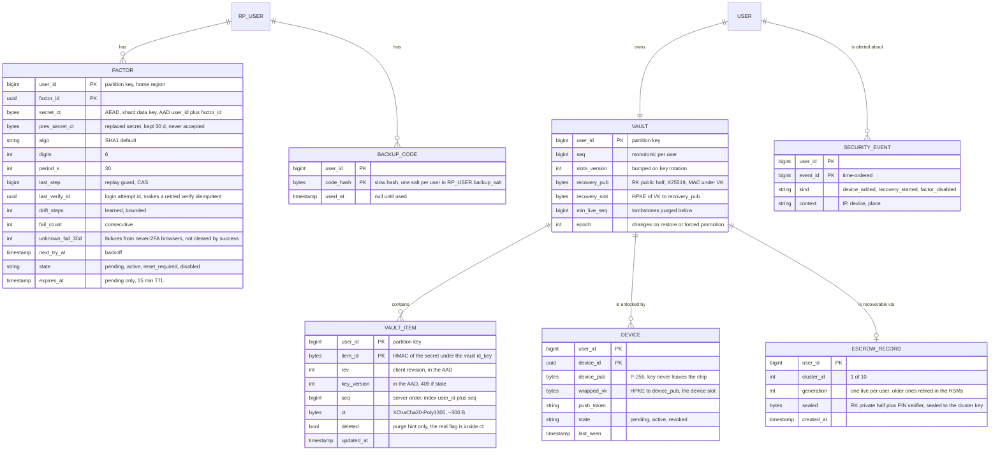

Access patterns that justify it:
- **Verify** reads and conditionally updates one `FACTOR` row by `(user_id, factor_id)`. Strong, single row.
- **Delta sync** reads `VAULT.seq` by `user_id` and, only if it moved, `VAULT_ITEM WHERE user_id = ? AND seq > ?`. One partition.
- **Write** updates one `VAULT_ITEM` and bumps `VAULT.seq` in one transaction on one partition.
- **Unlock on a device** reads that device's `DEVICE.wrapped_vk`. **Recovery** reads `VAULT.recovery_slot` and `ESCROW_RECORD.sealed`.
- Nothing is ever queried across users. Partition everything by `user_id`.

This is the final model. §4.4 starts without `DEVICE.device_pub`, `DEVICE.wrapped_vk`, `VAULT.recovery_slot` and `ESCROW_RECORD`, because there the server holds the key. §5.1 and §5.2 add them.

Two things this model deliberately does not hold: the attempt counter for recovery (it lives in the HSM cluster, so restoring an old database backup cannot refill a guess budget) and any plaintext about which websites a user has.

---

## 4. High-level design

One subsection per functional requirement. Each traces input to output, adds boxes to one diagram, and ends with what is still missing. §4.4 and §4.5 deliberately build what Google shipped in 2023 (sync with server-held keys). §5 then breaks it.

### 4.1 Enroll: scan a QR code, confirm with the first code

The idea: **the website owns the secret, and the factor does not count until a code proves the app stored it correctly.**

**Flow**

1. The user, signed in to example.com, opens Security and taps "Set up authenticator app". The website asks for a fresh sign-in with the strongest factor the account already has, then calls its **RP verifier**: `POST /v1/factors/totp`. Every new factor triggers a notification to the user's existing channels.
2. The verifier draws 20 random bytes (160 bits) from a CSPRNG, encrypts them under its shard's data key, which **KMS** wraps (envelope encryption, one data key per shard of ~1 M factors), and inserts a `FACTOR` row with `state = pending` and `expires_at = now + 15 min`.
3. It returns the URI `otpauth://totp/Example:alice@example.com?secret=JBSWY3DPEHPK3PXP&issuer=Example&algorithm=SHA1&digits=6&period=30` (base32, padding dropped, per the [Key URI format](https://github.com/google/google-authenticator/wiki/Key-Uri-Format)). The page renders it as a QR code and as text for manual entry. The secret is on screen for as long as that page is open, which is why the pending row expires.
4. The **app** scans the QR, parses the URI, rejects anything that is not `otpauth://`, and creates an item whose `item_id` is derived from the secret, `HMAC(id_key, secret ‖ algorithm ‖ digits ‖ period)` (§5.5), so scanning the same QR twice is the same item. It writes the item to the **local vault** (an on-device database encrypted under a key held by the Keystore or Secure Enclave) and shows the first code at once.
5. The user types the code. The website calls `POST /v1/factors/{id}/confirm`, which runs the same check as a sign-in (§4.3). On success: `state = active`, `last_step` set, and 10 single-use **backup codes** generated, shown once, stored only as slow hashes under one per-user salt (`BACKUP_SALT`, so a guess costs one hash, not ten). Backup-code guesses get their **own** small budget (backoff after 10 failures): at ~40 bits, 10 codes x 50 guesses is ~5 x 10^-10, and sharing the TOTP's 5-try budget would push a phone-less user into a password reset over typos on paper.
6. A pending factor never confirmed is deleted at `expires_at`. The account's existing sign-in is unchanged until then.

Why the confirm step matters: without it, a user who mis-scanned or whose phone clock is 5 minutes off would have 2FA switched on and be locked out at the next sign-in.

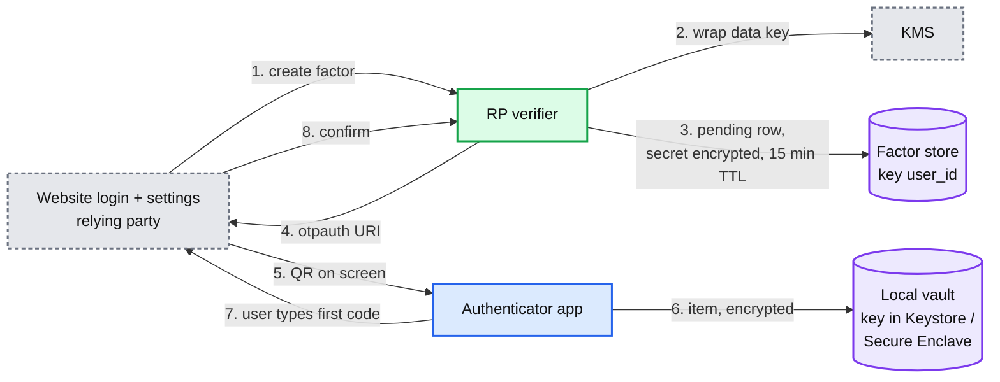

**Still missing:** nothing has defined how a code is computed or checked (§4.2, §4.3). The secret lives on one phone. Lose it and the user is locked out of example.com (§4.4).

### 4.2 Show codes offline

The idea: **a code is a pure function of the secret and the clock.** No server is involved, so there is nothing to scale and nothing to fail except the clock.

**Flow**

1. The user opens the app. If the user turned on the app lock (Google calls it Privacy Screen), the OS asks for a biometric or PIN first. The local vault is decrypted into memory.
2. For each item: `T = floor(now / period)`, `code = HOTP(secret, T)`: HMAC-SHA1 over the 8-byte big-endian `T`, take the low 4 bits of the last byte as an offset, read 4 bytes there, clear the top bit, take the result mod 10^6 and left-pad to 6 digits ([RFC 4226 §5.3](https://www.rfc-editor.org/rfc/rfc4226#section-5.3)). §10.1 has it as 12 lines of runnable Python checked against the RFC test vectors.
3. Next to each code: a countdown `period - (now mod period)`. At the boundary, recompute.
4. When the app goes to the background, the plaintext secrets are dropped from memory. The OS app switcher gets a blurred snapshot, so a screenshot of the switcher does not leak codes.

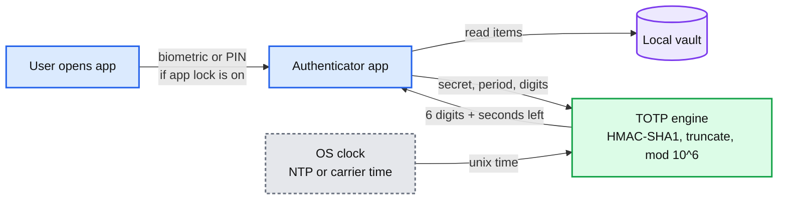

**Still missing:** a phone whose clock is 45 s off shows codes the website rejects (§5.3).

### 4.3 Verify: the website accepts a code once and stops guessing

The idea: **the verifier recomputes the code, and a single conditional write on one row gives both replay protection and the guess counter.**

**Flow**

1. The password step succeeds. The login page asks for the 6-digit code. The login service calls `POST /v1/verify {user_id, code, context}`.
2. **Charge the attempt first.** `UPDATE factor SET fail_count = fail_count + 1, next_try_at = now + backoff(fail_count + 1), state = CASE WHEN fail_count + 1 >= 100 THEN 'disabled' WHEN (fail_count + 1) % 5 = 0 THEN 'reset_required' ELSE state END WHERE user_id = ? AND factor_id = ? AND state = 'active' AND (next_try_at IS NULL OR next_try_at <= now) RETURNING secret_ct, last_step, drift_steps, fail_count` (a browser that never passed 2FA also bumps `unknown_fail_30d`, §5.4), with `backoff(n) = 0` for n < 5, else `min(30 s x 2^(n-5), 1 h)`. Zero rows: the factor is disabled or cooling down. Return `disabled` or `retry_after_s` **without evaluating the code**, so a waiting attacker learns nothing. The row lock serializes parallel requests: once the 5 free tries are spent, the first charged request pushes `next_try_at` 30 s out and every concurrent one finds the condition false. Reading `next_try_at` and writing the failure afterwards would let 10,000 guesses sent at once all be evaluated (odds 10,000 x 3 / 10^6 = 3%). This is the attack RFC 4226 §7.3 names, and the same "decrement first" rule the escrow HSMs use (§5.2).
3. It decrypts the secret with the shard's data key (unwrapped by KMS once and cached in memory for hours, so KMS is not on the request path; a per-row key would almost never be cached, because users sign in about weekly), computes the codes for steps `T-1`, `T`, `T+1`, and compares each in constant time.
4. **Match at step s.** `UPDATE factor SET last_step = s, last_verify_id = ?, fail_count = 0, next_try_at = NULL, state = 'active' WHERE user_id = ? AND factor_id = ? AND last_step < s`. One row updated: success. `last_verify_id` is the login attempt's id, so a front-end that retries after a lost response (the region committed, then died before replying) finds `last_verify_id` equal to its own and returns `ok` instead of calling its own success a replay. Zero rows: step `s` (or a later one) was already used, so this is a **replay**. Reject it and emit a `duplicate_use` security event (it alerts the user only when the second use comes from a different IP, network or device than the first, so a double-click does not page anyone). It was charged in step 2, so the verifier **refunds** it with one more conditional write that restores exactly what the charge replaced (`fail_count`, `next_try_at` and `state`, including a `disabled` set by a 100th charge), only if `fail_count` is still the value its charge returned. A replay tells an attacker nothing, and honest replays (two tabs, a double-click, the 2 minutes after fixing a fast clock) must not push a user toward a forced password reset. The same refund applies to a code that matches the factor's **previous** secret, kept 30 days after a re-enrollment (`FACTOR.prev_secret_ct`): the user is told "this code is from your old authenticator entry" instead of being walked into a reset by a stale item in their app. It still emits `old_secret_used`, and alerts the user if the device or IP never passed 2FA: after a re-enrollment that followed a phone theft, that is the strongest theft signal there is.
5. **No match.** Nothing more to write: the charge in step 2 is the failure record, and it already set `state = reset_required` if this was the 5th (10th, 15th, ...) consecutive failure, so a crash here cannot skip it. The user gets "someone entered your password and a wrong code", and no more codes are evaluated until the password is reset (§5.4). **A password reset sets `state = active` but keeps `fail_count` and `next_try_at`**: only a correct code or a backup code clears them. So an attacker who also controls the user's email cannot loop "reset, 5 guesses, reset" forever: each loop runs on the backoff schedule and the factor is disabled at 100. The same charge sets `state = disabled` at the 100th consecutive failure, the NIST cap, for every RP including those that cannot force a reset.
6. Return the result. One conditional write, plus one more on success, on one row: p99 < 50 ms.

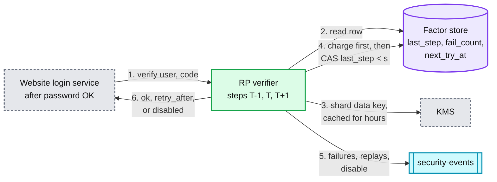

**Still missing:** the backoff schedule, drift learning, and what happens when sign-ins land in two regions at once (§5.3, §5.4).

### 4.4 Back up and sync (first version: the server holds the keys)

The idea, as Google shipped it in 2023: **sign in to your account in the app, and your codes are stored in the account.** Google's help page describes the protection as "encrypts Authenticator codes both in transit and at rest" ([help](https://support.google.com/accounts/answer/1066447)). That is server-side encryption: the server can decrypt.

**Flow**

1. The user signs in to their account inside the app (OAuth). The app gets an access token and turns sync on.
2. For each item the app calls `PUT /v1/vault/items/{item_id} {base_rev, rev, item}` over TLS.
3. The **Sync API**, in one transaction on the user's partition: check that the stored `rev` equals `base_rev` (else `409`), encrypt the item under a KMS-wrapped key, write it with `seq = VAULT.seq + 1`, bump `VAULT.seq`, and insert an outbox row. Return `{seq}`.
4. A relay reads the outbox and the **Notify service** sends a silent push through **APNs / FCM** to the user's other devices. The push carries no data, only "vault changed".
5. Another device, on that push or when it next opens, calls `GET /v1/vault/changes?since=<its seq>` and applies the items in `seq` order.
6. A delete is a write with `deleted = true` (a tombstone). Every device removes the item. Google deletes it everywhere at once. We keep the tombstone for 30 days. (After §5.1 the tombstone is itself a ciphertext, see §5.5.)

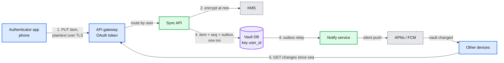

**Still missing:** we can read every secret, and so can anyone who signs in as the user (§5.1). Two offline devices editing the same item need a merge rule (§5.5).

### 4.5 Restore on a new phone (first version)

**Flow**

1. The user installs the app on a new phone and signs in to their account.
2. `GET /v1/vault/changes?since=0` returns every item. The phone shows codes. Done.

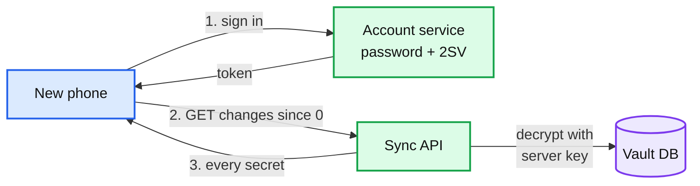

This is simple, and it fixed the real complaint: "a loss of that device meant that users lost their ability to sign in to any service on which they'd set up 2FA" ([Google, 2023](https://security.googleblog.com/2023/04/google-authenticator-now-supports.html)). It has two problems an interviewer will find in a minute:
- **Account takeover now yields every second factor.** The password plus whatever protects the account is the only gate. Retool, August 2023: a phished employee's Google account came with synced Authenticator codes ([Retool](https://retool.com/blog/mfa-isnt-mfa)).
- **A circular dependency.** If this app holds the code for the account that stores the vault, a user who lost the phone cannot sign in to restore it. Google's help page tells users to "enroll in additional forms of 2-Step Verification to make sure you do not lock yourself out".

**Still missing:** end-to-end encryption (§5.1), a recovery path that does not hand the vault to whoever owns the account (§5.2).

---

## 5. Deep dives

One per non-functional requirement, phrased as the interviewer's question. Each says what breaks in the design so far, the fix, and what changed.

### 5.1 "Who can read the secrets: us, an insider, or someone who steals the user's account?"

**What breaks in §4.** The Sync API decrypts with a key it holds. Anything that authenticates as the user (a phished password, a SIM swap that defeats SMS 2SV, a stolen session cookie) or as us (an insider, a compromised service, a legal demand) gets every secret. KMS encryption at rest defends against a stolen disk, which was never the threat.

| Rung | Approach | What breaks |
|---|---|---|
| Bad | Server-side encryption at rest (§4.4) | Every path that authenticates as the user or as us gets plaintext. One account takeover = every second factor |
| Good | The client encrypts the vault with a key derived from a passphrase (Argon2id). Ente Auth, Aegis and Authy's backup password do this | The server stores a blob that can be brute-forced offline. Users pick weak passphrases (Authy accepted 6 characters, [Twilio](https://www.twilio.com/blog/how-the-authy-two-factor-backups-work)). A forgotten passphrase loses everything. Every new device needs the passphrase typed |
| Great | A random 256-bit **vault key (VK)** encrypts every item. VK is stored only **wrapped**: once per device under a non-exportable device key, and once for recovery (§5.2). Devices join by device-to-device approval | Adding a device needs an existing device or the recovery path. Revoking a device needs a key rotation. The server still sees metadata |

**How Great works.**
- **Items.** Each item is sealed with XChaCha20-Poly1305 under VK, with a fresh random 192-bit nonce and associated data `user_id ‖ item_id ‖ rev ‖ key_version`. The long nonce means two devices writing at once never need to coordinate nonces (Aegis's format notes this exact risk with 96-bit GCM nonces, [vault.md](https://github.com/beemdevelopment/Aegis/blob/master/docs/vault.md)). The associated data means the server cannot move a ciphertext to another item or user, or replay an older revision onto a device that has seen a newer one, without decryption failing.
- **Device slots.** Each device creates a P-256 key pair inside the Secure Enclave (iOS) or StrongBox / TEE (Android). The private key never leaves the chip. The slot is `HPKE-Seal(device_pub, VK)`, stored in `DEVICE.wrapped_vk`, and each device also keeps its own slot locally so the app unlocks offline. Unlocking the app asks the chip to open the slot, gated by biometric if the app lock is on.
- **Local copy.** The local database stays encrypted under VK. It is excluded from OS backups (`ThisDeviceOnly` keychain items on iOS, `allowBackup="false"` for the database on Android), so secrets never leave the phone through a channel we do not control. On Android 12+ `allowBackup="false"` alone does not stop device-to-device transfer on some phones, so `dataExtractionRules` also excludes `<device-transfer>` (a transferred file is still ciphertext and fails safe). Android Keystore key agreement (`PURPOSE_AGREE_KEY`) exists only from API 31; older phones wrap the slot with a Keystore AES key instead.
- **Adding a device with an old one in hand.** The new phone registers (`POST /v1/devices`, state `pending`) and shows a QR holding `{device_id, device_pub, psk}`, where `psk` is 256 random bits. The old phone scans it, shows "Add Pixel 9?", takes a biometric, seals VK to `device_pub` in HPKE's PSK mode with that `psk` (RFC 9180 §5.1.2: "The PSK MUST have at least 32 bytes of entropy"), and writes the slot signed by its own device key. **The key material travels by camera, not through our servers**, and it protects both directions: we cannot swap in a public key of our own, and we cannot hand the new phone a slot for a vault key we made up, because only a phone that saw the QR knows `psk`. The server only checks that the signing device is active. A pending device nobody approves expires in 10 minutes.
- **The device list is authenticated too.** A rotation re-seals VK' to every listed device, so a fake entry the server added would receive the vault key. Each `DEVICE` entry therefore carries a MAC under the current VK over `(device_id, device_pub, key_version)`, written by the device that approved the join. Devices seal only to entries whose MAC verifies. A restored database that brings back a revoked device fails the check, because its MAC is under an old `key_version`.
- **Revoking a device.** `DELETE /v1/devices/{id}` needs a signature from another active device, or a sign-in with a passkey registered at least 7 days ago, so an attacker who owns only the account cannot cut the real user's devices off from the alerts. A revoke signed by another device takes effect after 24 h with alerts; with a passkey at least 7 days old it is immediate. The target may contest it, which freezes both devices' writes and slot changes until the user proves the recovery PIN (one PAKE login at the HSMs, §5.2) or signs in with an old passkey. That stops a thief's unlocked phone from cutting off the owner's other devices, and stops the thief from vetoing the owner's revoke, because the thief knows the phone's passcode but not the recovery PIN. The price: an owner who forgot the PIN and has no old passkey cannot settle a contest, so the vault stays frozen for writes (codes still show), as it does under `rotation_due` until some device rotates. The app lock is mandatory once sync is on, and the device key is bound to the current biometric set (`.biometryCurrentSet` on iOS, `setInvalidatedByBiometricEnrollment(true)` on Android), so a thief who knows the passcode cannot enroll a new face and then use the device key. The cost lands on honest users too: re-enrolling their own fingerprint or face invalidates the device key, so that device re-joins by QR from another device or through PIN recovery. At every rotation the app shows the device list for the user to confirm, so an entry a revoked device MACed during its 24 h window is not trusted blindly. It removes the slot and the token. When a revoke takes effect, the vault is marked `rotation_due` and item writes get `409` until a rotation commits, so the next device to open the app rotates first. It **rotates**: new VK', re-encrypt every item (8 x 300 B, milliseconds), re-seal VK' for each remaining device and to `recovery_pub` (no PIN needed). It sends all of it in one call, `POST /v1/vault/rotate`, applied in one transaction conditional on `slots_version`, so a crash cannot leave items under two keys. `key_version` is in every item's associated data and every `PUT`; a `PUT` under an old `key_version` gets `409`, so a device that missed the rotation cannot write under a key the revoked device knows. Be honest about the limit: the revoked device already saw the secrets. Rotation protects items added later. Only re-keying each website removes the old secret, so the app lists the sites to re-key after a theft.
- **What the server still sees.** Item count, ciphertext sizes, write times, device list, IPs. Padding each ciphertext up to the next 128 B boundary hides most of the label length for ~64 B per item on average, ~50 GB across 800 M items. (Padding everything to 512 B would cost ~250 MB per million items, ~200 GB in total, and push the vault from ~4 KB to ~6 KB per user.)

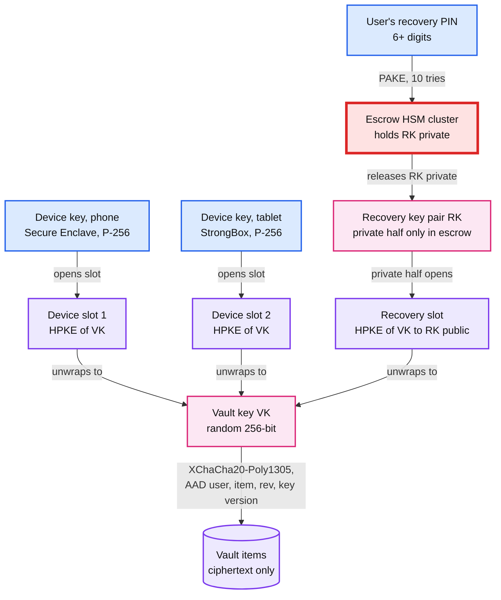

Push back on the textbook: "encrypt at rest with KMS" is the reflex answer and it is what shipped. It answers "what if someone steals a disk". The question that matters is "what if someone signs in as the user, or as us", and only keys the server never holds answer it. NIST says the same in its normative appendix on sync fabrics: synced keys "SHOULD be encrypted using a method that employs a user-controlled secret" ([SP 800-63B-4 Appendix B](https://pages.nist.gov/800-63-4/sp800-63b.html)).

**What changed:** `VAULT_ITEM.ct` is now client ciphertext; the Sync API can no longer validate content, only size (≤ 4 KB) and count (≤ 1,000 items). KMS left the vault path. `DEVICE` gained `device_pub` and `wrapped_vk`; `VAULT` gained `slots_version`. New endpoints: `POST /v1/devices`, `PUT /v1/vault/slots/{device_id}`, `DELETE /v1/devices/{id}`. A new phone without an old one now has no way in. That is §5.2. Details: [`deep-dives/vault-encryption-and-key-hierarchy.md`](deep-dives/vault-encryption-and-key-hierarchy.md).

### 5.2 "The user lost every device. How do they get their codes back, without letting an attacker do the same?"

This is the red node. After §5.1, no device means no VK.

| Rung | Approach | What breaks |
|---|---|---|
| Bad | No recovery. Google Authenticator before 2023, Aegis by default | Lose the phone, lose every second factor. The cost moves to every website's support desk |
| Good | A recovery passphrase or a 24-word code the user writes down (Ente Auth: "Ente cannot provide or regenerate the recovery key") | Strong when kept. Most users do not keep it. A short passphrase protecting a blob the server holds can be guessed offline at GPU speed |
| Great | A **recovery key pair RK** whose private half is escrowed in **HSM clusters** that release it only for the right PIN, **10 attempts then the record is destroyed**, behind a **24-hour cooling-off** with alerts. The 24-word code stays available for users who want no escrow at all | HSMs cost money and cannot be added quickly. A user who forgets the PIN and loses every device loses the codes. The 24 h wait annoys honest users |

**How Great works.**
- **Setup (when sync is turned on).** The app generates RK as a key pair (X25519), stores the public half in `VAULT.recovery_pub` with a MAC under VK (so a device that later seals to it can check it is the user's key and not one the server swapped in), seals VK to it (`VAULT.recovery_slot`), and asks for a recovery PIN of 6+ digits and hard-refuses a list of ~1,000 to 3,000 common PINs plus near variants (refusing only a top 20 helps little, see Odds). It then runs the registration half of a password-authenticated key exchange (OPAQUE, or SRP as Apple uses) with the user's HSM cluster through the Recovery service. The app **pins an attestation root** in its binary and accepts cluster keys only from a list signed under it, carrying a sequence number so an old list cannot be replayed (Google's Cloud Key Vault publishes its list the same way). If it took a bare cluster key from our server, a malicious Recovery service could hand it a key of its own at setup and read the RK private half with no guessing at all. Pinning the 10 keys directly would also work, but then a replaced cluster needs an app release. The cluster stores the private half of RK and the PIN verifier sealed under the cluster's own key (`ESCROW_RECORD.sealed`), and sets this record's attempt counter to 10 **inside the cluster**. The PIN never leaves the phone. The app then discards the private half: **no device keeps a recovery private key**. Every device keeps `recovery_pub`, which is harmless, so any device can re-seal a rotated VK for recovery (§5.1) without the PIN.
- **Start.** On a new phone with no old device: sign in to the account, then `POST /v1/recovery`. This emits `recovery_started` to the security-events stream: email, SMS, and a push to every active device saying "Someone is restoring your codes on Pixel 9 near Pune. Not you? Cancel". The record gets `not_before = now + 24 h`, and the start is also registered **in the HSM cluster's own state**: the cluster refuses PIN attempts until 24 h after it, timed by each HSM's internal monotonic counter from the moment the start is recorded (a majority must agree), never by wall-clock time pushed from outside, which whoever runs the network could steer. So an insider who goes around the Recovery service cannot guess quietly before the alerts have gone out. A user who signs in with a passkey or security key **registered at least 7 days earlier** skips the wait, because an old phishing-resistant factor already proved them. A brand-new passkey does not count: an attacker who owns the account can add one.
- **Attempt.** After `not_before`, the app runs the PAKE login against the cluster. The HSMs **commit the attempt first, then check the PIN**, so a crash or a dropped connection mid-attempt can never be a free guess. "Commit" means one shared attempt slot, not five private counters: an HSM grants slot k only if its own record of the slot is below k, and a guess goes ahead only when a majority has granted the same k. Any two majorities of 5 share a member, so no slot is granted twice and the record really allows 10 guesses. (Five independent counters with "any 3 decremented" would let a hostile relay steer each guess to the 3 least-used HSMs: 50 decrements at 3 per guess is 16 guesses.) The slot is committed before the HSMs send the message that lets the phone learn the result (KE2 in OPAQUE, the server proof in SRP). The correct-PIN reset and the generation live in the same ordered state, compared as `(generation, reset, slot)`. On success the cluster resets the counter to 10 in the same majority update and returns the RK private half **encrypted under the PAKE session key**, which only the phone that typed the PIN shares with the HSMs; the new device's public key is bound into the PAKE transcript. A Recovery service or insider that swaps in its own device key gets nothing it can open, the same reason device join uses a QR. The phone opens the recovery slot, gets VK, downloads the vault and writes its own device slot. Then it rotates the recovery key: a fresh RK' pair, a new recovery slot sealed to RK' public, a fresh escrow record with 10 attempts under the PIN just typed, and the old private half is discarded. Because no device keeps a recovery private key, a device that is later stolen or revoked never exposes one.
- **Staged attempts.** One recovery request allows 5 PIN attempts. After 5 wrong ones, a new start is needed: a fresh 24 h wait registered in the HSMs and a fresh round of alerts, so burning all 10 takes at least 48 h instead of one second after the first wait ends. Recovery starts are capped at ~3 per account per 30 days [estimate].
- **Failure.** Each wrong PIN costs one of 10. After the 10th, the cluster destroys the record. Apple publishes exactly this rule: "After the 10th failed attempt, the HSM cluster destroys the escrow record and the keychain is lost forever" ([Apple](https://support.apple.com/guide/security/escrow-security-for-icloud-keychain-sec3e341e75d/web)). The user falls back to each website's backup codes.
- **Why hardware.** A 6-digit PIN protecting a blob that anyone with a database copy can test offline falls in well under a second. The only thing that turns 10^6 guesses into 10 is a counter the attacker cannot reset, in firmware nobody can change, including us. Apple's admin cards that permit firmware changes "have been destroyed". Google's Titan-backed backup keys use the same idea: firmware "that cannot be updated without erasing the contents of the chip" ([Google, 2018](https://security.googleblog.com/2018/10/google-and-android-have-your-back-by.html)).
- **Recovery starts are capped per cluster, in the HSMs** (a cap the Recovery service enforces would not bind an insider): a token bucket at ~3x the launch-week peak hour, ~3,000 starts an hour per cluster (~1/s, a tenth of the attempt ceiling), against a baseline of ~1,800 a day. Above that, only starts backed by a passkey ≥ 7 days old are accepted. A mass event (an OS update that invalidates device keys for millions) needs a ceremony-approved raise. The ~10/s ceiling below is a shared budget, and 10k compromised accounts spending 10 tries each would otherwise use ~2.8 h of one cluster, a recovery outage for its other users.
- **A firmware rate ceiling.** Each cluster accepts at most ~10 attempts a second, in firmware. An insider with registered starts for every user would need ~116 days to spend all 10 guesses on each of the 10 M records in a cluster (10 M x 10 / 10 per s), but the 10 clusters run in parallel, so ~116 days covers all 100 M users. With real PINs that would open roughly 1% to 10% of them (see Odds), while alerting every one. What actually binds an insider is the HSM-enforced start cap above and the staged attempts below, not the ceiling alone.
- **One live record per user.** The cluster's state holds one record generation per `user_id`. Registering a new record retires the previous one in the same majority update, and `sealed` binds `user_id` and the generation, so an old blob cannot be resubmitted as a fresh 10-try record. A destroyed record stays destroyed.
- **Alerts an attacker cannot switch off.** Every PIN attempt, right or wrong, alerts. `recovery_started` goes to every device active or revoked in the last 30 days and to the email and phone on file 30 days ago. Changing the account's email or phone starts its own 24 h cooling-off. The HSMs sign a **per-cluster heartbeat** about once a minute: the root of the tree of record states (tries left, start pending since, generation) plus an increasing sequence number. Every device fetches the latest heartbeat and a Merkle proof for its own record on open and by background refresh at least every 12 h, checks the proof, and checks that the sequence keeps advancing against its own clock; 24 h without a fresh heartbeat is itself an alert. It also alerts if a start or a spent try appears that it did not cause. 12 h is shorter than the 24 h wait, so even a start registered directly in the HSMs by an insider, with no `recovery_started` event, is seen before any guess is allowed, and the Sync API cannot keep serving an old "10 left" answer. Cost: one signature per cluster per minute; ~3.5k proof reads/s from the Sync API, no HSM work. A recovery that reaches `ready` and is not used expires after 7 days [estimate]. A cancel is registered **in the HSM cluster** too, with a PIN proof (a wrong PIN there spends a try, so cancel is not a free guessing oracle); the cluster then refuses that start, so a Recovery service that ignores the cancel gains nothing. A cancel by an old passkey alone is enforced only by the Recovery service, and we say so.
- **After a record is destroyed** by 10 wrong PINs, every device gets `escrow_destroyed`, and re-escrow requires a new PIN and is allowed at most once per 30 days, so an attacker cannot refill guesses against the same PIN every day. The cost: an attacker who keeps the account can destroy each new record and leave the user without no-device recovery for up to 30 days. That trades recovery availability for guess safety; the real fix is evicting the attacker from the account, so `escrow_destroyed` also signs out every session, forces a password change, and accepts new recovery starts only with a passkey ≥ 7 days old.
- **The PIN is the likeliest cause of a permanent lockout**, because it is typed once at setup. The app asks for it now and then (a few times in the first month, then rarely) and lets the user change it from any device [our addition].
- **Why the counter is not in our database.** If it were, restoring last week's backup would refill every attacker's guesses. The counter lives in the cluster's replicated state. With ~10 M records per cluster, the HSMs hold a Merkle root over the counters and check a proof on each attempt [design choice; see the deep dive].
- **Odds.** A uniform 6-digit PIN: 10 / 10^6 = 10^-5. Real PINs are not uniform. Markert et al. (IEEE S&P 2020) measured that 10 guesses open **6.23%** of first-choice 6-digit PINs and 13.28% of 6-digit PINs from RockYou ([paper](https://arxiv.org/abs/2003.04868)), and found that the small blocklists in use "offer little or no benefit" against a throttled attacker; gains came only from much larger lists. With a hard ~1,000 to 3,000-PIN list, expect roughly 1% to 10% per record depending on what blocked users pick instead [estimate]. That is why the 24 h wait, the staged attempts and the alerts exist, and why an attacker also needs the account first. Users who want better offer a longer alphanumeric passphrase, or the 24-word paper key.
- **The circular dependency from §4.5.** The app refuses to be the only second factor for the account that holds its own vault: turning on sync requires a second way into the account that does not live in this vault: a passkey, a security key, or sign-in prompts on another device that does not hold this vault.

**Why it is red.** It is the one path into every secret without a device, so it is the attacker's target. It is the one place a forgotten PIN loses everything. And it is the one tier we cannot scale on demand: HSMs take weeks to procure and a key ceremony to enroll. Capacity: 10 clusters of 5 HSMs, each capped at ~10 attempts/s [estimate, and a firmware ceiling] against a launch-week peak of ~15 device changes/s, of which ~3/s need the HSMs (~0.3/s per cluster). A cluster down to 2 of 5 HSMs up has no majority and stops recoveries for its ~10 M users. Nothing is lost, they wait, and device hand-off (§5.1) still works for anyone with an old phone.

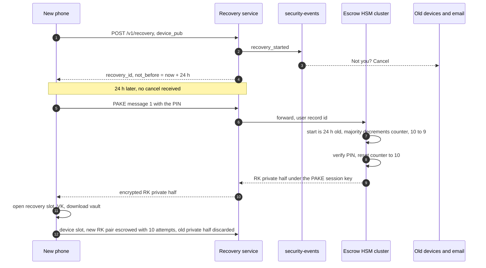

**What changed:** `ESCROW_RECORD` (one live generation per user), `VAULT.recovery_pub` with a VK MAC, the Recovery service, the HSM clusters with the 24 h wait in their own state, the `security-events` stream and an alerting consumer, recovery endpoints with `not_before` and a 7-day expiry, a PIN step in onboarding with reminders, signed device revocation, and a rule that the app cannot be the sole factor of its own account. Details: [`deep-dives/recovery-and-hsm-escrow.md`](deep-dives/recovery-and-hsm-escrow.md).

### 5.3 "The phone's clock is wrong, or the code arrives late. Why does it fail and what do we fix?"

**What breaks in §4.3 as first drawn.** Accept only step `T` and every code typed near a boundary fails. If a user takes 8 s to read and type, the boundary falls inside that gap 8/30 of the time: **~27% of attempts fail** with a correct code. A phone 45 s fast shows step `T+1` or `T+2` from the server's point of view.

| Rung | Approach | What breaks |
|---|---|---|
| Bad | Accept only `T` | ~27% false rejects from typing delay alone |
| Good | Accept `T-1`, `T`, `T+1`. RFC 6238 §5.2: "We RECOMMEND that at most one time step is allowed as the network delay" | Survives up to ~30 s of combined skew and delay. Triples the guessing odds per attempt (3 / 10^6). A phone 2 minutes off still fails |
| Great | ±1 around `T` **and** ±1 around a **drift learned per factor** (RFC 6238 §6: "the validation server can record the detected clock drift for the token"), plus a skew warning in the app | Drift is learned only from successful matches, so an attacker cannot walk it. Bounded to ±4 steps (2 min). A drifted factor checks up to 6 codes, so its odds are ≤ 6 / 10^6 per try |

**How Great works.**
- On a match at step `s`, store `drift_steps = s - floor(now / 30)` with `last_step`. The next check covers `T ± 1` **and** `T + drift ± 1`. The base window always stays, so a user who fixes the phone clock (as the banner asks) is not locked out by an old drift. Every match stores `s - T` again, whichever window it landed in, so drift follows a phone that keeps gaining time and returns to 0 by itself after a clock fix. ("Reset drift to 0 on a base-window match" looks tidy and is a bug: drift never gets past ±1, and a phone gaining 3 s a day fails 26 of 40 days in the deep dive's simulation, against 0 of 40 with `s - T` stored every time.) Drift is updated only on success and capped at ±4 steps. Beyond that the code fails and the user is told to fix the phone clock.
- One leftover: for up to 4 steps (2 minutes) after a sign-in from a fast clock, the corrected clock's codes are below `last_step` and are rejected as replays. The user waits 2 minutes. Rare, and the price of a monotonic replay guard.
- A first sign-in after a long gap may have drifted further than the cap. RFC 6238 §6 says "additional authentication measures should be used" and the prover should "explicitly resynchronize": after a backup-code sign-in the RP asks for **two consecutive codes**, searches ±10 steps (5 minutes) for the pair, and stores the drift it finds. A random pair matching anywhere in that range has odds ~21 / 10^12, so the wide search is safe.
- In the app: every sync response carries the server's `Date`. If `|device - server| > 15 s`, show a banner: "Your phone's time is 42 s off. Turn on automatic date and time." We warn, we do not silently shift the codes. Google removed its own time correction in version 7.0 and now uses the OS clock ([help](https://support.google.com/accounts/answer/1066447)). One clock per device keeps debugging simple.
- Server clocks are NTP-disciplined to well under 1 s. Every verifier region must agree on time, or a code accepted in one region looks like the future in another. A verifier node whose offset exceeds 1 s takes itself out of service: a bad clock would charge real users failures and teach factors a false drift. That catches one bad node, not a bad shared time source, so verifiers take time from 3 or more independent sources, and the success write also refuses `s > T_db + 4`, checked against the database's own clock. Otherwise a fleet-wide jump of one hour forward would write `last_step` 120 steps ahead for everyone it served.
- Code lifetime: on an exact clock, a code is accepted for ~60 s after it first appears (its own step, then the next one as T-1). The whole acceptance span of ±1 at 30 s is 90 s. NIST's rule that a clock-based nonce changes "at least once every two minutes" (§3.1.4) limits the period, and 30 s complies.

Push back on the textbook: "widen the window to ±2 for drifting users" gives everyone 5/3 of the guessing odds to help a few. Per-factor drift helps exactly the few.

**What changed:** `FACTOR.drift_steps`. The app gained a skew banner. Details: [`deep-dives/totp-algorithm-and-clock-drift.md`](deep-dives/totp-algorithm-and-clock-drift.md).

### 5.4 "How does the website stop replay and guessing, and stay correct when sign-ins land in two regions?"

**Replay.** The conditional write in §4.3 (`WHERE last_step < s`) makes exactly one of two racing submissions of the same code succeed. It also rejects an older in-window code once a newer one was used, which is what "one-time" means.

**Guessing.** RFC 4226 §7.3: "The delay or lockout schemes MUST be across login sessions to prevent attacks based on multiple parallel guessing techniques." So the counter is per factor, never per IP or per session. Botnets have plenty of IPs.

| Rung | Approach | What breaks |
|---|---|---|
| Bad | Rate limit by IP | 1,000 IPs x 5 tries = 5,000 guesses: success odds 5,000 x 3 / 10^6 = 1.5% |
| Good | Lock the factor after 5 failures | Anyone with the password can lock the real user out, on purpose, all day |
| Great | 5 free tries. The 5th consecutive failure is treated as proof the password leaked: alert the user, and evaluate no more codes until the password is reset through the account's own recovery. As a backstop for RPs that cannot force a reset: backoff 30 s doubling to 1 h, and disable at **100** consecutive failures (NIST §3.2.2 cap, and its example "30 seconds up to an hour") | Someone with the password can force a password reset with 5 wrong codes. That is the right outcome, and unlike locking the factor it is self-service: the real user resets the password through the account's recovery and is back in, while the attacker's credential dies |

**The math.** With the password-reset rule, an attacker gets 5 tries per leaked password: 5 x 3 / 10^6 = 1.5 x 10^-5 (3 x 10^-5 for a factor with learned drift, which checks up to 6 codes). A credential-stuffing wave with 1 M valid passwords yields ~15 takeovers, against ~300 if all 100 tries were allowed. A patient attacker who guesses 4 times a day between the real user's daily sign-ins never reaches 5 consecutive failures (a success clears `fail_count`, as NIST §3.2.2 suggests): 1,461 guesses and ~0.44% a year in the deep dive's simulation, with no alert. So the factor also keeps `unknown_fail_30d`, failures from browsers that never passed 2FA in the last 30 days, which a success does **not** clear; 5 of those also set `reset_required`. A factor in `reset_required` evaluates no codes at all. On a backstop RP that cannot force a reset (its account recovery has no verified email or phone to re-establish the user, so it can only demand a password change after the next successful sign-in), a successful sign-in after the 5th-failure alert forces a password change instead, so an attacker cannot keep guessing between the real user's daily sign-ins. On a backstop RP a scripted attacker takes every backoff slot the moment it opens, so the real user is effectively locked out from ~2 h in; such an RP gives a browser that already passed 2FA (a remembered-device cookie) its own small budget. The backstop schedule alone: 5 immediate tries, then waits of 30, 60, 120, 240, 480, 960, 1,920 and 3,600 s (8 more tries in ~2 h), then 1 an hour: **~34 guesses on day 1, 24 a day after**, 100 reached ~89 h in, on day 4. Each attempt is charged before it is evaluated (§4.3 step 2), so parallel requests cannot share a free slot. Total success odds ≤ 100 x 3 / 10^6 = **3 x 10^-4** per account. NIST chose 100 to "balance the likelihood of a correct guess ... versus the potential need for account recovery". A lower cap is allowed.

**A targeted user.** Charge-first makes every request for one factor a conditional write on one row. An attacker sending thousands a second would queue on that row lock and slow the real user. The login front-end keeps a short-lived, non-authoritative cache of `state` and `next_try_at` per factor and sheds requests it already knows will be refused; the authoritative gate stays in the write.

**Two regions.** If the factor row replicates asynchronously and each region checks its own copy, a code replayed in another region within ~90 s is accepted twice, and the guess counter doubles with each region. The replay guard needs one copy that decides.
- Chosen: every factor row has a **home region** (the user's partition leader). A login front-end in any region sends the verify RPC there: +70 to 150 ms for a traveler, inside the 200 ms cross-region target. The partition replicates synchronously to a second nearby region, so a region loss fails over with RPO 0. If the leader loses its replica, it stops accepting writes until a new replica is in sync or it is fenced and replaced; a leader that carried on alone would make RPO 0 false.
- Rejected: a globally replicated row with a quorum write on every verify. It costs the same cross-region trip for everyone, not just travelers.
- If the home region and its replica are both down, verification fails closed for TOTP and the login offers another factor. Push probably shares the RP's single-use request store and may be down too; a passkey clearly survives, because its public key can live in every region and its challenge is per region. Backup codes live in the same `user_id` partition and need the same single-use write, so they are down too. Accepting codes without the replay guard is not an option.

**The secret at the RP.** Unlike a password, a TOTP secret cannot be hashed: the verifier must run HMAC with it. A stolen factor table is a stolen second factor for every user, forever, until each re-enrolls. So: envelope encryption with an AEAD whose associated data is `user_id ‖ factor_id` (so someone with write access to the table but no key cannot copy their own `secret_ct` into a victim's row; the same for `prev_secret_ct`), one data key per shard of ~1 M factors, wrapped by KMS, unwrapped and cached for hours, re-wrapped on KMS key rotation), the factor table and KMS in different trust domains, and for high-value RPs the HMAC computed inside an HSM so the verifier process never sees a secret.

**What changed:** charge-first attempts, `FACTOR.state = reset_required` after 5 failures, `FACTOR.next_try_at` and the backstop schedule, home-region routing for verify, sync replication of the factor partition, KMS caching. Details: [`deep-dives/server-side-verification.md`](deep-dives/server-side-verification.md).

### 5.5 "Two devices change the vault offline. What wins, and can a deleted secret come back?"

**What breaks in §4.4.** A tablet offline for a week renames item A. The phone deletes A and adds B. Both come online. Worse cases: two devices scan the same QR, a failover loses a write the server had acknowledged, a buggy release writes garbage.

| Rung | Approach | What breaks |
|---|---|---|
| Bad | One blob per vault, last write wins | The stale tablet uploads its whole vault and **silently deletes B**. A lost secret is a lockout |
| Good | One row per item, optimistic `base_rev` check, `409` then fetch and retry | No item is clobbered. Still needs a rule for "rename vs delete" and for duplicates |
| Great | Per-item rows with an `item_id` **derived from the secret**, field-level merge by HLC, sealed tombstones that are **pinned until every active device has seen them**, and **"never lose a secret"**: two items with different secrets are never merged into one | More client logic, and a purge that waits for slow devices. Every rule below fits on one screen |

**Merge rules** (the client resolves, because only the client can read the items):

| Conflict | Rule |
|---|---|
| Every pull | Clients merge every pulled item with their local copy **field by field by HLC** and never use `rev` to choose content: `rev` is only for optimistic concurrency, and it restarts if an item is re-created after a purge (a re-create sends `rev` = highest seen + 1). The HLC is wall time plus a counter plus the device id, with wall time clamped at the server `Date` + 1 min, so one phone set to 2030 cannot drag every device's clock forward |
| Rename vs rename | Last writer wins per field, ordered by `(hlc, device_id)` stored inside the ciphertext |
| Rename vs delete, restore vs delete | `deleted` is a field like any other, last writer wins by HLC; a rename never writes `deleted`, so a rename never undoes a delete. A deleted item sits in the 30-day trash with the rename applied. A restore is a later write of `deleted = false` and wins over an older delete |
| Same QR scanned on two devices, or rescanned after a delete | `item_id = HMAC(id_key, secret ‖ algorithm ‖ digits ‖ period)`, with `id_key` held in the vault and never rotated. The same QR always yields the same `item_id`, so a second scan is a write to the same item (a restore if it was deleted), never a duplicate to tombstone. A random UUID plus "tombstone the newer duplicate" loses both copies when one device deletes the item while another, offline, rescans it |
| Same site re-enrolled (new secret, same issuer and label) | Keep both. Only the user knows which one the site now accepts. Mark the older one "possibly replaced" |
| Purging tombstones | A tombstone is purged only when it is 30 days old **and** every active device's acknowledged `since` is past it; the server then advances `min_live_seq`. Otherwise a device cannot tell "purged delete" from "lost write" from "a write whose `200` was lost", and either resurrects deleted items or drops restores. A device unseen for 90 days stops pinning; only such a device can get a `410` |
| A device unseen for 90 days | `410 Gone`, full resync, merge by HLC. Local items the server lacks go to the **local trash for 30 days**, never straight to deletion. A local item edited offline is uploaded with `base_rev` set to the server's `rev` |
| The server lost acknowledged writes (the leader and its sync replica both lost, or a restore from backup) | An epoch changes on every restore or forced promotion and comes back on every response. It is a generation of the whole partition, not a column bumped in ~12 M user rows. A device that sees a new epoch does a full resync, merges every local item with the server copy by HLC, and re-uploads every item where the merge differs from what the server holds (not just items at an older `rev`: a lost write can be overtaken by a different write with the same `rev`). Devices also remember the highest `key_version` they have seen and reject items below it; if the restore regressed `key_version`, the device first re-runs `POST /v1/vault/rotate` (re-applying the revokes it knows) and only then re-uploads. Comparing `seq` alone is not enough: once the server hands out 41 and 42 again, a device that remembers 42 sees nothing wrong. **The device is the second copy** |
| A tombstone the server made up | A delete is a ciphertext too: the tombstone is sealed under VK with `deleted` inside it, and devices trust only the decrypted flag. The plaintext `deleted` column is a purge hint. A forged tombstone does not decrypt, so devices report it instead of deleting. Devices also compare the plaintext hint with the sealed flag on every pull and report mismatches; the server purges only pinned tombstones no device has flagged |

Why not a full CRDT: items are few and mostly immutable (a secret never changes; a re-enrollment is a new item). Per-item last-writer-wins plus tombstones is the LWW-element set, a degenerate CRDT without the metadata cost ([`../../concepts/crdt.md`](../../concepts/crdt.md)).

**The scariest failure is our own client.** A release with a bug that encrypts under the wrong key writes valid-looking ciphertext that no device can open. Three guards: the client decrypts what it is about to upload, with VK unwrapped fresh from its device slot rather than the in-memory key that just encrypted, and compares before the `PUT` (cheap, but it runs in the same possibly buggy build); the server keeps the previous revisions of every item for 30 days (`GET /v1/vault/items/{id}/history`); releases go out staged (1%, 10%, 50%, 100%) with "items that fail to decrypt" as the gating metric, **measured on the user's other devices**, which run the previous version and so are an independent check.

**What changed:** `item_id` derived from the secret, an HLC inside each item and merge by HLC, sealed and pinned tombstones, `VAULT.min_live_seq`, a partition epoch, item history for 30 days, `410` only for long-absent devices, epoch-triggered merge and re-upload in the client. The deep dive's simulator ran 2,000 random schedules (3 devices, 120 days, offline spells, lost `200`s, skewed clocks, one lossy failover): the rules as first written broke 899 of them (950 secrets lost, 227 items resurrected); with the derived id, pinned tombstones and merge by HLC, 0. Each of the three fixes is needed on its own. Details: [`deep-dives/multi-device-sync-and-conflicts.md`](deep-dives/multi-device-sync-and-conflicts.md).

### 5.6 "Add one-tap push approval, like Microsoft Authenticator or Duo. What changes, and does it stop phishing?"

**What changes.** Push is a different factor: the device proves possession by **signing a challenge** with a key that never leaves it, instead of the user copying 6 digits.

0. Scope first: pushes to our app need **our** APNs / FCM credentials, so push covers our own accounts. Offering it to other websites means running push-auth as an API they call (the Duo and Microsoft model), which is a product decision to state, not a detail.
1. At enrollment, after a fresh sign-in, the app registers a second P-256 key pair (Secure Enclave / StrongBox, usable only with a biometric and invalidated when the enrolled biometrics change) with the **push-auth service** and gives it the device's push token. Every device is alerted, and the new key is held 24 h with a cancel link, because push enrollment is the obvious persistence path after one relayed phishing session.
2. At sign-in, after the password, the service creates a request `{request_id, user, rp, ip, city, number (2 digits), expires_at = now + 60 s}` and sends a **visible** alert push: APNs `apns-priority` 10 with `apns-expiration` at the request's expiry, FCM high priority with a user-visible notification and a 60 s `ttl` (FCM's default lifespan is four weeks), one collapse id per user so a burst shows one prompt. The push carries only `request_id`.
3. The app fetches the details over TLS, shows "Sign-in to example.com from Pune?", and asks the user to **type the number shown on the login screen** (number matching). Biometric. The device signs `{request_id, number, decision}`.
4. The service checks the signature, that the request is unexpired and unused, and that the number matches. The login proceeds.

New parts: a push-auth service, a request store with a 60 s TTL, device signing keys at the RP. New dependency: APNs and FCM deliver best effort, so the app also **pulls pending requests when it opens**, and the login page always offers "enter a code instead".

**MFA fatigue.** Without number matching, an attacker with the password sends prompts until a tired user taps Approve (Uber, September 2022). Microsoft made number matching mandatory for Authenticator push from May 2023. We also cap prompts at 3 per 10 minutes per user. Two denials, one "Report: this was not me", a wrong typed number, or unanswered expiries count toward a 1-hour block with an alert, so a user who ignores prompts does not get 432 a day. After 2 unapproved requests in an hour the password is treated as known and must be changed. Revoking a vault device (§5.1) also revokes its push registration.

**Does any of this stop phishing? No.** An adversary-in-the-middle phishing page relays the password, shows the user the real number, and relays the TOTP code just as well. Microsoft's July 2022 report on such proxies counted more than 10,000 organizations targeted, with the attacker getting in "regardless of the sign-in method"; the 0ktapus kits (2022) forwarded credentials and codes to a Telegram channel for immediate use. NIST is blunt: "OTP authentication is not phishing-resistant" (§3.1.4), and authenticators "that involve the manual entry of an authenticator output (e.g., out-of-band and OTP authenticators) SHALL NOT be considered phishing-resistant" (§3.2.5), which covers typing a matched number too. Only a credential bound to the site's origin, a passkey (WebAuthn), stops a relay, because the browser will not sign for the wrong domain.

Staff move: name the roadmap instead of defending TOTP. TOTP for breadth (every site supports it), push with number matching for usability on our own accounts, passkeys for phishing resistance. For the RP verifier this is not optional: SP 800-63B-4 §2.2.2 says "Verifiers SHALL offer at least one phishing-resistant authentication option at AAL2", so the reference verifier we ship offers passkeys **now**, next to TOTP. The authenticator app can become a passkey provider later. That is a new credential type, not a new sync design: the same vault key hierarchy holds passkey private keys. Details: [`deep-dives/push-approval-and-phishing.md`](deep-dives/push-approval-and-phishing.md).

### 5.7 "What fails, and what changes at 10x?"

| Component | Failure | What the user sees | Mitigation, blast radius |
|---|---|---|---|
| Phone clock | 45 s off | Codes rejected | ±1 window plus learned drift; skew banner in the app. One user |
| Sync API / Vault DB region | Down | Nothing on the phone with the codes. A second device is stale | Partition failover to a sync replica in a second region, RPO 0. Codes never depend on sync |
| Notify / APNs / FCM | Down or slow | Other devices update on next open instead of in 10 s | Pull on open. Nobody locked out |
| Escrow HSM cluster | Mass event, e.g. an OS update that invalidates device keys for 10 M users | Those users need the HSM path at once | The ~10/s ceiling that slows an insider also caps honest recoveries: 10 M recoveries is ~28 h of the whole 10-cluster fleet. The 24 h wait absorbs most of it; say so before it happens |
| Escrow HSM cluster | Down to 2 of 5 up, no majority | Recovery for its ~10 M users waits | Device hand-off still works. Repair, not failover: the counters must not fork |
| Escrow HSM cluster | Destroyed (all 5 plus key copies) | Those users lose the no-device recovery path | Every live device asks the user to set the recovery PIN again on next open: registration needs the PIN, holding VK is not enough. Only users with no device during the outage lose recovery |
| RP KMS | Down | Verify fails only on a verifier that restarted and has no cached shard key | One data key per shard, cached for hours, multi-region KMS. Freeze deploys and scale-in while KMS is down and keep enough warm pods for a stuffing peak, because a restarted verifier fails until KMS returns: page |
| RP verifier home region | Down | Travelers and home users wait for failover | Sync replica in a second region, partition failover in seconds |
| Our client release | Writes undecryptable items | Codes missing on other devices | Decrypt-before-upload check, 30-day item history, staged rollout |

**At 10x (1 B users).** Vault: ~4 TB, ~10k sync reads/s average, still a modest sharded store. HSM clusters: ~100 at 10 M users each, which is now a real procurement and key-ceremony program, the item that actually grows. Per-country data residency becomes a requirement: vault partitions and HSM clusters placed by the user's country, which the `user_id` partitioning already allows.

---

## 6. Final design and the core flows

Every Great pick from §5 composed. The website side (bottom) is the reference verifier every RP runs. The authenticator side (top) is ours.

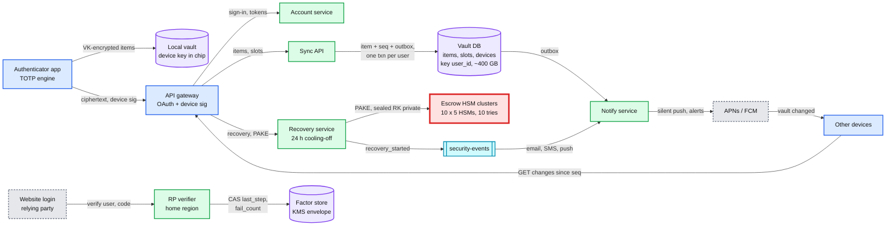

Zoom-ins (context, data flow, deployment, partitioning, failure map, migration plan) are in [`diagrams.md`](diagrams.md).

Rehearse these flows out loud. Each should take under a minute.

### Flow 1: enroll at a website (FR1)

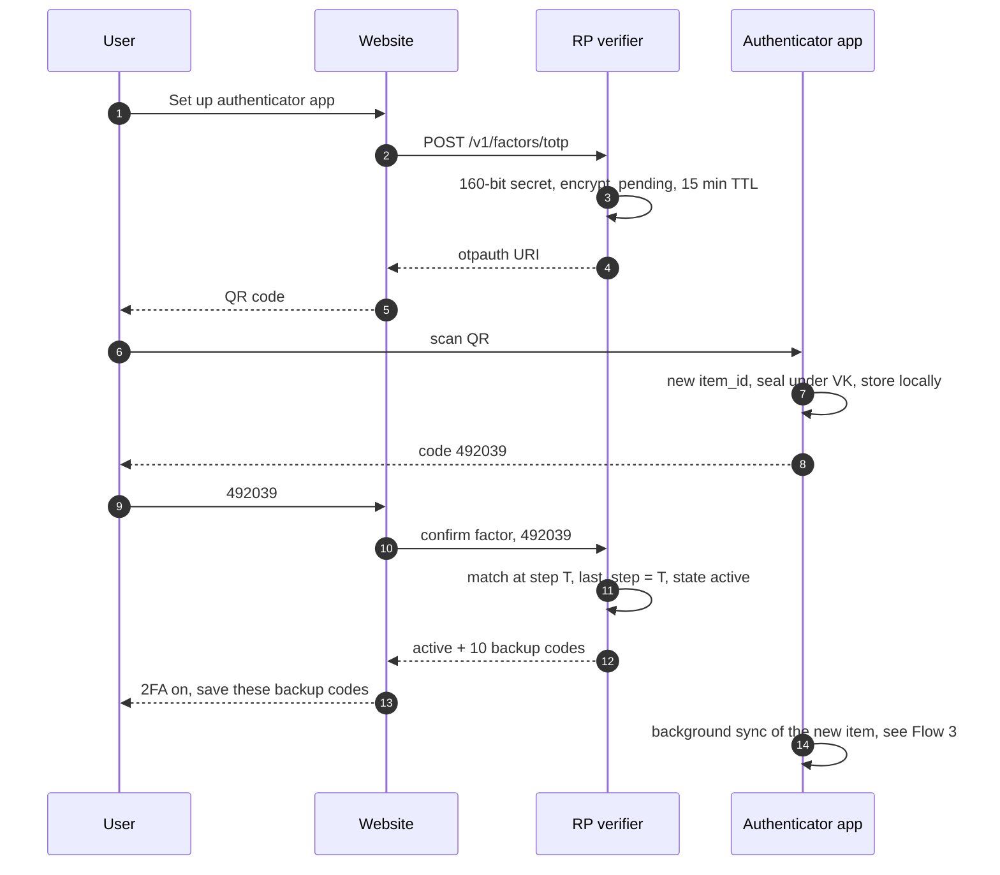

### Flow 2: sign in with a code (FR2 + FR3)

1. Password accepted. The website asks for a code.
2. The app (offline is fine) computes `HOTP(secret, floor(now / 30))` and shows `492039`, 11 s left.
3. The website calls the verifier in the user's home region. It charges the attempt first: `fail_count + 1` only if the factor is active and `next_try_at` has passed. Then codes for `T-1, T, T+1` (plus the learned-drift window). Match at `T`.
4. `UPDATE ... SET last_step = T, fail_count = 0, next_try_at = NULL WHERE last_step < T`: 1 row. Signed in.
5. The same code pasted again within 90 s: 0 rows updated. Rejected as a replay, `duplicate_use` emitted.

### Flow 3: add an account on the phone, see it on the tablet (FR4)

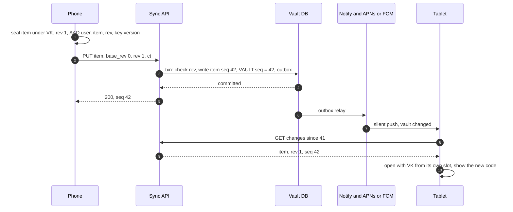

### Flow 4: new phone, old phone in hand (FR5)

1. New phone: sign in, `POST /v1/devices` (pending), show a QR with `{device_id, device_pub, psk}`.
2. Old phone: scan it, show "Add Pixel 9?", biometric, `HPKE-Seal(device_pub, VK)` in PSK mode with the QR's 256-bit `psk`, `PUT /v1/vault/slots/{new_id}` signed by the old phone's device key.
3. Sync API checks the signer is an active device, marks the new device active, emits `device_added` (alert to every device and email).
4. New phone: opens its slot, gets VK, `GET changes since 0`, decrypts everything. No HSM was involved.

### Flow 5: every device lost (FR5)

The sequence is in §5.2. In words: sign in, start recovery, every channel is alerted, wait 24 h (skipped with a passkey at least 7 days old), PIN against the HSM cluster (10 tries), the RK private half returned under the PAKE session key, open the recovery slot, download, re-escrow.

### Flow 6: an attacker owns the account and tries to restore (failure)

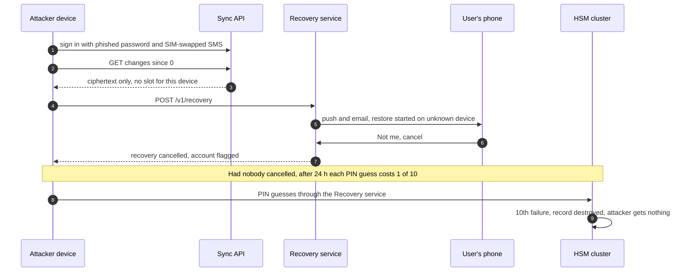

---

## 7. Trade-offs

| Decision | Option A | Option B | Chose | Why |
|---|---|---|---|---|
| Who can decrypt the synced vault | Server-held keys (Google 2023, Microsoft) | End to end, keys only on devices and in escrow | **B** | A + account takeover = every second factor (Retool). NIST Appendix B prefers a user-controlled secret |
| Recovery without a device | Passphrase / 24-word code only (Ente, Aegis) | HSM escrow of a random key, PIN, 10 tries, 24 h wait | **B, with A offered** | Most users lose written codes. A PIN is only safe behind a hardware guess limit |
| Recovery PIN | The phone's lock-screen PIN (Android backup, iCloud Keychain) | A separate app PIN | **B** | We cannot read the iOS screen lock. One rule on both platforms |
| Vault shape | One encrypted blob | One ciphertext per item | **B** | Concurrent edits do not clobber, writes are ~300 B. Leaks the item count, which we accept |
| Conflict model | Full CRDT | Per-item LWW by HLC + tombstones + "never merge different secrets" | **B** | Items are few and immutable in the part that matters |
| Device join | Server relays the new device's key | Old device scans a QR from the new one | **B** | The server cannot substitute its own key |
| Sync trigger | Poll on a timer | Pull on open + silent push tickle | **B** | Codes need no sync. Freshness matters only when the app is open |
| Verify window | ±2 steps | ±1 around `T` and around a learned drift per factor | **B** | Helps drifting phones without raising everyone's guessing odds by 5/3 |
| Guess control | Per-IP limit, or lock the factor after 5 | Per-factor, charged first, 5 failures force a password reset, backoff and a 100 cap as backstop | **B** | Botnets defeat per-IP. Locking the factor is a denial of service; forcing a password reset is what a leaked password deserves |
| Multi-region verify | Global quorum write per verify | Home region per user, sync replica nearby | **B** | Only travelers pay the cross-region trip. RPO 0 on failover |
| Push approval | Build it now | A mutation (§5.6) | **B** | Google Authenticator does not do it. TOTP covers every website |

What we refused to build:
- **A server that computes codes** (a web page that shows your codes). It would hold every secret in plaintext at use time.
- **Plaintext export to cloud drives.** Google's "Transfer accounts" QR holds every selected secret in plaintext; it is fine device to device in one room, not as a file.
- **Silent clock correction.** One clock per device; we warn instead.
- **Our own crypto.** libsodium / platform HPKE, OPAQUE from a vetted library, vendor HSM firmware.
- **SMS as a recovery path for the vault.** SIM swap would become a way into every secret.

---

## 8. Staff-level notes

**Failure modes and blast radius.** §5.7 is the table. The shape to say out loud: the code path has no server, so the worst backend outage costs freshness on a second device, never a lockout. The two things with real blast radius are our own client release (a bad encrypt corrupts vaults for every user who syncs) and an escrow cluster (10 M users' no-device recovery). Both have explicit guards.

**Migration from the server-key design (§4.4) to end to end (§5.1), with rollback.**
1. Ship the E2EE code dark in the app. New users who turn on sync get a VK from day one.
2. Existing users, once **every** device on the account runs the new version: the app downloads the server-decrypted items (as today), creates VK and the RK pair, uploads ciphertext as new revisions, sets the PIN, and **keeps writing the legacy server-readable copy too** (dual write) during the soak. The user's other devices join by the QR hand-off one by one, because fetching their public keys from the server is exactly the relay §5.1 refused. The vault flips to `e2ee = true`, after which the server refuses legacy plaintext `PUT`s for it. Mixed-version accounts stay in legacy mode and get an update prompt; after 6 months [estimate] the old version can no longer sync.
3. Soak 30 days. The dual write keeps the server-readable copy current, so rollback is a flag flip with no lost edits. Security during the soak is no worse than before the migration.
4. Stop the dual write and **crypto-shred** the legacy copy: destroy the per-user KMS data key, per account and only once every device listed on the account has its own slot, so a device that never did its QR join is not silently stranded. This is the one-way door. Do it per cohort, after the "items failing to decrypt" metric has been zero for that cohort for 30 days.
The gantt with rollback points is D12 in [`diagrams.md`](diagrams.md).

**Operability.** SLOs: verify 99.99% with p99 < 50 ms; sync 99.9%; recovery with the right PIN succeeds within 5 s of `not_before` 99.9% of the time. What pages at 3am: an HSM cluster down to 4 of 5 up (page then, while a majority is still safe); "items failing to decrypt" above 0.01% of syncs (halts the rollout automatically); any detected `seq` regression (acknowledged writes lost); a spike in verify failures for one RP (credential stuffing); KMS error rate at the verifier. Tickets, not pages: recovery cancellations above baseline (an attack campaign), skew-banner rate (a carrier pushing bad time).

**Cost.** Storage (~1.2 TB replicated) and compute (a few dozen small pods) round to nothing. The HSM fleet is ~$1 M to $2 M of hardware plus key ceremonies and a team to run them [estimate]. The real cost is support: every unrecoverable lockout becomes tickets at every website the user had enrolled. That cost is why recovery exists and why the PIN step is not optional.

**Team boundaries.** Identity owns sign-in, 2SV policy and the "not the only factor" rule. The authenticator client team owns the crypto, merge rules and the TOTP engine. Sync backend owns the Sync API and Vault DB. A security / crypto team owns the HSM fleet, ceremonies and audits, and is the only team that can change escrow policy. The RP verifier is a shared library with one owner, because a replay bug there is a bug in every product.

---

## 9. What is expected at each level

**Mid (80/20 breadth/depth).** Explains TOTP correctly (shared secret, 30 s steps, HMAC, truncation), draws enrollment with a QR code and server-side verification with a ±1 window, and says codes work offline. Adds "back up secrets to the cloud, encrypted". Usually misses replay, per-account throttling and that the backup is the security model.

**Senior (60/40).** All of the above plus: replay guard with a conditional write, guess limiting per factor with a number, clock drift, multi-device sync with per-item versions and tombstones, the lost-phone problem. Notices that server-side encryption means account takeover yields every code. Proposes client-side encryption with a passphrase and names the forgotten-passphrase problem.

**Staff+ (40/60).** Says early that QPS is not the problem and spends the time on keys and recovery. Builds the key hierarchy (VK, device slots, recovery slot), explains why a low-entropy PIN needs a hardware guess limit (and quotes 10), adds the cooling-off with alerts and the circular-dependency rule, and sees the server-relayed-key MITM in device join. Owns the hard trade: end to end costs some users their codes forever, and states who decides that. Covers home-region verification with a reason, the client-release blast radius, the migration with a crypto-shred one-way door, and says plainly that TOTP and push are not phishing-resistant and passkeys are the roadmap.

---

## 10. Nitty-gritty (past interview scope)

### 10.1 Internals of each chosen technology

**TOTP (RFC 6238 over RFC 4226), runnable.** This is the whole code generator. The output below is from running it; every value matches the RFC test vectors (RFC 4226 Appendix D, RFC 6238 Appendix B).

```python
import base64, hashlib, hmac, struct, time

def hotp(key: bytes, counter: int, digits: int = 6, algo=hashlib.sha1) -> str:
    mac = hmac.new(key, struct.pack(">Q", counter), algo).digest()
    offset = mac[-1] & 0x0F                                   # dynamic truncation (RFC 4226 5.3)
    code = struct.unpack(">I", mac[offset:offset + 4])[0] & 0x7FFFFFFF
    return str(code % 10 ** digits).zfill(digits)

def totp(key: bytes, unix_time: float, period: int = 30, digits: int = 6, algo=hashlib.sha1) -> str:
    return hotp(key, int(unix_time // period), digits, algo)  # T = floor((now - T0) / X), T0 = 0

def key_from_base32(secret: str) -> bytes:
    s = secret.upper().replace(" ", "")
    return base64.b32decode(s + "=" * (-len(s) % 8))           # otpauth URIs drop the padding

if __name__ == "__main__":
    # RFC 4226 Appendix D: key "12345678901234567890", counters 0..9
    k = b"12345678901234567890"
    print("HOTP", [hotp(k, c) for c in range(10)])
    # RFC 6238 Appendix B: 8 digits, three algorithms with 20/32/64-byte seeds
    seeds = {hashlib.sha1: k, hashlib.sha256: k + b"123456789012", hashlib.sha512: k * 3 + b"1234"}
    for t in (59, 1111111109, 1111111111, 1234567890, 2000000000, 20000000000):
        print(t, [totp(seeds[a], t, digits=8, algo=a) for a in (hashlib.sha1, hashlib.sha256, hashlib.sha512)])
    print("now", totp(key_from_base32("JBSWY3DPEHPK3PXP"), time.time()))
```

```
HOTP ['755224', '287082', '359152', '969429', '338314', '254676', '287922', '162583', '399871', '520489']
59 ['94287082', '46119246', '90693936']
1111111109 ['07081804', '68084774', '25091201']
1111111111 ['14050471', '67062674', '99943326']
1234567890 ['89005924', '91819424', '93441116']
2000000000 ['69279037', '90698825', '38618901']
20000000000 ['65353130', '77737706', '47863826']
now 416243
```

Three details people get wrong: the counter is 8 bytes big-endian, the 31-bit mask (`& 0x7FFFFFFF`) avoids signed/unsigned differences across languages, and the SHA-256 and SHA-512 test seeds are 32 and 64 bytes, not the 20-byte SHA-1 seed repeated. The last line depends on the clock, so yours will differ.

**AEAD and key wrapping.** XChaCha20-Poly1305 (libsodium `crypto_aead_xchacha20poly1305_ietf`): 256-bit key, 192-bit nonce, 128-bit tag. Random nonces are safe at this volume without coordination between devices. Device slots use HPKE (RFC 9180) with P-256 because that is the curve the Secure Enclave and StrongBox support. Neither AEAD commits to its key, so during a rotation the client tries exactly the key named by `key_version`, never "old VK, then new VK" (a partitioning-oracle pattern). The optional 24-word paper key is 256 random bits and needs no key stretching: in paper mode the words encode the RK private half, and that pair does not rotate after a recovery (rotating would void the paper). Argon2id is used only if the user picks their own passphrase instead (RFC 9106's second recommended setting, 64 MiB, t = 3, p = 4, fits a phone). A FIPS build swaps XChaCha20-Poly1305 for AES-256-GCM, because NIST Appendix B requires approved cryptography.

**Escrow HSM cluster.** 5 network HSMs per cluster, placed 2 + 2 + 1 across 3 regions in one jurisdiction, so losing any one region leaves a majority; one cluster key generated inside and cloned only HSM-to-HSM during a ceremony. A recovery record is sealed to the cluster key and stored outside (in the Vault DB). Each attempt: the Recovery service forwards PAKE messages; a majority of HSMs grants the next shared attempt slot (an HSM grants slot k only if its own is below k), and only then is the PIN checked and the RK private half released, encrypted under the PAKE session key. Policy (10 tries, destroy on the 10th) is in firmware, and the firmware-update credentials are destroyed after deployment, as Apple describes.

**APNs and FCM.** Both deliver best effort. A silent or data-only push may be delayed or dropped by the OS (battery saver, app killed). That is why sync is "pull on open, push is a hint", and why push approval (§5.6) also pulls on open.

### 10.2 Configuration knobs that matter

| Knob | Value | Why |
|---|---|---|
| `period` / `digits` / `algorithm` issued by our RP | 30 s / 6 / SHA1 | What every authenticator supports. Some apps ignore other values (the Key URI wiki says some implementations ignore these parameters) |
| Secret length issued | 160 bits | RFC 4226 R6 recommendation. Accept ≥ 80 bits when scanning, since many sites issue 16-character base32 secrets |
| Verify window | ±1 step around `T` and around learned drift | §5.3 |
| Drift cap | ±4 steps (2 min) | Beyond that, backup code and reset |
| Free tries, then | 5, then password reset required. Backstop for RPs without forced reset: 30 s doubling to 1 h, disable at 100 | §5.4, NIST §3.2.2 |
| Pending factor TTL | 15 min | Secret is on screen; do not let a half-done enrollment live |
| Backup codes | 10 codes, ~40 bits each, slow hash with one salt per user | Single use, CAS on `used_at`, their own budget (backoff after 10 failures) |
| Recovery attempts | 10, then destroy | Apple's rule |
| Recovery cooling-off | 24 h, enforced in the HSMs, skipped with a passkey or security key registered ≥ 7 days earlier | Gives the real owner time to see the alert |
| Tombstone and item-history retention | 30 days, and a tombstone stays until every active device has seen it; devices unseen for 90 days stop pinning | The trash, recovery from a bad client release, and no resurrection or lost restore |
| Max items, max item ciphertext | 1,000, 4 KB | Abuse bound on an opaque store |
| Skew banner threshold | 15 s | Half a step |
| Data-key granularity and cache at the verifier | One key per shard (~1 M factors), cached for hours | KMS off the request path; a KMS outage only hurts a verifier that just restarted |

### 10.3 Capacity math per component

| Component | Load | Size | Closest to its limit? |
|---|---|---|---|
| Sync API | ~1k/s avg, ~10k/s reconnect wave | ~10 pods of 2 vCPU at ~1k small requests/s each [estimate] | No |
| Vault DB | ~1k/s reads, ~60/s writes avg, ~600/s peak | ~400 GB logical, 1.2 TB replicated, e.g. 8 shards of ~50 GB | No |
| Notify | ~30 tickles/s + alerts | One small service | No |
| Recovery service | ~1/s device joins, ~0.2/s HSM recoveries avg, ~3/s peak | Stateless, a few pods | No |
| Escrow HSMs | ~0.3/s peak per cluster against a ~10/s ceiling [estimate] | 10 clusters x 5 = 50 HSMs | **Throughput no, but it cannot grow on demand and a cluster down to 2 of 5 up is down for 10 M users** |
| RP verifier | ~800/s peak, ~390/s extra under a large stuffing attack | One row read + one write each | No |
| Factor store | 50 M rows x ~200 B | ~10 GB | No |

### 10.4 Failure timeline

**Failure 1: the verifier's home region dies during a sign-in.**

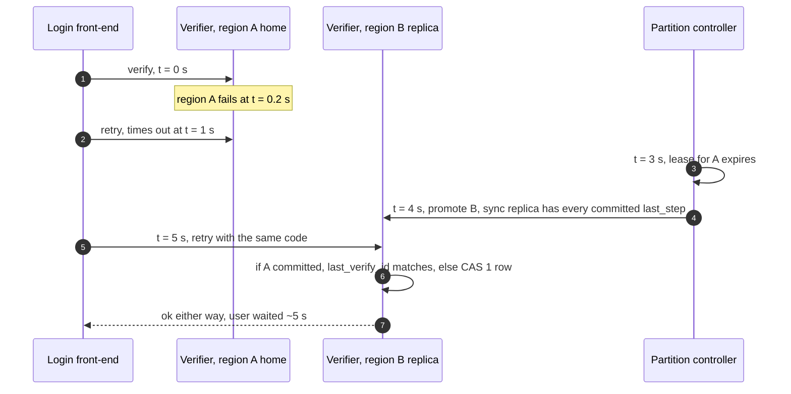

Data at risk: none, because the replica was synchronous. If A had committed before dying, B sees the same `last_verify_id` and still answers `ok`, so the user is not told a correct code was a replay. What the user sees: one slow sign-in. What on-call sees: a region alert and a burst of verify latency, no page for the verifier itself.

**Failure 2: an escrow cluster drops to 3 of 5 HSMs up.** The page fired earlier, at 4 of 5 up. Until repair, recoveries for that cluster still work with 3 up (a majority). If one more fails (2 of 5 up): recoveries for its ~10 M users return "try later". Nothing is lost: records and counters are intact in the remaining HSMs. Users with an old device are unaffected. Repair is replacing hardware and re-joining it in a ceremony, hours to days. Never "fail over to a fresh cluster": a cluster without the counters would refill everyone's guesses.

### 10.5 Exactly-once / idempotency end to end

| Hop | Where duplicates enter | Dedup key | How long it lives |
|---|---|---|---|
| Enrollment | Double-tap "set up" | One `pending` factor per user; a new one replaces the old | 15 min TTL |
| Verify | Same code submitted twice, two racing tabs, 10,000 parallel guesses, or a front-end retry after a lost response | Charge-first conditional increment on `fail_count`, then `last_step < s` conditional write; the login attempt id in `last_verify_id` turns a retry of a committed success into `ok` | Forever (monotonic) |
| Backup code | Same code twice | `used_at IS NULL` conditional write | Forever |
| Item write | Retry after a timeout | `(item_id, rev, hash(ct))`: a byte-identical repeat returns the same `seq`. Two devices that both send rev 4 from rev 3 with different ciphertext: the second gets `409`, never a fake `200` | Life of the item |
| Same QR on two devices | Two scans of one secret | `item_id` is derived from the secret, so both scans are writes to one item; merge by HLC | Life of the item |
| Outbox to Notify | Relay retries | Tickles are idempotent hints; a duplicate costs one extra `GET` | n/a |
| Recovery attempt | Client retries a PAKE message | The HSMs keep one PAKE state per attempt id and decrement once per attempt id; a different first message under the same id is rejected, not treated as a retry | Per attempt |

### 10.6 Consistency model per edge

| Edge | Model |
|---|---|
| App to local vault | Strong (one device, one database) |
| App to Sync API, same device | Read-your-writes: the device sends `since` = the `seq` it was given |
| Sync API to Vault DB | Linearizable per user (one partition leader, one transaction per write) |
| Vault DB to other devices | Eventual, p95 ~10 s while the app is open, next open otherwise |
| Website to verifier to factor store | Strong per factor, home region, synchronous replica |
| Recovery service to HSM cluster | Strong: counter changes need a majority of 5 |
| security-events to alerts | At-least-once, eventual (seconds) |
| Phone clock to verifier clock | Loosely synchronized; ±1 step plus drift absorbs the difference |

### 10.7 Alternatives rejected

| Alternative | Why it looked attractive | Why we rejected it |
|---|---|---|
| Server-side encryption of the vault (what Google ships) | Simplest recovery: sign in and you are back | Account takeover = every second factor (Retool) |
| Passphrase-only E2EE (Ente, Aegis, Authy backup password) | No HSMs, nothing for us to run | Users forget passphrases. A weak one protects an offline-crackable blob. Offered as an option, not the default |
| CBC encryption of items (Authy's backup format) | Widely available | No integrity. An AEAD is the same cost and detects tampering |
| AES-GCM with random 96-bit nonces across devices | Hardware accelerated, NIST-approved | Not because of collisions at our volume: ~10^4 encryptions per vault key gives ~6 x 10^-22 per vault. We prefer XChaCha20 because there is no per-key message budget to track (Aegis's format doc worries about exactly that), a GCM nonce reuse also leaks the authentication key, and phones without AES instructions run ChaCha faster. A FIPS build uses AES-256-GCM |
| A CRDT library for the vault | Merges "for free" | Metadata overhead for ~8 mostly immutable items. LWW-element set is enough |
| Global quorum write per verify | One copy, any region | Every sign-in pays a cross-region trip; home region makes only travelers pay |
| Per-IP rate limiting at the RP | Easy at the edge | Botnets. RFC 4226 §7.3 requires counting across sessions |
| SMS fallback to restore the vault | Familiar | Turns SIM swap into a way into every secret |

### 10.8 How the big companies do it

- **Google Authenticator.** Codes on device since 2010. Sync to the Google Account since 24 April 2023, described as encrypted "in transit and at rest". Time correction removed in 7.0. A newly set up Authenticator "may take up to 7 days" to count as a sign-in option for the Google Account, a cooling-off of its own. Google's Android backups (2018) are the end-to-end counterpart: a client-generated key, wrapped by the lock-screen PIN, released by Titan chips that block access "after too many incorrect attempts".
- **Apple iCloud Keychain.** The model for §5.2: HSM clusters, SRP so the code is never sent, majority agreement on the counter, 10 attempts, record destroyed on the 10th, firmware-change cards destroyed. One difference we choose on purpose: Apple's record is locked "after several failed attempts" and the user "needs to call Apple Support to be granted more attempts". We refuse to have a support path that grants attempts, because it is the social-engineering target (MGM 2023 went through a help desk).
- **Authy (Twilio).** Client-side backup encryption with a backup password: PBKDF2 at 100,000 rounds, AES-256-CBC per account. Multi-device with an "Allow Multi-Device" switch and approval from an existing device. July 2024: an unauthenticated endpoint let attackers confirm which phone numbers had Authy accounts. The secrets were not exposed, the metadata was.
- **Microsoft Authenticator.** Push approval with number matching, enforced from May 2023. The textbook for §5.6.
- **Ente Auth, Aegis.** Open-source E2EE references. Ente: XChaCha20-Poly1305, Argon2id, a 24-word recovery phrase it "cannot provide or regenerate". Aegis: a random master key wrapped in "slots" (password via scrypt N = 2^15, biometric via Android Keystore), the same idea as our device and recovery slots.
- **Google 2SV at scale.** Auto-enabling 2SV for over 150 M people cut account compromises by 50% among them ([Google](https://blog.google/technology/safety-security/reducing-account-hijacking/)). The reason to make enrollment easy, and the reason the recovery path must be harder to attack than the factor it protects.

### 10.9 Operational runbook

- **Dashboards (the 5 metrics):** verify p99 and success rate per RP; sync error rate and `seq` regressions; items failing to decrypt per app version; HSM cluster health (members up per cluster) and recovery outcomes (success, wrong PIN, cancelled, destroyed); alert delivery latency for `recovery_started`.
- **Alerts:** an escrow cluster down to 4 of 5 up pages crypto on-call; decrypt failures > 0.01% pages client on-call and halts rollout; verify success rate drop > 20% in 5 min pages identity; any `seq` regression pages sync.
- **Rollout:** app releases staged 1%, 10%, 50%, 100% over a week, gated on decrypt failures. Backend canary per region. HSM firmware never "rolls out": it is a ceremony with dual control.
- **Rollback:** app: stop the staged rollout, the server keeps 30 days of item history to restore last good revisions. Backend: standard. Escrow policy: no rollback by design.

### 10.10 Security and abuse

- **Auth boundary.** Every vault call carries an OAuth token and a signature from the device key. A stolen token without the device key reads nothing (no slot) and writes nothing (unsigned).
- **What a malicious server can do.** Withhold or delay items, serve old revisions to a new device, drop writes. It cannot read items, swap them between users (AAD), forge a delete (sealed tombstones), insert its own key into a device join (QR) or a recovery (PAKE binding), or swap `recovery_pub` (VK MAC). It can serve a brand-new device (for example right after a recovery) an old vault, and the new device cannot tell. Future hardening: a vault head MACed under VK, `(seq, count, hash of the (item_id, rev) set)`, written by every device, with the latest head also pinned in the escrow record so a recovering device can check it.
- **What a malicious client can do.** Fill its own vault (capped at 1,000 items, 4 KB each), spam recovery starts (each alerts the owner; rate limited per account), guess PINs (10 per record, then destroyed: this is also a denial-of-service, which the 24 h wait and the cancel link make loud).
- **At the RP.** Attempts charged first, a forced password reset after 5 failures (backoff and the 100 cap as backstop), replay detection with a session check, factor secrets under KMS or in an HSM, backup codes hashed.
- **Phishing.** Not solved by TOTP or push (§5.6). Say so; point at passkeys.

### 10.11 Evolution

- **Push approval** is §5.6: a push-auth service, signing keys per device, number matching.
- **Passkeys.** The app becomes a passkey provider. The vault already holds secrets under VK; a passkey is one more item type. That gives phishing resistance without a new sync design. NIST allows synced passkeys at AAL2 (Appendix B), not AAL3. A passkey stored in this vault must not count as the "second way in" for the account that holds this vault (§5.2), for the same circular reason.
- **Data residency.** Partition by `user_id` with a country tag; vault shards and escrow clusters placed per region. Only the escrow clusters are hard to move, because the cluster key never leaves its HSMs.
- **Enterprise.** Admin policy that forbids sync for work accounts, or requires escrow to an enterprise HSM. The slot model takes another slot type without changing items.
- **10x users.** Vault and verifier scale by adding shards. Escrow scales by adding clusters (~100 at 1 B users), which is the line item to plan a year ahead.

---

## 11. Follow-up questions to expect

Ranked by how likely an interviewer asks them.

1. "How does the phone's code match the server's without any network?" TOTP, §4.2, §10.1. [Deep dive](deep-dives/totp-algorithm-and-clock-drift.md).
2. "The user's phone clock is 2 minutes off. What happens?" §5.3, [edge cases](edge-cases.md).
3. "Someone shoulder-surfs the code and types it 10 s later. Or guesses all 10^6." §5.4.
4. "The user loses the phone. Now what?" §4.5, §5.2. [Deep dive](deep-dives/recovery-and-hsm-escrow.md).
5. "Can Google read my secrets? Can someone who phishes my Google password?" §5.1. [Deep dive](deep-dives/vault-encryption-and-key-hierarchy.md).
6. "Two devices edit the vault offline." §5.5. [Deep dive](deep-dives/multi-device-sync-and-conflicts.md).
7. "Add push approval. Does it stop phishing?" §5.6. [Deep dive](deep-dives/push-approval-and-phishing.md).
8. "How does the website store the secret, given it cannot hash it?" §5.4. [Deep dive](deep-dives/server-side-verification.md).
9. "Sign-ins arrive in two regions within a second with the same code." §5.4, §10.4.
10. "Where is the load? What breaks first at 10x?" §2, §5.7, §10.3.
11. "How do you migrate 100 M users from server-held keys to end to end without locking anyone out?" §8.
