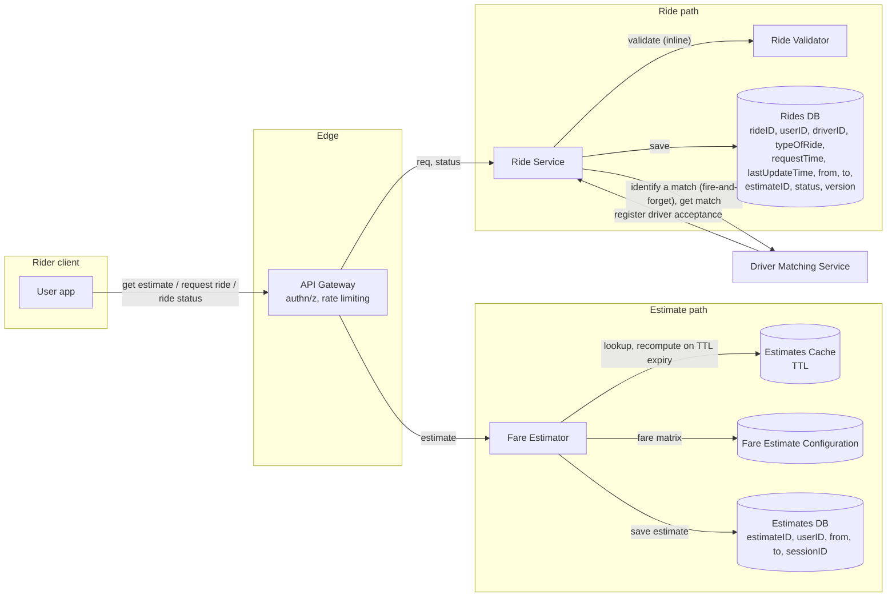
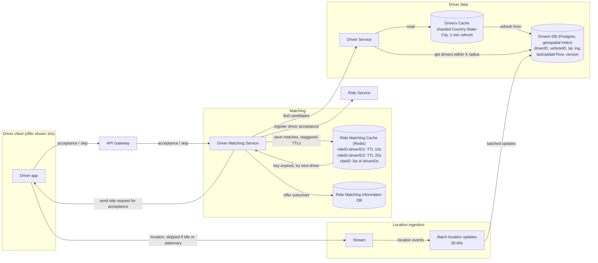
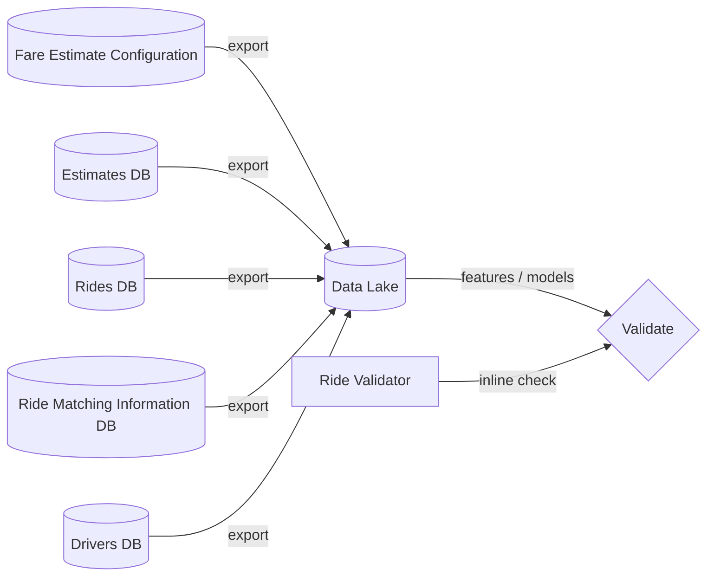
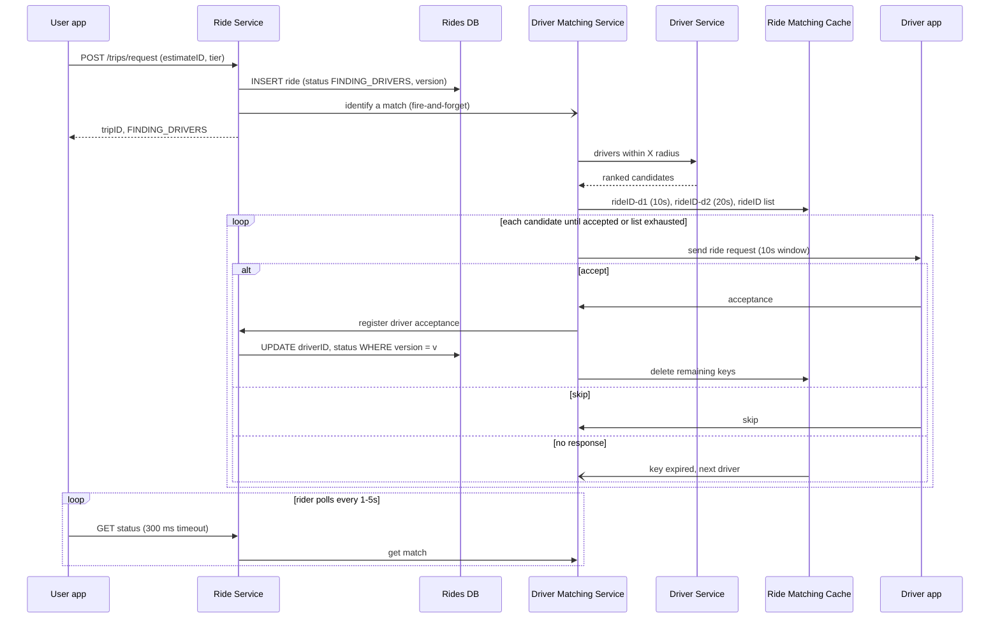
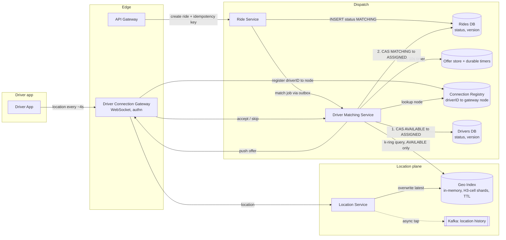

# Mock Round — Uber / Ride-Hailing (Session 1, 2026-09-22)

**Format:** self-run, recorded, graded from transcript + Excalidraw canvas (transcript review, so no probe credit; see `rubric.md` §4).
**Length:** ~6,100 words spoken, about 45–55 min with drawing. Part 1 (requirements, entities, APIs) ended at a break ~29% of the way through; part 2 was the HLD.

---

# Part 1 — The round as presented

## Transcript (cleaned)

So, we will be practicing Uber design, practicing the design of building an Uber-like system. So basically, we will be building a ride-sharing system, Uber or a ride-sharing system. So here, the main goal is to allow users to place rides and drivers to accept the rides. So this is basically the first preliminary problem statement. So we will put the problem statement here.

So first, I think we will start with the functional requirements and then the non-functional requirements. So we will first start with the functional requirements. Just a minute, we will put all the headings here. We'll have the functional requirements, we'll have the non-functional requirements, then we will also talk about the core entity. And I think within the non-functional requirements, we'll also talk about the scale, but I think that will come in there only. So, we will also talk about APIs, and then we will also talk about the flow after that.

Yeah. So basically, we will now first start with the functional requirements. So firstly, the functional requirement is: users should be able to place the ride request from a source to a destination. Then the system should identify matching drivers, and the system should provide the fare estimate along with a possible fare estimate. Then users should be able to request a ride.

Then systems should be able to—I think we will just—so, first, users will be able to place the ride request, and then we calculate the fare estimate and show that this is the one. Then users should be able to confirm the ride, and for the user, the system should match with the driver. The driver should be able to accept. So this is the whole flow.

I think there can be many other flows that are there. I think payments and everything we can go into, but I don't want to—we will not have much time to do that. So, that's why we will restrict ourselves to this one.

So firstly, availability is much more important than consistency here. Right now, what we are trying to do is, when I say consistency, here we are talking about two types of consistency. So availability is basically whenever you are able to, you should be able to search for the ride request, the fare estimate, et cetera. It has to come very fast, and it should be highly available.

So, in terms of exploring or placing the ride itself, we should have high availability rather than consistency. But driver's acceptance should be highly consistent, meaning only one driver should be allocated. So this is where we need strong consistency in terms of driver acceptance.

So, within the same system, we have two different consistency levels for two different functionalities. So that is the thing. And matching latency should be less than, let's say, 400 milliseconds, or let's say 200 milliseconds. So matching should be very fast, and any latency which is confirming the ride request and matching latency and all of these things should be less than 200 milliseconds.

So basically, I think we can say that latency should be less than 200, or I think we can take it to a maximum of 300 milliseconds. So latency, we will say, and it should be able to support a billion users per day. Okay, a billion users is maybe a very high amount. Maybe we can say 100 million users per day. And so this is one. And then, look, if there is any burst of traffic, I think we should be able to support that as well—support burst traffic.

So, these are the basic non-functional requirements that we have. Then we will go into the core entities.

So, within the core entities, we will have users who will be classified into riders and drivers. So this is the one. And then, after the user, we have rides, which are basically—I think we can have a status. Basically, we will have a ride only. I think, can fare estimate be an entity? No. Ride is an entity, definitely.

Users also—it is like two different types of entities: riders and drivers. So this is one. I think what we can say is vehicle needed, or I think vehicles might be needed. So let us put it as vehicles. So this also might be required.

Generally, basically, driver to vehicle, we will have a one-to-one relationship. But I definitely think that a driver can switch from one vehicle to another, and we need to make sure that we are able to capture those details. So that is why I think we will have—

And apart from that, APIs: basically, first, GET `/trips/estimate`, where the query will be `from` equal to something and `to` equal to something. So here, this is a GET. So basically, we will say that the headers will have the user ID for validation, and then the response will contain the best possible price and time taken.

Okay, so this is, like, I think this is the one. And at that price, I think we need to be able to POST. So `/trips/request` is one thing, where again, the header has the user ID. And then response—I think one thing is that every estimate can be given an ID. This can be helpful for us when we want to match why this particular estimate has been given in this particular way, like how this ride, like, we can correlate the relationship between the ride and the estimate.

So, whatever the time taken is, and even if the cost is efficient and the cost calculation is correct or not, maybe that is why we might need the estimate ID that we have given, so that we will be able to adhere to that particular price and time.

Then the request. Okay, so in the request, since it's a POST request, in the body we need to send the type of the vehicle. Okay? I think the estimate is the best possible price. I think we will have tiers, which is basically a list, and it contains the—

Going back, actually, in the estimate also we will contain the best possible price and the tier type, basically the name, and the time taken is common for all. So this is the one, and the estimate ID, the type of the tier—basically, tier is what we will be showing. And then, what is this?

So, estimate ID we will be sending, and also the `from` and `to` locations. So these are the things. And within the response, I think we will quickly give the response as accepted or finding drivers. But we will have something like a GET trip state. So this is like a trip ID is required. So we will say that trip ID is present here, and yes: accepted, drivers, and finding—or finding drivers.

So status will be, like, accepted or something like finding drivers or something like that, because we are actually not able to close the loop here. So I believe we should also have a common poll, or a GET, or a WebSocket. I think we can use the WebSocket also. We can do that.

So basically, we will have the GET. So, it is like the driver is being found, or whatever that is there. So maybe instead of status, I think status can be a long-running one. So we can say it is a status, or I think in the status also we can put it.

So basically, in the GET, the same header is sent with the user ID, and then in the response we can have the actual status and the metadata. Based on the metadata, the things will be rendered, like the driver has accepted, the driver data, et cetera, will be contained if the status is—

So, the metadata will contain driver and vehicle information if the driver has accepted, and also an in-progress status. But if the status is completed, then also we need this information, but different additional metadata is also present.

So I think this is what the GET will have. And yeah, while the status is being based, I think what we will do is, for the drivers to accept, basically we will have a WebSocket here, which actually sends this information. So it will say that the trip ID—okay, I think WebSocket, because it is a WebSocket instead.

Of saying “get typing,” it’s like accept or something, I don’t remember it. We should read about it as well. But yeah, trip, so it should be like the body would be the response. Like, if I treat it like a simple REST, so it will be like in the response, you will get all the trip details: from where to where, etc., fare estimate, fare estimate that was given or accepted. So, this is what we will get, and then driver can say trips/trip_id/accept_trip is the status.

So, here again, the header will be there, the user ID is there, and then the body—we will have things in the body. It should be—the user ID is okay. I think maybe one thing we should do is the vehicle ID is one thing that we need to put in the body, and the response is like status of the trip, details of the rider, etcetera. So, these are the few things that will be there.

So, accept trip, and then basically we will try to, once you enter Uber, place a request by selecting the from and the to where you want to get the estimate. Once you see the estimate for different types, so yeah, I think the get details, which also includes the tier or type of vehicle request, vehicle request like that, the one that we earlier talked about. So, basically the tier, fare estimate, and so this is the status that we also—so basically we will have an estimate. Then the user selects, like, they look at the processable price and then take a tier and select it as a set, the board, click on the send button, accept button, and then it will be sent. It confirms that the trip ID has been created, and we are trying to find the drivers. The trip status is the one that holds continuously, and based on the driver who is selected, that information is shown.

Then, coming to the driver side, these trips, I think over the WebSocket only, we will try to fetch this particular trip data also, and then we will showcase the—and then all the details are shown, and through a POST update, the trip will be accepted. So, this is how, on a high level, the requests or APIs are actually made. So, this is the thing. I think I’ll take a break, and then I’ll come back.

Okay, I am back. So, basically, we will start off with the user, and then we will go in the order of placing the request. First, the user, when he wants to, when he comes to the app and then places a request for a ride, or let’s say he types in any from or to destination, the request first reaches our API Gateway.

API Gateway is just the front end where the first level of defense, where all authorizations actually happen, and also the rate limiting and other things, like rate limiting, routing, etc. All of these things happen. So, that’s where the first boundary or the edge that we have is. The user actually makes the request to the API Gateway, and then let’s say we have internally a service called the ride service.

Okay, ride service, or we can say there are two services. Maybe we can say, first, directly fare service itself, fare estimator, or fare service itself. Fare estimator is what we will have. From and to. So, basically, the fare estimator, let’s say it has the fare estimate API. It will have some kind of a DB based on which it has already, let’s say, fare matrix kind of a DB. Within this particular region, what are the different—so it is like an ML. It can be an ML one, or it can be a fixed configuration. It can be anything.

So, basically, it will be a DB kind of a thing where it has this information about how a fare has to be calculated. So, the matrix will be there, or some kind of a configuration is there. Let us say, simply for now, we can say that if it is coming in this particular region from a particular, like within a particular city, etc., per kilometer, we calculate the distance and then say that, okay, this is some matrix.

So, like that, say we have some configuration like that. So, fare estimate configuration or something like that we have. Estimate configuration or something like that we have it, and then it just simply uses this information. Maybe we even have a Redis cache in between, but it just responds back because this is a very high-volume request. I think we can also have a cache that is there on top of it. A thin cache can also be there. Estimate cache, estimate cache can be there.

So, the fare estimator, whenever it is there, will try to first fetch the information from the fare estimate configuration, try to do it, and then if it is present, it is okay. If it is not present, then it will go to the fare estimate. It will have a refresh time. So, basically, every cache key can have the TTL, and based on that TTL, we will be able to identify if the TTL has expired. TTL expired, no key, so basically we will go to the configuration and rework it.

So, this is how it is. And then the estimate, get estimate, is the one that they have made a call to. And then when the estimate is done, so basically we will place a request. The user will place a request for ride, request ride. So, in this particular case, the request will land in a service called, let’s say, a ride service.

So, basically, a ride service. This is like you create a ride, and so this is like a request. The ride service will have a DB, let’s say the RidesDB. RidesDB, which is basically like the ride ID. Every time it is created, the user ID, the request time, the first thing, and then last modified or update time. We will have an OCC-based version control, and from and to. We will also have estimate details here.

So, basically, I think what we have discussed is that we will store the estimate ID, right? So, we will have an estimates configuration. I think we’ve got that, estimates DB. So, basically, this whole information, after the calculation for that particular ride or particular session, we have calculated this estimate ID. Basically, it will have the estimate ID, user ID, from, to, and a session. So, basically, we will have a session ID or some key, some unique key.

So, the estimate ID is simply like the session key, and the from and to, basically, so you can keep like that, something like that uniquely. I think every estimate need not be—maybe we can say version. I think right now version can be ignored as well.

So, let’s say this is there. Estimates DB, using the estimates DB, we will have that information, and fare estimate configuration is also there. So, these two DBs are there. The estimate ID is actually saved in the ride DB.

Coming back to it, so that we can also say that, okay, this is the thing. Within the ride ID, the request time, and we also thought that, okay, type of ride, basically, is it an XL or is it something like that, log, from, to. Then we will also have an OCC control through the version column. So, this is the RidesDB that is there.

Basically, whenever you make a request, you quickly place a request for the ride ID. You quickly save the information, and then the ride service—let’s say there is another driver matching service. Another service called the driver matching service.

Basically, driver matching can take some time. So, that’s why what we can do is that the ride service will just fire off for this particular driver matching service that we need to find the driver for this particular ride. At that time, I think the ride status is the next call that we have done, right? So, this particular thing, I think we can—

We have the ride service only, which will also be doing this, but when the status is still within the—when the status is still like, okay, waiting for the driver—you quickly go to the driver matching service. So, by the time after the request, we have immediately placed the driver matching service request, so it is actually working on its own side. So, it is like a—we make two kinds of calls. One is, “Identify a match,” okay? Identify a match, and then the other request is like, okay, “Get the match,” okay?

So, basically, why is this needed? The thing is that we identify matches, but the match has to actually happen, right? And it should be accepted also. So, basically, what we are trying to do here is, the driver matching service will identify multiple matches one after the other.

Within a Redis cluster, it can fire a request and then say that some consumer—okay, so let’s say what you can do is that we will have a Redis cluster, okay, here: Redis, sorry, driver. Whenever the driver matching service gets the request for the matching first, you will have a driver matching that is present here, and then there will be a subscriber. So, there will be a consumer for this matching service. The consumer itself may be the driver matching service; it might be the consumer as well.

Basically, what will happen is, it will place a request and then say that I am the consumer for this particular matching request. So, it will wait for the match to happen. So, how will the match happen? First, I will identify that these are the matches, and then I will save matches, okay? So, first, every match will have a TTL, one after the other, let’s say based on the driver location, driver rating, and other things.

So, basically, I think first what we need is the driver service is also required. So, the driver service is also required. The driver service will have—give me—we will have a DB for the drivers, okay, drivers DB.

Basically, what it will do is that it will search for the driver from within a location. Let’s say it will have the driver ID and the vehicle ID, and let’s say current location may be in terms of some kind of latitude and longitude. It will have the last update time and, like, version for any OCC control and all of this.

So, basically, within a particular location, we will try to fetch. So, how do we fetch? Within the current location, we can have a geospatial index. There are several geospatial-index-supporting DBs. Postgres supports it, and even Redis also supports it.

So, basically, what you can do is that, first, location—we can create a shard for Redis and then save all of those drivers in that particular location, in that particular radius, and the geospatial index can be applied inside that. So, within a particular region, let’s say we say that, okay, radius is there, we create this Redis cache where every region, like in North America, within the country, within the state, we will shard it like that till some big boundary, like a—and inside that, we will try to put all these drivers, and they have a geospatial index. It can be geohash or it can be the quadtree, whatever that DB supports. We can shard it like that and then make a—

That is one alternative. The second alternative is to use the Postgres DB itself. So, for now, simply we can make a call that this is a Postgres DB. We are having this driver vehicle information inside this Postgres DB, and that also has a geospatial index right now. So, we are putting that information, and the query is, using geospatial index, get drivers within X radius, is what we will try to make a call.

Then, that driver information, whatever we get, the driver service will give it back to the driver matching service. Then, within this particular cache for a particular ride ID, we will have a list of all the matches.

Basically, what it will do, it will say this is the driver ID, like waiting at the time. So, it can say that it will put, like, a key with an expiry. Basically, it will say ride ID-driver ID, driver ID, and will put a TTL of 10 seconds. Then, let’s say the next driver will get a driver ID 2 with 20 seconds as the expiry, so on like this.

Also, along with that, we will maintain a ride ID cache as ride ID with a list of all the driver ID details as well, so that we can remove these keys. Again, unnecessary processing—the processing clearly we can remove that. So, we can store this.

There are two sets of information: one, uniquely ride ID-driver ID, 10 seconds. We will have these keys and put them in the Redis cache. Then, each ride ID, we will have this set of driver IDs, so that we can recompute these keys and then delete if a particular driver actually accepts it.

At this particular case, what happens is, when the customer—the user—makes the ride status request, the status happens and the ride service gets this request for getting the match. It will try to query these.

The save matches will happen like this. The matches will be like, okay, for this particular ride ID, this is the driver ID and 10 seconds, and this is how it will happen. Per ride, it is actually hashed, and ride ID-driver ID is also the hash that is there.

And we listen to that particular... So, basically, per ride, we will hash it and then store it in this ride in this way, and then we will try to get the match.

So, what will happen? Whenever this request has been made, the consumer will actually—the driver matching service will actually send a request to the driver, okay? So, the driver matching service, one at a time—that’s where the 10 seconds is actually coming.

First, when the request actually comes, “Identify a match,” you insert all these matches, and for the first driver, we send a request. We will wait for 10 seconds and see if the driver hasn’t accepted within that. Then, we send the request to the next driver.

So, what we do is that this is like “send ride request,” “send ride request or acceptance,” or something like that. Per acceptance or something like that, we will send the driver matching service. This will happen one after the other.

Within the driver app also, the driver-side client will ensure that a ride—it has come—it will be shown only 10 seconds or something. That is a configuration one. So, this is why this is how it will be shown. That’s why the client also will not be like, okay, the button will not be shown forever.

That’s how it is. Even the cancellation, like the non-acceptance or acceptance, we will have two APIs, which is basically acceptance or, within that, non-acceptance. If it is acceptance, I think what we can do is we can have two APIs. That is better, actually. One API operating in two modes is not good. So, acceptance and skip API.

Both of these will actually reach the driver matching service. If the skip API comes, then it will say that, okay, this is not going to work. So, it will find the next driver ID using this ride ID, and then it will send the request for the next driver, if at all there is no acceptance or no skip for anything.

So, this 10-second key actually gets completed, and then that invokes the same thing: that we need to send the request to the next driver. It will do the same thing for the ride ID. It will pick up the ride ID, it will see which is the driver that is there in the loop next, and then it will call that particular driver.

How does it know what is the next driver? Basically, in the DB we already have that ride ID.

And the driver ID, right? So this is simply just the next driver that is there after the current driver ID is what we will be picking up. So that's how it is.

We will send, and then again, if the acceptance comes within the 10 seconds, then it is fine. If not, then it is different. But when the acceptance actually comes, what happens is it will go and say, say that driver accepted API or register driver acceptance or something like that in the ride services. Register driver acceptance as an API. That comes, so this way you will know that these many driver acceptances have actually happened and all of these things.

The same thing with ride matching, we can also save it in a DB as well. The ride matching information DB can also be saved in a separate thing so that we can analyze which driver, how are they accepting things, are they accepting only for a high value—all of these analytics clearly we can do that. So for that, we need to capture that information.

This is the ride matching service information DB, which is also there for that purpose. Basically, we will close the loop once again. So what happens? You get the estimate, you request the ride, and when it happens, you identify, you paste it, like you—we save it. The ride service saves it in the ride DB and then sends a request for identify match.

This is like a fire-and-forget kind of a thing, and then a response back to the user with driver in progress, driver acceptance in progress, or finding drivers kind of a thing. The user-side app will actually try every five seconds or every one second or so to get the ride status.

And in the ride status, if the status is basically finding driver, we will go and try to get the match for that particular ride. So that is actually the driver matching service only.

The driver matching service, within the identify match, basically saves—it will try to use the driver service to identify who are all the nearest ones, and then it will apply some kind of ranking and something. Then it will save all the matches in an order.

The order also is through key expiry that Redis supports: ride ID-hyphen-driver ID. The first one will have 10 seconds; the second one will have 20 seconds, saying that we are giving a 10-second buffer for a driver to accept that particular request. In that way, we will save it.

Also, along with that, we will say that this is the ride ID, and these are all the drivers that we have, so that we can ensure that when the driver actually accepts, you remove all the keys that are actually going to be expired or the ones that are already present. This way, we will make sure.

The same copy we can also keep in the ride matching information as well and say that a particular driver has accepted, not responded, skipped, and/or did not even reach there. These are the things, these are the ways that we will save this information so that it can help us in our analytics.

Once the driver has actually sent, we will try to say that within this registered driver acceptance, we will have a validation of whether this particular ride and driver has already been updated or not.

So here, what we will ensure is, this is where the OCC version actually comes into picture. We will store the driver ID along with this particular user ID, along with this ride ID. There we will see that, okay, version is 10 for that particular ride, and then we have updated it with driver ID 1.

Let's say it is just at the end of this 10-second expiry that we got acceptances from both the drivers. We will ensure that the second driver doesn't accept and only one driver is actually sent. So even after acceptance also, we can say that, okay, some other driver has already registered.

The driver matching service will say on acceptance that some other driver has actually beaten you. So let us wait for another service.

Now, the point that we have to discuss is how this driver service itself is. The driver service is actually making a query through the driver's DB. But what we can also do is have a Redis cache, which actually supports another geospatial index.

This driver cache is basically sharded with respect to country, state, and in some cases even city as well, so that this information is present in a particular—like, this is how the sharding happens. The driver service will directly make a call to the cache and see when the last update time, last fetch time, for this particular driver information is.

Every particular driver, let's say, if he is moving at even 60 kilometers per hour, one minute is equal to one kilometer. Let's say our radius of a particular geospatial index itself is one kilometer. You don't need to worry about updating the driver unless and until it is one minute. So every entry will have its own update of one-minute refresh. That way, we will make sure that we will always have the latest driver data as well.

Along with this, first we have a way to save the information, we have a way to get the information, and we have a way to cache the information. But we did not yet talk about how we are getting the status of the driver, where they are actually present.

Basically, here is where, again, we talked about a service called—we talked about the WebSocket. The WebSocket will actually make a request to the driver service. Before even making a request to the driver service, all these WebSockets can be fronted.

Let's say we want to get this information every 30 seconds or every 10 seconds or so. If we have 1 million active drivers, then within a minute we will have 1 million into—every 10 seconds is like 6 million requests, right? I think even more than that will be there. The drivers and riders will almost match, like 100 million; then you will have 600 million requests.

So how are we going to manage this? What we will be doing is, we can have a Kafka where each driver can save this information. But I think even Kafka will also be overwhelmed with this kind of information.

There are two things. Firstly, whatever the geohash that we were talking about earlier, as long as the distance from the previous one is, let's say, if the driver is not active, then we don't even poll. The second thing is, if the driver is not moving, then also we don't send the poll.

These are the few optimizations that we will do at the client side. Then, when we are doing it at the server's end, what we can do is stream this information into a queue or something. Even Kafka is also fine, I think, because this is a smaller one only.

After those optimizations, we will stream this information and then batch it over a minute or so, over 30 seconds or so, and then send it. Batch the information, batch the location information, and then send it and update the driver's DB.

This way, we will not be making many calls to the driver's DB itself. Based on how much it has changed and all of those things, all of that tuning, we can get that information. The lag will be there, depending on the driver's availability or depending on the number of requests that we are getting and all of those things.

We can increase or decrease this adaptively. We can increase or decrease this batching so that the lag is not there.

Right, so that is what I am thinking. This way, the data reaches the driver's DB, or their Postgres or something that supports the geospatial index. This is how it is, and we can use the same Postgres itself for all of these things. That way, we will ensure that there is some relationship between the estimate and the ride, the driver and the ride, and the ride and the vehicle.

The vehicle is also there, so vehicle is just like a registration. You will register a vehicle and the driver, and that's what you will put in the DB. So, maybe within the driver service also, we can have a register vehicle information API or something that will help us here. We discussed this, which is why I was just mentioning it again.

Overall, this is how we will try to plan the thing. So, for less than 100–300 milliseconds, I think the estimates are easily doable because they are already present at the configuration level and are also present in the cache for a similar request that we have made. So, 300 milliseconds is easily doable.

The second thing is the rides. We are just reading, writing, and then putting a request to the driver matching service, and that's it. So, it is also going to be less than 300 milliseconds. Similarly, for the get status, we are just polling it and having a timeout of 300 milliseconds. So, we will be ensured that, okay, if we are getting the status, it's fine. If not, we will just respond back with, like, “Still finding the driver,” and that is what we are, in fact, doing.

So, this is the thing. Then again, the acceptance is also the same thing. We actually found a match, and then we are registering the driver acceptance and saving that information. Even the rides data can be saved in a cache because it is bound to happen that the ride status is going to come again and again. The request for that ride status is going to come again and again, so we can also have a rides cache.

So, this is much more like the rides DB. Rides is the shard key that can be not sharded, basically the hash key. You will be saving it across all of these Postgres instances that are there, multiple Postgres instances that are there. So, I think that way also you will be able to do it.

This is a few of the things that I wanted to discuss. This is how we can design Uber, a simple one. Within this, we can also make sure that we can add a ride validator. The ride validator is there, so it will analyze this particular user and all of those separate, different things where an ML model actually takes care of all of that information. Let us say it validates this stuff.

For all of this data and analytics, let us say we have some data lake, right? All of this information is present in some data lake, so that all of this information from different dimensions can be used for analysis and to improve the ride-sharing experience. There are multiple such data that can be analyzed, so all of this will be present in the data lake.

This is, at a high level, how I think that we will be able to do it. This data lake is going to feed the validator, and then the validator is actually going to validate this way, validate a particular ride. So, yes, I think we need to have validations at multiple stages, but for now, I think we have a good enough discussion on the whole thing.

So, yes, this is how I plan to build or design an Uber kind of a service.

## Requirements as presented

**Functional**
- Rider gets a fare estimate from source to destination, per tier.
- Rider confirms and requests a ride.
- System matches the ride to a driver; driver accepts (skip added in the HLD).
- Out of scope: payments.

**Non-functional**
- Availability over consistency for estimates and ride placement.
- Strong consistency for driver acceptance: only one driver allocated per ride.
- Latency < 200–300 ms, including "matching latency".
- 100M users/day (revised down from 1B); handle traffic bursts.

## Core entities as presented

- Users: {Riders, Drivers}
- Rides
- Vehicles (driver can switch vehicles, so kept separate from Driver)

## APIs as presented

| API | Request | Response |
|---|---|---|
| `GET /trips/estimate?from=&to=` | header: userID | `estimateID`, tiers `[{tier, price}]`, ETA |
| `POST /trips/request` | header: userID; body: `estimateID`, tier, from, to | `tripID`, status `ACCEPTED \| FINDING_DRIVERS` |
| `GET /trips/{tripID}/status` (rider polls every 1–5s) | header: userID | status + metadata (driver, vehicle once accepted) |
| Driver WebSocket push | offer: trip details, fare estimate | — |
| `POST /trips/{tripID}/accept` | header: userID; body: `vehicleID` | trip status, rider details |
| Skip (driver) | tripID | — |

## Design as presented (transcribed from the Excalidraw canvas)

### Estimate and ride-request path

**What to notice**
- Clean split: estimate, ride, and matching are separate services, each owning its store.
- `Rides DB` carries `status` and `version`: the OCC guard is on the ride row.
- `identify a match` is fire-and-forget with no queue or outbox between Ride Service and the matcher.
- The rider's status poll reaches the matcher through `get match`.
- Ride Validator sits inline on the create path.

### Matching and location path

**What to notice**
- `Drivers DB` has `version` but **no status**, and nothing CASes it on accept. This is the Soft Sink.
- The offer goes from the matcher straight to the driver: there is no connection gateway or registry.
- Offer sequencing depends on Redis key-expiry events (`RMC → DMS`).
- The location stream bypasses the API Gateway.
- Freshest location is two hops from the matcher (batch → Postgres → 1-min cache).

### Analytics and validation

**What to notice**
- Five stores feed the lake with no pipeline named (CDC, batch export, or Kafka).
- The validator's model sits behind an inline call on ride creation, with no timeout or fail-open/closed policy.
- This area took about a third of the canvas and the last ~4% of the session, outside the crux.

### Ride request to match, as presented

**What to notice**
- The OCC `UPDATE` protects the ride, so two drivers can't both win one ride (this race was raised unprompted).
- Nothing protects the driver, so one driver can win two rides.
- "List exhausted" has no terminal state.
- If the fire-and-forget or the matcher is lost, the trip stays `FINDING_DRIVERS`.

---

# Part 2 — Grading

Graded against `rubric.md` (2026-09-22 revision). Transcript review: two-track verdict per §4.

## 60-minute Staff-hire anchor

1. The crux named early: location ingestion plus proximity search, and exactly-once assignment in both directions (one driver per ride **and** one ride per driver).
2. Numbers that change choices: ~5M drivers online pinging every ~4s → ~1M location writes/s → in-memory geo index sharded by cell (H3/geohash) with TTL. Ride creates are ~1–10K/s, about 1,000× fewer, so the trip store is not the bottleneck.
3. Announced deep dive on matching: k-ring search ranked by ETA, sequential offers with a ~10–15s timeout, driver lock (CAS or `SET NX PX`), late-accept handling, durable matcher state.
4. Offer push over a persistent connection with a connection registry; rider status by push or poll.
5. Out of scope with hook points: payments, surge internals, routing/ETA, pooling, ratings.

## Dimension scores

| Dim | Score | Evidence |
|---|---|---|
| D1 Framing | **2.5** | Consistency split by function is a real Staff signal. The crux surfaced in the HLD rather than being named up front; the 200 ms matching NFR was never reconciled; only payments scoped out; ended on validator/data lake. |
| D2 Numbers | **2** | First number at 84% of the way through (1M drivers / 10s), and it did drive Kafka plus batching, but with a unit slip (6M/min stated as a rate) and a jump to 100M drivers. "60 km/h ≈ 1 km/min → 1-min refresh" changed a choice in the wrong direction. No ride QPS or storage. |
| D3 Depth | **2.5** | Real matching mechanism: ranked list, sequential offers, 10s window mirrored on the client, separate accept/skip APIs, OCC on the ride row, outcome logging. Not announced; built on expiry events; driver lock missing. Location at medium depth with the wrong source of truth. |
| D4 Failure modes | **2.5** | Two-drivers-at-the-boundary race and poll-timeout fallback raised unprompted. No matcher crash, lost expiry events, list exhaustion, rider cancel, or driver disconnect. |
| D5 Drive | **2.5** | Drove the whole session with a clear structure and closed the loop twice. Monologue with no checkpoints; reversals (Postgres vs Redis for geo, 1M vs 100M drivers, estimate "not an entity" then an Estimates DB); "basically" ×53, "I think" ×47. |

## Sink / Notch gaps

**Soft Sink — driver double-assignment**
- `Drivers DB` has no availability status, so on-trip drivers come back as candidates, and OCC guards only the ride row. One driver can accept two rides.
- Soft (rubric §3): OCC with `version` is already used on the ride row; `version` already sits on the driver row; "same driver, two rides?" surfaces it.
- Fix: on accept, CAS the driver row `AVAILABLE → ASSIGNED` with its version, then CAS the ride row; if the ride CAS loses, release the driver.

**Notch 1 — matching state machine (one cluster)**
- Redis keyspace notifications are fire-and-forget pub/sub and expiry can fire late, so offers can stall or be skipped.
- Staggered TTLs are precomputed and don't shift when a driver skips early.
- Nothing is durable: a lost fire-and-forget or a matcher crash strands the trip. `Ride Matching Information DB` already exists and could hold this state.
- No connection registry for pushing offers to the right socket node.

**Notch 2 — location path inverted**
- Postgres as source of truth, fed by 30–60s batches, with a Redis cache refreshed every minute: up to ~2 min stale, about 1 km at 60 km/h.
- Latest location belongs in the in-memory geo index, written directly, with Kafka as a history tap.
- Country/state/city shards create hot metros and cross-shard radius queries; cell-based shards avoid both.

**Notch 3 — numbers late**
- The ~100K writes/s math should have come around minute 8 and ruled out Postgres before it was drawn.

**Notch 4 — latency NFR misframed**
- 200 ms can't hold for a match that needs a human to accept; the async design contradicts the NFR it was stated under.

## Verdict

| Track | Staff | Senior |
|---|---|---|
| As presented | **No hire** (Soft Sink) | **No hire** (Soft Sink) |
| Projected live (Soft Sink converged) | **Lean no hire** — D2 = 2 blocks | **Hire** |

**The one change:** open with the location math (~1M writes/s vs ~5K creates/s), name the crux from it, and announce matching as the deep dive. That takes D1 and D2 to 3 and moves projected live to Staff **lean hire**.

## Canvas review

| # | Observation | Effect |
|---|---|---|
| 1 | `Drivers DB` schema has no `status` | The Soft Sink is visible in the schema in seconds |
| 2 | Offer edge goes matcher → driver with no gateway/registry | Confirms Notch 1 |
| 3 | Location stream bypasses the API Gateway | No authn on the highest-QPS path; GPS spoofing risk |
| 4 | `Ride Matching Information DB` only feeds analytics | Quick win: make it the durable offer store |
| 5 | Ride Validator inline on create | Counts against the <300 ms create target; no timeout policy |
| 6 | No numbers box, no out-of-scope box | The interviewer re-reads the canvas when writing feedback |
| 7 | ~20 nodes; Data Lake and Validate take ~⅓ of the canvas | The eye lands on analytics, not dispatch |

## Corrected dispatch core (anchor answer)

**What to notice**
- The two numbered CAS edges are the whole Soft Sink fix: driver first, then ride, release on loss.
- Latest location goes straight to memory; Kafka is a side tap.
- Offer timers are durable, not Redis key expiry.
- The registry is what lets any matcher reach any driver's socket.
- Validator, data lake, and fares are left off: not on the crux.

## Full gap tracker

| # | Gap | Bucket | Probe likely to surface it? |
|---|---|---|---|
| 1 | No driver status / driver-side CAS → double assignment | **Soft Sink** | Yes, very likely |
| 2 | Matching driven by Redis expiry events; precomputed TTL schedule | Notch (cluster) | Yes |
| 3 | No durability: lost fire-and-forget or matcher crash strands the trip | Notch (cluster) | Yes |
| 4 | No connection registry for offer push | Notch (cluster) | Likely |
| 5 | Location: Postgres as source of truth, batched, ~1–2 min stale | Notch | Yes |
| 6 | Geo sharding by country/state: hot shards, boundary queries | Notch (with #5) | Likely |
| 7 | Numbers late; 6M/min vs 100K/s slip; no ride QPS | Notch | Yes |
| 8 | 200 ms matching NFR never reconciled with async match | Notch | Yes |
| 9 | Candidate list exhausted → no `NO_DRIVERS` / radius expansion | Unnoticed | Maybe |
| 10 | Rider cancels mid-match; offers keep going out | Unnoticed | Maybe |
| 11 | Rider status poll calls the matcher instead of reading ride row/cache | Unnoticed | Unlikely |
| 12 | Fare cache keyed on exact from/to; no map/ETA service | Unnoticed | Maybe |
| 13 | Estimate expiry and validation at request time (price tampering) | Unnoticed | Unlikely |
| 14 | No idempotency key on ride request | Unnoticed | Unlikely |
| 15 | User ID from a header, not an auth token | Unnoticed | Unlikely |
| 16 | Location stream unauthenticated (bypasses gateway) | Unnoticed | Unlikely |
| 17 | Ride Validator inline with no timeout / fail policy | Unnoticed | Maybe |
| 18 | Vehicles entity not drawn; data-lake pipeline unlabelled | Unnoticed | Unlikely |
| 19 | Validator / data lake: breadth over depth at the end | Counted inside D1/D5 | — |

## Calibration discussion

- The candidate argued the double-assignment gap was a slip under load, not a knowledge gap: the OCC mechanism was already on the board. That was right, and it led to the Soft Sink rule in `rubric.md`.
- Applying the table strictly, the projected-live verdict is **Lean no hire**, not lean hire: D2 = 2 blocks on its own, independent of the Sink.
- Same blocker as FB News Feed (2026-09-21): numbers before components, crux named from the numbers, one announced deep dive.

## Next round checklist

- Top-left of the canvas before any service box: **Numbers**, **Out of scope**, **Deep dive**.
- For every "strongly consistent" claim, name the contended resource *and* where its lock lives, in both directions.
- Checkpoint with the interviewer after the HLD and before the deep dive.
