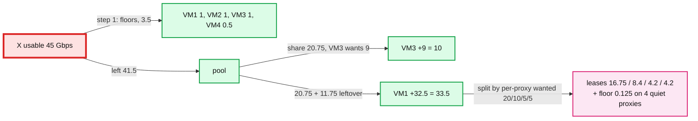

# Deep dive: the 100 ms allocation loop, weighted max-min with a floor, and the overshoot bound

> One-line answer: every 100 ms the host agent takes each VM's demand (bytes that arrived, forwarded or not), gives every VM `min(demand, Y)` first, water-fills the remaining `X × 0.9` among the still-unsatisfied VMs by weight, splits each VM's share across its 8 proxies in proportion to what each proxy saw, and ships that as leases; the only thing that can oversubscribe the NIC is idle VMs waking up at their floor inside one interval, which headroom absorbs up to 5 at a time and which is the entire source of the "99.9%" in the guarantee.

Part of [`../solution.md`](../solution.md) §5.1 (egress rates), §5.2 (ingress leases). Same algorithm both directions; ingress has the extra proxy split.

## 1. Inputs and outputs, one interval

Inputs at the end of interval `k` for host `H`:
- `X` usable = `X_dir × (1 − headroom)`: 45 Gbps in, 90 Gbps out.
- Per VM `v`: `Y[v]`, `w[v]` (weight), `pps_min[v]`, `pps_ceil[v]`.
- Per VM: `wanted[v]` = bytes that arrived in interval `k` (ingress: sum over the 8 proxies' reports; egress: bytes that reached the classifier). Demand is measured, not declared. A VM cannot lie about it.
- Ingress only: `wanted[v][p]` per proxy `p`.

Outputs for interval `k+1`:
- `rate[v]` per VM (egress: written to the datapath table; ingress: `alloc[v]`).
- Ingress: `lease[v][p]` per proxy such that `sum_p lease[v][p] = alloc[v]`.
- Invariant asserted before anything is written: `sum_v rate[v] <= X` usable.

## 2. The algorithm

Weighted max-min with a floor, also called water-filling with minimums. `O(n log n)` for `n` = 45.

```
demand[v] = wanted[v] / T          # bytes per second seen last interval
alloc[v]  = min(demand[v], Y[v])   # step 1: every VM gets its floor, up to its demand
left      = X - sum(alloc)         # what is free after floors
U         = { v : demand[v] > Y[v] }   # VMs that want more than their floor
while left > 0 and U not empty:
    share = left / sum(w[v] for v in U)
    for v in U (ascending by (demand[v]-alloc[v]) / w[v]):
        give = min(share * w[v], demand[v] - alloc[v])
        alloc[v] += give; left -= give
        if alloc[v] == demand[v]: U.remove(v)
```

Then, ingress only:

```
for v: for p in proxies(H):
    lease[v][p] = alloc[v] * wanted[v][p] / wanted[v]     # demand-proportional split
    if wanted[v][p] == 0: lease[v][p] = floor(v)           # keep a floor open on quiet proxies
```

Two details that interviewers probe:
- **A VM with `demand < Y` gets exactly its demand**, not `Y`. Its unused floor is what makes the pool. The floor is a guarantee against contention, not a reservation that idles.
- **Weights only matter above the floor.** A "premium" VM has a bigger `w`, so it wins more of the spare capacity, but every VM's `Y` is honoured first.

## 3. Worked example (ingress, `X` usable = 45 Gbps, `Y` = 1 Gbps each, equal weights)

Five VMs have demand; the other 40 on the host are idle.

| VM | demand | step 1 (floor) | unsatisfied? | water-fill | final |
|---|---|---|---|---|---|
| VM1 | 40 | 1 | yes, wants 39 more | 20.75 + 11.75 leftover from VM3 = 32.5 | **33.5** |
| VM2 | 1 | 1 | no | | **1** |
| VM3 | 10 | 1 | yes, wants 9 more | min(20.75, 9) = 9 | **10** |
| VM4 | 0.5 | 0.5 | no | | **0.5** |
| VM5 | 0 | 0 | no | | **0** |
| 40 idle VMs | 0 | 0 | no | | **0** |
| sum | 51.5 | 3.5 | | 41.5 | **45** |

After floors: `left = 45 − 3.5 = 41.5`, `U = {VM1, VM3}`, `share = 20.75` each. VM3 needs only 9, takes 9, leaves 11.75, which goes to VM1: `1 + 20.75 + 11.75 = 33.5`. Total 45. VM1 gets 84% of the NIC because nobody else wants it; the moment VM3 wants 20, VM1 drops to 23.

Proxy split for VM1, if its 40 Gbps of demand was seen as 20 / 10 / 5 / 5 / 0 / 0 / 0 / 0 across the 8 proxies:
`lease = 33.5 × (20, 10, 5, 5) / 40 = 16.75, 8.375, 4.19, 4.19 Gbps`, and the four quiet proxies keep the floor `0.125 Gbps` each so a new flow that lands there is not stuck at zero. Sum of VM1's leases = 34.0 Gbps, 0.5 above `alloc`; the agent subtracts those quiet-proxy floors from `left` before water-filling so the invariant still holds.



## 4. The overshoot bound (where "99.9%" comes from)

Between two lease updates, what can push the NIC above `X` usable?

1. **Lease skew.** Leases reach 8 proxies within a few ms of each other. For those ms a proxy may run on a new, larger lease while another still runs on its old one. Bounded by `max lease delta × skew / T`, typically under 1% of `X`. Absorbed by headroom.
2. **Idle VMs waking.** A VM with `wanted = 0` last interval was given `alloc = 0`, and its floor was leased to others. When it wakes, its 8 proxies admit at floor **immediately** (that is the guarantee), so for one interval the NIC carries `sum(leases) + Y[v]`. If `m` idle VMs wake in the same interval: `+ m × Y`.
3. **Demand steps on leased VMs.** A VM leased 10 Gbps that suddenly wants 40 is capped at 10 until the next lease. No overshoot; that is the burst latency.

So the excess over one interval is `E <= m × Y + skew`. With headroom `H = 5 Gbps` and `Y_in = 1 Gbps`, the NIC absorbs `m <= 4` simultaneous wake-ups plus skew with zero loss. Beyond that, the ToR queue drops a fraction `(E − H) / X` of every VM's packets for up to one interval. That interval is the 0.1%.

How likely is `m > 4`? Model each idle VM waking independently at rate `λ` per second. Wake-ups in one interval are Poisson with mean `λ × T × n_idle = 0.1 × 0.1 × 40 = 0.4` for a chatty fleet. `P(m > 4) ≈ 1e-4` per interval, or about one bad interval per 1,000 s per host, and each costs at most one interval. That comfortably clears 99.9% of 1 s windows. The case that breaks the model is **correlated** wake-ups (a tenant's 20 VMs on one host all start a job at the same second), which placement should avoid (anti-affinity per tenant per host) and which headroom can be raised for on hosts that run one tenant.

Three knobs move the bound:
- **Headroom `H`**: unsold capacity; each 1% buys one more simultaneous wake-up per 45 VMs.
- **Interval `T`**: halving `T` halves the duration of an overshoot and the expected `m`. 10 ms is affordable (16k RPC/s per proxy) and is the first thing to change if the SLO tightens.
- **Floor hysteresis**: keep a VM's floor reserved (not leased out) for 1 s after it goes idle. Flapping VMs then never cause a transient; only VMs idle for over a second are harvested, and those wake less often.

## 5. Egress: same loop, one input

For egress the "proxies" are the classifier's own demand counters and there is no split step. `wanted[v]` = bytes that reached the classifier for VM `v` (sent + dropped). The agent writes `rate[v]` into the datapath table. The wake-up case is gentler: a waking VM is capped at its last `rate[v]`, which the agent never sets below `Y_out` even when demand is zero, so egress has no wake-up overshoot at all and the invariant `sum(rate) <= X_out × 0.9` holds continuously. That is why the egress headroom could be smaller than the ingress one.

## 6. Two resources: bytes and packets

Run the loop twice per direction, once on bytes with `(Y, X)` and once on packets with `(pps_min, pps_host)`. The datapath enforces `edt = max(byte_edt, pkt_edt)`, so a VM is bound by whichever it exhausts first. The two loops are independent because a VM sending big packets is far from its pps limit and a VM sending small ones is far from its byte limit; the coupling only matters when both are near, and then the stricter one wins, which is what we want.

## 7. Follow-ups

1. **Why demand-proportional split across proxies and not equal?** ECMP is not uniform. A VM with 3 flows may have all of them on one proxy. Equal split would give that proxy 1/8 of the allocation and waste the other 7/8.
2. **What if `wanted` is inflated by an attack?** Demand above `X` is clamped to `X` before the water-fill; an attacker can make a VM look hungry, which only earns it the spare capacity nobody else wanted, and gets it billed for what is delivered.
3. **Why not a PID controller or AIMD?** Because we know the demand and the capacity exactly; there is nothing to search for. EyeQ needs RCP-style iteration because its senders are many and unmeasured. Our 8 proxies measure demand directly.
4. **Why not per-flow fairness?** Not a requirement. Tenants get fairness per VM; inside a VM, the tenant's own TCP stacks share.
5. **Complexity?** `n log n` for `n` = 45 plus 45 × 8 lease entries. Microseconds. The RPC dominates.
