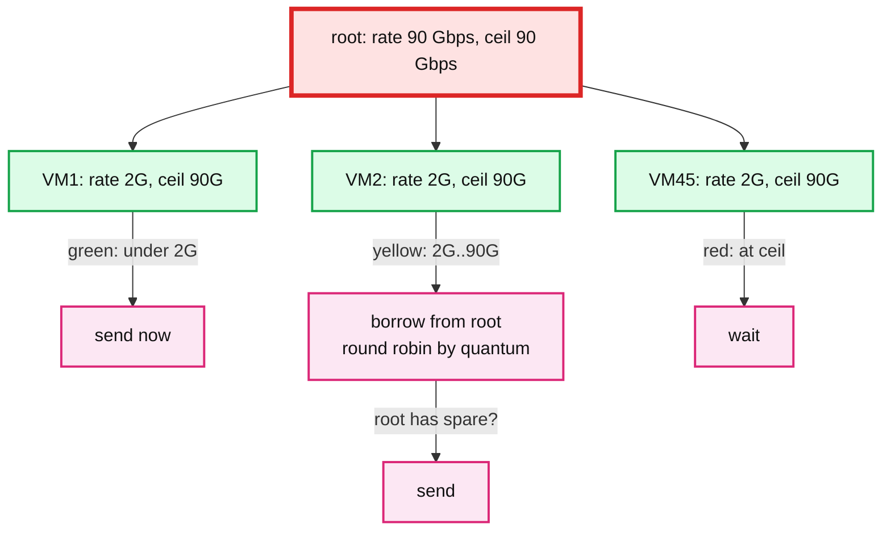
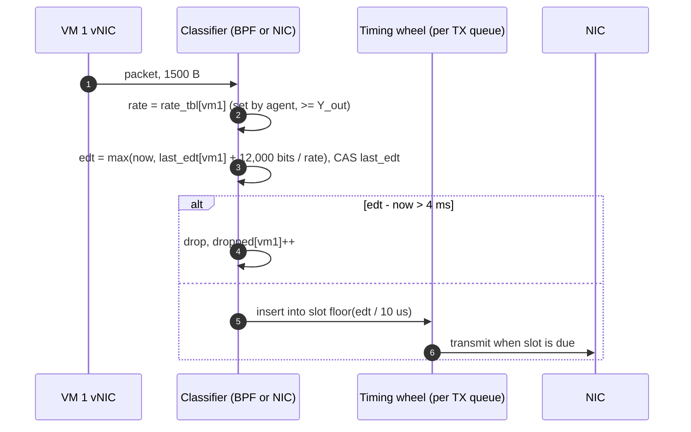

# Deep dive: egress shaping, HTB semantics, EDT pacing, and the SmartNIC

> One-line answer: HTB gives the exact semantics we want (`rate` = guaranteed `Y_out`, `ceil` = cap `X_out`, borrowing = work conservation) but pays a global qdisc lock per packet; at 100 Gbps we keep the semantics and change the mechanism to earliest-departure-time stamps computed per VM, released by a lock-free timing wheel, with the per-VM rate recomputed every 100 ms by the host agent and the whole thing offloaded to the NIC where the hardware allows it.

Part of [`../solution.md`](../solution.md) §4.1 and §5.1. Numbers from [`../research/mechanisms-survey.md`](../research/mechanisms-survey.md) and the Carousel paper (checked directly, see the spot-check table in [`../research/real-world-architectures-survey.md`](../research/real-world-architectures-survey.md)).

## 1. What HTB does, precisely

Hierarchical Token Bucket is a tree of classes. Each class has:

| Knob | Meaning | Our value |
|---|---|---|
| `rate` | Bytes per second the class is **guaranteed** when it has demand | `Y_out` = 2 Gbps per VM class, `X_out` on the root |
| `ceil` | The most it may ever send, by borrowing from its parent | `X_out × 0.9` = 90 Gbps per VM class |
| `burst` / `cburst` | Bytes that may be sent at once above `rate` / `ceil` | `rate × 2 ms` |
| `quantum` | Bytes a class gets per round when several siblings borrow at once | `MTU × 10`, so borrowing is shared by weight, not by who asks first |
| `prio` | Which siblings borrow first | equal |

Per packet, a class is in one of three states: **green** (below `rate`, send now), **yellow** (between `rate` and `ceil`, may send if an ancestor has unused tokens), **red** (at `ceil`, wait). Borrowing walks up the tree looking for a green ancestor and shares its tokens among yellow children round robin by `quantum`.

This is the whole guarantee for egress, and it is worth saying in the interview that no distributed system is involved: with `sum(rate) <= root rate` every class can always drain its `rate`.

## 2. Why HTB stops at 100 Gbps

- **One lock.** Every enqueue and dequeue on the qdisc takes the qdisc root lock. Carousel (SIGCOMM 2017) measured a server saturating at 600k TCP request-response transactions per second with HTB and 800k without it, and attributes the cost to "the global Qdisc lock acquired on every packet enqueue". In their busiest production cluster the lock wait reached 1 s at p99.
- **Multi-queue NICs do not help.** A 100 Gbps NIC has 32 to 64 transmit queues so that cores can send in parallel. A classful qdisc like HTB collapses them back onto one lock. Cilium's bandwidth manager documentation says not to use the TBF-based CNI plugin "due to scalability concerns in particular for multi-queue network interfaces" and uses EDT instead.
- **Per-class queues hold packets.** 45 classes × a few ms of buffering at up to 90 Gbps is hundreds of MB in flight, and TCP Small Queues cannot see it, so the sender keeps pushing.

Numbers to say: 8.1 Mpps of 1500 B packets at 100 Gbps means 123 ns per packet on one core. A lock acquire plus a tree walk plus a token update is already most of that.

## 3. EDT: keep the semantics, drop the lock

**Earliest Departure Time** moves the rate decision from the queue to the classifier:

1. When a packet for VM `v` arrives at the datapath, compute `edt = max(now, last_edt[v] + len × 8 / rate[v])` and set `last_edt[v] = edt`. This is a GCRA (virtual scheduling) check with a single 8-byte timestamp per VM instead of a token count.
2. Write `edt` into the packet (`skb->tstamp` in Linux; a descriptor field on a SmartNIC).
3. Hand the packet to a **timing wheel**: an array of slots, each slot a list of packets due in that time range. Insert is O(1) into slot `edt / granularity`. A per-queue thread (or the NIC) walks the wheel and transmits what is due. There is no shared lock: `last_edt[v]` is per VM and updated with a single atomic, and each transmit queue has its own wheel.
4. If `edt − now` exceeds a bound (4 ms of that VM's rate), drop instead of queue. That keeps latency bounded and gives TCP the loss signal early.

In Linux the wheel is `sch_fq`, which orders flows by next departure time and honours `skb->tstamp`; the classifier is a tc-BPF or XDP program. Cilium's bandwidth manager is exactly this: an eBPF program sets the timestamp from a per-pod rate, `fq` releases the packet. Carousel's production result: 8% less machine CPU and 20% less networking CPU than the shaper it replaced, on servers doing 37 Gbps across tens of thousands of flows, with rate conformance within a few percent.

## 4. Where work conservation went

HTB borrows per packet. EDT has no parent class, so borrowing has to come from somewhere else: the **rate table**. Every 100 ms the host agent reads each VM's egress demand (bytes that arrived at the classifier, whether sent or dropped) and recomputes `rate[v]` by weighted max-min with floor `Y_out` and total `X_out × 0.9` ([`allocation-loop-and-fairness.md`](allocation-loop-and-fairness.md)). Between updates a VM is capped at its current `rate[v]`, which is at least `Y_out`. So:

- A VM that starts sending gets `Y_out` instantly and its fair share of the idle capacity 100 ms later.
- The sum of `rate[v]` never exceeds `X_out × 0.9`, so the NIC is never oversubscribed and there is no HTB-style queue build-up.
- The cost relative to HTB: up to 100 ms of not using idle capacity after a demand change. At 100 Gbps that is 1.25 GB of "lost" opportunity per event, which is nothing against the lock cost.

Push back on the textbook answer: "HTB is work conserving and EDT is not" is true per packet and false per 100 ms, and the 100 ms version is what production shapers do.

## 5. The SmartNIC

At 100 Gbps per host the classify-stamp-count path should not be on host cores at all. AWS Nitro, Azure MANA (documented up to 200 Gbps), Google's Titanium / IPU, and AccelNet's FPGA all move the vSwitch fast path onto the card. What that changes for this design:

- The **rate table** is a hardware table programmed by the agent over a control channel (PCIe mailbox or a gRPC to the card's ARM cores). `SetClass` becomes a table write.
- The **timing wheel** is per hardware queue; the NIC releases packets at `edt` itself.
- **Counters** are hardware counters read by the agent every 1 s.
- **pps limits** are enforced by the same stamp (`edt = max(byte_edt, pkt_edt)`), which hardware does trivially.
- The host CPU path (XDP + fq) remains for hosts without offload and as the fallback when the card's table is full.

What it does not change: the algorithm, the 100 ms loop, or placement. The interview answer is "same design, the enforcement point moved into silicon".

## 6. Why not SR-IOV VF rate limits

`ip link set dev eth0 vf 3 max_tx_rate 2000` programs a per-VF cap in the NIC. It is a static ceiling: not work conserving, no borrowing, and `min_tx_rate` support is driver specific and not hierarchical. It is the "Bad" rung: correct for the guarantee (if `sum(min) <= X`), wrong for the revenue requirement (a VM can never burst). Some cards expose ETS (802.1Qaz) minimum-bandwidth shares per traffic class, but that is 8 classes per port, not 45 VMs.

## 7. Follow-ups

1. **What is `granularity` of the wheel?** 10 us slots and a 100 ms horizon is 10,000 slots; a packet due beyond the horizon is dropped (it would have waited more than 4 ms anyway).
2. **TSO / GRO?** A 64 KB TSO segment gets one `edt`; the NIC splits it, so the burst is 64 KB at line rate, then a gap. `burst = rate × 2 ms` at `Y_out` = 2 Gbps is 500 KB, so TSO fits. Carousel notes shaping is "enforced at the granularity of TSO".
3. **Latency-sensitive VM?** Give it a higher weight (bigger share when contended) and a smaller max queue (drop earlier). EDT makes per-VM queue bounds trivial; HTB does not.
4. **What breaks first if I get it wrong?** Setting `rate[v]` so that `sum > X_out`: the wheel releases more than the NIC can send, the NIC's own queue fills, and every VM's latency rises together. The agent asserts `sum(rate) <= X_out × 0.9` before every table write.
