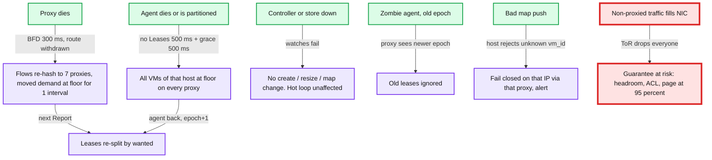

# Deep dive: failure modes and the fail policy

> One-line answer: split every number the system holds into two kinds, the static floor (`Y` per VM, known to every proxy and every host, cached on local disk) and the dynamic lease (everything above the floor, carries a TTL and an epoch); any failure anywhere makes leases expire to the floor, never to zero and never to the ceiling, so the worst outcome of any outage is "no bursting" and the NIC can never be oversubscribed by proxied traffic, with the one exception being traffic that does not pass a proxy, which headroom and an alert cover.

Part of [`../solution.md`](../solution.md) §5.3 and §10.4. Related: [`../edge-cases.md`](../edge-cases.md) Failure section.

## 1. The two kinds of state

| State | Where | Durable? | On loss |
|---|---|---|---|
| Policy: `Y`, weights, placement, `X` | Policy store; cached on each host agent and each proxy on local disk | Yes | Cache serves; no change possible until the store is back |
| `ip -> (vm, host)` map, per-VM floor | Controller pushes; proxies cache on disk with a version | Yes (derived) | Proxy restarts with its last map; version gap triggers a full pull |
| Egress `rate[v]` table | Host datapath memory | No | Agent rewrites on restart; datapath keeps last table until then, every entry >= `Y_out` |
| Ingress leases | Proxy memory, TTL 500 ms | No | Expire to floor |
| Agent epoch | Local file on the host, plus controller | Yes | Incremented on every agent start |
| Counters and usage samples | Datapath, then Kafka | 1 h buffer on the agent | Replayed; upserts make replay safe |

The rule: anything that is not durable must have a safe value it decays to without coordination. For leases that value is the floor.

## 2. Failure by component

### 2.1 Host QoS agent

- **Detection**: a proxy that has sent 5 reports (500 ms) without a `Leases` reply marks the host's leases as expired. The host's datapath is unaffected.
- **Grace**: for another 500 ms the proxy keeps the last lease rates. This covers agent GC pauses and a single dropped RPC without a visible dip. Then FLOOR.
- **Effect at FLOOR**: each VM of that host is admitted at `Y_in / 8` per proxy. `sum = sum(Y_in) <= X_in × 0.9`. Nobody drops below `Y`, nobody bursts.
- **Egress**: the datapath table freezes at the last `rate[v]`. Every entry is `>= Y_out` by construction and their sum `<= X_out × 0.9`, so egress is safe and frozen, not degraded to floor. A VM whose demand rises during the outage is capped at its last rate.
- **Recovery**: the agent reads `epoch` from its local file, increments it, writes it back, and loads its VMs from the controller (or local cache). Its first `Leases` reply carries the new epoch; proxies replace all leases for that host wholesale. Time from crash to first new lease: about 1.1 s. Bursting resumes.
- **Split brain**: a zombie agent (paused, then resumed) replies with the old epoch. Proxies that have seen a newer epoch ignore it. Proxies that have not (the zombie replied first) apply its leases; those leases sum to `<= X_in × 0.9` too, so even the "wrong" leases are safe. Epochs are about consistency of the plan, not about safety of the NIC.

### 2.2 Off-host proxy

- **Detection**: BFD between proxy and edge router at 100 ms intervals, 3 misses. The proxy's BGP route is withdrawn at 300 ms.
- **Effect**: ECMP re-hashes the dead proxy's flows. With resilient hashing only those flows move; without it every flow in the group may re-hash (ask the network team; it changes whether one proxy loss is a 12.5% event or a 100% event for one interval).
- **Moved flows** arrive at a proxy whose lease for that VM covers only its own previous demand. It admits the extra at floor and reports the higher `wanted`; the next `Leases` re-splits the VM's allocation. One interval of reduced service for the moved share.
- **Replacement**: a new proxy announces the route only after loading the map and floors (from the controller or a peer). It starts with zero leases, i.e. at floor, which is safe by construction.
- **Slow proxy** (not dead, but dropping packets internally): its `fwd` and `dropped` counters diverge from `wanted`; the agent sees a proxy whose forwarded bytes lag its lease and can shift the VM's split toward the other proxies. The customer sees a dip only on flows pinned to the slow proxy.

### 2.3 Regional controller and policy store

- The hot loop does not call them. Leases keep cycling; agents and proxies serve from cache.
- No `POST /vms`, no resize, no map pushes. New VMs cannot boot with networking, which is the right failure (an unplaced VM is a delay, an oversubscribed host is a broken promise).
- A host or proxy that **restarts** during the outage loads its last cached policy from disk. The cache is versioned; on reconnect it reconciles.
- RTO: controller 30 s (3 replicas, leader election), policy store per the DB runbook. RPO: zero for placement (synchronous replication); a create that was acked is durable.

### 2.4 Partition between the proxy tier and a host's management network

Identical to "agent dead" from the proxy's view, and to "all proxies dead" from the agent's view. Both sides converge on floor without talking. The agent, seeing no reports, keeps its ingress policers at `1.2 × Y_in` (not at the last allocation, because it must assume the leases have expired). Heals on the first report that gets through.

### 2.5 Non-proxied traffic reaching the NIC

The one failure the design cannot shape: VM-to-VM traffic inside the datacenter, or an internal service pushing 30 Gbps at a VM, arrives without a proxy in the path. It consumes `X_in` and the ToR drops indiscriminately. Mitigations, in order:
1. Headroom (10%) covers modest amounts.
2. The host's ingress accounting sees `bytes_in > sum(leases)` and raises `nonproxied_bytes`; an alert at 95% NIC utilisation pages.
3. The 10x mutation ([`../solution.md`](../solution.md) §10.11): the receiving agent sends leases to the top-N sending **hosts**, EyeQ style, so DC-internal senders also hold leases. Until that exists, say plainly that internal traffic is outside the guarantee.

## 3. Fail open vs fail closed, per number

| Number | If its source is unreachable | Why |
|---|---|---|
| Per-VM ingress above floor (lease) | Falls to floor | Open would oversubscribe the NIC; closed would break the guarantee |
| Per-VM ingress floor | Static, never falls | It is the product |
| Per-host cap on the proxy | Sum of floors + live leases; shrinks as leases expire | Never exceeds `X_in × 0.9` by construction, so it cannot fail open |
| Per-flow ceiling | Static | Never needs a lease |
| Egress `rate[v]` | Freezes at last value (>= `Y_out`) | Safe and nearly work conserving |
| Host ingress policer | Falls to `1.2 × Y_in` | Backstop must track the floor once leases are unknown |
| `ip -> vm` map | Serves last cached version; unknown IP is dropped | Misrouting is worse than dropping |

Compare with the API rate limiter in [`../../network-throttling/`](../../network-throttling/), where the per-limit fail policy could be "open to a local cap" because an overshoot only costs a few extra requests. Here the resource is a link that drops everyone, so the only open policy is the floor.

## 4. Timelines (second by second)

**Agent crash** (Flow 5 in `solution.md` §6): 0 ms crash; 100 to 500 ms reports unanswered; 500 ms GRACE; 1,000 ms FLOOR; 1,100 ms first reply from the new agent, LEASED. Customer sees: bursting VMs capped at `Y` for about 100 ms (between FLOOR and the new lease), nothing else.

**UDP flood** (`solution.md` §10.4): the flood never reaches the NIC above the flooded VM's own allocation; other VMs see nothing at any time.

**Proxy crash** (`diagrams.md` D5c): 0 ms crash; 300 ms route withdrawn; 300 to 400 ms moved flows at floor; 400 ms new leases. Customer sees: flows on that proxy stall for 300 ms (TCP retransmit), then run at floor for 100 ms, then normal.

## 5. What pages, and what it means

| Alert | Threshold | Meaning |
|---|---|---|
| NIC utilisation > 95% of `X` | 10 s | Non-proxied traffic, policer bypass, or a lease bug. The guarantee is at risk right now |
| FLOOR-state `(proxy, VM)` pairs > 1% of a group | 60 s | Agents unreachable or a partition. Customers are not bursting |
| Any VM `received < min(wanted, Y) × 0.9` | 3 s | SLO breach. Correlate with the two above |
| `policer_drops` > 0 on a host | 60 s | A proxy is over-admitting for that host |
| `no_such_vm` > 0 on a host | 60 s | Map is wrong on some proxy |
| Lease loop p99 > 300 ms | 5 min | Agent CPU, management network, or a hot proxy. Ticket, not page |

## 6. Follow-ups

1. **Why grace at all?** A single lost RPC or a 200 ms GC pause should not drop 45 VMs to floor. Grace costs nothing in safety because the leases it preserves were already under the invariant.
2. **Why not have proxies coordinate when the agent is gone?** They have nothing to coordinate: floor is safe and known to each of them alone. Coordination would only be needed to keep bursting, and bursting is the thing we give up under failure.
3. **What if the whole proxy group dies?** The IP block is unreachable from the Internet; that is a network outage, not a QoS problem. Groups span 3 AZs so it takes a region-wide event.
4. **What is the blast radius of a bad agent build?** One proxy group of hosts in canary (160 hosts) for 24 h in shadow, and `leases_enabled = false` as a one-flag rollback per group.
