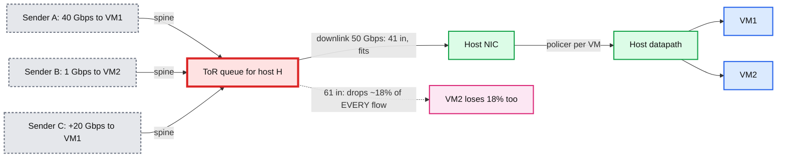

# Deep dive: why ingress cannot be enforced on the host, and the off-host proxy tier

> One-line answer: a receiving host can only drop what has already crossed its NIC, so ingress contention is decided in the switch in front of the host where it drops every VM's packets alike; the only place a per-VM ingress guarantee can be enforced is upstream, at a proxy tier that sees each VM's traffic before it shares a link with the other VMs, and that tier needs to be told every 100 ms how much each VM may receive, by the one component that knows the sum: the destination host.

Part of [`../solution.md`](../solution.md) §4.2 and §5.2. Sibling deep dive: [`allocation-loop-and-fairness.md`](allocation-loop-and-fairness.md) for the numbers inside the loop.

## 1. The physics

Egress: the host owns every packet before it leaves. A shaper decides. Done.

Ingress: a packet for VM1 travels Internet -> edge -> spine -> ToR -> host NIC. The host's share of the ToR downlink (`X_in`) is consumed by the time the packet reaches the NIC. If 60 Gbps arrives for a 50 Gbps link, the ToR queue overflows and drops **random** packets: VM1's flood and VM2's 1 Gbps alike. Nothing the host does afterwards can give VM2 its packets back. EyeQ (NSDI 2013) states it for the datacenter case: "contention at the receiver first happens inside the switch, and not at the receiving server."

So a host-side ingress policer is only useful for two things: (a) telling TCP senders to slow down (drops become cwnd cuts within one RTT) and (b) catching a proxy that misbehaves. It is a backstop, not the guarantee.

## 2. The three places you could enforce upstream

| Place | How | Why not (or why) |
|---|---|---|
| The senders | Ask the Internet to slow down: ECN marks, drops | Only TCP listens, only after one RTT (50 to 100 ms), and UDP never does. Fine as a second-order effect, useless as the guarantee |
| The ToR switch | Per-destination-VM queues with min-bandwidth scheduling | Switch ASICs have 8 to 16 queues per port; 45 VMs × 40 hosts per rack is 1,800 queues per switch. The switch also sees IPs, not tenants. It can police per host, not per VM |
| A proxy tier at the region edge | Per-VM token buckets in software, before traffic shares any link with other VMs of the same host | Costs machines (about 5% of the fleet at 500 × 100 Gbps proxies per 10k hosts), adds one hop. It is the only place with per-VM visibility before the shared link. This is the hint diagram |

Public clouds confirm the shape: Azure "Ingress isn't measured or limited directly"; GCP caps external ingress at "1,800,000 pps or 30 Gbps" per VM to protect the host but sells no minimum; AWS sells symmetric baseline bandwidth and enforces at the Nitro card plus its edge. None of them promises a per-VM ingress minimum against noisy neighbours. That is why the interviewer asks this.

## 3. The proxy tier

**Placement.** Each VM's public IP block is announced over BGP by one **proxy group** of 8 proxies with equal cost; the edge router ECMPs flows over them by 5-tuple hash. Every proxy in the group can serve every IP in the block. 500 proxies per region = 62 groups; each group serves 160 hosts.

**Per packet on a proxy** (XDP or DPDK, 4 to 6 cores per 100 Gbps):
1. `(vm, host) = ipmap[dst_ip]`. Miss: drop and count `no_map` (fail closed; a stale map never misroutes).
2. `wanted[vm] += len` (the demand signal, counted whether or not we forward).
3. Three buckets: `bucket[vm]` at the lease rate or the floor; `hostcap[host]` at the sum of that host's leases plus floors; `flow[5-tuple]` at `per_flow_ceil`. All must have tokens. Otherwise drop and count by reason.
4. Encapsulate (Geneve, `vm_id` in the option header, source = proxy IP) and send to the host's NIC address.

**Per 100 ms on a proxy**: for each host it has seen traffic for, send `Report(host, epoch_seen, [(vm, fwd, dropped, wanted, pkts)])` to that host's agent; apply the `Leases` in the reply atomically (swap a pointer to a new rate table, no per-bucket locks).

**Why 8 and not 1 or 64.** One proxy per VM is a SPOF and a 100 Gbps ceiling per VM; 64 makes each proxy's per-VM demand signal too small to be useful and multiplies control RPCs. 8 puts a proxy loss at 12.5% for one interval and keeps `Report` fan-in per host at 8.

## 4. Why the host hands out the leases

The proxies need one number per VM per interval, `rate`, such that `sum over VMs <= X_in × 0.9` and each VM's `rate >= min(Y_in, demand)`. That is a per-host computation with per-host inputs. Options:

| Allocator | Hot-loop RPCs per region | Failure domain | Verdict |
|---|---|---|---|
| Central service | 800k/s in, 800k/s out, must be sharded by host anyway | Region-wide when it fails | Rejected: it is 10k independent problems wearing one hat |
| Gossip among the 8 proxies | 8 × 7 messages per host per interval | None, but no invariant on the sum, `log N` convergence, LWW loses demand | Rejected: the sketch on the whiteboard, and the wrong tool for a budget |
| The destination host's agent | 8 in, 8 out per host per interval | One host | Chosen. It already owns `X_in`, `Y_in` per VM, and the egress loop |

EyeQ makes the same choice for the datacenter case: the receiver meters and sends rates to the senders' modules. Our "senders" are the proxies because the real senders are on the Internet.

## 5. Floor until leased: the invariant

A proxy with no valid lease for a VM admits at `floor = Y_in / 8`. Consequences:
- `sum over all proxies of floors for host H = sum(Y_in) <= X_in × 0.9`. The NIC is safe with zero leases.
- Leases only ever **add** to the floor, and the agent never issues leases summing above `X_in × 0.9 − (floors of VMs it did not lease)`. So the NIC is safe with any set of leases too.
- The price: a VM waking from idle gets `Y_in` for the first interval, its share from the second. 100 to 200 ms of burst latency.

The alternative, optimistic admission (let a proxy exceed floor before it has a lease, as the network-throttling design does for API limits), would let 8 proxies each admit a bootstrap burst, `8 × burst` above the plan per VM, and 45 VMs waking at once could overshoot the NIC by far more than headroom. For API rate limits a 5% overshoot is harmless; here the overshoot lands on a link that drops everyone. So the ingress side is strict where the API limiter was optimistic. Say that difference out loud; it shows you understand what the resource is.

## 6. What the host still does on ingress

- **Backstop policer** per VM at `1.2 × allocation` (or `1.2 × Y_in` when the agent is starting). Drops are counted separately as `policer_drops`; a non-zero rate is an alert, because it means a proxy is over-admitting.
- **Source ACL**: encapsulated packets must come from proxy IPs; anything else is dropped before decapsulation (a tenant cannot spoof `vm_id`).
- **ECN**: the host marks (not drops) at 80% of the policer rate so TCP senders slow down before the proxy has to drop. Cheap and good for the customer's own throughput; never part of the guarantee.

## 7. Failure of the guarantee, honestly

The guarantee is "99.9% of 1 s windows, `received >= min(wanted, Y_in)`". Where the 0.1% comes from:
- One interval at floor when demand lands on a single proxy (the ECMP skew case: proxy 3 gets 125 Mbps of floor for a VM whose whole 1 Gbps demand is on it). Bounded to one interval by the lease loop.
- Lease skew: leases reach the 8 proxies within a few ms of each other, so for a few ms the sum can be above plan. Covered by headroom.
- Non-proxied traffic: VM-to-VM inside the datacenter does not go through the proxies and can consume `X_in`. Out of scope in the prompt, and the reason headroom is 10% rather than 3%. The 10x mutation in `solution.md` §10.11 says what to do about it (EyeQ-style leases to the sending hosts).

## 8. Follow-ups

1. **Why not put the proxies on the ToR (a smart switch)?** Per-VM state and 100 ms RPC loops are software; some DPU-based ToRs could do it, and the design does not change, only where the proxy runs.
2. **Doesn't the proxy hop add latency?** About 50 to 100 us inside the region. The Internet RTT is 50 ms. Nobody notices.
3. **What if a proxy is compromised?** It can over-admit for the hosts it serves; the host policer caps the damage at `1.2 × allocation` per VM and alerts.
4. **What about return traffic (egress) through the proxies?** It does not go through them; egress leaves the host directly (the on-host proxy in the hint diagram). Asymmetric routing is normal here because the proxies are stateless per packet.
