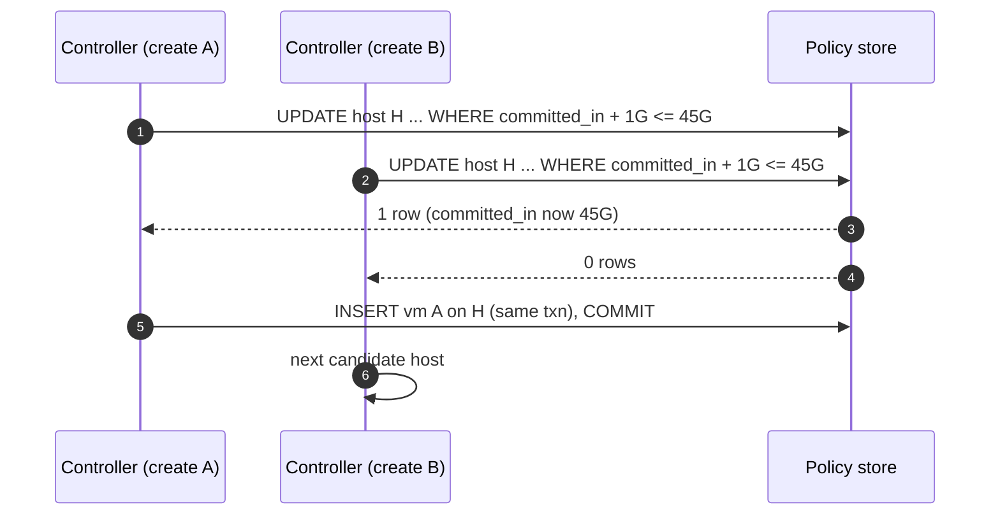

# Deep dive: placement and admission control, the guarantee as an invariant

> One-line answer: no shaper can deliver 46 guarantees of 1 Gbps on a 45 Gbps link, so the guarantee is made when the VM is placed, by a conditional update on the host row that refuses any VM whose `Y` would push `sum(Y)` above `X × (1 − headroom)` in either direction; everything downstream (shapers, proxies, leases) only realises a promise that placement has already made feasible.

Part of [`../solution.md`](../solution.md) §4.3. The interviewer's second question after "why is ingress hard" is "where is the guarantee actually made", and this is the answer.

## 1. The invariant

For every host `H` and each direction `d ∈ {in, out}`:

```
sum over VMs v on H of Y_d[v]  <=  X_d[H] × (1 − headroom_d)
```

With `X_in` = 50, `X_out` = 100, headroom 10%, `Y_in` = 1, `Y_out` = 2: at most 45 VMs per host. "50 VMs per host" in the prompt is the nominal density; 45 is what the guarantee allows at these numbers. Say that, then say what changes it: smaller `Y`, bigger NIC, or less headroom.

Also for packets: `sum pps_min[v] <= pps_host × (1 − headroom)`, where `pps_host` is what the datapath can actually process (8 Mpps in software, line rate on a SmartNIC).

## 2. How the controller enforces it

`POST /vms {y_in, y_out, weight}`:

1. **Filter** candidate hosts from the cluster manager's inventory (CPU, memory, AZ, anti-affinity) and keep those with `committed_in + y_in <= cap_in` and `committed_out + y_out <= cap_out` on the cached view.
2. **Score** by bin packing on the tightest dimension (usually `in`) so that hosts fill evenly and spare capacity for bursting stays broad rather than fragmented onto a few hosts.
3. **Commit** with one conditional statement, no read-then-write:

```sql
UPDATE host
SET committed_in = committed_in + :y_in, committed_out = committed_out + :y_out
WHERE host_id = :H
  AND committed_in + :y_in  <= x_in  * (100 - headroom_pct) / 100
  AND committed_out + :y_out <= x_out * (100 - headroom_pct) / 100;
-- 1 row: INSERT vm in the same transaction. 0 rows: next candidate.
```

Two creates racing for the last slot: one update matches, the other matches zero rows and moves on. No lock service, no lease, no leader needed for correctness (the controller is leader-elected for throughput and simplicity, not for this).



## 3. Resize, delete, migrate

- **Resize up**: same update on the delta. On failure the VM keeps its old `Y`; there is no window without protection because the old datapath class stays until the new one is programmed.
- **Resize down**: always admitted; decrement in the same transaction as the policy version bump.
- **Delete**: disable the vNIC, remove the class, remove the proxy map entries, and only then decrement `committed_*`. Releasing capacity last means a concurrent placement cannot land a VM that sends while the deleted one is still draining.
- **Live migration** (the answer to "resize does not fit" and to "drain this host"): commit on the target first, migrate, release the source last. During the migration the VM is committed on both hosts; that is the price of never being under-committed anywhere.

## 4. Headroom: what it buys and what it costs

Headroom is the unsold fraction of every NIC. It is spent on:
- lease skew across the 8 proxies (about 1%),
- idle VMs waking at their floor inside one interval (about 1% per simultaneous wake-up; see [`allocation-loop-and-fairness.md`](allocation-loop-and-fairness.md) §4),
- traffic that does not pass a proxy (DC-internal), which the design cannot shape and the prompt scopes out.

10% is a starting point, not a law. On a 50k-host fleet, 10% of `X_in` is 250 Tbps of never-sold ingress, or 5k hosts' worth of NICs. A faster loop (10 ms) and floor hysteresis let it drop to 5%. That trade is worth saying: "I can sell 5% more of every NIC for 10x control traffic, which is still under 0.02% of data traffic".

## 5. Oversubscription, if the business insists

Some providers sell "up to" bandwidth with no minimum (Azure's egress limit is a ceiling; AWS "up to 10 Gbps" sizes have a lower baseline). If the product wants `sum(Y) > X` on purpose:
- The guarantee becomes "min(Y, fair share)" and must be sold as such.
- The water-fill handles it unchanged: step 1 gives `min(demand, Y)` scaled by `X / sum(Y)` when the floors alone exceed `X`.
- Placement stops enforcing the invariant and instead enforces a ratio (`sum(Y) <= 1.5 × X`), which is what "oversubscription ratio" means in cluster managers.

This is the "different product" answer, not the "same product with a bug" answer. Do not let the interviewer conflate them.

## 6. What the cluster manager owns vs what we own

| Concern | Owner | Interface |
|---|---|---|
| Which hosts exist, their NIC `X`, their health | Cluster manager | Host inventory API |
| Choosing a host for a VM (CPU, memory, AZ, anti-affinity) | Cluster manager | Placement returns a ranked list |
| The network admission check and `committed_*` counters | This system (the QoS controller) | The conditional update; cluster manager calls us before finalising placement |
| Programming the host and proxies | This system | `SetClass`, map push |

The seam matters: if the cluster manager owns the counters, every network policy change ships with the cluster manager. If we own them, placement has one more call to make and can be told "no" with a reason.

## 7. Follow-ups

1. **Can `X` change under a running host?** Yes: a NIC degrades from 100 to 50 Gbps (a bad optic, LACP member down). The agent detects link speed, reports it, and the controller marks the host over-committed and starts migrating the newest VMs first. Until then the water-fill runs on the real `X` and every VM gets `Y × X_real / X`; the guarantee is breached and an alert says so.
2. **Multi-NIC hosts?** Each NIC is its own `X` and its own set of VM classes; a VM with vNICs on both has two `Y`s. The invariant is per NIC.
3. **Anti-affinity for correlated wake-ups?** Limit VMs of one tenant per host (say 10) so a tenant-wide job start cannot wake more than 10 floors at once on any host.
4. **What if the policy store is unavailable at placement?** No placement. That is the correct failure: an unplaced VM is a delay, an oversubscribed host is a broken promise to 45 customers.
