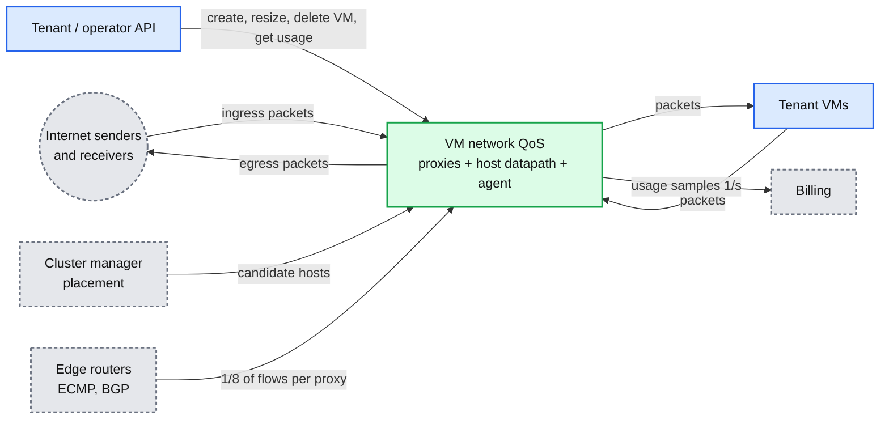
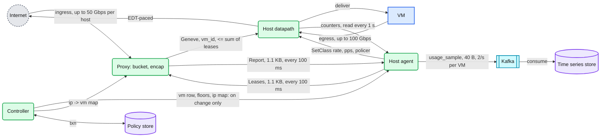
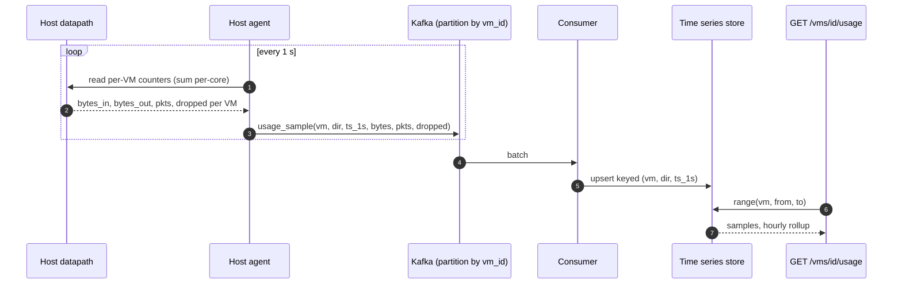
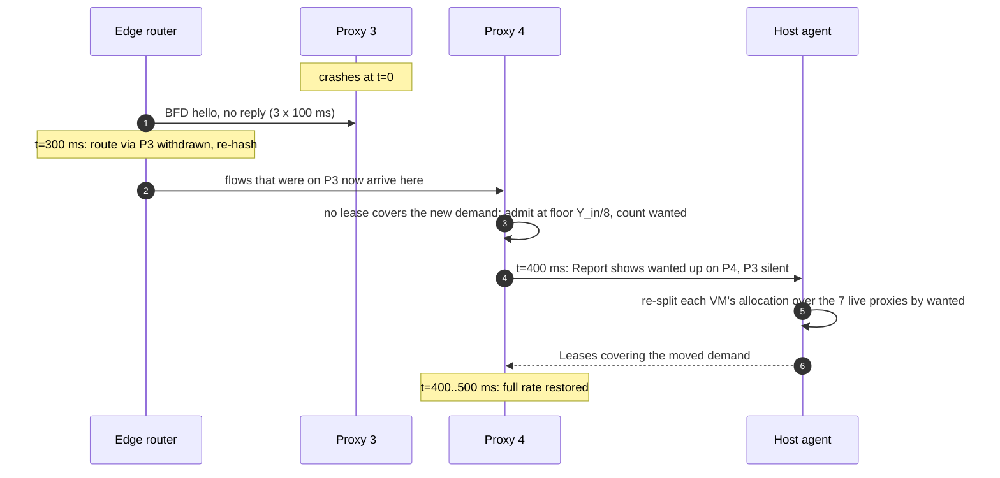
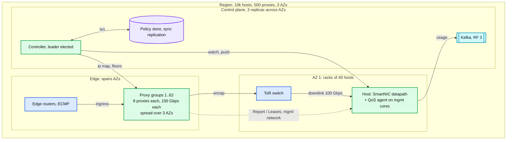
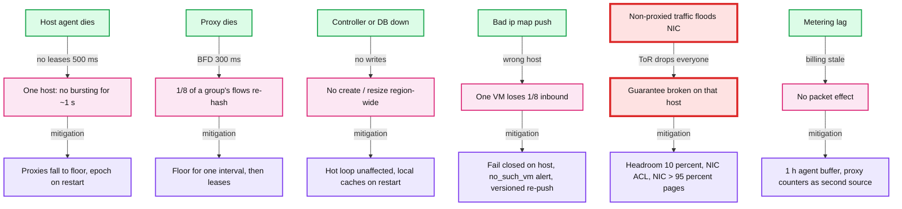
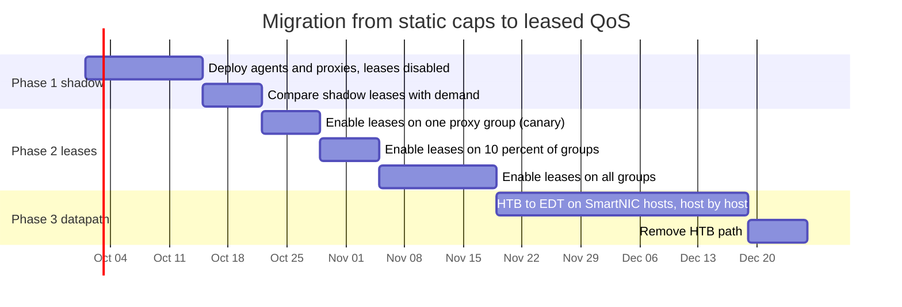

# Diagrams: VM network QoS

The D1 to D12 set from `hld/CLAUDE.md` §4. A diagram is drawn once: the ones embedded in [`solution.md`](solution.md) are linked here, not repeated.

| # | Diagram | Where |
|---|---|---|
| D1 | Context | below |
| D2 | Data flow | below |
| D3 | Component architecture (final design) | `solution.md` §6 |
| D4 | Happy path per FR | FR1 egress: `solution.md` §6 Flow 1. FR2 ingress: §6 Flow 2 and §5.2 (the loop). FR3 create: §6 Flow 4. FR4 metering: below |
| D5 | Failure paths | Agent crash: `solution.md` §6 Flow 5. UDP flood: §10.4. Proxy death: below |
| D6 | Decision flow in the datapath | `solution.md` §5.1 |
| D7 | Entity relationship | `solution.md` §3.3 |
| D8 | Lease state machine | `solution.md` §5.3 |
| D9 | Deployment / topology | below |
| D10 | Scaling / partitioning | `solution.md` §5.4 |
| D11 | Failure mode map | below |
| D12 | Rollout / migration | below |

---

## D1. Context (zoom-out)

## D2. Data flow (DFD)

## D4 (FR4). Metering, happy path

## D5 (third). Proxy death

## D9. Deployment / topology

## D11. Failure mode map

## D12. Rollout / migration

Rollback points: phase 1 has nothing to roll back (no behaviour change). Phase 2 rollback is `leases_enabled = false` per group, effective within 1 s. Phase 3 rollback is a qdisc swap per host.
