# HLD: VM network QoS on a shared host NIC

> One-line answer: the guarantee is made at placement (sum of every VM's `Y` on a host stays under the NIC capacity in each direction, minus headroom); egress is enforced on the host by a work-conserving shaper with per-VM `rate = Y_out, ceil = X_out`; ingress is enforced before the host, at the off-host proxies, each running a per-VM token bucket whose rate is a lease issued every 100 ms by the destination host's QoS agent from the demand the proxies report; the host polices ingress only as a backstop; and when the agent is unreachable every proxy falls to the static floor `Y_in`, so the minimum survives any control-plane failure.

Source: Databricks interview prompt (screenshot 2026-09-16). The hint diagram shows one on-host proxy for outgoing traffic and several off-host proxies for incoming traffic per VM. Written flow-first: §4 builds one diagram one functional requirement at a time, §5 breaks and mutates that design one non-functional requirement at a time, §6 shows the final design and the five core flows to rehearse. Reusable blocks: [`../network-throttling/`](../network-throttling/) (batch reports and leases), [`../../concepts/gossip-protocol.md`](../../concepts/gossip-protocol.md) (why we do not use gossip here).

---

## 1. Understanding the problem

Restate before designing. "QPS" on a NIC is bytes per second (bandwidth); packets per second is a second limit on the same bucket, because 64 B packets at line rate cost 18x more CPU per byte than 1500 B packets. Two directions, two capacities: `X_out` (host to Internet), `X_in` (Internet to host). Every VM gets `Y_out` and `Y_in`, may burst up to `X`.

### 1.1 Functional requirements

Core:
1. **Egress guarantee and burst.** A VM with demand always gets at least `Y_out`. Idle host capacity is shared among VMs that want it, up to `X_out`.
2. **Ingress guarantee and burst.** Same for `Y_in` and `X_in`, for traffic arriving from the Internet.
3. **Guarantees survive change.** VM create, delete, resize (`Y` changes), host fills up, host or proxy restarts. The minimum holds at every instant.
4. **Metering.** Per-VM, per-direction usage at 1 s granularity, so bandwidth above `Y` can be billed.

Below the line (say it out loud):
- VM-to-VM traffic inside the datacenter (different path, no off-host proxy). §11 covers the mutation.
- DDoS scrubbing. Absorbed upstream of our proxies. Our job is only that an attack on VM1 cannot push VM2 below `Y`.
- Latency or jitter guarantees. Bandwidth only.
- Per-flow congestion control. TCP does that. We shape per-VM aggregates.

### 1.2 Non-functional requirements

Ask for scale first: 50 VMs per host, 50k hosts, 100 Gbps NICs. Then:

| Dimension | Target | Why it matters |
|---|---|---|
| Decision latency | Per packet, in the data path, no remote call. About 100 ns per packet at 8.1 Mpps | Any RPC per packet is 10,000x too slow |
| Guarantee | In 99.9% of 1 s windows a VM with demand >= `Y` receives >= `Y` | The product promise. Statistical, because an ingress burst needs one control interval to be seen |
| Convergence | New allocation applied within 200 ms of a demand change | Two control intervals of 100 ms |
| Availability | Data path 99.99%. Control plane may fail without any VM dropping below `Y` | Enforcement must not depend on anything remote being up |
| Consistency | Policy (`Y`, placement) strong. Allocations eventual (100 ms). Metering eventual (1 s) | Only the guarantee itself needs strong; sharing spare capacity does not |
| Overshoot | Proxied ingress never exceeds `X_in` minus 10% headroom. A VM may exceed its allocation by at most one interval of demand | The NIC drops indiscriminately when oversubscribed, which is the one failure that breaks the guarantee for everyone |
| Fairness | Spare capacity weighted max-min by demand. No VM below `Y` while it has demand | Work conserving is the revenue requirement |
| Scale | 2.5 M VMs, 100 Gbps out / 50 Gbps in per host, control traffic under 0.01% of data traffic | |

---

## 2. Back-of-envelope

Show the math. Only the numbers that change the design.

**Capacity per host.** `X_out` = 100 Gbps, `X_in` = 50 Gbps (the Internet-facing path is oversubscribed at the edge, so ingress capacity is lower). Sell `Y_out` = 2 Gbps and `Y_in` = 1 Gbps per VM. Place at most 45 VMs per host, so committed = 90 Gbps out and 45 Gbps in, leaving 10% headroom in each direction for control-loop overshoot and non-proxied traffic. "50 VMs per host" is the nominal max; 45 is what the guarantee allows.

**Packets per second.** On the wire a 1500 B frame is 1538 B with preamble and inter-frame gap. `100 Gbps / (1538 × 8) = 8.1 Mpps`. At 64 B (84 B on the wire) it is `100e9 / (84 × 8) = 148.8 Mpps`. A software datapath on 4 cores has about `4 / 8.1e6 = 490 ns` per 1500 B packet and `27 ns` per 64 B packet. The second number is not achievable in software, which is why pps is a separate limit (§5.5) and why the datapath moves to a SmartNIC at this NIC speed (§5.1).

**State per bucket.** A token bucket is `tokens, last_ts, rate, burst` = 32 B. Host: 45 VMs × 2 directions = 3 KB. Proxy: each VM's public IPs are ECMP-spread over 8 of the region's 500 proxies, so one proxy holds buckets for `500k VMs × 8 / 500 = 8,000` VMs = 256 KB. Memory is never the constraint.

**Burst sizes.** Bucket burst = `rate × 2 ms`. At `Y_out` = 2 Gbps that is 500 KB; at the host ceiling 100 Gbps it is 25 MB. A 100 ms burst at 100 Gbps would be 1.25 GB, which is why we never let a bucket accumulate more than a few ms.

**Control loop.** Region = 10k hosts, 500 proxies. Each host is fed by 8 proxies, each proxy feeds `10k × 8 / 500 = 160` hosts. Report every 100 ms: per proxy 1,600 RPC/s, per host 80 RPC/s inbound, region-wide 800k RPC/s. Report size: 45 VMs × 24 B = 1.1 KB. Region control traffic = `800k × 1.1 KB = 0.9 GB/s = 7 Gbps`, against `10k × 50 Gbps = 500 Tbps` of ingress capacity, so 0.0014%. Cheap enough to run at 100 ms.

**Guarantee window.** A VM idle for a minute then demanding 40 Gbps of ingress gets `Y_in` in the first 100 ms (the floor), its fair share of spare capacity from the second interval. So the "burst latency" is 100 to 200 ms and the guarantee is never violated. That is the trade we choose in §5.2.

---

## 3. The set-up

### 3.1 Core entities

- **Host**: one NIC, `X_in`, `X_out`, headroom, its proxy group.
- **VM**: lives on one host, has a vNIC (tap or SR-IOV VF), public IPs, `Y_in`, `Y_out`, weight, `pps_min`, `pps_ceil`.
- **Allocation**: per VM per direction per interval: `rate` (what it may send now), computed by the host agent. Soft state.
- **Lease**: an allocation handed to one proxy for one VM: `rate, burst, ttl, epoch`. Soft state on the proxy.
- **Usage sample**: `(vm, direction, ts, bytes, packets, dropped)` per second. Durable, feeds billing.
- **Off-host proxy**: a stateless packet forwarder in the Internet ingress path that holds leases.

### 3.2 API

Control plane, external:

| Endpoint | Request | Response | Notes |
|---|---|---|---|
| `POST /vms` | `{y_in, y_out, weight, pps_min?}` | `{vm_id, host_id}` | Placement runs the admission check (§4.3). Rejects if no host fits |
| `PATCH /vms/{id}/qos` | `{y_in?, y_out?, weight?}` | `{policy_version}` | Re-runs admission on the current host. Applied fleet-wide within 1 s |
| `DELETE /vms/{id}` | | `204` | Frees committed capacity |
| `GET /vms/{id}/usage?from&to` | | `[{ts, dir, bytes, pkts, dropped}]` | From the metering store, 1 s granularity |

Internal, hot loop (added in §5.2):

| RPC | Direction | Payload |
|---|---|---|
| `Report` | proxy to host agent, every 100 ms | `host_id, epoch_seen, [(vm_id, fwd_bytes, dropped_bytes, wanted_bytes, pkts)]` |
| `Leases` | host agent to proxy, in the Report response | `epoch, [(vm_id, rate_bps, burst_bytes, pps, ttl_ms)]` |
| `SetClass` | host agent to datapath, local | `vm_id, dir, rate, ceil, burst, pps` |

The user id is in the auth header; the data plane has no API at all. That is the point.

### 3.3 Data model

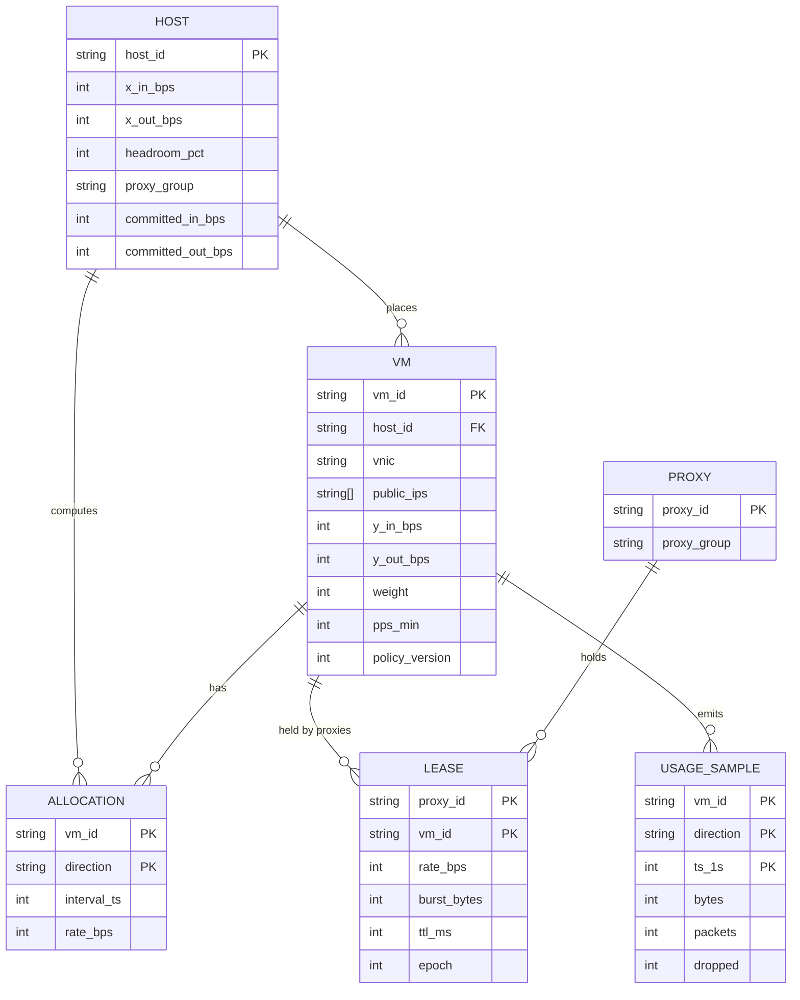

Access patterns that justify it: the host agent reads "all VMs on my host" (partition by `host_id`); a proxy reads "all VMs whose IPs hash to me" (by `proxy_group`); billing reads "usage for one VM over a month" (partition by `vm_id`, cluster by `ts`). `committed_in_bps` and `committed_out_bps` on the host row are the admission counters; they are updated in the same transaction as the VM row so placement can never oversubscribe (§4.3).

---

## 4. High-level design

One subsection per functional requirement. Each one traces input to output through the boxes, adds the boxes it needs to a single diagram, and ends with what is still missing (which a deep dive in §5 fixes). The design at the end of §4 is deliberately the simple version.

### 4.1 Egress: a VM sends to the Internet and gets at least `Y_out`

**Flow (simple version):**

1. The VM writes a packet to its vNIC. The host sees it on a tap device (or an SR-IOV VF queue).
2. The host datapath (the "on-host proxy" in the hint; in practice the vSwitch, an eBPF program, or the SmartNIC) classifies the packet by source vNIC to a VM id.
3. The packet enters that VM's egress class: a token bucket with `rate = Y_out` (guaranteed) and `ceil = X_out` (cap). All VM classes hang under one parent class with `rate = X_out`.
4. If the VM's bucket has tokens, send. If not, the class may **borrow** from the parent if any sibling is under its rate and the parent has spare. That borrowing is what makes it work conserving.
5. If nothing can be borrowed, the packet queues in the VM's own queue (bounded, a few ms of `Y_out`), then drops. The VM's TCP stack sees the drop and backs off. Other VMs' queues are untouched.
6. Packet leaves the NIC.

This is exactly Linux HTB semantics: `rate` = the minimum, `ceil` = the maximum, parent `rate` = the NIC. Nothing else is needed for the guarantee: with `sum(Y_out) <= X_out` (guaranteed by placement, §4.3) every VM can always drain its `rate` because the parent has that much by construction.

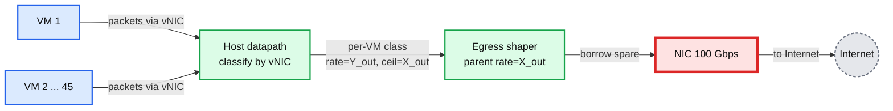

Data model so far: `vm.y_out`, `host.x_out`.

**What is still missing:** a single HTB tree has one qdisc lock and one root class that every packet touches, and it is known to cap out well below 100 Gbps of small packets on one core. §5.1 replaces it with timestamp-based pacing and moves it to hardware. The semantics above do not change.

### 4.2 Ingress: the Internet sends to a VM and the VM gets at least `Y_in`

The direction that decides the interview. The host cannot shape what it has not received. By the time a packet is at the NIC, its share of `X_in` is spent. If 40 Gbps of junk arrives for VM1 on a 50 Gbps NIC, the ToR switch queue for that host overflows and drops packets from every VM, including the one we promised 1 Gbps to. So enforcement must happen **before** the host. That is the "off-host proxies" in the hint.

**Flow (simple version, static split):**

1. A packet from the Internet arrives at the region edge router with destination = VM1's public IP.
2. The edge does ECMP over the proxy group that owns that IP block: 8 of the region's 500 proxies. The packet lands on one of the 8.
3. The proxy looks up `dst IP -> (vm_id, host_id)` in its local map (pushed by the controller, refreshed on change).
4. The proxy runs the VM's ingress token bucket. Simple version: `rate = Y_in / 8` (its equal share of the floor). Tokens present: forward. Otherwise: drop.
5. The proxy also runs a per-host bucket, `rate = X_in / 8`, so that no host can receive more than `X_in` in aggregate from all 8 proxies.
6. The proxy encapsulates the packet (VXLAN or Geneve, with `vm_id` in the header) and sends it to the host.
7. The host datapath decapsulates, classifies by `vm_id`, runs a **backstop policer** at `Y_in × 1.2` (drop above), and delivers to the vNIC.
8. TCP on the remote sender sees any drop and slows within one RTT (50 to 100 ms on the Internet). UDP does not; the proxy drops it and nobody else pays.

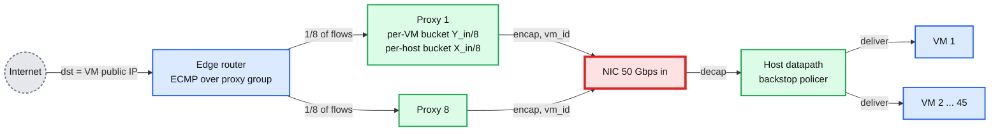

Data model so far: `vm.y_in`, `vm.public_ips`, `host.x_in`, `host.proxy_group`, and the proxy's local `ip -> (vm, host)` map.

**What is still missing:** two things. (a) It is not work conserving: VM1 can never receive more than `Y_in`, even when the other 44 VMs are idle, which throws away the revenue requirement. (b) ECMP is not uniform: a VM with 3 long-lived flows may have all of them on one proxy, which then admits only `Y_in / 8` while the other 7 buckets sit full. §5.2 fixes both with leases from the host.

### 4.3 Guarantees survive change: create, resize, delete

The guarantee is not made by the shaper. It is made here. If `sum(Y)` on a host exceeds `X`, no enforcement can deliver every minimum at once.

**Flow: `POST /vms {y_in: 1G, y_out: 2G}`**

1. The regional controller picks candidate hosts (bin packing on CPU, memory, and both network dimensions).
2. Admission check, in one transaction on the host row: `committed_out + y_out <= x_out × 0.9` and `committed_in + y_in <= x_in × 0.9`. If it fails, try the next host. If it passes, insert the VM row and bump `committed_*` in the same transaction. Two placements racing for the last slot cannot both win.
3. The host agent (one process per host, watches "VMs on my host") sees the new row and calls `SetClass(vm, egress, rate=2G, ceil=100G)` and `SetClass(vm, ingress, policer=1.2G)` on the datapath before the VM's vNIC is enabled.
4. The controller pushes `ip -> (vm, host)` to the 8 proxies in the host's group. They create the ingress bucket at the floor `Y_in / 8`.
5. Only then does the VM boot with networking.

**Flow: `PATCH /vms/{id}/qos {y_out: 4G}`**: same admission check against the delta; if it passes, `policy_version++`, host agent reprograms the class, proxies learn the new floor on the next push. Applied within 1 s. If it fails, the caller gets `409` and a hint to migrate (§10.11).

**Flow: `DELETE`**: vNIC disabled, class removed, `committed_*` decremented, proxies drop the map entry. Order matters: capacity is released last, so a concurrent placement cannot use it while the old VM is still sending.

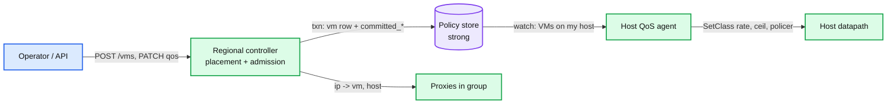

Data model so far: `host.committed_in_bps`, `host.committed_out_bps`, `vm.policy_version`.

**What is still missing:** what happens to the buckets when the agent or a proxy is down. §5.3.

### 4.4 Metering: bill for bandwidth above `Y`

**Flow:**

1. The datapath keeps per-VM, per-direction counters: `bytes, packets, dropped`. Per-core counters, summed on read, no locks.
2. The host agent reads them every 1 s and emits a `usage_sample` to a Kafka topic partitioned by `vm_id`.
3. A consumer writes 1 s samples to a time series store (30 days) and rolls up to hourly for billing (`bytes above Y × seconds`).
4. `GET /vms/{id}/usage` reads the time series store.

The agent's ingress counter counts what the host **received**, so the proxies' drops are not billed. That is the customer-fair choice: you pay for bytes delivered.

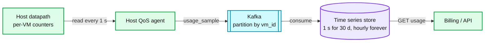

End of §4. We have a correct but naive design: egress is right but will not scale to 100 Gbps in software, ingress is guaranteed but not work conserving, and nothing has been said about failure.

---

## 5. Deep dives

One per non-functional requirement. Each one names what breaks in the §4 design with a number, fixes it, and lists what changed in the API, the data model, and the diagram.

### 5.1 "Per-packet decision at 100 Gbps with no remote call": what runs on the host

**What breaks.** HTB is one tree behind one qdisc lock. Every packet takes the lock, walks its class, may walk the parent to borrow, and dequeues. The lock serialises all transmit queues, so more cores do not help. Google's Carousel paper (SIGCOMM 2017) measured it: with HTB the machine saturates at 600k TCP request-response transactions per second, without HTB at 800k (33% more), the cause is "the global Qdisc lock acquired on every packet enqueue", and in their busiest cluster the lock wait reached 1 s at p99. Cilium's bandwidth manager avoids the token-bucket qdisc for the same reason ("scalability concerns in particular for multi-queue network interfaces"). Numbers and URLs in [`deep-dives/egress-shaping-htb-and-edt.md`](deep-dives/egress-shaping-htb-and-edt.md).

**Fix: EDT pacing with rates computed by the host agent.**
- Each packet gets an **earliest departure time** stamped by the classifier: `edt = max(now, last_edt[vm] + len / rate[vm])`. The NIC queue (`fq` qdisc, or the SmartNIC's timing wheel) releases packets when their timestamp comes due. No shared lock: each VM's `last_edt` is its own cache line, and the timing wheel is per transmit queue.
- Work conservation moves from per-packet borrowing to the **100 ms loop**: the host agent reads each VM's egress demand (bytes enqueued, backlog) and computes `rate[vm]` by weighted max-min with floor `Y_out` and total `X_out × 0.9` (the same algorithm as ingress, [`deep-dives/allocation-loop-and-fairness.md`](deep-dives/allocation-loop-and-fairness.md)). A VM that starts sending gets `Y_out` immediately and its share of spare capacity 100 ms later.
- At 100 Gbps the whole classify-stamp-count path runs on the SmartNIC (Nitro, Titanium/IPU, MANA class hardware) with the host agent programming rates over a control channel. The software path (XDP or tc-BPF) is the fallback for older hosts and for VM-to-VM traffic.

**Push back on the textbook answer.** "Use HTB" is the correct semantic answer and the wrong implementation at 100 Gbps. Say both.

**What changed:** the egress shaper is now `EDT + per-VM rate`, and `rate` is soft state set every 100 ms by the agent. `SetClass` gains a `rate` that the agent updates continuously, not once at VM create. Diagram: the host box is now `classify, stamp EDT, count` plus `fq / timing wheel`.

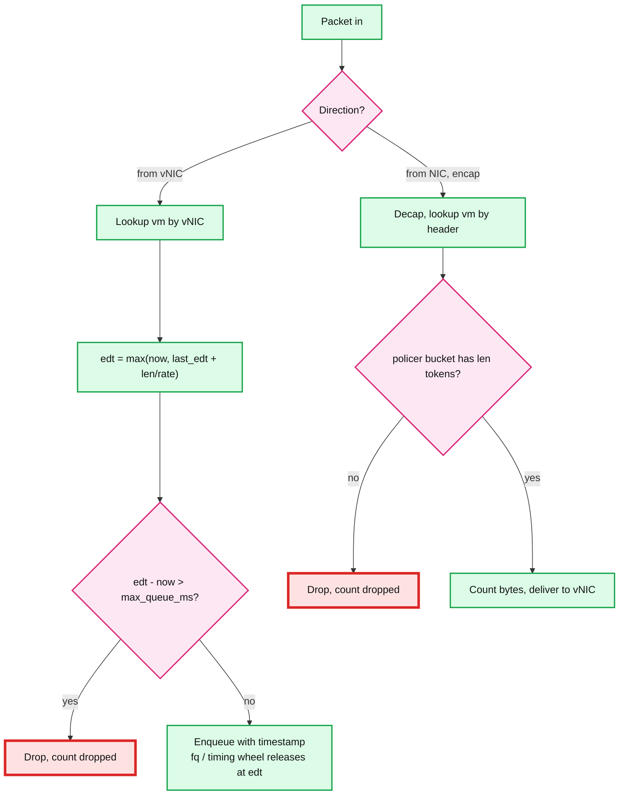

### 5.2 "Ingress guaranteed in 99.9% of 1 s windows, work conserving, converged in 200 ms": the lease loop

**What breaks.** The static split in §4.2 gives every VM exactly `Y_in / 8` per proxy. Two failures with numbers: (a) 44 idle VMs and VM1 wanting 40 Gbps gets 1 Gbps, leaving 44 Gbps of paid-for NIC unused; (b) ECMP puts VM1's three flows on proxy 3, which admits 125 Mbps while proxies 1, 2, 4 to 8 admit nothing, so VM1 gets 125 Mbps instead of its 1 Gbps floor. Failure (b) is a broken guarantee, not just lost revenue.

**Fix: the host is the allocator for its own ingress; proxies hold leases.**
- Every 100 ms each proxy sends the host agent a `Report`: for each VM on that host, `fwd_bytes`, `dropped_bytes`, `wanted_bytes` (arrived, whether forwarded or not) in the last interval.
- The agent now has, per VM, demand from all 8 proxies. It computes the per-VM ingress allocation: weighted max-min with floor `Y_in` and total `X_in × 0.9`. Then it splits each VM's allocation across its proxies **in proportion to each proxy's `wanted`**. That fixes the ECMP skew: proxy 3 gets the whole 1 Gbps if it saw all the demand.
- The `Report` response carries `Leases`: `(vm, rate, burst, ttl = 500 ms, epoch)`. The proxy swaps the bucket's rate atomically. A proxy that has no lease for a VM (new VM, expired lease) uses the floor `Y_in / 8`, the safe default from §4.2.
- The per-host bucket on the proxy is now `sum of its leases for that host`, plus the floor for unleased VMs. Because the agent never hands out more than `X_in × 0.9` in total, the sum over all 8 proxies is bounded and the NIC is never oversubscribed by proxied traffic. Headroom absorbs the skew of leases arriving at 8 proxies at slightly different times.
- The host backstop policer moves from `Y_in × 1.2` to `allocation × 1.2`, updated by the agent each interval. It exists for the case where a proxy is misbehaving, not for normal operation.

**The burst-from-idle timeline** (VM1 idle, then 40 Gbps of TCP arrives, other VMs idle):
- t = 0 to 100 ms: proxies admit at floor, 1 Gbps total. Senders' TCP sees loss and backs off; `wanted` in the reports still shows the demand.
- t = 100 ms: agent sees `wanted` = 40 Gbps, spare = 44 Gbps, leases 40 Gbps split by per-proxy demand.
- t = 100 to 200 ms: proxies admit up to 40 Gbps; TCP ramps back.
- Guarantee: never violated (VM1 always had >= `Y_in`, others were idle). Cost: 100 to 200 ms before the burst is served. That is the "statistical 99.9" in the prompt made precise: we lose at most two intervals per demand step.

**The other direction of the same timeline** (VM2 starts demanding its `Y_in` while VM1 holds 40 Gbps of leases): VM2's proxies admit at floor immediately, so VM2 gets `Y_in` from t = 0 without waiting for a lease. Between t = 0 and 100 ms the NIC carries `40 + 1 = 41 Gbps`, which is fine because VM1 was leased out of a 45 Gbps budget that already excluded nothing but idle floors. At the next interval the agent re-runs the water-fill and VM1 is cut to whatever is left. The only way to exceed `X_in × 0.9` is several idle VMs waking at their floor inside the same interval: `m` wake-ups cost `m × Y_in` of overshoot. Headroom of 5 Gbps absorbs 4 simultaneous wake-ups; a fifth costs one interval of ToR drops for everyone on that host. That event is the whole 0.1% in the SLO, and the knobs that shrink it are headroom, a 10 ms interval, and floor hysteresis (do not lease out a floor until its VM has been idle for 1 s). [`deep-dives/allocation-loop-and-fairness.md`](deep-dives/allocation-loop-and-fairness.md) §4 does the bound with a Poisson model.

**Why the host and not a central allocator.** The natural shard key is the host: it owns the NIC, it already knows its VMs, and its allocation is independent of every other host. A regional allocator would be a hot loop dependency with 800k RPC/s and a failover story. The host agent is 10k tiny allocators that fail independently.

**Why not gossip between proxies.** The sketch on the whiteboard had gossip with last-write-wins between proxies. The 8 proxies of one VM would need to agree on how to split one number; gossip converges in `log N` rounds and gives no invariant that the sum stays under `X_in`. The host already knows the sum. Use it. [`../../concepts/gossip-protocol.md`](../../concepts/gossip-protocol.md) has the general rule: gossip for liveness and hints, never for a budget.

**What changed:** new RPCs `Report` and `Leases` (§3.2), new soft-state entities `allocation` and `lease` (§3.3), the proxy bucket rate is now a lease with a TTL, the host policer tracks the allocation. Diagram: a dashed 100 ms loop between proxies and the host agent.

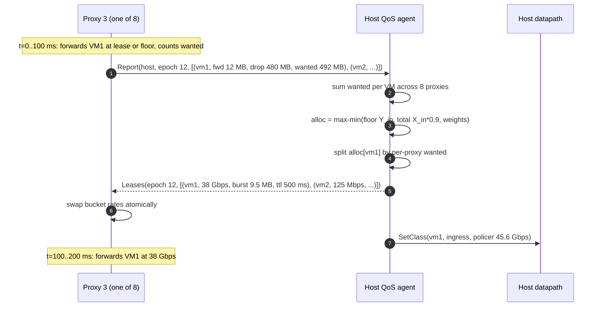

### 5.3 "Control plane fails, no VM drops below `Y`": fail policy

**What breaks.** After §5.2 a proxy holds a lease that might say "VM1 may receive 40 Gbps". If the host agent dies and the lease never expires, VM1 keeps 40 Gbps while VM2 wakes up and finds only floor... which is still fine for VM2 (floor is admitted without a lease) but the NIC now carries 41 Gbps and VM3 to VM45 waking up would push it to 85. Stale leases plus no allocator equals oversubscription. Conversely, if proxies fail closed to zero when the agent is gone, every VM on the host loses ingress because one control process crashed. Both are wrong.

**Fix: leases expire to the floor, never to zero and never to the ceiling.**

| Component down | Detection | Data path effect | Recovery |
|---|---|---|---|
| Host QoS agent | Proxies see no `Leases` for 500 ms (TTL) | Proxies keep the last lease for one grace TTL, then fall to floor `Y_in / 8` per VM. Sum of floors <= `X_in × 0.9`, so the NIC is safe. Egress rates freeze at the last value (still >= `Y_out` each) | Agent restarts with `epoch + 1` (from a local file plus the controller). Leases with the old epoch are ignored by the agent's `Report` handler, so a proxy that talked to a zombie is corrected next interval |
| One proxy | Edge health check (BFD, 300 ms) | ECMP re-hashes its 1/8 of flows to the other 7. Those proxies have no lease for the moved flows' extra demand and admit at floor for at most one interval, then get leases | New proxy starts empty, learns the `ip -> vm` map from the controller, admits at floor |
| Regional controller | Hosts and proxies see failed watches | Nothing changes on any packet path. No placement, no resize, no new `ip -> vm` entries. Existing leases keep cycling | Controller is a replicated service (3 replicas, leader-elected); RTO 30 s |
| Policy store | Controller cannot commit | Same as controller down; also blocks VM boot | Standard DB failover |
| Host <-> proxy partition (proxies reachable from the Internet but not from the host's control network) | Same as agent down, from the proxy's view | Fall to floor | Heals when the partition heals |
| Metering pipeline | Kafka lag | Zero data-path effect. Samples buffer on the agent (1 h) then drop; billing is reconciled from the proxies' own counters | Standard Kafka runbook |

**The rule in one sentence:** the per-VM floor is a static fact every proxy can enforce alone; everything above the floor is a lease with a TTL. So the worst case of any failure is "no bursting", never "no guarantee" and never "oversubscribed NIC". The one place we fail closed is the per-host cap on the proxy, which is a sum of floors and leases and therefore never exceeds `X_in × 0.9` even with no leases at all.

**What changed:** `epoch` in every lease and report, `ttl_ms`, the grace period, and a safe-policy table on the proxy (`floor per VM`) that is pushed by the controller and cached on local disk so a proxy can restart without the controller.

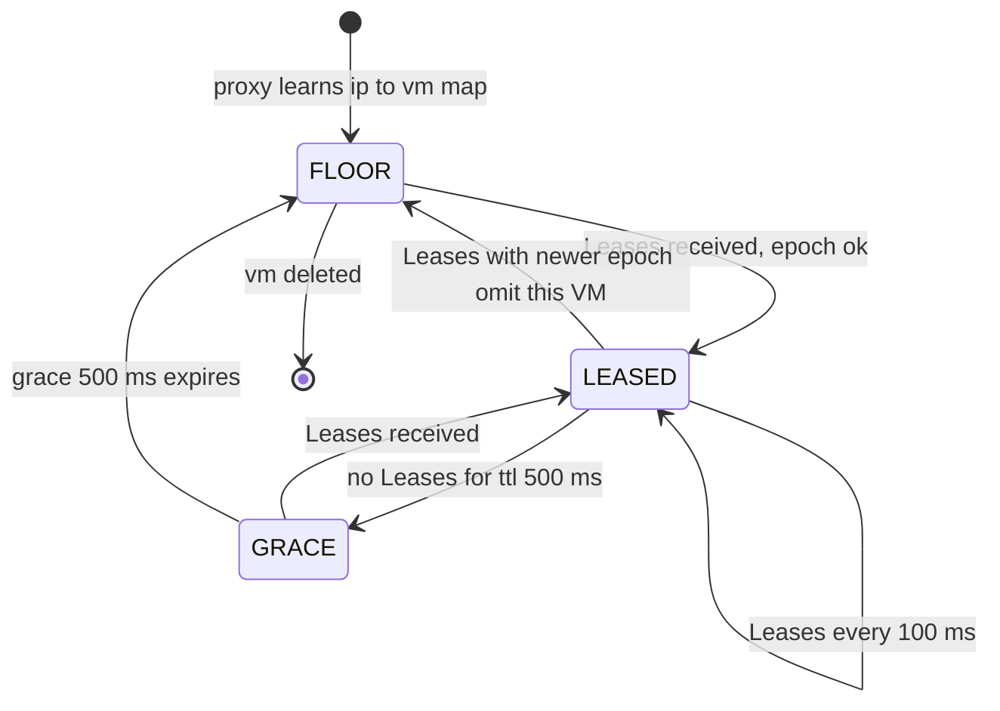

### 5.4 "50k hosts, 2.5 M VMs": what scales and what is hot

**What breaks.** Nothing structural; the §2 math says the loop costs 7 Gbps and 800k RPC/s per region. The hot spots are per-node:
- A proxy at 100 Gbps forwarding 8,000 VMs' buckets: bucket lookups are a hash on `dst IP`, 8,000 entries fit in L2, and the per-packet work is a token bucket plus encap. XDP or DPDK at 20 to 30 Mpps per core handles it; 4 cores per 100 Gbps of 1500 B packets.
- **A hot VM**: one VM receiving 40 Gbps through 8 proxies is 5 Gbps per proxy, fine. One VM receiving 40 Gbps through 1 proxy (a single elephant flow, since ECMP hashes on the 5-tuple) is a 40 Gbps flow on one proxy, which is the single-flow limit of the proxy's NIC queue. That is why public clouds document a per-flow cap (typically 5 to 10 Gbps) separately from the per-VM cap. We do the same: `per_flow_ceil = 10 Gbps`.
- The host agent: 8 reports per 100 ms, 45 VMs, an O(VMs log VMs) water-fill. Microseconds. It runs on the host's management cores, never on the datapath cores.
- The controller: 2.5 M VM rows, 50k host rows, writes only on create/resize/delete (say 100/s per region). Sharded by host id range if needed. It is not on any hot loop.

**What changed:** `per_flow_ceil` added to the proxy bucket; proxies are the only component whose count grows with Internet bandwidth, not with VM count. Everything else is per host.

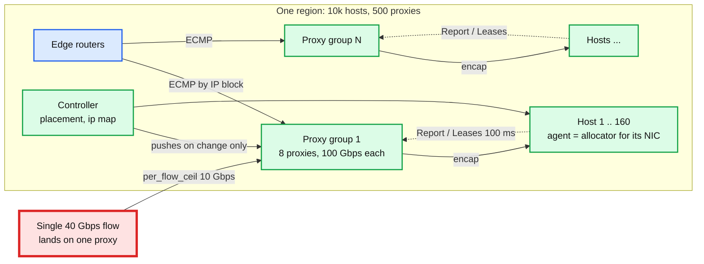

### 5.5 "Noisy neighbor beyond bytes": packets, CPU, and the small-packet attack

**What breaks.** Everything so far meters bytes. A neighbor sending 64 B packets at 10 Gbps is 14.9 Mpps, which costs the host datapath (and the proxy) 18x the CPU of 10 Gbps of 1500 B packets. Bytes-only buckets say "10 Gbps, within ceiling"; the softirq cores are pinned at 100% and every VM's latency and throughput collapse. This is the real noisy-neighbor problem on a host and the one candidates miss.

**Fix: a second bucket in packets, and CPU as a first-class shared resource.**
- Each VM class has `pps_min` and `pps_ceil` alongside bytes, enforced by the same EDT stamp (`edt = max(byte_edt, pkt_edt)`). Sell `pps_min` = 200 kpps per VM, ceil 2 Mpps; the host total is 8 Mpps for the software path. On a SmartNIC the ceiling is higher and the host CPU is not involved.
- Datapath CPU is isolated per VM the same way vhost threads are: a VM's packet processing is charged to its own cgroup or its own NIC queue pair, so its 64 B storm burns its own budget. Andromeda and VFP both do this with per-VM queues on the offload path.
- The same second bucket runs on the proxies for ingress, because the attack can come from outside.

**What changed:** `pps_min`, `pps_ceil` on the VM row, a second token bucket per class, and the `Report` carries `pkts`. The ingress allocation loop water-fills two resources (bytes, packets) independently; a VM gets the min of the two.

---

## 6. Final design and the five core flows

Everything from §5 composed. Under 15 nodes; zoom-ins in [`diagrams.md`](diagrams.md).

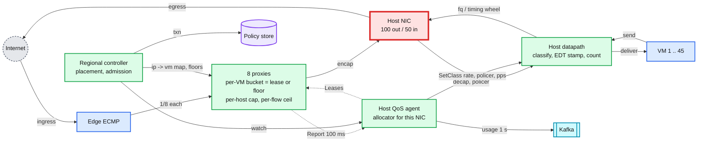

The five flows below are the ones to be able to say from memory. Each is the final design, not the §4 version.

### Flow 1: egress packet (per packet, on host, about 100 ns)

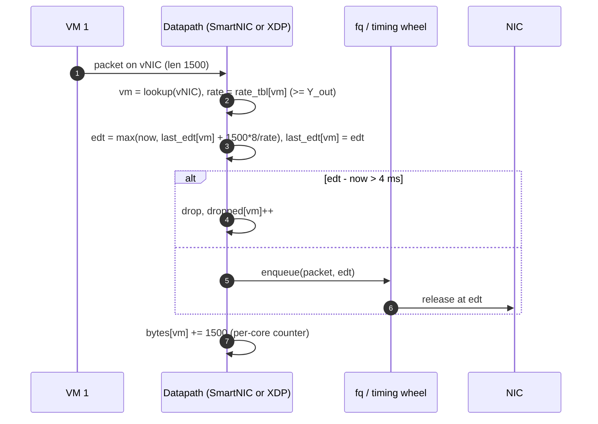

### Flow 2: ingress packet (per packet, proxy then host)

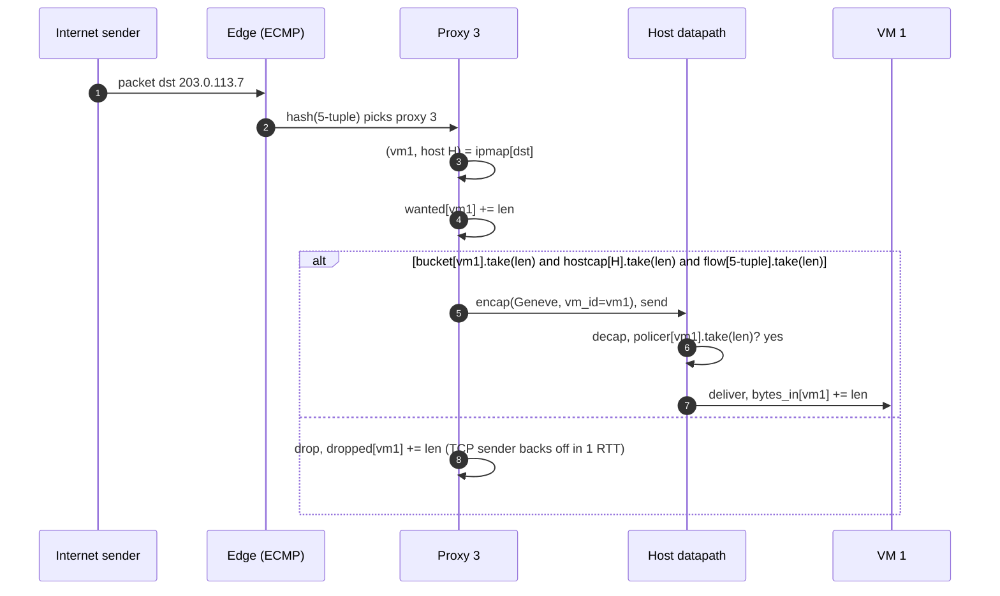

### Flow 3: the 100 ms loop (per host, agent and 8 proxies)

Shown in §5.2. Summary: `Report` up with `fwd, dropped, wanted, pkts` per VM; agent water-fills bytes and packets with floors `Y` and total `X × 0.9`; splits per proxy by `wanted`; `Leases` down with `ttl 500 ms, epoch`; agent also sets egress `rate[vm]` and the ingress policer.

### Flow 4: VM create (control plane, seconds)

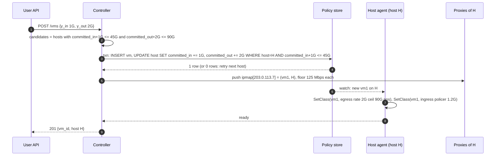

### Flow 5: host agent dies (failure, 1 s)

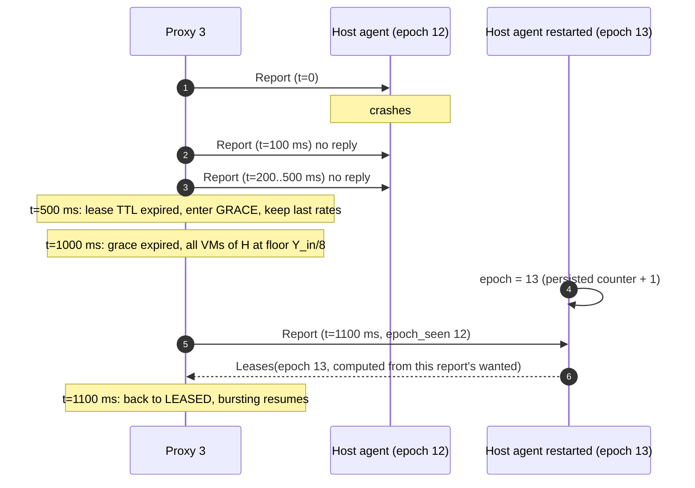

---

## 7. Trade-offs

| Decision | Option A | Option B | Chose | Why |
|---|---|---|---|---|
| Where ingress is enforced | On the receiving host (police, rely on TCP backoff) | Off-host proxies before the NIC | B | A cannot protect the NIC from a UDP burst; the ToR drops everyone's packets. B costs a proxy tier (about 5% of edge bandwidth in extra hops) |
| Who allocates ingress | Central regional allocator | The destination host's agent | Host | Host already owns the numbers, shards perfectly, fails independently. Central is an 800k RPC/s hot loop with a failover story |
| Work conservation for ingress | Static split `Y_in / n_proxies` | Demand-driven leases every 100 ms | Leases | Static wastes up to 89% of `X_in` and breaks under ECMP skew. Leases cost 7 Gbps of control traffic per region |
| Burst latency vs oversubscription | Admit bursts optimistically above floor before a lease | Floor until leased | Floor | Optimistic admission can oversubscribe the NIC by `8 × burst` per VM; the floor is the only thing we can prove. Cost: 100 to 200 ms before a burst is served |
| Egress mechanism | HTB tree in the kernel | EDT stamping + fq / SmartNIC, rates from the agent | EDT | HTB's root lock caps well under 100 Gbps of small packets. EDT costs a 100 ms loop for work conservation instead of per-packet borrowing |
| Fail policy for leases | Fail open (keep bursting) | Fail closed (zero) | Neither: fall to floor | Open oversubscribes the NIC, closed breaks the guarantee. Floor is the invariant we sold |
| Guarantee semantics | Hard (every 1 s window) | Statistical (99.9% of windows) | Statistical | Hard needs zero-interval convergence, which needs per-packet signalling across the proxies. 99.9% with a 100 ms loop is what the physics allows and what public clouds ship |
| What we refused to build | Gossip between proxies, a global bandwidth optimizer, per-flow fairness, latency SLOs | | | Each is a real system (BwE, Silo) and none is needed for "min Y, max X per VM" |

Consistency model, stated once: the guarantee (`sum Y <= X`) is **strong**, enforced by a transaction on the host row. Allocations and leases are **eventual** on a 100 ms cycle. Metering is **eventual** at 1 s. Nothing on the packet path reads anything that is not local.

---

## 8. Staff-level notes

- **Simplest thing that meets the requirement.** Egress needs no distributed system at all: a per-VM shaper with `rate = Y, ceil = X` and a placement invariant. Only ingress needs a loop, and the loop is per host. We refused a global allocator, gossip, and per-flow fairness.
- **Failure modes and blast radius.** Agent down: one host stops bursting. Proxy down: 1/8 of one proxy group's flows re-hash. Controller down: no new VMs region-wide, zero packet impact. Policy store down: same plus no resize. The largest blast radius is a bad `ip -> vm` map push (wrong host for an IP), which is why the push is versioned and the host rejects encapsulated packets for VMs it does not host.
- **Migration.** Existing hosts run plain HTB with static `Y` caps and no bursting. Phase 1: deploy agents and proxies in shadow mode (leases computed, not applied) and compare what would have been admitted; phase 2: enable leases per proxy group, rollback is "stop sending leases" which falls everything to floor, the old behaviour; phase 3: move egress from HTB to EDT host by host, rollback is a qdisc swap.
- **Operability.** SLO: 99.9% of 1 s windows with `received >= min(wanted, Y)` per VM. Pages at 3am: a host whose NIC utilisation is above `X × 0.95` for 10 s (the guarantee is at risk); a proxy group with >1% of VMs in FLOOR state for 60 s (agents unreachable); lease loop p99 > 300 ms. Dashboards: per host `sum leases vs X`, per VM `wanted vs allocated vs received`, FLOOR-state count, proxy drops by reason.
- **Cost.** The proxy tier is the bill: 500 × 100 Gbps nodes per region for ingress. Against 10k hosts that is 5% more machines. The 10% headroom is 10% of every NIC unsold; halving the loop interval to 50 ms would let headroom drop to 5% at 2x control traffic. Engineering: one team owns host datapath and agent, one owns proxies and edge, placement lives with the cluster manager. The lease protocol is the contract between the first two.
- **Explicit trade-off.** Floor-until-leased costs every customer 100 to 200 ms of burst latency to guarantee the NIC is never oversubscribed. Say that number. An interviewer who wants faster bursts is asking you to spend headroom, and you can show the exchange rate.

---

## 9. What is expected at each level

**Mid (80/20 breadth/depth).** Draws a per-VM rate limiter on the host for both directions, says "token bucket, min Y, max X", uses the same box for ingress and egress. Knows HTB or a cloud rate limit exists. May not notice that ingress cannot be enforced after the NIC. Passes if the diagram is clean and the requirements are stated.

**Senior (60/40).** Separates egress (host) from ingress (before the host), explains why, and puts a proxy tier in front. Knows the guarantee depends on placement (`sum Y <= X`). Proposes a control loop between proxies and something, probably a central service. Names fail-open vs fail-closed. Goes deep on one of: HTB vs EDT, the loop interval and overshoot, failure of the allocator.

**Staff+ (40/60).** Everything above, plus: the host is the allocator (no central service on the hot loop), floor-until-leased with the headroom math, the burst-from-idle timeline with numbers, the pps second bucket and CPU as the real noisy-neighbor resource, per-flow ceiling because of ECMP, the migration in three phases with rollback = fall to floor, and the cost of the proxy tier as a percentage of the fleet. Says out loud what is not built (gossip, global optimizer, latency SLO) and why the guarantee is statistical.

---

## 10. Nitty-gritty (past interview scope)

### 10.1 Internals of each chosen technology

**Token bucket vs GCRA.** A token bucket stores `tokens` and `last_ts`; on arrival `tokens = min(burst, tokens + rate × (now − last_ts))`, admit if `tokens >= len`. GCRA (virtual scheduling) stores one timestamp `tat` (theoretical arrival time) and admits if `now >= tat − tolerance`, then `tat = max(now, tat) + len / rate`. Same behaviour, half the state, and GCRA's `tat` **is** the EDT timestamp. That is why EDT pacing and rate limiting are the same code path.

**HTB.** Classes in a tree; each has `rate` (guaranteed), `ceil` (cap), `burst`, `cburst`, `quantum` (bytes served per round when borrowing). A class under `rate` is green and dequeues freely; between `rate` and `ceil` it is yellow and must borrow from an ancestor with spare; above `ceil` it is red and waits. Borrowing is round robin by `quantum` among yellow siblings at the same level. All of this runs under the qdisc root lock per dequeue. [`deep-dives/egress-shaping-htb-and-edt.md`](deep-dives/egress-shaping-htb-and-edt.md).

**EDT with fq.** The classifier sets `skb->tstamp`. `sch_fq` keeps flows in a red-black tree ordered by next departure time and a timing-wheel-like "time slots"; it dequeues a packet when `now >= tstamp`, else sets a high-resolution timer. Because the decision was made when the timestamp was set, the qdisc does no rate math and takes no class lock. `fq` also enforces `maxrate` per flow and a per-flow packet limit. On a SmartNIC the same structure is a hardware timing wheel per transmit queue.

**Proxy datapath.** XDP or DPDK; per-packet: parse dst IP, hash into `ipmap` (open addressing, 8k entries), two or three bucket checks (VM, host, flow), Geneve encap, transmit. Flow table for `per_flow_ceil` is a small LRU keyed by 5-tuple; a miss creates an entry at the ceiling rate.

**ECMP at the edge.** Routers hash the 5-tuple (or dst IP only if asked) onto the next hops advertised for the IP block. All 8 proxies advertise the block over BGP with equal cost; withdrawing the route on health-check failure re-hashes only the flows that were on the failed proxy if the router does consistent hashing (resilient hashing), else all of them.

### 10.2 Configuration knobs that matter

| Knob | Value | Why |
|---|---|---|
| Control interval `T` | 100 ms | Overshoot and burst latency scale with `T`; control traffic scales with `1/T`. 100 ms puts control traffic at 0.0014% of data traffic and burst latency at 1 to 2 intervals. 10 ms is affordable (16k RPC/s per proxy) and cuts burst latency to 10 to 20 ms; EyeQ runs at 200 us but host-to-host inside one datacenter, which we are not |
| Lease TTL / grace | 500 ms / 500 ms | 5 missed intervals before a proxy assumes the agent is gone; 1 s to floor. Shorter flaps on GC pauses |
| Headroom | 10% per direction | Must cover `T × (sum of floors that can wake in one interval)` plus lease skew across 8 proxies |
| Bucket burst | `rate × 2 ms` | Enough to absorb TSO / GRO batches (64 KB) at `Y`; small enough that a burst never means a queue |
| Egress max queue | 4 ms of `rate` | Beyond this, drop instead of delay; keeps latency bounded and lets TCP react |
| Ingress policer multiplier | 1.2 × allocation | Backstop only; wide enough that lease skew never trips it in normal operation |
| Proxies per VM | 8 | Enough that a proxy loss costs 12.5% for one interval; few enough that per-proxy demand is meaningful |
| `per_flow_ceil` | 10 Gbps | A single flow lands on one proxy queue; this is that queue's practical limit |
| `pps_min` / `pps_ceil` | 200 kpps / 2 Mpps | Software path total 8 Mpps at 45 VMs; SmartNIC hosts raise the ceiling |

### 10.3 Capacity math per component

| Component | Unit load | Limit | Closest to limit? |
|---|---|---|---|
| Host datapath (software) | 8.1 Mpps at 1500 B, 45 × 2 buckets | About 20 Mpps per 4 cores with XDP; 148 Mpps at 64 B is unreachable | Yes at small packets. Hence pps buckets and SmartNIC |
| Host datapath (SmartNIC) | Same | Line rate at any size on Nitro / IPU class cards | No |
| Host agent | 80 reports/s in, 45 VMs, 2 water-fills | Microseconds per interval | No |
| Proxy | 100 Gbps, 8,000 VM buckets, 160 hosts, 1,600 RPC/s | 4 to 6 cores for the datapath, 1 for the loop | No, but proxies are the only tier bought for this design |
| Controller | 100 writes/s, 2.5 M rows | Any sharded SQL | No |
| Kafka metering | 2.5 M VMs × 2 dirs × 1/s = 5 M msgs/s at 40 B | 200 MB/s, 20 partitions per region | No |
| ToR downlink | Sum of proxied ingress to the host | `X_in × 0.9` by construction plus non-proxied DC traffic | The headroom is what protects it |

### 10.4 Failure timeline

**Ingress burst hits VM1 while agent is alive** (the guarantee under attack):

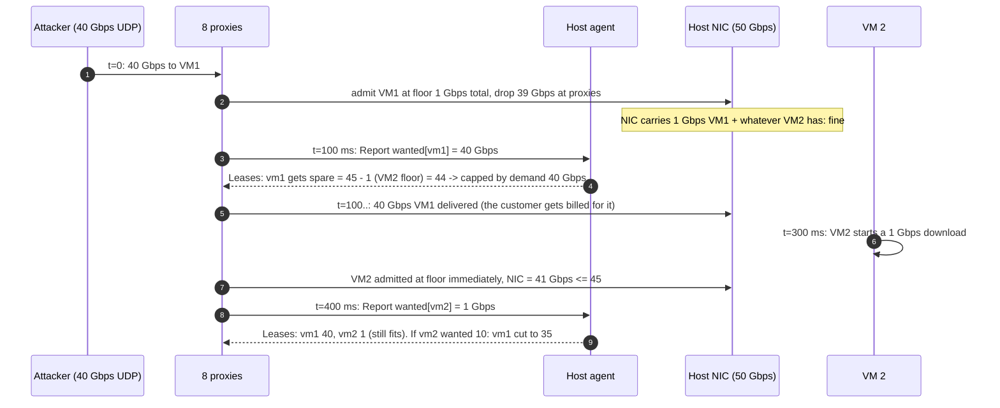

Second failure timeline (agent crash) is Flow 5 in §6. Third (proxy crash): BFD detects in 300 ms, route withdrawn, ECMP re-hash, moved flows at floor for one interval, then leased. Data at risk: zero; packets in the dead proxy's queue (microseconds' worth) are lost, TCP retransmits.

### 10.5 Exactly-once and idempotency end to end

There is no exactly-once problem on the packet path; packets are not retried by us. The control plane has three idempotency points:
- `POST /vms` carries a client `request_id`; the controller stores it with the VM row, so a retried create returns the same VM.
- `Report` is idempotent by construction: it carries interval totals, not deltas, and a lost report just means the agent uses the previous `wanted` for one interval.
- `Leases` are idempotent: applying the same lease twice sets the same rate. A lease from an older epoch is ignored (agent restart), and a lease for a VM the proxy no longer maps is dropped.
- Metering: `usage_sample` is keyed `(vm, dir, ts_1s)`; the time series store upserts, so a re-sent sample after a Kafka retry does not double bill.

### 10.6 Consistency model per edge

| Edge | Model | Why |
|---|---|---|
| Controller -> policy store | Strong (transaction) | The admission invariant |
| Policy store -> host agent (watch) | Eventual, < 1 s | A VM boots only after the agent acks, so the gap is invisible |
| Controller -> proxies (ip map, floors) | Eventual, versioned push | A proxy with a stale map drops packets for an unknown IP (fail closed) rather than misrouting |
| Proxy -> agent (Report) | Eventual, best effort, 100 ms | Interval totals; loss degrades to last known |
| Agent -> proxy (Leases) | Eventual with TTL | Floor is the fallback |
| Agent -> datapath (SetClass) | Local, immediate | Shared memory table swap |
| Datapath -> Kafka -> TSDB | Eventual, 1 s, at-least-once with upsert | Billing tolerates minutes of lag |

### 10.7 Alternatives rejected

| Alternative | Why it looked attractive | Why rejected |
|---|---|---|
| Police ingress on the host only, rely on TCP backoff | No proxy tier; simplest | The NIC / ToR drops before the policer sees anything; UDP never backs off; the guarantee fails exactly when needed |
| Receiver-side ECN marking to slow Internet senders | Standard, no drops | Internet senders may ignore ECN; still after the NIC; no help against UDP |
| Central regional allocator (BwE style) | One global view, can do cross-host fairness | 800k RPC/s hot loop, failover, and no requirement needs cross-host fairness. Per-host is exact for this problem |
| Gossip between proxies with LWW | No host involvement | No invariant on the sum; `log N` convergence; LWW loses demand information. The host already knows the sum |
| Optimistic admission above floor before a lease | Faster bursts | Up to `8 × burst` oversubscription per VM per interval, which is the one thing that breaks everyone's guarantee |
| SR-IOV VF `max_tx_rate` per VM | Hardware, zero host CPU | Static cap, not work conserving; `min_tx_rate` support is patchy and not hierarchical |
| Per-VM queues on the ToR switch | Enforce ingress at the switch | 45 VMs × 40 hosts per rack = 1,800 queues per switch; hardware has tens per port; and the switch cannot see the tenant, only the host |
| Strict partition (each VM gets exactly `Y`, no burst) | Trivial, deterministic | Wastes the product's revenue; the prompt says bursting is the business |

### 10.8 How the big companies do it

Numbers below were checked against the primary sources on 2026-09-16; URLs and exact wording are in [`research/`](research/), spot-check tables at the end of each file.

- **The public contract is `Y`, `X`, and a per-flow ceiling.** AWS documents instance bandwidth as applying "to both inbound and outbound traffic", a baseline plus burst with "separate network I/O credit buckets for inbound and outbound", bursts of "5 to 60 minutes" that are "best effort ... as burst bandwidth is a shared resource", Internet-bound multi-flow traffic capped at 5 Gbps under 32 vCPUs and 50% of instance bandwidth above, and single flows capped at 5 Gbps (10 in a placement group, 25 with ENA Express). That is our `Y_in`/`Y_out`, the work-conserving burst, the lower Internet-path capacity, and `per_flow_ceil`, published as product.
- **Ingress is the one nobody guarantees.** Azure: "The network bandwidth allocated to each virtual machine is measured on egress (outbound) traffic ... Ingress isn't measured or limited directly." GCP: egress "generally 2 Gbps per vCPU" (C4: 100 Gbps standard, 200 Gbps Tier_1), while ingress from outside the VPC is protected by a cap of "1,800,000 pps or 30 Gbps", whichever first, and egress to outside the VPC is 3 Gbps per flow. So the big three cap ingress to protect the host; none sells a minimum. Our design goes one step further than the market, and the interviewer knows it: the proxy tier is the price of that step.
- **Google Carousel** (SIGCOMM 2017): replaced HTB and FQ/pacing at the host with EDT timestamps and one timing wheel per core, lock-free. Production video servers "each serving 37 Gbps at peak across tens of thousands flows"; result 8% less machine CPU, 20% less networking CPU; HTB's cost is "the global Qdisc lock acquired on every packet enqueue". FQ/pacing was accurate ("at most 6% from the target rate") but CPU-heavy. This is §5.1.
- **EyeQ** (NSDI 2013): the receiver meters every 200 us and sends RCP-style rate feedback to sender-side modules; worst-case convergence "30 iterations, 6 ms"; keeps 10% headroom. Its key observation is ours: "contention at the receiver first happens inside the switch, and not at the receiving server". EyeQ's senders are hosts in the same datacenter; our senders are the Internet, so the "senders" that hold rates are our proxies, and the loop is 100 ms over a management network instead of 200 us host to host.
- **Google Andromeda** (NSDI 2018) and **Azure VFP / AccelNet** (NSDI 2017 / 2018): the per-VM datapath with flow tables and QoS lives in a host vSwitch, and the fast path moves to hardware (FPGA in AccelNet, DPU in Azure MANA at up to 200 Gbps, Nitro at AWS). At 100 Gbps per host the shaper is on the card and the host agent only programs rates, which is the §5.1 "Great".
- **Google BwE** (SIGCOMM 2015) and the **hose model** (ElasticSwitch, Gatekeeper): BwE is the central hierarchical allocator alternative we rejected for a single NIC; the hose model is what we built (each VM has a virtual link of rate `Y` to the Internet, and a loop adds work conservation on top).

### 10.9 Operational runbook

Dashboards (5 metrics): per host `sum(leases) / X_in` and NIC utilisation both directions; per VM `wanted, allocated, received` (ingress) and `demand, rate, sent` (egress); count of `(proxy, VM)` pairs in FLOOR or GRACE state; proxy drops by reason (`vm_bucket`, `host_cap`, `flow_ceil`, `no_map`); lease loop latency p50 / p99.

Alerts: NIC > 95% of `X` for 10 s on any host (page: guarantee at risk, likely non-proxied traffic or a policer bypass); FLOOR-state pairs > 1% of a proxy group for 60 s (page: agents unreachable or partition); any VM with `received < min(wanted, Y) × 0.9` for 3 consecutive seconds (page: SLO breach); lease loop p99 > 300 ms (ticket: agent CPU or control network).

Rollout: agent and proxy binaries are canaried on one proxy group (8 proxies, 160 hosts) for 24 h in shadow, then 10% of groups, then all. Rollback for a bad lease computation: controller sets `leases_enabled = false` for the group; proxies fall to floor within 1 s; nothing else changes. Rollback for a bad datapath: qdisc or XDP program swap per host, VMs see one dropped batch.

### 10.10 Security and abuse

- The encapsulation header carries `vm_id`; the host accepts encapsulated packets only from proxy IPs (ACL on the NIC) and only for VMs it hosts. A spoofed `vm_id` is dropped and counted.
- A tenant cannot raise its own `Y`: `PATCH qos` is an authenticated control-plane call that runs admission.
- A tenant sending 64 B packets at its byte ceiling is caught by the pps bucket; a tenant receiving a flood pays nothing for dropped bytes and its neighbours never see it.
- Proxy `Report` and `Leases` run on the management network with mTLS; a forged lease would let a proxy oversubscribe a NIC, so lease messages are signed by the agent's epoch key.

### 10.11 Evolution

- **10x NICs (400 Gbps in, 1 Tbps out).** Software path is gone entirely; everything in the SmartNIC. Loop interval unchanged; headroom shrinks to 5% because the per-interval wake-up bound is a smaller fraction. Proxies become 400 Gbps DPUs.
- **VM-to-VM inside the datacenter.** No proxies on that path. The sender's host enforces egress as now; ingress is enforced by asking the **sending hosts** to hold leases: the receiving host's agent sends leases to the top-N sender hosts it sees, exactly EyeQ. The floor for unleased senders is `Y_in / N_senders` which is meaningless at large N, so the fallback there is ECN plus TCP, and the guarantee becomes softer. Say that honestly.
- **Latency SLO.** Add per-VM queue length limits and pacing at the sender (Silo). The EDT timestamps already give you the mechanism.
- **Resize that does not fit.** Live-migrate the VM to a host with room; the controller runs admission on the target before the migration starts and releases the source last.
- **Bill for burst by tier.** The lease loop already knows `allocated − Y`; a weight per tier changes the water-fill, no datapath change.

---

## 11. Follow-up questions to expect

Ranked by likelihood. Each links to an edge case or deep dive.

1. Why can't you just rate limit ingress on the host? [`deep-dives/ingress-guarantee-and-off-host-proxies.md`](deep-dives/ingress-guarantee-and-off-host-proxies.md)
2. Where is the guarantee actually enforced if `sum Y > X`? [`deep-dives/placement-and-admission-control.md`](deep-dives/placement-and-admission-control.md)
3. VM1 is flooded with 40 Gbps; walk me through VM2's next second. §10.4 and [`edge-cases.md`](edge-cases.md#edge-case-udp-flood-to-one-vm)
4. The host agent dies; do proxies fail open or closed? §5.3
5. Work conserving: how long until an idle VM gets the whole NIC? §5.2 timeline
6. HTB or something else at 100 Gbps? §5.1
7. Packets or bytes? A 64 B storm. §5.5
8. Eight proxies and one elephant flow. §5.4
9. Now it is VM-to-VM traffic. §10.11
10. What do you test and what pages? §10.9
11. Why not gossip between the proxies (as on my whiteboard)? §5.2 and [`my-attempt.md`](my-attempt.md)
12. Change a VM's `Y` at runtime; is there a moment it is unprotected? [`edge-cases.md`](edge-cases.md#edge-case-resize-y-upward-on-a-full-host)
