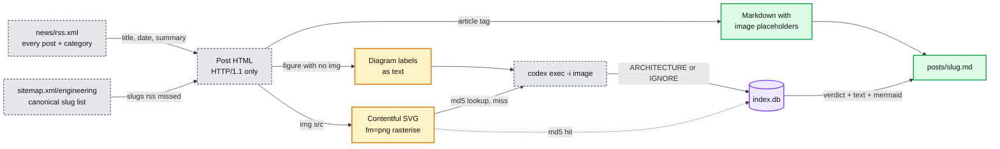

# OpenAI engineering blog harvest

Study material pulled from the OpenAI engineering blog (`openai.com/news/engineering/`).
Every post becomes one markdown file, and every architecture image in it becomes text plus
a Mermaid diagram (colored with the repo legend), so the whole thing is greppable and
renders in GitHub. Same shape and same tooling as `databricks/`.

```
openai/
  harvest.py        the tool (stdlib only, shells out to the Codex CLI)
  index.db          sqlite: posts, images, post_images
  index.md          generated table of every post (newest first)
  posts/<slug>.md   one file per post
```

Start with `index.md`.

## How it works



- **Listing.** There is no catalog JSON like the Databricks blog has. Two sources are
  unioned instead: `/news/rss.xml` (every post on the site, with its category, ISO date and
  summary) and `/sitemap.xml/engineering/` (the canonical slug list for one category).
  A slug present in either is harvested, so neither source has to be complete.
- **Body.** The post is a Tailwind soup with no semantic body container, so the parser draws
  the boundaries by what it throws away: the hero block, the table of contents, the
  `citations` section, the "Keep reading" carousel, and nav/button/svg/`sr-only` subtrees.
- **Code blocks.** openai.com renders code as `<code><pre>` (that nesting, not the usual one)
  with one `<div>` per line and the line number in a sibling `<span>`. The parser drops the
  gutter and steals the `<h4>` label above the block as the fence language.
- **Images.** Each `` becomes a `{{IMG:n}}` placeholder. Art cards, covers and logos are
  dropped by filename without a model call; the same asset rendered twice at different
  breakpoints is deduped. The rest go one at a time to `codex exec -i <file>` with a prompt
  that asks for a first line of `ARCHITECTURE` or `IGNORE`, then summary, components, flows,
  numbers and a Mermaid block. `IGNORE` images are removed from the markdown.
- **Interactive figures.** 19 diagrams on this blog are not images at all. They are animated
  HTML that draws itself with positioned divs, so there are no bytes to look at, only labels.
  A `<figure>` holding no `` becomes a `{{FIG:n}}` placeholder and its labels go to
  codex as text under the same verdict contract. Without this the flagship storage post
  yields zero diagrams and its figure labels leak into the prose as stray headings.
- **Cache.** Verdicts are stored by image MD5 in `index.db`, so a rerun (or a second post
  that reuses the same image) costs nothing. Failed annotations are not cached, so they retry.

## Running it

```bash
python3 openai/harvest.py                            # every engineering post
python3 openai/harvest.py --category security        # any category the sitemap index lists
python3 openai/harvest.py --since 2026 --limit 5     # a bounded batch
python3 openai/harvest.py --skip-codex               # markdown only, images left as links
python3 openai/harvest.py --force --slug scaling-postgresql   # redo one post
python3 openai/harvest.py --validate-mermaid         # render every diagram with mermaid-cli
python3 openai/harvest.py --list                     # what is in index.db
```

Reruns are incremental: posts already in `index.db` are skipped unless `--force`.
Useful knobs: `--effort low|medium|high` (Codex reasoning), `--max-workers 4`
(parallel codex processes), `--timeout 240`, `--model`.

Requirements: Python 3.11+, the `codex` CLI on PATH and logged in. `--validate-mermaid`
uses `mmdc` if present, else `npx -y @mermaid-js/mermaid-cli`.

## Keeping it up to date

Every stage is incremental: `harvest.py` skips slugs already in `index.db`, and image
verdicts are cached by MD5, so re-running costs nothing for what is already done.

```bash
python3 refresh.py --dry-run     # what is new on both blogs, spends nothing
python3 refresh.py               # fetch it and run the whole chain
python3 refresh.py --only openai # this blog only
```

`refresh.py` (repo root) exists because the stages have one working order: `harvest.py`
writes an `index.md` of every post it knows, and `classify.py` rewrites that same file to
technical posts only, so classify has to run after harvest or the marketing posts come back.

Two failure modes to know about:

- An image that fails to download or annotate is recorded in `index.db` with its reason, and
  the post is still marked done, so a normal rerun skips it. `--retry-failed` re-processes
  those posts. Nothing here has failed so far, since every image is served by Contentful,
  but a codex timeout or a rate limit would land in the same place.
- A post edited upstream after harvest is not refetched. Use `--force --slug <slug>` for that.

## Querying the index

```bash
sqlite3 openai/index.db "select published, title from posts order by published desc"
sqlite3 openai/index.db "select verdict, count(*) from images group by verdict"
sqlite3 openai/index.db "select slug, arch_count from posts order by arch_count desc limit 10"
```

## Gotchas found while building it

- **openai.com answers HTTP/2 with 403 and HTTP/1.1 with 200** for HTML pages. `urllib`
  speaks HTTP/1.1, so the harvester is unaffected, but `curl` needs `--http1.1`. The RSS
  feed and the sitemaps are served over either. `robots.txt` allows all of this.
- The default `Python-urllib/3.x` User-Agent is also 403'd. Any browser-shaped UA works.
- **Every architecture diagram on this blog is an SVG**, which a vision model cannot read.
  The Databricks harvester skips `.svg` as decoration; here that would throw away the whole
  point. Contentful rasterises on request, so images are downloaded as `<url>.svg?fm=png`.
  Contentful will not upscale past the asset's intrinsic size, so `w=1600` is a ceiling,
  not a promise.
- Light and dark variants of the same diagram both ship. The dark one lives in a
  `<source media="...prefers-color-scheme: dark">` and the light one on the ``, so
  parsing `` only picks the light variant for free.
- Three of the twenty posts have no `citations` section, so "end of body" also has to be
  detected from a `Keep reading` / `Author` / `Acknowledgements` heading.
- One post nests a second `<article>` inside the first, so the parser counts article depth
  instead of stopping at the first `</article>`.
- `codex exec` appends piped stdin to the prompt and blocks until EOF. Run it with
  `stdin=DEVNULL` or every call hangs to the timeout.
