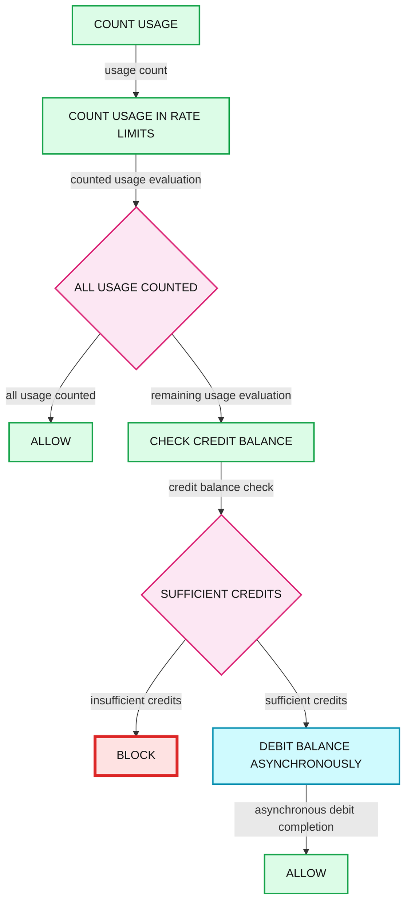
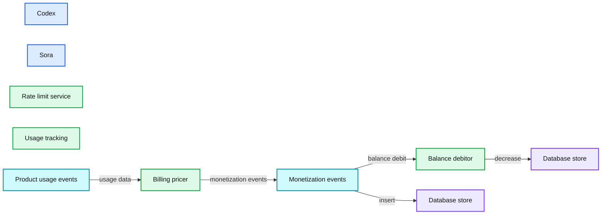

# Beyond rate limits: scaling access to Codex and Sora

*How OpenAI built a real-time access system combining rate limits, usage tracking, and credits to power continuous access to Sora and Codex.*

- Source: https://openai.com/index/beyond-rate-limits/
- Published: 2026-02-13
- Authors: Jonah Cohen
- Categories: Engineering
- Diagrams: 3 candidates, 2 extracted as architecture

In the past year, both Codex and Sora have seen rapid adoption, with usage quickly pushing beyond what we originally expected. We’ve seen a consistent pattern: users dive in, find real value, and then run into rate limits.

Rate limits can help smooth demand and ensure fair access; however, when users are getting value, hitting a hard stop can be frustrating. We wanted a way for users to keep going, while protecting system performance and user trust in our approach.

To solve this, we built a real‑time access engine that counts usage. One of the layers in that engine is the ability to purchase credits. When users exceed their rate limits, credits let them keep using our products by spending down their credit balance.

Underneath this is a complex system that fuses limits, real‑time usage tracking, and credit balances in a single access model. This post covers why scaling Codex and Sora required rethinking access control, how a provably correct, real-time system blends rate limits and credits per request, and how that foundation now unlocks additional access for both products.

## Why existing access models fell short

Zooming out, traditional access models tend to force a choice:

-

**Rate limits** can be helpful at first, but leave users with a bad experience when they run out: “come back later”

-

**Usage‑based billing** is flexible, but leaves users paying from the first token—not ideal for supporting early exploration

For Codex and Sora, neither was sufficient on its own. If we simply raised rate limits, we’d lose important demand-smoothing and fairness controls and run out of capacity to serve everyone. If we relied entirely on asynchronous usage billing, we’d introduce lag, overages, or reconciliation issues—exactly the kinds of problems users notice when they’re most engaged.

What we needed instead was a single hybrid system combining real-time limits with pay-as-you-go access:

This system had to:

-

Enforce rate limits *until* they’re reached

-

Seamlessly transition to credits *within the same request*

-

Make that decision in real time

-

Be rigorously accurate and auditable when tracking credit consumption

## Access as a waterfall, not a gate

One of the key conceptual shifts we made was modeling access as a **decision waterfall**. Instead of asking “is this allowed?”, we ask “how much is allowed, and from where?” When counting usage, the system goes through the following sequence:

**Summary:** Decision waterfall that evaluates rate-limit usage, then credit balance, to allow, block, or asynchronously debit usage.

**Components:**

- Count usage - technology unspecified
- Count usage in rate limits - technology unspecified
- All usage counted - decision point
- Allow - outcome
- Check credit balance - technology unspecified
- Sufficient credits - decision point
- Block - outcome
- Debit balance asynchronously - asynchronous process
- Allow - outcome

**Flows:**

- Count usage -> Count usage in rate limits: usage count
- Count usage in rate limits -> All usage counted: counted usage evaluation
- All usage counted -> Allow: all usage counted
- All usage counted -> Check credit balance: remaining usage evaluation
- Check credit balance -> Sufficient credits: credit balance check
- Sufficient credits -> Block: insufficient credits
- Sufficient credits -> Debit balance asynchronously: sufficient credits
- Debit balance asynchronously -> Allow: asynchronous debit completion

**Numbers:** none

source image: https://images.ctfassets.net/kftzwdyauwt9/5dB7am3vuVbMgNAQG3d9HT/c9a516f529654ed9e871e9ee88db9226/FinEng_Desktop_Lightmode_Chart-2.svg

This model reflects how users actually experience the product. Rate limits, free tiers, credits, promotions, and enterprise entitlements are all just layers in the same decision stack. From a user’s perspective, they don’t “switch systems”—they just keep using Codex and Sora. That’s why credits feel invisible: they’re just another element in the waterfall.

## Why we built this in‑house

We evaluated third‑party usage billing and metering platforms to handle credit consumption. They’re well‑suited for invoicing and reporting, but didn’t meet two critical requirements:

### Real‑time correctness

When a user hits a limit and has credits available, the system must know *immediately*. Best‑effort or delayed counting shows up as surprise blocks, inconsistent balances, and incorrect charges. For interactive products like Codex and Sora, those failures become visible and frustrating.

### Reconcilability and trust

We also needed to offer transparency into every outcome:

-

Why a request was allowed or blocked

-

How much usage it consumed

-

Which limits or balances were applied

This capability needed to be tightly integrated into our decision waterfall rather than solved in isolation in a separate usage billing platform that only saw one piece of what was happening. To let users access our products without compromising trust, we needed full control over correctness, timing, and observability. That pushed us toward an in‑house solution.

## Building a high‑scale usage and balance system

To power this, we built a distributed usage and balance system designed specifically for synchronous access decisions.

At a high level, the system:

-

Tracks per‑user, per‑feature usage

-

Maintains rate‑limit windows

-

Maintains real‑time credit balances

-

Debits balances idempotently through a streaming async processor

Every request passes through a single evaluation path that makes a real‑time decision about how much usage is allowed by synchronously consuming from rate limits and, if needed, verifying sufficient credits; it then returns one definitive outcome while settling any credit debits asynchronously. This ensures consistent behavior across products and eliminates duplicated logic across teams.

**Summary:** The diagram shows Codex and Sora connected to rate limiting, usage tracking, product usage events, billing, monetization events, and balance debiting.

**Components:**

- Codex - technology unspecified
- Sora - technology unspecified
- Rate limit service - technology unspecified
- Usage tracking - technology unspecified
- Product usage events - event dataset
- Billing pricer - technology unspecified
- Monetization events - event dataset
- Balance debitor - technology unspecified
- Two database stores - database technology unspecified

**Flows:**

- Product usage events -> Billing pricer: usage data
- Billing pricer -> Monetization events: monetization events
- Monetization events -> Balance debitor: balance debit
- Balance debitor -> Database store: decrease
- Monetization events -> Database store: insert

**Numbers:** none

source image: https://images.ctfassets.net/kftzwdyauwt9/21kMN9OcVwySOjtyT4VgxQ/137c60985fd463a7507217c9e05d1418/FinEng_Desktop_Lightmode_Chart-3.svg

## A provably correct billing system

One of the key design principles of this system is that we must be able to *prove* that our billing is correct. This reflects the roots of our credit support, which originated with enterprise customers. In the above system diagram, we have three separate datasets that all tie together:

-

**Product usage events:** What the user actually did

-

**Monetization events:** What we charge the user for their usage

-

**Balance updates:** How much we adjusted the user’s credit balance and why

These datasets aren’t a casual by-product; they actually drive the system, with each dataset triggering the next. Separating what occurred, any associated charges, and what we debited lets us independently audit, replay, and reconcile every layer. This is an intentional trade-off where we are prioritizing provable correctness, at the cost of credit balance updates being slightly delayed. How we accomplished this:

-

Product usage events are published for all user activity, whether it drives credit consumption or not. This provides an audit trail for user activity and allows us to explain why we charged, or didn’t charge, credits.

-

Every event carries a stable idempotency key, so retries, replays, or worker restarts can never double‑debit a balance, which prevents double‑charging. This also lets us run a batch reconciliation to verify our work offline.

-

We do asynchronous (but still near-real-time) balance updates instead of synchronous updates to create an audit trail. We tolerate a small delay in updating the user’s balance so that we can prove that the system is functioning and assure our users that we are not misbilling them. When that brief delay causes us to overshoot a user’s credit balance, we automatically refund it; we choose provable correctness and user trust over strict enforcement.

-

We decrease the *Credit Balance* and insert a *Balance Update* record in a single atomic database transaction. Balance updates are serialized per account, so concurrent requests can never race to spend the same credits. The *Balance Update* record contains both the debit amount as well as attribution back to the monetization event that triggered the update; wrapping this in a single database transaction guarantees we have an audit trail for every adjustment to the credit balance.

All of this rigor supports one objective: to make access simple and safe. When people are creating or coding, they shouldn’t have to wonder whether a request will go through, if they’ll be overcharged, or whether their balance is accurate. By making usage, billing, and balances provably correct, we give users a system that doesn’t distract from their experience. That’s what lets us replace hard stops with continuous access—and it’s what makes credits usable in the middle of real work, not just on an invoice.

## Architecture in service of momentum

The guiding principle behind our approach is protecting user momentum. Every architectural decision maps back to a user-facing outcome: real-time balances prevent unnecessary interruptions, atomic consumption prevents double-charging, and unified access logic ensures predictable behavior. The result is that people can work longer, explore more deeply, and take projects further without facing hard stops or premature plan changes.

When users are engaged, the system should help them continue, not get in the way. Limits and credits disappear into the background.

Building that experience required rethinking access, usage, and billing as a single system and building infrastructure that treats correctness as a first‑class product feature. The same foundation can extend to more products over time; Codex and Sora are just the beginning.
