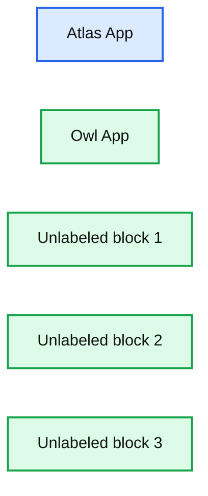
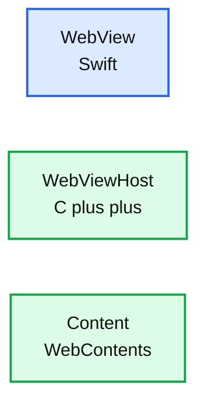
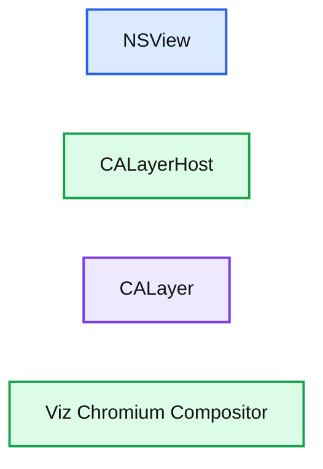

# How we built OWL, the new architecture behind our ChatGPT-based browser, Atlas

*A deep dive into OWL, the new architecture powering ChatGPT Atlas—decoupling Chromium, enabling fast startup, rich UI, and agentic browsing with ChatGPT.*

- Source: https://openai.com/index/building-chatgpt-atlas/
- Published: 2025-10-30
- Authors: Ken Rockot, Ben Goodger
- Categories: Engineering
- Diagrams: 5 candidates, 3 extracted as architecture

By *Ken Rockot, Member of the Technical Staff and Ben Goodger, Head of Engineering, ChatGPT Atlas*

Last week, we [launched ChatGPT Atlas](https://openai.com/index/introducing-chatgpt-atlas/), a new way to browse the web with ChatGPT by your side. In addition to being a full-featured web browser, Atlas offers a glimpse into the future: a world where you can bring ChatGPT with you across the internet to ask questions, make suggestions, and complete tasks for you. In this post, we unpack one of the most complex engineering aspects of the product: how we turned ChatGPT into a browser that gets more useful as you go.

Making ChatGPT a true co-pilot for the web meant reimagining the entire architecture of a browser: separating Atlas from the Chromium runtime. This entailed developing a new way of integrating Chromium that allows us to deliver on our product goals: instant startup, responsiveness even as you open more tabs, and creating a strong foundation for agentic use cases.

## Shaping the foundation

Chromium was a natural building block. It provides a state-of-the-art web engine with a robust security model, established performance credentials, and peerless web compatibility. Furthermore, it’s developed by a global community that continuously improves it. It’s a common go-to for modern desktop web browsers.

## Rethinking the browser experience

Our talented design team had ambitious goals for our user experience, including rich animations and visual effects for features like Agent mode. This required our engineering team to leverage the most modern native frameworks for our UI (SwiftUI, AppKit and Metal), instead of simply reskinning the open source Chromium UX. As a result, Atlas’ UI is a comprehensive rebuild of the entire application UX.

We also had other product goals like fast startup times and supporting hundreds of tabs without penalizing performance. These goals were challenging to achieve with Chromium out-of-the-box, which is opinionated about many details from the boot sequence, threading model and tab models. We considered making substantial changes here, but we wanted to keep our set of patches against Chromium targeted so we could quickly integrate new versions. To ensure our development velocity was maximally accelerated, we needed to come up with a different way to integrate and drive the Chromium runtime.

A litmus test for our technical investment was not only that it would enable faster experimentation, iteration and delivery of new features – it would also enable us to maintain a core part of OpenAI’s engineering culture: shipping on day one. Every new engineer makes and merges a small change in the afternoon of their first day. We needed to make sure this was possible even though Chromium can take hours to check out and build.

## Our Solution: OWL

Our answer to these challenges was to build a new architectural layer we call **OWL: OpenAI’s Web Layer**. OWL is our integration of Chromium, which entails running Chromium’s browser process *outside* of the main Atlas app process.

**Summary:** The diagram shows an Atlas App, an Owl App, and three additional unlabeled blocks.

**Components:**

- Atlas App, technology not shown
- Owl App, technology not shown
- Unlabeled block 1, technology not shown
- Unlabeled block 2, technology not shown
- Unlabeled block 3, technology not shown

**Flows:**

- none

**Numbers:** none

source image: https://images.ctfassets.net/kftzwdyauwt9/7tSQJdJbXxqGcQvor7qISU/ccd3c639b73969670244477a105538e8/AtlasBlog_Diagram-1-Light-Desktop__1_.svg

Think of it like this: Chromium revolutionized browsers by moving tabs into separate processes. We’re taking that idea further by moving Chromium itself out of the main application process and into an isolated service layer. This shift unlocks a cascade of benefits:

-

**A simpler, modern app:** Atlas is built almost entirely in SwiftUI and AppKit. One language, one tech stack, one clean codebase.

-

**Faster startup:** Chromium boots asynchronously in the background. Atlas doesn’t wait — pixels hit the screen nearly instantly.

-

**Isolation from jank and crashes:** Chromium is a powerful and complex web engine. If its main thread hangs, Atlas doesn’t. If it crashes, Atlas stays up.

-

**Fewer merge headaches:** Because we’re not building on as much of the Chromium open source UI, our diff against upstream Chromium is much smaller and easier to maintain.

-

**Faster iteration:** Most engineers never need to build Chromium locally. OWL ships internally as a prebuilt binary, so Atlas builds take minutes not hours.

Because most engineers on our team aren’t regularly building Chromium from source, development can go much faster—even new team members can merge simple changes on their first afternoon.

## How OWL works

At a high level, the Atlas browser is the **OWL Client**, and the Chromium browser process is the **OWL Host**. They communicate over IPC, specifically[Mojo](https://chromium.googlesource.com/chromium/src/+/main/mojo/README.md), Chromium’s own message-passing system. We wrote custom Swift (and even TypeScript) bindings for Mojo, so our Swift app can call host-side interfaces directly.

The OWL client library exposes a simple public Swift API, which abstracts several key concepts exposed by the host’s service layer:

-

**Session:** Configure and control the host globally

-

**Profile:** Manage browser state for a specific user profile

-

**WebView:** Control and embed individual web contents (e.g. render, input, navigate, zoom, etc.)

-

**WebContentRenderer:** Forward input events into Chromium’s rendering pipeline and receive feedback from the renderer

-

**LayerHost/Client:** Exchange compositing information between the UI and Chromium

**Summary:** The diagram shows a Swift WebView connected conceptually to C++ WebViewHost and Content WebContents components.

**Components:**

- WebView - Swift
- WebViewHost - C++
- Content WebContents - Chromium content layer

**Flows:**

- none visible

**Numbers:** none

source image: https://images.ctfassets.net/kftzwdyauwt9/7GmV8JW4eIRqk36PgM8Zsc/67943f7df84a1b6965f8750778279671/AtlasBlog_Diagram-2-Light-Desktop__3_.svg

There’s also a wide range of service endpoints for managing high-level features like bookmarks, downloads, extensions, and autofill.

### Rendering: Getting pixels across the process boundary

WebViews, which share a mutually exclusive presentation space in the client app are swapped in and out of a shared compositing container. For example, a browser window often has a single shared container visible and selecting a tab in the tab strip swaps that tab’s WebView into the container. On the Chromium side, this container corresponds to a `gfx::AcceleratedWidget` which is ultimately backed by a `CALayer`. We expose that layer’s context ID to the client, where an `NSView` embeds it using the private `CALayerHost` API.

**Summary:** The diagram shows the relationship between an NSView, CALayerHost, CALayer, and the Viz Chromium Compositor.

**Components:**

- NSView
- CALayerHost
- CALayer
- Viz Chromium Compositor

**Flows:**

- none visible

**Numbers:** none

source image: https://images.ctfassets.net/kftzwdyauwt9/2myZ2iCZXYNeGFeV822AoK/18493d38fb640cb50d9ced6dfeda80e3/AtlasBlog_Diagram-3-Light-Desktop__2_.svg

Special cases like `<select>` dropdowns or color pickers, which Chromium renders in separate popup widgets, use the same approach. They don’t have a `content::WebContents`, but they *do* have a `content::RenderWidgetHostView` with their own `gfx::AcceleratedWidget`, so the same delegated rendering model applies.

OWL internally keeps view geometry in sync with the Chromium side, so the GPU compositor can be updated accordingly and can always produce layer contents of the correct size and device scale.

We also reuse this technique to selectively project elements of Chromium’s own native Views UI into Atlas (this is also useful for bootstrapping features like permission prompts quickly without building replacements from scratch in SwiftUI). This technique borrows heavily from Chromium’s existing infrastructure for installable web apps on macOS.

### Input events: Cracking and forwarding

Chromium UI translates platform events (like macOS NSEvents) into Blink’s WebInputEvent model before forwarding them to renderers. But since OWL runs Chromium in a hidden process, we do that translation ourselves within the Swift client library and forward already-translated events down to Chromium.

From there, they follow the same lifecycle that real input events would normally follow for web content. This includes having events *returned* back to the client whenever a page indicates that it didn’t handle the event. When this happens, we re-synthesize an NSEvent and give the rest of the app a chance to handle the input.

### Agent mode: Special cases

Atlas’ agentic browsing feature poses some unique challenges for our approaches to rendering, input event forwarding, and data storage.

Our computer use model expects a single image of the screen as input. But some UI elements, like `<select> `dropdowns, render outside the tab’s bounds in separate windows. In agent mode, we composite those popups back into the main page image at the correct coordinates so the model sees the full context in one frame.

For input, we apply the same principle: agent-generated events are routed directly to the renderer, never through the privileged browser layer. That preserves the sandbox boundary even under automated control. For example, we don’t want this class of events to synthesize keyboard shortcuts that make the browser do things unrelated to the web content being shown.

Agent browsing can also run in an ephemeral "logged-out" context. Instead of sharing the user’s existing Incognito profile, which could leak state, we use Chromium’s `StoragePartition` infrastructure to spin up isolated, in-memory stores. Each agent session starts fresh, and when it ends, all cookies and site data are discarded. You can run multiple "logged-out" agent sessions, each one in its own browser tab, and each fully isolated from the others.

## A new way to use the web

None of this would be possible without the global Chromium community and their incredible work building a foundation for the modern web. OWL builds on that foundation in a new way: decoupling the engine from the app, blending a world-class web platform with modern native frameworks, and unlocking a faster, more flexible architecture.

By rethinking how a browser holds Chromium, we’re creating space for new kinds of experiences: smoother startups, richer UI, tighter integration with the rest of the OS, and a development loop that moves at the speed of ideas. If that sounds like your kind of challenge, check out our openings to work on Atlas as a [Software Engineer, Atlas](https://openai.com/careers/software-engineer-atlas-san-francisco/), [Software Engineer, iOS](https://openai.com/careers/software-engineer-ios-san-francisco/), and [more](https://openai.com/careers/search/?c=e1e973fe-6f0a-475f-9361-a9b6c095d869%2Cf002fe09-4cec-46b0-8add-8bf9ff438a62%2Cab2b9da4-24a4-47df-8bed-1ed5a39c7036).

**Try Atlas at **[**chatgpt.com/atlas**](http://chatgpt.com/atlas?openaicom-did=e181c8f2-dce1-467d-a4b2-31120824d909&openaicom_referred=true)**.**
