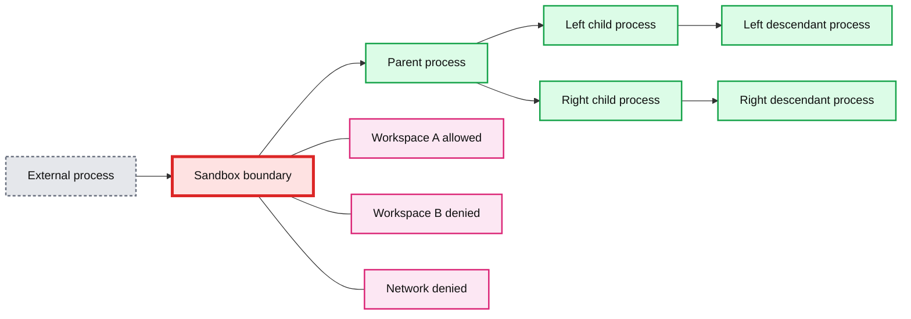
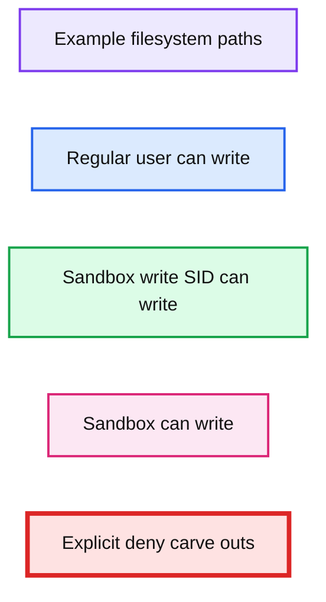
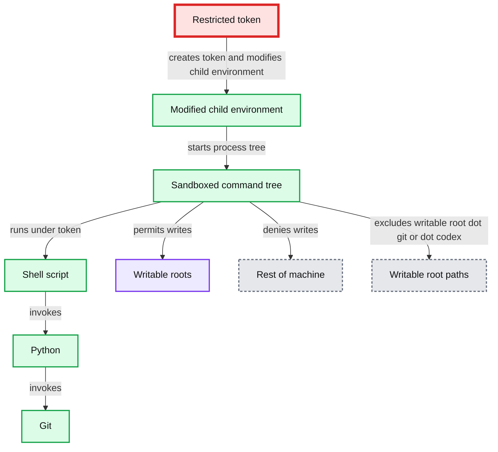
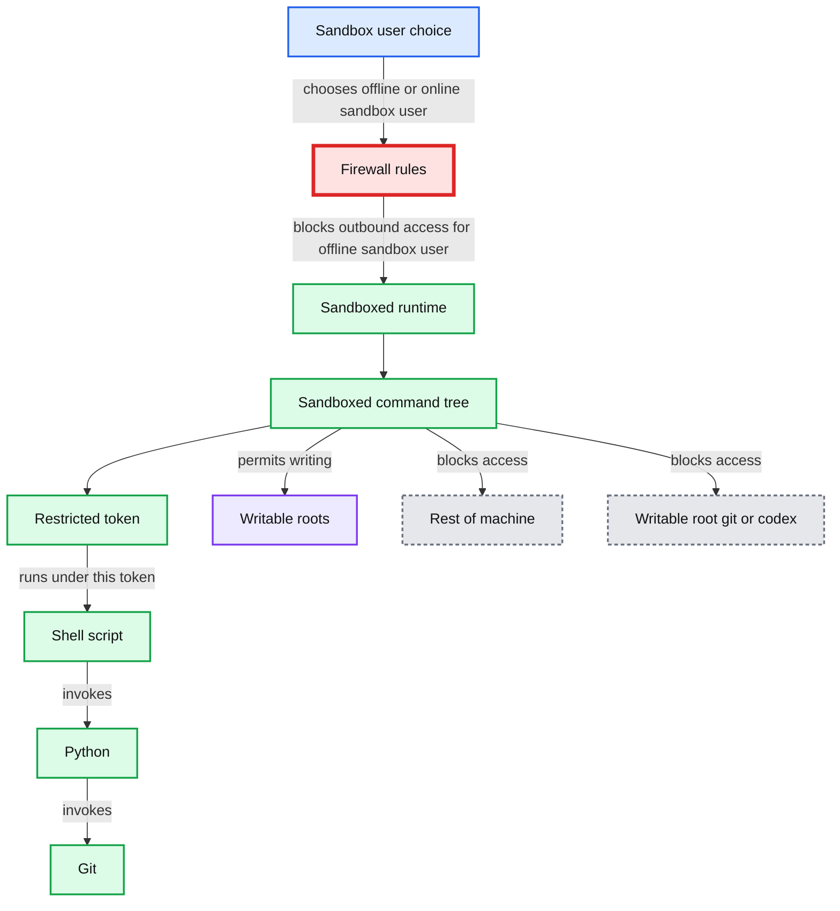

# Building a safe, effective sandbox to enable Codex on Windows

*Learn how OpenAI built a safe, effective sandbox to enable Codex on Windows with controlled file access and network limits.*

- Source: https://openai.com/index/building-codex-windows-sandbox/
- Published: 2026-05-13
- Authors: David Wiesen
- Categories: Engineering, Security
- Diagrams: 7 candidates, 7 extracted as architecture

When I joined the Codex engineering team in September 2025, Codex for Windows didn’t have a sandbox implementation meaning that Windows users were forced to choose between two subpar options when using OpenAI's coding agents:

1.

Approving nearly every command (even reads) that a coding agent wanted to run, which is inefficient and pesky. A major benefit of using Codex is that you don’t have to do all the tedious work yourself.

2.

Enabling Full Access mode: letting Codex run all commands without approval or restrictions, which removes friction at the expense of oversight.

[Codex](https://openai.com/codex/), our coding agent, runs on developer laptops—whether that’s through the CLI, the IDE extension, or the desktop app. It manages a conversation between a human at a keyboard and a model running in the cloud to handle inference.

Codex runs with the permissions of a real user by default, meaning it can do everything the user can do. This is powerful and potentially dangerous. The coding model may tell the harness to run commands locally, from running tests to reading or editing a file to creating a Git branch, so Codex's default mode attempts to find the right balance between effectiveness and safety. This default mode allows Codex to read files almost anywhere and write files within your workspace (i.e., the directory where you’re running Codex), with no internet access unless you specify you want it. To achieve this automatic constraint of writing files and accessing the network within safe bounds, Codex needs a sandbox environment that actually enforces these constraints.

A *sandbox* is a constrained execution environment. When a developer uses Codex, their computer's operating system launches a command with reduced permissions, and those constraints propagate down the process tree. Every Codex command is sandboxed from the start, and every descendant process stays inside the same boundary.

**Summary:** The diagram shows a sandbox boundary containing a parent process and descendant processes, with Workspace A permitted while Workspace B and Network are denied.

**Components:**

- Unlabeled external process
- Sandbox boundary
- Unlabeled parent process
- Two unlabeled child processes
- Two unlabeled descendant processes
- Workspace A permission
- Workspace B permission
- Network permission

**Flows:**

- Unlabeled external process -> Sandbox boundary: process enters sandbox
- Unlabeled parent process -> Left child process: spawns descendant
- Unlabeled parent process -> Right child process: spawns descendant
- Left child process -> Left descendant process: spawns descendant
- Right child process -> Right descendant process: spawns descendant

**Numbers:** none

source image: https://images.ctfassets.net/kftzwdyauwt9/56B8qHwAm6RxoAfKTqdadL/d81df6031422dd5495e9a50d8dce8616/Diagram1-10column-desktop-light.svg

Codex needs isolation features enforced by the computer's operating system to implement an effective sandbox. Some operating systems provide utilities that do this well (e.g., Seatbelt on MacOs, seccomp or bubblewrap on Linux); however, Windows doesn’t currently provide this type of capability out of the box.

To make Codex just as safe and delightful to use on Windows as it already is everywhere else, we needed to implement our own sandbox.

## Where existing Windows tools fell short

Windows offers some tools and primitives for isolation. While none of them quite met our requirements, we looked at a number of potential solutions—namely, AppContainer, Windows Sandbox, and Mandatory Integrity Control labeling.

**AppContainer**

-

**What:** AppContainer is the native Windows sandbox, a capability-based isolation model built for apps that know, up front, exactly what they need to access.

-

**Why**: Appealing because it offers a real OS boundary instead of best-effort restrictions.

-

**Why not**: Codex is not one tightly scoped app. It drives open-ended developer workflows: shells, Git, Python, package managers, build tools, and whatever other binaries the agent decides it needs. In practice, that made AppContainer the wrong shape for the problem. It was strong isolation, but for a much narrower class of workloads than “let an agent operate like a developer.”

**Windows Sandbox**

-

**What:** Windows Sandbox is Microsoft’s disposable lightweight VM. You get a fresh Windows desktop with a strong isolation boundary, and whatever you do inside it disappears when the session ends.

-

**Why**: Interesting for obvious reasons—far more compatible with arbitrary software than AppContainer, and from a security perspective it’s a much stronger box.

-

**Why not**: Codex needs to act directly on the user’s actual checkout, tools, and environment, not inside a separate throwaway desktop that would need setup and host/guest bridging. It also had a fundamental product problem: Windows Sandbox isn’t even available on Windows Home SKUs.

**Mandatory Integrity Control (MIC) integrity labeling**

-

**What**: Windows has a concept called “integrity levels,” such as low, medium, and high, that determine how much the system trusts objects and processes. The basic rule is that a lower-integrity process cannot write to an object with a higher integrity level, even if the normal ACL would otherwise allow it. For example, a low-integrity process is treated as less trusted, so Windows blocks it from writing to normal medium-integrity objects, unless those objects are explicitly relabeled to allow it.

-

**Why**: MIC looked elegant on paper—run Codex at low integrity, relabel the writable roots as low integrity, and let Windows enforce no-writes everywhere else. That would've given us a non-admin path with a real OS mechanism behind it.

-

**Why not**: Like ACLs, integrity labels modify the real host filesystem, and in this case the semantic change is especially broad. Marking a workspace as low integrity does not just mean “Codex can write here.” It means low-integrity processes *in general* can write there. On a real developer machine, that turns the user’s actual checkout into a low-integrity sink for the host, which is much riskier than granting carefully targeted ACLs to one sandbox design. Even if medium-integrity developer tools continue to work, the underlying trust model of the workspace has changed in a way that’s hard to contain and harder to justify.

Having evaluated all of the options as non-starters, we started designing our own solution to bring a good Codex experience to Windows users.

## The first prototype: the "unelevated sandbox"

Our first working prototype used a combination of Windows concepts and tools to implement the isolation we needed. From the beginning, one goal was to make this work without requiring *elevation*, meaning that Codex would not need to prompt the user for administrator privileges just to set up or run the sandbox. That meant figuring out how to put reasonable limits on two things: file writes and network access.

### Limiting file writes

If we didn’t limit file writes at all, we’d have a safety issue. If we limited file writes too much, the sandbox would hurt user productivity, needing to ask for constant approval. To solve this problem, we relied on two important Windows building blocks: SIDs and write-restricted tokens.

#### SIDs let us give the sandbox an identity

A SID, or security identifier, is the identity Windows ties to permissions. Each user has a SID, groups have SIDs, and even a single login session gets its own SID. For example, a current logged-in session might have a SID like `S-1-5-5-X-Y`. The SID assigned to the local administrators group might be `S-1-5-32-544`.

Windows also lets you create synthetic SIDs that don’t correspond to a real user but can still appear in ACLs (access control lists), which define who can read/write/execute specific files or directories. That makes SIDs a useful primitive for our sandbox: we can create SIDs exclusively for the Codex sandbox to use, without interfering with anything else on the machine.

#### Write-restricted tokens limit where Codex can modify files

Process tokens are security objects in Windows that define identity and privileges for a running process. They determine what actions a process can perform. A *write-restricted token* is a particular type of process token that makes Windows perform an additional access check on write operations.

In order for a write to succeed, two checks must pass:

1.

The normal user identity (the token “owner”) must be allowed to do it

2.

At least one SID in the token’s restricted SID list must also be granted access

**Summary:** The table shows that sandbox writes require both regular user permission and `sandbox-write` SID permission, with explicit deny carve-outs for `.git`, `.codex`, and `agents`.

**Components:**

- Example filesystem paths
- Regular user access control
- `sandbox-write` SID access control
- Sandbox write decision
- Explicit deny carve-outs for `.git`, `.codex`, and `agents`

**Flows:**

- none

**Numbers:** none

source image: https://images.ctfassets.net/kftzwdyauwt9/2KlFO4wcJ2hJICaARcf7ty/62ea40d3f87215fce5f9668dd0abbfaf/Diagram2-10column-desktop-light.svg

In practice, these checks let us use ACLs to define exactly where the sandbox could modify the filesystem, which offered the granularity we needed around write operations.

With SIDs and write-restricted tokens, our unelevated sandbox worked like this:

1.

The sandbox setup created a synthetic SID called `sandbox-write`.

2.

The `sandbox-write` SID was granted write, execute, and delete access to

  1.

The current working directory

  2.

Any additional `writable_roots` configured in `config.toml`.

3.

The sandbox setup explicitly denied that same SID write access to “read-only within writable” locations such as:

  1.

`<cwd>/.git`

  2.

`<cwd>/.codex`

  3.

`<cwd>/.agents`

4.

Codex launched commands under a write-restricted token whose restricted SID list includes `Everyone`, the current logged in session SID, and the `sandbox-write` synthetic SID.

This flow effectively solved limiting file writes and seemed promising. Now we needed a solution for limiting the sandbox's network access.

### Limiting network access

Limiting network access is an important part of the sandbox; without it, malicious code could exfiltrate data from the machine up to the internet. Because we wanted to avoid an elevation requirement, we had limited options to strongly block network traffic. The tools we wanted to use, like Windows Firewall, generally could not be installed without admin permissions.

Without Windows Firewall as an option, we limited what we could control. We tried to make the child environment fail-closed for the kinds of networked tools developers actually use, so that Git commands, package installers, etc., would fail in the sandbox and the user would have to approve any internet-facing operations. The idea was to poison the obvious escape hatches: send proxy-aware traffic to a dead endpoint, make Git’s HTTP(S) transport do the same, and make Git over SSH fail immediately. On top of that, we prepended a small `denybin` directory to PATH and reordered `PATHEXT` so stub SSH and SCP scripts would resolve before the real binaries.

For example, here are some of the specific environment overrides we used to limit network access:

-

`HTTPS_PROXY=http://127.0.0.1:9`

-

`ALL_PROXY=http://127.0.0.1:9`

-

`GIT_HTTPS_PROXY=http://127.0.0.1:9`

-

`NO_PROXY=localhost,127.0.0.1,::1`

-

`GIT_SSH_COMMAND=cmd /c exit 1`

**Summary:** The diagram shows an unelevated sandbox that modifies a child environment, runs a sandboxed command tree under a restricted token, and permits writes only to designated roots.

**Components:**

- Restricted token using the real user principal and synthetic SID
- Modified child environment using proxy overrides and a failing SSH command
- Sandboxed command tree
- Shell script
- Python
- Git
- Writable roots
- Rest of machine
- Writable root paths including `.git` or `.codex`

**Flows:**

- Restricted token -> Modified child environment: creates token and modifies child environment
- Modified child environment -> Sandboxed command tree: starts the process tree
- Sandboxed command tree -> Shell script: runs under restricted token
- Shell script -> Python: invokes Python
- Python -> Git: invokes Git
- Sandboxed command tree -> Writable roots: permits writes
- Sandboxed command tree -> Rest of machine: denies writes
- Sandboxed command tree -> Writable root paths: excludes writable root, `.git`, or `.codex`

**Numbers:**

- `127.0.0.1:9`
- `exit 1`
- `9`
- `1`

source image: https://images.ctfassets.net/kftzwdyauwt9/75Js1VkWKm67h9sHF1X6N0/050188fe9938ae1247a80dccc989a5ca/Diagram4-10column-desktop-light.svg

That caught a lot of normal tool-driven traffic, but it was still only advisory. A process could ignore the environment, bypass PATH, or just open sockets directly—too risky.

### The unelevated approach came with tradeoffs

As with any interesting software implementation, the first prototype had some pros and cons. While it got the job done with only a few standard Windows capabilities, allowed for very explicit and granular filesystem writes, and ran unelevated—cutting the need for users to accept excessive elevation prompts or be admins on their local machine—it had some real drawbacks, some of which disqualified it from becoming our final design:

-

Speed of setup: Applying workspace ACLs can be expensive depending on the topology of the workspace directory.

-

Footprint: We applied real ACLs to the developer’s system, although the footprint is not particularly invasive because all the applied ACLs pertain to a custom-created synthetic SID that is used only by the sandbox.

-

Difficult-to-change semantics: The reliance on ACLs for file-based restrictions means it’s expensive and complex to change sandbox semantics. Whereas on macOS, we can dynamically change how we generate the `.sbpl` file used to configure Seatbelt, the Windows sandbox could require a slow and intense operation to adjust ACLs.

-

Network protection is weak. As mentioned before, it was “advisory,” would definitely be circumvented by some programs that implemented their own networking stack, and wasn’t designed to hold up to adversarial code.

The first three issues are inherent to a custom sandbox implementation that’s flexible enough for agentic flows. The network suppression story was different, though.

### Network suppression is too important

In addition to a malicious agent being able to easily circumvent the environment-based network suppression, plenty of good-intentioned code/binaries would also circumvent it simply if they didn’t honor the environment proxy variables, or if they implemented their own socket-based network code. We felt that this aspect was enough to consider investing in a better sandbox mode.

To gain better network suppression, we wanted to use Windows Firewall, which allows us to block outbound network traffic for users or programs. Unfortunately, we couldn’t effectively create a functional firewall rule that applied only to the commands spawned by the Codex harness for a few reasons:

-

Windows doesn’t allow matching a firewall rule to the non-principal identity of a restricted token. This means we couldn’t apply a firewall rule to “any token that includes our synthetic SID in its restricted SID list."

-

While we could create a firewall rule that matches a specific binary, that only allows us to limit networking for `codex.exe` itself. It wouldn’t apply to the processes that the agent spawns on behalf of the user, like Git or Python processes.

-

Other firewall match dimensions were the wrong shape, too. User-scoped rules still matched the real Windows user in the unelevated design, not just the restricted child. Program-path rules were too coarse: they could block `codex.exe` or `python.exe` generally, but not this one sandboxed invocation of `python.exe`. Port- or address-based rules were also the wrong policy entirely. For instance, we didn’t want to block port 443; we wanted to block arbitrary outbound access for this specific restricted process tree.

To apply a firewall rule specifically to our sandboxed commands, we needed to run them as a separate principal, not as the “real” user. This approach led us down a new path, one in which we relaxed our “no elevation” constraint.

## The redesign: the "elevated sandbox"

The next iteration of the sandbox, which is our current implementation, requires elevated admin permissions at setup time. I therefore refer to it as “the elevated sandbox.” At the boundary where Codex spawns a command on the system, the elevated sandbox looks like the unelevated one. It still runs child processes under a restricted token—similarly a `write_restricted` token with the same restricted SID list of `[Everyone, Logon, ``Synthetic``]`—however, the principal of this token is no longer the actual Windows user but one of two local users created by Codex itself:

-

`CodexSandboxOffline` (the one targeted by firewall rules)

-

`CodexSandboxOnline` (the one not targeted by firewall rules)

This seemingly small detail actually has big implications for the sandbox, who can use it, and the complexity of its setup and runtime execution.

**Summary:** The diagram shows a sandboxed Windows runtime where firewall rules and a restricted token constrain shell, Python, and Git access to writable roots.

**Components:**

- Sandbox user choice
- Firewall rules
- Sandboxed runtime
- Sandboxed command tree
- Restricted token using a sandbox user and synthetic SID
- Shell script
- Python
- Git
- Writable roots
- Rest of machine
- Writable root, `.git`, or `.codex`

**Flows:**

- Sandbox user choice -> Firewall rules: chooses offline or online sandbox user
- Restricted token -> Shell script: runs under the restricted token
- Shell script -> Python: invokes Python
- Python -> Git: invokes Git
- Sandboxed command tree -> Writable roots: permits writing
- Sandboxed command tree -> Rest of machine: blocks access
- Sandboxed command tree -> Writable root git or codex: blocks access

**Numbers:** none

source image: https://images.ctfassets.net/kftzwdyauwt9/5eGlraTLEirbaMwaM74UOD/f0f6e41e99894a0e6a4ffdd2d965fdcb/Diagram3-10column-desktop-light.svg

It’s visually similar to the unelevated prototype, with the introduction of firewall rules and a dedicated Windows user, which actually runs the commands. (However, the introduction of these new concepts, means that there is more setup work to do before the sandbox can start running and protecting commands.)

### We now need a first-class setup step

The unelevated sandbox design had a simple setup step, but it was relatively small:

-

Create a synthetic SID if needed

-

Apply ACLs for the sandbox-write synthetic SID

The elevated sandbox, however, has more to do.

-

Create a synthetic SID, if not already created

-

Create the online and offline sandbox users, if not already created

-

Store the newly-created users’ credentials locally and encrypt using the Windows Data Protection API (DPAPI) in a place where the sandbox users cannot actually read

-

Create firewall rules that block all outbound network access for the `CodexSandboxOffline` user or, if they already exist, validate they’re correct

There’s an additional wrinkle in the setup stage. Codex’s sandbox is expected to have read access equivalent to the actual Windows user. In the unelevated sandbox, where the restricted token’s principal SID was the Windows user, this was achieved. However, that doesn’t come for free when the principal becomes a new `CodexSandbox` user. Many relevant directories on Windows will grant read/execute permissions to “Authenticated Users”. One notable example is the user’s profile directory. By default, Windows users cannot read the profile directories of other Windows users, so even simple file reads in many scenarios would fail.

To address this, we added another layer to the sandbox setup process—one for granting *read* ACLs to the sandbox users where such ACLs might not already exist. For example, to some commonly used Windows directories:

-

`C:\Users\<real-user>`

-

`C:\Windows\`

-

`C:\Program Files\`

-

`C:\Program Files (x86)\`

-

`C:\ProgramData\`

Because this list of directories is best-effort and installing ACLs on each one can be quite expensive, we run this logic asynchronously so the sandbox setup step, which is blocking to users, doesn’t have to wait for them to complete.

We encapsulated the setup logic in its own binary partly to cross the UAC boundary only when needed. But the deeper reason was architectural: sandbox setup has a fundamentally different job from `codex.exe`. Keeping the sandbox setup logic in a dedicated binary let `codex.exe` stay a normal, unelevated harness; kept the Windows-only setup machinery from bloating `codex.exe` on other platforms; decoupled longer-running setup work from the lifetime of the main process; and gave us one place to handle the different setup paths the sandbox needed.

**Summary:** The diagram shows setup preparing an elevated sandbox with firewall rules, a sandboxed command tree, a restricted token, and controlled filesystem access.

**Components:**

- Setup flow: chooses an offline or online sandbox user.
- Elevated runtime: the runtime after setup.
- Firewall rules: blocks outbound access for the offline sandbox user.
- Sandboxed runtime: contains the command execution environment.
- Sandboxed command tree: process tree running under the restricted token.
- Restricted token: uses the sandbox user principal and includes a synthetic SID.
- Shell script: command execution layer.
- Python: execution environment.
- Git: source-control tool.
- Writable roots: permitted writable locations.
- Rest of machine: inaccessible machine areas.
- Writable root exclusions: `.git` and `.codex` are excluded.

**Flows:**

- Setup flow -> Elevated runtime: setup prepares the elevated runtime.
- Setup flow -> Firewall rules: selects the offline or online sandbox user.
- Firewall rules -> Sandboxed runtime: enforces outbound network restrictions.
- Sandboxed runtime -> Sandboxed command tree: hosts the process tree.
- Sandboxed command tree -> Restricted token: runs under this token.
- Restricted token -> Shell script: establishes the command execution identity.
- Shell script -> Python: invokes Python.
- Python -> Git: invokes Git.
- Sandboxed runtime -> Writable roots: permits writes.
- Sandboxed runtime -> Rest of machine: denies access.
- Sandboxed runtime -> Writable root exclusions: denies writes to `.git` or `.codex`.
- Setup flow -> Sandboxed runtime: yes, skip setup.
- Elevated runtime -> Sandboxed runtime: runtime after setup.

**Numbers:** none

source image: https://images.ctfassets.net/kftzwdyauwt9/1L0jHduyQ5wiNbQ9hAVXaz/b2e2c5871a5a8feb378fc10b70d08a1c/Diagram5-10column-desktop-light.svg

```mermaid
%% Elevated sandbox setup and restricted command execution
flowchart LR
    Setup[Choose offline or online sandbox user]
    Elevated[Elevated runtime]
    Firewall[Firewall rules]
    Runtime[Sandboxed runtime]
    Tree[Sandboxed command tree]
    Token[Restricted token]
    Shell[Shell script]
    Python[Python]
    Git[Git]
    Writable[Writable roots]
    Machine[Rest of machine]
    Exclusions[Writable root exclusions git or codex]

    Setup -->|setup prepares| Elevated
    Setup -->|yes skip setup| Runtime
    Setup -->|selects sandbox user| Firewall
    Elevated -->|runtime after setup| Runtime
    Firewall -->|blocks outbound access| Runtime
    Runtime -->|contains| Tree
    Tree -->|runs under| Token
    Token -->|runs| Shell
    Shell -->|invokes| Python
    Python -->|invokes| Git
    Runtime -->|permits writes| Writable
    Runtime -->|denies access| Machine
    Runtime -->|denies writes| Exclusions

    classDef client   fill:#dbeafe,stroke:#2563eb,stroke-width:2px,color:#111
    classDef service  fill:#dcfce7,stroke:#16a34a,stroke-width:2px,color:#111
    classDef store    fill:#ede9fe,stroke:#7c3aed,stroke-width:2px,color:#111
    classDef cache    fill:#fef3c7,stroke:#d97706,stroke-width:2px,color:#111
    classDef queue    fill:#cffafe,stroke:#0891b2,stroke-width:2px,color:#111
    classDef critical fill:#fee2e2,stroke:#dc2626,stroke-width:4px,color:#111
    classDef external fill:#e5e7eb,stroke:#6b7280,stroke-width:2px,color:#111,stroke-dasharray:4 3
    classDef decision fill:#fce7f3,stroke:#db2777,stroke-width:2px,color:#111

    class Setup,Elevated decision
    class Firewall,Runtime,Tree,Token critical
    class Shell,Python,Git service
    class Writable store
    class Machine,Exclusions external
```

### The command runner is a new binary that actually runs user commands

Because of how Windows user and token login boundaries work, we couldn’t continue to create a restricted token and spawn a process under it the way we could with the unelevated sandbox. To actually spawn commands as a different Windows user, our first idea was the following flow:

-

`codex.exe` runs as the real Windows user. Then, in a sequence, Codex:

  -

Calls `LogonUserW(...)` for the sandbox user.

  -

Calls `CreateRestrictedToken(...)` on that sandbox-user token.

  -

Using that restricted sandbox-user token, calls `CreateProcessAsUserW(...)` to launch the final child.

In practice, that desired flow didn’t work because of a privilege wall at `CreateProcessAsUserW(...)`. This means `codex.exe` could create a restricted token for the sandbox user, but it couldn’t reliably launch a child with that token from the real-user side of the boundary. We needed a process that was already running as the sandbox user—this would let the restriction step and final spawn happen on the sandbox-user side of the boundary instead of the real-user side.

That requirement led to `codex-command-runner.exe`, a new binary whose only job is to mint a restricted token and spawn the requested command. Instead of asking `codex.exe` to do the entire flow itself (real user → sandbox user → restricted token → child process), we split the flow in two:

**Part 1**

-

`codex.exe` calls `CreateProcessWithLogonW(...)` to launch `codex-command-runner.exe` as the sandbox user, without using a restricted token yet.

**Part 2**

-

Inside the runner, `OpenProcessToken(GetCurrentProcess(), ...)` opens the runner’s own token, which already belongs to the sandbox user.

-

The runner calls `GetTokenInformation(...)` to extract the sandbox logon SID, then `CreateRestrictedToken(...)` to build the final restricted token.

-

Still inside the runner, it calls `CreateProcessAsUserW(...)` with that restricted token to launch the real child.

**Summary:** The diagram shows why a separate command runner is needed to create a restricted token and launch a sandboxed child process on Windows.

**Components:**

- `codex.exe` real user
- Sandbox user logon operation
- Restricted token with capability SID
- `codex-command-runner.exe`
- Windows firewall rule applied to the sandbox user
- Child process
- Network access restriction

**Flows:**

- `codex.exe` -> `Sandbox user`: log on and obtain sandbox-user token
- `Sandbox user` -> `Restricted token`: add capability SID
- `Restricted token` -> `Child process`: attempt to spawn directly, which fails
- `codex.exe` -> `codex-command-runner.exe`: launch runner under the sandbox user
- `codex-command-runner.exe` -> `Restricted token`: create restricted token with synthetic SID
- `Restricted token` -> `Child process`: spawn child with restricted token
- `Windows firewall rule` -> `Child process`: apply network restriction
- `Child process` -> `Network access restriction`: cannot reach network

**Numbers:** 1, 2, 3, 4

```mermaid
%% Shows direct spawning failure and command runner based restricted process creation
flowchart LR
    A[codex exe real user] -->|1 log on and obtain token| B[Sandbox user token]
    B -->|2 add capability SID| C[Restricted token]
    C -->|3 direct spawn attempt fails| D[Child never launched]
    A -->|1 launch under sandbox user| E[codex command runner exe]
    E -->|3 create restricted token with synthetic SID| F[Final restricted token]
    F -->|4 spawn child| G[Child launched]
    H[Windows firewall rule] -->|applies to sandbox user| G
    D -->|cannot reach network| I[Network blocked]
    G -->|cannot reach network| I

    classDef client   fill:#dbeafe,stroke:#2563eb,stroke-width:2px,color:#111
    classDef service  fill:#dcfce7,stroke:#16a34a,stroke-width:2px,color:#111
    classDef store    fill:#ede9fe,stroke:#7c3aed,stroke-width:2px,color:#111
    classDef cache    fill:#fef3c7,stroke:#d97706,stroke-width:2px,color:#111
    classDef queue    fill:#cffafe,stroke:#0891b2,stroke-width:2px,color:#111
    classDef critical fill:#fee2e2,stroke:#dc2626,stroke-width:4px,color:#111
    classDef external fill:#e5e7eb,stroke:#6b7280,stroke-width:2px,color:#111,stroke-dasharray:4 3
    classDef decision fill:#fce7f3,stroke:#db2777,stroke-width:2px,color:#111

    class A client
    class B,C,F service
    class D,G critical
    class E service
    class H external
    class I decision
```

source image: https://images.ctfassets.net/kftzwdyauwt9/3D3UDLteywxw2R6tFbrzRH/afafb32a8d8f39fbc1a35f4f576cf787/Diagram6-8column-desktop-light.svg

### The full picture

Albert Einstein said, “Everything should be made as simple as possible, but no simpler.” In that spirit, our design adequately solved each problem. The final architecture has the four layers we have previously covered:

-

`codex.exe` itself

-

`codex-windows-sandbox-setup.exe` for handling all elevated setup related work

-

`codex-command-runner.exe` for running restricted token commands

-

The child process

When I first approached this project, I did not have a strong sense of where it would wind up. My approach was to start by instrumenting the sandboxing capability in the boundary between Codex and the operating system. This approach closely matches how Codex’s sandbox is implemented on MacOs and Linux.

As I learned more about the specific tools that Windows provides, and through dozens of decisions balancing security and ease of use, the system grew to its current form—multiple binaries, custom users, firewall rules, an elevated setup step, asynchronous processes, and more.

It’s not a particularly simple system, but each piece of complexity was added out of necessity, to build a sandbox that is both safe and, as much as possible, not in the user's way.

**Summary:** The diagram shows a Windows sandbox architecture with a control plane, named-pipe IPC, an isolated command runner, restricted processes, writable roots, and firewall isolation.

**Components:**

- Sandbox control plane - manages sandbox setup and secrets
- Named-pipe IPC - exchanges length-prefixed JSON frames
- Firewall rule - blocks outbound access for the offline sandbox user
- Codex command runner executable - separate binary running as the chosen sandbox user
- Sandboxed runtime - contains the command tree
- Sandboxed command tree - runs processes under a restricted token
- Restricted token - uses the sandbox user principal and SID
- Shell script - executes within the restricted command tree
- Python - executes within the restricted command tree
- Git - executes within the restricted command tree
- Writable roots - permitted writable locations
- Rest of machine - inaccessible from the sandbox
- Writable root Git or code - inaccessible from the sandbox

**Flows:**

- Parent -> Sandbox control plane: setup management
- Parent -> Named-pipe IPC: spawn request and command frames
- Named-pipe IPC -> Parent: spawn ready and output file list
- Sandbox control plane -> Codex command runner executable: runner setup
- Parent -> Codex command runner executable: chooses offline or online sandbox user
- Codex command runner executable -> Sandboxed runtime: runs commands
- Sandboxed runtime -> Sandboxed command tree: starts the process tree
- Restricted token -> Shell script: launches under the sandbox user
- Shell script -> Python: invokes Python
- Python -> Git: invokes Git
- Firewall rule -> Codex command runner executable: blocks outbound access
- Elevated setup -> Sandbox control plane: manages setup
- Sandbox control plane -> Codex command runner executable: runner cannot access control-plane files

**Numbers:** none

source image: https://images.ctfassets.net/kftzwdyauwt9/d2zAquU2z95UFB0cqNgCs/4a45909b0c9c3e8d44fc416b2da8050c/Diagram7-12column-desktop-light.svg

```mermaid
%% Windows sandbox architecture with control plane, IPC, runner, and restricted command tree
flowchart LR
    P[Parent] -->|setup management| C[Sandbox control plane]
    P -->|spawn request and commands| I[Named pipe IPC]
    I -->|spawn ready and output| P
    P -->|choose sandbox user| R[Codex command runner]
    C -->|runner setup| R
    R -->|runs commands| S[Sandboxed runtime]
    S -->|starts process tree| T[Sandboxed command tree]
    T -->|restricted execution| X[Restricted token]
    X -->|launches| H[Shell script]
    H -->|invokes| Y[Python]
    Y -->|invokes| G[Git]
    F[Firewall rule] -->|blocks outbound access| R
    E[Elevated setup] -->|manages setup| C
    C -->|runner cannot access| R
    W[Writable roots] -.->|permitted writes| T

    classDef client   fill:#dbeafe,stroke:#2563eb,stroke-width:2px,color:#111
    classDef service  fill:#dcfce7,stroke:#16a34a,stroke-width:2px,color:#111
    classDef store    fill:#ede9fe,stroke:#7c3aed,stroke-width:2px,color:#111
    classDef cache    fill:#fef3c7,stroke:#d97706,stroke-width:2px,color:#111
    classDef queue    fill:#cffafe,stroke:#0891b2,stroke-width:2px,color:#111
    classDef critical fill:#fee2e2,stroke:#dc2626,stroke-width:4px,color:#111
    classDef external fill:#e5e7eb,stroke:#6b7280,stroke-width:2px,color:#111,stroke-dasharray:4 3
    classDef decision fill:#fce7f3,stroke:#db2777,stroke-width:2px,color:#111

    class P,E client
    class C,R,S,T,H,Y,G service
    class I queue
    class X,F critical
    class W store
```

## Balancing safety with actual usefulness

Working to deliver a good user experience for Codex users on Windows, our goal was to make something safe that didn’t compromise on usefulness—the whole point of using Codex is to have agents be able to do work without your constant attention.

One of the biggest lessons from this project was that Windows did not hand us one primitive that cleanly maps to “safe autonomous coding agent.” We composed several tools and concepts to build something coherent. Some early ideas were dead ends. The final design was a hybrid of earlier prototypes that each solved part of the problem.

The other lesson was that security for a coding agent is a different beast than more classic application security. Codex has to work for real developer workflows. The engineering work was about balancing compatibility with agentic workloads against real enforcement. That tension shaped tradeoffs in the final design.

Curious to see the Codex sandbox in action? [Try it out](https://openai.com/codex/).
