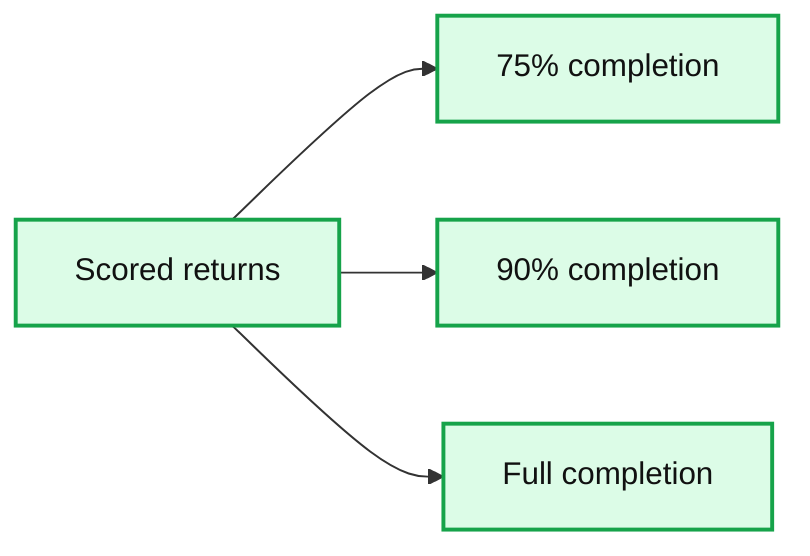
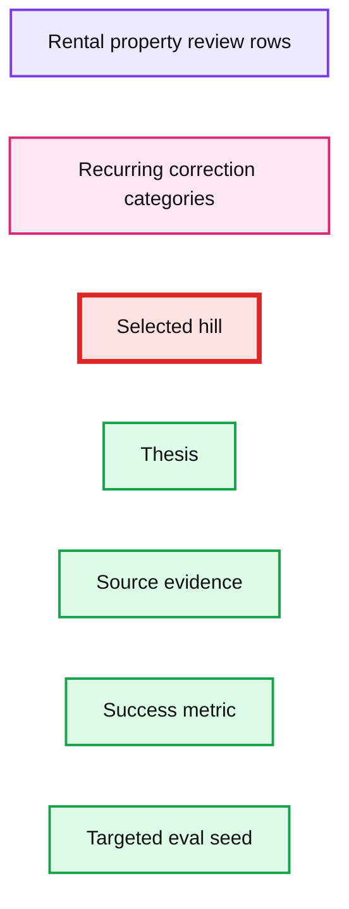
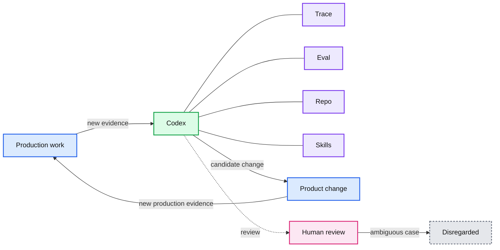

# Building self-improving tax agents with Codex

*See how OpenAI, Thrive, and Crete built a self-improving tax agent with Codex, automating filings, improving accuracy, and accelerating workflows.*

- Source: https://openai.com/index/building-self-improving-tax-agents-with-codex/
- Published: 2026-05-27
- Authors: Aravind Srinivasan, Samay Shamdasani, Arthur Fernandes Araujo, John de Wasseige
- Categories: Engineering
- Diagrams: 4 candidates, 3 extracted as architecture

*How Thrive Holdings and OpenAI co-developed Tax AI for Crete accountants by fusing practitioner expertise with a Codex-driven loop*

Real-world systems behave differently in production than they do in a lab, breaking in ways that are hard to anticipate before deployment. Teams often discover those failures after launch, then spend weeks inspecting edge cases, adjusting prompts, and translating production feedback into durable product improvements. The feedback loop is manual and slow, and only improves when an engineer advances it. But today, with thoughtfully designed eval infrastructure, direct access to practitioners and real world environments, and the frontier agentic capabilities of Codex, you can build agents that self-improve.

In this post, we’ll unpack how we used Codex to build this type of agent. Over the past six months, OpenAI forward deployed engineers and researchers along with Thrive Holdings’ engineers collaborated to build Tax AI alongside and for [Crete](https://www.cretepa.com/)’s network of 30+ accounting firms to help prepare increasingly complex tax returns. Instead of relying on engineers to find and fix each failure, Tax AI uses Codex to turn production use into structured signals that fuel autonomous improvement.

Crete practitioners prepare tens of thousands of tax returns each season which requires working through millions of underlying documents. For medium- to large-complexity filings, data entry alone can take eight hours per return, often involving messy data sources, prior-year documents, and manual extraction and calculation. They pointed us to tax preparation as a significant bottleneck during the busiest stretch of tax season.

To solve this problem, Tax AI processed 7,000 tax returns across the Crete firms that participated in the pilot this tax season. The system automates much of the time-intensive process of preparing 1040 and 1041 tax returns, but even more compelling than the efficiency gains is that the system itself is measurably better than the version that was first deployed three months ago.

## Measurable self-improvement

In Tax AI, practitioners upload source files along with any client-specific notes. Tax AI then creates a tax engine submission, ready for review. It saves practitioners about a third of their time on tax preparation, drafts returns with up to 97% accuracy, and increases throughput by about 50%, creating more room for them to spend time with clients. 

We can quantify this improvement by understanding how accurately Tax AI can complete a return without needing correction later. We measure accuracy by checking what share of returns reach 75%, 90%, or 100% correct field completion. At launch, only a quarter of returns were at 75% correct field completion, but within six weeks, 86% hit that mark. The system showed even faster growth at the 90% and 100% correct field completion levels. These thresholds give us a practical view of how much practitioner follow-up different returns still require. 

Early on, Tax AI handled simpler work, like W-2s and 1099s. As the season went on, it moved into more complex returns with K-1s, schedules, and harder edge cases. Each new capability saved more time per return than the last because the tasks it took on were harder and more time consuming to do manually. We continue to see ongoing progress today.

Next, we’ll walk through how our teams co-engineered Tax AI to be self-improving by leaning on three critical pillars: 1) expert practitioner feedback, 2) production traces (a structured history from inputs through final output), and 3) a Codex-driven iteration loop based on tailored evals to enable continuous, faster product development. We hope our experience will be useful to other builders in domains where practitioner expertise is key to shaping the quality of the overarching system and the data running through it.

**Summary:** The chart shows the rising share of scored tax returns reaching 75%, 90%, and full completion through tax season.

**Components:**

- Scored returns

**Flows:**

- none

**Numbers:** 75%, 90%



<sub>source: interactive diagram 1 on the post page</sub>

## The problem

As we pushed into harder parts of tax preparation (K-1s, rental real estate schedules, and tax forms where values had to be reconciled across multiple source files), it became obvious that the real challenge was whether the product could make complex production failures visible, understandable, and actionable.

In the early days of the product, most of the correction was manual. Practitioners could correct system errors, but the product did not capture the full context: a changed value before filing might reflect a true extraction miss, a mapping problem, missing product support, or expected workflow noise. Sorting those cases out still required follow-up from the engineering team. Engineers could use coding agents, but the system was not yet designed to use AI meaningfully inside an improvement loop. We did not have the signal to identify the right hill to climb.

## Our approach: a three-part loop

That led us to design the system around three pillars:

1.

**Stay close to practitioners: **The people doing the work need to steer what the product learns. Their intuition and understanding reveal which errors matter and help inform which parts of the workflow are worth focusing on next.

2.

**Build the product so production creates evidence: **The product has to capture more than just inputs and outputs; it needs to capture the full path from source material, to extracted fields and provenance, to downstream submission and expert correction.

3.

**Create a Codex-driven improvement loop: **Once production issues are visible and structured, they can become findings, tailored evals, and scoped engineering tasks. Codex can then help investigate, propose changes, validate them against targeted and regression evals, and move the product forward faster than a purely manual iteration cycle. 

The rental properties example below shows how that loop works in practice, walking you through how a practitioner correction becomes a structured finding, then an eval target, and finally a Codex-scoped engineering task.

## Rental property example

Rental property income is reported on Schedule E of an individual tax return. From an engineering perspective, the task of extracting it is simple to describe but hard to do well. The system has to read messy source material (handwritten notes, emails, spreadsheets, and other client files), extract the rental-property fields the system can confidently map to the tax engine, and preserve enough evidence that a practitioner can approve or correct the result. The simplified example below shows what those source files and extracted outputs might look like.

*A rental property source package is normalized into cited fields before those are mapped to downstream tax engine concepts.*

## 1. A practitioner correction reveals a failure

A difference between the agent-predicted value and the actual value from the filed tax return might reflect a true extraction miss, but it could also be a practitioner preference, a value carried forward from a prior-year return in the tax engine, or a value introduced or changed elsewhere in the filing workflow. Practitioners helped us discern those cases so we could identify which actions required a practitioner correction or blocked a submission.

Because we could see these corrections in detail, we transformed the review process from a terminal, post-failure step into a continuous learning cycle. We designed the workflow to capture expert actions as structured data. Now, every intervention feeds the product's improvement loop by recording exactly what Tax AI proposed, what the practitioner modified, and what ultimately went into the filed return.

## 2. Product traces turn corrections into evals

For a complex workflow like rental properties, the system has to preserve what happens between the source files and the filed return. Along that path, documents are organized, split, and classified; rental-property fields are extracted with citations back to the source material; those values are mapped into the tax engine; and practitioners may still correct them before filing. Those product-level traces make it possible to investigate where a failure occurred. To turn practitioner corrections into useful evaluation targets, the system processes them in three steps:

-

**Capture the difference:** Tax AI’s output is compared with the filed return to produce field-level review rows that capture the expected value, predicted value, and whether the difference appears actionable.

-

**Group related failures:** Similar review rows are grouped to separate recurring product failures from expected workflow noise. For example, repeated practitioner corrections might show that Tax AI often misses fair-rental-day fields, mishandles “other expenses,” or confuses multiple rental properties across the same source package.

-

**Turn repeated patterns into eval targets**: Once reviewed and measured, repeated findings become clear eval targets for Codex to improve.

*Rental property review rows separate recurring product failures from expected noise, then turn the actionable cases into evaluation targets that give Codex a hill to climb.*

**Summary:** The diagram shows rental-property review rows being grouped into recurring correction categories and converted into a selected evaluation hill.

**Components:**

- Rental property review rows, technology not shown
- Correction category list, technology not shown
- Selected hill form, technology not shown
- Thesis field, technology not shown
- Source evidence field, technology not shown
- Success metric field, technology not shown
- Targeted eval seed field, technology not shown

**Flows:**

- none

**Numbers:** 14 days, 9 days, $12,600, $0, $1,250, 123 Oak St, N=7, N=4, N=3, N=2, N=8, N=7, IDs FDSEG...25, FDISENC...0, FDSE...02, FDSPROP...10



<sub>source image: https://images.ctfassets.net/kftzwdyauwt9/14ohYkXRcxCQKGyNLJJJtz/049cb1f27efc305c10b22c4e76bab0a1/Diagram1-desktop-light.svg</sub>

*Rental property review rows separate recurring product failures from expected noise, then turn the actionable cases into evaluation targets that give Codex a hill to climb.*

## 3. The finding becomes a hill to climb for Codex

The third pillar is creating an engineering loop capable of acting on these new evals. This is where Codex becomes central.

Suppose our eval pipeline flags that Tax AI consistently misses the "fair rental days" field, while practitioners reliably fill it in. Because this finding has already been packaged into a targeted eval set, with representative source packages and expected outputs, Codex can investigate the root cause directly within the product scaffold.

Codex isn’t working solely with a sub-par final output. It inspects the trace, eval, repo, and skills together:

-

**Investigate the pipeline:** Inspect source packages, extraction schemas, mapper behavior, and code paths to determine whether the issue is an unsupported field, a missed extraction pattern, a source-selection problem, a mapper gap, or a grader issue.

-

**Implement targeted fixes:** Extend the extraction schema, improve source selection for rental-property documents, update the tax-engine mapper, or refine the grader if expected workflow noise is being counted as a failure.

-

**Validate and propose:** Rerun the targeted eval, run broader regression suites, and surface a candidate pull request for engineering review.

-

**Close the loop: **Turn a recurring practitioner correction into a measurable engineering task. If the evidence is ambiguous or not safely automatable, the case routes back to the product team instead of being forced through the loop.

*The end-to-end self-improvement loop: production traces surface repeated field-level corrections, which become failure signals that Codex can inspect alongside the trace, evals, repo, and skills. Actionable patterns become bounded evals and candidate product changes; ambiguous cases route back to engineers for review. Each shipped improvement creates new production evidence for the next cycle.*

**Summary:** The diagram shows a self-improvement loop where production evidence and human review inform Codex, which produces bounded product changes.

**Components:**

- Production work: production system, technology unspecified
- Codex: Codex with trace, eval, repo, and skills
- Product change: resulting product update
- Human review: engineering review
- Disregarded: cases excluded from the loop

**Flows:**

- Production work -> Codex: new evidence from production work
- Codex -> Product change: candidate product change
- Product change -> Codex: shipped improvement creates new production evidence
- Human review -> Disregarded: ambiguous cases are disregarded

**Numbers:** 01, 02, 03, 04



<sub>source image: https://images.ctfassets.net/kftzwdyauwt9/6on5WyXaXPhYX9JsuTgatH/9123a4810d89e65b975c293cf141dab8/Diagram3-desktop-light.svg</sub>

*The end-to-end self-improvement loop: production traces surface repeated field-level corrections, which become failure signals that Codex can inspect alongside the trace, evals, repo, and skills. Actionable patterns become bounded evals and candidate product changes; ambiguous cases route back to engineers for review. Each shipped improvement creates new production evidence for the next cycle.*

## How to use Codex to build this loop

The rental property example is emblematic of a broader reusable pattern: using production artifacts and traces to improve an agent’s capabilities. Given reviewed findings from production data, source traces, expected tax-engine output, relevant code examples, and eval commands as a set of inputs, Codex can materially improve on performance and accuracy over weeks and months. This builds on the principles described in our work on[harness engineering](https://openai.com/index/harness-engineering/) and [Symphony](https://openai.com/index/open-source-codex-orchestration-symphony/), which walk-through how to make tasks legible to Codex, provide scoped context and tools, and keep validation and human review part of the environment. 

That evidence does not become a Codex task automatically. A practitioner correction may reflect an extraction miss, a mapping issue, unsupported product behavior, tax judgment, or expected workflow noise. Only after repeated differences have been reviewed and grouped into an actionable finding does the system turn them into a bounded task with a clear success condition.

We apply this automation to a bounded layer of the product. This layer performs extraction and maps source documents into tax workflows. Engineers remain responsible for architecture, product decisions, and shipping. Practitioners steer the improvement loop through the work they already do: correcting extracted values, reviewing returns, and approving final filings.

For Codex, the result is not a vague alert but a scoped engineering task with evidence, editable product surfaces, and explicit validation gates. The context for a representative rental property task can be summarized as follows:

```
/candidates/FIND-RENTAL-0042/
│
├── repo/                                                   [1]
│   └── branch: codex/fix-rental-0042
│       │
│       ├── AGENTS.md
│       │
│       ├── tasks/FIND-RENTAL-0042/
│       │   ├── task.yaml
│       │   ├── EXEC_PLAN.md
│       │   └── RESULTS.md
│       │
│       ├── app/tax-ai/rental-income/                          [2]
│       │   ├── agent.ts
│       │   ├── schema.ts
│       │   ├── provenance.ts
│       │   └── mapper.ts
│       │
│       ├── evals/                                          [3]
│       │   ├── datasets/fair-rental-days.yaml
│       │   ├── suites/fair-rental-days.yaml
│       │   ├── suites/rental-income-regression.yaml
│       │   └── graders/rental-income.yaml
│       │
│       ├── skills/                                         [4]
│       │   ├── eval-runner/
│       │   └── tax-field-docs/
│       │
│       └── docs/                                           [4]
│           ├── architecture/
│           └── task-environments/
│
└── scoped-tools/                                           [5]
    ├── production-trace
    ├── source-artifacts
    └── tax-engine-docs
```

A bounded Codex task environment separates the writable worktree [1] from read-only production context [5]. The worktree contains the scoped product surface Codex can inspect or modify [2], the targeted and regression evals that define success [3], and reusable skills/docs that encode how to run the task and respect prior decisions [4]. The read-only context provides the production trace, source documents, Tax AI prediction, finalized return, and tax-engine field documentation, so Codex can investigate the failure without mutating the underlying evidence.

## Expanding to new domains

The same loop applies beyond rental properties. Rental properties took about six weeks and substantial engineering oversight to reach 90% precision and recall, but that work produced reusable abstractions, review artifacts, eval conventions, and implementation patterns that made it easier to support similarly complex schedules such as Schedule C and Schedule A.

Tax AI proves a path to building self-improving agents. Practitioners generate high-value feedback signals by delivering the service. Product workflows preserve those signals as structured evidence. Eval-backed engineering systems validate improvements before they reach production, and an agent-powered loop keeps the system in a continuous self-improving flow. 

Thrive Holdings’ structure allows us to replicate this environment in specific industries. Holdings is both an owner and operator, so our combined engineering teams are able to work directly with practitioners and production data from inside businesses like Crete, not as a vendor but as partners. This means the technology, the product, and the service all sit under one roof to help us move faster and build exceptional products.

One senior accountant who spent 180 hours on tax prep last year spent only 15 hours on it this year. She put that time in part toward calling every one of her clients and walking them through their returns, a level of high touch service that wasn’t possible a year ago. The rest of that time she used to take on new clients and expand to new service offerings.

Together, our teams are now using the same three-part design from Tax AI as a blueprint for building workflows in other domains across [Thrive Holdings](https://www.thriveholdings.com/); accounting workflows such as bookkeeping and audit, and operational workflows such as IT help desk automation. Across domains and industries, the broader promise of self-improving agents holds. The best agents are steered by people to learn to become more capable, more trusted, and more valuable over time.

*To learn more about the OpenAI team that worked on this project, *[*get in touch*](https://openai.com/contact-sales/)*.*
