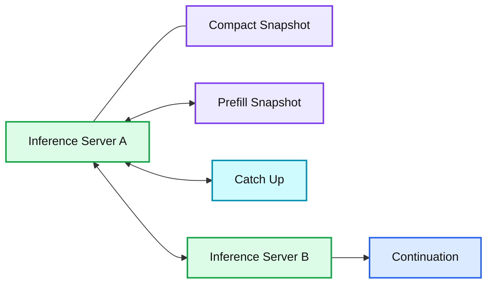
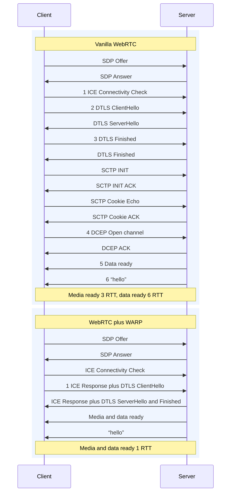

# How we built a realtime system for responsive voice AI in six months

*GPT-Live enables continuous voice interaction with AI, using a turnless speech model and low-latency architecture for faster, more natural conversations.*

- Source: https://openai.com/index/continuous-voice-interaction-with-gpt-live/
- Published: 2026-08-03
- Authors: Justin Uberti, Zahan Malkani
- Categories: Engineering, Company
- Diagrams: 3 candidates, 3 extracted as architecture

For voice AI, knowing when to speak is harder than it sounds. Human speakers effortlessly hand off to each other in a fraction of a second, but previous voice AI systems couldn’t keep up with this rhythm. Their turn-based architecture relied on tiny models known as turn detectors, which faced an unenviable task: guess too soon, and the user gets cut off; guess too late, and the response feels sluggish. Only after the detector made its decision could the much larger LLM get to work.

[GPT‑Live](https://openai.com/index/introducing-gpt-live/), our third-generation voice system, removes the turn detector from the audio path. Its voice model is full-duplex, which means it can listen and speak at the same time. That eliminates the need for a separate detector and makes conversation feel more immediate and natural. When deeper reasoning or tool use is needed, GPT‑Live can also consult our frontier models, such as GPT‑5.5, without interrupting the flow of the conversation. Together, these capabilities give GPT‑Live an unprecedented combination of conversational responsiveness and intelligence.

Delivering this experience at scale required a new system architecture optimized for low latency. Unlike typical request-response inference, our system streams incoming audio into the voice model and outbound speech back to the user, while handling delegation on a separate asynchronous path. Over the last six months, we reworked model inference, context management, and media transport to keep speech flowing smoothly from end to end.

The architecture also creates a clean boundary between the core voice path and application logic. This makes it easy to customize application behavior without affecting responsiveness. This foundation powers a growing range of capabilities in ChatGPT Voice, including the newly launched ability to control your computer and coordinate your agents in the ChatGPT desktop app.

In this post, we’ll explain why earlier turn-based systems couldn’t meet our needs and how we engineered the new system for responsiveness at every layer. We’ll cover stateful inference, dynamic context management, asynchronous delegation, and protocol-level optimization, all working together to make GPT‑Live feel truly *live*.

## Moving from turn taking to streaming

Earlier voice architectures inherited the turn-based nature of text LLMs, but with each turn represented as a discrete audio blob rather than text. In cascaded systems, speech-to-text, the LLM, and text-to-speech each ran in series. This sequencing added latency and ignored cues such as tone and pacing.

Speech-to-speech models improved on this approach by processing audio directly. Training the model to natively understand and generate speech allowed it to preserve details lost in transcription and respond more quickly. But the system still relied on the turn detector to decide when inference could begin. The model handled more of the interaction, but the interaction remained turn-based.

GPT‑Live puts the voice model in control of the conversation: audio flows in and out of the model, while deeper reasoning and tool use happen asynchronously. The system’s primary job is to sustain an uninterrupted media loop. Other work, such as invoking frontier models and persisting the conversation, happens off the live path.

**Summary:** GPT-Live uses a realtime voice model for continuous audio while asynchronously delegating reasoning, business logic, and tool use to a text model.

**Components:**

- User
- Media frontend
- GPT-Live-1 model instance using a voice model
- Application server for delegation and business logic
- GPT-5.5 model instance using a text model
- Tools using Search, Code, and Retrieval

**Flows:**

- User -> Media frontend: user audio
- Media frontend -> User: assistant audio
- Media frontend -> GPT-Live-1 model instance: realtime media
- GPT-Live-1 model instance -> Media frontend: realtime media
- Media frontend -> Application server: delegation request
- Application server -> Media frontend: results and guidance
- Application server -> GPT-5.5 model instance: request
- GPT-5.5 model instance -> Application server: results and guidance
- GPT-5.5 model instance -> Tools: tool requests
- Tools -> GPT-5.5 model instance: tool results

**Numbers:** none

source image: https://images.ctfassets.net/kftzwdyauwt9/6ZqaUVoYOfbzniRehoTwtC/8cea9f9574fbf18fd91ecdf4ae2c3368/gpt-live-system-architecture-light-desktop.svg

```mermaid
%% GPT-Live realtime media and asynchronous delegation architecture
flowchart LR
    U[User]
    F[Media frontend]
    L[GPT Live 1 model instance voice model]
    A[Application server delegation and business logic]
    T[GPT 5.5 model instance text model]
    X[Tools Search Code Retrieval]

    U -->|user audio| F
    F -->|assistant audio| U
    F <-->|realtime media| L
    F -->|delegation request| A
    A -->|results and guidance| F
    A -->|request| T
    T -->|results and guidance| A
    T -->|tool requests| X
    X -->|tool results| T

    subgraph Legend
        LC[client means clients edge gateway or load balancer]
        LS[service means stateless compute]
        LD[store means databases or durable storage]
        LK[cache means losable cache]
        LQ[queue means asynchronous pipe]
        LX[external means third party]
        LDc[decision means trade off point]
        LRc[critical means bottleneck or single point of failure]
    end

    classDef client fill:#dbeafe,stroke:#2563eb,stroke-width:2px,color:#111
    classDef service fill:#dcfce7,stroke:#16a34a,stroke-width:2px,color:#111
    classDef store fill:#ede9fe,stroke:#7c3aed,stroke-width:2px,color:#111
    classDef cache fill:#fef3c7,stroke:#d97706,stroke-width:2px,color:#111
    classDef queue fill:#cffafe,stroke:#0891b2,stroke-width:2px,color:#111
    classDef critical fill:#fee2e2,stroke:#dc2626,stroke-width:4px,color:#111
    classDef external fill:#e5e7eb,stroke:#6b7280,stroke-width:2px,color:#111,stroke-dasharray:4 3
    classDef decision fill:#fce7f3,stroke:#db2777,stroke-width:2px,color:#111

    class U,F client
    class L,A,T service
    class X external
    class LC client
    class LS service
    class LD store
    class LK cache
    class LQ queue
    class LX external
    class LDc decision
    class LRc critical
```

## Enabling continuous inference

Keeping this media loop uninterrupted is not always straightforward. Any delay in transport, processing, or inference can become an audible pause or artifact. A previous turn-based system could tolerate some variation in when an audio blob arrived. However, a live media system needs to deliver every audio frame on schedule.

Earlier work on ChatGPT Voice and the Realtime API gave us an important foundation. We had already [rebuilt our voice infrastructure](https://openai.com/index/delivering-low-latency-voice-ai-at-scale/) to stream audio and video directly in and out of our systems with lower and more predictable latency. GPT‑Live pushed that design further, streaming media all the way to the model through a new stateful inference system built for continuous conversation.

Streaming inference was only part of the solution though. To make it work well in production, we also had to ensure reliable audio delivery from the client to the inference stack and deal with the challenges of statefulness.

### Making the media flow quickly

An early decision we made was to specifically separate media flow from application and business logic. Audio moves between the client and the voice model on a dedicated fast path. Delegation, tool use, and other application work happen behind an asynchronous RPC boundary. A slow tool call or backend service can delay its own result, but cannot stall the flow of media.

This separation also gives the system a clean boundary for customization. Applications can change their tools, policies, and backend behavior without affecting the media frontend responsible for keeping audio moving. The live path stays small, predictable, and focused on the work that must happen in real time.

We wrote the media frontend and inference logic in Go, replacing a previous Python `asyncio` implementation. This significantly improved the smoothness of frame delivery, with the new system’s p95 matching the previous system’s p50.

WebRTC provides the transport foundation. It’s designed for low-latency media, and can continue operating through packet loss, clock drift, and client connection changes. If packets arrive late, WebRTC can subtly stretch audio to prevent gaps, and then briefly accelerate playback to catch back up to real time.

By minimizing buffering and blocking throughout the system, we can deliver the sub-second responsiveness that humans expect from conversation.

### Keeping the (stateful) conversation going

Stateful inference has its own operational tradeoffs. A voice session may remain active for a long time, but its context continuously grows, and model instances spin up and down based on demand.

To address these concerns, we built a seamless handoff mechanism across model instances. When a transition is needed, we can warm a replacement model instance alongside the existing one, prefill it with the current session context, run inference against both in parallel, and cut over when the new instance is fully ready.

The same basic mechanism also supports dynamic context compaction. As a conversation goes on, its accumulated context can eventually exceed the model’s context limit. Compaction can reduce the context size to fit within the limit, but the operation takes time. And because it changes past context, it also invalidates the model’s key-value (KV) cache, which stores attention keys and values from previously processed tokens. Rebuilding that state requires a new prefill, introducing additional delay.

Instead, we treat compaction as another managed transition. While the original model instance keeps chatting, the system compacts the context and prepares a replacement model instance with the new context. Once that instance is ready, we can switch over without any media interruption. This allows the system to support long-running calls, compacting whenever necessary.

**Summary:** Live context compaction coordinates inference server A and inference server B through snapshot prefill and catch-up before continuing inference.

**Components:**

- Inference Server A - technology unspecified
- Compact Snapshot - compacted context state
- Prefill Snapshot - prefilled context state
- Catch Up - synchronization state
- Inference Server B - technology unspecified

**Flows:**

- Inference Server A <-> Prefill Snapshot: handoff coordination
- Inference Server A <-> Catch Up: handoff coordination
- Inference Server A <-> Inference Server B: handoff coordination
- Inference Server B -> continuation: inference output

**Numbers:** none

source image: https://images.ctfassets.net/kftzwdyauwt9/7ktQBfBZjbGzRAF0dQBnH7/b671b0c40b22f7a52241121d3c827469/live-context-compaction-light-desktop.svg

The heavy lifting stays off the live path, so even during a handoff, the conversation never misses a beat.

## Delegation without blocking the conversation

GPT‑Live’s ability to invoke existing frontier models gives it a lot of power, effectively decoupling “talking” from deeper “thinking”. But making this two-model architecture feel like one system required solving two related engineering problems.

### Delegation for deeper work

GPT-Live provides fast, natural responses, while GPT-5.5 handles search in the background

UserGPT-Live-1GPT-5.5Search + reasonExample conversation with GPT-Live-1, using GPT-5.5 Instant

First, results must return quickly enough to be useful in the ongoing exchange, so we had to minimize latency across the entire delegation path, from routing and prompt processing through inference and tool calls. At the same time, systems elsewhere in the product still need discrete messages, so we had to represent the ongoing conversation in a form they could understand.

## Making delegation fast enough to feel natural

When a delegation is dispatched, we optimize for the time until the frontier model produces something useful for the conversation. The voice model can briefly keep the exchange moving while a frontier model reasons or uses tools, but it cannot hide an arbitrarily slow response. We therefore treated the full delegation loop—routing, prompt processing, inference, and tool calls—as part of the responsiveness budget.

The first optimization is to set up the frontier model and any tools it needs before delegation is requested. When a voice session starts, the application server creates an inference session for the frontier model and prefills it with the initial conversation context, ensuring the prompt has been fully processed prior to the first delegated request.

We then keep that inference session available for the duration of the voice conversation and use stable session affinity for successive requests. Together with prompt caching, these techniques improve latency while a worker failure remains easily recoverable.

Reasoning effort, output limits, tool schemas, and model-tool round trips also affect when the conversation receives a useful result, and we adjusted these levers to get faster responses. By minimizing the work needed on the delegation path, we enabled the voice model to quickly incorporate results from our frontier models.

### Deriving discrete turns from continuous speech

Even though the voice model operates on continuous streams of speech, many of the systems around it still operate on user and assistant turns, including ChatGPT’s conversation UI and parts of our analytics and safety infrastructure. So the application server teases apart the overlapping, occasionally ambiguous conversation into discrete messages.

As audio arrives, the server uses partial transcripts and timing signals to infer which speaker has the floor and build a queue of messages. The newest message remains provisional; its text, timing, and speaker assignment can all change as more speech arrives. Once a speaker has sustained the floor long enough for the attribution to be reliable, the server finalizes the corresponding message.

Speaker overlap makes this more complicated. A brief acknowledgement from the assistant while the user is talking (e.g. “mm hmm,” or “okay”) should not necessarily become its own message. However, a substantive assistant interjection often should. Similarly, we prioritize coherence in the displayed assistant responses even when the user speaks in the middle.

Every segmentation policy trades freshness for certainty. Committing too early produces fragmented history and unstable ordering; waiting too long delays transcripts and the features that depend on them. The system therefore maintains two related views of the conversation: a speculative view of the current state and an authoritative record of what was said. The conversation view in the application UI can handle updates, so it uses the speculative view. But logging to the analytics pipeline requires a final transcript.

This gives the rest of ChatGPT a stable view of the exchange without imposing turn-taking on the live voice path.

## Starting sessions with a faster protocol

Responsiveness starts as soon as the user clicks the button. With GPT‑Live, the system must establish the media path and begin feeding audio through the model before the conversation can begin. That puts every part of the startup sequence on the critical path.

As noted above, WebRTC provides a strong realtime foundation, but starting a vanilla WebRTC session requires a surprising number of protocol handshakes and network round trips. WebRTC predates the focus on minimizing round trips that shaped later protocols such as QUIC. As a result, its underlying protocols sometimes repeat work when used together. For example, each protocol included its own anti-DoS mechanism, even when it wasn’t needed in the context of the full WebRTC stack.

We analyzed the stack and developed the WebRTC Abridged Roundtrip Protocol ([WARP](https://datatracker.ietf.org/doc/draft-uberti-tsvwg-warp/)), which reduces media and data startup from six network round trips to just one. WARP accomplishes this with a set of backward-compatible protocol improvements: piggybacking the DTLS handshake over ICE ([SPED](https://datatracker.ietf.org/doc/draft-hancke-webrtc-sped/)), using the faster [DTLS 1.3](https://www.rfc-editor.org/rfc/rfc9147.html) handshake, pre-negotiating the SCTP handshake ([SNAP](https://datatracker.ietf.org/doc/draft-hancke-tsvwg-snap/)), and pre-negotiating data channels rather than using [DCEP](https://www.rfc-editor.org/rfc/rfc8832.html).

We designed WARP as a set of open specifications, working with collaborators from the WebRTC community, so the broader ecosystem can benefit from this work. We’re advancing the proposals through the IETF’s TSVWG working group, and WARP support has already been added to both libwebrtc and Pion, with efforts underway in other WebRTC implementations.

**Summary:** The diagram compares the vanilla WebRTC handshake with WebRTC plus WARP, showing media and data becoming ready in 1 RTT instead of 6 RTT.

**Components:**

- Client
- Server
- Vanilla WebRTC
- WebRTC plus WARP
- SDP
- ICE
- DTLS
- SCTP
- Media and data channel

**Flows:**

- Client -> Server: SDP Offer
- Server -> Client: SDP Answer
- Client -> Server: ICE Connectivity Check
- Client -> Server: DTLS ClientHello
- Server -> Client: DTLS ServerHello
- Client -> Server: DTLS Finished
- Server -> Client: DTLS Finished
- Client -> Server: SCTP INIT
- Server -> Client: SCTP INIT ACK
- Client -> Server: SCTP Cookie Echo
- Server -> Client: SCTP Cookie ACK
- Client -> Server: DCEP Open channel
- Server -> Client: DCEP ACK
- Server -> Client: “hello” data
- Client -> Server: SDP Offer
- Server -> Client: SDP Answer
- Client -> Server: ICE Connectivity Check
- Client -> Server: ICE Response plus DTLS ClientHello
- Server -> Client: ICE Response plus DTLS ServerHello and Finished
- Server -> Client: “hello” data

**Numbers:** 1, 2, 3, 4, 5, 6, 1 RTT, 3 RTT, 6 RTT

source image: https://images.ctfassets.net/kftzwdyauwt9/39gBMWVTSoXzUMpD7iiGLu/6eb0133fa1db25456a397b30410220fb/warp-handshake-light-desktop-v2.svg

After optimizing the media handshake, one remaining delay stood out: the signaling exchange used to share SDP parameters before WebRTC can connect. To remove that exchange from the critical path, we developed what we call Instant Connect. It negotiates these parameters ahead of time without reserving server capacity and without any changes to existing WebRTC implementations.

Instant Connect runs alongside the standard signaling flow. If the pre-negotiated parameters are valid, the server can materialize the session when the first media packet arrives. If they are stale or invalid, the signaling flow is already underway, so the client can fall back with no additional latency.

Together, Instant Connect and WARP dramatically reduce the time from user intent to live media flow. With the SDP exchange off the critical path and WARP collapsing the transport handshake, the client can now start a session with a single UDP packet. The server can respond immediately, letting the rest of the system begin doing the work the user actually cares about: listening and responding.

## Safely testing GPT‑Live in production with real data

A system can look fast on paper and still stall under real voice traffic. Before letting GPT‑Live chat with users, we ran a silent test that routed a small, gradually increasing share of production ChatGPT Voice sessions to both the existing Advanced Voice Mode experience and our new system. Advanced Voice Mode continued serving users as usual, while the shadow path ran inference in read-only mode. This exposed the system to real clients, networks, session lengths, and geographic distribution without changing what users heard.

One of the first lessons was that capacity could not be reduced to GPU throughput. Voice sessions stay open and send frames continuously, so CPU-side stream handlers, queues, and network paths must scale alongside inference. Under real load, a supporting component saturated earlier than our load test estimates predicted, causing inference requests to accumulate and latency to compound. We changed the capacity question from “*How many requests can a GPU handle?*” to “*How many concurrent sessions can the system sustain while keeping every frame on schedule?*”

The test also made geography a first-order concern. Routing a session to distant capacity can add delay at several points during startup and streaming. We began validating model rollouts together with regional capacity and traffic-steering configuration, then breaking latency down by source geography. Moving inference closer to users helped, but it also reinforced the broader lesson: end-to-end responsiveness depends on every service in the path, not only the model server.

Other failures appeared only across realistic session lifecycles. Long-running sessions exposed memory and persistence pressure. Reconnects exercised compaction and state restoration. Ordinary client disconnects revealed races in the shutdown handshake. These problems rarely appeared in short load tests because they depended on time, accumulated state, and behavior across service boundaries.

Finally, production testing forced us to improve observability and rollout controls. We found metrics that conflated different sources of latency, dashboards whose aggregates hid individual unhealthy engines, and configuration drift between tested and deployed systems. In response, we added more granular telemetry, validation against known-good configurations, staged ramps, and the ability to isolate or disable individual paths quickly. The silent test became an early launch rehearsal, not only for how much traffic the system could accept, but for how quickly we could detect, contain, and recover from failure.

## Responsive, from client to model

Bringing GPT‑Live to ChatGPT scale required a whole new system built around one fundamental principle: the voice must flow. Streaming inference keeps the full-duplex model supplied with audio. A dedicated media path ensures reliable frame delivery. Asynchronous delegation lets deeper thinking run in parallel. Optimized transport keeps the experience responsive all the way to the user.

The architecture behind GPT‑Live is already becoming a broader platform for realtime interaction. It powers ChatGPT Voice as it expands from conversation into agentic coordination, and will underpin the upcoming GPT‑Live API. Over time, it will allow voice experiences to span more devices, apps, and modalities without sacrificing the immediacy that makes voice conversation feel live.

If these are the kinds of engineering problems you want to solve, [come work with us](https://openai.com/careers/search/?c=3b1f84fe-9b58-41c9-8de3-08a361f157cc%2Cff20ae8e-377a-4905-baf7-217536ce5b0c%2Ce1e973fe-6f0a-475f-9361-a9b6c095d869%2Cf002fe09-4cec-46b0-8add-8bf9ff438a62%2Cab2b9da4-24a4-47df-8bed-1ed5a39c7036%2C29457f80-62c5-4420-b64b-53037e8dc25e%2C97c2487e-7ec1-446a-a664-58e7c12fb0e9).
