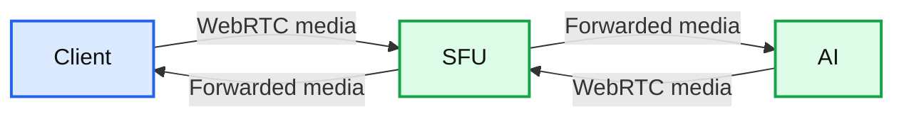
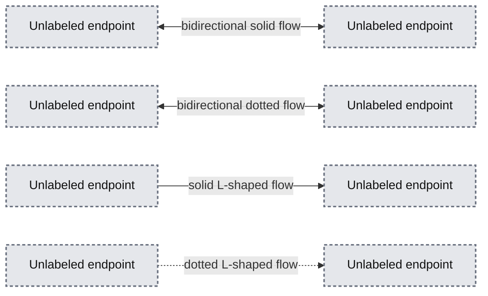
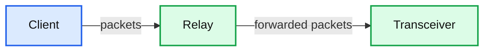
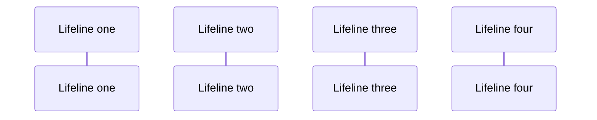
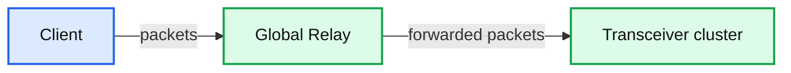

# How OpenAI delivers low-latency voice AI at scale

*How OpenAI rebuilt its WebRTC stack to power real-time Voice AI with low latency, global scale, and seamless conversational turn-taking.*

- Source: https://openai.com/index/delivering-low-latency-voice-ai-at-scale/
- Published: 2026-05-04
- Authors: Yi Zhang, William McDonald
- Categories: Engineering
- Diagrams: 5 candidates, 5 extracted as architecture

Voice AI only feels natural if conversation moves at the speed of speech. When the network gets in the way, people hear it immediately as awkward pauses, clipped interruptions, or delayed barge-in. That matters for ChatGPT voice, for developers building with the Realtime API, for agents working in interactive workflows, and for models that need to process audio while a user is still talking.

At OpenAI’s scale, that translates into three concrete requirements:

-

Global reach for more than 900 million weekly active users

-

Fast connection setup so a user can start speaking as soon as a session begins

-

Low and stable media round-trip time, with low jitter and packet loss, so turn-taking feels crisp

The team at OpenAI responsible for real-time AI interactions recently rearchitected our WebRTC stack to address three constraints that started to collide at scale: one-port-per-session media termination does not fit OpenAI infrastructure well, stateful ICE (Interactive Connectivity Establishment) and DTLS (Datagram Transport Layer Security) sessions need stable ownership, and global routing has to keep first-hop latency low. In this post, we walk through the split *relay plus transceiver* architecture we built to preserve standard WebRTC behavior for clients while changing how packets are routed inside OpenAI’s infrastructure.

## WebRTC lets us make real-time AI products

WebRTC is an open standard for sending low-latency audio, video, and data between browsers, mobile apps, and servers. It’s often associated with peer-to-peer calling, but it’s also a practical foundation for client-to-server real-time systems because it standardizes the hard parts of interactive media: ICE for connectivity establishment and NAT (Network Address Translation) traversal, DTLS and SRTP (Secure Real-time Transport Protocol) for encrypted transport, codec negotiation for compressing and decoding audio, RTCP (Real-time Transport Control Protocol) for quality control, and client-side features such as echo cancellation and jitter buffering.

That standardization matters for AI products. Without WebRTC, every client would need a different answer for how to establish connectivity across NATs, encrypt media, negotiate codecs (the coder-decoders selected for transmission and decompression) and adapt to changing network conditions. With WebRTC, we can build on a protocol stack that’s already implemented across browsers and mobile platforms, focusing our own work on the infrastructure that connects real-time media to models.

We also build on the WebRTC ecosystem itself, including mature open-source implementations and the standard work that keeps browsers, mobile apps, and servers interoperable. Foundational work by Justin Uberti (one of WebRTC’s original architects) and Sean DuBois (creator and maintainer of Pion) made it possible for teams like ours to build on battle-tested media infrastructure rather than reinvent low-level transport, encryption, and congestion-control behavior. We’re fortunate that both Justin and Sean are now colleagues here at OpenAI, helping guide how we bring WebRTC and real-time AI closer together.

For AI, the most important property is that audio arrives as a continuous stream. A spoken agent can begin transcribing, reasoning, calling tools, or generating speech while the user is still talking, instead of waiting for a full upload. That’s the difference between a system that feels conversational and one that feels like push-to-talk.

## Choosing a media architecture

Once we chose WebRTC, the next question was where to terminate it (where we’d accept and own the WebRTC connection—for example, at the edge) and how to connect those sessions to the inference backend. Termination matters because it determines how we handle real-time session state, media transport, routing, latency, and failure isolation.

**Summary:** The diagram shows an SFU architecture where AI participates in a WebRTC session.

**Components:**

- Client
- SFU
- AI

**Flows:**

- Client -> SFU: WebRTC media stream
- AI -> SFU: WebRTC media stream
- SFU -> Client: Selectively forwarded media
- SFU -> AI: Selectively forwarded media

**Numbers:** none

source image: https://images.ctfassets.net/kftzwdyauwt9/1YavI8rcFACX5rgbkKTtL1/636e2361e27b8d2bf82ca872dd151529/Option_1_web_light__3_.svg

An *SFU*, or selective forwarding unit, is a media server that receives one WebRTC stream from each participant and selectively forwards streams to the others. In this model, the SFU terminates a separate WebRTC connection for every participant, and the AI joins as another participant in the session. That can be a good fit for products that are inherently multiparty, such as group calls, classrooms, or collaborative meetings. It keeps audio codecs, RTCP messages, data channels, recording, and per-stream policy in one place.1

Even in client-to-AI products, an SFU is often the default starting point because it lets teams reuse one proven system for signaling, media routing, recording, observability, and future extensions such as human handoff or adding more participants.

**Summary:** The diagram shows unlabeled bidirectional and one-way communication paths between endpoints.

**Components:**

- No readable component labels are visible.

**Flows:**

- Unlabeled endpoint -> Unlabeled endpoint: bidirectional solid flow
- Unlabeled endpoint -> Unlabeled endpoint: bidirectional dotted flow
- Unlabeled endpoint -> Unlabeled endpoint: solid L-shaped flow
- Unlabeled endpoint -> Unlabeled endpoint: dotted L-shaped flow

**Numbers:** none

source image: https://images.ctfassets.net/kftzwdyauwt9/4Iy7m6jjeVJ8IJGYePERO4/56639dac038a9f8d31e7dca61a970269/Option_2_web_light__2_.svg

Our workload is different. Most sessions are 1:1—one user talking to one model, or one application talking to one real-time agent—with latency sensitivity on every turn. For that shape of traffic, we chose a *transceiver* model: a WebRTC edge service terminates the client connection and then converts media and events into simpler internal protocols for model inference, transcription, speech generation, tool use, and orchestration.

In this design, the transceiver is the only service that owns the WebRTC session state, including ICE connectivity checks, the DTLS handshake, SRTP encryption keys, and session lifecycle. “Termination” here means the transceiver is the endpoint that completes those handshakes and encrypts or decrypts the media. Keeping that state in one place made session ownership easier to reason about, and it let backend services scale like ordinary services instead of acting as WebRTC peers themselves.

## The core deployment problem: WebRTC meets Kubernetes

After choosing the transceiver model, our first implementation was a single Go service built on Pion that handled both signaling and media termination. It powers ChatGPT voice, the Realtime API’s WebRTC endpoint, and a number of research projects.

Operationally, the transceiver service does two jobs:

-

Signaling: SDP negotiation, codec selection, ICE credentials, and session setup

-

Media: Terminating downstream WebRTC connections and maintaining upstream connections to backend services for inference and orchestration

We wanted the service to run like the rest of our infrastructure: on Kubernetes, where workloads can scale up and down, and move across hosts as demand changes. But the conventional one-port-per-session WebRTC model fits that environment poorly, because it depends on large public UDP port ranges that are difficult to expose, secure, and preserve as pods are added, removed, or rescheduled.2

### Port exhaustion

The first problem was the one-port-per-session model itself. At high concurrency, that means exposing and managing very large UDP port ranges.

-

Cloud load balancers and Kubernetes services are not designed around tens of thousands of public UDP ports per service. Each additional range adds operational complexity in load balancer config, health checking, firewall policy, and rollout safety.3

-

Large UDP port ranges are hard to secure because they expand the externally reachable surface area and make network policy harder to audit.

-

They’re also a poor fit for autoscaling. Pods are constantly added, removed, and rescheduled in Kubernetes. Requiring each pod to reserve and advertise a large stable port range makes that elasticity brittle.4

This is why many WebRTC systems move toward a single UDP port per server, with application-level demultiplexing behind that port.5

### State stickiness

Single-port-per-server designs solve port count, but they introduce a second problem: preserving ownership of each session across a fleet.

ICE and DTLS are stateful protocols. The process that created a session needs to keep receiving that session’s packets so it can validate connectivity checks, complete the DTLS handshake, decrypt SRTP, and process later session changes such as ICE restarts. If packets for the same session land on a different process, setup can fail or media can break.

That gave us a specific target: expose a small, fixed UDP surface to the public internet, while still routing every packet to the transceiver that owns the corresponding WebRTC session.

### Comparison of WebRTC media architectures

We evaluated several ways to get there, including TURN (Traversal Using Relays around NAT), where an edge relay terminates client allocations and forwards traffic on their behalf.2

| **Approach** | **Pros** | **Cons** |
|---|---|---|
| Unique IP:port per session (also known as native direct UDP) | Direct client-to-server media pathNo forwarding layer in the data path | Requires one public UDP port per sessionLarge port ranges are difficult to expose and securePoor fit for Kubernetes and cloud load balancers |
| Unique IP:port per server | Much smaller public UDP footprint than per-session exposureOne shared socket per server can demultiplex many sessions | Works cleanly on a single host, but not across a shared load-balanced fleet by itselfSession demultiplexing on a single host only helps after a packet reaches that host; across a load-balanced fleet, the first packet can still land on the wrong instance, so you still need a deterministic way to steer each session to the process that owns it |
| TURN relay (protocol-terminating) | Clients only need to reach the TURN relay address and portCan centralize policy at the edge | TURN allocations add setup round tripsMoving or recovering allocations across TURN servers is still difficult |
| Stateless forwarder + stateful terminator (OpenAI’s relay + transceiver) | Small public UDP footprintTransceiver still owns the full WebRTC session | Adds one forwarding hop before media reaches the owning transceiverRequires custom coordination between relay and transceiver |

## Architecture overview: relay + transceiver

The architecture we shipped splits packet routing from protocol termination. Signaling still reaches the transceiver for session setup, while media enters through the relay first. The relay is a lightweight UDP forwarding layer with a small public footprint, and the transceiver is the stateful WebRTC endpoint behind it.

**Summary:** The diagram shows a client packet flow entering a relay, which forwards packets to a transceiver.

**Components:**

- Client
- Relay
- Transceiver

**Flows:**

- Client -> Relay: packets
- Relay -> Transceiver: forwarded packets

**Numbers:** none

source image: https://images.ctfassets.net/kftzwdyauwt9/UHoRVMlIWTpRbLNV8GkuF/61f6ed1fa4b5eb8449615e2019945119/Relay_web_light.svg

The relay does not decrypt media, run ICE state machines, or participate in codec negotiation. It reads enough packet metadata to choose a destination, then forwards the packet to the transceiver that owns the session. The transceiver still sees a normal WebRTC flow and still owns all protocol state. From the client’s perspective, nothing about the WebRTC session changes.

## Routing on ICE credentials

First-packet routing is the key step in this setup. A relay has to route the first packet from a client before any session exists on the packet path itself rather than by pausing on an external lookup service.

Every WebRTC session already carries a protocol-native routing hook: the ICE username fragment, or *ufrag*, a short identifier exchanged during session setup and echoed in STUN connectivity checks. We generate the server-side ufrag so it contains just enough routing metadata for relay to infer the destination cluster and owning transceiver.

**Summary:** The image shows a sequence diagram with four unlabeled vertical lifelines and several faint horizontal interactions.

**Components:**

- Four unlabeled lifelines

**Flows:**

- No arrow direction or labels are legible

**Numbers:** none

source image: https://images.ctfassets.net/kftzwdyauwt9/6QbrGtts7rPFQmclyxDr27/7a753393455e13ef4eacca80efa96792/Sequence_web_light__1_.svg

During signaling, the transceiver allocates session state and returns a shared relay VIP and UDP port in the SDP answer. A VIP is a virtual IP address fronting the relay fleet; combined with the port, it gives the client a single stable destination, such as `203.0.113.10:3478`, even though many relay instances sit behind it. The client’s first media-path packet is usually a STUN (Session Traversal Utilities for NAT) binding request, which ICE uses to verify that packets can reach the advertised address.

Relay parses just enough of that first STUN packet to read the server ufrag, decode the routing hint, and forward the packet to the owning transceiver. Each transceiver listens on a shared UDP socket, meaning one operating system endpoint bound to an internal IP:port, not one socket per session. After the relay creates a session from the client’s source IP:port to that transceiver destination, subsequent DTLS, RTP, and RTCP packets flow within the session without re-decoding the ufrag.

The relay’s session is purposefully minimal, consisting only of an in-memory session to inform packet forwarding, along with necessary counters for monitoring and timers for session expiration and cleanup. This design choice maintains packet routing directly on the packet path. If a relay restarts and loses the session, the next STUN packet rebuilds the session from the ufrag routing hint. To make it even more reliable, a Redis cache is employed to hold the mapping of *<client IP + Port, transceiver IP + Port>* once the route is established so that it can be recovered much earlier, before the next STUN packet arrives.

## Global Relay and geo-steered signaling

Once we reduced the public UDP surface to a small number of stable addresses and ports, we could deploy the same relay pattern globally. Global Relay is our fleet of geographically distributed relay ingress points that all implement the same packet-forwarding behavior.

Broad geographic ingress shortens the first client-to-OpenAI hop because a packet can enter our network at a relay close to the user, in both geography and network topology, instead of crossing the public internet to a distant region first. In practical terms, that means lower latency, less jitter, and fewer avoidable loss bursts before traffic reaches our backbone.6

**Summary:** The Global Relay layer receives packets from the client and forwards them to a transceiver cluster.

**Components:**

- Client
- Global Relay
- Transceiver cluster

**Flows:**

- Client -> Global Relay: packets
- Global Relay -> Transceiver cluster: forwarded packets

**Numbers:** none

source image: https://images.ctfassets.net/kftzwdyauwt9/31KPdS0P8lqyX2BJHsnJ7F/0878e620f311fbfbbebbd4d1166cd31e/Global_web_light.svg

We use Cloudflare geo and proximity steering for signaling so the initial HTTP or WebSocket request reaches a nearby transceiver cluster. The request context dictates the session’s location and which Global Relay ingress point is advertised to the client. The SDP answer provides the Global Relay address, while the ufrag contains sufficient information for Global Relay to route media to the designated cluster and relay to route to the destination transceiver.

Together, geo-steered signaling and Global Relay put both setup and media on a nearby entry path while keeping the session anchored to one transceiver. That reduces the round-trip time for signaling and for the first ICE connectivity check, which directly shortens how long a user waits before speech can start.

## Relay implementation and performance

We wrote the relay service in Go and kept the implementation narrow on purpose. On Linux, the kernel’s networking stack receives UDP packets from the machine’s network interface and delivers them to a socket, the operating system endpoint that a process reads after binding an IP:Port. Relay runs in userspace, so a regular Go process reads packet headers from that socket, updates a small amount of flow state, and forwards packets without terminating WebRTC. We did not need any kernel-bypass framework, which would let a userspace process poll network queues directly for higher packet rates but also add operational complexity.

Key design choices:

-

**No protocol termination:** Relay parses only STUN headers/ufrag; it uses cached state for subsequent DTLS, RTP, and RTCP, keeping packets opaque.

-

**Ephemeral state:** It maintains a small, short-timeout, in-memory map of client address to transceiver destination for flow state and observability.

-

**Horizontal scalability:** Multiple relay instances run in parallel behind a load balancer. State is not hard WebRTC state, so restarts cause minimal traffic drops and quick flow recovery.

Efficiency measures:

-

`SO_REUSEPORT` is a Linux socket option that allows multiple relay workers on the same machine to bind the same UDP port. The kernel then distributes incoming packets across those workers, which avoids a single read-loop bottleneck.

-

`runtime.LockOSThread` pins each UDP-reading goroutine to a specific OS thread. Combined with `SO_REUSEPORT`, that tends to keep packets from the same flow (the source and destination IP:Port plus protocol) on the same CPU core, improving cache locality and reducing context switching.

-

Pre-allocated buffers and minimal copying keep parsing and allocation overhead low to avoid garbage collection in Go.

This implementation handled our global real-time media traffic with a relatively small relay footprint, so we kept the simpler design instead of taking on a kernel bypass route.

## Results and learnings

This architecture lets us run WebRTC media in Kubernetes without exposing thousands of UDP ports. That matters because a smaller and fixed UDP surface is easier to secure and load balance, and it lets the infrastructure scale without reserving large public port ranges. With better infra support from Kubernetes and more security due to smaller surface area, this design also preserves standard WebRTC behavior for clients and confirms that an SFU-less design was the right default for our workload. Most of our sessions are point-to-point, latency-sensitive, and easier to scale when inference services don’t need to behave like WebRTC peers.

The broader lesson is that the best place to add complexity is in a thin routing layer, not in every backend service, and not in custom client behavior. Encoding routing metadata into a protocol-native field gave us deterministic first-packet routing, a small public UDP footprint, and enough flexibility to place ingress close to users around the world.

A few choices were especially important:

-

Preserve protocol semantics at the edge. Clients still speak standard WebRTC, which keeps browser and mobile interoperability intact.

-

Keep hard session states in one place. Transceiver owns ICE, DTLS, SRTP, and session lifecycle; relay only forwards packets.

-

Route on information already present in setup. The ICE ufrag gave us a first-packet routing hook without adding a hot-path lookup dependency.

-

Optimize for the common case before reaching for kernel bypass. A narrow Go implementation with careful use of `SO_REUSEPORT`, thread pinning, and low-allocation parsing was enough for our workload.

Real-time voice AI only works when infrastructure makes latency feel invisible. For us, that meant changing the shape of our WebRTC deployment without changing what clients expect from WebRTC itself.
