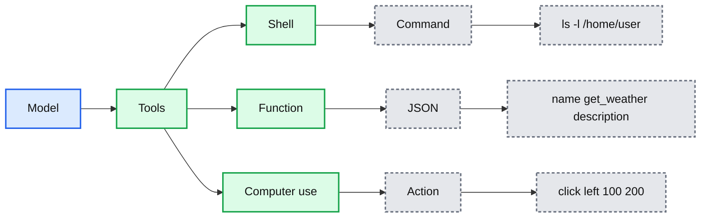
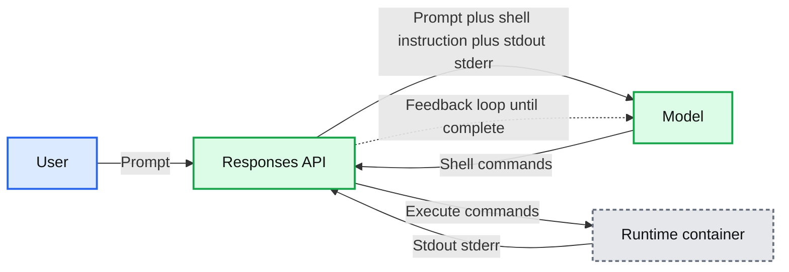
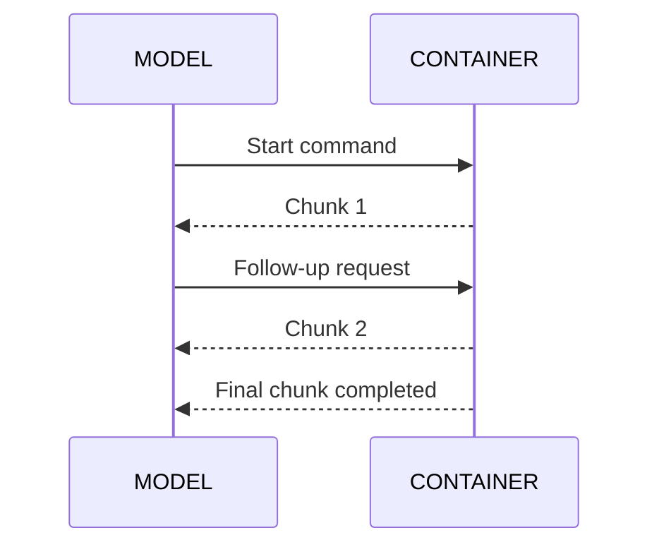
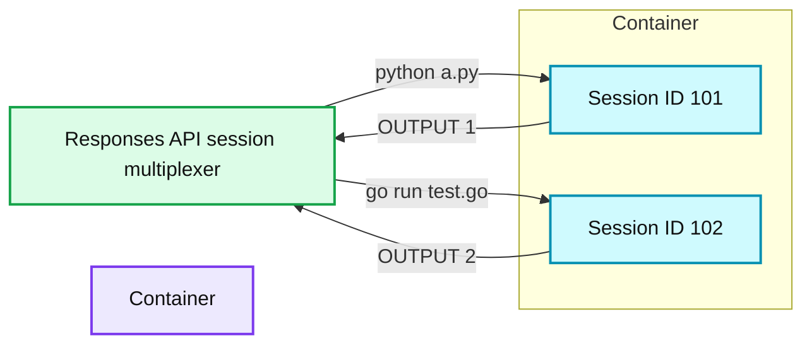
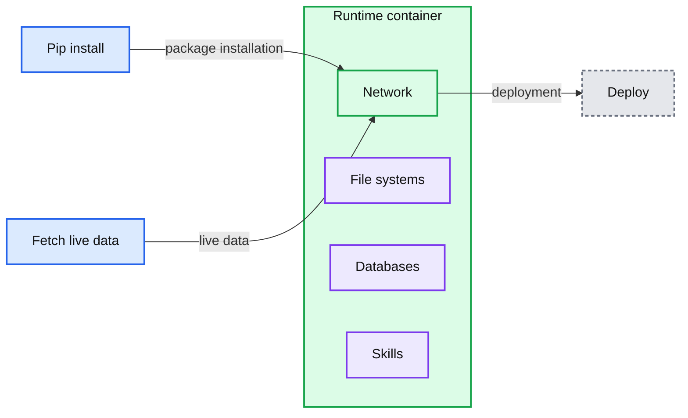
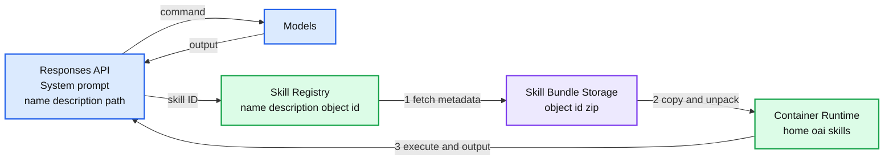

# From model to agent: Equipping the Responses API with a computer environment

*How OpenAI built an agent runtime using the Responses API, shell tool, and hosted containers to run secure, scalable agents with files, tools, and state.*

- Source: https://openai.com/index/equip-responses-api-computer-environment/
- Published: 2026-03-11
- Authors: Bo Xu, Danny Zhang, Rohit Arunachalam
- Categories: Engineering
- Diagrams: 6 candidates, 6 extracted as architecture

We're currently in a shift from using models, which excel at particular tasks, to using agents capable of handling complex workflows. By prompting models, you can only access trained intelligence. However, giving the model a computer environment can achieve a much wider range of use cases, like running services, requesting data from APIs, or generating more useful artifacts like spreadsheets or reports.

A few practical problems emerge when you try to build agents: where to put intermediate files, how to avoid pasting large tables into a prompt, how to give the workflow network access without creating a security headache, and how to handle timeouts and retries without building a workflow system yourself.

Instead of putting it on developers to build their own execution environments, we built the necessary components to equip the [Responses API](https://developers.openai.com/api/docs/guides/migrate-to-responses) with a computer environment to reliably execute real-world tasks.

OpenAI’s Responses API, together with the shell tool and a hosted container workspace, is designed to address these practical problems. The model proposes steps and commands; the platform runs them in an isolated environment with a filesystem for inputs and outputs, optional structured storage (like SQLite), and restricted network access. 

In this post, we’ll break down how we built a computer environment for agents and share some early lessons on how to use it for faster, more repeatable, and safer production workflows.

## The shell tool

A good agent workflow starts with a tight execution loop: the model proposes an action like reading files or fetching data with API, the platform runs it, and the result feeds into the next step. We’ll start with the shell tool—the simplest way to see this loop in action—and then cover the container workspace, networking, reusable skills, and context compaction.

To understand the shell tool, it’s first useful to understand how a language model uses tools in general: to do things like call a function or interact with a computer. During training, a model is shown examples of how tools are used and the resulting effects, step by step. This helps the model learn to decide when to use a tool and how to use it. When we say “using a tool”, we mean the model actually only proposes a tool call. It can't execute the call on its own.

**Summary:** The diagram shows a model proposing calls to shell, function, and computer-use tools, producing commands, JSON, or actions.

**Components:**

- Model
- Tools
- Shell
- Function
- Computer use
- Command
- JSON
- Action

**Flows:**

- Model -> Tools: proposes tool calls
- Shell -> Command: emits `ls -l /home/user`
- Function -> JSON: emits a function name and description
- Computer use -> Action: emits `click left, 100, 200`

**Numbers:** 100, 200

source image: https://images.ctfassets.net/kftzwdyauwt9/1j8ghdf39iWtEXQAL8Wjf5/37b3a6136cb493574a71ffe483a03467/OAI_Equip_Responses_API_with_a_computer_environment_The_shell_tool_is_just_another_tool_desktop-light__3_.svg

The shell tool makes the model dramatically more powerful: it interacts with a computer through the command line to carry out a wide range of tasks, from searching for text to sending API requests on your computer. Built on familiar Unix tooling, our shell tool can do anything you'd expect, with utilities like `grep`, `curl`, and `awk` available out of the box.

Compared to our existing code interpreter, which only executes Python, the shell tool enables a much wider range of use cases, like running Go or Java programs or starting a NodeJS server. This flexibility lets the model fulfill complex agentic tasks.

## Orchestrating the agent loop

On its own, a model can only propose shell commands, but how are these commands executed? We need an orchestrator to get model output, invoke tools, and pass the tool response back to the model in a loop, until the task is complete.

The Responses API is how developers interact with OpenAI models. When used with custom tools, the Responses API yields control back to the client, and the client requires its own harness for running the tools. However, this API can also orchestrate between the model and hosted tools out of the box. 

When the Responses API receives a prompt, it assembles model context: user prompt, prior conversation state, and tool instructions. For shell execution to work, the prompt must mention using the shell tool *and *the selected model must be trained to propose shell commands—models GPT‑5.2 and later are trained for this. With all of this context, the model then decides the next action. If it chooses shell execution, it returns one or more shell commands to Responses API service. The API service forwards those commands to the container runtime, streams back shell output, and feeds it to the model in the next request’s context. The model can then inspect the results, issue follow-up commands, or produce a final answer. The Responses API repeats this loop until the model returns a completion without additional shell commands.

**Summary:** The diagram shows the Responses API orchestrating a feedback loop between a user, model, and runtime container until completion.

**Components:**

- User
- Responses API
- Model
- Runtime container
- Prompt, shell instruction, and stdout stderr
- Shell commands
- Execute commands
- Feedback loop until complete

**Flows:**

- User -> Responses API: prompt
- Responses API -> Model: prompt, shell instruction, and stdout stderr
- Model -> Responses API: shell commands
- Responses API -> Runtime container: execute commands
- Runtime container -> Responses API: stdout and stderr

**Numbers:** none

source image: https://images.ctfassets.net/kftzwdyauwt9/5XFQ2SSueNXO1UHX1Gx6J4/1065aa14107b9bb4682d44f0991cc832/OAI_Equip_Responses_API_with_a_computer_environment_Agent_loop__Responses_API_orchestrates_model_and_shell_execution_in_cont.svg

When the Responses API executes a shell command, it maintains a streaming connection to the container service. As output is produced, the API relays it to the model in near real time so the model can decide whether to wait for more output, run another command, or move on to a final response.

**Summary:** The diagram shows a model and container exchanging shell commands and streamed output until command execution completes.

**Components:**

- MODEL - reasoning model that issues commands and receives output
- CONTAINER - shell execution environment that launches processes and collects output

**Flows:**

- MODEL -> CONTAINER: Start command
- CONTAINER -> MODEL: Stream chunk 1 while running or after completion
- MODEL -> CONTAINER: Follow-up request in the same live session
- CONTAINER -> MODEL: Stream chunk 2
- CONTAINER -> MODEL: Final completed chunk

**Numbers:** 1, 2, N seconds

source image: https://images.ctfassets.net/kftzwdyauwt9/5TOlwyV32C5GOvMzLCcuSq/2210a01520870c4e688fe27aece58d85/OAI_Equip_Responses_API_with_a_computer_environment_Streaming_shell_command_execution_output_desktop-light__3_.svg

*The Responses API streams shell command output*

The model can propose multiple shell commands in one step, and the Responses API can execute them concurrently using separate container sessions. Each session streams output independently, and the API multiplexes those streams back into structured tool outputs as context. In other words, the agent loop can parallelize work, such as searching files, fetching data, and validating intermediate results.

**Summary:** The diagram shows the Responses API asynchronously multiplexing commands across separate container sessions and returning independent outputs.

**Components:**

- Responses API session multiplexer using asynchronous command execution
- Container hosting isolated command sessions
- Session ID 101
- Session ID 102

**Flows:**

- Responses API -> Session ID 101: python a.py
- Session ID 101 -> Responses API: OUTPUT 1
- Responses API -> Session ID 102: go run test.go
- Session ID 102 -> Responses API: OUTPUT 2

**Numbers:** 1, 2, 101, 102

source image: https://images.ctfassets.net/kftzwdyauwt9/2gn7fUz2H2FbSbBsMYa58G/87622df28230c97e9d4cd29aec54380c/OAI_Equip_Responses_API_with_a_computer_environment_Responses_API_multiplexes_command_execution_sessions_desktop-light__3_.svg

When the command involves file operations or data processing, shell output can become very large and consume context budgets without adding useful signals. To control this, the model specifies an output cap per command. The Responses API enforces that cap and returns a bounded result that preserves both the beginning and end of the output, while marking omitted content. For example, you might bound the output to 1,000 characters, with preserved beginning and end:

`text at the beginning ... 1000 chars truncated ... text at the end`

Together, concurrent execution and bounded output make the agent loop both fast and context-efficient so the model can keep reasoning over relevant results instead of getting overwhelmed by raw terminal logs.

## When the context window gets full: compaction

One potential issue with agent loops is that tasks can run for a long time. Long-running tasks fill the context window, which is important for providing context across turns and across agents. Picture an agent calling a skill, getting a response, adding tool calls and reasoning summaries—the limited context window quickly fills up. To avoid losing the important context as the agent continues running, we need a way to keep the key details and remove anything extraneous. Instead of requiring developers to design and maintain custom summarization or state-carrying systems, we added native compaction in the Responses API, designed to align with how the model behaves and how it's been trained.

Our latest models are trained to analyze prior conversation state and produce a compaction item that preserves key prior state in an encrypted token-efficient representation. After compaction, the next context window consists of this compaction item and high-value portions of the earlier window. This allows workflows to continue coherently across window boundaries, even in extended multi-step and tool-driven sessions. [Codex relies on this mechanism](https://openai.com/index/unrolling-the-codex-agent-loop/) to sustain long-running coding tasks and iterative tool execution without degrading quality.

Compaction is available either built-in on the server or through a standalone `/compact` endpoint. Server-side compaction lets you configure a threshold, and the system handles compaction timing automatically, eliminating the need for complex client-side logic. It allows a slightly larger effective input context window to tolerate small overages right before compaction, so requests near the limit can still be processed and compacted rather than rejected. As model training evolves, the native compaction solution evolves with it for every OpenAI model release.

Codex helped us build the compaction system while serving as an early user of it. When one Codex instance hit a compaction error, we'd spin up a second instance to investigate. The result was that Codex got a native, effective compaction system just by working on the problem. This ability for Codex to inspect and refine itself has become an especially interesting part of working at OpenAI. Most tools only require the user to learn how to use them; Codex learns alongside us.

## Container context

Now let’s cover state and resources. The container is not only a place to run commands but also the working context for the model. Inside the container, the model can read files, query databases, and access external systems under network policy controls.

**Summary:** The diagram shows a runtime container equipped with file systems, databases, skills, and policy-controlled network access.

**Components:**

- Runtime container - technology unspecified
- File systems - technology unspecified
- Databases - technology unspecified
- Skills - technology unspecified
- Network - policy-controlled network, specific technology unspecified
- Pip install - package installation mechanism, technology unspecified
- Fetch live data - live data retrieval mechanism, technology unspecified
- Deploy - deployment mechanism, technology unspecified

**Flows:**

- Pip install -> Network: package installation
- Fetch live data -> Network: live data
- Network -> Deploy: deployment

**Numbers:** none

source image: https://images.ctfassets.net/kftzwdyauwt9/2rdxS5bXiQLnB1Vg05psLC/2ed0d4804552378d2b84afa12ce61b28/OAI_Equip_Responses_API_with_a_computer_environment_Inside_the_runtime_container_desktop-light__3_.svg

### File systems

The first part of container context is the file system for uploading, organizing, and managing resources. We built [container and file](https://developers.openai.com/api/reference/resources/containers) APIs to give the model a map of available data and help it choose targeted file operations instead of performing broad, noisy scans.

A common anti-pattern is packing all input directly into prompt context. As inputs grow, overfilling the prompt becomes expensive and hard for the model to navigate. A better pattern is to stage resources in the container file system and let the model decide what to open, parse, or transform with shell commands. Much like humans, models work better with organized information.

### Databases

The second part of container context is databases. In many cases, we suggest developers store structured data in databases as SQLite and query them. Instead of copying an entire spreadsheet into the prompt, for example, you can give the model a description of the tables—what columns exist and what they mean—and let it pull the rows it needs.

For example, if you ask, “Which products had declining sales this quarter?” the model can query *just* the relevant rows instead of scanning the whole spreadsheet. This is faster, cheaper, more scalable to larger datasets.

### Network access 

The third part of the container context is network access, an essential part of agent workloads. Agent workflow may need to fetch live data, call external APIs, or install packages. At the same time, giving containers unrestricted internet access can be risky: it can expose information to external websites, unintentionally touch sensitive internal or third-party systems, or make credential leaks and data exfiltration harder to guard against.

To address these concerns without limiting agents' usefulness, we built hosted containers to use a sidecar egress proxy. All outbound network requests flow through a centralized policy layer that enforces allowlists and access controls while keeping traffic observable. For credentials, we use domain-scoped secret injection at egress. The model and container only see placeholders, while raw secret values stay outside model-visible context and only get applied for approved destinations. This reduces the risk of leakage while still enabling authenticated external calls.

## Agent skills

Shell commands are powerful, but many tasks repeat the same multi-step patterns. Agents have to rediscover the workflow each run—replanning, reissuing commands, and relearning conventions—leading to inconsistent results and wasted execution. [Agent skills](https://agentskills.io/home) package those patterns into reusable, composable building blocks. Concretely, a skill is a folder bundle that includes ‘[SKILL.md](http://skill.md)’ (containing metadata and instructions) plus any supporting resources, such as API specs and UI assets.

This structure maps naturally to the runtime architecture we described earlier. The container provides persistent files and execution context, and the shell tool provides the execution interface. With both in place, the model can discover skill files using shell commands (`ls`, `cat`, etc.) when it needs to, interpret instructions, and run skill scripts all in the same agent loop.

We provide [APIs](https://developers.openai.com/api/reference/resources/skills) to manage skills in the OpenAI platform. Developers upload and store skill folders as versioned bundles, which can later be retrieved by skill ID. Before sending the prompt to the model, the Responses API loads the skill and includes it in model context. This sequence is deterministic:

1.

Fetch skill metadata, including name and description.

2.

Fetch the skill bundle, copy it into the container, and unpack it.

3.

Update model context with skill metadata and the container path.

When deciding whether a skill is relevant, the model progressively explores its instructions, and executes its scripts through shell commands in the container.

**Summary:** The diagram shows how the Responses API loads skills through a registry, bundle storage, and container runtime before interacting with models.

**Components:**

- Responses API - system prompt with name, description, and path
- Models - model command and output interface
- Skill Registry - stores name, description, and object ID
- Skill Bundle Storage - stores object ID and ZIP bundle
- Container Runtime - runs skills from `/home/oai/skills/...`

**Flows:**

- Responses API -> Skill Registry: skill ID
- Skill Registry -> Skill Bundle Storage: skill bundle retrieval
- Skill Bundle Storage -> Container Runtime: skill bundle installation
- Responses API -> Models: command
- Models -> Responses API: output
- Container Runtime -> Responses API: execute and output

**Numbers:** 1, 2, 3

source image: https://images.ctfassets.net/kftzwdyauwt9/7gic678N6fNMJxo5Gu63Xp/0927d6d543c4427268891853a2d04b23/OAI_Equip_Responses_API_with_a_computer_environment_Skill_loading_pipeline_desktop-light__4_.svg

## How agents are made

To put all the pieces together: the *Responses API* provides orchestration, the *shell tool *provides executable actions, the *hosted container* provides persistent runtime context, *skills* layer reusable workflow logic, and *compaction* allows an agent to run for a long time with the context it needs.

With these primitives, a single prompt can expand into an end-to-end workflow: discover the right skill, fetch data, transform it into local structured state, query it efficiently, and generate durable artifacts. 

The diagram below shows how this system works for creating a spreadsheet from live data.

## Make your own agent

For an in-depth example of combining the shell tool and computer environment for end-to-end workflows, see our [developer blog post](https://developers.openai.com/blog/skills-shell-tips) and [cookbook](https://developers.openai.com/cookbook/examples/skills_in_api) walking through packaging a skill and executing it through the Responses API.

We’re excited to see what developers build with this set of primitives. Language models are meant to do more than generating text, images, and audio–we’ll continue to evolve our platform to become more capable in handling complex, real-world tasks at scale.
