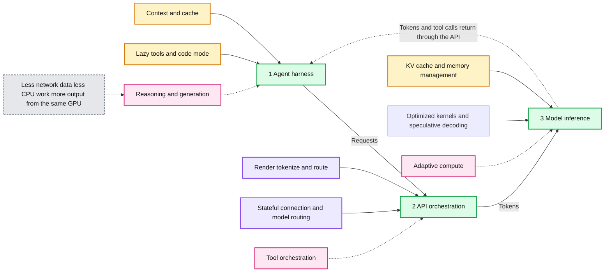
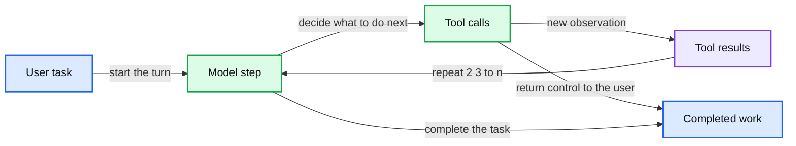
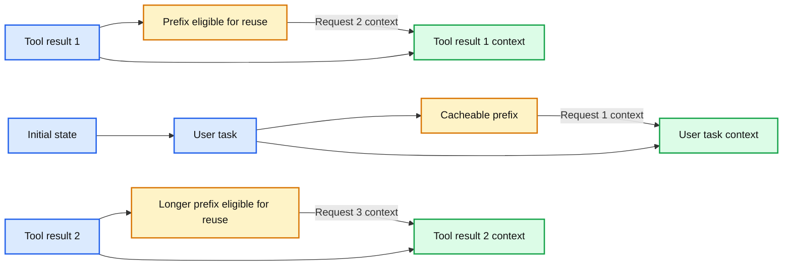

# How GPT-5.6 fuses frontier intelligence with frontier efficiency

*GPT-5.6 improves AI efficiency across models, inference, and agentic workflows, helping deliver more useful intelligence per dollar.*

- Source: https://openai.com/index/gpt-5-6-frontier-intelligence-efficiency/
- Published: 2026-07-29
- Authors: Matthew Ferrari, Phil Tillet, Ahmed Ibrahim, Joe Gershenson, Steve Coffey
- Categories: Engineering, Company
- Diagrams: 3 candidates, 3 extracted as architecture

We designed the GPT‑5.6 model family to balance [capability and cost](https://openai.com/index/gpt-5-6/)across the spectrum of tasks people use our models for. Our flagship model, GPT‑5.6 Sol, with max reasoning outperforms Claude Fable 5 on the Artificial Analysis Coding Agent Index at less than half of the cost. Terra performs as well as GPT‑5.5 on intelligence benchmarks at half the price, and Luna is our fastest and most affordable model, priced 80% less than the cost of Sol. To deliver these efficiencies, our research and technical teams have made significant optimizations at every major layer of our stack. These improvements span our models, inference (how we run models to generate output), and our agentic harness, which is used by both Codex and ChatGPT Work.

As we’ve scaled our models to 1 billion active users and more than 2 million businesses over the past four years, efficiency has been central to distributing the benefits of intelligence to everyone. Our mission is to ensure that artificial general intelligence benefits all of humanity. Over these years, we’ve worked to continuously unlock greater optimizations across our stack in order to offer the most performant models at every point in the cost-intelligence curve. We achieved our greatest intelligence-per-token efficiency yet through GPT‑5.6, which is trained to [achieve more work per token](https://openai.com/index/gpt-5-6/). In training, we optimize for both task success and efficiency, shaping the model to take a more direct path through a task.

This post looks beyond our models to share how we designed for efficiency through advancements in two other major parts of the stack, including 1) **inference**, by optimizing processes such as load balancing, speculative decoding, caching, and kernel optimization, to get more output from the same hardware, and 2) our **agentic harness**, including better managing context bloat, tool usage, and repeated work. We’ll also share the role of GPT‑5.6 Sol in landing several of these gains autonomously. While any isolated improvement may seem limited, these wins compound to allow us to deliver on the frontier of both intelligence and efficiency.

**Summary:** GPT-5.6 improves efficiency across the local agent harness, API orchestration, and GPU model inference layers.

**Components:**

- Agent harness: context and cache, lazy tools, and code mode.
- API orchestration: render, tokenize, and route, with stateful connection and model routing.
- Model inference: KV cache, memory management, optimized kernels, and speculative decoding.
- Model improvements: reasoning and generation, tool orchestration, and adaptive compute.
- Compounding results: less network data, less CPU work, and more output from the same GPU.

**Flows:**

- Agent harness -> API orchestration: Requests.
- API orchestration -> Model inference: Tokens.
- Model inference -> Agent harness: Tokens and tool calls return through the API.

**Numbers:** GPT-5.6, 1, 2, 3

source image: https://images.ctfassets.net/kftzwdyauwt9/3Hr3nq2SNbbjMbtCGVMbzp/aa96e2f3cdcf9681903d5af69399e240/figure1-light-desktop.svg

## Accelerating inference with GPT‑5.6 Sol

In a compute-constrained world where model demand is growing faster than capacity, efficiency is core to every system design. That’s especially true in our inference stack, which runs trained models to generate responses. Our primary objective is to serve more tokens with the same hardware, while preserving the intelligence, latency, availability, and reliability users expect.

Achieving this requires optimizing the entire system. A model can be highly efficient in isolation, but still be expensive to serve if requests are distributed poorly, hardware sits idle, or data movement slows down computation. Improvements at every layer compound, with gains coming from optimizations in routing (where requests are sent), scheduling (when requests are sent), kernels (software that runs on GPUs), caching (saved and reused work), and model implementation (the ordering of GPU code). GPT‑5.6 Sol in Codex played an instrumental role in all of these optimizations.

The first important example is load balancing. Globally, we route requests based on factors such as geography, available capacity, and accelerator type (the type of GPU or specialized chip running the model). Within a cluster, we distribute work across model instances based on load, context length, cache availability, and other request properties. Within each instance, work must then be partitioned efficiently across accelerators, the model’s sub-networks, and computing cores. GPT‑5.6 Sol in Codex helps us analyze production traffic, identify previously overlooked sources of imbalance, test new routing strategies, and constantly tune these heuristics. These load balancing improvements alone dramatically reduced the cost of serving our models.

We also used GPT‑5.6 Sol to optimize the model’s forward pass: the computation that transforms inputs into next-token predictions. Even when individual operations are fast, excess memory movement, synchronization, and inefficient data layouts can leave GPUs idle. To avoid this, GPT‑5.6 Sol found work that could be precomputed, avoided, or parallelized. With Codex, GPT‑5.6 Sol autonomously rewrote and optimized our production kernels, the core code that executes the mathematical operations that make up the model. This worked in part because we’ve trained GPT‑5.6 to be effective at writing and improving kernels in [Triton](https://triton-lang.org/main/index.html) and [Gluon](https://triton-lang.org/main/gluon/index.html), two open-source GPU programming languages maintained by OpenAI. These efforts, combined with broader kernel advancements from GPT‑5.6 Sol, reduced end-to-end serving costs by 20%. We’ve also heavily invested in verification tooling, such as the open-source tool [FpSan](https://triton-lang.org/main/programming-guide/chapter-3/fpsan.html) (Floating-Point Sanitizer), to help validate the correctness of the kernels written by GPT‑5.6 Sol.

Speculative decoding is another lever for improving speed and efficiency. The technique involves running a smaller draft (or “speculator”) model alongside the primary model, proposing several tokens for the primary model to verify in parallel. When those proposals are accepted, the system can produce multiple output tokens from a single primary-model pass, reducing the amount of expensive sequential computation. GPT‑5.6 Sol improved its own draft model by designing and running hundreds of experiments on its architecture, testing changes in size, structure, and features. Additionally, GPT‑5.6 Sol launched and monitored the speculator training process, autonomously intervening when issues arose, including hardware failures and training instability. The resulting improvements increased token-generation efficiency by more than 15%.

When processing uncached input tokens, the model builds the key-value (KV) cache in one compute-intensive pass; when generating output, it repeatedly reads from and extends that cache. The optimal configuration for serving, such as batching, sharding, and KV management, depends heavily on the workload—prompt and output length, batch size, cache hit rate, query characteristics, and more. However, the configuration space was previously too large to tune systematically, forcing engineers to rely on broad heuristics. With GPT‑5.6 Sol in Codex, we were able to analyze production workloads, generate and evaluate candidate configurations, and hyper-optimize how the engine and model are configured for each scenario. This makes a new level of workload-specific optimization practical, extracting more useful inference from the same hardware.

Inference optimization is a continuous feedback loop. We measure production behavior, identify the largest gaps, implement changes, and verify that they improve the whole system rather than an isolated benchmark. GPT‑5.6 Sol and Codex accelerate every part of that loop. This means our team can explore more ideas, respond faster to changing workloads, and create an inference stack with lower latency, more capacity, and lower costs for users.

## How our agentic harness streamlines repeated work

ChatGPT Work and Codex complete complex tasks through a series of model requests and tool calls. In a single turn—from the user’s request to the final response—Codex might inspect source code, search deployment history, read incident reports, edit a file, and run tests. Each step can require a request.

Preparing context, transmitting data, running inference, calling tools, and starting processes all take time and compute. If a task requires 30 model requests, an extra second per request adds up. Improving overall performance means reducing repeated work throughout the system, not just making the model faster.

*One user turn can contain many model and tool iterations. Any cost inside the repeated region can be paid many times.*

**Summary:** A user task cycles through model decisions, tool calls, and tool results repeatedly before producing completed work.

**Components:**

- User task: user request
- Model step: model inference
- Tool calls: tools that inspect or change state
- Tool results: observations returned by tools
- Completed work: final response to the user

**Flows:**

- User task -> Model step: start the turn
- Model step -> Tool calls: decide what to do next
- Tool calls -> Completed work: return control to the user
- Tool calls -> Tool results: produce a new observation
- Tool results -> Model step: repeat the decision loop
- Model step -> Completed work: complete the task

**Numbers:** 2, 3, ... n

source image: https://images.ctfassets.net/kftzwdyauwt9/4ufC2p4FrIJYDfnieoZ25Y/932a6d7e4931d64792f35f96a3afb1b0/figure3-light-desktop.svg

*One user turn can contain many model and tool iterations. Any cost inside the repeated region can be paid many times.*

These multipliers have informed how we designed our agentic harness, which is a Rust orchestration layer connecting our models, tools, and the user’s environment. Next, we’ll cover how avoiding context bloat, loading tools, and reusing work make each request more efficient.

#### Avoid context bloat

As agents are granted access to more tools, skills, plugins, and conversation history, context windows can easily expand. This increases cost, distracts the model, and prompts unnecessary reasoning. The harness can reduce this overhead through deferred discovery, which makes integrations, custom MCP tools, skills, and plugins only surfaceable when needed. The harness also prevents individual tools and MCP integrations from unexpectedly consuming the context window. Tool output is capped at 10,000 tokens by default unless the model requests a different limit.

#### Preserve exact prefixes for prompt caching

As previously mentioned, an agent loop can send the same instructions, conversation history, tool definitions, and earlier results to the GPUs multiple times within a single turn. Processing these repeated inputs is expensive, so prompt caching reuses the computation associated with a previously processed prompt prefix. To preserve that prefix, the harness treats all model-visible history as append-only: new messages, tool results, and environment updates are added at the end rather than inserted into earlier context. Tools are also presented in a deterministic order, while runtime settings, such as approval policies, are applied during execution instead of being embedded in tool definitions. This design choice contributes to Codex’s and ChatGPT Work’s high overall prompt-cache hit rates.

*Incremental transport changes what crosses the network; prompt caching changes what the model may avoid recomputing. Widths are conceptual, and the additional compression layer is not shown.*

**Summary:** The diagram shows append-only requests where incremental bytes sent produce progressively longer model context and reusable cached prefixes.

**Components:**

- Initial state - technology not specified
- User task - technology not specified
- Tool result 1 - technology not specified
- Tool result 2 - technology not specified
- Cacheable prefix - prompt cache
- User task context - model context
- Prefix eligible for reuse - prompt cache
- Longer prefix eligible for reuse - prompt cache
- Tool result context - model context

**Flows:**

- Initial state plus User task -> Cacheable prefix plus User task context: Request 1 context
- Tool result 1 -> Prefix eligible for reuse plus Tool result context: Request 2 continuation
- Tool result 2 -> Longer prefix eligible for reuse plus Tool result context: Request 3 continuation

**Numbers:** 1, 2, 3

source image: https://images.ctfassets.net/kftzwdyauwt9/4Yc2D5KqZejneZPTlOtA39/9799e64403c51e214ca4c53d9c8b40ed/Append-only_context_light_desktop.svg

*Incremental transport changes what crosses the network; prompt caching changes what the model may avoid recomputing. Widths are conceptual, and the additional compression layer is not shown.*

## Efficiency across the intelligence curve

The efficiency gains we delivered with GPT‑5.6 are the result of years of compounding improvements across the stack, spanning research, inference, and our agentic harness. The role of GPT‑5.6 in delivering many of these improvements makes us optimistic about how the pace of optimizations will accelerate. We’ll continue making greater optimizations in areas such as kernel optimization, alongside foundational improvements to our stack. We look forward to transferring these ongoing, under-the-hood improvements back to our users and customers in the form of more widely available, cost-efficient intelligence.

*Special thanks to Matthew Ferrari, Philippe Tillet, Ahmed Ibrahim, Joe Gershenson, and Steve Coffey, Members of Technical Staff, for their contributions to this post.*
