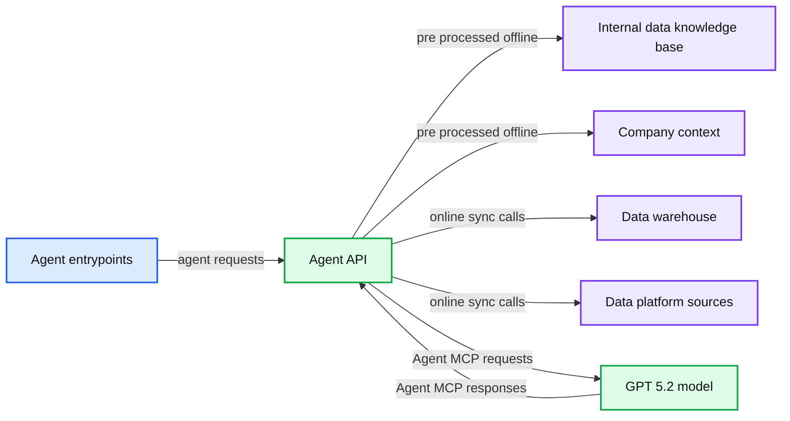
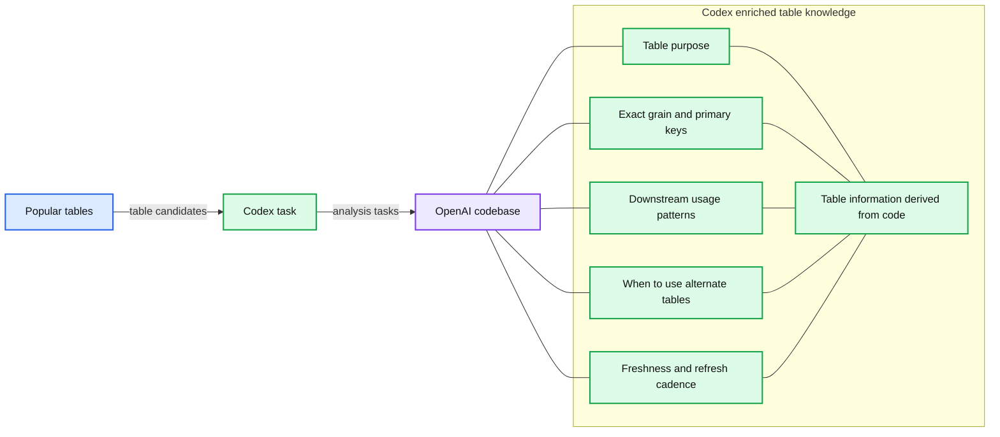
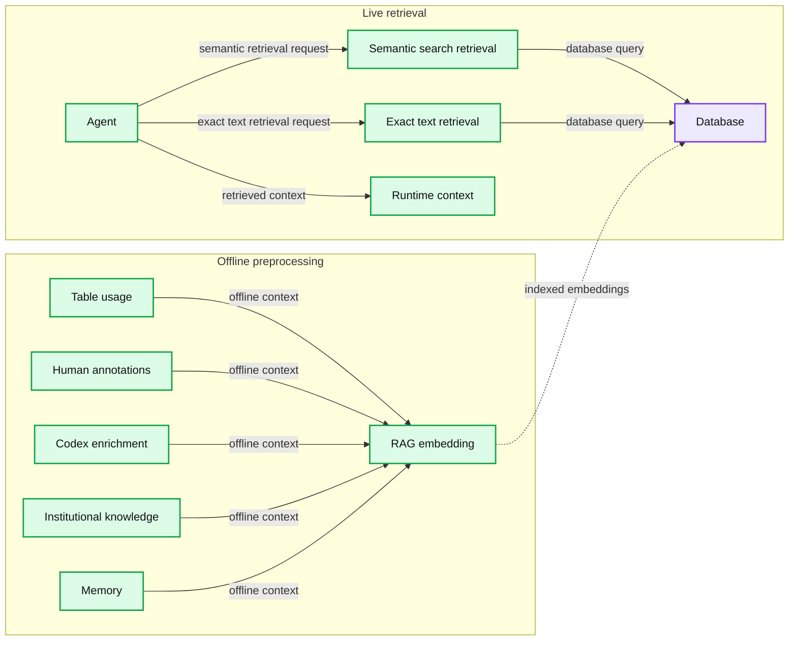

# Inside OpenAI’s in-house data agent

*How OpenAI built an in-house AI data agent that uses GPT-5, Codex, and memory to reason over massive datasets and deliver reliable insights in minutes.*

- Source: https://openai.com/index/inside-our-in-house-data-agent/
- Published: 2026-01-29
- Authors: Bonnie Xu, Aravind Suresh, Emma Tang
- Categories: Engineering
- Diagrams: 13 candidates, 5 extracted as architecture

Data powers how systems learn, products evolve, and how companies make choices. But getting answers quickly, correctly, and with the right context is often harder than it should be. To make this easier as OpenAI scales, we built **our own bespoke in-house AI data agent** that explores and reasons over our own platform**.**

Our agent is a custom internal-only tool (not an external offering), built specifically around OpenAI’s data, permissions, and workflows. We’re showing how we built and use it to help surface examples of the real, impactful ways AI can support day-to-day work across our teams. The OpenAI tools we used to build and run it ([Codex](https://openai.com/index/introducing-codex/), [our GPT‑5 flagship model](https://openai.com/index/introducing-gpt-5-2/), the [Evals API](https://platform.openai.com/docs/guides/evals), and the [Embeddings API](https://platform.openai.com/docs/guides/embeddings)) are the same tools we make available to developers everywhere.

Our data agent** **lets employees go from question to insight in minutes, not days. This lowers the bar to pulling data and nuanced analysis across all functions, not just by our data team. Today, teams across Engineering, Data Science, Go-To-Market, Finance, and Research at OpenAI lean on the agent to answer **high-impact data questions.** For example, it can help answer how to evaluate launches and understand business health, all through the intuitive format of natural language. The agent combines Codex-powered table-level knowledge with product and organizational context. Its continuously learning memory system means it also improves with every turn.

In this post, we’ll break down why we needed a bespoke AI data agent, what makes its code-enriched data context and self-learning so useful, and lessons we learned along the way.

## Why we needed a custom tool

OpenAI’s data platform serves more than **3.5k internal users **working across Engineering, Product, and Research, spanning over **600 petabytes** of data across **70k datasets.** At that size, simply finding the right table can be one of the most time-consuming parts of doing analysis.

As one internal user put it:

*“We have a lot of tables that are fairly similar, and I spend tons of time trying to figure out how they’re different and which to use. Some include logged-out users, some don’t. Some have overlapping fields; it’s hard to tell what is what.”*

Even with the correct tables selected, producing correct results can be challenging. Analysts must reason about table data and table relationships to ensure transformations and filters are applied correctly. Common failure modes—many-to-many joins, filter pushdown errors, and unhandled nulls—can silently invalidate results. At OpenAI’s scale, analysts should not have to sink time into debugging SQL semantics or query performance: their focus should be on defining metrics, validating assumptions, and making data-driven decisions.

This SQL statement is 180+ lines long. It’s not easy to know if we’re joining the right tables and querying the right columns.

## How it works

Let’s walk through what our agent is, how it curates context, and how it keeps self-improving.

Our agent is powered by [**GPT‑5.2**](https://openai.com/index/introducing-gpt-5-2/) and is designed to reason over OpenAI’s data platform. It’s available wherever employees already work: as a Slack agent, through a web interface, inside IDEs, in the [Codex CLI via MCP](https://developers.openai.com/codex/mcp/), and directly in [OpenAI’s internal ChatGPT app through a MCP connector](https://platform.openai.com/docs/guides/tools-connectors-mcp).

**Summary:** The diagram shows how multiple agent entrypoints connect through an Agent-API to GPT-5.2, internal knowledge, company context, and data platform systems.

**Components:**

- Agent-UI: web interface
- Local Agent-MCP: local MCP client
- Remote Agent-MCP: remote MCP client
- Slack Agent: Slack integration
- Agent-API: central agent service
- Internal Data Knowledge Base: internal data knowledge
- Company Context: Slack, Google Docs, Notion
- Data Warehouse: analytical data store
- Data Platform Sources: Spark, Airflow, Metadata Service
- Model GPT-5.2: language model

**Flows:**

- Agent-UI, Local Agent-MCP, Remote Agent-MCP, Slack Agent -> Agent-API: agent requests
- Agent-API -> Internal Data Knowledge Base: pre-processed offline data
- Agent-API -> Company Context: pre-processed offline context
- Agent-API -> Data Warehouse: online sync calls
- Agent-API -> Data Platform Sources: online sync calls
- Agent-API -> Model GPT-5.2: Agent-MCP requests
- Model GPT-5.2 -> Agent-API: Agent-MCP responses

**Numbers:** 5.2

source image: https://images.ctfassets.net/kftzwdyauwt9/1ZQ17A7DpqoQwM5FY5mPQb/db3ec91b07b5c4760d212fb918df53f7/oai_in-house_data_agent_How_it_works_desktop-light.svg

Users can ask complex, open-ended questions which would typically require multiple rounds of manual exploration. Take this example prompt, which uses a test data set:* “For NYC taxi trips, which pickup-to-dropoff ZIP pairs are the most unreliable, with the largest gap between typical and worst-case travel times, and when does that variability occur?”*

**The agent handles the analysis end-to-end**, from understanding the question to exploring the data, running queries, and synthesizing findings.

One of the agent’s superpowers is how it reasons through problems. Rather than following a fixed script, the agent evaluates its own progress. If an intermediate result looks wrong (e.g., if it has zero rows due to an incorrect join or filter), the agent investigates what went wrong, adjusts its approach, and tries again. Throughout this process, it retains full context, and carries learnings forward between steps. This **closed-loop, self-learning process** shifts iteration from the user into the agent itself, enabling faster results and consistently higher-quality analyses than manual workflows.

The agent’s reasoning to identify the most unreliable NYC taxi pickup–dropoff pairs.

The agent covers the full analytics workflow: discovering data, running SQL, and publishing notebooks and reports. It understands internal company knowledge, can web search for external information, and improves over time through learned usage and memory.

## Context is everything

High-quality answers depend on **rich, accurate context**. Without context, even strong models can produce wrong results, such as vastly misestimating user counts or misinterpreting internal terminology.

The agent without memory, unable to query effectively.

The agent’s memory enables faster queries by locating the correct tables.

To avoid these failure modes, the agent is built around **multiple layers of context that ground it in OpenAI’s data and institutional knowledge.**

**Summary:** The diagram shows six stacked layers of context used by a data agent, from table usage to runtime context.

**Components:**

- Table Usage - technology not specified
- Human Annotations - technology not specified
- Codex Enrichment - technology not specified
- Institutional Knowledge - technology not specified
- Memory - technology not specified
- Runtime Context - technology not specified

**Flows:**

- none

**Numbers:** 1, 2, 3, 4, 5, 6

```mermaid
%% Six stacked layers of context for a data agent
flowchart TD
    L6["6 Runtime Context"]
    L5["5 Memory"]
    L4["4 Institutional Knowledge"]
    L3["3 Codex Enrichment"]
    L2["2 Human Annotations"]
    L1["1 Table Usage"]

    classDef client   fill:#dbeafe,stroke:#2563eb,stroke-width:2px,color:#111
    classDef service  fill:#dcfce7,stroke:#16a34a,stroke-width:2px,color:#111
    classDef store    fill:#ede9fe,stroke:#7c3aed,stroke-width:2px,color:#111
    classDef cache    fill:#fef3c7,stroke:#d97706,stroke-width:2px,color:#111
    classDef queue    fill:#cffafe,stroke:#0891b2,stroke-width:2px,color:#111
    classDef critical fill:#fee2e2,stroke:#dc2626,stroke-width:4px,color:#111
    classDef external fill:#e5e7eb,stroke:#6b7280,stroke-width:2px,color:#111,stroke-dasharray:4 3
    classDef decision fill:#fce7f3,stroke:#db2777,stroke-width:2px,color:#111

    class L1,L2,L3,L4,L5,L6 service
```

source image: https://images.ctfassets.net/kftzwdyauwt9/j1pgiSbUmd9Ie3mkTjGpE/43822e3b21d480cde08b3bbc1827a3f5/oai_OpenAI_conversational_in-house_data_agent_Layers_of_context_desktop-light.svg

### Layer #1: Table Usage

-

**Metadata grounding: **The agent relies on schema metadata (column names and data types) to inform SQL writing and uses table lineage (e.g., upstream and downstream table relationships) to provide context on how different tables relate.

-

**Query inference: **Ingesting historical queries helps the agent understand how to write its own queries and which tables are typically joined together.

### Layer #2: Human Annotations

-

**Curated descriptions** of tables and columns provided by domain experts, capturing intent, semantics, business meaning, and known caveats that are not easily inferred from schemas or past queries.

Metadata alone isn’t enough. To really tell tables apart, you need to understand how they were created and where they originate.

### Layer #3: Codex Enrichment

-

By deriving a code-level definition of a table, the agent builds a deeper understanding of what the data actually contains. 

  -

Nuances on what is stored in the table and how it is derived from an analytics event provides extra information. For example, it can give context on the uniqueness of values, how often the table data is updated, the scope of the data (e.g., if the table excludes certain fields, it has this level of granularity), etc.

-

This provides enhanced usage context by showing how the table is used beyond SQL in Spark, Python, and other data systems.

-

This means that the agent can distinguish between tables that look similar but differ in critical ways. For example, it can tell whether a table only includes first-party ChatGPT traffic. This context is also refreshed automatically, so it stays up to date without manual maintenance.

**Summary:** Popular tables feed multiple Codex tasks that derive usage and metadata from the OpenAI codebase.

**Components:**

- Popular tables: data tables
- Codex task: Codex
- OpenAI codebase: source code
- Table’s purpose: derived table metadata
- Exact grain and primary keys: derived table metadata
- Downstream usage patterns: derived usage context
- When to use alternate tables: derived usage guidance
- Freshness and refresh cadence: derived freshness metadata
- Table information derived from code: generated knowledge

**Flows:**

- Popular tables -> Codex task: table candidates
- Codex task -> OpenAI codebase: analysis tasks

**Numbers:** none

source image: https://images.ctfassets.net/kftzwdyauwt9/2xpmOicZsx3fAISr1HKhrb/3b3b7a816674768a59a82b2b9f1b5d85/oai_in-house_data_agent_codex-enriched_knowledge_pipeline_desktop-light.svg

### Layer #4: Institutional Knowledge 

-

The agent can access Slack, Google Docs, and Notion, which capture critical company context such as launches, reliability incidents, internal codenames and tools, and the canonical definitions and computation logic for key metrics.

-

These documents are ingested, embedded, and stored with metadata and permissions. A retrieval service handles access control and caching at runtime, enabling the agent to efficiently and safely pull in this information.

### Layer #5: Memory

-

When the agent is given corrections or discovers nuances about certain data questions, it's able to save these learnings for next time, allowing it to constantly improve with its users. 

  -

As a result, future answers begin from a more accurate baseline rather than repeatedly encountering the same issues.

  -

The goal of memory is to retain and reuse non-obvious corrections, filters, and constraints that are critical for data correctness but difficult to infer from the other layers alone. 

  -

For example, in one case, the agent didn’t know how to filter for a particular analytics experiment (it relied on matching against a specific string defined in an experiment gate). Memory was crucially important here to ensure it was able to filter correctly, instead of fuzzily trying to string match.

-

When you give the agent a correction or when it finds a learning from your conversation, it will prompt you to save that memory for next time. 

  -

Memories can also be manually created and edited by users.

  -

Memories are scoped at the global and personal level, and the agent’s tooling makes it easy to edit them.

### Layer #6: Runtime Context

-

When no prior context exists for a table or when existing information is stale, the agent can issue live queries to the data warehouse to inspect and query the table directly. This allows it to validate schemas, understand the data in real-time, and respond accordingly.

-

The agent is also able to talk to other Data Platform systems (metadata service, Airflow, Spark) as needed to get broader data context that exists outside the warehouse.

We run a daily offline pipeline that aggregates table usage, human annotations, and Codex-derived enrichment into a single, normalized representation. This enriched context is then converted into embeddings using the [OpenAI embeddings API](https://platform.openai.com/docs/api-reference/embeddings) and stored for retrieval. At query time, the agent pulls only the most relevant embedded context via [retrieval-augmented generation](https://en.wikipedia.org/wiki/Retrieval-augmented_generation) (RAG) instead of scanning raw metadata or logs. This makes table understanding fast and scalable, even across tens of thousands of tables, while keeping runtime latency predictable and low. Runtime queries are issued to our data warehouse live as needed.

**Summary:** Offline context layers are embedded for retrieval, while the live agent combines semantic and exact text search against a database to produce runtime context.

**Components:**

- Table usage: offline usage signals
- Human annotations: manually curated metadata
- Codex enrichment: code-derived enrichment
- Institutional knowledge: organizational context
- Memory: persistent agent memory
- RAG embedding: retrieval-augmented embeddings
- Database: stored searchable context
- Semantic search retrieval: vector-based retrieval
- Exact text retrieval: lexical text retrieval
- Agent: query orchestration and reasoning
- Runtime context: retrieved context supplied at runtime

**Flows:**

- Table usage, human annotations, Codex enrichment, institutional knowledge, and memory -> RAG embedding: offline preprocessing context
- RAG embedding -> Database: indexed embeddings
- Agent -> Semantic search retrieval: semantic retrieval request
- Agent -> Exact text retrieval: exact text retrieval request
- Semantic search retrieval -> Database: database query
- Exact text retrieval -> Database: database query
- Agent -> Runtime context: retrieved runtime context

**Numbers:** none

source image: https://images.ctfassets.net/kftzwdyauwt9/6fwNR1Brsp4ElJRTh6KrHU/2e7a193d57171875ef40848916d11b34/oai_in-house_data_agent_context_retrieval_desktop-light.svg

Together, these layers ensure the agent’s reasoning is grounded in OpenAI’s data, code, and institutional knowledge, dramatically reducing errors and improving answer quality.

## Built to think and work like a teammate

One-shot answers work when the problem is clear, but most questions aren’t. More often, arriving at the correct result requires back-and-forth refinement and some course correction.

The agent is built to behave like a teammate you can reason with. It’s a conversational, always-on and handles both quick answers and iterative exploration.

It carries over complete context across turns, so users can ask follow-up questions, adjust their intent, or change direction without restating everything. If the agent starts heading down the wrong path, users can interrupt mid-analysis and redirect it, just like working with a human collaborator who listens instead of plowing ahead.

When instructions are unclear or incomplete, the agent proactively asks clarifying questions. If no response is provided, it applies sensible defaults to make progress. For example, if a user asks about business growth with no date range specified, it may assume the last seven or 30 days. These priors allow it to stay responsive and non-blocking while still converging on the right outcome.

The result is an agent that works well both when you know **exactly what you want** (e.g., “Tell me about this table”) and **just as strong when you’re exploring** (e.g., “I’m seeing a dip here, can we break this down by customer type and timeframe?”). 

After rollout, we observed that users frequently ran the same analyses for routine repetitive work. To expedite this, the agent's workflows package recurring analyses into reusable instruction sets. Examples include workflows for weekly business reports and table validations. By encoding context and best practices once, workflows streamline repeat analyses and ensure consistent results across users.

## Moving fast without breaking trust

Building an always-on, evolving agent means quality can drift just as easily as it can improve. Without a tight feedback loop, regressions are inevitable and invisible. The only way to scale capability without breaking trust is through systematic evaluation.

In this section, we’ll discuss how we leverage [OpenAI’s Evals API](https://platform.openai.com/docs/guides/evals) to measure and protect the agent’s response quality.

Its Evals are built on curated sets of question-answer pairs. Each question targets an important metric or analytical pattern we care deeply about getting right, paired with a manually authored “golden” SQL query that produces the expected result. For each eval, we send the natural language question to its query-generation endpoint, execute the generated SQL, and compare the output against the result of the expected SQL.

**Summary:** The evaluation pipeline compares generated and expected SQL and results, then produces a score and reasoning.

**Components:**

- Question and expected answer pairs using manually authored golden SQL
- Generated SQL using the query generation endpoint
- Generated SQL results using executed generated SQL
- Expected SQL using the golden query
- Expected SQL results using executed expected SQL
- Dataframe result comparison
- SQL comparison
- Final score
- Grader reasoning

**Flows:**

- Question and expected answer pairs -> Generated SQL: natural language question
- Generated SQL -> Generated SQL results: SQL execution
- Question and expected answer pairs -> Expected SQL: golden SQL
- Expected SQL -> Expected SQL results: SQL execution
- Generated SQL results -> Dataframe result comparison: generated result set
- Expected SQL results -> Dataframe result comparison: expected result set
- Generated SQL -> SQL comparison: generated query
- Expected SQL -> SQL comparison: expected query
- Dataframe result comparison -> Final score: comparison signal
- SQL comparison -> Final score: comparison signal
- Final score -> Grader reasoning: evaluation result

```mermaid
%% Shows SQL and result comparison in the data agent evaluation pipeline
flowchart LR
    Q["Question and expected answer pairs"]
    GS["Generated SQL"]
    GR["Generated SQL results"]
    ES["Expected SQL"]
    ER["Expected SQL results"]
    DC["Dataframe result comparison"]
    SC["SQL comparison"]
    SO["Final score"]
    RE["Grader reasoning"]

    Q -->|natural language question| GS
    GS -->|SQL execution| GR
    Q -->|golden SQL| ES
    ES -->|SQL execution| ER
    GR -->|generated result set| DC
    ER -->|expected result set| DC
    GS -->|generated query| SC
    ES -->|expected query| SC
    DC -->|comparison signal| SO
    SC -->|comparison signal| SO
    SO -->|evaluation result| RE

    classDef client fill:#dbeafe,stroke:#2563eb,stroke-width:2px,color:#111
    classDef service fill:#dcfce7,stroke:#16a34a,stroke-width:2px,color:#111
    classDef store fill:#ede9fe,stroke:#7c3aed,stroke-width:2px,color:#111
    classDef cache fill:#fef3c7,stroke:#d97706,stroke-width:2px,color:#111
    classDef queue fill:#cffafe,stroke:#0891b2,stroke-width:2px,color:#111
    classDef critical fill:#fee2e2,stroke:#dc2626,stroke-width:4px,color:#111
    classDef external fill:#e5e7eb,stroke:#6b7280,stroke-width:2px,color:#111,stroke-dasharray:4 3
    classDef decision fill:#fce7f3,stroke:#db2777,stroke-width:2px,color:#111

    class Q client
    class GS,ES service
    class GR,ER store
    class DC,SC service
    class SO critical
    class RE external
```

source image: https://images.ctfassets.net/kftzwdyauwt9/2BwOZ1rNAX2oxVQ5FXUkQK/1d2139185e8b20ba30bf525cbed82ced/oai_in-house_data_agent_eval_pipeline_desktop-light.svg

Evaluation doesn’t rely on naive string matching. Generated SQL can differ syntactically while still being correct, and result sets may include extra columns that don’t materially affect the answer. To account for this, we compare both the SQL and the resulting data, and feed these signals into OpenAI’s Evals grader. The grader produces a final score along with an explanation, capturing both correctness and acceptable variation.

These evals are like unit tests that run continuously during development to identify regressions as canaries in production; this allows us to catch issues early and confidently iterate as the agent's capabilities expand.

## Agent security

Our agent plugs directly into OpenAI’s existing security and access-control model. It operates purely as an interface layer, inheriting and enforcing the same permissions and guardrails that govern OpenAI’s data. 

**All of the agent’s access is strictly** **pass-through**, meaning users can only query tables they already have permission to access. When access is missing, it flags this or falls back to alternative datasets the user is authorized to use.

Finally, it's built for transparency. Like any system, it can make mistakes. It **exposes its reasoning process** by summarizing assumptions and execution steps alongside each answer. When queries are executed, it links directly to the underlying results, allowing users to inspect raw data and verify every step of the analysis.

## Lessons learned

Building our agent from scratch surfaced practical lessons about how agents behave, where they struggle, and what actually makes them reliable at scale.

#### Lesson #1: **Less is More **

Early on, we exposed our full tool set to the agent, and quickly ran into problems with overlapping functionality. While this redundancy can be helpful for specific custom cases and is more obvious to a human when manually invoking, it’s confusing to agents. To reduce ambiguity and improve reliability, we restricted and consolidated certain tool calls.

#### Lesson #2: **Guide the Goal, Not the Path**

We also discovered that highly prescriptive prompting degraded results. While many questions share a general analytical shape, the details vary enough that rigid instructions often pushed the agent down incorrect paths. By shifting to higher-level guidance and relying on GPT‑5’s reasoning to choose the appropriate execution path, the agent became more robust and produced better results.

#### Lesson #3: **Meaning Lives in Code**

Schemas and query history describe a table’s shape and usage, but its true meaning lives in the code that produces it. Pipeline logic captures assumptions, freshness guarantees, and business intent that never surface in SQL or metadata. By crawling the codebase with Codex, our agent understands how datasets are actually constructed and is able to better reason about what each table actually contains. It can answer “what’s in here” and “when can I use it” far more accurately than from warehouse signals alone. 

## Same vision, new tools

We’re constantly working to improve our agent by increasing its ability to handle ambiguous questions, improving its reliability and accuracy with stronger validations, and integrating it more deeply into workflows. We believe it should blend naturally into how people already work, instead of functioning like a separate tool.

While our tooling will keep benefiting from underlying improvements in agent reasoning, validation, and self-correction, our team’s mission remains the same: seamlessly deliver fast, trustworthy data analysis across OpenAI’s data ecosystem.
