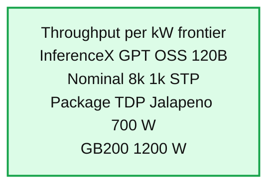
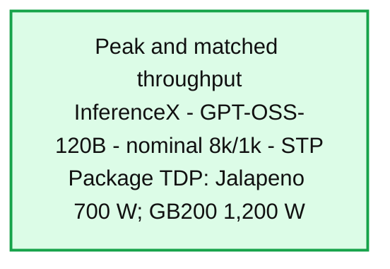
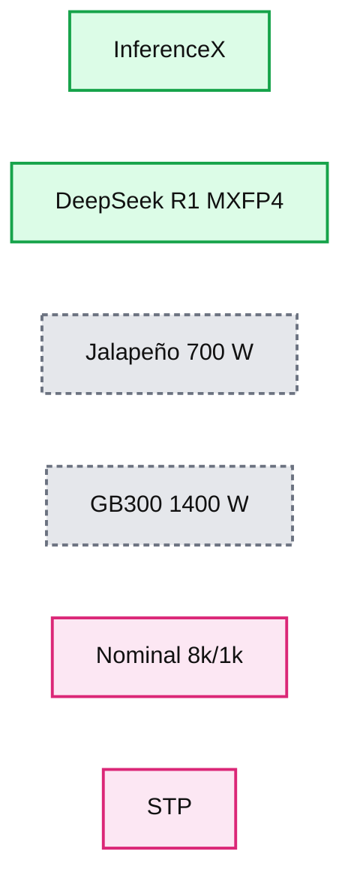
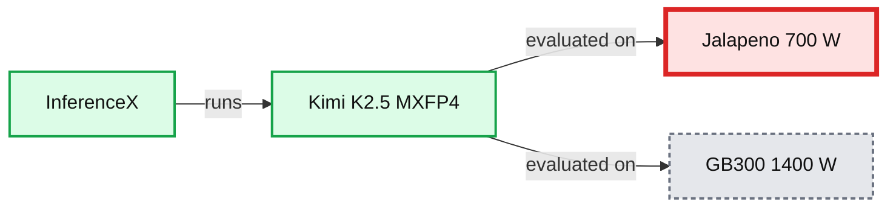

# Jalapeño’s first results show industry-leading speed and efficiency in AI inference

*Jalapeño is a custom inference chip from OpenAI that delivers faster, more power-efficient AI inference, with higher throughput and lower latency for modern models.*

- Source: https://openai.com/index/jalapeno-first-results/
- Published: 2026-08-25
- Authors: OpenAI
- Categories: Engineering, Company
- Diagrams: 7 candidates, 6 extracted as architecture

Since announcing Jalapeño, OpenAI’s first custom inference chip, we have been testing the chip and the system built around it. The results show a significant performance advance: Jalapeño can serve more AI work per unit of power while also returning responses more quickly. Jalapeño delivers both higher throughput and lower latency with one architecture, where existing hardware systems often have to make a tradeoff between the two.

For customers, that can mean faster responses, more responsive agents, and more reliable access as demand grows. Our mission is to ensure that artificial general intelligence benefits all of humanity. These gains will help make increasingly capable AI more affordable and more broadly available.

OpenAI models also accelerated Jalapeño’s development. Earlier generations helped the team design and bring up the chip, while our latest models are accelerating how we optimize and program it. Jalapeño’s performance extends across GPT‑OSS 120B, DeepSeek R1, and Kimi K2.5 1T, showing that the architecture works across models developed both inside and outside OpenAI. Across all three, Jalapeño delivered 1.5 to 1.9 times more AI work per watt at peak throughput and 1.7 to 3.6 times lower end-to-end latency than the comparison systems. For highly interactive workloads, it delivered 2.1 to 4.1 times higher performance.

Jalapeño is also evidence of a broader full-stack advantage. OpenAI can design models, products, serving software, chips, memory, networking, and systems together, using what we learn from real workloads to improve every layer of the stack. Jalapeño is working first-party silicon with measured results, and it is the beginning of a multigenerational platform. In the months ahead, we will ramp Jalapeño to deliver faster, more capable, and more efficient products for our customers.

## How we measured Jalapeño’s performance

We evaluate performance at a matched user experience, measuring how much useful AI work each system can complete per unit of power while meeting the latency customers and interactive agents require. This matters especially for agents, which need to complete many steps in sequence, so delays can compound across an entire task.

To understand how Jalapeño performs in practice, we tested it on InferenceX, a public benchmark from SemiAnalysis that measures the full process of serving an AI request. We compared Jalapeño with leading commercially available AI systems across the tested operating range, from high-throughput serving to highly interactive, low-latency use. Jalapeño delivered a better combination of throughput, power efficiency, and latency. Although performance is sometimes reported per chip, we believe the more useful standard is performance per unit of power.

### Jalapeño widens the lead at previous-best TBT

### Jalapeño delivers more tokens per user

### Jalapeño delivers more throughput per kilowatt

Across all three public models, Jalapeño delivered a better combination of performance per watt and latency across the tested operating range, placing it on the Pareto frontier. To compare the systems consistently, we normalized the results using each accelerator’s published chip power rating. Jalapeño is rated at 700 watts, although its measured sustained power remained at or below 550 watts on the workloads tested.

Jalapeño performed strongly across GPT‑OSS 120B, DeepSeek R1 670B, and Kimi K2.5 1T. On Kimi, the largest public model we tested, it delivered approximately 1.5 times higher peak performance per watt and 3.4 times lower end-to-end latency than the comparison system. In our internal testing, Jalapeño’s advantage widened further on frontier OpenAI models, suggesting that the architecture becomes more valuable as workloads grow larger and more demanding.

## Architecting for speed and efficiency within a single chip

Jalapeño was designed from the start by asking: what hardware would we build if its primary job were serving modern and future language models, especially interactive agents? Jalapeño’s gains come from designing the chip, memory, network, software, and rack-scale system together around real language-model workloads. Language-model inference moves through several distinct phases with different bottlenecks. Prefill, when the system processes a prompt, is compute-intensive, while decode, when the system generates the response token by token, is constrained more by memory bandwidth. Communication can also add latency when data must move between cores and chips, leaving some processing units idle while they wait. A system that excels at one phase can lose that advantage while waiting for data or moving model state between different resources.

We designed Jalapeño to minimize data movement and communication delays. This means that model state, including the KV cache used while generating a response, can be explicitly placed and kept local while the system activates the right combination of compute, memory, and networking for each inference phase. The network is integral to the architecture. Its large domain allows the entire workload to remain within one connected system, minimizing data movement and helping the complete request stay fast and efficient from beginning to end. The result is a balanced and fungible accelerator that can support changing model architectures, excel at both prefill and decode, and adapt as the balance between them changes, a defining feature of agentic workloads.

## We used AI to design the chip, and designed the chip so AI could program it

AI played a direct role in Jalapeño’s development, enabling the team to move from initial design to tapeout in nine months by exploring implementations, shortening design, measurement, and verification loops, and continuously iterating on model workloads. AI also helped optimize the chip’s arithmetic circuits, allowing the team to fit more compute performance into the chip on schedule.

Jalapeño was designed as a clear, predictable programming target for both humans and AI. Engineers can describe work through local tensors, explicit communication, and predictable synchronization. AI can then optimize how that work is mapped, placed, scheduled, and coordinated across the system. That clear, predictable structure gives AI a tractable way to tackle the traditionally difficult problem of parallel programming.

Supporting each new model family still requires new kernels and model-specific optimizations. Using Codex with GPT‑Astra, the team brought three open-weight models that were not part of Jalapeño’s original production plan to high performance within two months. This demonstrated both the flexibility of the architecture and the speed at which AI can help us program it. For selected GPT‑OSS attention and mixture-of-experts blocks, AI-generated implementations ran 1.5 to 1.8 times faster than the existing human-expert-written implementations. Those figures apply to the selected blocks, not the full model, but they point toward a powerful new development loop.

## The path ahead for efficient, ultra-fast inference

AI infrastructure is valuable because of the useful real-world work it enables. By producing more useful work from the same power and hardware, Jalapeño can help us serve more demand and lower the cost of delivering a successful result. For OpenAI, that can improve operating leverage by allowing useful work and revenue to grow faster than the cost to serve. It can also support broader adoption and continued investment in better models, products, and infrastructure. Faster inference can enable faster iteration and new use cases.

Jalapeño expands what is possible for efficient, low-latency inference:

-

Ultra-fast-mode inference at efficiencies previously available only in fast mode

-

Fast-mode inference at efficiencies previously available only in batched mode

-

Higher efficiency for batched-mode inference

We plan to begin deploying Jalapeño within OpenAI’s compute infrastructure by the end of the year. It is the first generation of a multigenerational roadmap: Gen 2 is deep in development, and Gen 3 is taking shape. Each generation will build on what we learn and further advance both efficiency and speed.

Meeting growing demand for AI will require more compute from every available source. We will continue to widely deploy accelerators from NVIDIA and other partners for both training and inference workloads. Our mission is to ensure that artificial general intelligence benefits all of humanity.

As we prepare for deployment, we are continuing production qualification, maturing the software, preparing to operate Jalapeño at scale, and validating performance across more models. The results so far show what is possible when we design the full system together: more responsive, capable, and agentic AI delivered more efficiently to more people.

## Appendix

### Jalapeño is pareto frontier at GPT‑OSS 120B

**Summary:** The diagram presents the throughput-per-kW frontier for InferenceX running GPT-OSS-120B under specified serving and power conditions.

**Components:**

- none

**Flows:**

- none

**Numbers:** 120B, 8k, 1k, 700 W, 1,200 W

source: interactive diagram 1 on the post page

### Jalapeño leads across GPT‑OSS operating points

**Summary:** The diagram compares peak and matched throughput for InferenceX on GPT-OSS-120B under specified workload and package power conditions.

**Components:**

- No distinct components or nodes are labeled.

**Flows:**

- none

**Numbers:**

- GPT-OSS-120B
- 8k/1k
- 700 W
- 1,200 W

source: interactive diagram 2 on the post page

Higher peak mixed TPS / kW

≈1.9×

85,448 vs. 44,960 mixed / kW

Lower end-to-end latency

≈1.7×

1.03 s vs. 1.80 s

Lower min TBT

≈2.7×

0.69 vs. 1.87 ms (1,459 vs. 535 tok/s/user)

More throughput at previous TBT

≈53.7×

22,935 vs. 427 mixed / kW (at 535.28 tok/s/user)

### Jalapeño is pareto frontier at DeepSeek R1 670B

**Summary:** The diagram compares Jalapeño and GB300 throughput-per-kW performance for DeepSeek R1 MXFP4 inference using InferenceX.

**Components:**

- Jalapeño inference system using 700 W package TDP
- GB300 inference system using 1,400 W package TDP
- DeepSeek R1 MXFP4 model
- InferenceX benchmark
- STP workload with nominal prompt and generation lengths

**Flows:**

- InferenceX -> Jalapeño: DeepSeek R1 MXFP4 STP workload
- InferenceX -> GB300: DeepSeek R1 MXFP4 STP workload
- Jalapeño -> GB300: throughput-per-kW frontier comparison

**Numbers:**

- 8k
- 1k
- 700 W
- 1,400 W

source: interactive diagram 3 on the post page

### Jalapeño leads across DeepSeek R1 operating points

**Summary:** The diagram compares peak and matched throughput for InferenceX running DeepSeek R1 MXFP4 on Jalapeño and GB300 systems.

**Components:**

- InferenceX inference technology
- DeepSeek R1 MXFP4 model
- Jalapeño accelerator system
- GB300 accelerator system
- STP measurement
- Nominal 8k/1k workload

**Flows:**

- none

**Numbers:**

- 8k/1k nominal workload
- Jalapeño package TDP: 700 W
- GB300 package TDP: 1,400 W

source: interactive diagram 4 on the post page

Higher peak mixed TPS / kW

≈1.7×

19,641 vs. 11,781 mixed / kW

Lower end-to-end latency

≈3.6×

1.65 s vs. 5.99 s

Lower min TBT

≈4.1×

1.43 vs. 5.90 ms (700 vs. 169 tok/s/user)

More throughput at previous TBT

≈104.3×

12,258 vs. 118 mixed / kW (at 169.41 tok/s/user)

### Jalapeño is pareto frontier at Kimi K2.5 1T

**Summary:** The diagram compares the throughput-per-kW frontier of Jalapeño and GB300 for Kimi K2.5 inference.

**Components:**

- Jalapeño, technology unspecified
- GB300, technology unspecified

**Flows:**

- none

**Numbers:** Kimi K2.5, MXFP4, 8k/1k, 700 W, 1,400 W

source: interactive diagram 5 on the post page

### Jalapeño leads across Kimi K2.5 operating points

**Summary:** The diagram compares Jalapeño and GB300 peak and matched throughput for InferenceX running Kimi K2.5 MXFP4.

**Components:**

- InferenceX using Kimi K2.5 MXFP4
- Jalapeño inference system
- GB300 inference system

**Flows:**

- none

**Numbers:** 8k/1k, 700 W, 1,400 W

source: interactive diagram 6 on the post page

Higher peak mixed TPS / kW

≈1.5×

18,195 vs. 11,862 mixed / kW

Lower end-to-end latency

≈3.4×

1.56 s vs. 5.31 s

Lower min TBT

≈3.8×

1.44 vs. 5.48 ms (694 vs. 182 tok/s/user)

More throughput at previous TBT

≈56.1×

6,744 vs. 120 mixed / kW (at 182.46 tok/s/user)
