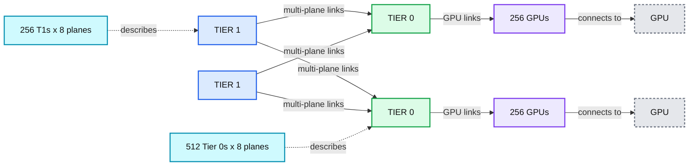
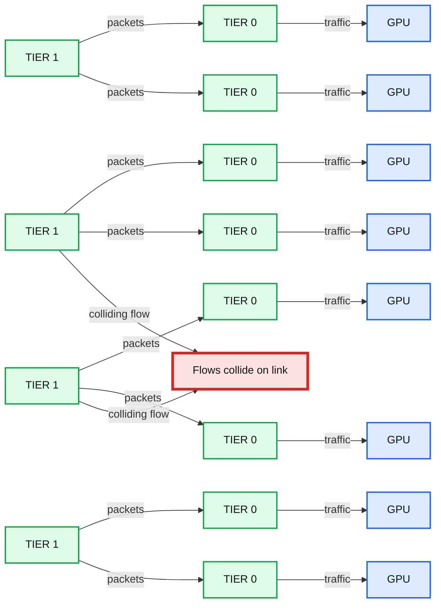
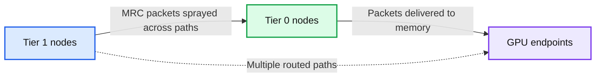
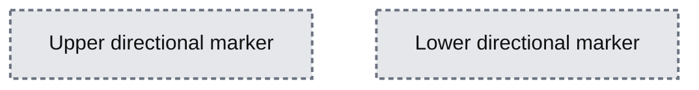

```mermaid
%% Shows throughput and loss rate responding to switch failure and recovery
flowchart LR
    A[Throughput] -->|temporary reduction| B[Switch failed]
    B -->|recovery begins| C[Switch rebooted]
    C -->|stable operation| D[Switch up]
    B -->|temporary increase| E[Loss rate]
    D -->|low loss| E

    classDef client fill:#dbeafe,stroke:#2563eb,stroke-width:2px,color:#111
    classDef service fill:#dcfce7,stroke:#16a34a,stroke-width:2px,color:#111
    classDef store fill:#ede9fe,stroke:#7c3aed,stroke-width:2px,color:#111
    classDef cache fill:#fef3c7,stroke:#d97706,stroke-width:2px,color:#111
    classDef queue fill:#cffafe,stroke:#0891b2,stroke-width:2px,color:#111
    classDef critical fill:#fee2e2,stroke:#dc2626,stroke-width:4px,color:#111
    classDef external fill:#e5e7eb,stroke:#6b7280,stroke-width:2px,color:#111,stroke-dasharray:4 3
    classDef decision fill:#fce7f3,stroke:#db2777,stroke-width:2px,color:#111

    class A,E service
    class B critical
    class C,D decision
```

# Unlocking large scale AI training networks with MRC (Multipath Reliable Connection)

*OpenAI introduces MRC (Multipath Reliable Connection), a new supercomputer networking protocol released via OCP to improve resilience and performance in large-scale AI training clusters.*

- Source: https://openai.com/index/mrc-supercomputer-networking/
- Published: 2026-05-05
- Authors: unknown
- Categories: Engineering
- Diagrams: 11 candidates, 6 extracted as architecture

Frontier model training depends on reliable supercomputer networks that can quickly move data between GPUs. To make this faster and more efficient, OpenAI has partnered with AMD, Broadcom, Intel, Microsoft, and NVIDIA to develop MRC (Multipath Reliable Connection): a novel protocol that improves GPU networking performance and resilience in large training clusters. We [released MRC today](https://www.opencompute.org/documents/ocp-mrc-1-0-pdf) through the Open Compute Project (OCP) to enable the broader industry to use it. 

With more than 900M people using ChatGPT every week, our systems are becoming core infrastructure for AI, helping people and businesses around the world build with increasingly capable models. Prior to the inception of[Stargate](https://openai.com/index/building-the-compute-infrastructure-for-the-intelligence-age/), we co-developed, brought up, and maintained our first three generations of supercomputers with great care and close collaboration with our partners over the span of a few years. This invaluable experience informed our strong belief that, to efficiently use compute at the scale of Stargate and succeed in our mission, we need to rethink and drastically reduce complexity in every layer of the stack – including network design. 

Publishing the MRC specification is part of OpenAI’s overall compute strategy: shared standards in key infrastructure layers can help scale AI systems more efficiently, reliably, and across a broader partner ecosystem. In this post, we’ll cover the design of MRC, including: i) how it enables us to build multi-plane high-speed networks to create redundancy to ride out network failures, while using fewer components and less power ii) how MRC’s adaptive packet spraying virtually eliminates core congestion and iii) how our deployments use static source routing to bypass failures and eliminate whole classes of routing failure. In concert, these benefits allow us to deliver better models to everyone faster.

## Why networks needed a new design

When training large AI models, a single step can involve many millions of data transfers. One transfer arriving late can ripple through the entire job, potentially causing GPUs to sit idle. Network congestion, link, and device failures are the most common sources of delay and jitter in transfers.

These problems get more frequent, and harder to solve, as the size of the cluster increases. This makes networking technology a key part of the design of Stargate. 

To enable the current scale of Stargate supercomputers, we faced two key networking challenges. First, whenever possible, we should minimize the possibility of network congestion. There are unavoidable bottlenecks, such as two GPUs sending to the same destination at the same time. But outside of these cases, we should avoid congestion through design. 

Second, we need to minimize the effect of network failures on the training job itself. At large enough scale, even the best network will have a constant background level of link and switch failures. Previously, a single failure would often cause a training job to crash, forcing a restart from a saved checkpoint, or stall progress for many seconds while the network recomputed routes. Such interruptions are costly in both GPU cycles and time. With synchronous pretraining – where many GPUs across many computers cooperate in lockstep to train one AI model – this is especially true. The larger the job we run, the greater the impact of any single link flap or failure. These workloads act as a form of “failure amplifier,” so preventing this has become critical. 

## Our answer: MRC

Our goal was not just to build a fast network, but also to build one that delivers very predictable performance, even in the presence of failures, to keep training jobs moving. 

To achieve this reliability, our Scaling team worked with [AMD](https://www.amd.com/en/blogs/2026/amd-advances-ai-networking-at-scale-with-mrc.html), [Broadcom](https://www.broadcom.com/blog/enabling-ai-networking-scale-with-multi-path-reliable-connections-mrc-), Intel, [Microsoft](https://aka.ms/BuildingResilientNetworksForAISupercomputers), and [NVIDIA](https://blogs.nvidia.com/blog/spectrum-x-ethernet-mrc/) over the past two years to develop a new way to build and operate our networks. The result of this effort is a technique we call [Multipath Reliable Connection, or MRC](https://cdn.openai.com/pdf/resilient-ai-supercomputer-networking-using-mrc-and-srv6.pdf). It’s a new network protocol built into the latest 800Gb/s network interfaces that lets us spread a single transfer across hundreds of paths, route around failures in microseconds, and run simpler network control planes. 

MRC extends RDMA over Converged Ethernet (RoCE) – an InfiniBand Trade Association (IBTA) standard that enables hardware-accelerated remote direct memory access among GPUs and CPUs. It draws on techniques developed by the Ultra Ethernet Consortium (UEC) and extends them with SRv6-based source routing to support large-scale AI networking fabrics.

MRC is already deployed across all of OpenAI’s largest NVIDIA GB200 supercomputers that we use to train frontier models, including our site with Oracle Cloud Infrastructure (OCI) in Abilene, Texas, and in Microsoft’s Fairwater supercomputers. MRC has been used to train multiple OpenAI models, leveraging hardware from NVIDIA and Broadcom. Today, the MRC specification is available as an Open Compute Project (OCP) contribution for the community to use and build on. We co-authored a paper detailing our experiences, [*“Resilient AI Supercomputer Networking using MRC and SRv6”*](https://cdn.openai.com/pdf/resilient-ai-supercomputer-networking-using-mrc-and-srv6.pdf).

## The foundation: Multi-plane networks

Building highly resilient networks requires that we start with a network topology that has enough natural redundancy that all flows can get good performance, even when links or switches in the network have failed. 

Instead of treating each network interface as one 800Gb/s link, we split it into multiple smaller links. For example, one interface can connect to eight different switches. You can then build eight separate parallel networks, or planes, each operating at 100Gb/s, rather than a single 800Gb/s network. 

That change has a large effect on the shape of the cluster. A switch that can connect 64 ports at 800Gb/s can instead connect 512 ports at 100Gb/s. This lets you build a network fully connecting about 131,000 GPUs with only two tiers of switches. A conventional 800Gb/s network would require three or four tiers.

*MRC’s support for multi-plane networks means we can connect over a hundred thousand GPUs with only two tiers of switches. This reduces the power required, the number of components that can fail, and the total cost of the network compared to conventional approaches.*

**Summary:** The diagram shows a two-tier, eight-plane network connecting Tier 1 switches to Tier 0 switches and groups of 256 GPUs.

**Components:**

- Tier 1 switches
- Tier 0 switches
- Eight network planes
- GPU groups with 256 GPUs
- GPU endpoints

**Flows:**

- Tier 1 switches -> Tier 0 switches: Multi-plane network connections
- Tier 0 switches -> GPU groups: GPU connectivity
- GPU groups -> GPU endpoints: GPU access

**Numbers:** 1, 0, 256, 8, 512

source image: https://images.ctfassets.net/kftzwdyauwt9/hMXzAlcJ2ZoyVk4XhCqZc/f0f074764da3f50d60f8a9e030bf0c29/Diagram_1_-_desktop_-_light.svg

*MRC’s support for multi-plane networks means we can connect over a hundred thousand GPUs with only two tiers of switches. This reduces the power required, the number of components that can fail, and the total cost of the network compared to conventional approaches.*

The result is a network that is lower cost, has lower power consumption, and gives us more path-diversity than a conventional network design. It also allows more traffic to stay local to Tier 0 switches, which can improve performance.

However, all that path diversity can be difficult to fully utilize. Traditional network protocols used for AI training typically require each transfer to follow a single path so packets arrive in order. In a large multi-plane network, that creates two problems: different flows can collide on the same link and create congestion, and each flow can use only one of the available planes. If we changed nothing else, a multi-plane network would result in significant congestion and poor overall performance.

*With single-path flows, like in a classic RoCE deployment, individual links frequently become congested. Because collective communications are sensitive to the worst-case latency, this is especially disruptive to AI training workloads. Flows of packets collide causing congestion. Animation by Mark Handley.*

**Summary:** The diagram shows single-path flows traveling from Tier 1 network nodes to Tier 0 nodes and GPUs, with multiple flows colliding on a link and causing congestion.

**Components:**

- Four Tier 1 network nodes
- Eight Tier 0 network nodes
- GPU endpoints beneath the Tier 0 nodes
- Congested link collision point

**Flows:**

- Tier 1 -> Tier 0: Single-path packet flows
- Tier 0 -> GPU: Network traffic to GPU endpoints
- Multiple flows -> Congested link collision point: Flows collide and cause congestion

**Numbers:** 1, 0

source image: https://images.ctfassets.net/kftzwdyauwt9/2Amv4FWRbv6EAI4PqTtUd6/ea33aef009c0b317bf8cd9eeebb3622a/Diagram_2_-_desktop_-_light.svg

*With single-path flows, like in a classic RoCE deployment, individual links frequently become congested. Because collective communications are sensitive to the worst-case latency, this is especially disruptive to AI training workloads. *

**Summary:** Packet flows collide, causing congestion.

**Components:**

- Packet flows

- Congestion

**Flows:**

- Packet flows -> Congestion: collide causing

**Numbers:** none

source: interactive diagram 1 on the post page

## MRC’s shift: Spraying packets across hundreds of paths

MRC fundamentally changes this model. Instead of assigning a transfer to one path, MRC takes the packets from a single transfer and sprays them across hundreds of paths through our network, across all of the distinct planes. Packets can arrive out of order, but all MRC packets include their final memory address so the destination can deliver them to memory as they arrive.

*MRC spreads packets across many paths at once, reducing congestion that can slow synchronous AI training.By spreading traffic across many paths, MRC avoids hot-spots in the network, preventing some transactions from taking much longer than others. This prevents slowdowns that would impact synchronous AI training.Packet spraying across multiple paths. Animation by Mark Handley.*

**Summary:** The diagram shows MRC packet spraying between four Tier 1 nodes and eight Tier 0 nodes connected to GPUs across multiple paths.

**Components:**

- Tier 1 nodes: upper-level network nodes used by MRC.
- Tier 0 nodes: lower-level network nodes used by MRC.
- GPU endpoints: memory destinations attached to Tier 0 nodes.

**Flows:**

- Tier 1 nodes -> Tier 0 nodes: MRC packets sprayed across multiple network paths.
- Tier 0 nodes -> GPU endpoints: packets delivered to GPU memory.
- Tier 1 nodes -> GPU endpoints: dashed multistage paths through Tier 0 nodes.

**Numbers:** 0, 1, 4 Tier 1 nodes, 8 Tier 0 nodes, 8 GPU endpoints.

source image: https://images.ctfassets.net/kftzwdyauwt9/6o8SiUEq5zJnWw7qDwJ5ur/e92de63c6f6fa65555275b6ef48997b9/Diagram_3_-_desktop_-_light.svg

*MRC spreads packets across many paths at once, reducing congestion that can slow synchronous AI training.*

*By spreading traffic across many paths, MRC avoids hot-spots in the network, preventing some transactions from taking much longer than others. This prevents slowdowns that would impact synchronous AI training.*

Each MRC connection keeps a small amount of state for the many paths it uses. If it detects that a path is becoming congested, it swaps that path for another one, evening out load across the network. If it loses a packet, it takes the safe option: it assumes something on that path may have failed and immediately stops using it, retransmitting any packets that may have been lost. After MRC retires a path, it sends probe packets to check whether there really was a failure, and if so, whether it has recovered.

Failures aren’t the only cause of packet loss though; another common source of loss is congestion at the destination. MRC handles this through packet trimming. If a switch would otherwise drop a packet due to congestion, it trims off the payload and forwards only the header to the destination, triggering an explicit retransmission request. Packet trimming reduces false positives where we incorrectly assume a loss means a path has failed. 

This combination of multi-plane topology, spraying, load-balancing, and trimming means that an MRC connection can detect network failures and route around them on a microsecond timescale, minimizing the impact on synchronous training jobs. In contrast, a conventional network fabric could take seconds or even tens of seconds to stabilize and route around failures. 

## Replacing dynamic routing with source routing

MRC allows us to go one step further in simplifying our networks. 

Traditionally, switches run a dynamic routing protocol such as BGP (Border Gateway Protocol) to compute available paths and route around failures. But switches are complex devices running complex software. When they fail in subtle ways, those problems can be hard to diagnose and can cause connection failures until fixed.

With MRC, dynamic routing became less necessary. If packets are lost on a path, MRC stops using that path. We took the more radical approach of disabling dynamic routing and using IPv6 Segment Routing (or SRv6), instead. SRv6 lets the sender directly specify the path each packet should take through the network. It does this by embedding the sequence of switch identifiers into each packet’s destination address.

*SRv6 allows the sender to encode the full path each packet should take to the network. Because this is deterministic, the sender can independently react to congestion or loss on a given path.*

**Summary:** The image shows two unlabeled gray directional markers, one pointing upward and one pointing downward.

**Components:**

- Unlabeled upper directional marker
- Unlabeled lower directional marker

**Flows:**

- none

**Numbers:** none

source image: https://images.ctfassets.net/kftzwdyauwt9/1f8McRrpdgN3uVXEYpGDiM/561c3b78269c13e27b7812c5ccf34922/Diagram_4_-_desktop_-_light.svg

*SRv6 allows the sender to encode the full path each packet should take to the network. Because this is deterministic, the sender can independently react to congestion or loss on a given path. *

Breaking this down: When forwarding, a switch checks if its own identifier is present. If it is, it removes the identifier by shifting the destination address so that the next switch’s identifier is revealed. The switch then looks this identifier up in a static routing table, which determines where to send the packet next. Unlike with dynamic routing, this static routing table is configured when the switch is first configured and never changed thereafter. 

MRC uses SRv6 to spray packets across all network planes, as well as many paths on each plane simultaneously. If a path fails, MRC simply stops using it. The switches don’t need to recompute routes or do anything other than blindly follow the static routes they were configured with.

## Stargate supercomputer built by Oracle Cloud Infrastructure (OCI) in Abilene, Texas

## What this looks like in production

Our training networks have millions of links. While these networks are of high quality, at sufficient scale some link flaps are inevitable. During training, we have observed cases of multiple link flaps each minute between tier-0 and tier-1 switches, but MRC ensured that they had no measurable impact on our synchronous pretraining jobs. In fact, their impact was small enough that we did not even need to prioritize the immediate repair of those links.

It’s not just links that can fail. During training of a recent frontier model for ChatGPT and Codex, we had to reboot four tier-1 switches. Previously, rebooting a switch would have required the operations team to be very careful not to disrupt training. With MRC, we didn’t even need to coordinate with the teams running training jobs in the cluster. The same is true for many link repairs. We used to coordinate with operations teams to disable a link when maintenance work needed to happen. Now we can repair links while they are still in service. If a link is working well enough, MRC will use it. If not, MRC avoids it until it is fixed.

*Real data captured during a training run showing MRC reacting to the complete loss of a T1 switch. The training job experienced a temporary slowdown, but recovered quickly.*

**Summary:** Time-series chart showing throughput and loss rate during a switch failure, reboot, and recovery.

**Components:**

- Throughput metric
- Loss rate metric
- Switch failed event
- Switch rebooted event
- Switch up event

**Flows:**

- Switch failed -> Throughput: temporary reduction
- Switch failed -> Loss rate: temporary increase
- Switch rebooted -> Throughput: recovery
- Switch up -> Throughput: stable operation
- Switch up -> Loss rate: low loss

**Numbers:** none

source image: https://images.ctfassets.net/kftzwdyauwt9/rXJCOvyQlsY8yFyXdl9Li/6353f2f9a9d41bbbac7d965f49d42db3/Diagram_5_-_desktop_-_light.svg

*Real data captured during a training run showing MRC reacting to the complete loss of a T1 switch. The training job experienced a temporary slowdown, but recovered quickly.*

Before MRC, if a link between a GPU’s network interface and a tier-0 switch failed, the training job would fail. With MRC, the job survives with reasonable performance. If an 8-port network interface loses one port, the maximum rate is reduced by one eighth. MRC detects this, recalculates paths to avoid the failed plane, and immediately tells peers not to use that plane for inbound traffic. Most failed links recover within a minute, at which point MRC brings the plane back into use.

The slowdown, caused by losing a GPU interface link, has differed across training jobs, but in practice, tends to be significantly less than the amount of physical capacity lost.

## Key improvements

MRC ultimately delivers us three critical advantages when scaling our supercomputers.

First, it lets us build multi-plane high-speed networks for supercomputers with over 100,000 GPUs using only two tiers of Ethernet switches. This gives us enough redundancy to ride out network failures, while using less power than equivalent three- or four-tier single-plane networks.

Second, MRC’s adaptive packet spraying load-balances well enough that we see essentially no congestion in the core of the network. This greatly reduces variation in throughput between flows during synchronous training, where eliminating outliers is central to performance. It also means that when multiple jobs share the cluster, they do not impact one another’s performance. 

Last, MRC uses SRv6 source routing to bypass failures quickly and send packets only over working paths. This lets us run a simple static network control plane and eliminate whole classes of dynamic routing failure behavior.

## Opening the protocol

MRC has markedly advanced our ability to train new frontier models and ensure our networks keep pace with our researchers’ ambitious AI roadmap. It delivers a significant improvement over previous approaches and helps accelerate our goal of bringing the benefits of AGI to everyone, reliably. We’re proud of the cross-industry collaboration that made it possible. 

As training clusters continue to grow, network design increasingly determines how much of the available compute can actually be used. MRC helps us keep GPUs moving together through congestion, link failures, and maintenance events that would previously have disrupted training. At meaningful scale, that reliability and efficiency is not a nice-to-have; it is part of what makes synchronous frontier model training possible.

**Acknowledgements**

Cross-industry collaboration will continue to be essential to solving many of AI’s hardest problems. We’re grateful for our partnership with AMD, Broadcom, Intel, Microsoft, and NVIDIA to develop MRC, and to Microsoft Azure, OCI, NVIDIA, and Arista in working with us to deploy it at scale.  We all share a common commitment to advancing the ecosystem and are excited to see where the industry takes MRC in the future.
