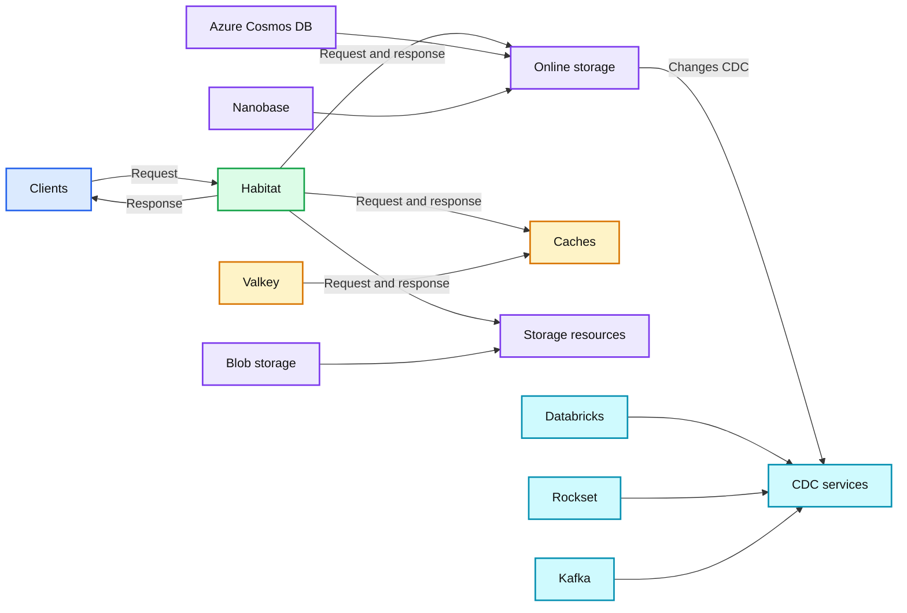
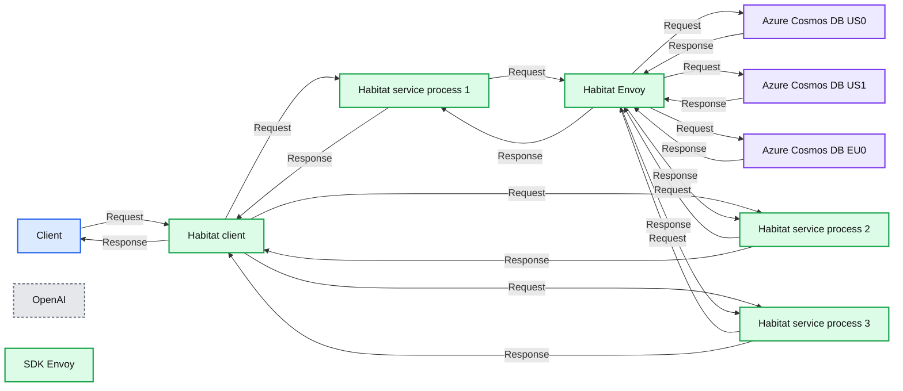
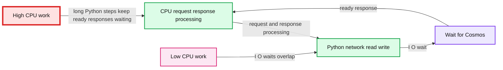
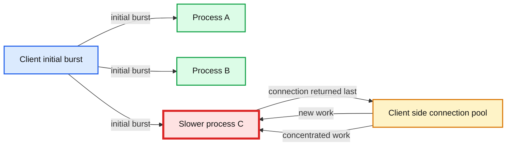
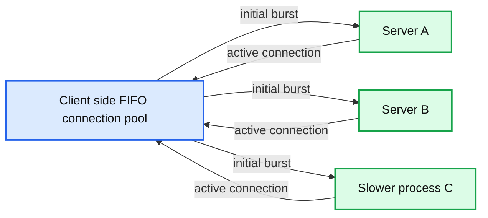

# Rapidly scaling online storage to serve over 1 billion ChatGPT users

*Learn how OpenAI evolved Habitat from a Python library into a globally distributed storage platform serving 1 billion ChatGPT users and 22M requests per second.*

- Source: https://openai.com/index/scaling-storage-one-billion-users-part-one/
- Published: 2026-09-11
- Authors: Jon Lee, Chaomin Yu, Ben Ries
- Categories: Engineering
- Diagrams: 6 candidates, 6 extracted as architecture

Every OpenAI product depends on fast, reliable access to data, whether someone is logging in, checking their Codex settings, or starting a new conversation in ChatGPT. Each of those actions may require many separate data lookups before the product can respond. If those requests are slow, the product feels slow. If those requests fail, the product stops working entirely.

Habitat is the online storage platform we built so OpenAI products can quickly and reliably access needed information. Habitat now handles more than 70 million requests every second, supporting products used by over 1 billion people each week, across almost 40 geographic regions. Habitat first launched to support GPTs at DevDay 2023, starting as a simple Python client-side library connected to a single database. Today, it’s a complex distributed system that serves more than 500 petabytes of data.

**Summary:** Habitat connects clients to online storage and caching resources, while CDC services distribute changes to downstream systems.

**Components:**

- Clients: ChatGPT, API, Codex, internal services, and more
- Habitat: caching, authorization, data residency, data security, multi-tenancy, request shaping, and schema lookup
- Online storage: Azure Cosmos DB and Nanobase
- Caches: Valkey
- Storage resources: Blob storage
- CDC services: Databricks, Rockset, Kafka, and more

**Flows:**

- Clients -> Habitat: Request
- Habitat -> Clients: Response
- Habitat -> Online storage: Request and response
- Habitat -> Caches: Request and response
- Habitat -> Storage resources: Request and response
- Online storage -> CDC services: Changes CDC

**Numbers:** none

source: interactive diagram 1 on the post page

Building and operating infrastructure at this scale is no easy feat, but also not particularly challenging. What made our situation unique is the unprecedented rate at which we’ve had to scale to support staggering user growth and product demand while simultaneously building out a mature platform. Often, system engineers build for 10x scale, and hope for it to hold for a few years while preparing for the next 10x. In our case, we've grown more than 10x year-over-year for the last three years. As a result, building and operating Habitat has been a series of tactical decisions and sequencing: understanding each component at the lowest level to squeeze as much juice out of our existing stack, while fending off storage and compute capacity crunches to buy time for foundational investments.

- 70M+

requests per second

- 1B+

people each week

- 500 PB+

data

As OpenAI grew, Habitat had to grow with it: first by becoming reliable enough for mission-critical product traffic, then fast enough for global users, and finally, to deftly operate at massive scale. This post is the first in a two-part series on how we scaled online storage. In this post, we’ll share how Habitat evolved, why we turned it from a library into a service, and how we stretched a service written in an uncommon serving stack language—Python—into a reliable storage platform layer.

In a future post, we’ll go into detail about how we made multi-tenancy reliability at scale, our layered strategy for optimizing read performance, and how we scaled our partnership with Azure Cosmos DB to reliably handle unprecedented demand.

## What is Habitat?

Habitat started from a simple idea: product engineers shouldn’t need to think about database management. Habitat first launched to support GPTs at DevDay 2023 as a small Python library that interacted with ChatGPT’s main server. It supported a small set of operations that mapped under the hood to the database application, Azure Cosmos DB.

The library’s job was to give product teams a simple way to store and retrieve data without needing to master the underlying details. Habitat took care of the necessary work: figuring out what kind of data was involved, where it should come from (or go), whether the request was allowed, and so on.

Product engineers need not concern themselves with schema lookup, routing, authorization, encryption, serialization, request shaping, and connection pooling. They didn’t even need to consider where the data comes from: Azure Cosmos DB, caches, or other types of storage.

**Summary:** Habitat routes client requests through an Envoy and service processes to Azure Cosmos DB regions, returning responses through the same path.

**Components:**

- Client using Habitat client
- OpenAI application
- Habitat client SDK
- Envoy proxy
- Habitat service process 1
- Habitat service process 2
- Habitat service process 3
- Habitat Envoy
- Azure Cosmos DB US0
- Azure Cosmos DB US1
- Azure Cosmos DB EU0

**Flows:**

- Client -> Habitat client: Request
- Habitat client -> Habitat service process 1: Request
- Habitat client -> Habitat service process 2: Request
- Habitat client -> Habitat service process 3: Request
- Habitat service processes -> Habitat Envoy: Request
- Habitat Envoy -> Azure Cosmos DB US0: Request
- Habitat Envoy -> Azure Cosmos DB US1: Request
- Habitat Envoy -> Azure Cosmos DB EU0: Request
- Azure Cosmos DB US0 -> Habitat Envoy: Response
- Azure Cosmos DB US1 -> Habitat Envoy: Response
- Azure Cosmos DB EU0 -> Habitat Envoy: Response
- Habitat Envoy -> Habitat service processes: Response
- Habitat service processes -> Habitat client: Response
- Habitat client -> Client: Response

**Numbers:** 1, 2, 3, US0, US1, EU0

source: interactive diagram 2 on the post page

This Python library worked well and Habitat saw rapid adoption among product engineers at OpenAI, despite no concerted central push away from using self-serve Postgres and Azure Cosmos DB.

As product needs evolved, it was even easy for product developers to add to the shared library support for features like client-side caching, compression, or encryption.

## Build a service to better support multiple, complex products

By the middle of 2025, Habitat had reached its limits as a client-side implementation. As the Habitat layer had grown more complex and OpenAI’s services count increased, backward-compatible protocol changes had become infeasible.

In one instance, we wanted to reduce the blast radius of any single region outage for our most critical data sets by migrating them to a set of regionally distributed Azure Cosmos DB accounts. Making this change required introducing extra routing logic into the client, disabled behind a feature flag, ensuring it rolled out to all clients, and then enabling the feature flag.

Coordinating deployments across dozens of services and working with each team to roll it out took days. Before enabling this, we realized we wanted to introduce some shadowing to ensure the sharding logic would be correct. That took another couple of days to roll out. A bug fix for something we realized was incorrect? Another couple of days. Eventually, we were ready to enable the flag, only for one of the teams to roll back their service for unrelated reasons to a previously buggy client, causing the outage we had worked so hard to avoid.

Changes to the client library necessitated complex coordination across dozens of services, a process that proved increasingly brittle, inefficient, and susceptible to operational failures. To reduce this operational fan out for our future deployments, we decided to pull Habitat into its own service.

By decoupling the storage logic into a standalone service, we established a single point of control for deployments, observability, and platform enhancements. Instead of managing fragmented updates, we could implement improvements centrally, providing immediate benefits to every OpenAI product.

A centralized service also gives us a single chokepoint to provide the strongest data security and privacy primitives. Habitat service is where we can centrally enforce access control policies, perform audit logging, and limit access to underlying storage resources like Azure Cosmos DB. Habitat plays a critical role in protecting user data and preventing unauthorized access from external, internal, and agent actors.

## Launching a Python service at scale

We knew we needed a service, but we didn’t want to migrate off Python quite yet, even with Python’s additional overhead as a service. Using Python for a high-throughput service increased network latency and added substantial CPU and memory scaling costs compared to local library execution. Moreover, we recognized that the inefficiencies of Python would not be acceptable at 100x scale, making an eventual rewrite almost certain.

However, we viewed this as a strategic incursion of technical debt. Our primary objective then was not cost or resource optimization, but rather unblocking product developers and achieving platform stability. By accepting the performance trade-offs of a Python service in the short term, we were able to prioritize more immediate challenges, establish our core APIs, and build out a robust infrastructure.

We also made a calculated wager that the rapid advancement of our own coding models would simplify the technical path in the future. We bet that by the time a full migration off Python was required, Codex and GPT would make that migration achievable. That bet eventually proved correct.

Running Habitat as a Python service would be suboptimal, performance-wise, but a necessary choice. Python lets us move quickly, but it doesn’t mean we could throw caution to the wind and accept meaningfully worse latencies. When the average user request results in hundreds of database calls, the slowest database call is the one the user feels. We’ve found the main challenge in running a Python service at this scale is in managing these tail latencies.

### Tracking the asyncio delay

Asyncio helps Python execute I/O-bound workloads concurrently, but does not help work around the Python GIL and provide CPU parallelism. In addition to I/O-heavy request proxying, Habitat handles many CPU-heavy responsibilities and background tasks: routing, compression, encryption, checksumming, downstream health checking, request shadowing, and hedging.

With so many CPU-heavy workloads and background tasks in our service, asyncio scheduling delay can easily dominate tail request latency. Before tuning for our initial service launch, we saw in traces for requests with p99 and higher latency that while downstream storage responded quickly, requests frequently stalled while waiting for the responsible coroutine to be rescheduled to parse the response.

**Summary:** The diagram shows how Python asyncio concurrency and CPU-heavy work affect request latency while waiting for Cosmos.

**Components:**

- CPU request/response processing - Python asyncio CPU thread
- Python network read/write - Python asyncio networking
- Wait for Cosmos - Cosmos storage wait
- Low CPU work - Brief Python steps with overlapping I/O waits
- High CPU work - Long Python steps that keep ready responses waiting

**Flows:**

- CPU request/response processing -> Python network read/write: request and response processing
- Python network read/write -> Wait for Cosmos: I/O wait
- Wait for Cosmos -> CPU request/response processing: ready response
- Low CPU work -> Python network read/write: I/O waits overlap
- High CPU work -> CPU request/response processing: long Python steps keep ready responses waiting

**Numbers:** 03, 0.0, 40

source: interactive diagram 3 on the post page

For Python services at OpenAI, we find that in addition to measuring standard utilization and saturation metrics on memory, CPU, network, and disk usage, it is critical to also monitor the asyncio loop and how busy it is, then tune accordingly.

By periodically scheduling background tasks and recording the delta between expected and actual execution time, we are able to empirically measure event loop scheduling delay in real time. At high utilization, with many expensive tasks, even modest numbers of concurrent requests per process are enough to produce significant scheduling jitter, up to hundreds of milliseconds and in some edge cases several seconds.

As a result, we resort to keeping each process serving only a small number of concurrent requests and instead massively scale out the number of Python worker processes.

### Reducing a tail latency in our feature flag configurations

In our initial service launch, we discovered through live service CPU profiling one root cause of high asyncio delay (and resulting high tail latencies): periodic JSON parsing of our feature flag configurations via Statsig (a tool that manages feature flags, and can be used to run A/B tests and more).

By default, Statsig was configured to poll for refreshed configs every minute with no jitter, and the config included every production rule across every service. Elsewhere, an architectural decision was made to run up to 8 Python processes per pod to push higher CPU usage and provide lower latencies. Combined, this meant that every minute each pod would have some moment where all of its workers stalled processing in-flight requests and instead would spend their CPU cycles parsing a giant configuration file.

The fix was straightforward once CPU profiling helped us root cause the issue: deploy a smaller targeted config, lengthen the refresh interval, and add some jitter to background tasks like these.

### Balancing loads and managing connection pools

In order to maintain low asyncio delay, it is also critical to maintain good load balancing of requests across server processes; connection pooling can end up being antithetical to this without tuning as well.

With client-side connection pooling, a single client process that does many concurrent requests might establish only a handful of server connections and as a result send all of its load to only a handful of processes. Prior to adjusting how we do load balancing, our service had a wide variance of utilization with some tail processes serving 5-10x the number of concurrent requests as the average.

We discovered this in a chance incident where, despite stopping the client that was overloading part of our service, a subset of processes remained degraded well past the bursty traffic. In fact, we noticed those processes experienced runaway degradation, receiving increasingly more requests until we restarted them. Once a pod became overloaded, some behavior was pinning more traffic onto the overloaded pod. This was a class of failures some of our teammates were well-acquainted with from prior work: [metastable failure](https://engineering.fb.com/2014/11/14/production-engineering/solving-the-mystery-of-link-imbalance-a-metastable-failure-state-at-scale/).

We suspected the connection pool was to blame and tested this suspicion by capping max connection reuse duration, which indeed limited the degradation and confirmed our investigation direction. Further investigation found that Python’s aiohttp TCPConnector defaults to LIFO connection reuse: the most recently returned connection is selected for the next request. This is normally a reasonable default: reusing recent connections allows the extra connections created to handle bursty traffic to idle timeout, reducing overhead to maintaining extra connections. In this case, it created a metastable failure for us. During a burst of requests, requests to slower overloaded servers returned connections to the pool later and were therefore selected more frequently by subsequent requests, gradually concentrating more traffic on the pods already struggling. Patching the connection pool to use FIFO reuse broke this feedback loop and even reduced our steady state request variance as well.

**Summary:** The diagram shows how LIFO client-side connection pooling concentrates new work on a slower process after an initial request burst.

**Components:**

- Client issuing an initial burst
- Process A
- Process B
- Slower process C
- Client-side connection pool using LIFO reuse

**Flows:**

- Client -> Process A: initial burst
- Client -> Process B: initial burst
- Client -> Slower process C: initial burst
- Slower process C -> Client-side connection pool: connection returned last
- Client-side connection pool -> Slower process C: new work
- Client-side connection pool -> Slower process C: concentrated work

**Numbers:** none

source: interactive diagram 4 on the post page

**Summary:** FIFO client-side connection pooling distributes an initial burst fairly across servers A, B, and slower process C while avoiding a connection-reuse feedback loop.

**Components:**

- Client-side connection pool using FIFO reuse
- Server A
- Server B
- Slower process C

**Flows:**

- Client-side connection pool -> Server A: initial burst
- Client-side connection pool -> Server B: initial burst
- Client-side connection pool -> Slower process C: initial burst
- Server A -> Client-side connection pool: active connection
- Server B -> Client-side connection pool: active connection
- Slower process C -> Client-side connection pool: active connection

**Numbers:** 04B

source: interactive diagram 5 on the post page

Today, we mostly depend on Istio and Envoy to provide connection pooling and better server-load-aware balancing strategies throughout OpenAI infrastructure and avoid this problem altogether.

### Avoiding flooding downstream resources

One side effect of tuning for low asyncio delay and having so many Python processes is that it becomes very easy to overwhelm downstream dependencies with the vast number of connections (known as a “thundering herd”).

A regular daily deployment—if not tuned to be slow—can cause significant CPU churn from connection cycling. Or a connection leak can take out the network by saturating the NAT gateway. These are not uncommon problems for other services too, but the threshold for triggering is lowered significantly by having an order of magnitude more processes, often saturating network related resources that clients are not expecting to need to handle in a steady state based on pure throughput alone.

We also rely on Envoy to maximize our connection fan-in. We use it to upgrade Python’s HTTP/1 connections to HTTP/2 to take advantage of multiplexing and then to pool those connections and extend connection lifetimes. Envoy also gives us a central place to implement rate limits and circuit breakers that would be less effective in each standalone Python process.

**Summary:** Shows how connection pooling and HTTP/2 multiplexing serve the same requests with fewer downstream connections.

**Components:**

- Request - HTTP request
- Response - HTTP response
- Idle keep-alive - pooled persistent connection

**Flows:**

- Request -> Response: request receives response
- Response -> Idle keep-alive: connection remains available

**Numbers:** none

source: interactive diagram 6 on the post page

## Why Habitat does less

One reason we could scale Python this far was Habitat’s constrained API, which keeps request cost predictable. Rather than allowing clients to construct arbitrary SQL queries that could result in large table scans or joins across many tables, Habitat exposes a simple NoSQL API. The lack of a powerful API is an explicit tradeoff in Habitat’s design.

We aim to optimize for simple, predictable, constant-work requests. In our experience, these systems are substantially easier to scale and difficult to get wrong or misuse. Requests with unpredictable fanout are operationally dangerous: they complicate isolation, load balancing, and introduce latency cliffs that are hard to scale for both the service and its clients.

Before we moved to Habitat and Azure Cosmos DB, most of OpenAI’s online data was stored on Postgres. At that time it was easy to review all query and schema changes to make sure they were well-behaved and operated against indexed data before shipping to production. As the team and products grew, this quickly became unmanageable and was a frequent cause of outages where a single expensive new query on a hot path took out the database.

The problem here is in cost imbalance: it is cheap and easy to write SQL queries that are expensive and hard to run. In Habitat, we avoid this and make expensive queries exceedingly obvious client-side. There are no unbounded queries that can overload Habitat and complex joins and graph traversals require product teams to do some of the heavy-lifting which helps overall optimize for more efficient designs.

Habitat exposes a NoSQL API modeled around client-defined object and edge types, inspired by [TAO](https://www.usenix.org/system/files/conference/atc13/atc13-bronson.pdf). Clients predefine objects and edges and how they relate to each other, but not the content of each type. The resulting relationships resemble a graph, but Habitat itself does not support typical graph traversal queries outside of querying direct edges of a particular object.

We partition this graph so that each object and its corresponding edges are colocated in a storage-level partition, but we make no concerted database-level effort to colocate objects and the remote objects to which their edges point. The result is that the model easily partitions for horizontal scalability, but graph traversals are inefficient since any particular hop between objects may require fetching from two entirely different Azure Cosmos DB accounts stored in different regions.

For clients with more complex querying needs, we do provide an offline secondary view of Habitat exposed via Rockset. We use change data capture (CDC) to stream changes from the online storage out to isolated Rockset instances in near-real-time. Each client team is responsible for scaling their own Rockset instance for their complex querying needs.

This Rockset provisioning introduces extra friction to our clients, but we think is the right tradeoff to make at this particular moment: making simple queries the default while providing an escape hatch for those who need complex queries. This design isolates our online storage from read-heavy analytical and search workloads.

## Migrate from Python to Rust

Deferring a Python rewrite for a year allowed us to focus on more urgent and impactful challenges during our hypergrowth. With the platform maturing and our growth continuing to accelerate, and being the second largest service by core count at OpenAI (and fourth for our Envoy footprint), it was finally time to move past Python. At its peak, Python helped us serve more than 20 million requests every second.

In Q2 2026, with just 2 engineers, Codex, and GPT‑5.5, we were able to rewrite the entire service in Rust. This new Rust service is now handling 95% of our production requests; we’ll be deprecating Python entirely in the coming weeks. Our data shows the Rust service is 6x more CPU efficient and 15x more memory efficient than the Python version, with significantly lower average and tail latencies. We plan to share more learnings in a future blog.

## Optimizing our database layer, Azure Cosmos DB

The Python—and now Rust—service is only one facet of Habitat. In part II of this series explaining how we rapidly scaled our online storage to serve over 1 billion ChatGPT users, we’ll talk about the storage layer and how Habitat serves more than 500 petabytes and over 70 million requests every second.

If you want to work on OLTP systems at frontier scale and are interested in this kind of engineering, [check out this open role on our team](https://openai.com/careers/software-engineer-habitat-(online-data)-seattle/).
