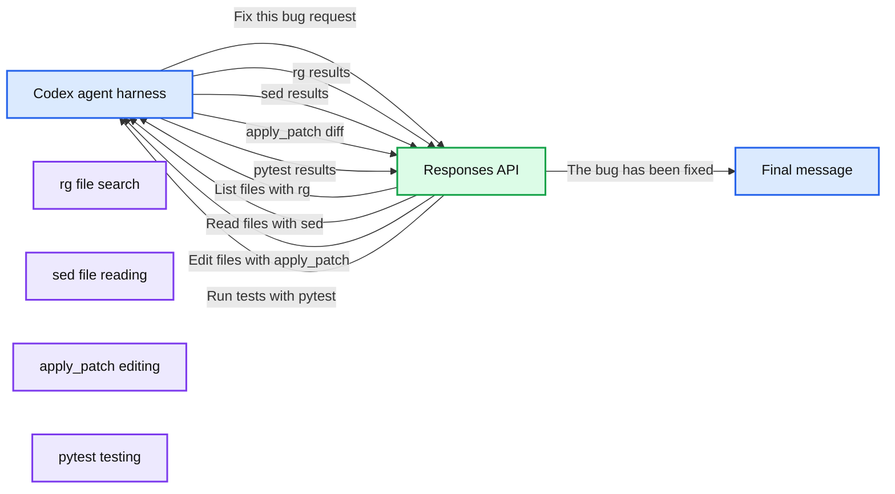
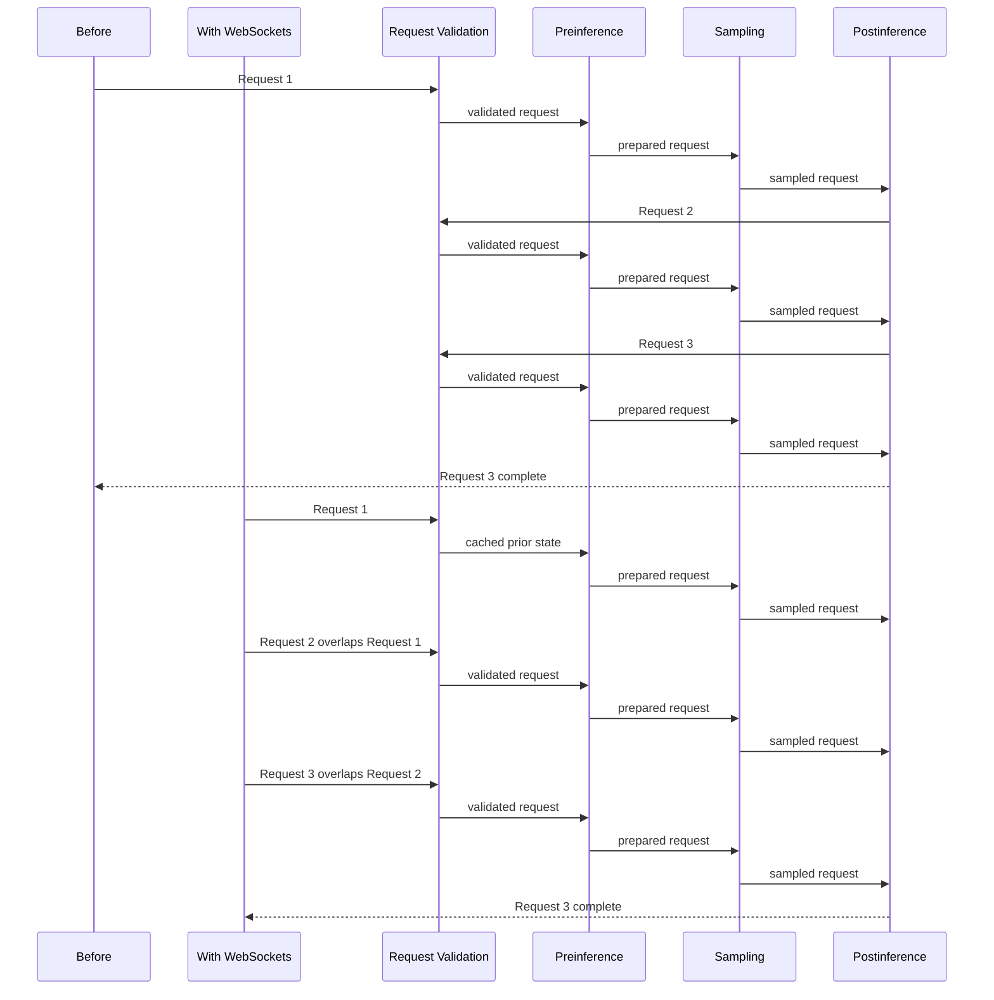

# Speeding up agentic workflows with WebSockets in the Responses API

*A deep dive into the Codex agent loop, showing how WebSockets and connection-scoped caching reduced API overhead and improved model latency.*

- Source: https://openai.com/index/speeding-up-agentic-workflows-with-websockets/
- Published: 2026-04-22
- Authors: Brian Yu, Ashwin Nathan Special thanks to the Responses API, Codex teams, who worked on creating WebSocket mode.
- Categories: Engineering
- Diagrams: 2 candidates, 2 extracted as architecture

When you ask Codex to fix a bug, it scans through your codebase for relevant files, reads them to build context, makes edits, and runs tests to verify the fix worked. Under the hood, that means dozens of back-and-forth Responses API requests: determine the model’s next action, run a tool on your computer, send the tool output back to the API, and repeat.

All of these requests can add up to minutes that users spend waiting for Codex to complete complex tasks. From a latency perspective, the Codex agent loop spends most of its time in three main stages: working in the API services (to validate and process requests), model inference, and client-side time (running tools and building model context). Inference is the stage where the model runs on GPUs to generate new tokens. In the past, running LLM inference on GPUs was the slowest part of the agentic loop, so API service overhead was easy to hide. As inference gets faster, the cumulative API overhead from an agentic rollout is much more notable.

In this post, we'll explain how we made agent loops using the API 40% faster end-to-end, letting users experience the jump in inference speed from 65 to nearly 1,000 tokens per second. We approached this through caching, eliminating unnecessary network hops, improving our safety stack to quickly flag issues, and—most importantly—building a way to create a persistent connection to the Responses API, instead of having to make a series of synchronous API calls.

**Summary:** The diagram shows Codex iteratively exchanging tool calls and results with the Responses API until producing a final message.

**Components:**

- Codex agent harness using local command execution
- Responses API using validation, rendering, and inference
- `rg` for listing files and searching
- `sed` for reading files
- `apply_patch` for editing files
- `pytest` for running tests
- Final message generation

**Flows:**

- Codex -> Responses API: Fix this bug request
- Responses API -> Codex: List files with rg
- Codex -> Responses API: rg results
- Responses API -> Codex: Read files with sed
- Codex -> Responses API: sed results
- Responses API -> Codex: Edit files with apply_patch
- Codex -> Responses API: apply_patch diff
- Responses API -> Codex: Run tests with pytest
- Codex -> Responses API: pytest results
- Responses API -> Codex: The bug has been fixed final message

**Numbers:** none

source image: https://images.ctfassets.net/kftzwdyauwt9/1God5X2eGKbrt1ZVXQD2GU/1644148d29b0154161d49dd4bedcba42/A_Codex_Agent_Loop_In_Practice.png

## When the API became the bottleneck

In the Responses API, previous flagship models like GPT‑5 and GPT‑5.2 ran at roughly 65 tokens per second (TPS). For the launch of GPT‑5.3‑Codex‑Spark, a fast coding model, our goal was an order of magnitude faster: over 1,000 TPS, enabled by specialized Cerebras hardware optimized for LLM inference. To make sure users could experience the true speed of this new model, we had to reduce API overhead. 

Around November of 2025, we launched a performance sprint on the Responses API, landing many optimizations to the critical-path latency for a single request: 

-

Caching rendered tokens and model configuration in memory to skip expensive tokenization and network calls for multi-turn responses

-

Reducing network hop latency by eliminating calls to intermediate services (for example, image processing resolution) and directly calling the inference service itself

-

Improving our safety stack so we could run certain classifiers to flag conversations faster

With these improvements, we saw close to a 45% improvement in time to first token (TTFT)—which reflects how responsive the API feels—but these improvements were still not fast enough for GPT‑5.3‑Codex‑Spark. Even with these improvements, Responses API overhead was too large relative to the speed of the model—that is, users had to wait for the CPUs running our API before they could use the GPUs serving the model.

The deeper issue was structural: we treated each Codex request as independent, processing conversation state and other reusable context in every follow-up request. Even when most of the conversation hadn't changed, we still paid for work tied to the full history. As conversations got longer, that repeated processing became more expensive.

## Building a persistent connection

To tighten up the design, we rethought the transport protocol: could we keep a persistent connection and cache state, rather than establishing a new connection over HTTP and sending the full conversation history for each follow-up request? The idea was to only send any new information requiring validation and processing and cache reusable state in memory for the lifetime of the connection. This would reduce overhead from redundant work.

We considered a few different approaches, including WebSockets and gRPC bidirectional streaming. We landed on WebSockets because as a simple message transport protocol, users wouldn't have to change their Responses API input and output shapes. It was developer-friendly and fit our existing architecture with little disruption.

The first WebSocket prototype changed what we thought was possible for Responses API latency. An engineer on the Codex team with deep expertise across the API stack pulled together a prototype by running a Codex agent overnight.

In that prototype, agentic rollouts were modeled as a single long-running Response. Using `asyncio` features, the Responses API would asynchronously block in the sampling loop after a tool call was sampled, and the Responses API would send a `response.done` event back to the client. After executing the tool call, clients would send back a `response.append` event with the tool result, which unblocked the sampling loop and let the model continue.

An analogy here is treating the local tool call as a hosted tool call. When the model calls web search, the inference loop blocks, calls a web search service, and puts the service response in the model context. In our design, we did the same thing; but instead of calling a remote service, we sent the model's tool call to the client back over the WebSocket. When the client responded, we put the client's tool call response into the context and continued to sample.

This design was extremely effective because it eliminated repeated API work across an agent rollout. We could do preinference work once, pause for tool execution, and do postinference work once at the end.

Unfortunately, this came at the cost of a less familiar and more complicated API shape. We wanted developers to be able to drop in WebSocket support without having to rewrite their API integration around a new interaction mode.

## Keeping the API familiar while making the stack incremental

For the version we launched, we switched back to a familiar shape: keep using `response.create` with the same body, and use `previous_response_id` to continue the conversation context from the previous response’s state.

On a WebSocket connection, the server keeps a connection-scoped, in-memory cache of previous response state. When a follow-up `response.create` includes `previous_response_id`, we fetch that state from the cache instead of rebuilding the full conversation from scratch.

That cached state includes:

-

The previous `response` object

-

Prior input and output items

-

Tool definitions and namespaces

-

Reusable sampling artifacts, like previously rendered tokens

**Summary:** The diagram compares sequential request execution with WebSocket-based execution that caches prior stages and overlaps multiple requests.

**Components:**

- Before: sequential request pipeline
- With WebSockets: overlapped request pipeline using WebSockets
- Request Validation: validation stage
- Preinference: preinference stage
- Sampling: sampling stage
- Postinference: postinference stage
- Request 1, Request 2, Request 3: individual requests
- Request 3 Complete: completion marker

**Flows:**

- Request 1 -> Request Validation: sequential execution before WebSockets
- Request Validation -> Preinference: validated request
- Preinference -> Sampling: prepared request
- Sampling -> Postinference: sampled request
- Postinference -> Request 2: next sequential request before WebSockets
- Request 1 -> Request 2: overlapped execution with WebSockets
- Request 2 -> Request 3: continued overlapped execution
- Request 3 -> Request 3 Complete: completed final request

**Numbers:** 1, 2, 3

source image: https://images.ctfassets.net/kftzwdyauwt9/40pQw5qbW192gP19oIiA7k/49cd3ecd9e200f8ba00eb00ab4f633a8/From_sequential_requests_to_overlapped_execution__2_.png

By reusing the in-memory previous response state, we were able to land several major optimizations:

-

Making some of our safety classifiers and request validators process only new input, not the full history every time

-

Keeping an in-memory cache of rendered tokens that we append to so we can skip unnecessary tokenization

-

Reusing our successful model resolution/routing logic across requests 

-

Overlapping non-blocking postinference work like billing with subsequent requests

The goal was to get as close as possible to the minimal-overhead prototype but with an API shape developers already understood and built around.

## Setting a new bar for speed

After a two-month sprint building WebSocket mode, we launched an alpha with key coding agent startups so they could integrate it into their infrastructure and safely ramp up traffic. Alpha users loved it, reporting [up to 40% improvements](https://x.com/aisdk/status/2026031263925039591) in their agentic workflows. Given the positive alpha feedback, we were ready to launch.

The launch results were immediate. Codex quickly ramped up the majority of their Responses API traffic onto WebSocket mode, seeing significant latency improvements. For GPT‑5.3‑Codex‑Spark, we hit our 1,000 TPS target and saw bursts up to 4,000 TPS, showing that the Responses API could keep up with much faster inference in real production traffic. The impact showed up quickly in the developer community too:

-

Codex quickly ramped the majority of their traffic onto WebSockets. Codex users running the latest models such as [GPT‑5.3‑Codex](https://developers.openai.com/api/docs/models/gpt-5.3-codex), [GPT‑5.4](https://developers.openai.com/api/docs/models/gpt-5.4), and beyond all benefit from WebSocket mode’s speed up.

-

Vercel integrated WebSocket mode into the AI SDK and saw latency decrease by [up to 40%](https://x.com/aisdk/status/2026031263925039591).

-

Cline’s multi-file workflows are [39% faster](https://x.com/cline/status/2026031848791630033).

-

OpenAI models in Cursor became up to [30% faster](https://x.com/leerob/status/2026030244407468259).

WebSocket mode is the one of the most significant new capabilities in the Responses API since its launch in March 2025. We went from idea to running in production in just a few weeks through close collaboration between OpenAI's API and Codex teams. It not only dramatically improves agent rollout latency but also supports a growing need for builders: as model inference gets faster, the services and systems that surround inference also need to speed up to transfer these gains to users.
