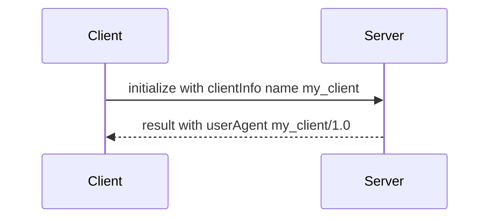
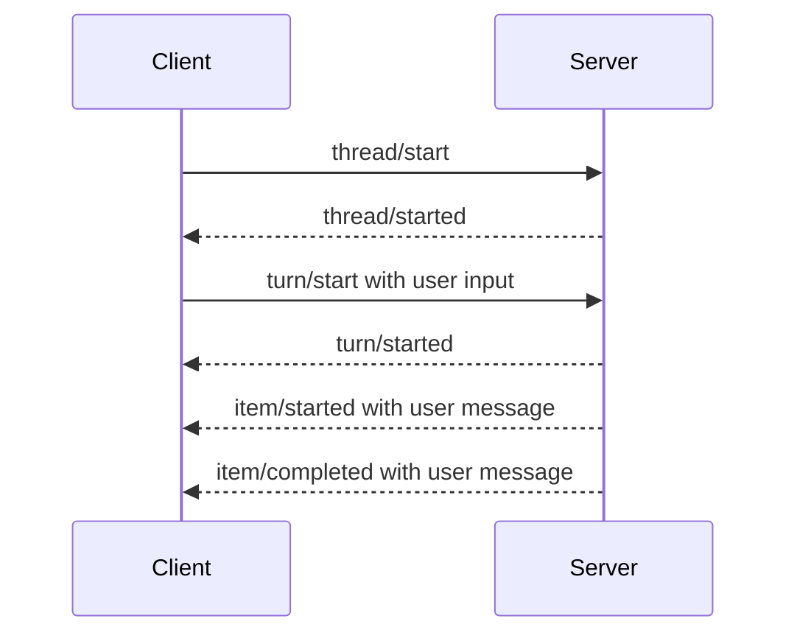
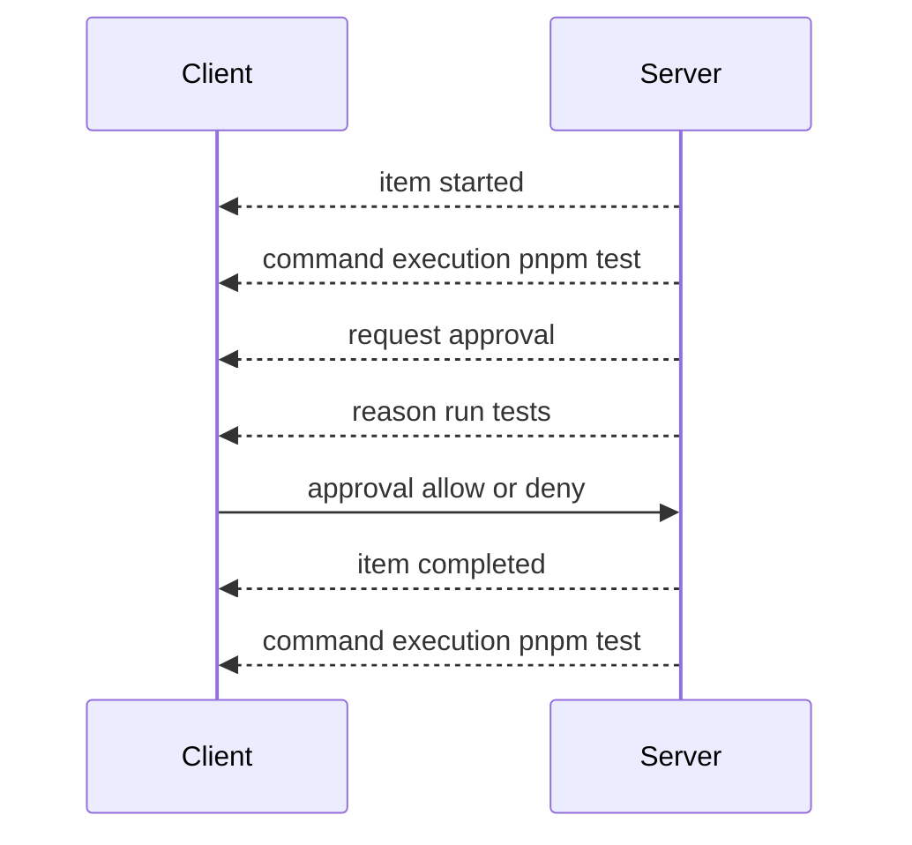
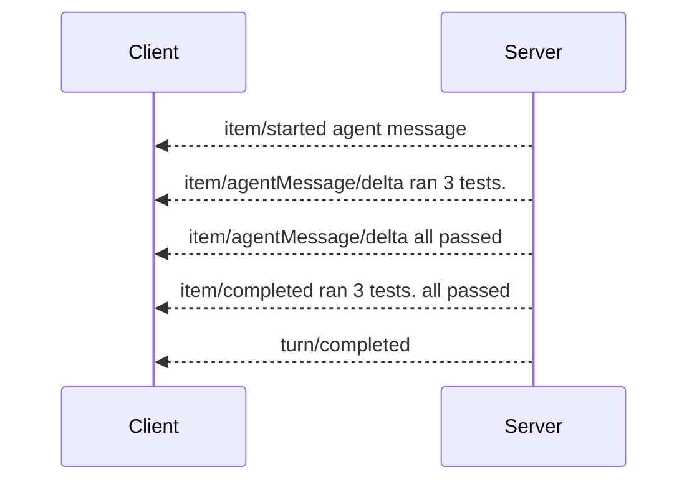
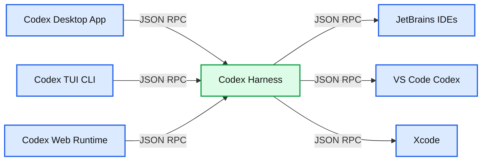

# Unlocking the Codex harness: how we built the App Server

*Learn how to embed the Codex agent using the Codex App Server, a bidirectional JSON-RPC API powering streaming progress, tool use, approvals, and diffs.*

- Source: https://openai.com/index/unlocking-the-codex-harness/
- Published: 2026-02-04
- Authors: Celia Chen
- Categories: Engineering
- Diagrams: 10 candidates, 6 extracted as architecture

OpenAI’s coding agent Codex exists across many different surfaces: [the web app](https://chatgpt.com/codex), [the CLI](https://github.com/openai/codex), [the IDE extension](https://developers.openai.com/codex/ide/), and [the new Codex macOS app](https://openai.com/index/introducing-the-codex-app/). Under the hood, they’re all powered by the same Codex harness—the agent loop and logic that underlies all Codex experiences. The critical link between them? The [Codex App Server](https://developers.openai.com/codex/app-server), a client-friendly, bidirectional JSON-RPC1 API.

In this post, we’ll introduce the Codex App Server; we’ll share our learnings so far on the best ways to bring Codex’s capabilities into your product to help your users supercharge their workflows. We’ll cover the App Server’s architecture and protocol and how it integrates with different Codex surfaces, as well as tips on leveraging Codex, whether you want to turn Codex into a code reviewer, an SRE agent, or a coding assistant.

## Origin of the App Server

Before diving into architecture, it’s helpful to know the App Server’s backstory. Initially, the App Server was a practical way to reuse the Codex harness across products that gradually evolved into our standard protocol.

Codex CLI started as a TUI (terminal user interface), meaning Codex is accessed through the terminal. When we built the VS Code extension (a more IDE-friendly way to interact with Codex agents), we needed a way to use the same harness so as to drive the same agent loop from an IDE UI without re-implementing it. That meant supporting rich interaction patterns beyond request/response, such as exploring the workspace, streaming progress as the agent reasons, and emitting diffs. We first experimented with exposing [Codex as an MCP server](https://github.com/openai/codex/pull/2264), but maintaining MCP semantics in a way that made sense for VS Code proved difficult. Instead, we introduced a JSON-RPC protocol that mirrored the TUI loop, which became the [unofficial first version](https://github.com/openai/codex/pull/4471) of the App Server. At the time, we didn’t expect other clients to depend on the App Server, so it wasn’t designed as a stable API.

As Codex adoption grew over the next few months, internal teams and external partners wanted the ability to embed the same harness in their own products in order to accelerate their users’ software development workflows. For example, JetBrains and Xcode wanted an IDE-grade agent experience, while the Codex desktop app needed to orchestrate many Codex agents in parallel. Those demands pushed us to design a platform surface that both our products and partner integrations could safely depend on over time. It needed to be easy to integrate and backward compatible, meaning we could evolve the protocol without breaking existing clients.

Next, we’ll walk through how we designed the architecture and protocol so different clients can use the same harness.

## Inside the Codex harness

First, let’s zoom in on what’s inside the Codex harness and how the Codex App Server exposes it to clients. In our last Codex [blog](https://openai.com/index/unrolling-the-codex-agent-loop/), we broke down the core agent loop that orchestrates the interaction between the user, the model, and the tools. This is the core logic of the Codex harness, but there’s more to the full agent experience:

**1. Thread lifecycle and persistence**. A thread is a Codex conversation between a user and an agent. Codex creates, resumes, forks, and archives threads, and persists the event history so clients can reconnect and render a consistent timeline.

**2. Config and auth**. Codex loads configuration, manages defaults, and runs authentication flows like “Sign in with ChatGPT,” including credential state.

**3. Tool execution and extensions**. Codex executes shell/file tools in a sandbox and wires up integrations like MCP servers and skills so they can participate in the agent loop under a consistent policy model.

All the agent logic we mentioned here, including the core agent loop, lives in a part of the Codex CLI codebase called “[Codex core](https://github.com/openai/codex/tree/main/codex-rs/core).” Codex core is both a library where all the agent code lives and a runtime that can be spun up to run the agent loop and manage the persistence of one Codex thread (conversation).

To be useful, the Codex harness needs to be accessible to clients. That’s where the App Server comes in.

**Summary:** The diagram shows an App Server process routing JSON-RPC requests between a client, a Codex message processor, thread management, and core threads.

**Components:**

- Client - JSON-RPC client
- Stdio Reader - standard input and output
- Codex Message Processor - JSON-RPC message processing
- Thread Manager - thread lookup and management
- Core Thread - Codex core runtime thread
- JSON-RPC - request and response protocol
- Thread Handle - thread reference
- Events and Updates - asynchronous core thread notifications

**Flows:**

- Client -> Stdio Reader: JSON-RPC requests
- Stdio Reader -> Codex Message Processor: dispatch request
- Codex Message Processor -> Thread Manager: lookup thread
- Thread Manager -> Codex Message Processor: thread handle
- Codex Message Processor -> Core Thread: submit request
- Core Thread -> Codex Message Processor: events and updates
- Codex Message Processor -> Stdio Reader: response or notification
- Stdio Reader -> Client: JSON-RPC response or notification

**Numbers:** none



<sub>source image: https://images.ctfassets.net/kftzwdyauwt9/eErxEn4okb3oc65EvHHBM/b20e2d68b33dd7eb2fab590683bf5d09/OAI_Unlocking_the_Codex_harness_App_server_process_flow_desktop-light.svg</sub>

```mermaid
%% App Server process flow for JSON-RPC requests and thread events
flowchart LR
    C[Client]
    S[Stdio Reader]
    P[Codex Message Processor]
    T[Thread Manager]
    H[Thread Handle]
    R[Core Thread]

    C -->|JSON-RPC requests| S
    S -->|Dispatch request| P
    P -->|Lookup thread| T
    T -->|Thread handle| H
    H -->|Submit request| R
    R -->|Events and updates| P
    P -->|Response or notification| S
    S -->|JSON-RPC response or notification| C

    classDef client   fill:#dbeafe,stroke:#2563eb,stroke-width:2px,color:#111
    classDef service  fill:#dcfce7,stroke:#16a34a,stroke-width:2px,color:#111
    classDef store    fill:#ede9fe,stroke:#7c3aed,stroke-width:2px,color:#111
    classDef cache    fill:#fef3c7,stroke:#d97706,stroke-width:2px,color:#111
    classDef queue    fill:#cffafe,stroke:#0891b2,stroke-width:2px,color:#111
    classDef critical fill:#fee2e2,stroke:#dc2626,stroke-width:4px,color:#111
    classDef external fill:#e5e7eb,stroke:#6b7280,stroke-width:2px,color:#111,stroke-dasharray:4 3
    classDef decision fill:#fce7f3,stroke:#db2777,stroke-width:2px,color:#111

    class C client
    class S,P,T,R service
    class H queue
```

The App Server is both the JSON-RPC protocol between the client and the server and a long-lived process that hosts the Codex core threads. As we can see from the diagram above, an App Server process has four main components: the stdio reader, the Codex message processor, the thread manager, and core threads. The thread manager spins up one core session for each thread, and the Codex message processor then communicates with each core session directly to submit client requests and receive updates.

One client request can result in many event updates, and these detailed events are what allow us to build a rich UI on top of the App Server. Furthermore, the stdio reader and the Codex message processor serve as the translation layer between the client and Codex core threads. They translate client JSON-RPC requests into Codex core operations, listen to Codex core’s internal event stream, and then transform those low-level events into a small set of stable, UI-ready JSON-RPC notifications.

The JSON-RPC protocol between the client and the App Server is fully bidirectional. A typical thread has a client request and many server notifications. In addition, the server can initiate requests when the agent needs input, like an approval, and then pause the turn until the client responds.

## The conversation primitives

Next, we’ll break down the conversation primitives, the building blocks of the App Server protocol. Designing an API for an agent loop is tricky because the user/agent interaction is not a simple request/response. One user request can unfold into a structured sequence of actions that the client needs to represent faithfully: the user’s input, the agent’s incremental progress, artifacts produced along the way (e.g., diffs). To make that interaction stream easy to integrate and resilient across UIs, we landed on three core primitives with clear boundaries and lifecycles:

**1. Item: **An item is the atomic unit of input/output in Codex. Items are typed (e.g., user message, agent message, tool execution, approval request, diff) and each has an explicit lifecycle:

-

`item/started` when the item begins

-

optional `item/*/delta` events as content streams in (for streaming item types)

-

`item/completed` when the item finalizes with its terminal payload

This lifecycle lets clients start rendering immediately on `started`, stream incremental updates on `delta`, and finalize on `completed`.

**2. Turn:** A turn is one unit of agent work initiated by user input. It begins when the client submits an input (for example, “run tests and summarize failures”) and ends when the agent finishes producing outputs for that input. A turn contains a sequence of items that represent the intermediate steps and outputs produced along the way.

**3. Thread:** A thread is the durable container for an ongoing Codex session between a user and an agent. It contains multiple turns. Threads can be created, resumed, forked, and archived. Thread history is persisted so clients can reconnect and render a consistent timeline.

Now, we’ll look at a simplified conversation between a client and an agent, where the conversation is represented by primitives:

**Summary:** The diagram shows a client sending an initialization handshake request to a server and receiving a result response.

**Components:**

- Client - technology unspecified
- Server - technology unspecified

**Flows:**

- Client -> Server: initialize request with clientInfo name my_client
- Server -> Client: result response with userAgent my_client/1.0

**Numbers:** 1, 1.0



<sub>source image: https://images.ctfassets.net/kftzwdyauwt9/5vD305LbxZ3G1OHSoWOMYB/3610785989bdbafeb5398f001549d0d5/OAI_Unlocking_the_Codex_harness_1_Initialization_handshake_desktop-light.svg</sub>

At the beginning of the conversation, the client and the server need to establish the `initialize` handshake. The client must send a single `initialize` request before any other method, and the server acknowledges with a response. This gives the server a chance to advertise capabilities and lets both sides agree on protocol versioning, feature flags, and defaults before the real work begins. Here’s an example payload from OpenAI’s VS Code extension:

```json
{
  "method": "initialize",
  "id": 0,
  "params": {
    "clientInfo": {
      "name": "codex_vscode",
      "title": "Codex VS Code Extension",
      "version": "0.1.0"
    }
  }
}
```

This is what the server returns:

```json
{
  "id": 0,
  "result": {
    "userAgent": "codex_vscode/0.94.0-alpha.7 (Mac OS 26.2.0; arm64) vscode/2.4.22 (codex_vscode; 0.1.0)"
  }
}
```

**Summary:** The diagram shows the client-server thread and turn lifecycle for processing a user message.

**Components:**

- Client - client endpoint, technology unspecified
- Server - server endpoint, technology unspecified
- Thread and turn lifecycle - protocol lifecycle

**Flows:**

- Client -> Server: `thread/start` request
- Server -> Client: `thread/started` event
- Client -> Server: `turn/start` request with user input
- Server -> Client: `turn/started` event
- Server -> Client: `item/started` event containing the user message
- Server -> Client: `item/completed` event containing the user message

**Numbers:** 1, 2



<sub>source image: https://images.ctfassets.net/kftzwdyauwt9/6GFxYOY7QzdeoFtAV45izd/e821e0f39c72c78312f1a5dca030d983/OAI_Unlocking_the_Codex_harness_2_Thread_and_turn_lifecycle_desktop-light.svg</sub>

When a client makes a new request, it will first create a thread and then a turn. The server will send back notifications for progress (`thread/started` and `turn/started`). It will also send back inputs it registers as items, like the user message here.

**Summary:** The diagram shows a client-server tool execution flow where the server requests optional client approval before completing an MCP or shell command.

**Components:**

- Client
- Server
- Tool call using MCP or shell
- Approval required step
- Command execution with `pnpm test`

**Flows:**

- Server -> Client: `item/started` for command execution
- Server -> Client: `item/commandExecution/requestApproval` with reason `run tests`
- Client -> Server: Approval event with `allow` or `deny`
- Server -> Client: `item/completed` for command execution

**Numbers:** 1, 2, 3



<sub>source image: https://images.ctfassets.net/kftzwdyauwt9/7CGQX4E1muzjm8rJFn37Fv/2878164be54ef6f58bb3306e44ab5d4e/OAI_Unlocking_the_Codex_harness_3_Tool_execution_with_optional_approval_desktop-light.svg</sub>

Tool calls are also sent back to the client as items. Additionally, the server may ask for client approval before it can run an action by sending a server request. The approval will pause the turn until the client replies with either “allow” or “deny.” This is what the approval flow looks like in the VS Code extension:

**Summary:** The diagram shows a client-server streaming agent message flow from item start through incremental deltas to completion.

**Components:**

- Client
- Server
- Streaming assistant message

**Flows:**

- Server -> Client: item/started agent message event
- Server -> Client: item/agentMessage/delta event with delta “ran 3 tests.”
- Server -> Client: item/agentMessage/delta event with delta “all passed”
- Server -> Client: item/completed event with the finalized agent message
- Server -> Client: turn/completed event

**Numbers:** 1, 2, 3, 4



<sub>source image: https://images.ctfassets.net/kftzwdyauwt9/5qq1HiRxrRNuKYLIjge0kd/aa81e1da0725ac138a04156a46ae34ca/OAI_Unlocking_the_Codex_harness_4_Streaming_agent_message_flow_desktop-light.svg</sub>

In the end, the server sends an agent message and then ends the turn with `turn/completed`. The agent message delta events stream pieces of the message back until the message is finalized with `item/completed`.

The messages in the diagram are simplified for readability. If you want to see the JSON for a full turn, you can run the test client from the Codex CLI repo:

```bash
codex debug app-server send-message-v2 "run tests and summarize failures"
```

## Integrating with clients

Now, let’s look at how different client surfaces embed Codex via the App Server. We’ll cover three patterns: local apps and IDEs, Codex web runtime, and the TUI.

**Summary:** Codex clients and third-party integrations communicate with the Codex harness through an app server using JSON-RPC.

**Components:**

- Codex Desktop App - client
- Codex TUI / CLI - client
- Codex Web Runtime - client
- Codex Harness - app server
- JetBrains IDEs - third-party integration
- VS Code - third-party integration
- Xcode - third-party integration

**Flows:**

- Codex Desktop App -> Codex Harness: JSON-RPC
- Codex TUI / CLI -> Codex Harness: JSON-RPC
- Codex Web Runtime -> Codex Harness: JSON-RPC
- Codex Harness -> JetBrains IDEs: JSON-RPC
- Codex Harness -> VS Code: JSON-RPC
- Codex Harness -> Xcode: JSON-RPC

**Numbers:** none



<sub>source image: https://images.ctfassets.net/kftzwdyauwt9/5O2eFULLX4nHN5I5YavV6z/da150bc8c6b5ce1e4d76ffea6a0a2fd2/OAI_Unlocking_the_Codex_harness_Integrated_Codex_clients_desktop-light.svg</sub>

Across all three, the transport is JSON-RPC over stdio (JSONL). JSON-RPC makes it straightforward to build client bindings in the language of your choice. Codex surfaces and partner integrations have implemented App Server clients in languages including Go, Python, TypeScript, Swift, and Kotlin. For TypeScript, you can generate definitions directly from the Rust protocol by running:

```bash
codex app-server generate-ts
```

For other languages, you can generate a JSON Schema bundle and feed it into your preferred code generator by running:

```bash
codex app-server generate-json-schema
```

#### Local Apps & IDEs

Local clients typically bundle or fetch a platform-specific App Server binary, launch it as a long-running child process, and keep a bidirectional stdio channel open for JSON-RPC. In our VS Code extension and Desktop App, for example, the shipped artifact includes the platform-specific Codex binary and is pinned to a tested version so the client always runs the exact bits we validated.

Not every integration can ship client updates frequently. Some partners like Xcode decouple release cycles by keeping the client stable and allowing it to point to a newer App Server binary when needed. That way they can adopt server-side improvements (for example, better auto-compaction in Codex core or newly supported config keys) and roll out bug fixes without waiting for a client release. The App Server’s JSON-RPC surface is designed to be backward compatible, so older clients can talk to newer servers safely.

#### Codex Web

Codex Web uses the Codex harness, but runs it in a container environment. A worker provisions a container with the checked-out workspace, launches the App Server binary inside it, and maintains a long-lived JSON-RPC over stdio2 channel. The web app (running in the user’s browser tab) talks to the Codex backend over HTTP and SSE, which streams task events produced by the worker. This keeps the browser-side UI lightweight while still giving us a consistent runtime across desktop and web.

Because web sessions are ephemeral (tabs close, networks drop), the web app cannot be the source of truth for long-running tasks. Keeping state and progress on the server means work continues even if the tab disappears. The streaming protocol and saved thread sessions make it easy for a new session to reconnect, pick up where it left off, and catch up without rebuilding state in the client.

#### TUI/Codex CLI

Historically, the TUI was a “native” client that ran in the same process as the agent loop and talked directly to Rust core types rather than the app-server protocol. That made early iteration fast, but it also made the TUI a special-case surface.

Now that the App Server exists, we plan to [refactor the TUI](https://github.com/openai/codex/pull/10192) to use it so it behaves like any other client: launch an App Server child process, speak JSON-RPC over stdio, and render the same streaming events and approvals. This unlocks workflows where the TUI can connect to a Codex server running on a remote machine, keeping the agent close to compute and continuing work even if the laptop sleeps or disconnects, while still delivering live updates and controls locally.

## Choosing the right protocol

Codex App Server will be the first-class integration method we maintain moving forward, but there are also other methods with more limited functionality. By default, we’d recommend that clients use Codex App Server to integrate with Codex, but it’s worth taking a look at different integration methods and understanding their pros and cons. Below are the most common ways to drive Codex and when each might be a good fit.

### JSON-RPC protocols

#### Codex as an MCP server

Run [`codex mcp-server`](https://developers.openai.com/codex/guides/agents-sdk/) and connect from any MCP client that supports stdio servers (e.g., [OpenAI Agents SDK](https://openai.github.io/openai-agents-js/)). This is a good fit if you already have an MCP-based workflow and want to invoke Codex as a callable tool. The downside is that you only get what MCP exposes, so Codex-specific interactions that rely on richer session semantics (e.g., diff updates) may not map cleanly through MCP endpoints.

#### Cross-provider agent harness protocols

Some ecosystems offer a portable interface that can target multiple model providers and runtimes. This can be a good fit if you want one abstraction that coordinates multiple agents. The tradeoff is that these protocols often converge on the common subset of capabilities, which can make richer interactions harder to represent, especially when provider-specific tool and session semantics matter. This space is evolving quickly, and we expect that more common standards will emerge as we figure out the best primitives to represent real-world agent workflows ([skills](https://agentskills.io/home) is a good example of this).

#### Codex App Server

Choose the App Server when you want the full Codex harness exposed as a stable, UI-friendly event stream. You get both the full functionality of the agent loop and other supporting features like Sign in with ChatGPT, model discovery, and configuration management. The main cost is integration work, since you need to build the client-side JSON-RPC binding in your language. In practice, however, Codex is able to do a lot of the heavy lifting if you feed it the JSON schema and documentation. Many teams we worked with were able to make to a working integration quickly using Codex.

### Other ways to Embed Codex

#### [Codex Exec](https://developers.openai.com/codex/cli/reference/#codex-exec)

A lightweight, scriptable CLI mode for one-off tasks and CI runs. It’s a good fit for automation and pipelines where you want a single command to run to completion non-interactively, stream structured output for logs, and exit with a clear success or failure signal.

#### [Codex SDK](https://developers.openai.com/codex/sdk/)

A TypeScript library for programmatically controlling local Codex agents from within your own application. It’s best when you want a native library interface for server-side tools and workflows without building a separate JSON-RPC client. Since it shipped earlier than the App Server, it currently supports fewer languages and a smaller surface area. If there is developer interest, we may add additional SDKs that wrap the App Server protocol so teams can cover more of the harness surface without writing JSON-RPC bindings.

## Taking this forward

In this post, we shared how we approach designing a new standard for interacting with agents and how to turn the Codex harness into a stable, client-friendly protocol. We covered how the App Server exposes Codex core, lets clients drive the full agent loop, and powers a wide range of surfaces including the TUI, local IDE integrations, and the web runtime.

If this sparked ideas for integrating Codex into your own workflows, it’s worth giving App Server a try. All the source code lives in the Codex CLI open-source [repo](https://github.com/openai/codex/blob/main/codex-rs/app-server/README.md). Feel free to share your feedback and feature requests. We’re excited to hear from you and to keep making agents more accessible to everyone.
