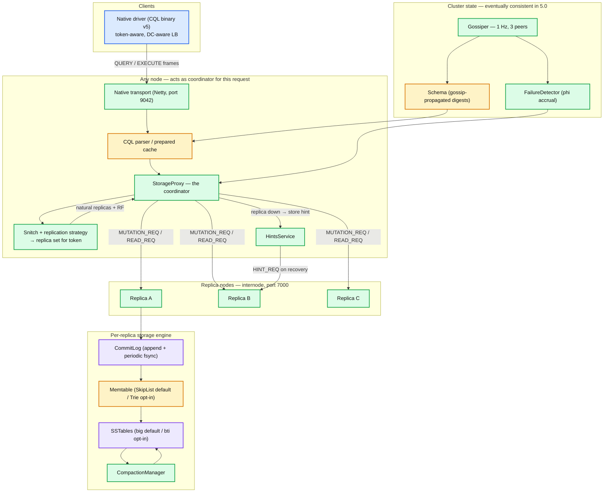
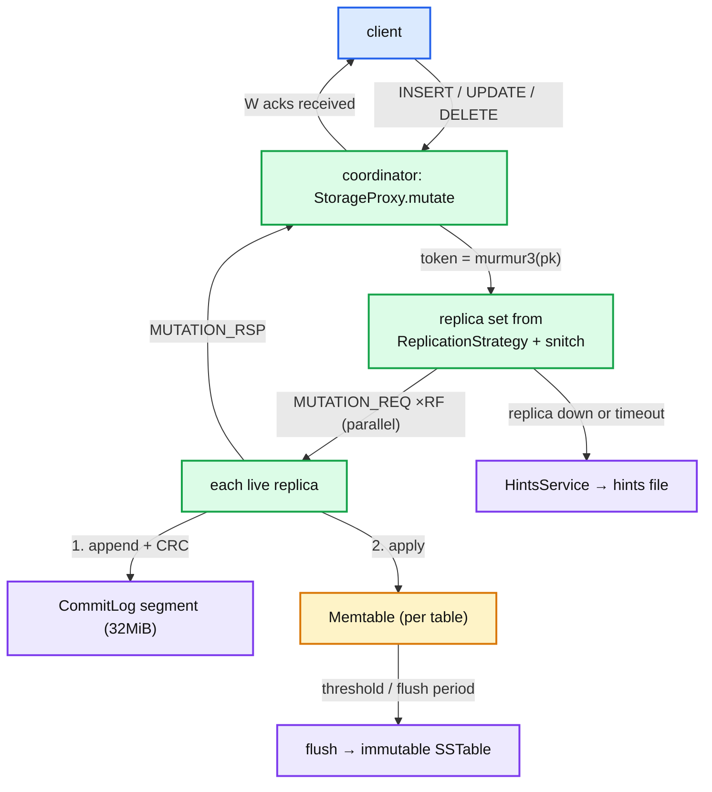
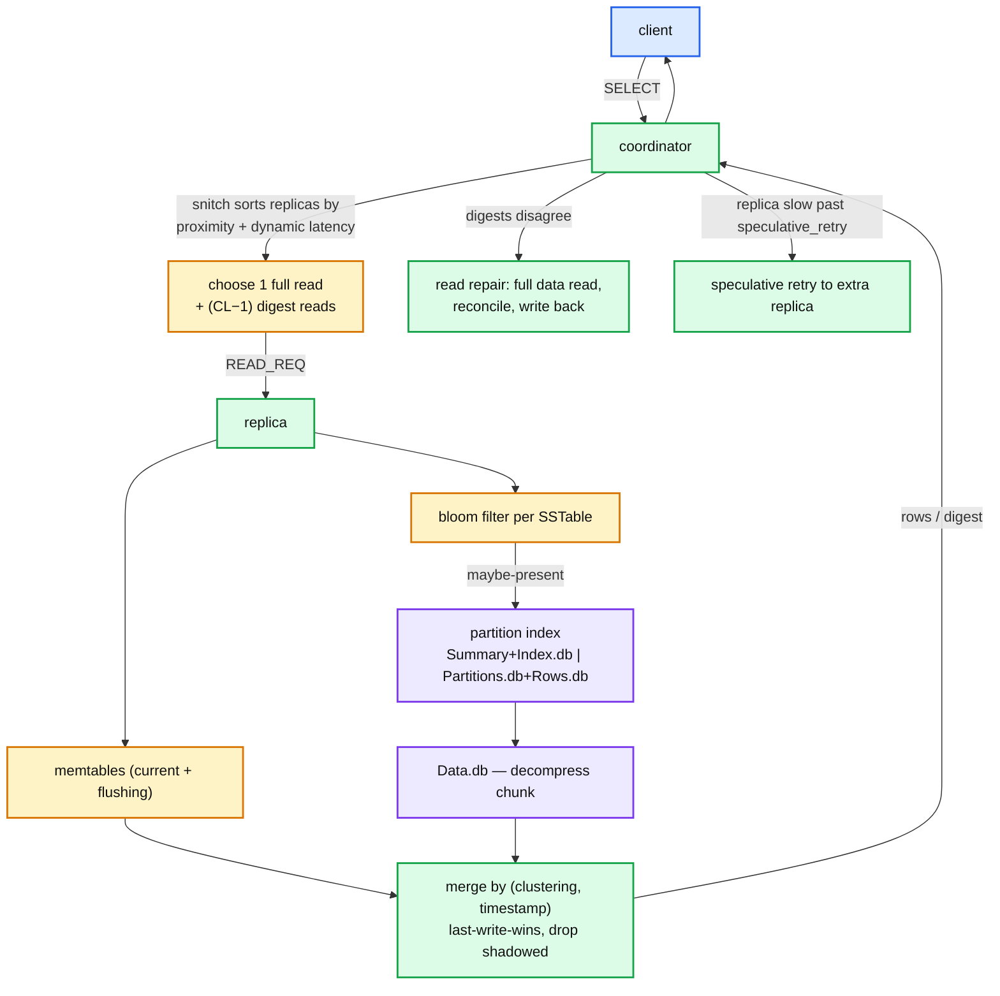
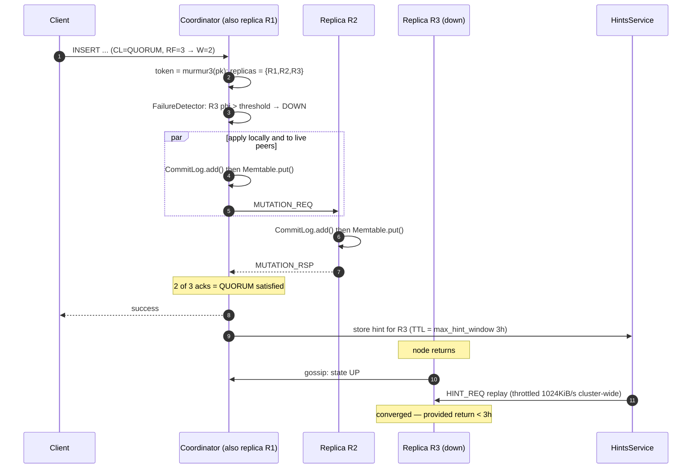

# Cassandra — Overview and Reading Map

**Series baseline: Apache Cassandra 5.0** (GA 2024-09-05; the `cassandra-5.0` branch was at **5.0.10-SNAPSHOT** when this series was verified, latest tagged patch 5.0.9). Every default, config name and CEP status in this series was read out of the `cassandra-5.0` branch — `conf/cassandra.yaml`, `NEWS.txt` and the relevant Java sources — not from memory. Where a number came from documentation or a vendor blog rather than source, it is marked **[doc]**. Where it is a reasoned conclusion rather than a stated fact, it is marked **[inferred]**.

> **Three corrections to the common mental model of "Cassandra 5.0", all verified in source.** Read these before anything else, because most secondary writing about 5.0 gets them wrong.
>
> 1. **Trie memtables are not the default.** `conf/cassandra.yaml` ships `memtable.configurations.default: {inherits: skiplist}`. `TrieMemtable` (CEP-19) is present and supported, but you opt into it per-table or by editing the `default` configuration.
> 2. **BTI is not the default SSTable format.** `sstable.selected_format` defaults to `big`. The comment in `cassandra.yaml` is explicit: *"The default format is `big`, the legacy SSTable format in use since Cassandra 3.0."* BTI (CEP-25) is opt-in.
> 3. **UCS is not the default compaction strategy, and TCM and Accord are not in 5.0 at all.** `default_compaction` falls back to `SizeTieredCompactionStrategy` (`min_threshold: 4`, `max_threshold: 32`). CEP-21 (Transactional Cluster Metadata) and CEP-15 (Accord) were re-targeted from the cancelled 5.1 to **6.0**, which is at `6.0-alpha1` and not GA. [Report 09](cassandra-09-tcm-accord.md) covers them as *the next architecture*, clearly separated from what 5.0 actually runs.
>
> The practical consequence: an out-of-the-box 5.0 node is architecturally a well-tuned 4.1 node. The 5.0 headline features are a menu, not a migration.

---

<!-- nav:start -->
← · **[Index](README.md)** · [01 Storage Engine →](cassandra-01-storage-engine.md)
<!-- nav:end -->

<!-- toc:start -->

<b>Sections in this report (10)</b>

- [1. Overview](#1-overview)
- [2. Architecture](#2-architecture)
- [3. Data flow — the two paths that matter](#3-data-flow--the-two-paths-that-matter)
- [4. Sequence — a `QUORUM` write with one replica down](#4-sequence--a-quorum-write-with-one-replica-down)
- [5. State machine — a node's view of a peer](#5-state-machine--a-nodes-view-of-a-peer)
- [6. The series — what is in each report](#6-the-series--what-is-in-each-report)
- [7. Suggested reading order](#7-suggested-reading-order)
- [8. The six ideas that generalise](#8-the-six-ideas-that-generalise)
- [9. Staff-level questions across the whole system](#9-staff-level-questions-across-the-whole-system)
- [10. Sources](#10-sources)

<!-- toc:end -->

## 1. Overview

- **Problem solved.** Cassandra is a *masterless, partition-tolerant, tunable-consistency wide-column store*. There is no primary, no failover, and no coordination on the common write path. Every node can coordinate any request; every replica is writable at all times. The durable contribution is proving that a Dynamo-style availability model can carry a rich, indexed, CQL-queryable data model.
- **Key design bet #1 — writes never read.** A write is an append to a commitlog plus an insert into an in-memory structure. No read-modify-write, no uniqueness check, no index lookup, no lock. This is why write throughput is close to linear in node count and why `UPDATE` and `INSERT` are the same operation. Everything painful about Cassandra (tombstones, repair, read amplification) is the deferred bill for this.
- **Key design bet #2 — consistency is a per-query dial, not a cluster property.** `R + W > RF` is the operator's lever. The same table serves `ONE` for a feed and `QUORUM` for a balance. The cost is that Cassandra cannot enforce global invariants — hence LWT (Paxos) as an expensive escape hatch, and Accord (CEP-15) as the eventual answer.
- **Key design bet #3 — anti-entropy as a first-class subsystem.** Because replicas diverge by design, Cassandra ships three independent convergence mechanisms at different latencies: hinted handoff (seconds), read repair (query time), and Merkle-tree repair (scheduled). No one of them is sufficient; `gc_grace_seconds` (default **864000**, 10 days) is the deadline by which one of them must have run or you resurrect deleted data.
- **Key design bet #4 — the ring is the schema of the cluster.** Consistent hashing over a 64-bit `Murmur3Partitioner` token space with **`num_tokens: 16`** vnodes per node (5.0 default; was 256 pre-4.0) means placement is computed, not assigned. No metadata server sits on the data path. In 5.0 that ring is propagated by **gossip**, which is eventually consistent — the known correctness hole that CEP-21 closes.
- **Scale it operates at.** Public deployments run thousands of nodes across multiple datacenters (Apple, Netflix, Discord, Uber). The practical per-node envelope in 5.0 is **1–4 TB of data** with STCS/LCS, pushed higher with UCS + BTI **[doc]**; single-digit-millisecond p99 for single-partition reads; and a hard modelling limit of **~100 MB / ~100k rows per partition** before latency and GC degrade.

**The one-sentence version:** *A hash ring assigns every key to RF nodes, each node is an independent LSM-tree store that never coordinates on write, and three separate repair mechanisms race the ten-day tombstone clock to make the replicas agree again.*

---

## 2. Architecture

**What to notice**

- **The coordinator is not a role, it is a request-scoped hat.** Every node runs `StorageProxy`. Token-aware drivers deliberately pick a coordinator that is *also* a replica, which removes one network hop from the critical path — that single client-side optimisation is worth more p99 than most server tuning.
- **There is no metadata service on the data path.** The replica set is *computed* from the token and the keyspace's replication strategy, locally, with no lookup. This is the structural difference from HBase (needs `hbase:meta`), MongoDB (needs config servers) and Kubernetes (needs the apiserver).
- **The storage engine is per-node and knows nothing about replication.** A replica applies a mutation with no idea whether it is the first or third to do so. Idempotence comes from every cell carrying its own timestamp, not from any protocol.
- **Cluster state travels on a different, slower, weaker channel than data.** Gossip is 1 Hz and eventually consistent while mutations are synchronous RPC. Every split-brain and schema-disagreement incident in Cassandra's history lives in that gap.

---

## 3. Data flow — the two paths that matter

### 3.1 Write path

**What to notice**

- **Durability and visibility are two different steps with no ordering guarantee between replicas.** The commitlog append makes the write survive a crash; the memtable insert makes it visible. `commitlog_sync: periodic` with `commitlog_sync_period: 10000ms` means a node can lose up to **10 seconds** of acknowledged writes on power loss — the single most misunderstood default in the system. `batch` mode fsyncs before ack and costs an order of magnitude.
- **The coordinator sends to *all* live replicas and waits for *W*.** It does not send to only W. The extra copies are what make later consistency levels satisfiable and what make hinted handoff a rare path rather than the norm.
- **A write is never a read.** No existence check, no constraint, no index probe. `INSERT` and `UPDATE` compile to the identical mutation; "upsert" is not a feature, it is the absence of one.
- **The hint is written on the coordinator, not the replica.** It is a coordinator-side liability for a peer, replayed for at most `max_hint_window: 3h`. Past that window, only repair can fix the divergence.

### 3.2 Read path

**What to notice**

- **Reads are the expensive direction, and read cost is proportional to the number of SSTables that could hold the key.** This is the entire justification for compaction strategies, bloom filters and partition indexes. The write path's refusal to read is paid for here.
- **Only one replica sends data; the rest send digests.** An MD5 of the result set. Mismatch escalates to a full read from all — cheap in the common case, a latency cliff when replicas are inconsistent.
- **Merge is last-write-wins per cell on a client-supplied-or-coordinator-assigned microsecond timestamp.** Not per row. Two concurrent updates to different columns of one row both survive; two to the same column resolve by timestamp, ties broken by value bytes.
- **A tombstone is a row you must still read.** Deleted data is *added* data until compaction removes it, and `tombstone_failure_threshold: 100000` will abort the query rather than let a scan of graveyards take the node down.

---

## 4. Sequence — a `QUORUM` write with one replica down

**What to notice**

- **The client's success is returned before all replicas have the data, by design.** `QUORUM` promises that any later `QUORUM` read intersects this write set — not that all three copies exist.
- **Failure detection precedes the write attempt.** The coordinator does not time out against R3; the phi-accrual detector has already marked it down, so the hint is written immediately. This is why a *slow* node is worse than a *dead* node — it stays UP and burns the request timeout.
- **The hint has a hard expiry and a throttle.** `max_hint_window: 3h` and `hinted_handoff_throttle: 1024KiB` (cluster-wide, divided across `max_hints_delivery_threads: 2`). A node down for four hours is a repair job, not a hint replay.
- **Nothing in this sequence is a lock or a leader.** Two clients writing the same key concurrently both succeed; the timestamps decide, and one write silently loses. That is the contract.

---

## 5. State machine — a node's view of a peer

```mermaid
stateDiagram-v2
  [*] --> Unknown
  Unknown --> Joining: "gossip STATUS=BOOT, streaming ranges in"
  Joining --> Normal: "STATUS=NORMAL, tokens claimed"
  Normal --> Down: "phi accrual > phi_convict_threshold (8)"
  Down --> Normal: "gossip heartbeat resumes; hints replay"
  Normal --> Leaving: "nodetool decommission — STATUS=LEAVING"
  Leaving --> Left: "ranges streamed to new owners"
  Left --> [*]
  Normal --> Moving: "nodetool move — token change"
  Moving --> Normal: "streaming complete"
  Down --> Removed: "nodetool removenode / assassinate"
  Removed --> [*]
```

**What to notice**

- **`Down` is a *local* opinion, not a cluster fact.** Each node runs its own failure detector over its own gossip arrival intervals. Two nodes can legitimately disagree about whether a third is up, and in 5.0 nothing reconciles that — it is the same class of hole as gossip-propagated schema.
- **`phi_convict_threshold: 8`** is a log-scale suspicion level, not a timeout. Raise it on noisy/cloud networks to reduce flapping; lower it for faster detection at the cost of false positives.
- **There is no `Rejoining-with-different-data` transition, and that is the danger.** A node that returns after `gc_grace_seconds` with stale SSTables will resurrect deleted rows. 5.0 added a startup data-resurrection check; the operational rule is unchanged — past gc_grace, wipe and re-bootstrap, never just start it.
- **`Leaving` and `Moving` are streaming operations that change ownership while serving traffic.** Ownership changes in 5.0 are gossip-propagated and *not* linearizable, which is precisely why concurrent topology changes are forbidden and why CEP-21 exists.

---

## 6. The series — what is in each report

| # | Report | Covers | Read it when you need to reason about |
|---|--------|--------|----------------------------------------|
| 00 | `cassandra-00-overview.md` | This file: model, ring, the three 5.0 corrections, reading order | Orientation; before quoting any "5.0 default" |
| 01 | [`cassandra-01-storage-engine.md`](cassandra-01-storage-engine.md) | CommitLog, memtables (skiplist vs trie), SSTable `big` vs `bti` on-disk formats, compression chunks, cell encoding | Flush behaviour, disk layout, format migration, durability settings |
| 02 | [`cassandra-02-write-path.md`](cassandra-02-write-path.md) | `StorageProxy.mutate`, batches, counters, CAS/LWT, CDC, per-stage threading, back-pressure | Write latency, batch misuse, counter semantics, LWT cost |
| 03 | [`cassandra-03-read-path.md`](cassandra-03-read-path.md) | Bloom filters, key cache, partition index, chunk cache, row cache, merge iterators, tombstone handling | Read latency, SSTables-per-read, cache sizing, tombstone incidents |
| 04 | [`cassandra-04-compaction.md`](cassandra-04-compaction.md) | STCS, LCS, TWCS, UCS (CEP-26) with source-verified defaults, tombstone purging, write/read/space amplification | Choosing a strategy, compaction backlog, disk headroom, TTL data |
| 05 | [`cassandra-05-coordinator-consistency.md`](cassandra-05-coordinator-consistency.md) | Consistency levels, snitches, dynamic snitch, hinted handoff, read repair, speculative retry, LWT/Paxos | Availability maths, multi-DC latency, tail latency, when LWT is wrong |
| 06 | [`cassandra-06-membership-gossip.md`](cassandra-06-membership-gossip.md) | Gossip protocol and state, phi-accrual failure detection, token ring, vnodes, token allocation, schema propagation | Flapping nodes, schema disagreement, seed design, ring imbalance |
| 07 | [`cassandra-07-repair-streaming.md`](cassandra-07-repair-streaming.md) | Merkle trees, full/incremental/preview repair, subrange, bootstrap, decommission, zero-copy streaming, CEP-37 auto-repair | Repair scheduling, gc_grace, overstreaming, node replacement |
| 08 | [`cassandra-08-cql-sai.md`](cassandra-08-cql-sai.md) | CQL type system and statement execution, prepared statements, paging, legacy 2i, SASI, SAI (CEP-7), vectors (CEP-30) | Data modelling, index choice, ANN search, query fan-out |
| 09 | [`cassandra-09-tcm-accord.md`](cassandra-09-tcm-accord.md) | **Not in 5.0.** CEP-21 TCM / Cluster Metadata Service and CEP-15 Accord: design, epochs, fast path, migration | Roadmap decisions, 6.0 planning, why gossip metadata is a correctness bug |
| 10 | [`cassandra-10-scale-operations.md`](cassandra-10-scale-operations.md) | Node density, JVM/GC, multi-DC, backup, monitoring, guardrails, capacity maths, failure modes | Production operation, sizing, incident response |
| 11 | [`cassandra-11-delta-and-version-matrix.md`](cassandra-11-delta-and-version-matrix.md) | 4.0 → 4.1 → 5.0 → 6.0-alpha feature/default matrix, unit-suffixed config renames, DataStax/Astra divergence, errata | Before quoting any number from reports 01–10 |
| — | [`patterns.md`](patterns.md) | Cross-system pattern catalogue, now with a Cassandra column | Comparing Cassandra to Kubernetes, etcd, Kafka in a design discussion |

---

## 7. Suggested reading order

1. **01 (storage engine)** and **02 (write path)** together. The LSM tree plus "writes never read" derives most of the rest.
2. **03 (read path)** and **04 (compaction)** together — they are two halves of one trade-off and cannot be understood apart.
3. **05 (coordinator/consistency)** — the distributed-systems core, and where Staff-level interview questions concentrate.
4. **06 (membership)** and **07 (repair/streaming)** — the operational reality, and where most production incidents originate.
5. **08 (CQL/SAI)** — the layer application engineers actually touch; read it when data modelling.
6. **09 (TCM/Accord)** — the future, and the cleanest explanation of what is *wrong* with 5.0.
7. **10**, then **11** kept open whenever quoting a number.

---

## 8. The six ideas that generalise

- **Refusing to read on the write path is the highest-leverage decision in a storage engine.** It buys linear write scaling and crash-simple durability. It sells read amplification, background compaction, tombstones and anti-entropy. Every LSM system (RocksDB, HBase, ScyllaDB, Kafka's log) is somewhere on this same trade curve; Cassandra sits at the far end.
- **Making consistency a per-request parameter moves a design decision to the person who has the context.** The bet is that the application knows which reads are cheap to get wrong. It is a genuinely good bet, and it fails exactly where cross-key invariants are needed — which is why Paxos and Accord are bolted alongside rather than woven in.
- **Deletion in a distributed, append-only, eventually-consistent store is unsolvable without a deadline.** Tombstones plus `gc_grace_seconds` is the shape of the answer everywhere: you cannot forget a fact until you are sure everyone has heard it, and "sure" has to be a timer because there is no global observer.
- **Computed placement beats looked-up placement — until topology changes.** Consistent hashing removes the metadata hop entirely, at the price of making membership changes the hardest operation in the system. CEP-21 is the admission that computed placement still needs a linearizable log describing *which* computation is current.
- **Redundant convergence mechanisms at different latencies.** Hints (seconds), read repair (query-time), full repair (scheduled). None is sufficient; none is removable. Layered anti-entropy at different timescales is the general pattern for any system that lets replicas diverge.
- **Defaults encode the release the project dared to ship, not the design it believes in.** 5.0 ships trie memtables, BTI and UCS switched *off*. Reading `cassandra.yaml` rather than the release announcement is the difference between knowing a system and knowing its marketing.

---

## 9. Staff-level questions across the whole system

1. **A `QUORUM` write returns success. The coordinator then dies. Is the write durable? Under what settings is the honest answer "probably"?**
   With RF=3 and `QUORUM`, two replicas acked. Each appended to its commitlog before acking — but with the default `commitlog_sync: periodic` / `commitlog_sync_period: 10000ms`, "appended" means "in the OS page cache", not fsynced. A correlated power loss across both acking replicas within the 10s window loses an acknowledged write. `commitlog_sync: batch` closes it at a large throughput cost. The subtler answer: the loss window is bounded by the sync period, so the real mitigation is usually rack/AZ-diverse replica placement, not `batch`.

2. **Why is a slow node worse than a dead node, and what mechanisms exist for each?**
   A dead node is convicted by the phi-accrual detector, removed from the replica candidate set, and its writes become hints — cost is near zero. A slow node stays UP, is chosen by the snitch, and burns `read_request_timeout: 5000ms` on every query routed to it, poisoning p99 across the cluster. The defences are the *dynamic* snitch (`dynamic_snitch_update_interval: 100ms`, `badness_threshold: 1.0`) demoting it by observed latency, and `speculative_retry` firing a duplicate read at another replica past a percentile. Neither ejects it; that requires an operator.

3. **You run `nodetool repair` weekly. `gc_grace_seconds` is 10 days. A node is down for 5 days and you restart it. What can go wrong, and what should you have done?**
   Nothing yet — 5 days < 10 days, so tombstones the node missed are still present on peers and repair will propagate them. The danger is the *next* case: past gc_grace, peers have compacted those tombstones away, and the returning node's surviving original rows have no tombstone to shadow them. Repair then propagates *resurrected deletes* to the whole cluster. Correct procedure past gc_grace is wipe-and-rebootstrap, or `nodetool removenode` and replace. 5.0's startup data-resurrection check helps but does not remove the rule.

4. **The team wants a uniqueness constraint on an email column. Walk through the options and their real costs.**
   LWT (`INSERT ... IF NOT EXISTS`) gives linearizability per partition via Paxos — four round trips in the worst case, `cas_contention_timeout: 1000ms`, and it degrades badly under contention on the same key. It also does *not* compose across partitions, so "unique email" needs email to be the partition key of a dedicated table, with the application handling the two-table write non-atomically. A materialized view is not an answer (`materialized_views_enabled: false` by default in 5.0 for good reason). SAI gives you the query but no constraint. The honest Staff answer is often: put uniqueness in a system that does it natively, or accept eventual dedup. Accord ([report 09](cassandra-09-tcm-accord.md)) is the first design that makes this a first-class multi-partition transaction.

5. **You are asked to double per-node data density to cut cluster cost. What do you change, and what breaks first?**
   Enable UCS (`unified_compaction.target_sstable_size` 1GiB, `base_shard_count` 4, `scaling_parameters` T4) for density-aware sharded compaction, and BTI (`sstable.selected_format: bti`) so the partition index is a trie that stays effective at large SSTable sizes rather than a `Summary.db` that must be held in heap. What breaks first is *operations, not steady state*: bootstrap, decommission and repair times scale with per-node data, so a 4 TB node that takes 8 hours to stream becomes a 12 TB node that takes a day, and your MTTR and your ability to survive a second failure during recovery both degrade. Density is bought with recovery time, and that is the trade to argue about.

---

## 10. Sources

- [Apache Cassandra documentation](https://cassandra.apache.org/doc/latest/) and [New Features in 5.0](https://cassandra.apache.org/doc/latest/new)
- [`apache/cassandra`, branch `cassandra-5.0`](https://github.com/apache/cassandra/tree/cassandra-5.0) — `conf/cassandra.yaml`, `NEWS.txt`, and sources under `src/java/org/apache/cassandra/`. **All defaults in this series were read here.**
- [Cassandra Enhancement Proposals (CEP index)](https://cwiki.apache.org/confluence/display/CASSANDRA/Cassandra+Enhancement+Proposals)
- Lakshman & Malik — *Cassandra: A Decentralized Structured Storage System*, SIGOPS 2010
- DeCandia et al. — *Dynamo: Amazon's Highly Available Key-value Store*, SOSP 2007
- Chang et al. — *Bigtable: A Distributed Storage System for Structured Data*, OSDI 2006
- Hayashibara et al. — *The φ Accrual Failure Detector*, SRDS 2004
- Per-subsystem sources are listed in each report's section 12.

---

---

<!-- nav:start -->
← · **[Index](README.md)** · [01 Storage Engine →](cassandra-01-storage-engine.md)
<!-- nav:end -->
